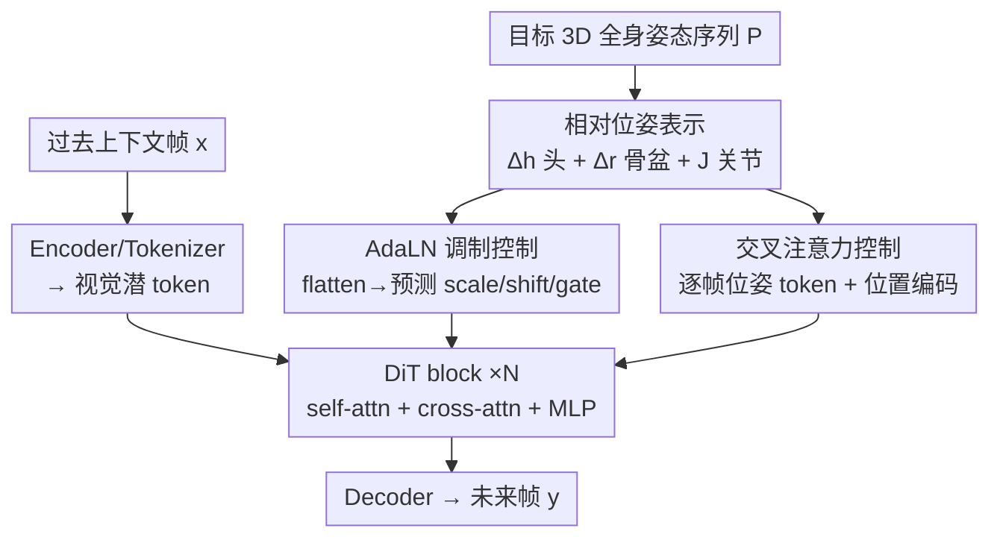

# EgoControl: Controllable Egocentric Video Generation via 3D Full-Body Poses

**会议**: CVPR 2026  
**论文**: [CVF Open Access](https://openaccess.thecvf.com/content/CVPR2026/html/Pallotta_EgoControl_Controllable_Egocentric_Video_Generation_via_3D_Full-Body_Poses_CVPR_2026_paper.html)  
**代码**: https://cvg-bonn.github.io/EgoControl (项目页)  
**领域**: 视频生成 / 扩散模型 / 具身智能  
**关键词**: 第一视角视频生成, 3D全身姿态控制, 视频扩散, 相对位姿表示, AdaLN调制

## 一句话总结
EgoControl 在预训练视频扩散模型 Cosmos 上，用「相对头部位姿 + 以骨盆为根的关节位姿」这一紧凑表示，通过 AdaLN 调制与位姿 token 交叉注意力双通路注入控制信号，实现了由第一视角佩戴者 3D 全身姿态精确驱动的未来帧预测，相机视角与可见肢体动作都能对齐控制姿态。

## 研究背景与动机

**领域现状**：让具身智能体能在脑海里「预演」自己动作的视觉后果，是规划、预测、交互（AR/VR、遥操作）的关键能力。这要求生成模型不仅画面逼真，还得能被细粒度、物理上合理的身体级指令所控制。当前 SOTA 视频生成模型（如 Cosmos、各种 DiT-based 扩散/flow-matching）画质很强，也支持文本、相机轨迹等高层条件。

**现有痛点**：现有的可控视频生成存在两条死角。其一，文本/相机轨迹这类条件**无法直接控制相机佩戴者的关节化身体**——而第一视角里相机运动恰恰来自佩戴者头部的全局平移与旋转，胳膊、手、腿这些局部关节运动又制造了定义第一视角场景的遮挡和物体交互。其二，已有的人体姿态可控生成几乎都是**第三视角 + 2D 骨架**：主体大体可见、相机运动有限，2D 姿态根本搬不到第一视角上来。

**核心矛盾**：第一视角是一个「强视点变化 + 频繁自遮挡 + 丰富手物交互」的极端场景，身体姿态和视觉观测被紧紧耦合（头动则视角动，手动则画面里出现手）。要忠实模拟某个具体动作（伸手、边走边转、抓取物体）的视觉后果，必须能指定**完整的 3D 全身姿态序列**——这正是已有条件模态缺失的。

**本文目标**：训练一个第一视角视频预测模型，让它在给定一小段过去观测帧 + 一段目标全身姿态序列后，生成时序连贯、且与控制姿态对齐的未来帧。

**切入角度**：第一视角下绝大多数画面变化来自相机（=头部）运动，因此姿态表示要反映「智能体自身的运动」而非它在世界里的绝对坐标——用帧间相对变换而非全局绝对位姿来编码。

**核心 idea**：设计一个同时编码全局相机动力学与关节化身体动力学的紧凑相对位姿表示，并用「调制 + 交叉注意力」双通路把它塞进扩散过程，从而把身体运动准确翻译成第一视角的视觉结果。EgoControl 是首个用 3D 全身姿态显式控制第一视角视频生成的模型。

## 方法详解

### 整体框架

EgoControl 基于一个潜空间条件视频扩散模型（backbone 用 Cosmos）。tokenizer $E$ 把帧映射为连续潜变量 $z_0 = E(x)$；前向过程按 EDM 公式用连续噪声水平 $\sigma$ 扰动干净潜变量 $z = z_0 + \sigma\varepsilon,\ \varepsilon\sim\mathcal{N}(0,I)$，去噪网络（一个 DiT）则直接预测干净潜变量：

$$\mathcal{L}(\theta) = \mathbb{E}_{z_0,\varepsilon,\sigma,c}\big[\,w(\sigma)\,\lVert z_\theta(z,\sigma,c) - z_0\rVert_2^2\,\big]$$

关键在于上下文 $c$ 不只含过去视觉上下文 $x=(x_1,\dots,x_N)$，还含表达「未来运动意图」的人体姿态序列 $P=(p_1,\dots,p_M)$。整条 pipeline 是：过去帧经 encoder 编码 → 姿态序列先转成相对位姿表示、再分两路注入每个 DiT block（一路 AdaLN 调制、一路位姿 token 交叉注意力）→ 去噪 → decoder 解出未来帧 $y=(y_1,\dots,y_M)$。两路缺一不可：调制路负责画质与全局头部运动，交叉注意力路负责细粒度的关节身体对齐。

### 关键设计

**1. 相对位姿表示：用帧间差分而非全局绝对坐标喂运动**

第一视角数据集（这里用 Nymeria）给的是全局参考系下的逐帧 3D 身体姿态，每个姿态是 $J=23$ 个关节相对全局系的位姿矩阵。但模型要从「具身视角」运作，关心的是自身运动而非绝对位置，所以本文把整段 $P$ 拆成三块相对量再拼回去。

头部：第一视角里几乎所有画面变化来自相机（=头部）运动，对全局头部位姿序列 $H=(H_0,\dots,H_M),\ H_i\in\mathbb{R}^{4\times4}$，计算相邻帧间的相对头部变换 $\Delta H_i = H_i H_{i-1}^{-1}$，再转成 6D 向量 $\Delta h_i\in\mathbb{R}^{1\times6}$（平移 + 欧拉角旋转），得到头部运动序列 $\Delta h\in\mathbb{R}^{M\times1\times6}$。骨盆：把骨盆当根关节，同样算它的帧间相对运动 $\Delta r\in\mathbb{R}^{M\times1\times6}$。其余关节：算所有关节相对骨盆的变换 $J\in\mathbb{R}^{M\times21\times6}$（21 = 除头和骨盆外的关节数）。最后拼接得到统一表示

$$P = [\Delta h,\ \Delta r,\ J]\in\mathbb{R}^{M\times23\times6}$$

为什么差分而非累积/绝对？消融（Tab. 5）显示：把头部编码成相对初始帧 $H_0$ 的累积变换时，平移误差几乎是差分版的两倍——累积表示随序列变长数值越滚越大、不稳定；差分表示给出更稳、时序更准的信号。关节用「相对骨盆」而不是「逐帧差分 $\Delta j$」也更好：以骨盆为中心的坐标系让关节动力学更鲁棒、更易学，mIoU 高出约 5.55。

**2. AdaLN 调制控制：让全身姿态调制每层归一化与残差**

这一路解决「怎么把一整段姿态作为全局条件影响所有 DiT 层」。先把姿态张量 $P\in\mathbb{R}^{M\times23\times6}$ 沿时间和关节展平成单个全局向量 $P_{\text{flat}}$，再用一对两层 MLP $g_e,g_m$ 映射到嵌入与调制空间：$e_P=g_e(P_{\text{flat}})$，$m_P^{\beta\gamma g}=[m_P^\beta,m_P^\gamma,m_P^g]=g_m(P_{\text{flat}})$。然后对每个 block 的 self-attn / cross-attn / MLP 三个组件分别预测 shift、scale、gate 参数：

$$[\beta_P^{(k)},\gamma_P^{(k)},g_P^{(k)}] = W_{m1}^k W_{m2}^k\,\mathrm{SiLU}(e_P) + m_P^{\beta\gamma g}$$

其中 $W_{m2}^k\in\mathbb{R}^{r\times d}$ 是低秩投影（$r<d$）。每个组件输入 $u$ 先做自适应层归一化 $\mathrm{AdaLN}^{(k)}(u) = \mathrm{LN}(u)\odot(1+\gamma_P^{(k)})+\beta_P^{(k)}$，输出再被门控并经残差合并，例如 $u \leftarrow u + g_P^{(\text{self})}\odot \mathrm{SelfAttn}(\mathrm{AdaLN}^{(\text{self})}(u))$，交叉注意力与 MLP 同理。值得一提的是扩散步 $t$ 也走同一套机制：$t$ 经正弦嵌入 $e_t=\mathrm{sinusoidal}(t)$，预测出 $m_t^{\beta\gamma g}$ 后**加性融合**进姿态调制——$e_P \leftarrow e_t + e_P$，$m_P^{\beta\gamma g}\leftarrow m_t^{\beta\gamma g} + m_P^{\beta\gamma g}$，于是扩散步和身体姿态共同调制整个 transformer 的归一化与残差动力学。消融里这一路擅长画质与全局头部运动（TransError/RotError 更优），但单独用时按不住细粒度关节。

**3. 位姿 token 交叉注意力控制：保留时序结构做逐帧细粒度对齐**

AdaLN 把整段姿态压成一个全局向量，丢了时序结构，因此细粒度的关节对齐（如某一帧手该在哪）做不好。这一路反其道而行：**保留 $P$ 的时序结构**做帧级对齐。把每帧的姿态向量 $P_m\in\mathbb{R}^{23\times6}$ 投影到特征空间 $P_m' = \mathrm{LayerNorm}(\mathrm{GELU}(W_p P_m))$，得到 $M$ 个位姿 token，再加正弦位置编码保留时序 $c_m = \mathrm{PE}(P_m')$。这些 token 拼起来当作 cross-attn 的上下文 $c$，与编码后的视觉 token 做交叉注意力，提供「时序局部化」的控制信号。它和 AdaLN 的全局调制互补：消融（Tab. 4）里单独交叉注意力的身体对齐（mIoU 37.84）明显强于单独 AdaLN（33.44），但画质/全局运动略弱；两者结合（AdaLN+CA）在画质、全局运动上都最好，身体对齐也与纯交叉注意力相当。

### 损失函数 / 训练策略
训练目标即上文 EDM 形式的去噪重建损失 $\mathcal{L}(\theta)$（直接回归干净潜变量，按 $w(\sigma)$ 加权）。backbone 用 cosmos-predict2（2B、480p、16 FPS）预训练模型；在 45 帧视频上训练，用 13 帧过去帧作条件、生成 32 帧（2 秒）未来帧，由 3D 全身姿态控制。Cosmos-Tokenizer 在时空压缩潜空间里把输入压到 12 个潜帧。消融实验为节省成本只训 7,000 iterations（少于主表）。

## 实验关键数据

数据集用 Nymeria（迄今最大的「野外」人体动作捕捉数据集，1408×1408@30FPS 第一视角视频 + XSens 全身动捕的 3D 姿态）。重采样到 16 FPS、480×480，选 186 段视频（约 50 小时）切成不重叠的 45 帧片段。评测协议沿三个维度：视觉保真（SSIM/LPIPS/DreamSim/FVD，后三者×100）、全局运动控制（用 Vipe 抽相机位姿算 TransError/RotError）、身体控制（用 SAM2 分割追踪可见手臂，算手臂掩码 mIoU 与手臂存在检测 Acc%）。

### 主实验

| 配置 | SSIM↑ | LPIPS↓ | DreamSim↓ | FVD↓ | TransErr↓ | RotErr↓ | mIoU↑ | Acc%↑ |
|------|-------|--------|-----------|------|-----------|---------|-------|-------|
| Base Cosmos（现成） | 42.29 | 50.62 | 23.00 | 71.00 | 16.53 | 15.60 | 20.03 | 85.36 |
| Finetuned（仅过去帧，无姿态） | 47.47 | 45.74 | 18.14 | 40.70 | 9.93 | 13.65 | 25.13 | 85.20 |
| Head control（仅头部 $\Delta h$） | 56.94 | 29.71 | 10.22 | 22.68 | 5.16 | 3.29 | 33.70 | 91.14 |
| **Body control（全身 $P$，本文）** | **58.60** | **26.71** | **8.54** | **20.18** | **4.90** | **2.96** | **52.13** | **96.33** |

全身控制相比仅头部控制，手臂对齐 mIoU 相对提升近 55%，96% 以上的帧手臂可见性与真值一致；有意思的是全身信息**反过来还提升了相机视角与头部姿态的一致性**（TransError/RotError 也更低），说明全身上下文对全局相机控制也有帮助。

与同类方法对比（外部 baseline）：

| 对比 | 设置 | 关键指标 | PEVA/CAMI2V | EgoControl |
|------|------|----------|-------------|-----------|
| vs PEVA XXL（Tab.2） | 2 秒后单帧、224×224 | LPIPS↓ / DreamSim↓ / FID↓ | 29.8 / 18.6 / 61.10 | **24.3 / 11.3 / 50.68** |
| vs CAMI2V（Tab.3） | 前 16 帧 | SSIM↑ / TransErr↓ / RotErr↓ / mIoU↑ | 43.28 / 4.60 / 3.79 / 24.72 | **58.87 / 2.22 / 1.33 / 56.85** |

EgoControl 用更短上下文窗口仍超过自回归单帧的 PEVA，并大幅优于相机控制方法 CAMI2V（⚠️ 跨方法比较有协议差异：PEVA 生单帧、CAMI2V 帧数少，对比时做了降采样/截断对齐，绝对数值不可直接横比）。

### 消融实验

| 控制机制（Tab.4，7k iter） | SSIM↑ | DreamSim↓ | FVD↓ | mIoU↑ | TransErr↓ | RotErr↓ |
|------|-------|-----------|------|-------|-----------|---------|
| AdaLN | 52.16 | 11.48 | 29.14 | 33.44 | 6.07 | 5.99 |
| Cross-attn (CA) | 51.65 | 12.20 | 29.28 | 37.84 | 6.85 | 7.19 |
| **AdaLN + CA** | **52.60** | **10.94** | **27.51** | 37.40 | **5.59** | **5.23** |

| 位姿表示（Tab.5） | 关键对比 | 结论 |
|------|---------|------|
| 头部：Cumulative vs **Differential** | TransError 12.31 → **6.75** | 累积表示随序列增长数值不稳，差分版近乎减半误差 |
| 全身：$[\Delta j]\times23$ vs **$[\Delta h,\Delta r,J]$** | mIoU 31.85 → **37.40** | 以骨盆为中心比逐关节帧间差分更稳，mIoU +5.55 |

### 关键发现
- **两条控制路分工明确且互补**：AdaLN 抓画质与全局头部运动，交叉注意力抓细粒度关节对齐；二者合并在画质/全局运动上最佳、身体对齐与纯 CA 持平，故必须 hybrid。
- **差分相对表示是数值稳定性的关键**：累积/绝对位姿在长序列上数值膨胀导致不稳，帧间差分给出时序更准的控制信号。
- **以骨盆为根的关节坐标系更易学**：比逐关节帧间差分鲁棒得多（mIoU +5.55）。
- **逐帧曲线（Fig.4）**：AdaLN+CA 及完整训练模型在 32 帧上的 mIoU/SSIM 都稳定高于单路，验证组合控制不仅平均更好、且在整段时序上更稳。

## 亮点与洞察
- **「全身反哺相机控制」很反直觉**：本以为加关节信息只帮身体对齐，结果连头部驱动的相机视角一致性也提升了——说明全身姿态提供了更完整的运动语境，让模型更好地推断视点变化。
- **双通路设计可迁移**：「全局调制（AdaLN，整体压成一个向量）+ 保留时序的 token 交叉注意力」这套「粗控制 + 细控制」组合，可搬到其他需要同时管全局风格与局部细节的条件生成任务。
- **用 SAM2 掩码 mIoU 量化身体控制**是个聪明的评测设计：第一视角下身体姿态难直接评，转而分割可见手臂、比掩码 IoU，把抽象的「姿态对齐」落到可测量的像素级一致性。
- **相对差分表示**这条经验（绝对/累积位姿在长序列上数值不稳）对任何用位姿/轨迹做长程条件的生成模型都有参考价值。

## 局限性 / 可改进方向
- **缺手部精细控制**：Nymeria 没有显式手部姿态标注，模型不显式建模手指关节；全身条件虽改善了手臂和粗手部运动，但精确手部控制仍有缺口。
- **数据采集偏置**：训练数据偏向特定采集设置（鱼眼头戴相机 + 穿动捕服的受试者），对日常视角、衣着、传感器配置的分布外泛化可能受限。
- **评测规模偏小**：身体控制 mIoU 只在手臂可见的随机子集上、首帧人工标注关键点后用 SAM2 传播——评测样本与场景覆盖有限。
- **跨方法对比需谨慎**：与 PEVA/CAMI2V 比较时因输出帧数/分辨率不同做了对齐处理，绝对数值差不宜过度解读。
- 改进方向：扩展位姿条件以纳入显式手部表示，并用更多样的相机/衣着训练数据拓宽泛化。

## 相关工作与启发
- **vs PEVA（并行工作）**: PEVA 是自回归、每步基于 3D 上半身姿态生成单帧，时序与空间分辨率都很受限；EgoControl 直接生成更高分辨率的视频（而非单帧），用全身姿态、达成时序连贯与姿态保真，且上下文窗口更短仍胜出。
- **vs 第三视角 2D 姿态可控生成（如 cross-attention/concatenation/ControlNet 类）**: 它们在主体大体可见、相机运动有限的第三视角下用 2D 骨架；第一视角是强视点变化 + 自遮挡 + 手物交互的更难场景，2D 姿态搬不过来，必须用 3D 全身姿态。
- **vs CAMI2V（相机控制）**: CAMI2V 只控相机轨迹，无法控制佩戴者关节身体；EgoControl 在 Nymeria 上各项指标全面领先（SSIM 58.87 vs 43.28，mIoU 56.85 vs 24.72）。
- **启发**：把「身体即相机、身体即内容」的第一视角耦合性显式建模为可控信号，是连接可控视频合成与具身规划/交互的一步——生成模型从「画得像」走向「能被身体级指令精确驱动的世界模拟器」。

## 评分
- 新颖性: ⭐⭐⭐⭐⭐ 首个用 3D 全身姿态显式控制第一视角视频生成，相对差分位姿 + 双通路控制都是针对该场景的原创设计。
- 实验充分度: ⭐⭐⭐⭐ 三维评测协议完整、控制机制与位姿表示消融到位；但仅单数据集（Nymeria）、身体控制评测子集偏小。
- 写作质量: ⭐⭐⭐⭐⭐ 动机推导清晰，公式与图配合好，把第一视角的难点和设计取舍讲得很透。
- 价值: ⭐⭐⭐⭐ 面向具身视频模拟的实用方向，双通路控制与差分位姿表示有可迁移价值；手部控制与泛化仍待补。

<!-- RELATED:START -->

## 相关论文

- [\[CVPR 2026\] EgoX: Egocentric Video Generation from a Single Exocentric Video](egox_egocentric_video_generation_from_a_single_exocentric_video.md)
- [\[CVPR 2026\] Towards Realistic and Consistent Orbital Video Generation via 3D Foundation Priors](orbital_video_3d_foundation_priors.md)
- [\[CVPR 2026\] Accelerating Diffusion-based Video Editing via Heterogeneous Caching: Beyond Full Computing at Sampled Denoising Timestep](accelerating_diffusion-based_video_editing_via_heterogeneous_caching_beyond_full.md)
- [\[CVPR 2026\] Pantheon360: Taming Digital Twin Generation via 3D-Aware 360° Video Diffusion](pantheon360_taming_digital_twin_generation_via_3d-aware_360_video_diffusion.md)
- [\[CVPR 2026\] 3D-Aware Implicit Motion Control for View-Adaptive Human Video Generation](3d-aware_implicit_motion_control_for_view-adaptive_human_video_generation.md)

<!-- RELATED:END -->
