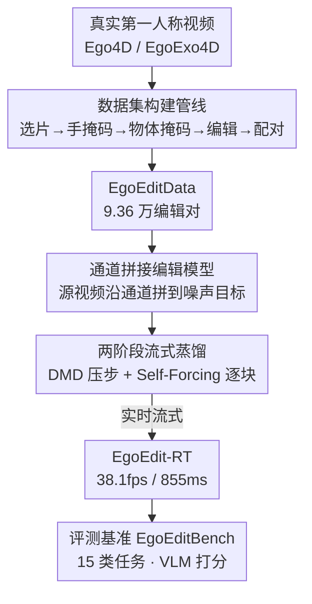

# EgoEdit: Dataset, Real-Time Streaming Model, and Benchmark for Egocentric Video Editing

**会议**: CVPR 2026  
**论文**: [CVF Open Access](https://openaccess.thecvf.com/content/CVPR2026/html/Li_EgoEdit_Dataset_Real-Time_Streaming_Model_and_Benchmark_for_Egocentric_Video_CVPR_2026_paper.html)  
**代码**: [项目页](https://snap-research.github.io/EgoEdit)（数据集与 benchmark 承诺公开，暂未见开源模型代码）  
**领域**: 视频生成  
**关键词**: 第一人称视频编辑, 实时流式生成, 指令式编辑, 自回归蒸馏, AR  

## 一句话总结
针对增强现实里"第一人称、手物频繁交互、大幅自我运动"的视频编辑场景，作者一次性补齐了数据（EgoEditData，9.36 万编辑对）、模型（EgoEdit，通道拼接编辑器 + 两阶段蒸馏出的实时流式版 EgoEdit-RT，单卡 H100 达 38.1fps、首帧延迟 855ms）和评测（EgoEditBench，15 类任务 1700 条），在第一人称编辑上明显超过现有方法，同时在通用编辑上不掉队。

## 研究背景与动机
**领域现状**：指令式视频编辑（"把香蕉变成一把水枪"）正成为 AR 的潜在引擎——用户用一句话就能增删改场景元素。InstructPix2Pix 用配对的"编辑前/后"数据把这套范式做成功，EditVerse、Lucy Edit 等把它扩到视频。

**现有痛点**：现有编辑器和它们的训练语料几乎全是**第三人称（exocentric）**内容——视角稳定、运动温和、几乎没有手物交互。可 AR 的真实场景是**第一人称（egocentric）**：相机戴在头上一直晃、手频繁遮挡并操纵物体、交互复杂，这种分布漂移让现有编辑器可靠性骤降。更糟的是离线扩散编辑管线延迟太高，根本撑不起"边看边生成"的实时交互。

**核心矛盾**：编辑质量高度依赖配对数据的规模与质量，但**第一人称编辑数据几乎不存在**；同时高质量扩散编辑要 40 步去噪、80 次前向，与实时低延迟天然冲突。

**本文目标**：把第一人称编辑端到端做通，拆成三个子问题——（1）造一份专门的高质量第一人称编辑数据；（2）训一个能实时流式推理的编辑模型；（3）建一个能公平评测该设定的 benchmark。

**切入角度**：既然"数据质量 + 领域对齐"是编辑性能的主驱动力，那就不堆量而是**精挑细筛**，专门盯住 AR 最相关、也最难的任务——手物交互下的物体替换/移除，且显式保住手的结构；模型侧则用通道拼接避免序列拼接的二次方开销，再用自回归蒸馏压到实时。

**核心 idea**：用一套"数据 + 通道拼接编辑器 + 两阶段流式蒸馏 + 专用 benchmark"的完整生态，把第一人称视频编辑从离线高延迟带进实时交互。

## 方法详解

### 整体框架
EgoEdit 是一个三件套生态而非单一模型：**数据集构建管线**先从真实第一人称视频里筛出"手正在操纵某物体"的片段并合成"替换/移除该物体"的目标视频，得到 EgoEditData；**通道拼接编辑模型**把一个预训练文生视频 DiT 改造成以源视频为条件的编辑器（EgoEdit）；**两阶段流式蒸馏**再把这个 40 步的慢编辑器压成 4 步、并改成逐块自回归的实时流式版（EgoEdit-RT）；最后用**评测基准** EgoEditBench 在 15 类第一人称任务上统一打分。下图是整条生态的数据流，节点即下面的关键设计。

### 关键设计

**1. 数据集构建管线：在海量第一人称视频里精挑"手物交互"片段并合成编辑对**

第一人称编辑数据稀缺，是学习式 AR 体验的最大壁垒。作者从 Ego4D / EgoExo4D 出发，设计了一条"质量优先"的多阶段管线，每一阶段都带强过滤：① **选片**——只取高质量机型、做去抖去模糊矫正，仅保留 1.8% 视频；② **手掩码**——先用手部检测器找手（无手的丢弃），把手区域作为视觉提示喂给 SAM 2 得到时序一致的细粒度手掩码，人工复核后剩 49.6%；③ **物体名抽取**——用 Qwen2.5-VL-32B 命名"手正在操纵的物体"，无有意义交互的丢弃；④ **物体掩码**——用 Grounded SAM 出粗掩码，再算"手掩码—物体掩码边缘距离"和"物体掩码—手骨架关键点距离"过滤假交互，粗掩码再种子化 SAM 2 得到精掩码，人工复核后剩 43.6%；⑤ **物体编辑**——用 GPT-5 Mini 提出多样的替换目标（含想象物体），Qwen-Image 合成参考图，再把参考图 + 场景描述 + 物体掩码喂给 Wan 2.1 VACE 14B 生成编辑后视频（移除当作"无目标物体"的特例），但该步极慢（8 卡 H100 仅 0.112fps）且良率低，人工剔除瑕疵后只留 37.8%；⑥ **配对**——把原视频与各编辑版本两两组合，用 GPT-5 Mini 生成精确的编辑指令。整条管线最终只保留原始视频的 **0.4%**，得到 1.09 万原始 + 3.88 万合成视频（70 小时）、共 **9.36 万**配对（源视频 + 目标视频 + 指令），平均每个原视频派生 3.6 个合成版本。这种"宁缺毋滥 + 显式保手"的策略，正是把领域对齐做到位、让模型学会在手遮挡下编辑的根本。

**2. 通道拼接编辑器：用 channel-wise 拼接把源视频塞进 DiT，避开序列拼接的二次方开销**

要把文生视频模型改成编辑器，必须把源视频 $X_{src}$ 作为条件注入。常见做法是**序列拼接**（EditVerse/UNIC）：把源视频 patch 化后沿序列维拼到目标 token 后面，但 token 序列翻倍会让 self-attention 成本二次方上涨，与实时低延迟矛盾。EgoEdit 改用 **channel-wise 拼接**（沿 Lucy Edit 思路）：把源视频 $X_{src}$ 和带噪目标 $X^{tgt}_t$ 在 patch 化**之前沿通道维拼起来**，模型成本几乎与基座持平。底座是一个在 Wan 2.1 autoencoder 隐空间上训练的 T2V DiT，文本条件 $c$ 经每个 self-attention 后的 cross-attention 注入，编辑预测写作 $\hat{v} = G(X^{tgt}_t \mid X_{src};\, c)$。训练用 Rectified Flow 流匹配：定义线性路径 $X_t = (1-t)X_0 + t X_1$，真值速度沿路径恒为 $v_t = X_1 - X_0$，优化

$$\mathcal{L}_{RF} = \mathbb{E}_{t,\,X_1,\,X_0}\big\| G(X_t, t) - (X_1 - X_0) \big\|_2^2 ,$$

其中 $t$ 采自 logit-normal 分布，推理时用 Euler 解 ODE 从噪声积分到数据。把"省算力"前置到架构选择上，是这个编辑器能进一步蒸馏到实时的前提。

**3. 两阶段流式蒸馏：DMD 压步 + Self-Forcing 逐块自回归，做到亚秒延迟**

上面的编辑器准但慢——40 步去噪 + CFG 等于 80 次前向（NFE），而且要整段生成完才出第一帧，无法交互。作者分两阶段蒸馏：① **双向 DMD 蒸馏**——按 DMD 把 40 步、带 CFG 的模型压成 4 步、带蒸馏式引导的模型，NFE 从 80 直降到 4；② **Self-Forcing**——让因果（causal）学生在视频流上自回归地 roll out，并用基于双向教师的分数模型施加 DMD 损失，学生由此学会纠正自己的累计误差（缓解 exposure bias），并支持低延迟自回归推理。关键在于**逐块（chunk-by-chunk）生成**：每块 3 个隐帧，而所用 Wan autoencoder 原生支持自回归操作，于是相机一边录、模型一边编辑一边把结果推给用户（watch-as-you-generate）。代价是首帧延迟里录制占大头——首块 3 隐帧≈9 RGB 帧的录制耗 562ms，模型 + AE 才几十毫秒，合计 855ms；想再降延迟可在 Self-Forcing 时缩小 chunk。正是这一步把"高质量但离线"变成"质量基本不掉、却能实时"。

**4. 评测基准 EgoEditBench：15 类第一人称任务的标准化打分**

现有视频编辑 benchmark 几乎都建在第三人称自然视频上，无法评估第一人称设定。作者按 EditVerseBench 协议建 EgoEditBench：从**未用于构建 EgoEditData** 的 Ego4D split 里采 100 个源视频（先抽源物体名 + 场景描述、拼接后取 BERT 嵌入、K-means 聚 10 类各取 10 个，保证多样性），再用 GPT-5 为 15 类任务各生成针对性指令——涵盖加物/加特效/移除/换物/换背景/换相机位姿/风格化/推理，以及 Depth/Sketch/Pose 与视频互转、和一个组合任务；X-to-Video 的条件信号分别用 OpenCV Canny、DWpose、Depth Anything 合成。最终 **1700 条**源视频-指令对，按任务平均打分以等权所有任务，指标含 VLM 评分、Pick Score、文本对齐（TA）、时序一致性（TC）。这把"第一人称编辑做得好不好"第一次变成可复现的横向比较。

### 损失函数 / 训练策略
基座编辑器：在 EgoEditData + 额外 131 万视频、350 万图像编辑对上微调，batch 96、30k 步、AdamW lr 1e-5、weight decay 0.1、带 EMA。DMD 蒸馏：4.5k 步，模型 lr 1e-6、critic lr 4e-7。Self-Forcing：3.5k 步，模型 lr 1e-6、critic lr 4e-7。最终分辨率 512×384、16fps。

## 实验关键数据

### 主实验
在 EgoEditBench（第一人称）与 EditVerseBench（通用）上对比（VLM=VLM 评分、PS=Pick Score、TA=文本对齐、TC=时序一致性，均越高越好）：

| 方法 | 类别 | EgoBench VLM | EgoBench TC | EditVerse VLM | EditVerse TC |
|------|------|------|------|------|------|
| TokenFlow | 注意力操纵 | 4.99 | 95.04 | 5.87 | 98.21 |
| Señorita-2M ‡ | 首帧传播 | 7.52 | 95.86 | 6.99 | 98.33 |
| InsV2V | 指令式 | 5.24 | 94.01 | 5.71 | 96.39 |
| Lucy Edit | 指令式 | 5.44 | 94.41 | 6.27 | 98.62 |
| EditVerse † | 指令式 | — | — | 8.26 | 98.68 |
| **EgoEdit** | 指令式 | **7.76** | **96.70** | 8.00 | 98.54 |
| StreamDiffusionV2 | 流式 | 2.55 | 94.31 | 2.78 | 98.22 |
| **EgoEdit-RT** | 流式 | **7.71** | 96.41 | 8.18 | 98.55 |

EgoEdit 在第一人称上明显领先（VLM 7.76，时序一致性最高 96.70），通用编辑上贴近最强闭源 EditVerse（8.00 vs 8.26）。最能说明问题的是**跨域鲁棒性**：从通用切到第一人称，EgoEdit 的 VLM 仅掉 0.24 分，而 Lucy Edit 掉 0.83、InsV2V 掉 0.47；Señorita-2M/AnyV2V 之所以不掉，是因为它们直接吃了 EgoEdit 生成的首帧。流式版 EgoEdit-RT 各指标与双向全模型基本相当，且远超现有实时编辑器（StreamDiffusionV2 VLM 仅 2.55）。

### 消融实验
蒸馏阶段的延迟/吞吐分析（单 H100，512×384）：

| 阶段 | 是否流式 | NFE | VLM | 首块延迟(ms) | 吞吐(model+AE, fps) |
|------|---------|-----|-----|------|------|
| 无蒸馏 | 否 | 80 | 7.76 | 13432 | 9.68 |
| DMD（4 步） | 否 | 4 | 7.31 | 6925 | 43.5 |
| Self-Forcing | 是 | 4 | 7.71 | **855** | 38.1 |

数据量消融（去掉不同比例 EgoEditData，统一在 10k 步 checkpoint 评）：

| EgoEditData 占比 | 0% | 25% | 75% | 100% |
|------|------|------|------|------|
| EgoBench VLM | 4.87 | 7.12 | 7.52 | **7.85** |

### 关键发现
- **只有 Self-Forcing 能做到亚秒延迟**：标准方法不能逐块生成，必须整段算完才出首帧；Self-Forcing 把首块延迟从 13432ms 砍到 855ms，VLM 还从 DMD 的 7.31 回升到 7.71，逼近无蒸馏教师的 7.76——即"实时但质量几乎不掉"。
- **EgoEditData 是性能的发动机**：数据占比从 0% 到 100%，VLM 从 4.87 单调升到 7.85，几乎翻倍，直接验证"领域对齐数据"才是第一人称编辑变好的根因。
- **延迟瓶颈在录制而非计算**：855ms 里 562ms 是录首块 9 帧，模型 + AE 只占几十毫秒；要更快得缩 chunk，但会牺牲质量。
- **野外涌现能力**：实时版能在手交互时保住手、给插入物体加正确光照、让插入动物绕障/跳跃、甚至"牵着狗走"对用户交互有反应；但对环境的结构性改动有限（剑砍不穿家具、动物推不动真实物体）。

## 亮点与洞察
- **"数据 + 模型 + benchmark"一次性补齐一个新设定**：把第一人称编辑当成端到端缺口来填，而非只发一个模型，这种"造生态"的打法让后续研究有了立足点（数据与 benchmark 承诺开源）。
- **架构选择服务于延迟目标**：通道拼接而非序列拼接，看似小改动，却是后续能蒸馏到实时的前提——把"省算力"前置到架构而非只靠蒸馏，思路可迁移到任何要实时化的条件生成。
- **"显式保手"的数据约束**：在掩码与过滤阶段反复用"手—物体距离/骨架关键点"确认真交互，把 AR 里最敏感的手结构作为一等公民保护，是第一人称区别于第三人称的核心 trick。
- **跨域掉点幅度作为鲁棒性指标**：用"从通用切到第一人称掉了几分"来量化领域适配能力，比单看绝对分更能说明问题，值得借鉴。

## 局限与展望
- **作者承认**：EgoEdit-RT 相比非蒸馏版有可感知的质量差距——对分布外指令更弱、对"物体进出画面/临时遮挡"更不稳、时序一致性略低；855ms 延迟够用但不理想，且分辨率/帧率（512×384、16fps）略低于常见 480p。
- **数据管线极度依赖闭源大模型**：GPT-5 Mini / Qwen-Image / Wan 2.1 VACE 等多次调用，且物体编辑步极慢（0.112fps/8 卡）、良率低，复现成本与可持续性存疑 ⚠️。
- **结构性交互受限**：插入物体不能真正改变环境（剑砍不穿家具），说明模型学到的是外观级编辑而非物理级交互。
- **改进方向**：缩小 chunk + 更强因果蒸馏以压延迟、提分辨率；把数据管线里的闭源依赖替换为开源链路；引入物理/几何约束让插入物体能真正与环境交互。

## 相关工作与启发
- **vs EditVerse**：同为指令式视频编辑且用序列拼接条件，通用编辑上 EditVerse 略强（VLM 8.26 vs 8.00），但它针对第三人称、无源码、且序列拼接成本高无法实时；EgoEdit 用通道拼接 + 蒸馏换来第一人称 SOTA 与实时性。
- **vs Lucy Edit**：都用通道拼接降长序列成本，但 Lucy Edit 无第一人称数据，跨域掉 0.83 分；EgoEdit 靠 EgoEditData 只掉 0.24 分。
- **vs StreamDiffusion / StreamDiffusionV2**：同为实时流式编辑，但它们是训练-free、质量差距大（VLM 2.55/4.32）；EgoEdit-RT 走"训好再蒸馏"路线，实时下仍保住质量。
- **vs Self-Forcing / CausVid（蒸馏方法）**：本文直接复用 Self-Forcing 的自回归 roll-out + DMD 损失思路，贡献不在蒸馏算法本身，而在把它落到第一人称编辑这一新设定并验证可行。

## 评分
- 新颖性: ⭐⭐⭐⭐ 第一个把第一人称视频编辑端到端做通（数据+实时模型+benchmark），但模型与蒸馏技术多为已有组件的组合
- 实验充分度: ⭐⭐⭐⭐ 双 benchmark 对比 + 蒸馏延迟分析 + 数据量消融 + 野外评测，覆盖全面
- 写作质量: ⭐⭐⭐⭐ 三件套结构清晰、图表到位，但部分实现细节推到附录
- 价值: ⭐⭐⭐⭐⭐ 数据集与 benchmark 公开后将成为第一人称编辑/AR 生成的基础设施

<!-- RELATED:START -->

## 相关论文

- [\[CVPR 2026\] StreamDiT: Real-Time Streaming Text-to-Video Generation](streamdit_real-time_streaming_text-to-video_generation.md)
- [\[CVPR 2026\] Endless World: Real-Time 3D-Aware Long Video Generation](endless_world_real-time_3d-aware_long_video_generation.md)
- [\[CVPR 2026\] U-Mind: A Unified Framework for Real-Time Multimodal Interaction with Audiovisual Generation](u-mind_a_unified_framework_for_real-time_multimodal_interaction_with_audiovisual.md)
- [\[CVPR 2026\] Real-Time Generation of Streamable Talking Portrait Video with Reference-Guided Deep Compression VAEs](real-time_generation_of_streamable_talking_portrait_video_with_reference-guided_.md)
- [\[CVPR 2026\] VGA-Bench: A Unified Benchmark and Multi-Model Framework for Video Aesthetics and Generation Quality Evaluation](vga-bench_a_unified_benchmark_and_multi-model_framework_for_video_aesthetics_and.md)

<!-- RELATED:END -->
