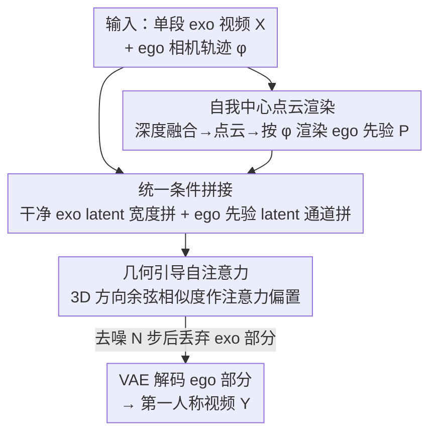

# EgoX: Egocentric Video Generation from a Single Exocentric Video

**会议**: CVPR 2026  
**论文**: [CVF Open Access](https://openaccess.thecvf.com/content/CVPR2026/html/Kang_EgoX_Egocentric_Video_Generation_from_a_Single_Exocentric_Video_CVPR_2026_paper.html)  
**代码**: 无（论文未提供公开实现）  
**领域**: 视频生成 / 扩散模型  
**关键词**: 第一人称视频生成, exo-to-ego, 视频扩散模型, 点云渲染先验, 几何引导注意力  

## 一句话总结
EgoX 给定**单段**第三人称（exocentric）视频和目标第一人称相机轨迹，把它先 3D 抬升渲染成一段"自我中心先验视频"，再用宽度/通道双向拼接 + 几何引导自注意力，借助预训练视频扩散模型（Wan 2.1 14B + LoRA）生成几何一致、高保真的第一人称（egocentric）视频，在 Ego-Exo4D 上大幅超越 Exo2Ego-V 等基线。

## 研究背景与动机
**领域现状**：把第三人称视频翻译成第一人称视频（exo-to-ego），能让观众"走进画面成为主角"，对影视、AR/VR、机器人模仿学习都有价值。最直接的思路是套用近年的"相机控制视频生成"模型（如 TrajectoryCrafter），它们能在**温和的视角变化**下生成连贯的新视角。

**现有痛点**：exo→ego 是**极端**的相机位姿平移——视场几乎完全改变，两个视角之间几乎没有像素级重叠。这带来两个具体难题：(1) 视角剧变导致大片**未见区域**，必须靠对场景的理解去"脑补"，而非直接观测；(2) 第三人称画面里**只有一小块**和第一人称相关，模型必须分辨"哪些内容该当条件用、哪些无关背景该被抑制"。常规相机控制模型对此毫无设计，往往直接失败。

**核心矛盾**：要在**保留可见内容的几何一致性**和**合理合成大片未见区域**之间同时做好——而这两件事在极端视角差下天然冲突：用 cross-attention 引入 exo 条件会丢掉预训练权重（4Diff）；直接通道拼接 exo 特征又因缺乏像素对应而过拟合/掉质量。

**本文目标**：只用**一段** exo 视频（不要求额外的首帧 ego 图，也不要求多路 exo 相机），生成完整的 ego 视频。对比之下，EgoExo-Gen 需要第一帧 ego 图、Exo2Ego-V 需要四路 exo 输入——都是为了绕开难度而加约束。

**切入角度**：与其让扩散模型从零学跨视角变换，不如**先把几何算出来**——把 exo 视频抬升成点云、按 ego 轨迹渲染出一段"先验视频"，让模型有像素级对齐的锚点；再最大限度复用预训练视频扩散模型的时空知识（只加 LoRA），把"合成未见区域"的活交给预训练先验。

**核心 idea**：用"点云渲染的 ego 先验 + 干净 latent 的双向拼接条件 + 几何引导自注意力"三件套，把极端视角变换问题转成"在预训练扩散模型上做几何对齐的条件生成"。

## 方法详解

### 整体框架
输入是一段 exo 视频 $X=\{X_i\}_{i=0}^{F}$ 和目标 ego 相机位姿 $\phi=\{\phi_i\}_{i=0}^{F}$，输出是同一场景的 ego 视频 $Y$。整条管线分三步走：先把 exo 视频**单目+视频深度融合**抬升成 3D 点云、按 ego 轨迹渲染出**自我中心先验视频** $P$（提供像素级 RGB 和相机轨迹线索，但有噪声、且缺大片内容）；然后把**干净的** exo latent $x_0$ 和 ego 先验 latent $p_0$ 与噪声 latent $z_t$ 做**宽度/通道双向拼接**，喂进冻结的 Wan 2.1 视频扩散模型（仅训 LoRA）；DiT 内部用**几何引导自注意力**让 ego query 只关注几何对齐的 exo 区域。采样完成后丢掉 latent 中的 exo 部分，只解码 ego 部分得到结果。

### 关键设计

**1. 自我中心点云渲染：给极端视角变换提供像素级几何锚点**

针对"视角剧变后没有任何像素对应"的痛点，EgoX 不让扩散模型凭空学跨视角变换，而是**先把几何显式算出来**。对每帧用单图深度估计器得到 $D_m$、用时序深度估计器得到 $D_v$：前者逐帧独立、时间上有抖动，后者时序平滑但是 affine-invariant（尺度/偏移不定）。两者各有长短，于是把 $D_v$ 向 $D_m$ 做时序对齐——用动量更新优化逐帧仿射参数 $\hat\alpha,\hat\beta$，融合深度为

$$D_f = \frac{1}{\hat\alpha / D_v + \hat\beta}$$

动态物体被 mask 掉，只用静态背景参与对齐和渲染。拿到对齐深度 $D_f$ 后结合相机内参反投影成 3D 点云，再按 ego 位姿 $\phi$ 渲染出先验视频 $P=\mathrm{render}(X,D_f,\phi)$。这段 $P$ 和目标 ego 视频**共享视角**，因此天然带像素级对应——它既给出显式 RGB，又隐含相机轨迹线索；缺点是有渲染噪声、且因 exo 看不到的区域留下大片空洞，这正好留给后两个设计去补。

**2. 统一条件拼接（宽度 + 通道 + 干净 latent）：用两路互补先验喂满扩散模型**

光有 ego 先验 $P$ 不够——它视角对齐但内容残缺；exo 视频 $X$ 内容完整但视角错位。EgoX 用**两种不同的拼接方式**把它们分别接进去。ego 先验 latent $p_0$ 与目标视角对齐、保留像素对应，所以沿**通道维**和噪声 latent $z_t$ 拼接，提供视角对齐、时序连贯的引导；exo latent $x_0$ 视角和 $z_t$ 不对齐，所以沿**宽度维**拼接，逼模型自己去推断跨视角对应、隐式做空间 warping。整体去噪关系写成

$$z_{t-1} = f_\theta\big(x_0, z_t \,\|\, x_0, p_0 \,\|\, m_1, m_0\big)$$

其中 $m$ 是二值 mask，标记每个空间区域是"当条件用"还是"要合成"。关键巧思在 **clean latent**：不同于 SDEdit 类做法把**带噪**的条件 latent 和带噪目标拼一起，EgoX 在**所有去噪时间步**都拼**干净**的 $x_0$，且只更新 $z_t$、$x_0$ 始终固定。这样模型每一步都能稳定参考 $x_0$ 里的细粒度细节，spatial warping 更准；消融里去掉 clean latent 后 FVD 从 184 恶化到 343，丢失勺子、小食材等精细物体。整套条件只需在 Wan 2.1 上训 LoRA（rank=256），冻结主干、保住预训练时空先验。

**3. 几何引导自注意力（GGA）：让注意力只盯几何对齐的区域，抑制无关背景**

exo 条件里塞着大量与 ego 无关的区域，会干扰生成。GGA 的目标是：当 ego query token 去 attend exo key token 时，注意力不仅看**外观语义相似**，还要看**3D 空间是否对齐**——既相似又几何对齐的 token 给高权重，错位/无关的压低。具体用第一步的点云：从每帧 ego 相机中心 $c_i$ 到 query/key 的 3D 位置算单位方向向量 $\hat q=\frac{\tilde q-c_i}{\|\tilde q-c_i\|_2}$、$\hat k=\frac{\tilde k-c_i}{\|\tilde k-c_i\|_2}$，再把两者的方向余弦相似度作为**乘性几何先验**注入注意力 logits：

$$s'_{m,n} = s_{m,n} + \log\big(g(\hat q_m,\hat k_n)\cdot\lambda_g\big),\qquad g(\hat a,\hat b)=\cos\text{-}\mathrm{sim}(\hat a,\hat b)+1$$

其中 $s_{m,n}=q_m^\top k_n/\sqrt c$ 是标准注意力 logits，$\lambda_g$ 调几何偏置强度，余弦加 1 是为了取对数前保证为正。softmax 后注意力权重等价于 $a_{m,n}\propto \exp(s_{m,n})\,g(\hat q_m,\hat k_n)^{\lambda_g}$。⚠️ 这里 $g^{\lambda_g}$ 的幂次形式由式 (7) 推出，与式 (4) 里 $\log(g\cdot\lambda_g)$ 的写法略有出入，以原文为准。关键难点在于：图像生成里可以预乘旋转矩阵编码空间关系，但视频里**每一帧 ego 相机中心都在变**，必须对每个 query 单独重算 key 方向——所以 GGA 把所有 ego-exo 方向相似度算成一张**加性 bias 注意力 mask**，从而复用优化过的注意力 kernel，不破坏效率。

### 损失函数 / 训练策略
基模型为 Wan 2.1 (14B) Image-to-Video 的 inpainting 变体（为支持噪声 latent 与 ego 先验的通道拼接）；用 LoRA（rank=256）微调，batch size=1，8×H200(140GB) 训练约一天。数据从 Ego-Exo4D 精选 4000 段（3600 训练 / 400 测试），另收 100 段训练集外片段测泛化。

## 实验关键数据

### 主实验
在 Ego-Exo4D 上对比 Exo2Ego-V、TrajectoryCrafter、Wan Fun Control、Wan VACE（基线均用同一数据微调）。指标分图像类（PSNR/SSIM/LPIPS/CLIP-I）、物体类（用 SAM2+DINOv3 跟踪匹配后算 Location Error/IoU/Contour Acc）、视频类（FVD + VBench）。

| 场景 | 方法 | PSNR↑ | SSIM↑ | LPIPS↓ | CLIP-I↑ | Loc.Err↓ | IoU↑ | FVD↓ |
|------|------|-------|-------|--------|---------|----------|------|------|
| Seen | Exo2Ego-V | 14.53 | 0.384 | 0.569 | 0.774 | 156.66 | 0.074 | 622.47 |
| Seen | TrajectoryCrafter | 13.05 | 0.375 | 0.606 | 0.780 | 100.74 | 0.128 | 546.09 |
| Seen | Wan VACE | 12.95 | 0.413 | 0.626 | 0.829 | 109.62 | 0.114 | 508.69 |
| Seen | **EgoX** | **16.05** | **0.556** | **0.498** | **0.896** | **61.81** | **0.363** | **184.47** |
| Unseen | Exo2Ego-V | 12.70 | 0.439 | 0.597 | 0.679 | 214.32 | 0.003 | 1283.50 |
| Unseen | Wan Fun Control | 13.59 | 0.439 | 0.604 | 0.799 | 191.40 | 0.042 | 968.78 |
| Unseen | **EgoX** | **14.38** | **0.457** | **0.552** | **0.877** | **149.93** | **0.092** | **440.64** |

物体类指标差距最大（Seen 场景 IoU 0.363 vs 次优 0.128，FVD 184 vs 508），说明 EgoX 在保几何/物体一致性上远强于基线。图像类绝对值偏低是合成未见区域的固有难度所致，但仍全面领先。Wan VACE 的 VBench 时序平滑分最高，但那是因为它生成**过静**的视频（Dynamic Degree 仅 0.673），EgoX 在动态性和保真度间更平衡。

### 消融实验（Seen 场景）
| 配置 | PSNR↑ | LPIPS↓ | IoU↑ | FVD↓ | 说明 |
|------|-------|--------|------|------|------|
| Full (EgoX) | 16.05 | 0.498 | 0.363 | 184.47 | 完整模型 |
| w/o GGA | 14.77 | 0.530 | 0.326 | 254.08 | 注意力发散到无关区域，几何错位 |
| w/o Ego prior | 13.67 | 0.573 | 0.417 | 211.50 | 缺像素对应+轨迹线索，跟不上正确视角 |
| w/o clean latent | 15.07 | 0.540 | 0.376 | 343.33 | 噪声 exo latent 模糊细节，丢小物体 |

> ⚠️ w/o Ego prior 行的 IoU(0.417) 反而高于 Full(0.363)，但 PSNR/LPIPS/FVD 全面变差——原文未单独解释该异常，IoU 可能受可见物体减少影响，以原文为准。

### 关键发现
- **clean latent 对 FVD 影响最大**（184→343），印证"全程拼干净 exo latent"是细粒度细节保真的关键，去掉后丢勺子/小食材等物体。
- **GGA 直接决定几何对齐**：注意力可视化显示，无 GGA 时 ego 中心 token 注意力发散到无关区域，加 GGA 后锐利聚焦到几何相关区域。
- **泛化性强**：在 100 段训练集外片段、乃至《蝙蝠侠：黑暗骑士》in-the-wild 片段上仍能生成连贯 ego 视频，得益于冻结预训练权重 + 只加 LoRA。

## 亮点与洞察
- **"先算几何、再让扩散模型补"** 的分工很巧：把跨视角变换里能确定的部分（点云渲染）显式算出来当锚点，把不确定的部分（未见区域）交给预训练先验，避免让扩散模型从零学几何。
- **同一个 exo 条件、两种拼接方式**：视角对齐的 ego 先验走通道拼接、视角错位的 exo 视频走宽度拼接——用"拼接维度"区分"对齐 vs 需 warp"的条件，是个可迁移的条件注入思路。
- **GGA 把几何先验写成加性 attention bias**，绕开"视频里每帧相机中心都变、无法预乘旋转矩阵"的难点，还能复用高效注意力 kernel，工程上很务实。
- **clean latent 全程固定** 这个细节（区别于 SDEdit 的带噪条件）对细节保真贡献最大，是容易被忽视但回报很高的设计。

## 局限与展望
- **必须输入 ego 相机位姿**：作者承认当前框架需要用户提供（或交互指定）ego 相机轨迹，未来可加自动头部位姿估计模块。
- **依赖静态背景假设**：点云渲染阶段把动态物体 mask 掉、只用静态背景做对齐和渲染——⚠️ 这意味着场景中运动主体的几何先验可能不可靠，强动态场景下的表现存疑。
- **算力门槛高**：基于 Wan 2.1 14B、8×H200 训练，复现成本不低；且未开源。
- 图像级绝对指标仍偏低（PSNR 16），未见区域的合成保真度还有空间。

## 相关工作与启发
- **vs Exo2Ego-V**：它需要**四路** exo 相机输入、且分别训练空间和时序模块，泛化受限、没充分利用时空先验；EgoX 只用**单路** exo 输入、复用预训练视频扩散权重，泛化更强。
- **vs EgoExo-Gen**：它需要第一帧 ego 图来生成后续序列（绕开"从零生成 ego"）；EgoX 不需要任何 ego 帧，纯从 exo 生成完整 ego 视频。
- **vs 4Diff（cross-attention 条件）**：用 cross-attention 引入 exo 条件会无法复用强大的预训练扩散权重、泛化和质量都受损；EgoX 用 latent 拼接 + LoRA 保住了预训练先验。
- **vs 通道拼接 exo 特征的方法**：因两视角缺乏像素对应而过拟合/掉质量；EgoX 通过"先渲染对齐的 ego 先验再通道拼"绕开了这个对应缺失问题。
- **vs 相机控制模型（TrajectoryCrafter 等）**：它们为温和视角变化设计，在极端 exo→ego 平移下产生畸变和时序不一致；EgoX 专门针对极端视角差。

## 评分
- 新颖性: ⭐⭐⭐⭐⭐ 首个从单段 exo 视频生成完整 ego 视频的框架，点云先验+双向拼接+几何注意力组合新颖
- 实验充分度: ⭐⭐⭐⭐ 四基线、三类指标、seen/unseen/in-the-wild 全覆盖，消融清晰；但部分指标异常未解释、未开源
- 写作质量: ⭐⭐⭐⭐ 动机和三个设计讲得清楚，图示到位
- 价值: ⭐⭐⭐⭐ 对影视/AR-VR/机器人模仿有直接价值，思路可迁移到其他极端视角生成任务

<!-- RELATED:START -->

## 相关论文

- [\[CVPR 2026\] EgoControl: Controllable Egocentric Video Generation via 3D Full-Body Poses](egocontrol_controllable_egocentric_video_generation_via_3d_full-body_poses.md)
- [\[CVPR 2026\] EgoEdit: Dataset, Real-Time Streaming Model, and Benchmark for Egocentric Video Editing](egoedit_dataset_real-time_streaming_model_and_benchmark_for_egocentric_video_edi.md)
- [\[ECCV 2024\] SV3D: Novel Multi-view Synthesis and 3D Generation from a Single Image using Latent Video Diffusion](../../ECCV2024/video_generation/sv3d_novel_multi-view_synthesis_and_3d_generation_from_a_single_image_using_late.md)
- [\[ICCV 2025\] ReCamMaster: Camera-Controlled Generative Rendering from A Single Video](../../ICCV2025/video_generation/recammaster_camera-controlled_generative_rendering_from_a_single_video.md)
- [\[ICCV 2025\] Causal-Entity Reflected Egocentric Traffic Accident Video Synthesis](../../ICCV2025/video_generation/causal-entity_reflected_egocentric_traffic_accident_video_synthesis.md)

<!-- RELATED:END -->
