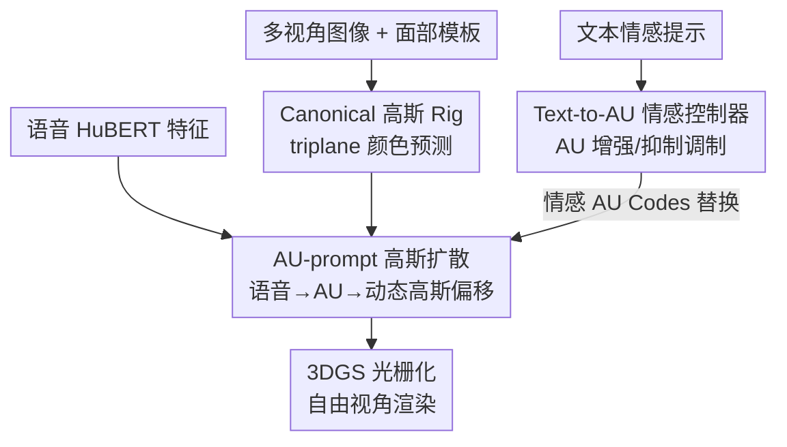

# EmoDiffTalk: Emotion-aware Diffusion for Editable 3D Gaussian Talking Head

**会议**: CVPR 2026  
**论文**: [CVF Open Access](https://openaccess.thecvf.com/content/CVPR2026/html/Liu_EmoDiffTalk_Emotion-aware_Diffusion_for_Editable_3D_Gaussian_Talking_Head_CVPR_2026_paper.html)  
**代码**: https://liuchang883.github.io/EmoDiffTalk/ (项目主页)  
**领域**: 3D视觉 / 视频生成 / 扩散模型  
**关键词**: 3D高斯泼溅, 说话人头, 情感编辑, Action Unit, 扩散模型  

## 一句话总结
EmoDiffTalk 把"情感→表情"的映射落到可解释的面部动作单元（Action Unit, AU）编码空间上，用一个 AU 提示的高斯扩散把语音驱动成细粒度的动态 3D 高斯说话人头，再用一个文本到 AU 的情感控制器实现"用一句话编辑表情"，在 EmoTalk3D 和 RenderMe-360 上的渲染保真度、唇形同步和情感可控性都超过此前 SOTA。

## 研究背景与动机
**领域现状**：照片级真实的 3D 说话人头近几年从 3DMM、NeRF 一路走到 3D Gaussian Splatting（3DGS），渲染质量和实时性都很好，主流工作主要把精力花在"portrait 渲染得多真"和"音唇对得多准"上。

**现有痛点**：这些方法在**语义层面的编辑**——尤其是情感表情——上仍然很弱。想让人物"笑得更明显一点"或"换成惊讶的表情"，要么做不到，要么只能换风格/换身份（stylization / personalization），做不到细粒度、可扩展的情感操控。

**核心矛盾**：情感编辑难，根子在于**两段映射都是模糊的**——音频到情感（audio-to-emotion）、情感到表情（emotion-to-expression）。早期工作（如 EAMM）在隐式 latent 里用参考图像做编辑，EmoTalk 系列把情感从语音里解耦出来，Hallo3 直接把文本喂进 audio-diffusion，但它们都在**整体表情或隐式特征**上操作，缺少解剖学上的细粒度落点，所以情感编辑的质量上不去。

**本文目标**：在一个能自由视角渲染的动态 3DGS 说话人头里，同时做到（1）语音驱动出细粒度表情、（2）用文本对情感做准确而可扩展的编辑。

**切入角度**：作者的关键观察是——FACS（面部动作编码系统）定义的 AU 对应具体的面部肌肉运动，是一个**可解释、有解剖学根基**的表情表示。与其在模糊的隐式空间里硬拼，不如把 AU 编码当成多模态输入（语音、文本）和高斯扩散之间的**中介**。

**核心 idea**：用 AU 编码空间充当情感嵌入去 **prompt** 高斯扩散，让扩散直接预测动态高斯基元的属性；先建一个 AU 提示的高斯扩散做语音→表情，再蒸馏出一个文本→AU 的控制器做情感编辑。

## 方法详解

### 整体框架
给定一个对象的多视角图像 $I=\{I_i\}$ 和一个面部模板 $T_f$，目标是重建一组动态 3DGS 基元 $G=\{g_i^t\}$，既能被任意语音驱动出细粒度表情，又能被文本编辑情感。整条管线分三步走：先做 **Canonical 高斯 Rig 重建**得到一套标准（canonical）的 3DGS 装配和高精度颜色；再用 **AU-prompt 高斯扩散**把语音映射成 AU 编码、进而预测每个高斯点相对 canonical rig 的动态偏移；最后用 **Text-to-AU 情感控制器**把文本提示变成对 AU 编码的"增强/抑制"调制，替换掉原本由语音得到的 AU 编码，从而在保持发音保真度的同时注入可控情感。三步串完，由 3DGS 光栅化输出自由视角的渲染结果。

整个设计的"灵魂"是把 AU 编码当成贯穿语音、文本、几何的**统一中介**：语音先编码成 AU，扩散和外观解码都被 AU 提示，文本编辑也作用在 AU 上——所有模态最终都在同一个可解释空间里交汇。

### 关键设计

**1. Canonical 高斯 Rig 与 triplane 颜色预测：给动态编辑一个稳定干净的"底座"**

要在驱动阶段只关注面部动态，先得有一套和表情无关的标准装配。沿用 EmoTalk3D 的做法，本文把 3D 头划成面部区域和非面部区域，并在两者间建立运动绑定——这样后续只需驱动面部，非面部区域会被自动、高效地带动。区别在于颜色获取：以往的 canonical rig 用球谐函数（SH）取视角相关颜色，本文换成 **triplane 颜色预测**

$$c = M\big(F_{xy}(x,y) \oplus F_{xz}(x,z) \oplus F_{yz}(y,z)\big),$$

其中 $M$ 是 MLP 解码器，$F_{xy},F_{xz},F_{yz}$ 是三个平面的特征图，$\oplus$ 是拼接。标准高斯记为 $G_0=\{\mu_0, S_0, R_0, \alpha_0, c_0\}$。这么做是因为 triplane 在后续 AU-prompt 扩散的属性解码里能取到更准的颜色——驱动时颜色属性 $c_0$ 由 triplane 实时取，其余属性（位置/旋转/不透明度）交给扩散去更新，二者职责分离。

**2. AU-prompt 高斯扩散：把语音翻成 AU、再把 AU 翻成动态高斯**

这是方法的主体，内部又分三个阶段。**Speech-to-AU 编码器**先从原始音频抽自监督的 HuBERT 特征 $A_t\in\mathbb{R}^{768}$（比频谱图保留更多音素/韵律信息），再用多层 Transformer 预测 AU 编码 $E_{0:T-1}=\mathrm{Enc}(A_{0:T-1};\theta)$；其中低层用受限注意力捕捉快速的发音变化（如闭唇），高层建模较慢的韵律变化。**AU-prompt 扩散**借鉴 DiffPoseTalk，但关键改动是：用从音频得到的 AU 编码（而非 2D 视频里抽的风格信息）来引导去噪，且网络学的是 mesh 点的**位置偏移** $\Delta P_t$ 而不是 3DMM 系数 $\beta$——直接学点偏移比预测先验系数更难，所以作者额外设计了一系列约束面部结构的损失。去噪过程写作

$$\hat{x}^0_{0:T} = D_\theta\big(x^n_{0:T}, P, E_{0:T}, A_{0:T}, n\big),$$

它在 AU 编码的各维度和具体面部点运动之间建立细粒度绑定，等于显式学出"哪个 AU 对应哪块脸动"。**Dynamic Appearance Decoder** 再把扩散输出解码成 3DGS 的动态属性：RotNet（3 层 MLP）由 $R_t=N_{Rot}(R_0, E_t, \mu_t)$ 预测每个高斯点的旋转（$\mu_t$ 是 $t$ 时刻形变后的位置）；不透明度则靠一条可学习的 **Feature Line** $F\in\mathbb{R}^{17\times Q\times 16}$（$Q$ 为面部高斯点数），它本来是存 FLAME 表情系数变化的隐式特征，这里被"复用"成存 AU 编码相关的不透明度模式——这种连续的 AU 表示让表情能平滑插值、无限混合，再由 OPCNet（另一个 3 层 MLP）按 $\Delta\alpha_t^i = N_{OPC}(f_t^i, E_t, \mu_t)$ 预测不透明度变化，$f_t^i$ 是按 AU 强度加权的特征组合。

**3. Text-to-AU 情感控制器：用一句话把 AU 拨大或拨小**

有了 AU 这个中介，文本编辑就变得直接。控制器把一句情感提示（如 "the person is smiling"）经 CLIP 文本编码器 + Adapter + 分类器，映射成一个二值 AU 激活向量 $y\in\{0,1\}^K$：$y_k=1$ 表示第 $k$ 个 AU 该被上调，$y_k=0$ 表示该被抑制。然后对用户选中的语音 AU 编码 $E_t$ 施加一个轻量的"增强–抑制"变换：

$$\tilde{E}_t = E_t \odot (1+\alpha y) - \beta(1-y)\odot E_t,$$

其中 $\alpha,\beta>0$ 是增强/抑制系数，$\odot$ 为逐元素乘——激活的 AU 被放大 $1+\alpha$ 倍，未激活的被衰减 $1-\beta$ 倍。调制后的情感 AU 编码 $\tilde{E}_{0:T-1}$ 直接**替换**原来的 $E_{0:T-1}$ 喂回 AU-aware 扩散，从而在注入可控情感的同时，保留语音 AU 本身带来的发音保真度。这样情感编辑不是另起炉灶生成，而是在同一套 AU 条件上做加减法，既可控又不破坏唇形。

### 损失函数 / 训练策略
四阶段串行优化，与方法三节一一对应：
- **Stage 1（Speech-to-AU 编码器）**：AU 强度回归损失 + 时序一致性损失，$L_{AU}=\lambda_{reg}L_{reg}+\lambda_{temp}L_{temp}$。
- **Stage 2（AU-prompt 扩散）**：不用通用噪声预测损失，而是统一的几何目标——全局顶点重建 + 速度/加速度时序连贯 + 形变正则 + 细粒度唇形保真，$L_{stage2}=\lambda_{vertex}L_{vertex}+\lambda_{motion}L_{motion}+\lambda_{deform}L_{deform}+\lambda_{lip}L_{lip}$。
- **Stage 3（外观解码器）**：RotNet 用简单重建损失，OPCNet 用 $L_{OPC}=L_{recon}+L_{reg}+L_{opcmotion}+L_{dist}$（混合重建 + 运动–幅度耦合 + 稀疏与时序平滑 + 位移限制）。
- **Stage 4（Text-to-AU 控制器）**：$L_{control}=\lambda_{BCE}L_{BCE}+\lambda_{infoNCE}L_{infoNCE}$，BCE 保证 AU 激活预测准确，InfoNCE 把文本嵌入和 AU 语义对齐。

训练用单张 RTX 5090（32GB）约 3 天：canonical 重建 1 天、Speech-to-AU + 扩散合训 1 天、外观解码器 1 天，文本控制器因轻量不到 1 小时。学习率 1e-4 + cosine 退火，AdamW + 梯度裁剪，输入图像 512×512。

## 实验关键数据

### 主实验
在 EmoTalk3D 与 RenderMe-360 两个多视角情感说话人数据集上，对比 2D（EAMM / Hallo3 / EchoMimic）与 3D（SadTalker / Real3D-Portrait / EmoTalk3D）两类基线。

| 数据集 | 指标 | 本文 | 最强基线 | 提升 |
|--------|------|------|----------|------|
| EmoTalk3D | PSNR↑ | 25.78 | 21.22 (EmoTalk3D) | +4.56 dB |
| EmoTalk3D | CPBD↑ | 0.36 | 0.31 (Hallo3) | +16.1% |
| EmoTalk3D | LMD↓ | 3.56 | 3.62 (EmoTalk3D) | 更低 |
| EmoTalk3D | LPIPS↓ | 0.12 | 0.12 (EmoTalk3D) | 持平最优 |
| RenderMe-360 | PSNR↑ | 21.41 | 20.13 (Hallo3) | +1.28 dB |
| RenderMe-360 | LMD↓ | 6.59 | 9.33 (Hallo3) | -29.4% |

EmoTalk3D 上几乎所有指标领先；RenderMe-360 上 PSNR/SSIM 更高、LMD 大幅下降，说明渲染保真度和唇形精度同时提升，且保住了细粒度情感线索。

用户研究（1–5 分，越高越好）进一步佐证主观质量。注意只有 Hallo3 和本文支持文本情感控制，故 Emotion Control 一列只有这两家有分。

| 数据集 | 维度 | 本文 | Hallo3 |
|--------|------|------|--------|
| EmoTalk3D | Video Fidelity | 4.75 | 4.51 |
| EmoTalk3D | Image Quality | 4.50 | 4.30 |
| EmoTalk3D | Emotion Control | 3.77 | 3.75 |
| RenderMe-360 | Video Fidelity | 4.71 | 4.63 |
| RenderMe-360 | Emotion Control | 3.73 | 3.65 |

### 消融实验
三组消融分别去掉 AU 编码对扩散的注入（Codes4P）、对 OPCNet 的注入（Codes4O）、以及扩散本身（换成参数量相当的 GRU）。

| 配置 | PSNR↑ | SSIM↑ | LPIPS↓ | LMD↓ | CPBD↑ | 说明 |
|------|-------|-------|--------|------|-------|------|
| w/o Codes4P | 20.12 | 0.72 | 0.21 | 6.25 | 0.22 | 扩散里去掉 AU 提示 |
| w/o Codes4O | 22.43 | 0.75 | 0.14 | 4.75 | 0.26 | OPCNet 去掉 AU 输入 |
| w/o Diffusion | 24.96 | 0.82 | 0.21 | 4.51 | 0.36 | 扩散换成 GRU |
| FULL | 25.78 | 0.86 | 0.12 | 3.56 | 0.36 | 完整模型 |

### 关键发现
- **AU 编码注入扩散（Codes4P）贡献最大**：去掉后 PSNR 从 25.78 掉到 20.12、LMD 从 3.56 涨到 6.25——只剩语音、mesh 先验和扩散步去恢复点偏移时，能维持基本唇同步，但面部结构和动态细节明显丢失。AU 提供了和局部面部动态对齐的、可解释的区域性约束。
- **AU 注入 OPCNet（Codes4O）管"动态外观"**：去掉后几何还合理，但鱼尾纹、抬头纹这类动态皱纹明显减弱、肌肉张力变化模糊、表情趋于平淡中性，说明 AU 的情感语义约束对建模情感相关的局部外观不可或缺。
- **扩散 vs GRU**：把扩散换成 GRU 后，在极端表情处出现幅度收缩、整体"向均值漂移"，证明扩散对保留细节强度和表情多样性很关键。

## 亮点与洞察
- **把 AU 当作跨模态的"公共货币"**：语音、文本、几何三者都先落到同一个可解释的 AU 空间再交互，避免了在模糊隐式空间里硬拼——这个"先找一个有解剖学根基的中介表示"的思路，可迁移到手势、身体姿态等其他需要细粒度语义控制的生成任务。
- **文本编辑做成 AU 上的加减法**：增强–抑制变换 $\tilde{E}_t = E_t\odot(1+\alpha y)-\beta(1-y)\odot E_t$ 非常轻量（控制器训练不到 1 小时），却能在不破坏语音唇形的前提下注入可控情感，是"编辑而非重生成"的典型范式。
- **Feature Line 的"旧件新用"**：把原本存 FLAME 表情系数的隐式特征线复用来存 AU 相关的不透明度模式，既得到连续可插值的表示、又省去额外结构，是个可复用的 trick。

## 局限与展望
- 作者承认：情感感知高斯扩散里串了多个预训练网络，**计算开销大**。
- 对**非常夸张的表情**，当前基于"激活–抑制"的 Text-to-AU 控制器会失效（不过这是所有情感编辑 3D 说话人头的共性难题）。
- ⚠️ 自己看到的局限：二值激活向量 $y$ + 标量 $\alpha,\beta$ 的调制是相对粗的全局缩放，难以表达"半笑""微皱眉"这类连续强度，也难处理多 AU 之间的非线性耦合；增强/抑制系数似乎是手调超参，没看到对其敏感性的分析。
- 改进思路：把二值 $y$ 换成连续激活强度、让 $\alpha,\beta$ 随文本自适应，或许能覆盖更细的情感梯度和夸张表情。

## 相关工作与启发
- **vs EAMM / EmoTalk 系**: 它们在隐式 latent 或解耦的整体表情上做情感编辑，本文换成显式、可解释的 AU 编码空间做中介，落点更细、更可控，但代价是多了 AU 标注/预测的依赖。
- **vs Hallo3**: Hallo3 把文本直接喂进 audio-diffusion 做情感生成，是端到端的隐式控制；本文把文本编辑显式作用在 AU 上、再替换扩散条件，可解释性更强，主实验 CPBD/PSNR 和用户研究的情感控制都更优。
- **vs DiffPoseTalk**: 本文的 AU-prompt 扩散借鉴其框架，但用 AU 编码替代 2D 视频风格信息做引导，且学 mesh 点位移而非 3DMM 系数，把扩散从"驱动 3DMM 系数"推进到"直接驱动 3DGS 基元属性"。

## 评分
- 新颖性: ⭐⭐⭐⭐ 首批支持 AU 空间内连续多模态情感编辑的 3DGS 说话人头，AU 作跨模态中介的切入点新颖。
- 实验充分度: ⭐⭐⭐⭐ 两数据集 + 6 基线 + 客观/用户研究 + 三组消融，但缺 $\alpha,\beta$ 敏感性与极端表情的定量分析。
- 写作质量: ⭐⭐⭐⭐ pipeline 三段式清晰、图文对应，部分公式符号（如 Feature Line 维度）需对照原文细读。
- 价值: ⭐⭐⭐⭐ 给"可编辑情感 3D 说话人头"提供了一条可解释、可扩展的 AU 中介路径，trick 可迁移。

<!-- RELATED:START -->

## 相关论文

- [\[CVPR 2026\] THEval: Evaluation Framework for Talking Head Video Generation](theval_evaluation_framework_for_talking_head_video_generation.md)
- [\[CVPR 2026\] Pantheon360: Taming Digital Twin Generation via 3D-Aware 360° Video Diffusion](pantheon360_taming_digital_twin_generation_via_3d-aware_360deg_video_diffusion.md)
- [\[CVPR 2026\] Endless World: Real-Time 3D-Aware Long Video Generation](endless_world_real-time_3d-aware_long_video_generation.md)
- [\[CVPR 2026\] 3D-Aware Implicit Motion Control for View-Adaptive Human Video Generation](3d-aware_implicit_motion_control_for_view-adaptive_human_video_generation.md)
- [\[AAAI 2026\] 3D4D: An Interactive Editable 4D World Model via 3D Video Generation](../../AAAI2026/video_generation/3d4d_an_interactive_editable_4d_world_model_via_3d_video_generation.md)

<!-- RELATED:END -->
