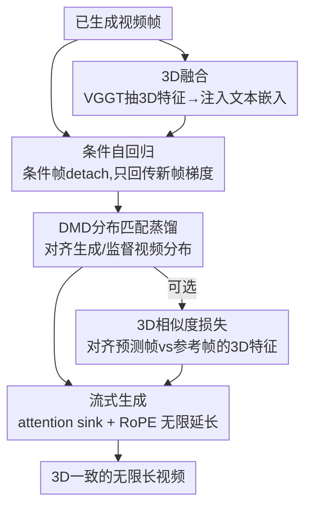

# Endless World: Real-Time 3D-Aware Long Video Generation

**会议**: CVPR 2026  
**论文**: [CVF Open Access](https://openaccess.thecvf.com/content/CVPR2026/html/Zhang_Endless_World_Real-Time_3D-Aware_Long_Video_Generation_CVPR_2026_paper.html)  
**代码**: [项目页](https://bwgzk-keke.github.io/EndlessWorld/)（暂未见开源仓库）  
**领域**: 视频生成 / 扩散模型  
**关键词**: 长视频生成, 自回归扩散, 3D一致性, 流式生成, 注意力汇聚

## 一句话总结
Endless World 把"条件自回归（截断条件帧梯度）+ 把 VGGT 提取的 3D 特征融进文本嵌入 + 注意力汇聚（attention sink）"三件事组合到一个 1.3B 蒸馏视频扩散模型上，在单张 GPU 上实时（17 FPS）生成可无限延长、几何一致、画质不随时长崩坏的视频，30 秒 VBench 总分 84.54 超过 LongLive 等同规模 SOTA。

## 研究背景与动机

**领域现状**：当前视频扩散模型（Wan2.1、LTX-Video 等）在短片段（5 秒）上画质已经很好；为了往长延伸，主流走自回归（AR）路线——把视频切成 chunk，新 chunk 以已生成帧为条件逐段往外推，并用 KV cache 加速推理（如 Self-Forcing）。

**现有痛点**：这些 AR 方法在长视频上画质会随时长持续退化，二三十秒后就出现颜色漂移、结构扭曲、闪烁。论文把根因拆成两条：(1) **训练-推理不一致**——训练时条件帧是可微的、模型会顺手"反向修改"过去的帧让整段看起来自然；但推理时条件帧已经定死、改不了，于是训练中靠"偷偷改过去"换来的协调性在推理时失效，微小运动误差逐帧累积成漂移（论文 Fig.3：第一段牛直走，续接第二段后牛莫名转向）。(2) **缺乏显式 3D 约束**——没有几何引导，长序列里几何不稳、纹理闪、场景布局前后不一致。

**核心矛盾**：要长就得自回归、自回归就有误差累积；想直接训长序列又太贵；而画面要稳就需要全局几何一致性，但现有 3D-aware 方法多依赖点云/3D cache 合成新视角再当条件，受限于合成视角质量，且没把高质量 3D 特征**直接**注入生成过程。

**本文目标**：在不训练超长序列、不增加推理开销、单 GPU 实时的前提下，做到无限长 + 3D 一致 + 画质不随时长退化。

**核心 idea**：把条件帧从计算图里 **detach（截断梯度）**，让训练目标和"推理时条件帧固定"这个事实对齐，从源头消除训练-推理鸿沟；再把 VGGT 的 3D 特征当作"和文本提示同级的全局场景描述"融进文本嵌入，给生成持续提供几何引导；最后借 streaming-LLM 的 attention sink 保住初始场景记忆以支持无限延长。

## 方法详解

### 整体框架

Endless World 建在 **Wan2.1-T2V-1.3B** 上，并按 Self-Forcing 的 DMD 范式把它转成 few-step 因果注意力模型，使其可以自回归、可实时。整条训练管线分三步走，再叠一个可选的 3D 相似度正则：

1. **3D Fusion**：用预训练的 VGGT 从（由随机噪声 latent 解码出的）视频里抽 3D 结构特征 $f_{3D}$，经一个可学习 CNN 融合模块把它注入文本嵌入，得到融合条件 $\tilde{e}$；
2. **Conditional Generation**：以已生成帧为条件、自回归生成新帧，但把条件帧 **detach**，只让新帧回传梯度；
3. **DMD 蒸馏**：用分布匹配蒸馏（Distribution Matching Distillation）以 training-free 方式把生成视频（含生成帧+条件帧）的分布对齐到监督视频分布；
4. **（可选）3D Similarity Loss**：约束"有条件预测帧"与"纯噪声生成帧"的 3D 特征一致，换取几何一致性。

推理时则用 **attention sink + RoPE** 的流式策略，在长/短上下文两种条件模式间交替，实现无限延长。整体 pipeline 如下：

### 关键设计

**1. 条件自回归 + 梯度截断：让训练目标对齐"推理时条件帧固定"这一事实**

这是全文的根基，直接针对训练-推理不一致。常规 Self-Forcing 把联合分布写成 $p_\phi(v_{1:n}) = \prod_{k=1}^{n} p_\phi(v_k \mid v^\phi_{<k})$，其中条件帧 $v^\phi_{<k}$ 是当前参数 $\phi$ 下可微预测出来的；DMD 损失匹配的是整段视频，于是梯度会同时流过"过去的条件帧"和"当前要生成的帧"，产生一种 self-forcing 效应——优化时模型偷偷修改了条件上下文，违背了推理时 $v_{<i}$ 固定且不可微的真实情形。

Endless World 的做法是把条件帧从计算图里**剥离**，当成不回传梯度的固定输入：

$$p_\phi(v_j \mid v^\phi_{i:j-1}, v_{<i}^{\text{detach}}), \quad j > i$$

整段生成分布因此变为 $p_\phi(v_{1:n}) = \prod_{k=i}^{n} p_\phi(v_k \mid v^\phi_{i:k}, v_{<i}^{\text{detach}})$，再与监督序列 $p_{\text{sup}}(v_{1:n})$ 匹配。只有新生成帧贡献参数更新，于是训练时的条件方式和推理时完全一致，梯度不会跨时间依赖泄漏，模型学到一个稳定的动力学先验、保持平滑运动轨迹——从源头堵住了误差累积，而不是事后修补。消融里它把总分从 82.94 抬到 83.30。

**2. 3D Fusion：把 VGGT 的 3D 特征当作"和文本同级的全局场景描述"注入文本嵌入**

针对"缺显式几何引导导致长序列几何漂移"。作者的关键观察是：文本提示和 3D 特征本质上都是对"整个世界结构"的高层全局描述，所以可以让 3D 特征扮演和文本 prompt 类似的角色，而不是去合成新视角当条件。

具体地，对视频 latent $v \in \mathbb{R}^{c\times h\times w\times d}$（解码出 $d' = 4(d-1)+1$ 帧），用预训练 VGGT 抽出 3D 特征 $f_{3D} \in \mathbb{R}^{c'\times h'\times w'\times d'}$，经一个可学习 CNN 融合模块 $f_{\text{fusion}}$ 与文本嵌入 $e_{\text{text}}$ 融合：$\tilde{e} = f_{\text{fusion}}(e_{\text{text}}, \hat{f}_{3D})$。融合模块内部先用卷积把 3D 特征投到文本嵌入维度，再过一个 **zero convolution** 加到文本嵌入上（zero-conv 让 3D 分支从零起步、不破坏预训练 backbone）。这个设计有两个好处：(1) 模型加不加 3D 特征都能跑，初始化场景时无需切换模型；(2) 融合在**全局文本层而非视频 latent 层**——消融显示 latent 级融合虽保几何但会扰乱局部运动、引入光流不一致和闪烁，而文本级融合更稳。整个融合模块和 DMD 损失联合优化，无需重训生成 backbone。该模块把总分推到 84.54，且在多目标（81.73→90.55）、美学质量（61.72→66.33）等维度大涨。

**3. 3D Similarity Loss：用余弦相似度软约束几何一致，并把它做成可选开关**

针对"想要更强几何一致、但又不想硬性多视图重建破坏自然度"。训练时做两步生成：先生成完整序列，再随机 mask 一部分帧、用前面的条件上下文把它们预测出来。设 $\hat{v}^t$ 为有条件预测帧、$v^t$ 为纯噪声生成帧，二者都经 $P_\theta$ 投到 3D 特征空间得 $\hat{f}_{3D}^t, f_{3D}^t$，损失为：

$$\mathcal{L}_{\text{3D}} = 1 - \frac{\langle \hat{f}_{3D}^t, f_{3D}^t \rangle}{\|\hat{f}_{3D}^t\|_2 \, \|f_{3D}^t\|_2}$$

总目标 $\mathcal{L}_{\text{total}} = \mathcal{L}_{\text{gen}} + \lambda_{3D}\mathcal{L}_{3D}$，$\lambda_{3D}=0.1$。它鼓励预测帧和参考帧的 3D 表示对齐，提升主体/背景/时序一致性，但**会牺牲一点运动平滑度和美学质量**（表 5：时序闪烁 97.86→98.41，但美学 66.33→61.60）——所以作者诚实地把它设成可选模块，让用户在"几何保真"和"视觉自然"之间可控权衡。

**4. Attention Sink + RoPE 流式生成：保住初始场景记忆，支持无限延长**

针对"无限延长时如何不丢初始场景特征、又不重训"。借鉴 streaming-LLM，推理时保留**首帧的全部 token 作为持久 sink token**，维持上下文记忆；并在 KV cache 之后再施加旋转位置编码（RoPE），编码相邻生成窗口之间的时间相位连续性，让窗口切换平滑、抑制边界伪影。为兼顾一致性与效率，推理在两种条件模式间交替：(1) **长上下文**——以 18 个 latent（1 个 sink 帧 + 68 个近邻帧）生成 3 个 latent（12 帧）；(2) **短上下文**——以 3 个 latent（sink 帧 + 最近 2 个 latent）生成 18 个 latent（72 帧）。消融显示单是加 sink 就把总分从 81.59 抬到 82.94、语义分从 72.70 猛涨到 79.16，说明稳住长程注意力对抑制时长退化最关键。

### 损失函数 / 训练策略
训练数据用 VidProM；每段 81 帧，按每 3 帧一个时间块切分，随机 mask 未来段 $\{t,\dots,T\}$（$T=81$，$t$ 可被 3 整除），用前面未 mask 帧作条件预测被 mask 部分。总目标 $\mathcal{L}_{\text{total}} = \mathcal{L}_{\text{gen}} + \lambda_{3D}\mathcal{L}_{3D}$，$\lambda_{3D}=0.1$，$\mathcal{L}_{\text{gen}}$ 即 DMD 生成损失。训练用 4× H100，推理用 1× H100。

## 实验关键数据

### 主实验
评测基于 VBench-long（944 个视频、16 个维度）+ 用户偏好研究；backbone 为 Wan2.1-T2V-1.3B，832×480、16 FPS。30 秒 VBench 主结果（基线数据取自 LongLive）：

| 模型 | 时长 | 类型 | 参数 | FPS↑ | 总分↑ | 质量↑ | 语义↑ |
|------|------|------|------|------|------|------|------|
| Wan2.1 | 5s | Diffusion | 1.3B | 0.78 | 84.26 | 85.30 | 80.09 |
| Self-Forcing | 30s | AR | 1.3B | 17.0 | 81.59 | 83.82 | 72.70 |
| FramePack | 30s | AR | 1.3B | 0.92 | 81.95 | 83.61 | 75.32 |
| LongLive | 30s | AR | 1.3B | 20.7 | 83.52 | 85.44 | 75.82 |
| **Endless World** | 30s | AR | 1.3B | 17.0 | **84.54** | **85.52** | **80.60** |

亮点：30 秒长视频上总分/质量/语义全面领先同规模 AR 方法，语义分（80.60）甚至接近只能出 5 秒的 Wan2.1，且保持 17 FPS 实时。60 秒对比（表 6 / 表 2）里 Self-Forcing 从 5s→30s 总分崩 84.31→81.59，而 Endless World 60s 仍有 84.73 质量分，退化远更平缓。

### 消融实验
30 秒 VBench，逐组件叠加（表 3，Condition 分 Video Latent / Text Token 两栏）：

| Sink | Cond(Latent) | Cond(Text) | 3D | 总分↑ | 质量↑ | 语义↑ | 说明 |
|------|------|------|------|------|------|------|------|
| × | × | × | × | 81.59 | 83.82 | 72.70 | 裸 Self-Forcing |
| ✓ | × | × | × | 82.94 | 83.89 | 79.16 | +attention sink |
| ✓ | ✓ | × | × | 83.30 | 84.50 | 78.48 | +条件自回归 |
| ✓ | ✓ | ✓ | × | 82.83 | 84.10 | 77.73 | 3D 融到 latent（反而掉） |
| ✓ | ✓ | × | ✓ | **84.54** | **85.52** | **80.60** | 3D 融到 text（完整模型） |

### 关键发现
- **attention sink 贡献最大的单点跃升**：语义分 72.70→79.16，说明长视频退化的主因之一是长程注意力失稳，稳住首帧记忆收益巨大。
- **3D 必须融到文本嵌入、不能融到视频 latent**：融 latent 时总分 82.83，反而比不融（83.30）还低；融 text 才升到 84.54——latent 级融合保几何却扰乱局部运动、引入闪烁。
- **3D similarity loss 是把双刃剑**：表 5 显示它提升主体/背景/时序一致性，却拉低运动平滑度与美学质量，故作者把它做成可选模块，是诚实的 trade-off 处理。
- **时长鲁棒性**：表 6 中 Endless World 30s→60s 退化温和，而 Self-Forcing 5s→30s 即大幅掉分，验证条件自回归 + 3D 融合确实抑制了累积漂移。⚠️ 表 6 中 Endless World 30s 语义分原文一处写 80.80、表 1 写 80.60，以原文为准。

## 亮点与洞察
- **"条件帧 detach"是个极简却切中要害的修复**：不改架构、不加推理开销，仅把训练梯度的流向对齐推理事实，就堵住了 AR 长视频误差累积的根因——这种"把训练目标对齐部署条件"的思路可迁移到任何 teacher-forcing 有训练-推理鸿沟的自回归生成任务。
- **把 3D 特征类比成"和文本同级的全局 prompt"**很巧妙：跳过了"合成新视角当条件"这条受合成质量拖累的老路，直接用 VGGT 全局特征 + zero-conv 注入，既保留"可有可无"的灵活性，又不动预训练 backbone。
- **诚实地把会掉点的模块标成可选**：3D similarity loss 提升几何却伤平滑度，作者没硬塞进主模型而是给开关，这种对 trade-off 的透明处理值得学习。
- **attention sink 从 streaming-LLM 迁移到视频生成**：用首帧 token 当持久 sink + KV cache 后施 RoPE 维持相位连续，是一个跨模态借用经典 trick 的好例子。

## 局限与展望
- **强依赖 VGGT 的 3D 特征质量**：几何引导的上限被 VGGT 的重建质量框住，VGGT 在极端视角/动态场景下若退化，3D fusion 收益会打折。
- **几何 vs 自然度的 trade-off 未根除**：3D similarity loss 只能二选一地权衡，没有同时拿到几何一致和运动平滑的方案。
- **⚠️ 评测以 VBench 分数为主**：长视频"无限"延长（论文展示到 120 秒）主要靠定性图和单一基准分支撑，跨方法 30s/60s 对比还掺了不同 prompt 集（944 vs 160 交互 prompt），横向比大小需谨慎。
- **改进方向**：让 3D 引导自适应 VGGT 置信度、或把几何约束做成可微的可学习权重以缓解 trade-off；以及在真正交互/开放世界场景下验证可控性。

## 相关工作与启发
- **vs Self-Forcing**：两者都自回归 + DMD 蒸馏，但 Self-Forcing 让梯度流过整段（含过去帧）造成 self-forcing 效应与训练-推理不一致；Endless World 把条件帧 detach、只更新新帧，从根上消除累积漂移，并额外加了 3D 融合与 sink。
- **vs LongLive**：LongLive 靠多 prompt 交互延长，但 prompt 切换带来低效与时序闪烁；Endless World 不依赖 prompt 转场，单 prompt 即可稳定无限延长，30s 总分 84.54 > 83.52。
- **vs 传统 3D-aware 视频生成**（依赖点云/3D cache 合成新视角当条件）：受合成视角质量限制且不把 3D 特征直接注入生成；本文用 VGGT 全局特征在文本层直接引导，几何保真与画质同涨。

## 评分
- 新颖性: ⭐⭐⭐⭐ 单点创新（detach 条件帧）简洁有力，但整体更像 Self-Forcing + 3D 特征 + sink 的精巧组合而非全新范式。
- 实验充分度: ⭐⭐⭐⭐ VBench 多维度 + 逐组件消融充分，但长视频对比掺了不同 prompt 集、缺统一长度协议下的严格横比。
- 写作质量: ⭐⭐⭐⭐ 动机推导清晰、trade-off 诚实，部分公式排版有 OCR 噪声。
- 价值: ⭐⭐⭐⭐ 单 GPU 实时 + 无限长 + 几何一致，对交互内容创作/VR/仿真有实用价值。

<!-- RELATED:START -->

## 相关论文

- [\[CVPR 2026\] StreamDiT: Real-Time Streaming Text-to-Video Generation](streamdit_real-time_streaming_text-to-video_generation.md)
- [\[CVPR 2026\] Real-Time Generation of Streamable Talking Portrait Video with Reference-Guided Deep Compression VAEs](real-time_generation_of_streamable_talking_portrait_video_with_reference-guided_.md)
- [\[CVPR 2026\] U-Mind: A Unified Framework for Real-Time Multimodal Interaction with Audiovisual Generation](u-mind_a_unified_framework_for_real-time_multimodal_interaction_with_audiovisual.md)
- [\[CVPR 2026\] Yume1.5: A Text-Controlled Interactive World Generation Model](yume15_a_text-controlled_interactive_world_generation_model.md)
- [\[CVPR 2026\] SeeU: Seeing the Unseen World via 4D Dynamics-aware Generation](seeu_seeing_the_unseen_world_via_4d_dynamics-aware_generation.md)

<!-- RELATED:END -->
