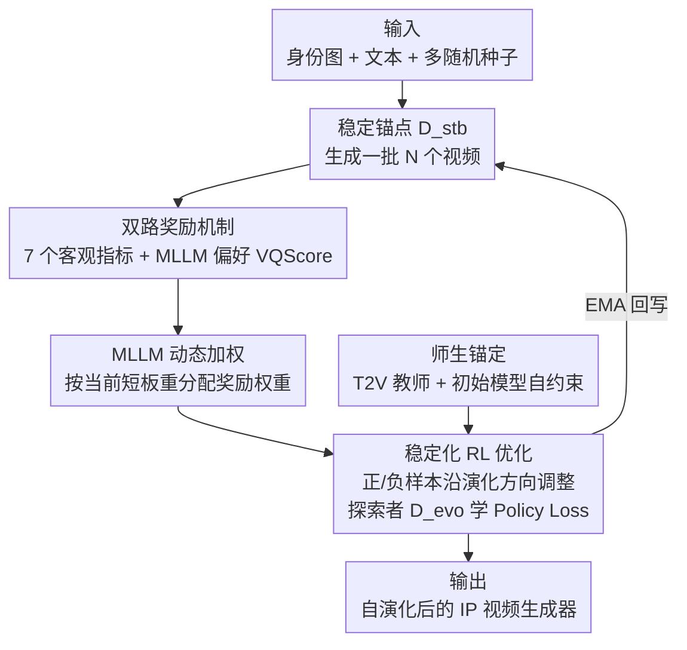

# EvoID: Reinforced Evolution for Identity-Preserving Video Generation

**会议**: CVPR 2026  
**论文**: [CVF Open Access](https://openaccess.thecvf.com/content/CVPR2026/html/Zhang_EvoID_Reinforced_Evolution_for_Identity-Preserving_Video_Generation_CVPR_2026_paper.html)  
**代码**: 未公开  
**领域**: 视频生成 / 强化学习 / 扩散模型  
**关键词**: 身份保持视频生成, 强化学习, 双路奖励, 师生框架, MLLM 动态加权

## 一句话总结
EvoID 把"身份保持视频生成"从模仿学习重写成一个用强化学习驱动的自演化过程：用一套"客观指标 + MLLM 整体偏好"的双路奖励当内在评委、用冻结的 T2V 教师锚住探索，让生成模型主动权衡身份保真、动作自然和时序连贯，在 OpenS2V-Eval 人物域上把 Total Score 刷到 0.704、超过开源 VACE-14B（0.658）和商用 Hailuo（0.653）。

## 研究背景与动机
**领域现状**：身份保持（identity-preserving, IP）视频生成的目标是——给一张/几张参考人脸 + 一段文本提示，生成该主体做新动作的视频，同时人脸还得"像"。当前主流做法是模仿学习（imitation learning）：在预训练扩散/DiT 上挂适配器或微调，用 L1/L2/LPIPS 这类重建损失，学一个从「参考图 + 文本」到「视频帧」的静态映射。

**现有痛点**：重建损失是一个"静态目标"，它只会让输出去逼近某个参考帧，却没有任何机制去主动权衡一段好 IP 视频真正在乎的几个高层、以人为中心的质量——身份保真（像不像）、动作自然（动得合不合物理）、时序连贯（帧间稳不稳）。结果模型陷入一种"保守均衡"：为了把脸做像，干脆把参考图硬贴上去，也就是臭名昭著的 **copy-paste 效应**——脸是像了，但人僵在那儿、动作生硬，整体观感崩了。

**核心矛盾**：最优的"严格保身份 ↔ 允许形变换自然动作"之间的平衡点，是随输入（不同人脸、不同提示词）和训练阶段动态变化的。一个固定的损失函数没法导航这种状态相关（state-dependent）的多目标权衡。

**本文目标**：要一个能在训练过程中动态决定"此刻该优先优化哪个质量维度"的框架。要落地这件事，得啃下把 RL 用到 IP 视频生成的两个硬骨头：(1) 怎么设计一个能准确反映"多维度质量"的奖励信号？(2) 怎么保证追奖励的同时不把底层生成能力/真实感搞崩？

**切入角度**：把任务重新表述成一个序列决策问题——用 RL 让生成模型"自演化"，主动学一套针对多维感知目标的生成策略，越过预训练能给的上限。

**核心 idea**：用"双路奖励（客观指标 + MLLM 整体偏好）当内在评委 + 师生锚定稳住探索"的自演化 RL，替代静态的重建式模仿学习。

## 方法详解

### 整体框架
EvoID 从一个预训练好的 IP DiT 生成模型出发，克隆出两份权重：**Stable Transformer**（$\mathcal{D}^{ip}_{\theta_{stb}}$，稳定锚点）和 **Evolving Transformer**（$\mathcal{D}^{ip}_{\theta_{evo}}$，快速探索者）；同时引入一个冻结的纯 T2V DiT 当 **Prior Transformer**（$\mathcal{D}^{txt}$，教师）。一次演化循环是这样转的：稳定锚点在同一组「身份图 + 文本 + 多个随机种子」下生成一批视频 → 多个奖励模型给这些视频打客观分 + 偏好分 → 一个 MLLM 看完这一批视频，输出一组权重指出"模型现在哪方面强、哪方面该补" → 把这组权重融合成统一奖励 → 把加噪视频并行喂给三个网络，探索者按"奖励驱动的 Policy Loss + 教师的 Regularization Loss"更新，稳定锚点则用探索者的 EMA 缓慢跟随。

整个 pipeline 是"生成 → 评分 → 动态加权 → 演化更新 → EMA 回写"的闭环，多模块协同且带反馈回路，框架图如下：

### 关键设计

**1. 稳定化 RL 优化：用"演化方向"把好坏样本拉向真值**

针对"静态重建损失没法主动优化多维权衡"这个痛点，EvoID 把优化重写成 RL。每步对条件 $c_{ip}=\{c_{txt}, x_{id}\}$，稳定锚点先生成一批 $N$ 个视频，每个视频经奖励函数得到归一化分 $\mathcal{R}(v_i)\in[0,1]$。对样本 $x_0$ 加噪得 $x_t=(1-t)x_0+t\epsilon$，分别让两个网络预测速度 $v_{stb}=\mathcal{D}^{ip}_{\theta_{stb}}(X)$、$v_{evo}=\mathcal{D}^{ip}_{\theta_{evo}}(X)$，定义二者之差 $\Delta=v_{evo}-v_{stb}$ 为探索者在同一带噪输入上的"演化方向"。核心思路是：如果 $x_0$ 是高奖励的正样本，就要求稳定策略沿演化方向走一步 $v^+=v_{stb}+\beta\Delta$ 去逼近真实速度 $v=\epsilon-x_0$；如果是低奖励样本，则要求反着走 $v^-=v_{stb}-\beta\Delta$ 去逼近真值。Policy Loss 写作

$$\mathcal{L}_{policy}=\mathcal{R}(x_0)\|v^+-v\|_2^2+(1-\mathcal{R}(x_0))\|v^--v\|_2^2$$

直觉上就是"奖励高的方向多走、奖励低的方向退回"，论文引用已有结论说按此目标训出的新策略期望奖励高于原策略。最后 $\theta_{evo}$ 用梯度下降更新，$\theta_{stb}$ 用 $\theta_{evo}$ 的 EMA 缓慢跟随——探索者放开手脚试，锚点提供稳定的对比基准，这是整个自演化能稳住的底盘。

**2. 师生锚定探索：T2V 教师 + 自约束防 reward hacking**

只优化 Policy Loss 会让模型去"黑"奖励函数（reward hacking），把通用生成能力练崩，也就是 quality drift / 灾难性遗忘。这一设计就是来兜底的。EvoID 选一个和 IP 模型共享同一 VAE 空间的冻结 T2V 模型 $\mathcal{D}^{txt}$ 当"教师"，用一个 L2 对齐损失当 KL 散度的简化代理，把学生的速度预测锚到这个稳健的"世界先验"上：

$$\mathcal{L}_{t2v}=\|\mathcal{D}^{ip}_{\theta_{evo}}(x_t,t;c_{ip})-\mathcal{D}^{txt}(x_t,t;c_{txt})\|_2^2$$

此外借鉴 PPO/GRPO 的自约束思路，把初始 IP 模型 $\mathcal{D}^{ip}_{\theta_0}$ 当成额外的"自己当教师"，约束学生别偏离原策略太远：$\mathcal{L}_{self}=\|\mathcal{D}^{ip}_{\theta_{evo}}(x_t,t;c_{ip})-\mathcal{D}^{ip}_{\theta_0}(x_t,t;c_{ip})\|_2^2$。最终目标是三项加权和

$$\mathcal{L}_{evo}=\mathcal{L}_{policy}+\lambda_{t2v}\mathcal{L}_{t2v}+\lambda_{self}\mathcal{L}_{self}$$

其中 Policy Loss 是演化的驱动力、$\mathcal{L}_{t2v}$ 提供通用画质锚、$\mathcal{L}_{self}$ 保优化稳定（实现里 $\lambda_{t2v}=0.01$、$\lambda_{self}=0.2$）。和 Identity-GRPO 那类"另外训一个专用奖励模型"的路线不同，EvoID 不需要单独训奖励模型，而是用现成模型 + 两个正则化教师把稳定性和先验补回来。

**3. 双路奖励机制：客观指标 + MLLM 偏好（VQScore）当内在评委**

单靠任何一个现成视觉模型的分数都只反映一个侧面，没法捕捉人眼的整体偏好——典型反例就是 copy-paste：把脸硬贴上去时 ArcFace 身份相似度很高，但视频物理上很别扭、根本不符合人的观感。这一设计用两条路互补。第一条路是 **7 个客观奖励**，分三个角度：身份保真用 ArcFace + CurricularFace 测生成视频人脸与参考图的余弦相似度；文本一致用 GME 模型测视频-提示语义一致；视觉质量用 Aesthetic（艺术性）+ Q-Align（时序连贯）+ Naturalness（真实感）+ 帧间 Optical Flow（动作"活力"/动态范围）。第二条路是 **MLLM 偏好奖励 VQScore（Visual Quality Score）**：给 MLLM 一份详细评分细则，要它从视觉真实感、文本一致、人脸身份一致、动作自然、镜头运动这 5 个维度观察，再综合成一个总分当人类偏好代理。两条路一起，把"细粒度可量化"和"整体主观偏好"都管住，专门压制 copy-paste 这种"指标高但观感差"的退化。

**4. MLLM 指挥的动态加权：按当前短板自适应重分配权重**

有了 $K$ 个奖励，怎么聚合是关键——它们彼此往往有竞争方向（比如追求大动态范围的动作会因人体大幅变姿势而损害身份保真）。这一设计让 MLLM 来当指挥。先把 $K$ 个奖励按 MLLM 的三个评估角度分成 $G=3$ 组（Identity / Text / Quality），每个奖励有经验先验权重 $w^k_{prior}$，按组内求和归一化得到先验比例 $p^g_{prior}$。每轮迭代 MLLM 看完这批视频输出一个 3 维"关注度"向量 $S_v=\{s^g\}$，用平滑因子 $\tau$ 归一化成 $p^g_{mllm}=(s^g+\tau)/\sum_{g'}(s^{g'}+\tau)$；再用混合系数 $\gamma$ 线性融合先验和 MLLM 反馈：

$$p^g_{blend}=(1-\gamma)\,p^g_{prior}+\gamma\,p^g_{mllm}$$

最后把组比例 $p^g_{blend}$ 按组内原比例下分回每个奖励 $w^k_{final}=p^g_{blend}\cdot\big(w^k_{prior}/\sum_{k'\in G_g}w^{k'}_{prior}\big)$，聚合奖励为 $\sum_k w^k_{final} R'_k$（$R'_k$ 是每个图文对内跨视频变体归一化后的奖励）。这样就把更高权重自适应地分给"当前模型的短板维度"，逼模型补短板，最终拿到一个更均衡、更贴人类偏好的生成质量。

### 损失函数 / 训练策略
最终损失即上面的 $\mathcal{L}_{evo}=\mathcal{L}_{policy}+0.01\,\mathcal{L}_{t2v}+0.2\,\mathcal{L}_{self}$。训练用 VACE-14B 当基座 IP 模型，T2V 教师是 Wan2.1-T2V-14B，奖励估计和 EvoScore 评测都用 Qwen3-VL-30B-A3B-Instruct。学生和锚点都用 LoRA（rank=32, alpha=32）实现；每步采 4 个图文对、每对 8 个种子共 32 个视频变体；AdamW、学习率 1e-4、共 200 步演化更新。整套训练在 36 张 H100 上约 36 小时，相对标准 RL 只多约 16% 时间开销；推理用 20 步去噪、CFG=5.0。

## 实验关键数据

### 主实验
在 OpenS2V-Eval 人物域（60 个人脸-提示对）上，按官方 6 个子指标 + 加权 Total Score，外加自定义的 MLLM 指标 EvoScore 评测。EvoID 在 Total Score 和 EvoScore 上都拿了第一（节选关键对比）：

| 方法 | 类型 | FaceSim.↑ | Total Score↑ | EvoScore↑ |
|------|------|-----------|--------------|-----------|
| VACE-14B（基座） | 开源 | 0.647 | 0.658 | 0.544 |
| Phantom-14B | 开源 | 0.550 | 0.642 | 0.567 |
| Hailuo | 商用 | 0.577 | 0.653 | 0.588 |
| ViduQ2 | 商用 | 0.514 | 0.650 | 0.648 |
| **EvoID** | 本文 | **0.745** | **0.704** | 0.682 |
| **EvoID†**（加 EvoScore 当奖励） | 本文 | 0.675 | 0.687 | **0.718** |

EvoID 与基座 VACE-14B 架构相同，却把 Total Score 从 0.658 提到 0.704、EvoScore 从 0.544 提到 0.682，验证了优化范式本身带来的增益。EvoID† 把 EvoScore 也当训练奖励后，Total Score 略降到 0.687（仍超所有 baseline），EvoScore 升到 0.718——同时 Face Similarity 从 0.745 掉到 0.675，说明显式的 EvoScore 引导压制了 copy-paste，把模型推向更贴整体人类偏好的策略。

人工 2AFC 盲评（10 人评 50 个野外案例）的 EvoID 胜率：

| 对比 | 身份一致(IC) | 动作自然(MN) | 视频质量(VQ) |
|------|------|------|------|
| vs. VACE-14B（开源） | 52% | 64% | 74% |
| vs. ViduQ2（商用） | 70% | 52% | 45% |

EvoID 全面胜过 VACE；对商用 ViduQ2 在身份一致上明显领先、动作自然持平，仅视频质量略逊（作者归因于商用系统的私有前后处理流水线）。

### 消融实验
客观奖励设计的逐步消融（OR 内部）：

| 配置 | Total Score↑ | EvoScore↑ | 说明 |
|------|------|------|------|
| 基座 VACE-14B | 0.658 | 0.544 | 起点 |
| + 均匀加权奖励(UWR) | 0.685 | 0.627 | 仅引入 RL 已大涨 |
| + UWR + T2V 教师(TP) | 0.706 | 0.663 | 教师提真实感 |
| + 先验加权奖励(PWR) | 0.715 | 0.645 | 战略性重加权 |
| + PWR + TP | 0.715 | 0.664 | 客观奖励最优组合 |

双路奖励机制消融（建立在 OR=PWR+TP 之上）：

| OR | +偏好奖励(PR) | +MLLM动态加权(MDW) | +EvoScore奖励(ESR) | Total Score↑ | EvoScore↑ |
|----|----|----|----|------|------|
| ✓ | | | | 0.715 | 0.664 |
| ✓ | ✓ | | | 0.685 | 0.675 |
| ✓ | ✓ | ✓ | | 0.704 | 0.682 |
| ✓ | ✓ | ✓ | ✓ | 0.687 | 0.718 |

### 关键发现
- **RL 范式本身就是主要增益来源**：仅把模仿学习换成均匀加权奖励的 RL，Total Score 就从 0.658 跳到 0.685，证明"静态重建 → 自演化优化"这步换对了。
- **Total Score 和 EvoScore 存在权衡与协同**：只用客观奖励 Total Score 最高（0.715）但 EvoScore 最低（0.664），因为它直接优化前者；加入偏好奖励 PR 后 Total 降、EvoScore 升，模型从"偏爱高身份相似度的僵硬 copy-paste"转向更自然生动的结果（定性图 4 印证）。
- **动态权重确实在"追短板"**：训练中 Face Similarity 与 Motion Amplitude 两个奖励的权重随步数此消彼长，体现了 MLLM 指挥的加权在不同阶段把注意力切到当前最弱的维度。
- **EvoScore 用"短板效应"设计**：它把三大方面（身份一致/提示遵循/技术画质）各取子项最小值、再求三方面调和平均，专门让任一维度的"短板"压低总分——与强调整体偏好的 PR 互补。

## 亮点与洞察
- **把 IP 视频生成重述成 RL 自演化**：跳出"静态映射"的框，让模型在训练中动态决定该优先优化哪个维度，直击 copy-paste 这种保守均衡——这是最让人"啊哈"的视角转换。
- **双路奖励 = 客观可量化 + MLLM 主观偏好**：用现成 7 个视觉模型给细粒度信号、再用 MLLM 的 VQScore 补"整体观感"，不需要另训专用奖励模型就把"指标高但观感差"的退化堵上了，这套配方可直接迁移到其他偏好对齐的生成任务。
- **MLLM 当"动态评委"指挥权重**：让 MLLM 每轮看一批输出、判断当前短板并重分配奖励权重，把"多奖励聚合"这个老大难变成自适应过程，思路可复用到任何多目标 RLHF。
- **稳定性工程很务实**：EMA 锚点 + T2V 教师 + 自约束三件套把 RL 训练的崩溃风险压住，且只多约 16% 时间开销，工程上很可落地。

## 局限与展望
- 训练数据规模偏小（291 张人脸 + 每张 ≥5 条 ChatGPT 生成提示），且只在人物域评测，能否泛化到非人脸主体/多主体场景未验证。⚠️ 评测主要在 OpenS2V-Eval 人物域。
- 强依赖 MLLM（Qwen3-VL-30B）：奖励权重和 VQScore 都由它产出，奖励质量、稳定性、潜在偏置都被这个 MLLM 锚定；用更弱/不同的 MLLM 时鲁棒性如何未知。
- Total Score 与 EvoScore 之间存在结构性权衡——把 EvoScore 当奖励会牺牲 Face Similarity 和 Total Score，说明"两个指标都最优"暂不可得，最终取舍依赖你更信哪个指标。
- 对商用 ViduQ2 的视频质量仍略逊，作者归因于商用系统私有前后处理，提示纯训练范式之外的工程管线仍有差距。
- 改进方向：把双路奖励里的客观模型换成可学习/可在线更新的奖励、引入多主体与非人脸身份、探索 MLLM 评委的不确定性校准以减小奖励噪声。

## 相关工作与启发
- **vs 模仿学习类（ConsisID / Phantom / VACE）**：它们用重建损失学静态映射、易陷 copy-paste；EvoID 在同一基座（VACE-14B）上换成自演化 RL，主动权衡多维质量，Total Score 0.658→0.704。
- **vs Identity-GRPO 类**：那类路线要在人类偏好数据上单独训专用奖励模型再用 GRPO 优化；EvoID 不训专用奖励模型，而用"现成多模型客观奖励 + MLLM 偏好 + 师生正则"组合，绕开了奖励模型的训练成本。
- **vs 通用扩散 RL（PPO / DPO / GRPO / Flow-GRPO）**：EvoID 借用了它们的策略梯度/自约束思想，但针对 IP 视频生成特有的"多维竞争目标 + 稳定性"做了双路奖励和 MLLM 动态加权这两层定制。

## 评分
- 新颖性: ⭐⭐⭐⭐⭐ 把 IP 视频生成重写为 RL 自演化，双路奖励 + MLLM 动态加权是有想法的组合创新。
- 实验充分度: ⭐⭐⭐⭐ 对比 SOTA、人工盲评、两组消融都有，但仅人物域、数据规模偏小。
- 写作质量: ⭐⭐⭐⭐ 动机-挑战-方法链条清晰，公式与图配套；指标体系略多需细读。
- 价值: ⭐⭐⭐⭐⭐ 给身份保持/可控视频生成提供了可迁移的偏好对齐范式，工程开销可控。

<!-- RELATED:START -->

## 相关论文

- [\[CVPR 2026\] Identity-Preserving Image-to-Video Generation via Reward-Guided Optimization](identity-preserving_image-to-video_generation_via_reward-guided_optimization.md)
- [\[CVPR 2026\] ConsID-Gen: View-Consistent and Identity-Preserving Image-to-Video Generation](consid-gen_view-consistent_and_identity-preserving_image-to-video_generation.md)
- [\[CVPR 2026\] PLACID: Identity-Preserving Multi-Object Compositing via Video Diffusion with Synthetic Trajectories](placid_identity-preserving_multi-object_compositing_via_video_diffusion_with_syn.md)
- [\[CVPR 2025\] Identity-Preserving Text-to-Video Generation by Frequency Decomposition](../../CVPR2025/video_generation/identity-preserving_text-to-video_generation_by_frequency_decomposition.md)
- [\[CVPR 2026\] Stand-In: A Lightweight and Plug-and-Play Identity Control for Video Generation](stand-in_a_lightweight_and_plug-and-play_identity_control_for_video_generation.md)

<!-- RELATED:END -->
