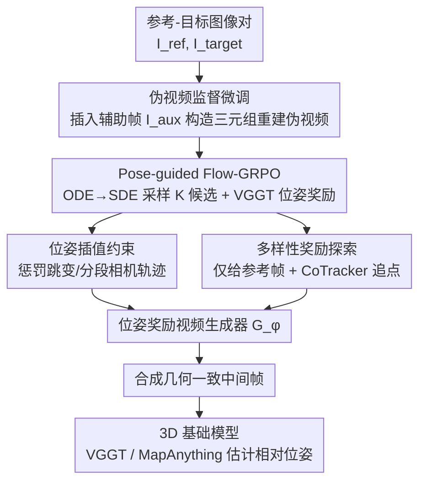

# ExPose: Reinforcing Video Generation Models for Extreme Pose Estimation

**会议**: CVPR 2026  
**论文**: [CVF Open Access](https://openaccess.thecvf.com/content/CVPR2026/html/Yoon_ExPose_Reinforcing_Video_Generation_Models_for_Extreme_Pose_Estimation_CVPR_2026_paper.html)  
**代码**: https://github.com/yh-yoon/ExPose  
**领域**: 视频生成 / 3D视觉  
**关键词**: 极端视角位姿估计, 视频生成, Flow-GRPO, 3D基础模型, 中间帧插值  

## 一句话总结
当两张图视角差异极大、几乎没有重叠时，直接做相对位姿估计会崩；ExPose 用 GRPO 强化学习把视频生成模型微调成「位姿奖励驱动」的生成器，让它在两帧之间补出**几何一致**的中间帧，再喂给 VGGT/MapAnything 这类 3D 基础模型，从而把极端视角下的位姿估计精度显著拉高（DL3DV AUC 48.1→53.6）。

## 研究背景与动机

**领域现状**：相对相机位姿估计是 SfM、SLAM、3D 重建的基石。传统方法靠像素级特征对应做重投影误差优化，重叠充足时很准；近年的 3D 基础模型（VGGT、MapAnything 等）用前馈网络直接回归几何与位姿，把对「足够重叠」的硬性依赖松了一些。

**现有痛点**：当两张输入图**视觉重叠极小、视角变化极大**（extreme baseline）时，传统优化法直接灾难性失败，3D 基础模型也因为只靠点级监督信号、缺乏对真实 3D 场景的上下文理解而力不从心。一个自然的补救思路是用视频生成模型在两帧之间**插值出中间帧**，给 3D 模型更多观测线索——人类只看几张零散视角就能脑补出合理布局，靠的正是这种上下文先验。

**核心矛盾**：视频生成模型的训练目标主要是「视觉真实 + 时序平滑」，它**没有显式的 3D 几何意识**。于是它生成的中间帧往往「时序上看着顺、空间上却几何错乱」——画面流畅但相机轨迹不合理。结果是下游位姿估计变成了**靠运气**：得反复采样、人工挑出那些碰巧几何自洽的视频，既不稳定也不可控。

**本文目标**：让视频生成模型在生成中间帧时，把「生成质量」和「3D 一致性」对齐到位姿估计这个真正的下游目标上，而不是只追求好看。

**切入角度**：把下游的 3D 基础模型（VGGT）当成一个**几何感知的奖励器**——它能对候选视频打出「位姿误差有多小」的分数。于是「中间帧是否几何一致」这个本来难以监督的目标，被转化成一个可优化的标量奖励，正好可以用 RL 来拉。

**核心 idea**：用 GRPO（Group Relative Policy Optimization）微调视频生成模型，奖励信号来自 3D 基础模型给出的位姿精度——让生成器学会产出「对位姿估计有帮助」的几何一致中间帧，而**不需要任何 3D ground-truth 监督**。

## 方法详解

### 整体框架

ExPose 要解决的是：给定一对极端视角的参考图 $I_{ref}$ 和目标图 $I_{target}$，估计它们之间的相对位姿 $(\hat R, \hat t) = F_\theta(I_{ref}, I_{target})$。直接两视图推断容易失败，所以它先用一个视频生成器 $G_\phi$ 把两帧之间的中间帧补出来，把稀疏观测补成稠密序列，再交给固定的 3D 位姿估计器 $F_\theta$。整套训练把生成器 $G_\phi$ 调成「位姿奖励的」生成器，分三个互补组件叠加。

训练时流水线是：先用**伪视频监督微调**给模型打底（在训练对中间挑一个辅助帧 $I_{aux}$，构造三元组生成伪视频做重建监督），让它先学会基本的物理合理过渡；再上**Pose-guided Flow-GRPO 在线强化学习**，把确定性的 rectified-flow 采样改成随机采样以产出一组候选，用 VGGT 算出的位姿奖励做组内相对偏好更新；同时叠加**位姿插值约束**惩罚跳变轨迹、**多样性奖励**鼓励探索不同相机路径。推理时只输入 $\{I_{ref}, I_{target}\}$，辅助帧 $I_{aux}$ 只在训练期用于构造伪视频。

### 关键设计

**1. 伪视频监督微调：先给生成器灌一份「物理合理」的底**

只用两帧条件去生成中间帧，模型很容易脑补出不连续、世界乱变的内容，直接拿去做 RL 会非常不稳。ExPose 的对策是在训练期额外引入一个辅助帧：从 DL3DV 数据集里，在 $I_{ref}$ 和 $I_{target}$ 之间挑一个**与两端都有有意义重叠**的中间视图 $I_{aux}$，组成三元组 $\{I_{ref}, I_{aux}, I_{target}\}$。$I_{aux}$ 的选法不是随便取中点，而是对候选帧做小规模子采样、保留那个在验证集上**始终能让下游位姿估计更准**的帧——选择标准直接由 3D 基础模型的位姿精度增益来引导。

用一个预训练视频生成器在三元组条件下产出 $N$ 帧伪视频 $V(I_{ref}, I_{aux}, I_{target})$ 作为监督目标，而待训练的 $G_\phi$ 只用两帧条件 $\hat V = G_\phi(I_{ref}, I_{target})$ 去对齐它，逐帧 L1 重建：

$$\mathcal{L}_{SFT} = \frac{1}{N}\sum_{n=1}^{N}\left\|\hat V^{(n)}(I_{ref}, I_{target}) - V^{(n)}(I_{ref}, I_{aux}, I_{target})\right\|_1$$

这一步的意义是：辅助帧像一个「锚点」，把两帧之间该长什么样钉住，抑制了只给两帧时的突变和不真实世界变化，让模型先有一个几何上不离谱的初始化，后面 RL 才不会从一堆垃圾候选里学。消融里它把 video-only 基线的 MRE 从 44.13 直接干到 35.48，是单组件里贡献最大的。

**2. Pose-guided Flow-GRPO：把下游位姿误差变成可优化的奖励**

SFT 只是模仿伪视频，并没有直接对齐「位姿估计准不准」这个真正目标。ExPose 的核心创新是在线 RL：以 VGGT 为奖励器，用 GRPO 把生成器往「对位姿有帮助」的方向推。这里有两个工程难点要解。

其一，骨干 LTX-Video 是 rectified-flow（RF）模型，采样是**确定性**的——解 ODE 对同一条件只得唯一输出，没法产生 GRPO 需要的一组多样候选。ExPose 把确定性的 ODE 更新 $dx_t = v_\phi(x_t, t)\,dt$ 改写成一个**保持每个时刻边缘分布不变**的 SDE 更新：

$$x_{t+\Delta t} = x_t + D_\phi(x_t, t)\,\Delta t + \sigma_t\sqrt{\Delta t}\,\varepsilon$$

其中漂移项 $D_\phi$ 在原速度场基础上加了一项校正，$\sigma_t$ 控制探索强度，$\sigma_t=0$ 时退化回原始确定性采样。这样就能在同一对参考-目标条件下采出 $K$ 个不同候选视频。

其二，奖励怎么算。对每个候选 $i$，VGGT 从中估出位姿 $(\hat R_i, \hat t_i)$，与 ground-truth 的旋转 $R^\star$ 和单位平移方向 $u^\star$ 比，定义一个尺度无关、同时平衡旋转与平移方向的紧凑奖励：

$$r_{\text{pose},i} = -\lambda_{rot}\, d_{SO(3)}(\hat R_i, R^\star) - \arccos\!\left(\tilde t_i^\top u^\star\right)$$

$d_{SO(3)}$ 是测地旋转距离，后一项用 $\tilde t_i = \hat t_i/\|\hat t_i\|_2$ 度量平移方向夹角。组内做相对归一化 $s_i = r_i - \bar r$，再用组内成对偏好更新策略（高分样本优先）：

$$\mathcal{L}_{GRPO} = -\sum_{groups}\sum_{(i\succ j)}\log\sigma\!\left(\beta(s_i - s_j)\right) + \mathcal{L}_{KL}$$

$\sigma$ 是 logistic 函数、$\beta$ 是温度；KL 项 $\mathcal{L}_{KL} = \lambda_{KL}\,\mathrm{KL}(\pi_\phi \| \pi_{\phi_0})$ 把更新后的策略拉住、别偏离预训练生成器太远，防止模式坍缩。整个过程只更新生成器 $G_\phi$，位姿估计器 $F_\theta$ 全程冻结。这一设计的妙处在于：监督直接对齐推理目标——生成器不再追求「视觉合理」，而是被逼着产出「让位姿估计更准」的内容。

**3. 位姿插值约束（PIC）：把相机轨迹逼成一条连续单镜头**

光有位姿奖励还不够：候选视频可能在端点处碰巧对齐，但中间相机轨迹是跳切、分段的（multi-take），这种「拼接感」会污染位姿回归。PIC 是一个简单的几何正则：从每个候选的逐帧位姿里取出相机中心 $\{c_t\}$，设 $c_1, c_T$ 为参考/目标帧中心、$c_m$ 为中间帧中心，度量中点是否「到两端等距」，把偏离当惩罚：

$$r_{pic} = -\lambda_{pic}\cdot\frac{\bigl|\,d(c_m, c_1) - d(c_T, c_m)\,\bigr|}{D + \varepsilon}$$

其中 $d(a,b)=\|a-b\|_2$，$D = d(c_T, c_1)$，$\varepsilon$ 防除零。这个尺度归一化的奖励偏好相机中心在两端之间**平滑过渡**的视频，给跳切、碎片化的轨迹打低分。消融里它把 MTE 从 21.35 进一步降到 20.72，主要收益体现在平移方向的稳定上。

**4. 多样性奖励：逼策略去探索不同的相机路径**

RL 要有效，每个输入必须探索出多条候选、才能发现高奖励方向；但纯噪声注入常常坍缩成一堆相似轨迹。ExPose 的做法是**只用参考帧**做条件（把目标帧从条件里拿掉），让生成器在早段自由发散出多种合理运动。对每个生成视频用 CoTracker 在早段追一格点，定义每点从首帧到早段末帧的相对位移 $r^{(b)}(n)$；两个视频 $(i,j)$ 在共同可见点集 $S_{ij}$ 上算位移的平均 L2 距离 $D_{ij}$，每个视频的多样性奖励取其与其他视频的离对角行均值：

$$r_{div}(i) = \lambda_{div}\cdot\frac{1}{B-1}\sum_{j\ne i} D_{ij}$$

它直接度量「早段轨迹的散开程度」，奖励运动差异大的样本，从而防止轨迹坍缩、扩大探索空间。完整模型把它叠上后在所有指标上达到最优（DL3DV AUC 53.31→53.64）。

### 损失函数 / 训练策略

总训练目标把监督信号与几何偏好组合：

$$\mathcal{L} = \mathcal{L}_{GRPO} + \lambda_{SFT}\,\mathcal{L}_{SFT}$$

$\mathcal{L}_{SFT}$ 用伪视频提供旋转/平移线索（Eq. 4），$\mathcal{L}_{GRPO}$ 编码由几何奖励引导的相对偏好（Eq. 7，奖励里已含 pose reward + PIC + diversity 三部分）。骨干是 LTX-Video（rectified-flow），位姿奖励器是 VGGT，全程不需要 3D ground-truth 监督。⚠️ 训练协议与超参（如 $K$、$\lambda$ 各项取值）原文放在补充材料，正文未给出具体数值。

## 实验关键数据

评测设置：四个数据集（DL3DV、NAVI、ScanNet 室内/室外场景级 + Cambridge Landmarks 旋转主导），都人工挑「重叠极小、视角变化大」的极端图像对；两个下游位姿估计器（VGGT、MapAnything）；与 DynamiCrafter、Aether、LTX-Video（骨干）、InterPose（测试时多采样+择优）对比。指标含 MRE↓（平均旋转误差）、MTE↓（平均平移方向误差）、5°/15°/30° 阈值下的旋转/平移准确率、AUC↑。

### 主实验

DL3DV 上用 VGGT 做估计器的对比（极端视角、低重叠，最能体现方法价值）：

| 方法 | MRE↓ | MTE↓ | R@5°↑ | T@5°↑ | AUC↑ |
|------|------|------|-------|-------|------|
| VGGT（无生成帧） | 54.28 | 29.08 | 50.00 | 27.33 | 39.79 |
| Aether | 43.05 | 25.44 | 47.33 | 32.33 | 42.63 |
| LTX-Video（骨干） | 44.13 | 24.32 | 54.33 | 37.00 | 46.88 |
| InterPose | 45.22 | 23.51 | 56.33 | 37.00 | 48.13 |
| **ExPose（本文）** | **33.78** | **20.50** | **60.67** | **42.67** | **53.64** |

ExPose 在 DL3DV 上**每个指标都是 SOTA**：MRE 从骨干 44.13 降到 33.78，AUC 从 46.88 提到 53.64。Cambridge Landmarks（旋转主导）上 MRE 11.48 vs InterPose 15.36、AUC 79.44 vs 74.60，旋转全部指标 SOTA。换成 MapAnything 做估计器（Tab 3/4）趋势一致，NAVI/ScanNet 全指标 SOTA——两个不同估计器都涨，说明收益来自**生成帧本身的几何质量**，而非某个估计器的特性。

### 消融实验

DL3DV + LTX-Video 生成 + VGGT 估计，逐组件叠加：

| 配置 | MRE↓ | MTE↓ | R@15°↑ | AUC↑ | 说明 |
|------|------|------|--------|------|------|
| Video only | 44.13 | 24.32 | 66.33 | 46.88 | 仅骨干生成 |
| + SFT | 35.48 | 21.67 | 72.67 | 51.84 | 伪视频监督，降 MRE 最猛 |
| + GRPO | 34.41 | 21.35 | 73.67 | 52.84 | 位姿奖励 RL，15° 旋转准确率提升 |
| + PIC | 35.51 | 20.72 | 73.00 | 53.31 | 轨迹约束，主要降 MTE |
| + Div（完整） | 33.78 | 20.50 | 73.67 | 53.64 | 多样性探索，全指标最优 |

### 关键发现
- **SFT 贡献最大**：从 video-only 加上 SFT，MRE 一步从 44.13 砍到 35.48、AUC +5。说明在做位姿奖励 RL 之前，先用辅助帧伪视频给生成器一个几何不离谱的初始化是必要的地基。
- **各组件分工清晰**：GRPO 主要提旋转准确率（直接优化 pose 奖励），PIC 主要降平移方向误差 MTE（轨迹平滑），Div 提供最后一档全面提升（探索防坍缩）。四件套各自管一摊，叠加单调变好。
- **中间帧数量收敛**：MRE/MTE 随中间帧数增加而下降，**超过 7 帧后饱和**——方法能高效利用时序线索，不需要密集采样轨迹。
- **跨估计器一致涨**：VGGT 与 MapAnything 两个独立估计器都受益，佐证「是生成帧几何质量在起作用」而非过拟合某个估计器。

## 亮点与洞察
- **把「难监督的几何一致性」转成「可优化的标量奖励」**：3D 一致性本来没有现成监督信号，ExPose 巧妙地让下游 3D 基础模型（VGGT）充当奖励器，把「位姿估计准不准」直接当成 RL 信号，绕开了对 3D ground-truth 的需求——这是整篇最聪明的一招。
- **ODE→SDE 让确定性 flow 模型能做 RL**：rectified-flow 采样确定、本来出不了一组候选，把 ODE 改写成保边缘分布的 SDE，是 Flow-GRPO 用在视频生成上的关键工程支点，可迁移到其他想对 flow-matching 模型做 GRPO 的场景。
- **多样性奖励的「拿掉目标帧」技巧**：只给参考帧条件让模型自由发散、再用 CoTracker 追点量化轨迹散开度作奖励，是一个简单但直击「RL 探索坍缩」痛点的设计，思路可复用到其他需要轨迹多样性的生成 RL。
- **PIC 用相机中心等距性度量轨迹连续性**，把「单镜头一镜到底 vs 跳切拼接」量化成一个尺度归一化标量，简单到几乎没成本却稳住了平移方向。

## 局限与展望
- ⚠️ 依赖辅助帧 $I_{aux}$ 的挑选质量，而挑选靠「在验证集上让下游更准」来引导，本身带有数据集偏好；在没有合适中间帧可挑的数据上（如真正只有两张孤立图）SFT 这步如何构造伪视频值得追问。
- 奖励器用 VGGT 的预测位姿当「准星」，但极端视角下 VGGT 自身就可能不准——奖励信号的天花板受限于奖励器精度，存在「用一个会错的裁判去训另一个模型」的隐患（作者用多次评估平均来缓解，但未根治）。
- 整套是「生成器 + 估计器」两阶段，推理要先跑视频生成再跑位姿估计，计算开销与端到端方法相比更重；中间帧 7 帧饱和虽缓解了密度需求，但生成本身仍是瓶颈。
- 训练协议/超参全在补充材料，正文未给关键数值，复现需查补充。

## 相关工作与启发
- **vs InterPose**：InterPose 是测试时缩放——多采样若干候选视频、挑位姿一致的，本质是「事后择优」，骨干生成器没变。ExPose 直接用 RL **把生成器训成偏好几何一致**，从源头改善候选质量；DL3DV 上 AUC 53.64 vs 48.13 体现出「改训练」优于「改采样」。
- **vs LTX-Video（骨干）/ Aether / DynamiCrafter**：这些是通用视频生成模型，目标是视觉真实+时序平滑，缺乏 3D 几何意识，生成帧「好看但几何错」。ExPose 在 LTX-Video 上加位姿奖励微调后全面反超骨干，证明问题不在生成能力而在**对齐目标**。
- **vs 纯 3D 基础模型（VGGT / MapAnything）**：它们靠点级监督、极端视角下缺上下文。ExPose 把视频生成的「上下文脑补」能力与 3D 模型的几何估计结合，相当于给 3D 模型补了一层富观测，是「生成式推理 + 几何约束」协同的一个范例。

## 评分
- 新颖性: ⭐⭐⭐⭐⭐ 首次把「3D 基础模型当奖励器 + Flow-GRPO」用于极端视角位姿估计，ODE→SDE 让 RF 模型可做 RL 的支点很巧
- 实验充分度: ⭐⭐⭐⭐ 四数据集 × 两估计器交叉验证、四组件消融到位；但缺与端到端两视图方法的算力/时延对比
- 写作质量: ⭐⭐⭐⭐ 流水线三组件分工讲得清楚，公式完整；关键超参藏补充材料略影响自洽
- 价值: ⭐⭐⭐⭐ 给「稀疏/极端视角位姿估计」提供了一条用生成先验补几何的实用路线，组件大多可迁移

<!-- RELATED:START -->

## 相关论文

- [\[NeurIPS 2025\] PoseCrafter: Extreme Pose Estimation with Hybrid Video Synthesis](../../NeurIPS2025/video_generation/posecrafter_extreme_pose_estimation_with_hybrid_video_synthesis.md)
- [\[CVPR 2026\] BulletTime: Decoupled Control of Time and Camera Pose for Video Generation](bullettime_decoupled_control_of_time_and_camera_pose_for_video_generation.md)
- [\[CVPR 2026\] PoseAnything: General Pose-guided Video Generation with Part-aware Temporal Coherence](poseanything_general_pose-guided_video_generation_with_part-aware_temporal_coher.md)
- [\[CVPR 2026\] PAM: A Pose-Appearance-Motion Engine for Sim-to-Real HOI Video Generation](pam_a_pose-appearance-motion_engine_for_sim-to-real_hoi_video_generation.md)
- [\[ICML 2026\] World-R1: Reinforcing 3D Constraints for Text-to-Video Generation](../../ICML2026/video_generation/world-r1_reinforcing_3d_constraints_for_text-to-video_generation.md)

<!-- RELATED:END -->
