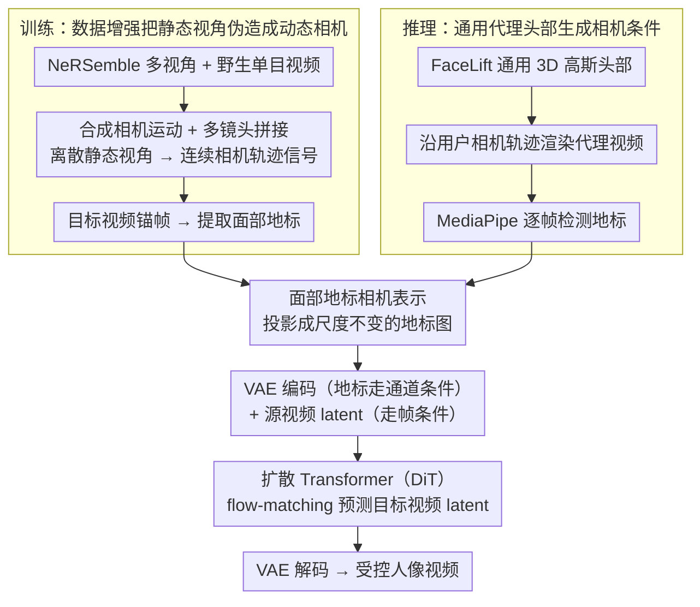

# FaceCam: Portrait Video Camera Control via Scale-Aware Conditioning

**会议**: CVPR 2026  
**arXiv**: [2603.05506](https://arxiv.org/abs/2603.05506)  
**代码**: [有](https://weijielyu.github.io/FaceCam)  
**领域**: 视频生成
**关键词**: 相机控制, 人像视频生成, 尺度感知, 面部地标, 视频扩散模型

## 一句话总结

提出FaceCam系统，通过面部地标(facial landmarks)作为尺度感知的相机表示来解决单目人像视频的相机控制问题，避免了传统相机外参表示的尺度歧义，并设计了合成相机运动和多镜头拼接两种数据增强策略支持连续相机轨迹推理。

## 研究背景与动机

可控视频生成中的相机运动控制是核心问题，在人像视频（社交媒体、后期制作、AR/VR）中尤为关键。现有方法面临两个核心挑战：

**挑战一：尺度歧义**
- **场景无关参数表示**（如Plücker射线、外参矩阵）：同一参数变化在不同尺度(scale)的场景中产生截然不同的视觉效果
- 单目视频无法确定绝对深度，场景仅确定到一个全局相似变换（未知尺度和平移）
- 数学上：对于任意 $\alpha > 0$，令 $\mathbf{x}' = \alpha\mathbf{x}$, $\mathbf{t}' = \alpha\mathbf{t}$，透视投影不变

**挑战二：训练数据**
- 获取同一动态人像场景在不同相机轨迹下的配对视频极其困难
- 合成3D动态人像数据难以达到真实感

**核心动机**：需要一种不暴露不可观测全局尺度的相机表示，同时能从有限的静态多视角数据泛化到连续相机轨迹。

## 方法详解

### 整体框架

FaceCam 想解决的是：给一段单目人像视频，让用户随意指定相机怎么运动（推近、平移、绕头转），生成对应视角的新视频，同时人脸身份不变。它的整条链路绕开了"相机外参直接当条件"的老路，改用一张**面部地标投影图**当相机指令——训练时这张图来自真实多视角数据的标注，推理时来自一个通用代理头部的渲染。

训练阶段把三路信号喂给扩散 Transformer：源视频、目标视频、以及从目标视频锚帧提取的面部地标，三者各自经 VAE 编码成 latent，模型用 flow-matching 损失学着从源视频 latent + 地标条件预测出目标视频 latent。推理阶段则换一套生成地标的办法：先用 FaceLift 造一个与身份无关的通用 3D 高斯头部（所有实验共用同一个），沿用户指定的相机轨迹把它渲染出来，再用 MediaPipe 逐帧检测面部地标，得到的地标图就是送进模型的相机条件，最终生成受控视频。

### 关键设计

**1. 面部地标作为尺度感知的相机表示：用图像空间的点对应绕开单目尺度歧义**

前面的痛点很明确——Plücker 射线、外参矩阵这类场景无关表示暴露了不可观测的全局尺度，单目视频里同一组参数在不同尺度场景下渲染出完全不同的结果。FaceCam 的破解思路来自经典多视图几何：图像空间中的点对应关系本身就足以表征相对相机运动，给定 7 个以上 2D 对应点即可估计基础矩阵 $F$，进而恢复本质矩阵 $E = \mathbf{K}^\top F \mathbf{K}$ 和相对位姿 $[\mathbf{R}|\mathbf{t}]$（差一个全局尺度）。于是它不再喂相机参数，而是检测锚帧里 $m$ 个面部地标的 3D 位置 $\mathbf{X} = \{\mathbf{x}_k\}_{k=1}^m$，按目标相机位姿投影成 2D 像素坐标 $\mathbf{U} = \{\mathbf{u}_k\}_{k=1}^m$，再把这些点栅格化成一张像素空间的地标图作为条件。

这种表示天然对尺度不变：若同时缩放 3D 地标和平移（$\mathbf{x}_k' = s\mathbf{x}_k$，$\mathbf{t}' = s\mathbf{t}$），2D 投影完全不动——

$$\mathbf{u}_k' = \mathcal{N}(\mathbf{K}(\mathbf{R}\mathbf{x}_k' + \mathbf{t}')) = \mathcal{N}(\mathbf{K}s(\mathbf{R}\mathbf{x}_k + \mathbf{t})) = \mathbf{u}_k$$

也就是说模型看到的条件里根本不含那个会引发歧义的全局尺度。反过来它又足够"够用"：给定 3D 地标和 2D 投影，PnP 求解器就能把相机的旋转和平移恢复出来（同样差一全局尺度），所以地标图编码的信息和相机位姿是一一对应的。额外的好处是这张栅格化地标图可以直接预览目标视角，让相机控制变得所见即所得。

**2. 数据生成策略：把静态多视角采集"伪造"成连续相机轨迹的训练信号**

第二个绕不开的难题是数据——同一动态人像在不同相机轨迹下的配对视频几乎不可能采集，合成 3D 动态人像又达不到真实感。FaceCam 的办法是在 NeRSemble（425 人、16 个同步视角、约 9.4K 视频）加约 800 条野生单目视频的基础上，用一组数据增强把"离散静态视角"造成"动态相机"的样子：

| 策略 | 方法 | 解决问题 |
|------|------|----------|
| 尺度+颜色增强 | 随机缩放[0.75,1.25]、前景分割+随机背景色 | 增加数据多样性 |
| 合成相机运动 | 模拟zoom(缩放比例插值)和pan(裁剪偏移插值) | 引入动态相机，但仅平行运动 |
| 多镜头拼接 | 从不同相机位置随机选1-4个片段拼接 | 引入相机旋转（离散位姿变化） |
| 野生数据补充 | 对单目视频施加合成相机运动 | 缓解工作室光照过拟合 |

其中合成相机运动只能造出 zoom/pan 这类平行运动，真正的相机旋转靠多镜头拼接——从不同相机位置随机挑 1-4 个片段接在一起，让模型见到离散的位姿跳变。最反直觉也最实用的一点是：训练里压根没有连续相机轨迹（多镜头拼接给的是离散位姿变化），模型却能在推理时**泛化到连续轨迹**，这成了全文一个重要的经验发现。

**3. 推理流程：用与身份无关的通用代理头部把相机轨迹"翻译"成地标条件**

训练时地标可以从真实多视角数据的目标帧标出来，但推理时用户只给一段单目视频加一条想要的相机轨迹——既没有第二视角，也不该为每段输入视频单独做 3D 重建（TrajectoryCrafter 走的就是动态点云重建那条路，几何误差被放大成人脸畸变，ArcFace 只有 0.522）。FaceCam 把"生成相机条件"和"输入视频本身"彻底解耦：先用 FaceLift 造一个 3D 高斯头部当通用代理（proxy），它可以是任意身份、和输入视频毫无关系，所有实验共用同一个；沿用户指定的相机轨迹绕这个代理头渲染一段代理视频，再用 MediaPipe 逐帧检测面部地标，得到的地标序列就是送进模型的相机条件。这里的关键认知是：地标图编码的是相机轨迹（位姿 + 尺度），而非生成视频里人脸的真实位置，所以代理头的身份和形状都不影响最终结果，模型照样把输入视频的身份与表情保留下来。整条推理链因此无需任何针对输入视频的 3D 重建，且这张地标图可直接当作目标视角预览，让相机控制所见即所得。

### 损失函数 / 训练策略

整套训练建在 Wan 开源视频基础模型上，用 flow-matching 损失。源视频 latent 走帧条件（frame condition）与噪声 latent 拼接，相机条件 latent 走通道条件（channel condition）注入；只微调 3D 注意力层和投影层（做法类似 ReCamMaster）。硬件用 24 张 NVIDIA A100 训练 3K 步，学习率 5e-5、批大小 24，总训练数据约 9.1K 视频（8.9K NeRSemble + 约 200 野生）。

## 实验关键数据

### 主实验

**Table 1: Ava-256数据集静态相机评估**

| 方法 | PSNR↑ | SSIM↑ | LPIPS↓ | ArcFace↑ |
|------|-------|-------|--------|----------|
| ReCamMaster | 9.73 | 0.557 | 0.581 | 0.701 |
| TrajectoryCrafter | 10.32 | 0.546 | 0.567 | 0.522 |
| FaceCam* (通用头) | 9.83 | 0.582 | 0.549 | 0.807 |
| **FaceCam** | **15.85** | **0.721** | **0.252** | **0.857** |

**Table 2: 野生视频动态相机评估（100视频，10种运动）**

| 方法 | 相机正确率 | ArcFace | 画质 | 美学 | 主体一致性 | 背景一致性 |
|------|-----------|---------|------|------|-----------|-----------|
| ReCamMaster | 83% | 78.92 | 69.05 | 55.85 | 93.26 | 93.02 |
| TrajectoryCrafter | 99% | 49.79 | 71.37 | 55.76 | 92.23 | 92.25 |
| FaceCam(无野生) | **100%** | 77.73 | 70.71 | 55.73 | **94.52** | **95.16** |
| **FaceCam** | 97% | **83.94** | **73.49** | **59.91** | 94.77 | 94.98 |

### 消融实验

**训练数据消融**（Table 2最后两行）：
- 仅NeRSemble训练：相机控制近乎完美(100%)，但身份保持(77.73)和画质(70.71)较低
- 加入野生视频：身份保持显著提升(83.94)，画质提升(73.49)，相机控制轻微下降(97%)

### 关键发现

1. FaceCam在PSNR上大幅领先(15.85 vs 10.32)，说明尺度感知表示对精确相机控制至关重要
2. ReCamMaster在大角度变化时失败（尺度歧义导致头部移出画面）
3. TrajectoryCrafter因动态点云估计误差导致面部畸变，ArcFace仅0.522
4. 面部地标条件**不仅仅编码面部位置**，而是编码了与头部运动解耦的相机位姿和尺度
5. 离散相机变化训练能泛化到连续轨迹——这一发现颇为意外且实用
6. 通用3D头部模型（FaceCam*）虽然性能低于使用真实GT地标的FaceCam，但仍在身份保持上超越baseline

## 亮点与洞察

1. **优雅的理论根基**：从多视图几何基本原理出发推导相机表示，尺度不变性有严格数学保证
2. **实用的推理流程**：用通用3D头部渲染目标轨迹再检测地标，无需特定于输入视频的3D重建
3. **数据效率**：仅用~9.1K视频和3K训练步即达SOTA，远少于通常所需
4. **多镜头拼接的意外泛化**：离散位姿变化到连续轨迹的泛化是重要经验发现

## 局限与展望

1. 依赖面部地标检测的鲁棒性，极端侧脸或严重遮挡场景可能受限
2. 通用代理头部模型忽略了输入视频中实际头部形状的差异
3. 仅在单人场景验证，多人人像的相机控制未涉及
4. 当前仅支持人像视频，无法推广到一般场景的相机控制
5. 训练数据中野生视频仅~200条，更多野生数据可能进一步提升泛化

## 相关工作与启发

- **与ReCamMaster的区别**：ReCamMaster使用场景无关的外参条件，受尺度歧义困扰；FaceCam使用场景感知的地标表示
- **与TrajectoryCrafter的区别**：后者依赖3D点云重建并修复，几何误差被放大为人脸畸变
- **与ControlNet的相似性**：相机条件同样通过图像通道注入，但这里地标图编码的是几何变换而非结构信息
- **与NeRF/3DGS方法的互补性**：不需要逐实例优化，单次前向推理即可生成
- **启发**：面部地标作为几何对应的代理这一思路，可推广到手部、人体等其他有稳定关键点的场景

## 评分

- 新颖性: ⭐⭐⭐⭐⭐ — 尺度感知相机表示理论优雅，离散→连续泛化发现新颖
- 实验充分度: ⭐⭐⭐⭐ — 工作室+野生双重评估，但缺少更多消融（如地标数量、基础模型选择）
- 写作质量: ⭐⭐⭐⭐⭐ — 理论推导清晰，问题定义精确，图示直观
- 价值: ⭐⭐⭐⭐⭐ — 人像视频相机控制的实用解决方案，训练高效，效果显著

<!-- RELATED:START -->

## 相关论文

- [\[CVPR 2026\] SymphoMotion: Joint Control of Camera Motion and Object Dynamics for Coherent Video Generation](symphomotion_joint_control_of_camera_motion_and_object_dynamics_for_coherent_vid.md)
- [\[CVPR 2026\] PhysVid: Physics Aware Local Conditioning for Generative Video](physvid_physics_aware_local_conditioning_for_generative_video_models.md)
- [\[CVPR 2026\] BulletTime: Decoupled Control of Time and Camera Pose for Video Generation](bullettime_decoupled_control_of_time_and_camera_pose_for_video_generation.md)
- [\[CVPR 2026\] 3D-Aware Implicit Motion Control for View-Adaptive Human Video Generation](3d-aware_implicit_motion_control_for_view-adaptive_human_video_generation.md)
- [\[CVPR 2025\] GEN3C: 3D-Informed World-Consistent Video Generation with Precise Camera Control](../../CVPR2025/video_generation/gen3c_3d-informed_world-consistent_video_generation_with_precise_camera_control.md)

<!-- RELATED:END -->
