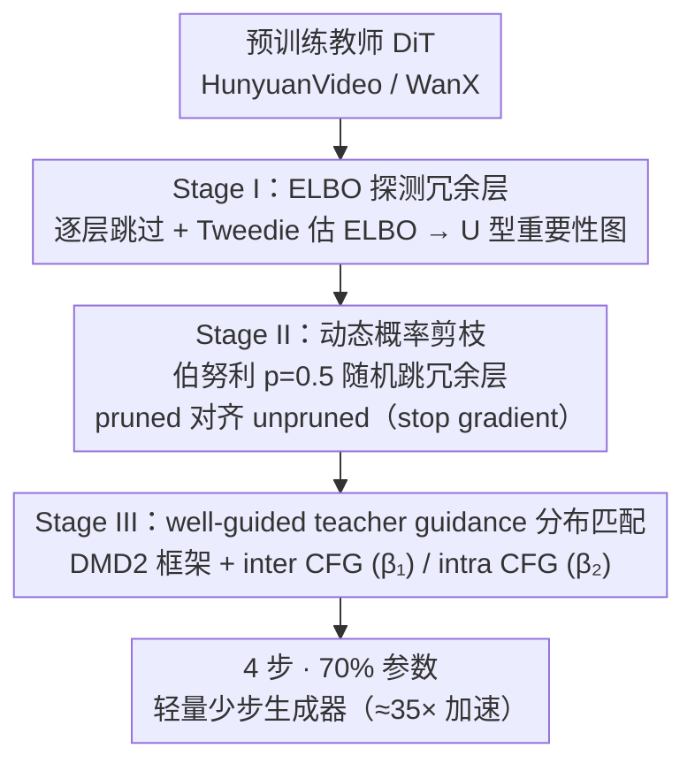

# FastLightGen: Fast and Light Video Generation with Fewer Steps and Parameters

**会议**: CVPR 2026  
**arXiv**: [2603.01685](https://arxiv.org/abs/2603.01685)  
**代码**: 无  
**领域**: 视频生成  
**关键词**: 视频生成加速, 步数蒸馏, 模型剪枝, 分布匹配, DiT压缩

## 一句话总结

FastLightGen 提出三阶段蒸馏算法，首次实现采样步数与模型大小的联合蒸馏，通过识别冗余层、动态概率剪枝和 well-guided teacher guidance 分布匹配，将 HunyuanVideo/WanX 压缩为 4 步 30% 参数剪枝的轻量生成器，实现约 35 倍加速且性能超越教师模型。

## 研究背景与动机

**领域现状**：大规模视频生成模型（HunyuanVideo、WanX）基于 DiT，130亿+参数，多步去噪。5秒视频在 H100 上约需 20 分钟。

**核心问题**：
   - 现有加速要么减步数（LCM/DMD）要么减参数（F3-Pruning/ICMD），无联合优化
   - 极端步数蒸馏（1-2步）性能急剧下降
   - 联合蒸馏可在同性能下更大加速（4步50%参数=50x vs 纯步数3步=33.3x）

**本文方案**：三阶段——识别冗余层、动态概率剪枝、well-guided teacher guidance 分布匹配

## 方法详解

### 整体框架

FastLightGen 想同时砍两样东西——采样步数和模型参数，把一个 130 亿参数、几十步去噪的视频 DiT 压成 4 步、只剩 70% 参数的轻量生成器，还要让质量不掉。它没有把"减步"和"减参"当成两个独立任务先后做，而是设计了一条三阶段蒸馏管线让二者一次性协同收敛：先在 Stage I 找出哪些 DiT block 是冗余的、可以删，再在 Stage II 用一种"概率性跳层"的训练把模型练成无论保留多少层都能工作的鲁棒形态，最后在 Stage III 通过分布匹配把这个被剪过的少步学生对齐到教师的输出分布上。三个阶段的输入始终是同一个预训练教师（HunyuanVideo / WanX），输出则是一个既快又小的少步生成器。

### 关键设计

**1. Stage I — 用 ELBO 探测哪些层可以删：找到冗余块而不是盲剪**

要联合剪参数，第一步得知道剪哪里才不疼。FastLightGen 的做法是逐个把每个 DiT block 临时跳过，再用 Tweedie 公式从单步去噪结果反推一个 ELBO 估计，以此衡量"少了这一块，生成质量掉多少"。掉得越少说明这块越冗余、越可以删。这样扫一遍下来得到一张全模型的重要性图，呈现出明显的 **U 型模式**：最靠近输入的初始层和最靠近输出的末尾层最关键，夹在中间的层大多冗余可剪。对 HunyuanVideo 这种 double/single block 混合结构，double block 也比 single block 更不能动。相比凭经验设定剪枝率，这种逐层探测直接把"删哪些层最安全"量化出来，为后两阶段提供了剪枝候选集。

**2. Stage II — 动态概率剪枝：把单一深度训成对深度鲁棒的模型**

知道了哪些层可剪，难点变成"剪掉之后怎么让模型还认账"。直接删层再微调，得到的模型只对那一种深度配置有效。FastLightGen 改用一种随机训练：把 Stage I 标记为不重要的层按伯努利分布（$p=0.5$）在每个 step 随机跳过，于是同一套共享权重在一次前向里既能跑出"完整版"（unpruned）也能跑出"剪枝版"（pruned）输出。训练目标是让 pruned 输出去对齐 unpruned 输出，并对后者做 stop gradient，相当于让满血模型当一个随训练同步变强的内部教师。

$$\mathcal{L}_{\text{II}} = \alpha \cdot \|f_{\text{pruned}} - \text{sg}(f_{\text{unpruned}})\|^2 + (1-\alpha)\cdot \mathcal{L}_{\text{GT}}$$

这里 $\alpha$ 控制蒸馏监督和原始 GT 监督的配比，而实验给出一个反直觉结论：$\alpha=1$（完全丢掉 GT、只用蒸馏）反而最好——满血模型给出的"软"目标比真实数据的"硬"监督更利于剪枝模型学习。随机跳层的副产物是一个对深度本身鲁棒的模型：它没有被绑死在某一种层配置上，从而能稳定地服务于后面不同保留比例的部署。

**3. Stage III — well-guided teacher guidance：用强度恰当的教师做分布匹配**

前两阶段解决了"剪得准、剪得稳"，最后还要把这个少步剪枝学生的输出分布对齐到教师上，这一步建立在 DMD2 的分布匹配框架之上。FastLightGen 的改动是引入 well-guided teacher guidance：充当 real distribution 的那个 DiT 同时参考 pruned 和 unpruned 两路输出，并拆出两个正交的引导强度——$\beta_1$（inter CFG）控制常规的文本条件引导强度，$\beta_2$（intra CFG）控制 unpruned 输出对 pruned 输出的引导力度。训练时这两个 CFG 系数从均匀分布里随机采样，避免学生只适配某一个固定强度。这样设计是为了避开教师引导的两种失败：太弱时教师几乎不提供有效梯度，太强时教师跑得太远、少步学生根本追不上。通过让 $\beta_2$ 这一路 unpruned→pruned 的引导强度恰到好处，剪枝学生既拿到了满血模型的细节指引，又不至于被拉爆。

### 损失函数 / 训练策略

- Stage II: 16卡 H100, lr=1e-5, 4000 iter, ~64 GPU days
- Stage III: lr=5e-7, 1000 iter, ~16 GPU days
- 最优配置：(alpha, beta_1, beta_2) = (1, 3.5, 0.25) for WanX
- 不宜过长训练（运动过剧烈/颜色过饱和）

## 实验关键数据

### 主实验

**VBench-I2V 对比（WanX-TI2V, 表2）**：

| 方法 | motion smooth | dynamic deg | aesthetic | imaging | average | time |
|------|-------------|------------|-----------|---------|---------|------|
| Euler (teacher) | 0.982 | 0.461 | 0.653 | 0.711 | 0.790 | 885s |
| DMD2 | 0.977 | 0.160 | 0.583 | 0.683 | 0.716 | 35.4s |
| LCM | 0.979 | 0.003 | 0.570 | 0.665 | 0.684 | 35.4s |
| MagicDistillation | 0.980 | 0.561 | 0.634 | 0.701 | 0.798 | 35.4s |
| **FastLightGen** | **0.983** | 0.500 | **0.656** | **0.717** | 0.794 | **28.3s** |

**与开源VDM对比（表1）**：

| 方法 | average |
|------|---------|
| CogVideoX-I2V | 0.759 |
| SVD-XT-1.0 | 0.789 |
| WanX-TI2V (teacher) | 0.790 |
| **FastLightGen** | **0.794** |

### 消融实验

**蒸馏权重消融（表4）**：

| distill weight alpha | average |
|---------------------|---------|
| 0.0 | 0.780 |
| 0.5 | 0.780 |
| 0.7 | 0.788 |
| **1.0** | **0.791** |

**Intra CFG 消融（表5, beta_1=3.5）**：

| beta_2 | dynamic deg | average |
|--------|------------|---------|
| 0.00 | 0.459 | 0.812 |
| **0.25** | 0.500 | **0.820** |
| 0.75 | 1.000 | 0.848 (有抖动) |

### 关键发现

- 4步+30%剪枝（保留70%参数）最优性价比，约 35.71x 加速
- 联合蒸馏同性能下比单维度更快（50x vs 33.3x）
- alpha=1 纯蒸馏是 Stage II 最佳
- aesthetic 和 imaging quality 超越教师模型

## 亮点与洞察

1. **联合蒸馏范式**：首次证明步数+大小联合蒸馏优于单维度
2. **Well-guided teacher**：inter/intra CFG 独立控制两个正交维度
3. **动态概率剪枝**：单模型适应不同深度
4. **U 型重要性**：VDM 初末层最关键的普适发现

## 局限与展望

1. 仅验证 TI2V 任务
2. 训练成本高（~80 GPU days）
3. beta_2 大时运动异常
4. 仅 block 级剪枝
5. 数据质量敏感

## 相关工作与启发

- **DMD2**：分布匹配蒸馏基础
- **MagicDistillation**：强步数蒸馏基线
- **ICMD**：视频大小蒸馏先驱
- **启发**："过强教师反而有害"值得更多验证

## 评分

| 维度 | 分数 (1-5) | 说明 |
|------|-----------|------|
| 创新性 | 4 | 联合蒸馏+well-guided teacher |
| 技术深度 | 4 | 三阶段精细设计 |
| 实验完整性 | 4.5 | 多模型多指标充分消融 |
| 写作质量 | 4 | 图表清晰 |
| 实用价值 | 4.5 | 35x 加速意义重大 |
| 总分 | 4.2 | |

<!-- RELATED:START -->

## 相关论文

- [\[CVPR 2026\] SURF: Signature-Retained Fast Video Generation](surf_signature-retained_fast_video_generation.md)
- [\[CVPR 2026\] LightMover: Generative Light Movement with Color and Intensity Controls](lightmover_generative_light_movement_with_color_and_intensity_controls.md)
- [\[ICML 2026\] Light Forcing: Accelerating Autoregressive Video Diffusion via Sparse Attention](../../ICML2026/video_generation/light_forcing_accelerating_autoregressive_video_diffusion_via_sparse_attention.md)
- [\[NeurIPS 2025\] MagCache: Fast Video Generation with Magnitude-Aware Cache](../../NeurIPS2025/video_generation/magcache_fast_video_generation_with_magnitudeaware_cache.md)
- [\[ICCV 2025\] Generating, Fast and Slow: Scalable Parallel Video Generation with Video Interface Networks](../../ICCV2025/video_generation/generating_fast_and_slow_scalable_parallel_video_generation_with_video_interface.md)

<!-- RELATED:END -->
