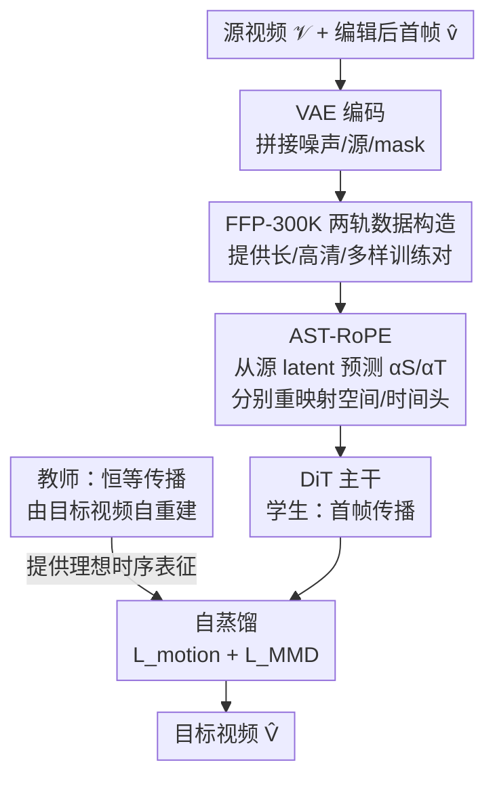

# FFP-300K: Scaling First-Frame Propagation for Generalizable Video Editing

**会议**: CVPR 2026  
**论文**: [CVF Open Access](https://openaccess.thecvf.com/content/CVPR2026/html/Huang_FFP-300K_Scaling_First-Frame_Propagation_for_Generalizable_Video_Editing_CVPR_2026_paper.html)  
**代码**: https://ffp-300k.github.io （项目页）  
**领域**: 视频生成 / 视频编辑  
**关键词**: 首帧传播、视频编辑、数据集构造、旋转位置编码、自蒸馏  

## 一句话总结
针对"首帧传播（FFP）视频编辑离不开运行时引导"这一痛点，本文先用两轨流水线造出 29 万对 720p、81 帧的高保真视频编辑数据集 FFP-300K，再提出无需运行时引导的 FreeProp 框架——用 AST-RoPE 动态解耦"首帧外观"与"源视频运动"、用自蒸馏把模型自己对源视频的理想表征当作正则，在 EditVerseBench 上全面超过包括商用 Aleph 在内的所有方法。

## 研究背景与动机
**领域现状**：高保真视频编辑主要有两条路。一是指令式（instruction-based），用户给一句文字、模型直接在整段视频上改；二是首帧传播（First-Frame Propagation, FFP），先用成熟的图像编辑工具把第一帧改到满意，再让视频模型把这个编辑"传播"到后续所有帧。FFP 把"理解文字语义"这个难活外包给图像编辑器，自己只需做"鲁棒的时序传播"，因此更可控、更容易出高保真结果。

**现有痛点**：FFP 听上去优雅，但现有方法严重依赖**运行时引导（run-time guidance）**才能工作——要么对每段视频单独做 LoRA 微调（如 I2VEdit），要么需要深度图、光流、预测 mask 这类辅助输入（如 StableV2V、GenProp）。这些引导既增加算力开销，又把模型的泛化能力绑死在辅助信号的质量上。

**核心矛盾**：作者指出，依赖引导并不是 FFP 范式本身的缺陷，而是**训练数据不行**的症状。现有视频编辑数据集普遍：(1) 片段太短、分辨率太低（Señorita-2M、InsViE），学不到长程运动和细节；(2) 任务单一（VPData 只做 inpainting），且不区分局部/全局编辑；(3) 图像视频混搭（VIVID-10M）破坏了连续运动先验。数据缺长、缺高分辨率、缺多样性，模型学不到鲁棒的时序先验，只好把外部引导当"拐杖"。

**本文目标**：拆成两个子问题——(a) 造一个长、高清、任务多样、源/目标严格配对的大规模数据集；(b) 设计一个真正"免引导"的传播框架，化解"忠于首帧外观"与"忠于源视频运动"这对核心张力。

**切入角度**：先补数据，再补模型。有了能教会模型长程时序先验的数据，模型才有底气抛掉运行时引导。

**核心 idea**：用 FFP-300K（数据）+ FreeProp（AST-RoPE 重映射位置编码 + 自蒸馏正则）双管齐下，让 FFP 编辑只靠"源视频 + 编辑后的首帧"两个输入就能完成。

## 方法详解
本文贡献分两块：一块是**数据集 FFP-300K 的构造流水线**，一块是**模型框架 FreeProp**。下面先讲数据怎么造，再讲模型怎么训。

### 整体框架
数据侧：FFP-300K 用**两条独立专用轨道**生成语义对齐的视频编辑配对——局部编辑轨（基于 Koala-36M，做物体级 swap/removal）和全局风格化轨（基于 Omni-Style，做整场景风格迁移）。每条轨道都走"感知 → 描述 → 合成 → 过滤"，最终标准化为 720p、81 帧的源/目标视频对，共 29 万对。

模型侧：FreeProp 建立在 Fun-Control（源自 Wan 2.1 的条件视频生成模型）之上。给定源视频 $\mathcal{V}$ 和编辑后的首帧 $\hat{v}$，先用 VAE 编码成 latent，把首帧 latent 在时间维补零后与噪声 latent、源 latent、首帧二值 mask 沿通道拼接喂进 DiT 做速度预测（flow matching）。在这个骨架上插入两项创新：**AST-RoPE** 动态重映射位置编码来解耦外观/运动两个参照，**自蒸馏**用一个并行的"恒等传播"教师任务给学生 FFP 任务提供理想对齐目标。

下图是 FreeProp 的训练框架（学生 FFP 任务 + 教师恒等传播任务）：

### 关键设计

**1. FFP-300K 两轨数据构造流水线：用模块化合成补齐 FFP 训练数据的长/清/多样缺口**

针对"现有数据短、低清、任务混杂"的痛点，作者放弃统一流水线，改用两条**专用轨道**各自把质量做到极致。**局部编辑轨**对 Koala-36M 的源视频：先用 Qwen2.5-VL-72B 分析首帧、找出可编辑主体，再用 Grounded-SAM2 做实例分割得到逐帧 mask 视频，最后把 mask + caption 喂给视频 inpainting 模型 VACE 合成编辑结果。其中有个关键经验——**空间条件的形式很讲究**：用 mask 腐蚀（erosion）只保留目标 mask 的边界区域，逼 VACE 多用自己的内部先验做连贯补全；而且 swap 任务用"无 bbox"配置（不给硬空间约束，避免伪影、物体融入更自然），removal 任务用"有 bbox"配置（强空间先验确保物体被彻底抹掉、背景重建一致）。**全局风格化轨**走两阶段：Stage 1 用 Qwen2.5-VL 给 Omni-Style 的艺术图写电影感 caption，喂 Wan2.1-14B-I2V 生成语义对齐的源视频；Stage 2 再让 Qwen2.5-VL 结合风格图和源视频写风格 caption，配合 Video Depth Anything 抽的深度图喂 VACE，用"语义（caption）+ 结构（深度）+ 外观（风格图）"三重引导出风格化目标视频。

质量控制上，removal 子集走了一个**迭代精炼回环**：Qwen2.5-VL 自动筛出近 4 万候选，人工核验留 14,389 个高质量样本，用它们微调 VACE，再用增强后的 VACE 重生成整个 removal 子集以获得更干净的背景修复。最终经语义核验和去重，FFP-300K 含 **290,441 对**（风格化 143,913、removal 40,000、swap/修改 106,528），统一 720p、81 帧。这种模块化设计的好处是**可随时扩容**，为下一代视频编辑模型提供足够的泛化数据。

**2. AST-RoPE（自适应时空旋转位置编码）：动态重映射坐标系，把"外观锚定"和"运动匹配"解耦到不同注意力头**

标准 RoPE 给 DiT 强加一个**静态坐标系**：时间维匀速推进、对源视频真实运动无感知，空间距离固定、阻碍首帧作为全局内容锚点的传播。这正好卡在 FFP 的核心张力上。AST-RoPE 的做法是让模型**根据源视频内容动态调制 token 的感知位置**。具体借鉴 DiT 中"注意力头有空间/时间分工"的观察，把每层的头静态划成**空间头 $\mathcal{H}_S$** 和**时间头 $\mathcal{H}_T$**；用一个轻量 transformer + 双头 MLP 直接从源 latent $z_{src}$ 预测出空间缩放因子 $\alpha_S$ 和时间缩放因子 $\alpha_T$（比如运动剧烈的视频会被预测出更小的 $\alpha_T$）。

对**空间头**：为强化首帧影响，用 $\alpha_S$ 调制首帧的感知位置距离——把首帧的时间索引从 0 偏移到 $\alpha_S \cdot F'$，当学到 $\alpha_S < 1$ 时就**缩短首帧与其他帧（尤其末尾帧）的有效距离**，使自注意力给"首帧 token ↔ 后续帧 token"更高分数，让编辑内容被稳健传播。对**时间头**：用 $\alpha_T$ 整体重缩放时间轴，把原始索引 $[0,1,\dots,F-1]$ 变成 $[0, \alpha_T, \dots, \alpha_T(F-1)]$，相当于**拉伸/压缩时间流形**——运动快的视频学到更小 $\alpha_T$，缩短帧间感知距离、鼓励时间头建模更剧烈的运动。一句话：空间头管"把首帧拉近来锚外观"，时间头管"按源视频节奏缩时间来仿运动"，两者解耦后各司其职。

**3. 基于恒等传播的自蒸馏：用模型对源视频的"完美知识"当老师，约束编辑传播的运动结构**

标准 flow matching 对"运动动态 + 首帧参照"约束不够，编辑影响容易随时间衰减或语义漂移。作者的洞察是：**模型自己处理源视频时产生的内部 latent，就是最理想的对齐目标**。于是并行跑一个"教师"恒等传播任务——条件给的是目标视频 $\hat{V}$ 自己和它的首帧 $\hat{v}$，去重建 $\hat{V}$，这个恒等映射强迫其内部 latent 完美编码了期望的时空动态；再用蒸馏损失把"学生"FFP 任务的表征往这个理想表征上拉。

蒸馏有两个互补的损失。**帧间关系蒸馏 $\mathcal{L}_{motion}$**（借鉴 VideoREPA）：把 DiT 第 $l$ 块的 latent 空间下采样 $K_S$ 倍后算 Gram 矩阵，对齐 FFP 任务与恒等任务的帧间相似度结构（运动的指征）：

$$\mathcal{L}_{motion} = \frac{1}{F'(F'-1)}\sum_{i\neq j}|G_{i,:,j,:}-\hat{G}_{i,:,j,:}|$$

**首帧一致性损失 $\mathcal{L}_{MMD}$**：对每帧 $i$ 算它与首帧的 token 相似度矩阵 $S_i = z^l_1 (z^l_i)^T$，把其 $N$ 行当成一个经验分布 $P_i$，再用 RBF 核的最大均值差异 MMD 度量它相对首帧的"时间漂移分" $d_i = \text{MMD}^2(P_1, P_i)$，约束学生的漂移轨迹与教师 $\hat{d}_i$ 一致：

$$\mathcal{L}_{MMD} = \sum_{i=2}^{F} |d_i - \hat{d}_i|$$

总目标为 $\mathcal{L} = \mathcal{L}_{FM} + \lambda_{motion}\mathcal{L}_{motion} + \lambda_{MMD}\mathcal{L}_{MMD}$。和那些从外部通用模型蒸馏的方法不同，这里的老师**对源视频的具体运动有完美知识**，所以传播编辑时不会破坏视频本身的时序特征——这是"自蒸馏"区别于一般蒸馏的关键。

### 损失函数 / 训练策略
基于 Fun-Control 用 LoRA（rank=128）微调 2 个 epoch；AdamW，学习率 $2\times10^{-4}$ + cosine 衰减；$\lambda_{motion}=5$、$\lambda_{MMD}=1$。主实验训了 81 帧和 33 帧两个变体以便与不同方法公平对比，消融实验用 81 帧变体。

## 实验关键数据

### 主实验
在 EditVerseBench（筛出 125 个时序结构稳定、适合传播设定的视频，用 Qwen-Edit 生成编辑首帧）上对比三类方法。Ours 的 33f / 81f 两个变体在全部 6 个自动指标上都取得 SOTA：

| 类型 | 方法 | 分辨率 | 帧数 | CLIP↑ | DINO↑ | Frame↑ | Video↑ | PickScore↑ | VLM↑ |
|------|------|--------|------|-------|-------|--------|--------|-----------|------|
| 指令式 | EditVerse | 624×352 | 64 | 0.986 | 0.986 | 27.776 | 25.293 | 20.132 | 7.104 |
| 指令式(商用) | Aleph | 1280×720 | 64 | 0.989 | 0.984 | 28.087 | 24.837 | 20.291 | 7.154 |
| FFP | VACE | 832×480 | 61 | 0.990 | 0.989 | 27.169 | 24.188 | 20.095 | 6.072 |
| FFP | Señorita* | 864×448 | 33 | 0.989 | 0.987 | 27.754 | 24.657 | 19.913 | 7.341 |
| FFP | **Ours-33f** | 1280×720 | 33 | 0.991 | **0.990** | 28.293 | 25.398 | **20.419** | **7.631** |
| FFP | **Ours-81f** | 1280×720 | 81 | **0.991** | **0.991** | **28.316** | **25.925** | 20.405 | 7.600 |

相对竞争者约 +0.2 PickScore、+0.3 VLM Score。Ours-81f 在时序一致性（CLIP/DINO 均 0.991）和视频级文本对齐（25.925）最强，Ours-33f 在感知质量（PickScore 20.419）和语义正确（VLM 7.631）最强。值得注意的是它不仅超过 FFP 同类（VACE），也超过强指令式方法乃至商用 Aleph。

用户研究（15 人各评 8 个视频，1–5 分）也一致偏好本文方法：

| 方法 | 编辑准确 EA↑ | 运动准确 MA↑ | 视频质量 VQ↑ |
|------|-------------|-------------|-------------|
| EditVerse | 4.063 | 3.792 | 3.354 |
| Señorita-2M | 3.563 | 3.208 | 2.354 |
| Aleph | 3.412 | 3.271 | 3.459 |
| **Ours** | **4.250** | **4.333** | **4.146** |

### 消融实验
三个 81 帧变体，逐步加组件：

| 配置 | CLIP↑ | DINO↑ | Frame↑ | Video↑ | PickScore↑ | VLM↑ | 说明 |
|------|-------|-------|--------|--------|-----------|------|------|
| Baseline | 0.986 | 0.984 | 27.420 | 24.960 | 20.010 | 7.210 | Wan-Fun 仅在本文数据上微调 |
| +AST-RoPE | 0.989 | 0.988 | 28.178 | 25.817 | 20.354 | 7.542 | 加时空 RoPE 适配 |
| Full | 0.991 | 0.991 | 28.316 | 25.925 | 20.405 | 7.600 | 再加自蒸馏 |

### 关键发现
- **数据本身就贡献巨大**：Baseline（只在 FFP-300K 上微调、不加任何模型改动）已经能拿到 0.986 CLIP / 7.210 VLM，逼近甚至超过部分对手，印证"FFP 的瓶颈在数据"这一核心论断。
- **AST-RoPE 增益最显著**：从 Baseline 到 +AST-RoPE，VLM 7.210→7.542、Video 文本对齐 24.960→25.817，是消融里单步提升最大的组件，说明"解耦外观/运动参照"确实是关键。
- **自蒸馏锦上添花**：Full 在一致性（CLIP/DINO 0.991）和各项上进一步小幅提升，主要稳住长程时序、防语义漂移。
- **33f vs 81f 各有所长**：短序列变体感知质量/语义略高，长序列变体时序一致性更稳——传播长度与不同指标存在权衡（⚠️ 两变体训练帧数不同，跨变体比大小需注意 caveat）。

## 亮点与洞察
- **"数据缺口才是病根"的归因很到位**：把 FFP 依赖运行时引导重新诊断为"数据短/低清/不多样"导致学不到时序先验，再用 Baseline 已强这一消融实证它——这种"先证伪流行解释、再补根因"的论证方式很有说服力。
- **AST-RoPE 是几乎零成本的结构改造**：不改注意力计算，只让一个轻量模块从源 latent 预测两个缩放因子去重映射 RoPE 索引，就把"首帧锚外观（空间头缩近距离）/源视频仿运动（时间头缩时间轴）"解耦开，思路可迁移到其他需要"参照解耦"的条件视频生成任务。
- **自蒸馏选对了老师**：用"模型对源视频的恒等传播表征"当蒸馏目标，而非外部通用模型——老师天然拥有源视频运动的完美知识，避免了跨模型蒸馏引入的分布错配，这个"自参照"设计是巧点。
- **数据流水线的工程经验可复用**：swap 用无 bbox、removal 用有 bbox，mask 腐蚀逼模型用内部先验，以及"筛→人核→微调 VACE→重生成"的迭代精炼回环，都是造高质量合成编辑数据的实用 trick。

## 局限与展望
- **强依赖一串大模型**：数据构造重度依赖 Qwen2.5-VL-72B、Grounded-SAM2、VACE、Wan-I2V 等，合成质量被这些上游模型的能力上限和偏差所约束；数据本质是合成而非真实编辑对。
- **评测被收窄**：EditVerseBench 被筛到 125 个"时序结构稳定"的视频才适配传播设定，且 VLM 评测从 GPT-4o 换成 Qwen2.5-VL（为可复现）——指标口径与原 benchmark 不完全可比，绝对分数横向比要谨慎。
- **首帧编辑器是上限**：FFP 范式把语义理解外包给图像编辑器（这里用 Qwen-Edit），首帧编辑错了（位置、语义）传播再好也救不回来；论文也承认 Señorita 等对首帧质量敏感。
- **缩放因子可解释性待证**：$\alpha_S/\alpha_T$ 的"运动快→更小 $\alpha_T$"是直觉叙述，文中未给定量分析它们到底学到了什么（⚠️ 以原文为准）。改进方向：把数据扩到真实人工编辑对、给 AST-RoPE 加可解释性分析。

## 相关工作与启发
- **vs 指令式方法（EditVerse / Aleph / LucyEdit）**：它们要模型同时理解文字意图并跨时序一致施加，难度叠加、保真常落后图像版；本文走 FFP 把语义外包给图像编辑器，自己专注传播，结果更稳、且超过商用 Aleph。
- **vs 依赖引导的 FFP 方法（I2VEdit / StableV2V / GenProp）**：它们靠 per-video 微调或深度/光流/mask 等辅助输入维持时序，成本高、泛化受辅助质量限制；本文用"补数据 + AST-RoPE + 自蒸馏"实现**纯免引导**，只吃源视频 + 编辑首帧。
- **vs 既有视频编辑数据集（Señorita-2M / InsViE / VPData / VIVID-10M）**：它们短、低清、任务窄或图视频混搭；FFP-300K 用 720p、81 帧、局部/全局分轨、源/目标严格配对的设计，确立了面向通用 FFP 的标准训练集。
- **vs 外部蒸馏（如 VideoREPA 从通用模型蒸馏）**：本文改成自蒸馏，老师对源视频运动有完美知识，蒸出来的运动结构更贴合本视频，避免跨模型分布错配。

## 评分
- 新颖性: ⭐⭐⭐⭐ 数据缺口归因 + AST-RoPE 重映射 + 自参照蒸馏三点都不算大刀阔斧但组合扎实，FFP 免引导是实打实的推进
- 实验充分度: ⭐⭐⭐⭐ 6 指标主表 + 用户研究 + 逐组件消融齐全，但评测 benchmark 被筛窄、VLM 评测换模型，横向可比性打折
- 写作质量: ⭐⭐⭐⭐ 论证链条清晰（先证伪、再补根因），数据流水线和方法都讲得清楚
- 价值: ⭐⭐⭐⭐⭐ 开源 29 万对 720p/81 帧数据集 + 免引导框架，对视频编辑社区是实打实的基础设施贡献

<!-- RELATED:START -->

## 相关论文

- [\[CVPR 2026\] First Frame Is the Place to Go for Video Content Customization](first_frame_is_the_place_to_go_for_video_content_customization.md)
- [\[ICLR 2026\] LoRA-Edit: Controllable First-Frame-Guided Video Editing via Mask-Aware LoRA Fine-Tuning](../../ICLR2026/video_generation/lora-edit_controllable_first-frame-guided_video_editing_via_mask-aware_lora_fine.md)
- [\[CVPR 2026\] VideoCoF: Unified Video Editing with Temporal Reasoner](videocof_unified_video_editing_with_temporal_reasoner.md)
- [\[CVPR 2026\] LoL: Longer than Longer, Scaling Video Generation to Hour](lol_longer_than_longer_scaling_video_generation_to_hour.md)
- [\[CVPR 2026\] RecEdit-Drive: 3D Reconstruction-Guided Spatiotemporal Video Editing for Autonomous Driving Scenes](recedit-drive_3d_reconstruction-guided_spatiotemporal_video_editing_for_autonomo.md)

<!-- RELATED:END -->
