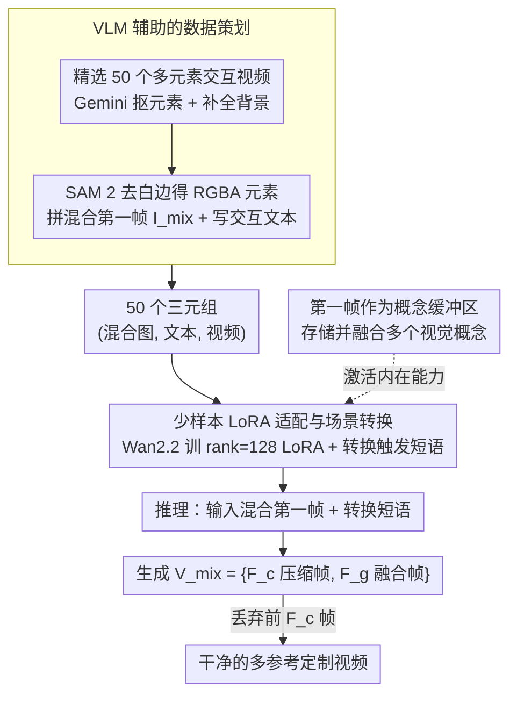

# First Frame Is the Place to Go for Video Content Customization

**会议**: CVPR 2026  
**arXiv**: [2511.15700](https://arxiv.org/abs/2511.15700)  
**代码**: [http://firstframego.github.io](http://firstframego.github.io)  
**领域**: 视频理解 / 视频生成  
**关键词**: 视频内容定制, 第一帧概念缓冲, 多参考视频生成, LoRA微调, 视觉语言模型

## 一句话总结

发现视频生成模型将第一帧隐式地当作「概念记忆缓冲区」来存储和复用多个视觉实体的内在能力，提出 FFGo——仅用 20-50 个训练样本的轻量级 LoRA 适配方法，无需修改架构即可激活这一能力，实现多参考物体的视频内容定制，在用户研究中 81.2% 的情况下被评为最佳。

## 研究背景与动机

1. **领域现状**：视频生成模型（Wan2.2、Stable Video Diffusion 等）已能生成高质量视频。多参考视频生成（将多个参考图像中的物体/场景组合到一个视频中）是关键应用方向，典型方法如 VACE 和 SkyReels-A2 通过修改架构和百万级数据训练来实现。
2. **现有痛点**：(a) 架构修改方法需要改变预训练模型结构，损害兼容性和效率；(b) 大规模任务特化微调导致模型过拟合到特定场景（主要是人-物交互），丧失预训练阶段学到的广泛生成先验；(c) 现有方法通常限制参考数量为 3 个（人、物体、场景），无法处理更多参考输入。
3. **核心矛盾**：如何在不修改架构、不依赖大规模定制数据集的情况下，实现多参考视频内容定制？
4. **本文目标** (a) 理解视频生成模型的内在能力——第一帧是否可以作为概念存储？(b) 如何可靠地激活这一能力？(c) 如何在保持预训练知识的同时实现多场景泛化？
5. **切入角度**：作者发现了一个被忽视的现象——预训练的 I2V 模型已经具备从第一帧混合图像中提取视觉概念并在后续帧中融合它们的潜在能力。但这个能力很难通过 prompt engineering 直接触发（不稳定、物体身份丢失）。只需用极少量训练样本进行 LoRA 适配就能可靠地激活这一能力。
6. **核心 idea**：视频模型的第一帧是「概念缓冲区」而非仅仅是时空起点，通过 20-50 个样本的 LoRA 微调可以激活这一内在能力，实现无架构修改、保持预训练知识的多参考视频定制。

## 方法详解

### 整体框架

FFGo 要解决的问题是：把多张参考图里的物体和场景组合进一段视频，但不改预训练 I2V 模型的架构、也不依赖百万级定制数据。它的做法是把所有参考拼成一张「混合第一帧」喂给模型，让模型在后续帧里自己把这些元素融合成连贯场景。整条流水线分三步走：先用 VLM 从已有视频里自动抠出元素和背景、拼成混合图像，配上文本，凑出几十个训练三元组；再在 Wan2.2-I2V-A14B 上训一个轻量 LoRA，教模型从混合第一帧可靠地完成「场景切换 + 主体融合」；推理时输入混合图像加上一句转换触发短语，生成视频后丢掉开头几帧压缩帧，剩下的就是干净的定制视频。整个方法的支点是一个观察——第一帧不只是时空起点，而是一块可以塞进多个视觉概念的「记忆缓冲区」。

### 关键设计

**1. 第一帧作为概念缓冲区：找到模型已有却难触发的能力，而非教它新本领**

这是全文的根基。作者发现，标准 I2V 模型在拿到一张拼贴了多个元素的第一帧时，本来就有能力在后续帧里把这些元素揉进一个连贯场景——只是这能力极不稳定，直接用会撞上三堵墙：转换提示词得靠繁琐手调、还随模型和视频而变；场景切换时灵时不灵；参考物体的身份经常在融合过程中丢失。因此 FFGo 的思路不是去改架构「添加」多参考输入的能力，而是把模型已经埋着的这块能力稳定地激活出来。这样做的直接好处是预训练阶段学到的广泛生成先验被完整保留，绕开了任务特化微调最容易踩的过拟合坑。

**2. VLM 辅助的数据策划：用模型而非人力造出高质量的「混合图—文本—视频」三元组**

要激活上述能力，训练样本必须长成「混合第一帧 → 融合视频」的样子，而这种数据现成没有。FFGo 让 VLM 把普通视频反向加工成这种格式：从 2000 个视频里挑出 50 个有清晰多元素交互的，对每个视频用 Gemini-2.5-Pro 从第一帧识别并抠出各个元素、同时补全一张去掉这些元素的完整背景，再用 SAM 2 去掉白边得到 RGBA 元素；接着把元素摆左、背景摆右拼成混合图像 $I_{mix}$，最后再让 Gemini-2.5-Pro 写一段描述元素如何交互、视频里发生什么的文本。50 个（混合图像，文本，视频）三元组就这样产出，覆盖了人-物、人-人、元素插入、机器人操作等多种交互类型。用 VLM 而非人工标注的关键收益是抠图质量和文本描述都足够精确，几十个样本就能撑起足够的场景多样性。

**3. 少样本 LoRA 适配与场景转换机制：用极少样本把「不稳定的潜力」固化成「可靠的能力」**

激活手段是在 Wan2.2-I2V-A14B 上训一个 rank=128 的 LoRA，并引入一句唯一的转换触发短语（如 "ad23r2 the camera view suddenly changes."，思路类似 DreamBooth 的稀有标识符）来专门承载「场景切换」这个动作，避免和正常文本语义冲突。生成视频的帧被切成两段 $F = \{F_c, F_g\}$：前 $F_c=4$ 帧是保留混合图像的时间压缩帧，后面 $F_g$ 帧才是融合出的内容；推理时把前 $F_c$ 帧丢掉就得到干净视频。由于 Wan2.2 在低噪声域和高噪声域各用一个独立的去噪 Transformer，LoRA 也分别训练。LoRA 的低秩特性保证预训练权重几乎不被改写，广泛的生成先验得以保留——这正是它泛化性远超大规模微调方法的原因。整套训练只需 50 个样本、2 张 H200 跑 5 小时。

### 损失函数 / 训练策略

使用标准扩散模型去噪损失。LoRA rank=128，训练数据覆盖四类：人-物交互（60%）、人-人交互（14%）、元素插入（20%）、机器人操作（6%）。2 张 NVIDIA H200 GPU，batch size 4，训练仅 5 小时。

## 实验关键数据

### 主实验

用户研究（200 条标注，40 个用户）：

| 模型 | 整体质量↑ | 物体身份↑ | 场景身份↑ | 平均排名↓ | 排名第一占比↑ |
|------|----------|----------|----------|----------|-------------|
| Wan2.2-I2V-A14B | 2.09 | 3.32 | 3.01 | 3.27 | 3.4% |
| SkyReels-A2 | 2.34 | 2.89 | 3.43 | 3.02 | 4.3% |
| VACE | 3.00 | 3.50 | 3.66 | 2.50 | 11.1% |
| **FFGo (Ours)** | **4.28** | **4.53** | **4.58** | **1.21** | **81.2%** |

FFGo 在所有维度上全面领先，81.2% 的用户选择 FFGo 的结果为最佳。

### 消融实验

与基础模型对比（定性）：

| 配置 | 行为 |
|------|------|
| Wan2.2 + 最佳手工 transition 提示 | 经常独立动画化元素，转换后物体消失 |
| Wan2.2 + 无 transition 提示 | 几乎无法实现主体融合 |
| **FFGo（LoRA 适配后）** | 一致保持物体身份，连贯场景转换 |

关键对比：FFGo 将基础模型 Wan2.2（性能最差）转变为评估中的最佳表现者。

### 关键发现

- **内在能力的验证**：在极少数基础模型就成功保持所有物体身份并执行连贯场景转换的罕见案例中，FFGo 的输出与基础模型非常相似，证明 FFGo 是在激活已有能力而非学习新能力。
- **泛化性远超百万级训练的方法**：VACE 和 SkyReels-A2 在百万级数据上训练但主要针对人-物场景，在机器人操作、驾驶仿真、水下场景等新场景中表现不佳。FFGo 仅用 50 个样本但因保留了预训练先验，泛化性远超两者。
- **参考数量优势**：VACE 和 SkyReels-A2 架构限制最多 3 个参考，FFGo 因使用第一帧概念缓冲无此限制，实验验证了最多 5 个参考（4 个物体+1 个场景）的效果。
- 保留预训练知识是关键——后训练数据质量和多样性远低于预训练数据，过度微调会导致模型退化。

## 亮点与洞察

- **对视频模型内在能力的洞察**极具启发性：第一帧不仅是时空起点，更是概念缓冲区。这个发现改变了我们对 I2V 模型的理解，暗示预训练模型中可能还隐藏着其他被忽视的内在能力。
- **"激活而非训练"的范式**非常巧妙：与其训练模型获得新能力，不如找到模型已有但难以触发的能力并加以激活。20-50 个样本的成本极低，效果却超越百万级训练，这说明理解模型内在机制比蛮力扩数据更有价值。
- **实用价值极高**：作为轻量级插件，FFGo 兼容现有 I2V 模型，不改架构、训练快、保留预训练能力，可以即插即用地提升任何 I2V 模型的多参考定制能力。

## 局限与展望

- 参考物体数量增加时，每个物体在第一帧中的分辨率降低，身份保持变困难。实际上限约为 4-5 个参考。
- 仅通过文本提示选择性控制特定物体变得困难——当参考物体较多时，文本描述可能不够精确。
- 依赖 Gemini-2.5-Pro 进行数据策划增加了成本和对闭源 API 的依赖。
- 作者建议未来使用多个起始帧作为扩展概念缓冲区来突破容量限制，这是一个有前景的方向。
- 当前仅在 Wan2.2 上验证，其他 I2V 模型（如 CogVideoX、Sora）是否也有类似内在能力有待研究。

## 相关工作与启发

- **vs VACE**: VACE 修改架构接受多参考输入，在百万数据上训练，主要擅长人-物场景。在多物体交互或超过 3 个参考的场景中表现不佳。FFGo 无需改架构，用 50 个样本就全面超越。
- **vs SkyReels-A2**: SkyReels-A2 同样修改架构+大规模训练，架构限制最多 3 个参考。在用户研究中仅 4.3% 被评为最佳（vs FFGo 的 81.2%）。
- **vs Wan2.2 基础模型**: FFGo 证明了基础模型已有主体融合能力但不稳定。LoRA 适配将不稳定的潜在能力转化为可靠的实用能力。
- 这项工作延续了"探索预训练模型内在能力"的研究线（如 in-context LoRA for DiT、I2V 模型做感知任务），是一个值得深入的研究方向。

## 评分

- 新颖性: ⭐⭐⭐⭐⭐ 对第一帧角色的全新认识极具洞察力，"激活而非训练"的范式非常新颖
- 实验充分度: ⭐⭐⭐⭐ 包含用户研究和多个定性对比，但缺少自动化定量指标（CLIP-score 等）
- 写作质量: ⭐⭐⭐⭐ 故事线流畅、观察有说服力，图示丰富
- 价值: ⭐⭐⭐⭐⭐ 提供了一种极高效的视频定制方案，对预训练模型能力的理解也有广泛影响

<!-- RELATED:START -->

## 相关论文

- [\[CVPR 2026\] FFP-300K: Scaling First-Frame Propagation for Generalizable Video Editing](ffp-300k_scaling_first-frame_propagation_for_generalizable_video_editing.md)
- [\[ICLR 2026\] LoRA-Edit: Controllable First-Frame-Guided Video Editing via Mask-Aware LoRA Fine-Tuning](../../ICLR2026/video_generation/lora-edit_controllable_first-frame-guided_video_editing_via_mask-aware_lora_fine.md)
- [\[CVPR 2026\] Content-Aware Dynamic Patchification for Efficient Video Diffusion](content-aware_dynamic_patchification_for_efficient_video_diffusion.md)
- [\[CVPR 2026\] Gloria: Consistent Character Video Generation via Content Anchors](gloria_consistent_character_video_generation_via_content_anchors.md)
- [\[CVPR 2026\] Towards Holistic Modeling for Video Frame Interpolation with Auto-regressive Diffusion Transformers](towards_holistic_modeling_for_video_frame_interpolation_with_auto-regressive_dif.md)

<!-- RELATED:END -->
