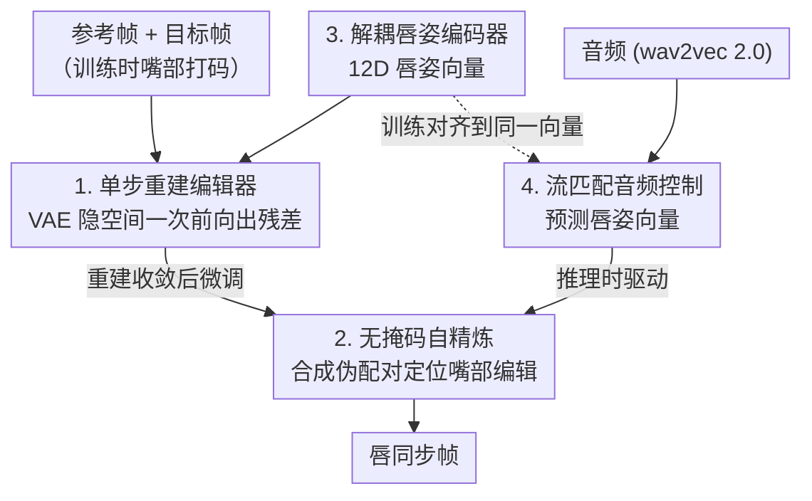

# FlashLips: 100-FPS Mask-Free Latent Lip-Sync using Reconstruction Instead of Diffusion or GANs

**会议**: CVPR 2026  
**论文**: [CVF Open Access](https://openaccess.thecvf.com/content/CVPR2026/html/Zinonos_FlashLips_100-FPS_Mask-Free_Latent_Lip-Sync_using_Reconstruction_Instead_of_Diffusion_CVPR_2026_paper.html)  
**代码**: 未公开  
**领域**: 视频生成  
**关键词**: 唇同步, 无掩码编辑, 隐空间重建, 流匹配, 实时生成  

## 一句话总结
FlashLips 把唇同步（lip-sync）重新表述成"确定性图像编辑"而非生成问题：用一个纯重建训练的单步隐空间编辑器代替扩散/GAN，再配一个流匹配的"音频→唇姿"Transformer 驱动它，U-Net 版本在单卡 H100 上跑到 109 FPS，同时 FID/FVD/唇同步精度反超更大更慢的扩散基线。

## 研究背景与动机

**领域现状**：唇同步的目标是只改嘴部、让口型对上音频，同时完整保留身份、表情、头姿和背景——它是 video-to-video 的局部编辑，比"音频驱动全脸生成"更可控也更适合配音/本地化。主流路线先后是 GAN（Wav2Lip、StyleSync 等）和近两年的扩散（LatentSync、KeySync、Diff2Lip 等）。

**现有痛点**：GAN 训练不稳、对超参敏感、易出现可见伪影；扩散虽然画质高，但**推理要跑多步去噪**，速度被钉死在远低于实时的水平（表 2 里 LatentSync 5.7 FPS、KeySync 3.6 FPS），而且这些 pipeline 普遍**依赖显式嘴部 mask、人脸对齐、中间关键点/3D 模板**等繁重预处理，既增加工程开销又会引入新的伪影。

**核心矛盾**：唇同步本质上是一个**高度被条件约束**的任务——给定参考身份、目标帧和精确的口型线索，输出几乎被输入唯一确定。既然如此，为什么还要用扩散这种为"从噪声采样多样输出"而设计的迭代生成器？作者认为，迭代生成的随机性和多步成本在这里是浪费，是它拖慢速度、又逼出 mask 等预处理的根源。

**本文目标**：① 去掉迭代生成（不用 GAN、不用扩散），用确定性单步前向出帧；② 推理时彻底去掉显式嘴部 mask；③ 把"渲染什么外观"和"嘴该怎么动"解耦，让音频只负责后者。

**切入角度**：把唇同步当成**确定性的隐空间残差编辑**——只要上下文足够（身份 + 目标帧 + 低维唇姿向量），一次前向就能学出高质量的口型更新，根本不需要对抗目标或去噪日程。

**核心 idea**：用"重建代替生成"（reconstruction instead of diffusion/GANs）做一步式隐空间编辑器，再用一个流匹配 Transformer 把音频映射到低维唇姿向量来驱动它，两段解耦、各自简单稳定。

## 方法详解

### 整体框架
FlashLips 是一个两阶段、mask-free 的系统，把**控制（嘴该怎么动）**和**渲染（长什么样）**彻底分开。Stage 1 是一个在 VAE 隐空间里工作的确定性单步编辑器：输入参考帧、目标帧和一个低维唇姿向量，一次前向就吐出编辑好的帧，只用重建损失训练。Stage 1 先用"嘴部打码 + 重建"的方式训练，收敛后再做一步**无掩码自精炼**，让网络学会把编辑局限在嘴部、推理时不再需要任何 mask。Stage 2 是一个音频→唇姿的 Transformer，用流匹配目标从语音预测出 Stage 1 所需的同一个唇姿向量。推理时，音频经 Stage 2 得到唇姿向量，再喂给自精炼后的编辑器（LipsChange 网络），单步生成对口型的帧。

### 关键设计

**1. 单步重建编辑器：把唇同步当确定性隐空间残差编辑，一次前向出帧**

针对扩散多步去噪太慢、GAN 训练不稳的痛点，作者直接在 SDXL VAE 的隐空间里做一步式编辑。设 $x_{src}$ 是要编辑的源帧、$x_{ref}$ 是同一视频里相隔 $t$ 帧采样的参考帧；训练时给源帧嘴部区域打码得到 $x_{masked}$。三者经冻结 VAE 编码为 $z_{src}, z_{masked}, z_{ref}$，参考隐变量再过一个可训练 backbone $f_{ref}$ 做身份自适应。唇姿向量 $z_{lips}\in\mathbb{R}^M$ 在空间上复制铺开成 $z_{lips}^{exp}$，三者沿通道拼接成输入：

$$z_{input} = \mathrm{Concat}\big(z_{masked},\, z_{ref},\, z_{lips}^{exp}\big)$$

网络不直接预测目标隐变量，而是预测一个**朝向真值编辑的残差**。令真值残差 $z_{target}=z_{src}-z_{masked}$，网络输出 $\hat z_{target}$，重组为 $\hat z_{src}=z_{masked}+\hat z_{target}$，再用冻结 VAE 解码出 $\hat x_{src}$。整段**只用重建损失**（隐空间 L1 + 像素 L1 + VGG/VGGFace 感知损失，无对抗、无去噪），这正是"reconstruction instead of diffusion/GANs"的字面落地——因为在如此强条件下输出近乎被输入决定，确定性回归就够了，从而省掉了迭代生成的全部成本。

**2. 无掩码自精炼：用编辑器自己合成伪配对，把编辑锁在嘴上、推理时丢掉 mask**

重建训练依赖嘴部 mask，但推理时再做人脸解析/打码既慢又易出伪影。FlashLips 的做法是：重建模型收敛后，**采样唇姿向量、用模型自己合成"改了嘴"的变体帧**，构造对称伪配对 $(\text{源}\leftrightarrow\text{改})$ 和 $(\text{改}\leftrightarrow\text{源})$；再用一个由重建模型权重初始化的 LipsChange 网络在这些伪配对上微调（约 200k 步）。由于配对之间只有嘴部不同，网络被迫学会"把改动定位到嘴、其余照抄"，于是推理时不再需要任何外部分割。与已有 mask-free 工作（靠数据集预构造伪配对）不同，这里的监督是**编辑器在线自产**的，省掉了离线伪配对数据集，也让自精炼能借用跨身份的唇姿来增加口型多样性。

**3. 解耦唇姿编码器：把控制空间压成只含"嘴/下巴"配置的 12D 向量，便于从音频预测**

为了让音频能稳定地预测口型，控制向量必须**只带姿态信息、几乎不带外观**（牙齿、唇色、肤色、下颌线这些应由参考帧提供）。编码器分两路：一个冻结的表情编码器 + 小 MLP 给出主向量 $z_{lips}^{main}\in\mathbb{R}^M$；一个在嘴部裁剪上跑的轻量 CNN 预测小残差 $z_{lips}^{add}$，最终 $z_{lips}=z_{lips}^{main}+z_{lips}^{add}$。消融（表 5）显示：只用表情编码器（V1）到 8D 就饱和且身份泄漏低，加残差（V2）能提升重建但会泄漏身份、损害跨音频的解耦——最终选 **12D = V1 8D + V2 4D** 作为质量与解耦的折中。为去掉推理时表情 backbone 的对齐/裁剪开销，作者还把整条 Lips Encoder **蒸馏进一个 ResNet（论文正文 ResNet-50，图 4 标注 ResNet-34 ⚠️ 以原文为准）**，直接从整张人脸 RGB 预测同一个唇姿向量。

**4. 流匹配音频控制：用 Transformer 在唇姿空间做条件流匹配，把"说什么"映射到"嘴怎么动"**

Stage 2 把音频接到编辑器上：一个以 wav2vec 2.0 特征为条件的 Transformer，在**唇姿向量空间**里用最优传输条件流匹配训练。设音频特征 $a$、目标唇姿 $z_{lips}$，采样 $\varepsilon\sim\mathcal N(0,I)$、$t\sim\mathcal U(0,1)$，构造插值点与目标速度场：

$$z_t=(1-t)\,\varepsilon+t\,z_{lips},\qquad u=z_{lips}-\varepsilon$$

Transformer $v_\theta$ 被训练去匹配该速度场：

$$L_{FM}=\mathbb{E}_{t,\varepsilon,a}\big\|v_\theta(z_t,t,c)-u\big\|_2^2,\quad c=\mathrm{Concat}[a,\,e(a),\,z_{lips}^{K}]$$

其中 $e(a)$ 是预训练音频情绪编码器、$z_{lips}^{K}$ 是 $K$ 个随机采样的源唇姿。因为控制空间已被设计成只含姿态，音频不必去推外观，学习更容易、泛化更好；流匹配又给出平滑的控制隐变量，避免逐帧抖动。

### 损失函数 / 训练策略
Stage 1 在隐空间和像素空间联合监督。记 $\Delta z=\hat z_{target}-z_{target}$、$M$ 为下半脸像素 mask、$m$ 为其隐空间下采样版本、$M_{lips}$ 来自人脸解析。隐空间用 $L^{lat}_{L1}=\mathrm{MAE}(\Delta z)$ 和带 mask 的 $L^{lat}_{L1m}=\mathrm{MAE}_m(\Delta z)$；像素空间用下半脸 L1 $L^{pix}_{L1M}$、唇区 L1 $L^{pix}_{L1lips}$（仅当有效唇 mask 面积超阈值时启用）、VGG-19 感知损失 $L_{VGG}$ 与 VGGFace2 人脸感知损失 $L^{face}_{VGG}$。总损失按权重叠加：

$$L_{total}=0.1L^{lat}_{L1}+0.1L^{lat}_{L1m}+10L^{pix}_{L1M}+100L^{pix}_{L1lips}+50L_{VGG}+5L^{face}_{VGG}$$

唇区像素损失权重最高（100），把优化重心压在嘴部保真。训练用 8×H100、总 batch 32，重建阶段 100 万步（AdamW + OneCycleLR，lr 从 $10^{-4}$ 退火到 $10^{-8}$），自精炼再 20 万步；蒸馏在重建末尾 20 万步内对齐完整 pipeline 输出。Stage 2 的 Transformer（150M）用恒定 lr $5\times10^{-5}$ 的 AdamW 训练。Stage 1 backbone 有 U-Net（250M，主打速度）和 ViT 式 Transformer（300M，主打画质）两版。

## 实验关键数据

### 主实验
在 HDTF / CelebV-HQ / CelebV-Text 上各采 100 个重建视频和 100 个跨音频对评测。FlashLips 两个版本在两种协议下都拿到最优 FID 和 FVD，同时速度大幅领先。

| 协议 | 模型 | FID ↓ | FVD ↓ | LipScore ↑ | ID ↑ |
|------|------|-------|-------|-----------|------|
| Reconstruction | LatentSync | 5.30 | 36.47 | 0.55 | 0.86 |
| Reconstruction | KeySync | 5.48 | 24.80 | 0.56 | 0.81 |
| Reconstruction | **FlashLips–U-Net** | 4.75 | 15.20 | 0.70 | 0.85 |
| Reconstruction | **FlashLips–Transformer** | **4.43** | **12.31** | **0.71** | 0.86 |
| Cross-Audio | KeySync | 6.81 | 37.55 | 0.36 | 0.79 |
| Cross-Audio | LatentSync | 7.69 | 46.08 | 0.33 | 0.84 |
| Cross-Audio | **FlashLips–Transformer** | **5.89** | **29.40** | 0.37 | 0.81 |

LipScore（唇音同步）上两版均为各协议前二；ID（身份保持）在重建协议与 LatentSync 并列第一、跨音频协议第二；像素级 PSNR/SSIM 排第三、LPIPS 第二，差距都很小——说明一步重建并未牺牲保真。

### 推理速度
| 模型 | FPS ↑ | 相对 U-Net 提速 |
|------|-------|----------------|
| KeySync | 3.60 | 30.4× |
| LatentSync | 5.70 | 19.2× |
| Diff2Lip | 19.77 | 5.5× |
| TalkLip | 51.53 | 2.1× |
| **FlashLips–Transformer** | 66.84 | 1.6× |
| **FlashLips–U-Net** | **109.41** | 1.0× |

U-Net 版 109 FPS，比次优画质的 KeySync 快 30 倍，是唯一明显超过实时的高质量方案。

### 消融实验
| 配置 | 关键指标 | 说明 |
|------|---------|------|
| 唇姿 V1 8D | LipScore 0.34 / ID 0.83 | 仅冻结表情编码器，身份泄漏低、重建约在 8D 饱和 |
| 唇姿 V1 8D + V2 4D（12D，选用） | LipScore 0.38 / ID 0.80 | 质量与解耦的最佳折中 |
| 唇姿 V1 8D + V2 16D | LipScore 0.40 / ID 0.63 | 重建更高但身份严重泄漏，跨音频失效 |
| 参考帧 1 个（Transformer） | FVD 41.38 / ID 0.79 | 跨音频身份偏弱 |
| 参考帧 4 个（选用） | FVD 29.40 / ID 0.81 | 身份明显改善、对同步几乎无损 |
| 参考帧 >4 | 收益边际、偶尔同步退化 | 身份信息过多会挤占音频驱动 |

### 关键发现
- **唇姿维度是个解耦 trade-off**：加大唇部残差（V2）能持续提升重建 PSNR（最高 36.86），但身份泄漏随之恶化（ID 从 0.83 掉到 0.63），导致跨音频时口型对不上、身份漂移；12D 是甜点。
- **参考帧 1→4 提升身份、再多反伤同步**：参考唇姿带的身份信息越多，音频→唇姿网络要做的事越少、对不同片段参考越敏感，所以固定用 4 个。
- **U-Net vs Transformer 是速度/画质二选一**：精度相近，Transformer 感知质量略好但慢，U-Net 快——按部署需求挑。
- **画质短板在像素级指标**：PSNR/SSIM 仅第三，说明一步确定性回归在绝对像素重建上略逊于扩散，但在 FID/FVD/感知一致性上反超。

## 亮点与洞察
- **"任务条件够强就不需要生成模型"是核心洞见**：唇同步输出近乎被输入决定，作者据此把它从"采样"问题降维成"回归"问题，一举甩掉扩散多步成本——这个判断对所有"高度条件化的局部编辑"任务都可能成立。
- **自精炼造伪配对是个漂亮 trick**：让模型用自己合成的"改嘴变体"当伪监督，无需任何外部分割就学会"只改嘴"，把 mask 从推理链路里彻底拿掉，可迁移到任何需要"局部编辑 + 周围保真"的图像任务。
- **控制空间解耦 + 蒸馏**：把"嘴怎么动"压成 12D、外观全交给参考帧，使音频侧学习极简稳定；再把多步 Lips Encoder 蒸成单个 ResNet 去掉对齐预处理——工程上把实时落地的最后几毫秒也抠掉了。

## 局限与展望
- 作者承认：在**遮挡和极端运动**下鲁棒性仍待提升；控制空间目前只编码姿态，缺少韵律/情绪等更丰富信号（情绪仅在 Stage 2 作为条件 $e(a)$ 弱接入）。
- 自己观察到的：**像素级保真（PSNR/SSIM）略逊扩散**，确定性回归在细节纹理上可能偏保守；评测各协议只采 100 个样本，规模偏小。
- ⚠️ 代码与完整实现细节多放在 supplementary，正文未给出唇姿向量内部结构的完整定义；Lips Encoder 蒸馏目标网络在正文（ResNet-50）与图 4（ResNet-34）标注不一致，以原文为准。
- 改进思路：把控制向量扩展为姿态 + 韵律/情绪联合表示；引入轻量时序模块或针对大头姿/遮挡的鲁棒训练，进一步缩小与扩散在极端场景下的差距。

## 相关工作与启发
- **vs LatentSync / KeySync（扩散唇同步）**：它们靠多步去噪换画质，FID/FVD 仍被本文反超，且慢 19~30 倍并依赖 mask；FlashLips 用一步重建 + 自精炼去 mask，证明在强条件任务上扩散并非必要。
- **vs Wav2Lip / StyleSync（GAN 唇同步）**：GAN 用对抗判别器和 SyncNet 监督，但训练不稳、易出伪影；本文纯重建损失训练，稳定且无对抗超参调优。
- **vs DiffDub（两阶段扩散）**：同样"控制/渲染解耦"的两阶段思路，但本文把渲染段换成确定性单步编辑器、把控制段换成流匹配回归，整体快两个数量级（DiffDub 1.86 FPS vs U-Net 109 FPS）。

## 评分
- 新颖性: ⭐⭐⭐⭐⭐ 把唇同步从"生成"重构为"确定性编辑"，重建代替扩散/GAN 的视角清晰且反直觉地有效
- 实验充分度: ⭐⭐⭐⭐ 对比 6 个强基线 + 速度 + 多组消融，但每协议仅 100 样本、用户研究放在附录
- 写作质量: ⭐⭐⭐⭐⭐ 动机—方法—消融逻辑顺畅，公式与设计动机交代清楚
- 价值: ⭐⭐⭐⭐⭐ 100+ FPS 的高质量 mask-free 唇同步，对配音/数字人有直接落地价值

<!-- RELATED:START -->

## 相关论文

- [\[CVPR 2026\] SWIFT: Sliding Window Reconstruction for Few-Shot Training-Free Generated Video Attribution](swift_sliding_window_reconstruction_for_few-shot_training-free_generated_video_a.md)
- [\[CVPR 2026\] Latent-Compressed Variational Autoencoder for Video Diffusion Models](latent-compressed_variational_autoencoder_for_video_diffusion_models.md)
- [\[CVPR 2026\] Phantom: Physics-Infused Video Generation via Joint Modeling of Visual and Latent Physical Dynamics](phantom_physics-infused_video_generation_via_joint_modeling_of_visual_and_latent.md)
- [\[CVPR 2026\] When to Lock Attention: Training-Free KV Control in Video Diffusion](when_to_lock_attention_training-free_kv_control_in_video_diffusion.md)
- [\[CVPR 2026\] RecEdit-Drive: 3D Reconstruction-Guided Spatiotemporal Video Editing for Autonomous Driving Scenes](recedit-drive_3d_reconstruction-guided_spatiotemporal_video_editing_for_autonomo.md)

<!-- RELATED:END -->
