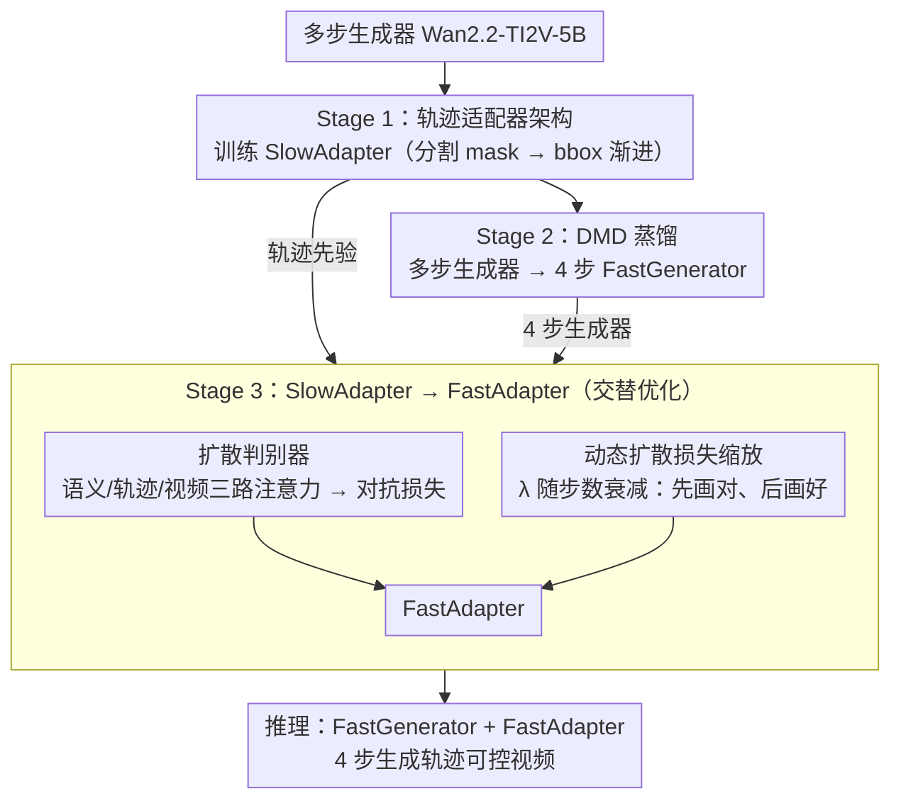

# FlashMotion: Few-Step Controllable Video Generation with Trajectory Guidance

**会议**: CVPR 2026  
**arXiv**: [2603.12146](https://arxiv.org/abs/2603.12146)  
**代码**: [https://github.com/quanhaol/FlashMotion](https://github.com/quanhaol/FlashMotion)  
**领域**: 视频理解 / 视频生成  
**关键词**: 轨迹可控视频生成, 少步蒸馏, 对抗训练, 扩散判别器, 视频加速

## 一句话总结

提出 FlashMotion，首个实现少步（4步）轨迹可控视频生成的三阶段训练框架，通过训练轨迹适配器→蒸馏快速生成器→混合对抗+扩散微调适配器的策略，在 4 步推理下同时超越现有多步方法的视觉质量和轨迹精度，实现 47 倍加速。

## 研究背景与动机

**领域现状**：扩散模型驱动的视频生成取得了显著进展，尤其是轨迹可控视频生成——用户指定前景物体的运动轨迹（bbox 或分割 mask），模型沿预定轨迹生成视频。MagicMotion、Tora、LeviTor 等方法通过在基础视频生成模型上添加轨迹适配器（adapter）实现了精确的运动控制。

**现有痛点**：所有现有的轨迹可控方法都依赖多步去噪推理（50步以上），导致生成一段 121 帧的视频需要约 1160 秒（>19分钟）。虽然视频蒸馏方法（如 DMD、LCM、CausVid）可以将通用视频生成模型压缩为少步版本，但直接将这些蒸馏方法应用于轨迹可控生成会导致视觉质量和轨迹精度的显著退化。

**核心矛盾**：多步适配器（SlowAdapter）是在多步生成器（SlowGenerator）的渐进去噪路径上训练的，其轨迹条件通过逐步细化引导噪声。而少步生成器（FastGenerator）的去噪路径完全不同——仅用 4 步就要完成全部生成。因此 SlowAdapter 与 FastGenerator 天然不兼容。直接组合会导致色彩偏移、模糊和轨迹失控。

**本文目标**：设计一个训练框架，使轨迹适配器能在少步生成器上正常工作，在 4 步推理内同时保证视觉质量和轨迹精度。

**切入角度**：作者发现用标准扩散损失微调适配器可以恢复轨迹精度但会产生严重模糊（因为像素级监督无法保证分布一致性），引入对抗训练可以消除模糊但会损失轨迹精度。因此需要同时使用两种损失并动态平衡。

**核心 idea**：三阶段训练——先训练多步适配器，再蒸馏快速生成器，最后用扩散损失+对抗损失的混合策略微调适配器以适配快速生成器。

## 方法详解

### 整体框架

FlashMotion 的训练流程分为三个阶段：**Stage 1** 在多步视频生成器（Wan2.2-TI2V-5B）上训练 SlowAdapter 来学习轨迹控制；**Stage 2** 通过 DMD 蒸馏将多步生成器压缩为 4 步 FastGenerator；**Stage 3** 用混合扩散+对抗策略将 SlowAdapter 微调为适配 FastGenerator 的 FastAdapter。推理时，FastGenerator + FastAdapter 仅需 4 步去噪即可生成轨迹精确的高质量视频。

### 关键设计

**1. 轨迹适配器架构：把用户画的轨迹注入生成过程，且不绑死在某一种 backbone 上**

轨迹控制的载体是一个挂在基础 DiT 旁边的适配器，适配器的 block 数与 DiT 完全对齐，每个 block 的输出经一层零初始化卷积加回对应的 DiT block——零初始化保证训练初期适配器不破坏原模型、再逐步学出控制信号。轨迹图（bbox 或分割 mask）先被 3D VAE 编码器压到潜空间 $Z_{trajectory} \in \mathbb{R}^{T/4 \times H/16 \times W/16 \times 48}$ 再注入。训练上走由密到疏的渐进策略：先用信息更密的分割 mask 训 4.6K 步打基础，再用更稀疏的 bbox 微调 5.4K 步，让适配器既能吃细 mask 也能吃粗 bbox。作者刻意做了 ControlNet 和轻量 ResNet 两套适配器——前者 10.28B 参数、轨迹更准，后者 5.02B 参数、推理更快——两套都能跑通，正好说明整个框架不依赖某一种适配器实现。

**2. 扩散判别器：用一个轨迹感知的判别器把对抗信号引进来，专治纯扩散损失的模糊**

光靠像素级的扩散损失 $\mathcal{L}_{diffusion} = \|G_\theta(x_t, t) - x_0^{real}\|^2$ 只能逼近单帧像素，管不住生成分布和真实分布的一致性，结果就是画面发糊。FlashMotion 加一个判别器从分布层面约束生成质量：判别器骨干直接克隆 Wan2.2-TI2V-5B 并冻结，只训练新挂的注意力分类器，省训练成本又复用了基础模型对视频的理解。分类器拿 DiT 中间层特征，让一个可学习的 query token 依次过三层注意力——**语义自注意力**整合首帧图像和文本、**轨迹交叉注意力**对齐轨迹 token、**视频交叉注意力**读视频 token——最后吐出真/假 logit。这套三路注意力的关键在于：它不是简单判"像不像真视频"，而是同时把语义、轨迹、视频三个维度纳入判别，因此既能压模糊又不会把轨迹信息判没了。

**3. 动态扩散损失缩放：让"画对"和"画好"两个目标在训练里分时段当家**

Stage 3 的总损失是对抗损失加上扩散损失 $\mathcal{L} = \mathcal{L}_{\mathcal{G}} + \lambda \mathcal{L}_{diffusion}$，难点在于这两项天生不一个量级——训练早期扩散损失的梯度远大于对抗损失，直接等权（固定 $\lambda=1$）相当于全程让扩散损失说了算，画面照样糊。作者把权重写成随步数单调衰减的形式：

$$\lambda = \frac{1}{4 \times 10^{-3} \times step + 0.1}$$

训练初期 $\lambda$ 大，扩散损失主导，先把物体放对位置、对齐轨迹；越往后 $\lambda$ 越小，对抗损失接管，专心把画面质量推上去。一句话就是先"画对"再"画好"，用一行公式调度两个阶段的主次。

### 损失函数 / 训练策略

- **Stage 1**（SlowAdapter）：标准扩散去噪损失，16 GPU × 10K 步
- **Stage 2**（FastGenerator）：DMD 分布匹配损失 $\nabla\mathcal{L}_{DMD} = \mathbb{E}[-(s_{real} - s_{fake})\frac{dG_\theta}{d\theta}]$，16 GPU × 5.5K 步
- **Stage 3**（FastAdapter）：混合损失 $\mathcal{L} = \mathcal{L}_{\mathcal{G}} + \lambda\mathcal{L}_{diffusion}$，判别器和适配器交替优化（1:5 更新比），仅需 **4 GPU × 1K 步**，极轻量

## 实验关键数据

### 主实验（FlashBench）

| 方法 | 步数 | FID↓ | FVD↓ | M IoU↑ | B IoU↑ | 去噪时间(s) |
|--------|------|------|----------|------|------|------|
| MagicMotion | 50 | 20.03 | 138.83 | 68.10 | 73.68 | 1158.63 |
| Wan+ResNet | 50 | 19.03 | 139.61 | 52.19 | 57.76 | 333.00 |
| DMD (ResNet) | 4 | 24.38 | 228.33 | 43.24 | 52.61 | 11.72 |
| LCM (ResNet) | 4 | 26.79 | 462.09 | 55.31 | 60.80 | 11.72 |
| **FlashMotion (ResNet)** | **4** | **15.81** | **108.96** | **63.96** | **70.01** | **11.72** |
| **FlashMotion (ControlNet)** | **4** | **14.35** | **96.08** | **69.15** | **75.38** | **24.44** |

### 消融实验（FlashBench, ResNet）

| 配置 | FID↓ | FVD↓ | M IoU↑ | B IoU↑ |
|------|---------|------|------|------|
| Slow Adapter 直接用 | 22.75 | 168.46 | 49.79 | 56.62 |
| w/o 扩散损失 | 18.87 | 161.07 | 52.04 | 58.04 |
| w/o GAN 损失 | 22.74 | 206.75 | 65.82 | 70.60 |
| w/o 动态缩放 | 26.32 | 210.93 | 65.54 | 69.77 |
| **FlashMotion (完整)** | **15.81** | **108.96** | **63.96** | **70.01** |

### 关键发现

- **FlashMotion 4 步超越 MagicMotion 50 步**：ControlNet 版本的 FID 14.35 vs 20.03，FVD 96.08 vs 138.83，且实现 **47× 加速**（24s vs 1158s）
- **GAN 损失是消除模糊的关键**：移除 GAN 损失后 FVD 从 108.96 暴涨至 206.75（约 90% 退化），但轨迹精度反而略好，说明 GAN 损失主要影响视觉质量
- **扩散损失是轨迹精度的关键**：移除扩散损失后 M IoU 从 63.96 降至 52.04，生成物体明显偏离预定轨迹
- **动态缩放不可或缺**：固定 $\lambda=1$ 导致 FID 从 15.81 升至 26.32（模糊加重），证明训练初期需抑制扩散损失的过大梯度
- ControlNet 适配器在轨迹精度和视觉质量上全面优于 ResNet，但推理时间约为后者的 2 倍

## 亮点与洞察

- **三阶段拆解的优雅设计**：将"快速+可控"分解为先学控制、再学快速、最后对齐两者，每个阶段目标清晰。Stage 3 仅需 1K 步训练即可完成，体现了 SlowAdapter 提供的强先验的价值
- **扩散判别器的三层注意力设计**：语义、轨迹、视频三路信息的分离式注入使判别器能同时感知多维度信息，比简单的 CNN 判别器更适合条件生成任务。这一设计可迁移到其他条件视频生成的加速中
- **动态损失缩放的实用价值**：简单但有效地解决了扩散损失和对抗损失的梯度不平衡问题，写法简洁（一行公式），但对最终效果影响巨大

## 局限与展望

- FlashBench 虽然支持长视频评测，但当前仅基于 MagicData 的扩展，数据多样性有限
- Stage 2 的蒸馏依赖特定的 DMD 方法，换用其他蒸馏方法（如 CausVid）能否进一步提升尚未探索
- 当前仅支持 bbox/mask 轨迹条件，对更灵活的轨迹表示（如点轨迹、语义描述）的支持待研究
- ControlNet 版本虽然效果更好但仍有 10.28B 参数，在端侧部署仍面临挑战
- DMD 和 GAN 在 ControlNet 下直接 OOM，限制了更多蒸馏方法的比较

## 相关工作与启发

- **vs MagicMotion**：MagicMotion 在 CogVideoX 上实现精确轨迹控制但需 50 步推理；FlashMotion 在 Wan2.2 上实现 4 步推理且效果更好
- **vs APT/APT2**：APT 系列的一步对抗蒸馏在通用视频生成中有效，但不支持轨迹条件；FlashMotion 的扩散判别器设计借鉴了 APT 的思路但加入了轨迹感知
- **vs Tora/LeviTor**：Tora 和 LeviTor 分别基于 CogVideoX 和 SVD，效果均不及 FlashMotion 且推理更慢

## 评分

- 新颖性: ⭐⭐⭐⭐ 首个少步轨迹可控视频生成框架，三阶段拆解合理，判别器设计有创意
- 实验充分度: ⭐⭐⭐⭐⭐ 三个 benchmark + 两种适配器架构 + 详尽消融，包括按物体数量分组的分析
- 写作质量: ⭐⭐⭐⭐ 结构清晰，方法描述详细，图示到位
- 价值: ⭐⭐⭐⭐⭐ 47倍加速且质量更优，对可控视频生成的实用化有直接推动作用

<!-- RELATED:START -->

## 相关论文

- [\[CVPR 2026\] LAMP: Language-Assisted Motion Planning for Controllable Video Generation](lamp_language-assisted_motion_planning_for_controllable_video_generation.md)
- [\[CVPR 2026\] MultiShotMaster: A Controllable Multi-Shot Video Generation Framework](multishotmaster_a_controllable_multi-shot_video_generation_framework.md)
- [\[CVPR 2026\] TempoControl: Temporal Attention Guidance for Text-to-Video Models](tempocontrol_temporal_attention_guidance_for_text-to-video_models.md)
- [\[CVPR 2026\] SWIFT: Sliding Window Reconstruction for Few-Shot Training-Free Generated Video Attribution](swift_sliding_window_reconstruction_for_few-shot_training-free_generated_video_a.md)
- [\[CVPR 2026\] EgoControl: Controllable Egocentric Video Generation via 3D Full-Body Poses](egocontrol_controllable_egocentric_video_generation_via_3d_full-body_poses.md)

<!-- RELATED:END -->
