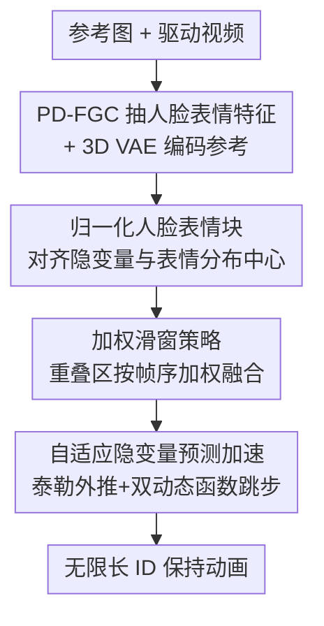

# FlashPortrait: 6× Faster Infinite Portrait Animation with Adaptive Latent Prediction

**会议**: CVPR 2026  
**论文**: [CVF Open Access](https://openaccess.thecvf.com/content/CVPR2026/html/Tu_FlashPortrait_6x_Faster_Infinite_Portrait_Animation_with_Adaptive_Latent_Prediction_CVPR_2026_paper.html)  
**代码**: [项目页](https://francis-rings.github.io/FlashPortrait)（暂未见开源代码）  
**领域**: 视频生成 / 肖像动画 / 扩散模型加速  
**关键词**: 肖像动画, 无限长视频, 扩散加速, 自适应隐变量预测, 身份保持

## 一句话总结
FlashPortrait 用一套「加权滑窗 + 自适应隐变量外推」的训练免费推理机制，把长肖像动画的去噪步数大幅压缩，在生成超过 1800 帧、ID 保持不漂移的前提下实现最高 6× 推理加速。

## 研究背景与动机

**领域现状**：肖像动画（portrait animation）给一张参考图 + 一段驱动视频，合成出表情/口型自然且保持参考身份的人脸视频。近年主流从 GAN 转向扩散模型，又从 U-Net 架构升级到 DiT（Diffusion-in-Transformer），代表作如 HunyuanPortrait、FantasyPortrait、Wan-Animate。为了贴近影视/虚拟人等真实场景，研究开始追求「长视频」乃至「无限长」生成。

**现有痛点**：长视频带来两个互相纠缠的麻烦。一是**慢**——DiT 方法逐帧逐步去噪，生成 20 秒视频动辄上千秒推理延迟；二是**漂**——超过约 20 秒后普遍出现身体扭曲、身份（ID）不一致、颜色漂移。现成的加速手段又救不了场：缓存类方法（TeaCache、TaylorSeer、FoCa）训练免费但「存了旧特征直接复用」，在大幅度人脸运动下会让去噪方向跑偏；蒸馏类方法（Self-Forcing）要花大量算力训一个 4 步学生模型，且依赖自回归逐段采样，学生无法完整继承教师先验，每段都留下微小隐变量误差，跨段累积后放大成肉眼可见的分布偏移和色彩抖动。

**核心矛盾**：肖像动画的人脸运动「复杂且大幅度」，导致隐变量在不同时间步之间剧烈波动。这恰恰是通用加速方法（多为面向轻微运动的 I2V 设计）的死穴——固定阶数/固定模式的外推无法跟上这种波动，误差随时间步快速累积，最终表现为 ID 失稳。换句话说，**「快」和「ID 稳」在长肖像动画里天然冲突**。

**本文目标**：在不训练额外学生模型、只在推理期介入的前提下，同时拿到「6× 加速」和「无限长 + ID 保持」。

**切入角度**：作者观察到两件事——(1) 隐变量虽然波动大，但其在相邻时间步的「变化率」和「跨层导数幅度」是有规律、可度量的，可以据此**自适应**地决定外推多激进；(2) 同一片段内 ID 都会抖，根因是扩散隐变量与人脸表情特征两个分布中心相距太远。

**核心 idea**：用历史隐变量的有限差分近似当前隐变量的高阶导数，再用泰勒展开**直接预测未来时间步的隐变量、跳过若干次完整去噪**；并用两个动态函数按时间步和网络层自适应缩放这个外推，保证跳步的同时 ID 不崩。

## 方法详解

### 整体框架

FlashPortrait 以 Wan2.1-I2V-14B 为骨干。驱动视频先过现成的 PD-FGC 抽取与身份无关的人脸表情特征（头姿、眼、情绪、口型），参考图分两路注入：一路经 CLIP 图像编码器得到图像嵌入，注入到每个 DiT block 里调制人脸属性；另一路在时间维补零帧后经冻结 3D VAE 编码成隐码，与压缩后的视频帧、二值 mask（首帧为 1、其余为 0）按通道拼接。推理时把视频帧换成随机噪声、其余输入不变，由 DiT 逐步去噪还原出动画帧。

整条 pipeline 的三个贡献点对应三处改造：在 DiT 内部用 **归一化人脸表情块** 替换原来的图像 cross-attention 块，解决「同片段内 ID 都抖」；在窗口级用 **加权滑窗策略** 把相邻窗口的重叠区平滑融合，解决「跨片段过渡突兀」；在每个窗口内用 **自适应隐变量预测加速** 跳过多步去噪，解决「慢」。三者叠加，得到一个既快又稳的无限长肖像动画器。

### 关键设计

**1. 归一化人脸表情块：把表情特征和扩散隐变量拉到同一个分布中心**

痛点很具体：以往模型即便在同一片段内 ID 也会抖，根因是扩散隐变量 $z_i$ 与原始人脸表情嵌入的分布中心离得太远，注入时相当于强行融合两团错位的分布，人脸建模因此不稳。FlashPortrait 先把 PD-FGC 得到的口型嵌入 $emb_m$ 与头姿/眼/情绪拼成的 $emb_{e*}$ 各过几层自注意力 $\mathrm{SA}(\cdot)$ 和 FFN 增强对整体人脸布局的感知，拼接成肖像嵌入 $emb_p$。隐变量 $z_i$ 分别与图像嵌入、肖像嵌入做 cross-attention 得到 $z_i^{img}$ 和 $z_i^p$。关键一步是用统计量做归一化对齐：作者要求 $\frac{z_i^{img}-\mu_{img}}{\sigma_{img}}=\frac{z_i^{p}-\mu_p}{\sigma_p}$ 成立时两者分布中心几乎重合，于是把肖像分支按图像分支的均值方差重标定再相加：

$$\bar{z}_i^{p}=\frac{z_i^{p}-\mu_p}{\sigma_p}\times\sigma_{img}+\mu_{img},\qquad \bar{z}_i=\bar{z}_i^{p}+z_i^{img}$$

消融里这一步很关键：只做纯归一化（Pure Norm）或只做中心化（Centralization）都不能真正缩小分布间距，必须同时融合两个 cross-attention 特征的均值和标准差，AED 才从 baseline 的 44.78 降到 29.68。

**2. 加权滑窗策略：让相邻窗口的重叠区按帧序平滑过渡**

长视频靠滑窗逐段生成，传统做法在窗口拼接处容易留下突兀的跳变。FlashPortrait 给重叠区赋一组「相对帧序感知」的权重 $W=\{w_i=\tfrac{i}{v}\mid i=0,1,\dots,v\}$（$v$ 为重叠长度，实验取 5），对相邻两窗口的重叠隐变量做加权求和：

$$z_i^{overlapp}=W*C_i+(1-W)*C_{i-1}$$

其中 $C_i$、$C_{i-1}$ 是当前窗口与前一窗口在重叠区的隐变量。这是一个随相对帧序线性递增的算术权重，越靠近新窗口越偏向新窗口的内容，从而在两段子片段之间形成渐变式的无缝衔接。算法上每次窗口前进 $l-v$ 帧（$l$ 为窗口长度），逐窗滚动直到覆盖整段。消融显示，相比 motion frame 和普通滑窗，加权滑窗把 AED 从 36.44 降到 29.68，过渡更连贯。

**3. 自适应隐变量预测加速：用历史隐变量外推未来、按时间步与网络层自适应跳步**

这是 6× 加速的主引擎，训练免费、只在推理期启用。核心思路是**不每步都跑 DiT**，而是用泰勒展开从历史隐变量直接预测未来时间步的隐变量。设 $f(\cdot)$ 为去噪 DiT，把展开点设在 $t+k$（$K$ 为时间步间隔取 5，$k\in\{1,\dots,K-1\}$），得到

$$f(t)=\sum_{i=0}^{n}\frac{f^{(i)}(t+k)}{i!}(-k)^{i}+R_{n+1}$$

为避免真求导带来的额外计算，用有限差分近似导数：$\triangle f(t)=f(t+K)-f(t)$，$\triangle^2 f(t)=\triangle f(t+K)-\triangle f(t)$。作者用数学归纳法证明 $\triangle^{i}f(t)\approx K^{i}f^{(i)}(t)$，代回后 DiT 只需在 $\{t+K, t+2K,\dots,t+(n+1)K\}$ 这些稀疏时间步上做完整去噪，其余靠外推填补，于是省下大量步数。

但肖像动画的人脸运动幅度大，固定阶数外推不可靠。作者再加**两个动态函数**自适应缩放。第一个看「时间步上的隐变量变化率」：定义 $\sigma(t)=\frac{df(t)}{dt}$、跨时间步平均变化率 $\sigma_{avg}(T')$，令 $s(t)=\left(\frac{\sigma(t)}{\sigma_{avg}(t)}\right)^{\alpha}$（$\alpha\in[0.5,1.5]$，取 1.5）——早期时间步隐变量变化快就用更大的有效 $K$ 补偿，后期变化平缓就缩小以免过度放大 $\triangle^i f(t)$。第二个看「跨层导数幅度比」：$r(t,l,i)=\frac{\mathrm{E}[\|f^{(i)}(t,l)\|]}{\mathrm{E}[\|f^{(i)}(t,avg)\|]}$，缩放 $w(t,l,i)=\frac{1}{\sqrt{r(t,l,i)}}$——低层捕捉纹理边缘、对噪声敏感、高阶导数剧烈（$r>1$）就压低缩放避免过放大，高层建模稳定全局结构、导数平缓（$r<1$）就提高缩放弥补有限差分的不足。两者把差分到高阶导数的映射 refine 成

$$\triangle^{i}f(t,l)\approx K^{i}\cdot w(t,l,i)\cdot s(t)\cdot f^{(i)}(t,l)$$

代回得到最终的逐层预测式：

$$f(t,l)=f(t+k,l)+\sum_{i=1}^{n}\frac{\triangle^{i}f(t+k,l)\cdot(-k)^{i}}{i!\cdot K^{i}\cdot w(t+k,l,i)\cdot s(t+k)}$$

消融印证了「动态函数」的必要性：去掉它（即退化成固定的 TaylorSeer 式预测）AED 从 29.68 暴涨到 42.66；而 FoCa、Self-Forcing 虽能更快，却在大幅表情下产生严重伪影和 ID 漂移。

### 损失函数 / 训练策略

只训练 DiT 的注意力模块，其余冻结，目标是重建损失。为强化人脸区域保真，用 MediaPipe 从输入帧提取人脸 mask $M_{face}$ 和嘴唇 mask $M_{lip}$ 对损失加权：

$$\mathcal{L}=\mathbb{E}_{\theta}\left(\left\|(z_{gt}-z_{\varepsilon})\odot(1+M_{face}+M_{lip})\right\|^2\right)$$

让模型在脸部和口唇区域学得更聚焦。训练数据约 2000 小时（Hallo3 + Celebv-HQ + 网络视频），20 epoch、200 张 H100、$lr=10^{-5}$、$K=5$、$n=3$。

## 实验关键数据

### 主实验

在 Voxceleb2&Vfhq（均长约 10 秒）与自建 Hard100（1-3 分钟长视频）上对比。表中 `a/b` 分别为两个测试集结果，Speed 为生成 20 秒 480×832 视频的延迟。

| 模型 | FVD↓ (Vox/Hard) | PSNR↑ (Vox/Hard) | AED↓ (Vox/Hard) | MAE↓ (Vox/Hard) | Speed↓ |
|------|------|------|------|------|------|
| Wan-Animate（最强基线） | 336.12 / 695.48 | 32.54 / 18.13 | 19.54 / 42.98 | 7.88 / 20.08 | 2298s |
| FantasyPortrait | 328.93 / 723.57 | 32.48 / 16.47 | 19.66 / 45.34 | 7.64 / 19.87 | 4339s |
| HunyuanPortrait | 366.72 / 882.54 | 31.93 / 16.63 | 20.75 / 49.95 | 8.85 / 20.48 | 1602s |
| **FlashPortrait（本文）** | **320.47 / 340.21** | 32.36 / **26.16** | **15.19 / 29.68** | **5.93 / 12.54** | **720s** |

短视频上本文与最强基线相当，**长视频上差距拉开**：相比 Wan-Animate，在 Hard100 上 AED/APD/MAE 分别提升 30.9% / 30.4% / 37.5%，同时推理快约 3×；与最慢的 FantasyPortrait（4339s）相比则达到约 6× 加速。质性结果显示生成 3000+ 帧后仍保持参考身份，而对手在 30 秒后普遍出现颜色漂移、人脸/身体扭曲。

### 消融实验

**加速机制对比**（Hard100，20 秒视频延迟）：

| 配置 | AED↓ | APD↓ | MAE↓ | Speed↓ |
|------|------|------|------|------|
| Baseline（无加速） | 29.12 | 23.86 | 12.37 | 4328s |
| TeaCache | 33.94 | 27.62 | 15.06 | 2164s（仅 ~2×） |
| w/o 动态函数（≈TaylorSeer） | 42.66 | 35.98 | 19.63 | 682s |
| FoCa | 37.47 | 32.96 | 17.88 | 862s |
| Self-Forcing | 52.85 | 39.32 | 20.79 | 266s |
| **Ours** | **29.68** | **24.40** | **12.54** | **720s** |

**归一化块消融**：Baseline（直接相加）AED 44.78 → Pure Norm 38.42 → Centralization 33.76 → **Ours 29.68**，逐级验证「同时融合两分支均值+标准差」才真正缩小分布间距。

**超参 $K$/$n$**（$n=3,K=5$ 为默认）：$K=2$ 几乎无损但慢（2116s），$K=8$ 快到 295s 但 AED 暴涨到 44.21；$n$ 增大提升预测精度但变慢，$n>3$ 收益边际。故 $K=5,n=3$ 是质量-速度最优折中。

### 关键发现
- **加速主引擎是「动态函数」而非泰勒外推本身**：去掉动态函数退化成固定阶数预测，速度更快（682s）但 AED 几乎翻倍（42.66），说明大幅人脸运动下「自适应缩放」是 ID 稳定的关键。
- **越长差距越大**：所有对手在长视频上都明显掉点，本文在 Hard100 上 PSNR 反而高出一截（26.16 vs Wan-Animate 18.13），印证滑窗加权 + 分布对齐对误差累积的抑制。
- **ID 漂移有两个来源**：作者分析 <15s 主要来自条件注入时的分布偏移，>15s 则主要来自逐片段误差累积——两个设计正好各打一处。

## 亮点与洞察
- **把「缓存复用」换成「外推预测」**：缓存类方法直接复用旧特征，运动大就跑偏；本文改成用历史差分外推未来隐变量，配合自适应缩放，是对 TaylorSeer 思路的针对性升级，专治大幅人脸运动。
- **分布中心对齐这个 trick 很可迁移**：用一个分支的 $(\mu,\sigma)$ 重标定另一分支再相加，本质是把两团错位特征对齐到同一中心，思路可借鉴到任何「异构条件注入扩散」的场景（如音频/姿态驱动）。
- **训练免费 + 即插即用**：加速机制和加权滑窗都只在推理期介入，不依赖额外蒸馏训练，落地成本低。

## 局限与展望
- 骨干是 Wan2.1-14B、需 200 张 H100 训练，复现门槛高；项目页暂未见开源代码，⚠️ 代码可得性以官方为准。
- 加速虽快但 720s 生成 20 秒视频离实时仍有距离；$K>5$ 时质量明显劣化，说明跳步幅度受人脸运动复杂度硬约束。
- 两个动态函数引入了 $\alpha$ 等超参，论文给了经验取值但未充分分析其跨数据集鲁棒性；对极端表情/遮挡场景的失败案例讨论较少。
- ID 一致性在 >15s 主要靠抑制累积误差，理论上仍随长度缓慢退化——「无限长」是工程意义上的，⚠️ 长期稳定性以原文实验上限（5400+ 帧）为准。

## 相关工作与启发
- **vs 缓存类加速（TeaCache / TaylorSeer / FoCa）**：它们训练免费但用固定模式复用/外推，加速上限低（TeaCache ~2×）或在大运动下漂移；本文用「有限差分外推 + 双动态函数」自适应跳步，把加速推到 6× 且 ID 稳。
- **vs 蒸馏类加速（Self-Forcing）**：蒸馏要训 4 步学生 + 自回归采样，误差逐段累积、只适合近静态视频（AED 52.85）；本文不训学生、不自回归，长视频质量明显更好。
- **vs Wan-Animate / FantasyPortrait**：同为 DiT 肖像动画，但它们无专门的长视频/加速机制，30 秒后颜色漂移、扭曲严重；本文在过渡（加权滑窗）、ID（归一化块）、速度（自适应外推）三处系统补强。

## 评分
- 新颖性: ⭐⭐⭐⭐ 首个面向 ID 保持无限长肖像动画的训练免费加速框架，双动态函数设计有针对性。
- 实验充分度: ⭐⭐⭐⭐ 主表 + 多组消融（归一化/滑窗/加速/超参）齐全，长短视频双测试集对比扎实。
- 写作质量: ⭐⭐⭐⭐ 公式推导完整、动机清晰；部分符号密集，阅读门槛偏高。
- 价值: ⭐⭐⭐⭐ 加速 + ID 保持 + 无限长三者兼得，对长肖像视频落地有实用价值。

<!-- RELATED:START -->

## 相关论文

- [\[CVPR 2026\] PersonaLive! Expressive Portrait Image Animation for Live Streaming](personalive_expressive_portrait_image_animation_for_live_streaming.md)
- [\[CVPR 2025\] HunyuanPortrait: Implicit Condition Control for Enhanced Portrait Animation](../../CVPR2025/video_generation/hunyuanportrait_implicit_condition_control_for_enhanced_portrait_animation.md)
- [\[CVPR 2026\] AdapTok: Learning Adaptive and Temporally Causal Video Tokenization in a 1D Latent Space](adaptok_learning_adaptive_and_temporally_causal_video_tokenization_in_a_1d_laten.md)
- [\[CVPR 2026\] Infinity-RoPE: Action-Controllable Infinite Video Generation Emerges From Autoregressive Self-Rollout](infinity-rope_action-controllable_infinite_video_generation_emerges_from_autoreg.md)
- [\[CVPR 2026\] HarmoVid: Relightful Video Portrait Harmonization](harmovid_relightful_video_portrait_harmonization.md)

<!-- RELATED:END -->
