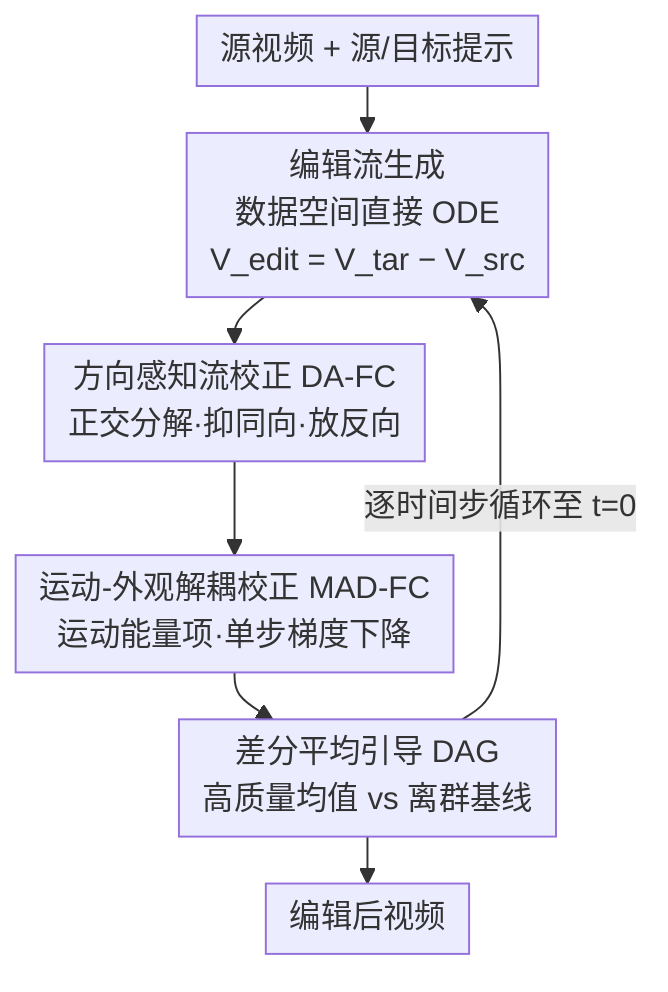

# FlowDirector: Training-Free Flow Steering for Precise Text-to-Video Editing

**会议**: CVPR 2026  
**论文**: [CVF Open Access](https://openaccess.thecvf.com/content/CVPR2026/html/Li_FlowDirector_Training-Free_Flow_Steering_for_Precise_Text-to-Video_Editing_CVPR_2026_paper.html)  
**代码**: 论文称将开源（地址待确认）  
**领域**: 视频生成 / 视频编辑 / 扩散模型  
**关键词**: 文本驱动视频编辑, training-free, 无反演编辑, Rectified Flow, 流校正  

## 一句话总结
FlowDirector 把文本驱动视频编辑建模为数据空间里由 ODE 驱动的"直接演化"，彻底绕开传统的反演（inversion）步骤，再用三个免训练的流校正策略（方向感知 / 运动-外观解耦 / 差分平均引导）分别管好"改得彻底""动作不变""轨迹不抖"，在指令遵循、时序一致性和背景保持上同时刷到 SOTA。

## 研究背景与动机
**领域现状**：文本驱动视频编辑的主流是 training-free 路线——直接复用预训练扩散/T2V 模型的先验，不微调就改视频。这条路线里几乎所有方法（FateZero、TokenFlow、FLATTEN、RAVE、VideoDirector 等）都走 **inversion-editing 范式**：先把源视频"反演"映射到潜空间噪声轨迹，再在去噪过程中通过操纵中间表示完成编辑。

**现有痛点**：反演对图像有效，但对视频是灾难。视频是高维时序序列，反演一整段视频要求生成一条**时序平滑的潜轨迹**，而图像反演技术天生不是为此设计的。结果是：逐帧的小反演误差会**累积**成时序漂移和闪烁；跨帧注意力错位破坏布局与身份；运动和外观混在一起导致风格不一致、动作失真。这些叠加起来严重拖垮编辑质量。

**核心矛盾**：反演范式有一个无法回避的两难——它必须把数据映射到噪声才能腾出"修改空间"，但这个映射本身不精确，精度损失直接转嫁到外观保真和运动一致性上。

**本文目标**：干脆不要反演。把"源视频 → 编辑结果"建模为数据空间里的一条**直接演化路径**，让视频沿着自己原生的时空流形平滑迁移。但天真地把无反演范式搬到视频上还有三个新坑要填：(1) 时序维度带来更丰富的外观/结构信息，想做剧烈语义变换又不破坏时空合理性更难；(2) 缺少强约束导致运动严重扭曲漂移；(3) 跨帧叠加的采样噪声让系统对扰动异常敏感，轨迹不稳。

**切入角度**：受 flow-based 无反演图像编辑（FlowEdit、FlowAlign）启发，用 Rectified Flow 在源、目标分布之间构造一条直接 ODE 轨迹。但无反演范式有个副作用——它保留了源视频的强内容信息，形成一种"语义引力"把编辑往回拽，导致编辑过于保守。这正是要专门破解的点。

**核心 idea**：在直接 ODE 编辑流之上，叠加三个互补的流校正算子，分别针对"编辑不够彻底""运动会漂""轨迹会抖"三个病灶做手术，而全程不训练任何参数。

## 方法详解

### 整体框架
FlowDirector 的输入是源视频 $X_{\text{src}}$ + 源提示 $c_{\text{src}}$（没有就让 LLM 自动描述）+ 目标提示 $c_{\text{tar}}$，输出是编辑后的视频，全程基于预训练 T2V 模型 $v_\theta$（实现用 Wan-2.1 1.3B），不做任何微调。

整条管线先用 **编辑流生成** 在数据空间直接搭出一条 ODE 轨迹：把编辑态 $Z_t^{\text{edit}}$ 的演化速度定义为目标速度与源速度之差，轨迹从源视频出发（$t=1$）收敛到编辑结果（$t=0$）。然后在**每一个时间步**上，编辑流依次过三道校正：**DA-FC** 重新定向（让编辑改得动）、**MAD-FC** 锁运动（让动作别漂）、**DAG** 稳轨迹（让纹理别抖），最后积分得到结果。三个校正是流水线串联、逐步精修同一条编辑流，所以相比反演方法，轨迹更短、更高效、质量更好。

### 关键设计

**1. 编辑流生成：把编辑变成数据空间里的直接 ODE 演化，从源头删掉反演步**

针对"反演不精确拖垮保真"这个根源问题，FlowDirector 不再把视频映射到高斯噪声当起点，而是直接在数据空间构造编辑轨迹。沿用 FlowEdit 的统一编辑方程，编辑态写成 $Z_t^{\text{edit}} = X_{\text{src}} - Z_t^{\text{src}} + Z_t^{\text{tar}}$，其演化由一个 ODE 控制，速度场取目标速度减源速度：

$$\frac{dZ_t^{\text{edit}}}{dt} = V_{\text{edit}}(t) = v_\theta(Z_t^{\text{tar}}, t, c_{\text{tar}}) - v_\theta(Z_t^{\text{src}}, t, c_{\text{src}})$$

轨迹从 $Z_1^{\text{edit}} = X_{\text{src}}$ 出发，随 $t\to 0$ 收敛到编辑结果。源态用 Rectified Flow 的线性插值 $Z_t^{\text{src}} = (1-t)X_{\text{src}} + tN_t$（$N_t\sim\mathcal{N}(0,I)$）得到；目标态因为目标视频不可见，就反解编辑方程得 $Z_t^{\text{tar}} = Z_t^{\text{edit}} + Z_t^{\text{src}} - X_{\text{src}}$。这个构造的妙处在于**源态和目标态共享同一份噪声 $N_t$**，做差时噪声和随机扰动相互抵消，留下的 $V_{\text{edit}}$ 主要承载提示带来的语义变化，这就是后续所有校正要操作的对象。

**2. 方向感知流校正 DA-FC：把编辑流里"拉着不让改"的分量压下去、"推着去改"的分量放大**

无反演范式保留了源视频的强内容先验，形成"语义引力"把编辑往回拽，标准编辑流常被源先验淹没，编辑过于保守。作者的关键洞察是：原始编辑流里其实藏着两股对抗的力——与源方向**同向**的分量造成冗余漂移（白改），与源方向**反向**的分量才真正驱动语义变化。DA-FC 在每个 token 上把 $V_{\text{edit}}$ 沿 $V_{\text{src}}$ 做正交分解：

$$V_{\parallel} = \frac{\langle V_{\text{edit}}, V_{\text{src}}\rangle}{\|V_{\text{src}}\|^2 + \varepsilon}\, V_{\text{src}}, \quad V_{\perp} = V_{\text{edit}} - V_{\parallel}$$

然后按方向施加非对称校正：当 $V_\parallel$ 与源同向（内积 $\ge 0$）时只保留垂直分量 $V_\perp$、丢掉同向分量；当 $V_\parallel$ 与源反向（内积 $<0$）时则放大它，$\tilde{V}_{\text{edit}} = (1+\alpha)V_\parallel + V_\perp$（$\alpha>0$ 是放大系数）。这样同向冗余被抑制、反向的"改变力"被放大，编辑轨迹更果断也更稳。为避免改到无关区域，再从源/目标提示的 cross-attention 图聚合出编辑掩码 $M$，并用欧氏距离变换 $d$ 加指数衰减把掩码边缘软化，$\widetilde{M}_{c,t}(x,y) = M_{c,t}(x,y) + (1-M_{c,t}(x,y))e^{-\lambda d_{c,t}(x,y)}$，最后逐元素乘到校正后的流上 $\hat{V}_{\text{edit}} = \tilde{V}_{\text{edit}} \odot \widetilde{M}$，让编辑区与背景平滑过渡。

**3. 运动-外观解耦流校正 MAD-FC：建一个只惩罚运动偏差、对外观变化完全免疫的正交控制面**

剧烈外观变换（人变熊）和严格运动保持（篮球轨迹不变）常常目标冲突；无反演方法又没法像反演方法那样从源视频注入显式结构引导（如 cross-attention map），遮挡等复杂动态下运动误差会累积、被模型误读成"该改的外观"，造成深度错位等严重失真。直接强行拉近与源视频的相似度又会把想要的外观编辑也撤销掉。MAD-FC 的做法是把"纯运动"从静态外观里数学上分离出来：每个时间步先用 Tweedie 估计去噪态 $Z_0^{\text{src}} = Z_t^{\text{src}} - tV_{\text{src}}$、$Z_0^{\text{tar}} = Z_t^{\text{tar}} - tV_{\text{tar}}$，对两侧做时间平均得到外观参考锚帧 $(A_h^{\text{src}}, A_h^{\text{tar}})$，再用去噪态减锚帧得到运动表示 $G_{\text{src}} = Z_0^{\text{src}} - A_h^{\text{src}}$、$G_{\text{tar}} = Z_0^{\text{tar}} - A_h^{\text{tar}}$（消静态外观、留运动）。运动失配用能量 $J_t(Z) = \tfrac{1}{2}\|G_{\text{tar}} - G_{\text{src}}\|_2^2$ 度量。

在标准 ODE 更新之后，再对 $J_t$ 做**单步梯度下降**修正编辑态。用一阶近似 $\nabla_{Z_t} J_t \approx G_{\text{tar}} - G_{\text{src}}$，展开成可执行的更新式：

$$Z_t^{\text{edit}} \leftarrow Z_t^{\text{edit}} - \zeta\Big[\underbrace{(Z_0^{\text{tar}} - Z_0^{\text{src}})}_{\text{motion}} - \phi\underbrace{(A_h^{\text{tar}} - A_h^{\text{src}})}_{\text{appearance}}\Big]$$

其中 $\zeta>0$ 控制整体修正强度，$\phi\in[0,1]$ 调节"外观对齐"被强制的程度。本质上 MAD-FC 在每个时间步把源、目标的运动能量拉近，从而把源运动迁移到编辑视频，同时用 $\phi$ 在"外观修正"和"运动保持"之间做可调权衡——这让编辑在遮挡和复杂动态下也保持稳定。

**4. 差分平均引导 DAG：不靠海量采样硬平均，而是用"共识 vs 离群"的差分信号主动把轨迹推离噪声**

直接 ODE 编辑的速度估计方差大，单样本噪声引入方向抖动、累积成时序闪烁。图像编辑里可以靠暴力多采样平均压噪声，但视频维度太高、这么干算不起。DAG 改成"主动导航"：每步先用 $L_{\text{HQ}}$ 个不同噪声下的编辑流求平均，得到高质量估计 $V_{\text{HQ}} = \frac{1}{L_{\text{HQ}}}\sum_{\ell} V_{\text{edit}}^{(\ell)}$；再从同一批样本里挑出与 $V_{\text{HQ}}$ 余弦相似度**最低**的 $K$ 个，平均成保守基线 $V_{\text{BL}}$。两者之差 $\bar{D} = V_{\text{HQ}} - V_{\text{BL}}$ 就是"噪声漂移"信号，用它引导最终速度 $V_{\text{DAG}} = V_{\text{HQ}} + w\bar{D}$（$w>0$ 控引导强度）。差分信号不仅是把误差平掉，而是**主动把轨迹朝远离离群噪声的方向推**，用很小的算力把编辑锁到低方差流形上。实现上 $L_{\text{HQ}}=3$、$K=2$。另外针对 flow-matching 后期大 shift 值造成宽步长、不同噪声扰动引起纹理闪烁的问题，作者在去噪后期（最后 8 步）**固定单一噪声样本**不再重采样，进一步稳住纹理细节。

### 损失函数 / 训练策略
全程 **training-free，无任何参数更新**。关键超参：50 步去噪、不跳步；DA-FC 取 $\alpha=0.25$、掩码软化 $\lambda=0.25$；MAD-FC 按任务设 $(\zeta,\phi)$——强运动用 $(0.01, 0.3)$、弱运动用 $(0.007, 0.5)$；DAG 取 $L_{\text{HQ}}=3,K=2,w=2.75$，最后 8 步复用固定噪声。主结果均在 Wan-2.1 1.3B 上、单张 NVIDIA H20 141G 跑出。

## 实验关键数据

评测集：从互联网视频和 DAVIS 构造 150 对视频-文本编辑对，覆盖插入、删除、对象编辑，分别在 41 帧和 81 帧两种设置评测。对比 FateZero、FLATTEN、TokenFlow、RAVE、VideoDirector 五个 SOTA。指标含 Pick-Score（人类偏好）、CLIP-T（文本对齐）、CLIP-F（帧间时序一致）、WarpSSIM（用 RAFT 光流 warp 后的结构保持）、$Q_{\text{edit}}=\text{WarpSSIM}\cdot\text{CLIP-T}$（综合）。

### 主实验
下表为 41 帧结果（论文以 a/b 同时给 41/81 帧，这里取 41 帧；↑ 越高越好）。

| 方法 | Pick-Score↑ | CLIP-T↑ | CLIP-F↑ | WarpSSIM↑ | Q_edit↑ |
|------|-------------|---------|---------|-----------|---------|
| FateZero | 20.41 | 32.01 | 92.25 | 78.37 | 25.09 |
| FLATTEN | 20.84 | 33.56 | 92.80 | 77.44 | 26.01 |
| TokenFlow | 20.99 | 32.69 | 93.82 | 74.98 | 24.51 |
| RAVE | 21.01 | 33.25 | 94.03 | 76.32 | 25.38 |
| VideoDirector | 20.61 | 32.56 | 95.48 | 75.89 | 24.70 |
| **FlowDirector (1.3B)** | **21.82** | **34.64** | **97.34** | **78.49** | **27.19** |
| FlowDirector (14B) | 22.61 | 34.95 | 97.30 | 79.86 | 28.67 |

1.3B 版本在 CLIP-T、CLIP-F、$Q_{\text{edit}}$ 上全面领先，Pick-Score 与 WarpSSIM 也最优/次优；换 14B 模型几乎所有指标再上一台阶。

### 消融实验
逐项关掉三个校正（41 帧）：

| 配置 | CLIP-T↑ | CLIP-F↑ | WarpSSIM↑ | Q_edit↑ | 说明 |
|------|---------|---------|-----------|---------|------|
| Director ODE (no skip) | 34.59 | 94.66 | 62.71 | 21.69 | 裸 ODE 不跳步，结构保持极差 |
| Director ODE (skip) | 32.23 | 96.84 | 78.90 | 25.43 | 跳早期步换稳定但编辑变弱 |
| w/o DA-FC | 32.25 | 95.70 | 78.83 | 25.42 | 去方向校正，CLIP-T 掉到 32.25，改不动 |
| w/o MAD-FC | 34.71 | 97.10 | 69.26 | 24.04 | 去运动解耦，WarpSSIM 暴跌至 69.26，运动漂 |
| w/o DAG | 34.62 | 97.19 | 78.32 | 27.11 | 去差分引导，指标小降但闪烁回潮 |
| **FlowDirector** | 34.64 | 97.34 | 78.49 | 27.19 | 完整模型 |

DA-FC 的放大系数 $\alpha$ 单独消融：从 w/o Para（$\alpha$ 无）到 $\alpha=0.25$，CLIP-T 从 33.02 升到 34.64，$Q_{\text{edit}}$ 从 26.04 升到 27.19，验证"放大反向分量 → 编辑更彻底"。

### 关键发现
- **MAD-FC 对运动保持贡献最大**：去掉它 WarpSSIM 从 78.49 直接掉到 69.26（约 −9.2），CLIP-T 反而略升——印证"不约束运动时模型会把运动误差当外观自由发挥"，外观改得欢但动作全乱。
- **DA-FC 决定"改不改得动"**：去掉它 CLIP-T 掉到 32.25，编辑被源先验淹没；$\alpha$ 越大语义改变越强，但 WarpSSIM 反而下降——作者解释为剧烈编辑带来形状形变，用源光流去 warp 编辑帧会严重错位，是指标本身的局限而非编辑变差。
- **DAG 的数值收益小但视觉收益大**：所有指标只微升，作者明确指出 WarpSSIM/CLIP-T 对纹理闪烁、局部不一致等人眼可见的退化并不敏感 ⚠️，所以指标低估了 DAG 的实际作用。
- **长遮挡鲁棒**：在 ~20 帧遮挡的 "bike → motorcycle" 案例里，编辑对象在遮挡前后身份和外观保持一致，是反演方法的老大难。

## 亮点与洞察
- **正交分解编辑流**是最漂亮的一招：把"白改的同向分量"和"真改的反向分量"显式拆开，再非对称地抑制/放大，直接拆解了无反演范式的"语义引力"——这个 token-wise 分解思路可迁移到任何 flow/速度场引导的编辑任务。
- **差分而非平均**：DAG 不把多次采样简单平均，而是构造"高质量共识 vs 最不像的离群基线"的差分信号去主动导航，用 3 次采样达到逼近低方差的效果，是高维域里"省采样还稳"的实用技巧。
- **运动-外观锚帧解耦**：用"时间平均当外观锚、去噪态减锚当运动"这套朴素分解，配单步梯度下降，就在没有显式结构引导的情况下实现了可调的运动迁移，工程上轻量优雅。
- 整套方法**完全免训练**、即插即用在预训练 T2V 上，三个算子各管一件事、互不耦合，是很干净的"诊断—对症—下药"式设计。

## 局限与展望
- WarpSSIM 用源视频光流来评编辑结果，在剧烈形变下系统性失真，作者自己也承认它会低估强编辑——评测指标和编辑目标存在内生冲突，需要更鲁棒的运动保持度量。
- 三个校正引入了一批任务相关超参（尤其 MAD-FC 的 $(\zeta,\phi)$ 要按运动强弱手调），通用性和自动化程度有限。
- DAG 多次采样仍有额外算力开销（论文把 runtime/资源分析和加速策略放到了补充材料 ⚠️ 正文未给完整数字），在视频高维域的成本仍是隐忧。
- 强烈依赖底座 T2V（Wan-2.1）的时空先验质量，1.3B → 14B 提升明显也说明上限被底座绑定。

## 相关工作与启发
- **vs FlowEdit / FlowAlign（无反演图像编辑）**：本文继承其"数据空间直接 ODE"的核心，但指出天真搬到视频会遇到编辑保守、运动漂移、噪声敏感三大新坑，并用 DA-FC/MAD-FC/DAG 专门补齐——是把图像无反演范式真正落到视频域的关键工程。
- **vs VideoDirector / 其他反演式 T2V 编辑**：它们走 invert-then-denoise，受反演误差和两阶段时序误差累积之苦，难做大幅视觉变换；FlowDirector 整条删掉反演，从根上规避漂移与闪烁，在 CLIP-F/时序一致性上明显占优。
- **vs FateZero / TokenFlow / FLATTEN / RAVE（zero-shot T2I 适配）**：这些基于 T2I 模型、缺时序理解；FlowDirector 直接用原生 T2V 先验 + 流校正，时序一致性与编辑精度都更好。

## 评分
- 新颖性: ⭐⭐⭐⭐⭐ 首个把无反演 ODE 编辑系统落到视频域，正交分解+差分引导都很有原创性
- 实验充分度: ⭐⭐⭐⭐ 5 个 SOTA、双帧长、多指标 + 逐项消融到位，但部分关键分析（runtime、MAD-FC 参数）推到补充材料
- 写作质量: ⭐⭐⭐⭐⭐ 动机—痛点—对策链条清晰，三个校正各自的"为什么"讲得透
- 价值: ⭐⭐⭐⭐⭐ training-free 即插即用、SOTA 编辑质量，为无反演视频编辑立了新范式

<!-- RELATED:START -->

## 相关论文

- [\[CVPR 2026\] FlowMotion: Training-Free Flow Guidance for Video Motion Transfer](flowmotion_training-free_flow_guidance_for_video_motion_transfer.md)
- [\[CVPR 2026\] FlowPortal: Residual-Corrected Flow for Training-Free Video Relighting and Background Replacement](flowportal_residual-corrected_flow_for_training-free_video_relighting_and_backgr.md)
- [\[CVPR 2026\] RFDM: Residual Flow Diffusion Models for Video Editing](rfdm_residual_flow_diffusion_models_for_video_editing.md)
- [\[CVPR 2026\] Training-free Motion Factorization for Compositional Video Generation](training-free_motion_factorization_for_compositional_video_generation.md)
- [\[CVPR 2026\] SwitchCraft: Training-Free Multi-Event Video Generation with Attention Controls](switchcraft_training-free_multi-event_video_generation_with_attention_controls.md)

<!-- RELATED:END -->
