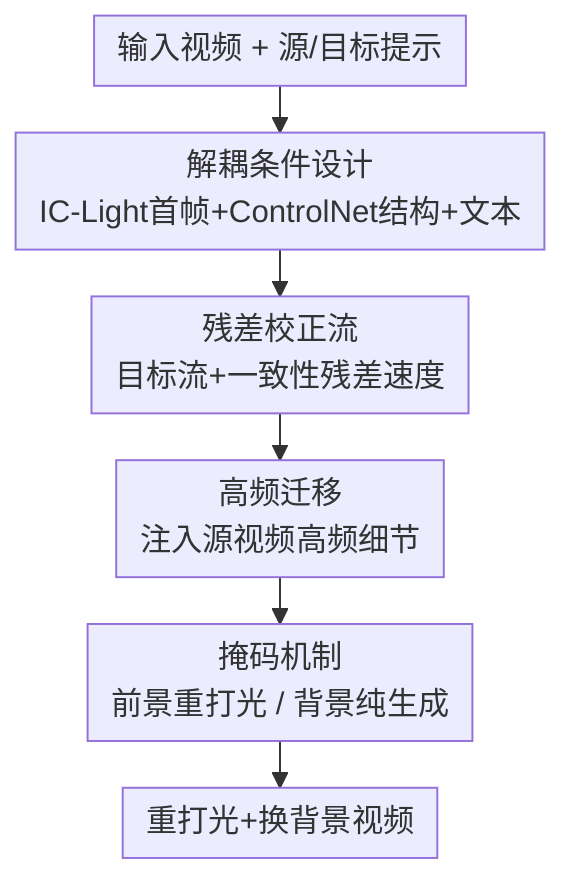

# FlowPortal: Residual-Corrected Flow for Training-Free Video Relighting and Background Replacement

**会议**: CVPR 2026  
**论文**: [CVF Open Access](https://openaccess.thecvf.com/content/CVPR2026/html/Gao_FlowPortal_Residual-Corrected_Flow_for_Training-Free_Video_Relighting_and_Background_Replacement_CVPR_2026_paper.html)  
**代码**: [项目页](https://gaowenshuo.github.io/FlowPortalProject/)（仅 project page，未见开源仓库）  
**领域**: 视频生成 / 扩散模型  
**关键词**: 视频重打光, 背景替换, 训练无关, Flow 编辑, 残差校正

## 一句话总结
FlowPortal 不训练任何模型，靠一套"残差校正流（Residual-Corrected Flow）"把现成的视频扩散 flow 模型改造成编辑模型：当源/目标条件相同时强制完美重建、不同时只沿光照方向变，再叠加解耦条件、高频迁移和前景掩码三招，在 3–5 分钟内完成时序连贯、结构保真、光照自然的视频重打光与背景替换。

## 研究背景与动机
**领域现状**：视频重打光+背景替换是影视/虚拟拍摄的刚需。主流分两条路——训练式方法（RelightVid、Lumen、TC-Light 等）构造成对视频数据集、训练光照条件扩散模型；训练无关方法（AnyPortal、Light-A-Video）把现成的图像重打光模型 IC-Light 和视频扩散模型在推理时拼起来。

**现有痛点**：训练式方法要采集大规模成对"同场景不同光照"视频，成本极高，且训出来的模型在光照丰富度和前景保真度之间难以兼顾，往往光照变化寡淡、复杂条件下细节崩。训练无关方法则因为 IC-Light 是**逐帧**重打光，帧间天然不连续，视频模型补不回来，叠加条件控制弱，导致输入输出视频结构/运动错位，而且 pipeline 臃肿、单视频要 20–30 分钟。

**核心矛盾**：时序一致性、空间保真、光照自然、效率这四个目标互相打架——逐帧处理保了光照质量却毁了时序；整体处理保了时序又难以精确控光。作者认为根因是**缺一个能系统地拆解并独立控制视频三要素（结构、运动、光照）的统一框架**。

**本文目标**：在不训练的前提下，做到改光照时"只改光照、其余全保"，且条件不变时能原样复现输入视频。

**切入角度**：作者提出一个朴素却关键的原则——**条件一致性（Condition Consistency）**：输出的每一处变化都应当且仅当由输入条件的变化驱动。它有两条推论——① 方向性变化（Directional Change）：条件只在光照上不同，输出就只在光照上不同；② 恒等稳定性（Stability under Identity）：源=目标条件时，输出必须逐像素等于输入。现成 flow 模型在合成视频间能满足恒等稳定性，但作用到**真实输入视频**时，因模型能力有限和源条件信息不足，重建出的 $z_0^{\text{src}}$ 不等于真实 $z_0$，恒等稳定性被打破。

**核心 idea**：与其重新训练，不如在推理时构造一条"残差速度"把模型预测流硬掰回真实输入的重建轨迹，从而把生成模型"改写"成满足条件一致性的编辑模型——这就是 Residual-Corrected Flow。

## 方法详解

### 整体框架
FlowPortal 基于一个预训练的 I2V flow 视频扩散模型（实现用 Wan2.1），输入是一段真实视频 + 源/目标文本提示，输出是按目标光照重打光、并可换背景的视频。整条流水线是训练无关的纯推理：先用 IC-Light 把首帧按目标光照编辑好作为视觉锚点、用 ControlNet 抽结构条件、用 BiRefNet+MatAnyone 抽前景掩码（**解耦条件设计**给模型喂稳定的方向性指引）；再用**残差校正流**把"目标条件流"和一条把源重建拉回真实输入的"一致性残差速度"相加，得到既保结构又沿光照方向变的编辑流；生成每一步再做**高频迁移**注入源视频细节；最后用**掩码机制**把前景重打光和背景纯生成隔开。flow 模型本身一个参数都不动。

### 关键设计

**1. 残差校正流：把生成流硬掰回真实输入的重建轨迹**

这是全文核心，直击"作用到真实视频时恒等稳定性被打破"的痛点。先回顾 flow 模型：latent $z_t$ 在 $t\in[0,1]$ 间演化，$t=1$ 是噪声 $z_1\sim\mathcal{N}(0,I)$、$t=0$ 是干净数据，模型预测速度场 $V_t^c(z_t)=F_\theta(z_t,t,c)$ 并按 ODE $\frac{dz_t}{dt}=V_t^c(z_t)$ 离散迭代去噪。朴素编辑流（Naive Edit Flow）共用一个固定噪声 $\epsilon$，分别在源条件、目标条件下去噪得到 $z_0^{\text{src}}$、$z_0^{\text{tar}}$；合成视频间因共享 $\epsilon$，源=目标时确实 $z_0^{\text{tar}}=z_0^{\text{src}}$，满足恒等稳定性。但真实输入 $z_0$ 和模型重建的 $z_0^{\text{src}}$ 对不上，于是即便目标=源，输出也 $\neq z_0$。

作者的解法是同时校正 $z_0^{\text{src}}$ 和 $z_0^{\text{tar}}$，把前者拉到等于真实 $z_0$。先定义从 $\epsilon$ 直接复原到 $z_0$ 的理想速度

$$V_0=\frac{z_0-\epsilon}{1-0},\qquad z_t=(1-t)z_0+t\epsilon$$

由于模型实际预测的 $V_t^{\text{src}}(z_t)\neq V_0$，构造**一致性残差速度**补足差额：

$$V_t^{\text{res}}(z_t)=V_0-V_t^{\text{src}}(z_t)$$

这样 $V_t^{\text{src}}+V_t^{\text{res}}=V_0$，沿此组合流去噪就能从 $\epsilon$ 精确重建 $z_0$。最终的残差校正流把这条残差叠到目标条件流上：

$$V_t^{\text{edit}}(z_t^{\text{edit}})=V_t^{\text{tar}}(z_t^{\text{edit}})+V_t^{\text{res}}(z_t)$$

从同一 $\epsilon$ 出发按 $V_t^{\text{edit}}$ 去噪得到重打光结果 $z_0^{\text{edit}}$。可证目标=源时 $V_t^{\text{edit}}=V_0$、$z_0^{\text{tar}}=z_0$，恒等稳定性被严格满足，而光照差异则通过 $V_t^{\text{tar}}$ 体现为方向性变化。它还**整体处理整段视频**而非逐帧，从根上保住时序连贯；更妙的是 $V_t^{\text{res}}$ 只依赖固定噪声和源条件、跨步稳定，因而可以**每 $r$ 步复用一次**，把总步数从 $2T$ 降到 $(1+1/r)T$，几乎不掉质量（论文取 $T{=}50$、$r{=}10$，共 55 步）。

**2. 解耦条件设计：用光照特异/无关条件分离"改什么"和"保什么"**

光有残差校正还不够"听话"，需要强化方向性变化——告诉模型该在哪里、改什么。作者把条件拆成三路，区分**光照特异**和**光照无关**信号：① 参考帧条件——用 I2V 模型，源条件取输入首帧，目标条件取 IC-Light 按目标光照编辑后的首帧，作为同时锚定光照自然度和空间保真的视觉锚点；② 结构条件——对输入视频抽深度图+边缘图（HED/depth/Canny 加权融合）喂 ControlNet，源/目标共享，是**光照无关**的结构骨架，保证编辑时结构不变；③ 文本条件——源/目标提示只在背景和光照描述上不同、前景内容描述相同，是**光照特异**的方向信号。这种"结构共享 + 光照分离"的解耦，给模型一个稳定、充分、有方向的指引，从工程上把条件一致性钉死。

**3. 高频迁移：把源视频的细节按频段搬进目标生成**

残差校正保住了大结构，但纹理级细节（皮肤纹路、反光等）仍可能在重打光中丢失。作者用傅里叶分解把视频拆成高频 $\text{HF}(X)$ 和低频 $\text{LF}(X)$（$X=\text{HF}(X)+\text{LF}(X)$），在目标视频每一步生成时做替换：

$$z_t^{\text{edit}}\gets \text{LF}(z_t^{\text{edit}})+\lambda\cdot\text{HF}(z_t)+(1-\lambda)\cdot\text{HF}(z_t^{\text{edit}})$$

其中 $z_t$ 是源视频在该步的状态，$\lambda$ 控制注入比例（论文取 $0.5$，阈值 $0.8$）：$\lambda$ 大则细节保真强但难充分适配新光照，小则重打光更灵活但结构纹理一致性下降。关键是重建 $z_0$ 时从 $z_t$ 往 $z_t$ 自身搬高频不改变自身，所以高频迁移**不破坏恒等稳定性**，和残差校正流逻辑自洽。

**4. 掩码机制：前景重打光、背景纯生成两不干扰**

残差校正流和高频迁移都会把源视频的背景细节带进结果，而换背景恰恰要丢掉旧背景。作者用从原视频提取的前景掩码 $M$ 把两者隔开——残差速度和高频迁移都只作用在前景：

$$V_t^{\text{edit}}=V_t^{\text{tar}}(z_t^{\text{edit}})+M\cdot V_t^{\text{res}}(z_t)$$
$$z_t^{\text{edit}}\gets \text{LF}(z_t^{\text{edit}})+\lambda M\cdot\text{HF}(z_t)+(1-\lambda M)\cdot\text{HF}(z_t^{\text{edit}})$$

结构条件也只对前景施加、背景留空让模型自由生成。这等于**有意让背景区域违反恒等稳定性**，换取换背景的灵活度——前景细节被精确保留，背景则不受源视频干扰地纯生成。掩码由 BiRefNet 抽首帧、MatAnyone 传播全视频，下采样到 latent 尺寸。

> 与 FlowEdit 的关系：作者指出本方法 inversion-free，部分受图像编辑方法 FlowEdit 启发，但有两点关键差异——① FlowEdit 每步采样 $n$ 个不同高斯噪声并平均，导致背景模糊；本方法全程用单一固定 $\epsilon$，避免模糊；② FlowEdit 从源视频 $z_1^{\text{edit}}=z_0$ 出发，无法在指定区域纯生成、旧背景会干扰新背景；本方法从纯噪声 $\epsilon$ 出发，天然支持前景掩码编辑+背景纯生成。固定噪声还让残差速度可复用，FlowEdit 因每步换随机噪声而不可复用。⚠️ FlowEdit 公式细节以原文为准。

## 实验关键数据

实现基于 Wan2.1，单张 80GB A100，测试集为 69 对真实视频+重打光提示（54 人物、8 动物、7 其他物体），仅与支持背景替换的方法比较。

### 主实验

| 方法 | 训练无关 | CLIP-T↑ | CLIP-I↑ | 结构一致↑ | 运动一致↑ | 细节一致↑ | 身份一致↑ |
|------|:---:|------|------|------|------|------|------|
| AnyPortal | √ | 0.3196 | 0.9817 | 0.8530 | 0.8876 | 40.49 | 0.4310 |
| Light-A-Video (A) | √ | 0.2956 | 0.9684 | 0.8580 | 0.8869 | 40.87 | 0.5076 |
| Lumen（训练式） | × | 0.3055 | 0.9746 | **0.8809** | 0.8914 | 40.42 | **0.7392** |
| **FlowPortal（本文）** | √ | **0.3271** | **0.9828** | 0.8804 | **0.8944** | **41.20** | 0.7328 |

FlowPortal 在视频-文本对齐（CLIP-T）、时序平滑（CLIP-I）、运动一致、细节一致上均最佳。训练式 Lumen 在结构/身份一致上略高，但作者指出那是因为 Lumen **几乎没改前景光照**（光照变化寡淡）才"被动保真"；FlowPortal 一致性仅微弱落后却带来显著光照调整，恰说明其条件一致性强。

用户研究（24 人，四项偏好）FlowPortal 全面碾压——四项偏好得分均 >52，远超第二名 Lumen 的 22–35：

| 方法 | User-Pmt | User-Tmp | User-Fg | User-Lit |
|------|------|------|------|------|
| AnyPortal | 15.3 | 9.9 | 8.9 | 12.1 |
| Light-A-Video (A) | 4.7 | 3.7 | 3.4 | 9.4 |
| Lumen | 22.7 | 28.1 | 35.5 | 24.4 |
| **FlowPortal** | **57.4** | **58.4** | **52.2** | **54.2** |

效率上，AnyPortal/Light-A-Video 因 pipeline 臃肿单视频要 20–30 分钟，FlowPortal 只需 **3–5 分钟**，约等于单个视频扩散模型的直接推理时间。

### 消融实验

| 配置 | CLIP-T | CLIP-I | 结构一致 | 运动一致 | 细节一致 | 身份一致 |
|------|------|------|------|------|------|------|
| w/o 掩码 | 0.2809 | 0.9792 | 0.8649 | 0.8923 | 40.44 | 0.7123 |
| w/o 残差校正流 | 0.3310 | 0.9825 | 0.8516 | 0.8933 | 38.50 | 0.4153 |
| w/o 高频迁移 | 0.3290 | 0.9798 | 0.8688 | 0.8882 | 40.49 | 0.5527 |
| Full | 0.3271 | 0.9828 | **0.8804** | **0.8944** | **41.20** | **0.7328** |

### 关键发现
- **残差校正流是结构/身份保真的命门**：去掉它（改用直接推理）身份一致从 0.7328 暴跌到 0.4153、细节一致从 41.20 掉到 38.50，结构严重不连贯——这是四个设计里掉点最狠的。注意去残差后 CLIP-T 反而最高（0.3310），但那是以牺牲一致性为代价的"放飞"，不可取。
- **掩码缺失直接毁掉换背景**：w/o 掩码时背景被源视频结构干扰、保持不变，CLIP-T 跌到 0.2809（提示相关性最差），说明背景纯生成必须靠掩码隔离。
- **高频迁移补纹理细节**：去掉它身份一致从 0.7328 降到 0.5527、细节一致也降，纹理级细节保不住。
- **残差速度可复用**：每 $r{=}10$ 步复用一次残差速度，把步数从 $2T$ 降到约 $1.1T$，质量几乎无损——这是 3–5 分钟高效率的关键来源。
- **解耦条件的逐项作用**：仅文本条件时前景人物重建失败；加结构条件能保住人物结构但光照仍不行；三路齐全才稳定。

## 亮点与洞察
- **把"编辑"重新表述成"满足恒等稳定性的生成"**：不引入 inversion、不训练，仅用一条解析的残差速度 $V_t^{\text{res}}=V_0-V_t^{\text{src}}$ 就把通用 flow 生成模型变成可控编辑模型——这个改写干净且可证明，是最"啊哈"的地方。
- **残差速度可复用带来的加速近乎免费**：因为 $V_t^{\text{res}}$ 只依赖固定噪声和源条件、跨步稳定，复用它直接砍一半计算，这是固定单噪声设计（相对 FlowEdit 多噪声平均）顺带换来的红利。
- **"故意违反恒等稳定性"的掩码思路可迁移**：通过 $M$ 让背景区域不必满足重建约束，把"保前景"和"换背景"这对矛盾用一个掩码干净拆开——这套"区域性放宽一致性约束"的做法可推广到任何"局部保真+局部生成"的视频编辑任务。
- **条件一致性是个好用的设计准则**：把抽象的"编辑该满足什么"形式化成方向性变化+恒等稳定性两条，几乎每个模块都用它来检验自洽（高频迁移为何不破坏稳定性、掩码为何允许违反），让整套设计逻辑紧凑。

## 局限与展望
- **强依赖外部组件**：首帧锚点完全依赖 IC-Light 的图像重打光质量，掩码依赖 BiRefNet/MatAnyone 的分割与传播质量——任一环节失败（如复杂遮挡、快速运动下掩码漂移）都会传导到结果，论文未充分讨论。
- **一致性指标的双刃**：作者自己点破 Lumen 因"几乎不改光照"而拿到高一致性分，反过来说明结构/身份一致性指标本身无法区分"真保真"和"没怎么编辑"，⚠️ 该评测协议（尤其自定义的前景一致性四项）需结合用户研究才能可信判读。
- **首帧驱动可能限制大幅光照渐变**：以编辑后首帧为视觉锚点，对"光照随时间剧烈变化"（如日落、闪烁）的场景能否贴合，论文未给针对性实验。
- **测试规模偏小**：69 对视频、用户研究 23–24 人，结论的统计稳健性有限。
- **改进方向**：把 $\lambda$、$r$ 做成自适应（按内容/光照强度动态调），或把首帧锚点扩成多关键帧锚点以支持时变光照。

## 相关工作与启发
- **vs IC-Light（图像重打光 SOTA）**：IC-Light 是图像级、逐帧用会引入帧间不连续；本文把它仅用于生成目标首帧锚点，重打光交给整段视频的残差校正流，从根上避免逐帧闪烁。
- **vs AnyPortal / Light-A-Video（训练无关）**：它们都把 IC-Light 逐帧重打光再塞进视频模型修一致性，pipeline 臃肿（20–30 分钟）且控制弱；本文整体处理、条件解耦，3–5 分钟且一致性更好。
- **vs Lumen / TC-Light（训练式）**：它们要成对数据集+训练，光照丰富度与保真难兼顾；本文零训练却在光照调整幅度上更激进、用户偏好全面领先。
- **vs FlowEdit（图像编辑）**：本文受其 inversion-free 思路启发，但用单一固定噪声替代多噪声平均（避免背景模糊+使残差可复用），并从纯噪声而非源图出发（支持区域纯生成），把图像编辑方法成功迁移到视频重打光这一更难的时序场景。

## 评分
- 新颖性: ⭐⭐⭐⭐⭐ 用一条可证明的残差速度把通用 flow 生成模型零训练改写成满足条件一致性的编辑模型，思路干净且原创。
- 实验充分度: ⭐⭐⭐⭐ 主实验+消融+用户研究+效率齐全，但测试集 69 对、用户 23–24 人规模偏小，部分一致性指标判读需谨慎。
- 写作质量: ⭐⭐⭐⭐⭐ 从条件一致性原则一路推导到四个模块，逻辑链紧凑，公式与动机咬合得很好。
- 价值: ⭐⭐⭐⭐⭐ 训练无关 + 3–5 分钟 + 支持换背景，对影视/创意媒体落地价值高，残差校正与区域性放宽一致性的思路可迁移到更多视频编辑任务。

<!-- RELATED:START -->

## 相关论文

- [\[CVPR 2026\] RFDM: Residual Flow Diffusion Models for Video Editing](rfdm_residual_flow_diffusion_models_for_video_editing.md)
- [\[CVPR 2026\] FlowDirector: Training-Free Flow Steering for Precise Text-to-Video Editing](flowdirector_training-free_flow_steering_for_precise_text-to-video_editing.md)
- [\[CVPR 2026\] FlowMotion: Training-Free Flow Guidance for Video Motion Transfer](flowmotion_training-free_flow_guidance_for_video_motion_transfer.md)
- [\[CVPR 2026\] Training-free Motion Factorization for Compositional Video Generation](training-free_motion_factorization_for_compositional_video_generation.md)
- [\[CVPR 2026\] SwitchCraft: Training-Free Multi-Event Video Generation with Attention Controls](switchcraft_training-free_multi-event_video_generation_with_attention_controls.md)

<!-- RELATED:END -->
