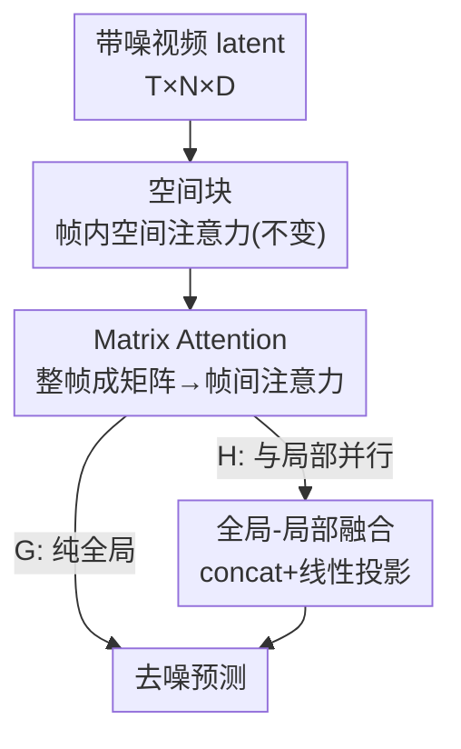

# FrameDiT: Diffusion Transformer with Matrix Attention for Efficient Video Generation

**会议**: CVPR 2026  
**arXiv**: [2603.09721](https://arxiv.org/abs/2603.09721)  
**代码**: 无（论文未公开）  
**领域**: 视频生成 / 扩散模型  
**关键词**: 视频扩散、DiT、时序注意力、Matrix Attention、帧级建模

## 一句话总结
针对视频 DiT 在"昂贵但强的 Full 3D 注意力"与"高效但只看同位置 token 的 Local Factorized 注意力"之间的两难，本文提出 **Matrix Attention**——把整帧当作一个矩阵、用矩阵运算生成 Q/K/V 并在帧之间做注意力，从而以接近因子化注意力的开销获得全局时空建模能力；其混合版 FrameDiT-H 在 UCF-101/Taichi/FaceForensics 等多个基准上取得 SOTA 的 FVD/FVMD。

## 研究背景与动机
**领域现状**：当前主流视频扩散模型基本都建立在 Diffusion Transformer（DiT）之上，把视频展开成时空 token 序列再用注意力建模。注意力大致分两类：Full 3D Attention（把 $T\times N$ 个时空 token 一起做联合注意力）和 Local Factorized Attention（先在帧内做空间注意力，再对每个空间位置跨帧做时序注意力）。

**现有痛点**：这两类各有硬伤。Full 3D 表达力强，但复杂度是 $O(T^2 N^2)$，对高分辨率或长视频几乎不可承受；Local Factorized 把复杂度降到 $O(T^2 N + T N^2)$，但它的时序注意力只连接**相同空间位置**的 token——一旦物体发生大位移、在帧间不再对齐，这种"同位置连线"就失效，导致难以保持物体级一致性。

**核心矛盾**：表达力与计算效率之间存在直接 trade-off。Full 3D 用平方级开销换取全局时空联系；Factorized 用"假设运动对齐"的强先验换取效率，但这个假设在真实大运动场景里站不住。

**本文目标**：能否设计一个 DiT，既像 Full 3D 一样能捕捉全局时序一致性，又像 Factorized 一样高效？

**切入角度**：作者跳出"在 token 粒度上做时序注意力"的惯性，观察到时序关系其实可以在**帧粒度**上建立——不必逐个 token 配对，而是把整帧压缩成一个紧凑的矩阵表示，再让帧与帧之间互相注意。这样既绕开了 $O(T^2N^2)$ 的 token 级配对，又不再受"同位置才能连线"的约束。

**核心 idea**：用"帧级矩阵注意力"代替"token 级时序注意力"——把每帧视作矩阵、经矩阵原生运算得到 Q/K/V，在帧之间用 Frobenius 内积算相似度并加权聚合，从而同时拿到全局时空结构与低开销。

## 方法详解

### 整体框架
FrameDiT 沿用 DiT 中"空间块与时序块交错堆叠"的结构，输入是带噪的视频 latent $z\in\mathbb{R}^{T\times N\times D}$（$T$ 帧、每帧 $N$ 个 token、维度 $D$），输出是去噪预测。**空间块保持不变**，关键改动全在时序块：把原来逐 token 的局部时序注意力换成（或补上）本文的 Matrix Attention。作者给出两个变体：FrameDiT-G 只用 Matrix Attention（纯全局），FrameDiT-H 让局部时序注意力与 Matrix Attention 并行再融合（全局+局部）。

### 关键设计

**1. Matrix Attention：把整帧当矩阵、在帧之间做注意力**

这是全文的核心，直接针对"Local Factorized 只能连同位置 token、大运动下失效"的痛点。做法是把第 $t$ 帧 $z^t\in\mathbb{R}^{N\times D}$ 看成一个矩阵（行是 token、列是嵌入维度），用**矩阵原生运算**同时在行、列两个方向上做线性变换得到查询/键/值：

$$q^t = U_q^\top z^t W_q + B_q,\quad k^t = U_k^\top z^t W_k + B_k,\quad v^t = U_v^\top z^t W_v + B_v$$

其中 $U_\ast\in\mathbb{R}^{N\times N_\ast}$ 是**行权重矩阵**（把 $N$ 个空间 token 压缩/合成成 $N_{qk}$ 或 $N_v$ 个"帧级行"），$W_\ast\in\mathbb{R}^{D\times D_\ast}$ 是列权重矩阵。这样 $q^t,k^t$ 的每一行都融合了该帧**全部** token 的信息，是帧级别的紧凑表示。帧与帧之间的相似度用缩放 Frobenius 内积算成一个 $T\times T$ 矩阵：

$$S^{t,t'} = \frac{\langle q^t, k^{t'}\rangle_{\text{F}}}{\sqrt{N_{qk} D_{qk}}}$$

最后 $u=\text{Softmax}(S)\cdot v$。注意这里注意力是在 $T$ 帧之间做的，相似度矩阵只有 $T\times T$，彻底摆脱了"$N\times N$ 的 token 级配对"。它之所以有效，是因为帧级矩阵表示本身就编码了全帧的空间内容，因此"哪两帧相关"不再依赖物体是否停在同一空间位置——大运动、物体跨位置移动都能被捕捉。多头版本则把 $q,k,v$ 沿行（$m$ 份）和列（$n$ 份）切分，对每个分块 $(i,j)$ 独立做 Matrix Attention 再拼回，进一步增强表达力。

**2. FrameDiT-H 全局-局部混合：用并行双分支补回细粒度运动**

纯全局的 FrameDiT-G 擅长大运动和物体级一致性，但实验显示它在 UCF-101、Sky-Timelapse 上仍落后——只靠帧级全局注意力不足以刻画像素级的细微运动。痛点是"全局表示天然会丢掉局部细节"。FrameDiT-H 的做法是开两条**并行**时序分支：一条是传统的 spatially local 时序注意力（管细粒度运动与局部一致性），一条是 Matrix Attention（管帧级全局信息与远距离物体一致性），两路输出拼接后过线性层融合：

$$e = \text{MLP}\big(\text{concat}(e_{\text{local}}, e_{\text{global}})\big)$$

这样在几乎不增加复杂度的前提下兼顾两个尺度。复杂度上，FrameDiT-G 是 $O(TN^2 + T^2 N_{qk})$，FrameDiT-H 再加上局部时序项变成 $O(TN^2 + T^2 N + T^2 N_{qk})$；当 $N_{qk}\ll N$ 时 $T^2 N_{qk}$ 可忽略，于是 FrameDiT-H 的开销几乎和 Local Factorized 持平——这正是"全局表达力 + 因子化效率"两全的来源。

**3. 行权重矩阵 $U$ 作为可学习的有损压缩器**

$U$ 把 $N$ 个空间 token 合成成 $N_{qk}$（或 $N_v$）个帧级行，本质是一个**可调的有损压缩**旋钮：$N_{qk}$ 越小压缩越狠、GFLOPs 越低。消融显示即便把 64 个 token 压成 1 行（$N_{qk}=1$）模型仍能稳定生成、FVD 仅退化到 72.16，说明 $U$ 能滤掉帧内冗余空间信息而保留足够的时序判别信息；增大 $N_{qk}$ 又能近乎线性地提质而 GFLOPs 增加极少，给出灵活的质量-成本权衡。此外对 $U$ 做归一化很关键——softmax 归一化让合成的帧表示落在原嵌入流形内、时序注意力更稳定，效果优于不归一化或 $\ell_1/\ell_2$ 归一化。

### 损失函数 / 训练策略
训练目标沿用标准扩散噪声匹配损失 $\mathcal{L}_{\text{NM}}(\theta)=\mathbb{E}_{x,k,\epsilon}[\lVert\epsilon_\theta(x_k,k)-\epsilon\rVert^2]$。优化用 AdamW、学习率 $1e{-}4$，配合 EMA（衰减 0.999）、梯度裁剪与噪声裁剪。把 Matrix Attention 接入已有预训练 DiT（如 Latte）时，作者发现**用 softmax 门控融合会失败**：初始化让预训练局部分支权重 $\approx0.97$、Matrix 分支 $\approx0.03$，结果被抑制分支梯度极小、几乎学不动；改用 concat + 线性层（Kaiming 初始化、bias 置零）后梯度流更均衡、训练稳定且持续提质。此外若**完全移除**预训练局部时序注意力只留 Matrix Attention，生成结果会退化成"一串独立图片"而非连贯视频——预训练局部分支编码了难以重学的运动先验，这也反过来印证了混合设计的必要性。

## 实验关键数据

### 主实验
256×256 分辨率、16 帧无条件视频生成，指标为 FVD（越低越好）。`*` 表示用官方 checkpoint 复现的 AR-Diffusion 结果（原文报告值被作者发现异常偏好）。

| 模型 | 注意力类型 | UCF101 | Sky | Taichi-HD | Face |
|------|-----------|--------|-----|-----------|------|
| StyleGAN-V | GAN | 1431.0 | 79.5 | 143.5 | 47.4 |
| Latte | Local Factorized | 202.2 | 42.7 | 97.1 | 27.1 |
| AR-Diffusion | 因果 Full 3D | 186.6 | 40.8 | 66.3 | 71.9 |
| AR-Diffusion* | 因果 Full 3D | 181.9 | 40.2 | 100.9 | 84.0 |
| **FrameDiT-G** | Matrix（全局） | 201.6 | 40.6 | 96.8 | 21.5 |
| **FrameDiT-H** | Matrix（全局+局部） | **170.1** | **39.5** | **95.5** | **16.6** |

FrameDiT-G 在所有数据集上稳定超过同为因子化的 Latte；FrameDiT-H 进一步全面登顶，在 UCF101 上比 AR-Diffusion 提升约 9%、在 FaceForensics 上比 Latte 提升约 39%。

文本生成视频（VBench）上，FrameDiT-H（在冻结的 1B Latte 上加 314M Matrix Attention 模块、仅训新模块）相比 Latte 在 Quality Score（81.69 vs 79.72）、Subject Consistency（95.10 vs 88.88）、Dynamic Degree（70.83 vs 68.89）等关键维度全面提升，Quality 已逼近 Full 3D 的 LTX-Video（82.30）。

### 消融实验
均在 16 帧 128×128 Taichi-HD 上进行。

行权重矩阵 $U$ 的归一化方式（FrameDiT-G）：

| $U$ 归一化 | FVD↓ | FVMD↓ | FID↓ |
|-----------|------|-------|------|
| 不归一化 | 70.31 | 990.00 | 14.44 |
| **Softmax** | **66.15** | **943.32** | 13.45 |
| $\ell_1$ | 66.79 | 987.43 | 13.83 |
| $\ell_2$ | 67.13 | 984.72 | 13.44 |

行维度 $N_{qk}$ 的影响（$N=64$）：

| $N_{qk}$ | GFLOPs | FVD↓ | FVMD↓ | FID↓ |
|----------|--------|------|-------|------|
| 1 | 341.60 | 72.16 | 1042.76 | 14.47 |
| 8 | 344.62 | 69.41 | 1000.23 | 14.45 |
| 32 | 354.96 | 67.40 | 959.91 | 14.01 |
| 64 | 368.75 | 66.15 | 943.32 | 13.45 |

### 关键发现
- **$N_{qk}$ 越大质量越好、代价极小**：从 1 增到 64，FVD 由 72.16 降到 66.15、FVMD 由 1042.76 降到 943.32，而 GFLOPs 只从 341.60 涨到 368.75（约 +8%）；说明 Matrix Attention 提供了高性价比的"质量旋钮"。同时 FID 几乎不变，印证了空间注意力未动、帧级压缩只影响时序而非单帧质量。
- **极限压缩仍稳定**：$N_{qk}=1$（整帧压成一行）模型仍能生成合理视频，说明 $U$ 是有效的有损压缩器，帧内大量空间信息对时序建模是冗余的。
- **长视频可扩展性**：从 16 帧扩到 128 帧，Full 3D 的 FLOPs/延迟/显存陡增到几乎不可用，而 FrameDiT-G/H 的延迟与显存贴近 Local Factorized，却保持与 Full 3D 相当甚至更优的 FVD。
- **门控方式决定成败**：接入预训练模型时 softmax 门控会让新分支梯度饿死、学不动；concat+线性层才能稳定收敛。

## 亮点与洞察
- **从 token 粒度跳到帧粒度**是最关键的"啊哈"：把整帧压成矩阵后，时序注意力的相似度矩阵从 $N\times N$（甚至 $TN\times TN$）缩成 $T\times T$，既绕开了 Full 3D 的平方爆炸，又因为帧级表示自带全帧内容而摆脱了"同位置才能连线"的桎梏——一个换粒度的动作同时解了两个老问题。
- **Frobenius 内积衡量帧间相似度**很巧妙：它把"两个矩阵有多像"自然量化成一个标量，等于把"两帧整体有多相关"做成可微分的注意力打分，避免了逐 token 对齐。
- **$U$ 当压缩旋钮**给出干净的质量-成本曲线，这种"用一个低秩投影矩阵控制时序 token 数"的思路可迁移到其他需要压缩长序列的时序建模任务（如长视频理解、音频）。
- **混合分支 + concat 门控的工程教训**很有参考价值：在已有强先验的预训练模型上加新模块时，softmax 门控会因梯度被压制而让新分支学不起来，改 concat 是个简单有效的解法。

## 局限与展望
- 作者承认 $U$ 的设计与参数化仍有探索空间，未来计划深入研究行权重矩阵以增强时序表示。
- FrameDiT-H 相比纯局部/纯全局引入了额外分支与参数（如 T2V 设置加了 314M 参数），融合方式（concat vs 门控）也需要小心调试，否则训练不稳定。
- 主对比多在 16 帧、UCF/Taichi/Sky/Face 等相对受限的数据集上；与 Wan 2.1 等大规模、精心策划数据训练的 Full 3D 模型在 VBench 总分上仍有差距（84.26 vs 79.12），作者归因于数据规模而非机制，但这一论断缺乏控制变量的直接验证 ⚠️。
- Matrix Attention 把整帧压缩进少量"帧级行"，理论上可能在需要精确局部细节的场景丢信息——这也是为什么纯 FrameDiT-G 不如混合版、需要局部分支补回。

## 相关工作与启发
- **vs Full 3D Attention（如 LTX-Video、Wan 2.1、AR-Diffusion）**: 它们把视频当 $T\times N$ token 做联合注意力，表达力强但 $O(T^2N^2)$ 开销随帧数/分辨率平方增长。本文用帧级 Matrix Attention 把时序相似度降到 $T\times T$，在长视频上延迟/显存远低于 Full 3D，质量却相当或更好。
- **vs Local Factorized Attention（如 Latte、OpenSora、Lavie）**: 它们的时序注意力只连同位置 token，假设运动对齐、大运动下物体级一致性差。本文的帧级注意力不依赖空间对齐，FrameDiT-G 在同等效率下全面超过 Latte，混合版进一步登顶。
- **vs 稀疏/线性注意力的提效路线**: 稀疏注意力靠局部窗口、常依赖预训练 Full 3D 且牺牲全局上下文；线性注意力降复杂度但表达力或训练管线受限。本文走的是"换建模粒度"的第三条路，原生具备全局视野又保持低开销。

## 评分
- 新颖性: ⭐⭐⭐⭐⭐ 把时序注意力从 token 粒度搬到帧粒度、用矩阵原生运算生成 Q/K/V，是对视频 DiT 注意力范式的本质重构。
- 实验充分度: ⭐⭐⭐⭐ 覆盖无条件/T2V、4 个数据集 + VBench、长视频扩展与模型尺度消融较全，但 $U$ 的设计消融和与最强 Full 3D 的同数据对照仍可更充分。
- 写作质量: ⭐⭐⭐⭐ 动机与 trade-off 阐述清晰、公式完整，Table 1 的属性对比直观；个别表述有小瑕疵。
- 价值: ⭐⭐⭐⭐⭐ 给视频扩散提供了一条"全局表达力 + 因子化效率"的实用路线，且可作为模块插进现有预训练 DiT，落地性强。

<!-- RELATED:START -->

## 相关论文

- [\[CVPR 2026\] Attention Surgery: An Efficient Recipe to Linearize Your Video Diffusion Transformer](attention_surgery_an_efficient_recipe_to_linearize_your_video_diffusion_transfor.md)
- [\[CVPR 2026\] VMonarch: Efficient Video Diffusion Transformers with Structured Attention](vmonarch_efficient_video_diffusion_transformers_with_structured_attention.md)
- [\[CVPR 2026\] RAPID: Reusing Attention Sparsity with Inter-step Adaptation for Efficient Video Diffusion](rapid_reusing_attention_sparsity_with_inter-step_adaptation_for_efficient_video_.md)
- [\[CVPR 2026\] Efficient Long-Context Modeling in Diffusion Language Models via Block Approximate Sparse Attention](efficient_long-context_modeling_in_diffusion_language_models_via_block_approxima.md)
- [\[CVPR 2026\] LinVideo: A Post-Training Framework towards O(n) Attention in Efficient Video Generation](linvideo_a_post-training_framework_towards_on_attention_in_efficient_video_gener.md)

<!-- RELATED:END -->
