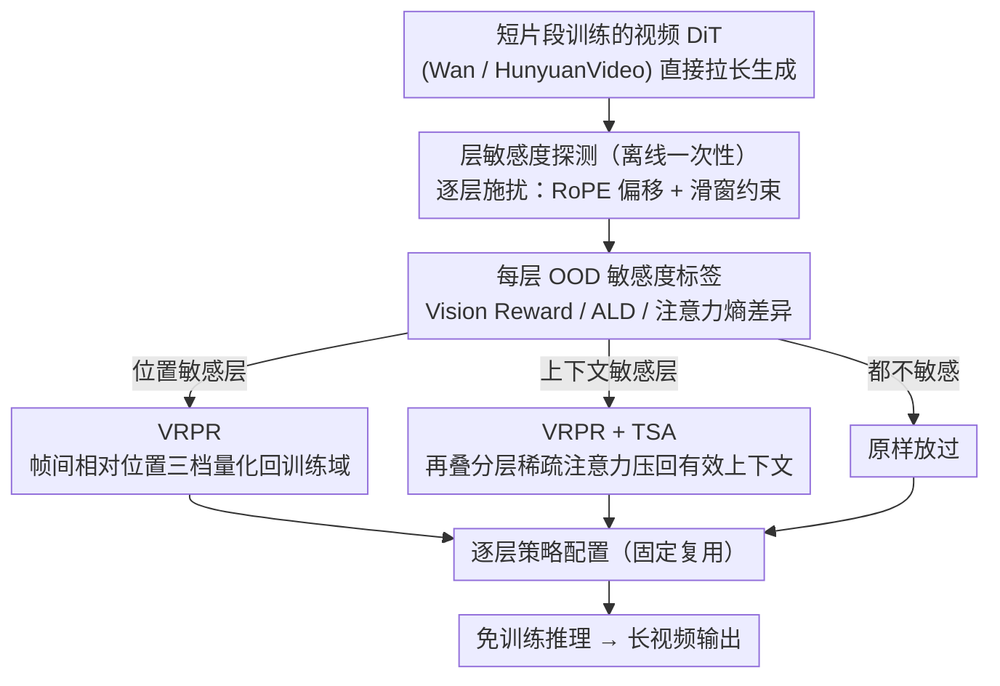

# Free-Lunch Long Video Generation via Layer-Adaptive O.O.D Correction

**会议**: CVPR 2026  
**arXiv**: [2603.25209](https://arxiv.org/abs/2603.25209)  
**代码**: [https://github.com/Westlake-AGI-Lab/FreeLOC](https://github.com/Westlake-AGI-Lab/FreeLOC)  
**领域**: 视频生成 / 扩散模型  
**关键词**: 长视频生成, 免训练, 位置编码外推, 稀疏注意力, 层自适应

## 一句话总结
FreeLOC 提出一种免训练的层自适应框架，通过识别视频DiT中各层对"帧级相对位置OOD"和"上下文长度OOD"两种分布外问题的敏感度差异，选择性地在敏感层应用多粒度位置重编码(VRPR)和分层稀疏注意力(TSA)，在不增加训练成本的情况下实现SOTA的长视频生成质量。

## 研究背景与动机

1. **领域现状**：视频扩散模型(如Wan、HunyuanVideo)能生成高质量短视频，但通常只在短片段(约5秒)上训练。直接用于生成更长视频会导致质量严重下降。
2. **现有痛点**：训练式自回归方法计算昂贵且难以匹配原生短视频质量。已有免训练方法分为两类：滑动窗口方法(如FreeNoise)能维护局部一致性但无法捕获远距帧间依赖；全局操作方法(如FreeLong)通过操纵潜变量改善质量但仍有伪影(身份漂移、光照不一致)。且大多方法基于UNet架构，与SOTA的DiT模型不兼容。
3. **核心矛盾**：长视频生成面临两个OOD问题——(a) 帧级相对位置OOD：3D RoPE位置编码在超出训练长度时外推失败；(b) 上下文长度OOD：超长token序列使softmax注意力过于扩散，注意力熵增加，削弱对局部信息的聚焦能力。
4. **本文目标** 如何在不重训练的前提下解决这两个OOD问题，同时兼顾局部细节和全局一致性？
5. **切入角度**：作者发现视频DiT中各Transformer层对这两种OOD问题的敏感度差异显著——有些层对位置偏移敏感，有些对上下文扩展敏感。因此应该有针对性地对最敏感的层施加校正，而非全局统一应用。
6. **核心 idea**：通过自动层敏感度探测，选择性地在位置敏感层应用多粒度RoPE重编码、在上下文敏感层叠加分层稀疏注意力。

## 方法详解

### 整体框架
FreeLOC 想解决的是：把只在 5 秒短片段上训练的视频 DiT 直接拉长去生成更长视频时，画质会塌、动作会漂。作者把这种退化拆成两个分布外（OOD）来源——帧级相对位置外推失败、超长序列让注意力过度扩散——然后做一件别人没做的事：先离线探一遍模型，看清楚**哪些层**对哪种 OOD 敏感，再只在敏感的层上动手。整条流水线是这样转的：先用层敏感度探测给每一层贴上"位置敏感 / 上下文敏感 / 都不敏感"的标签；推理时，对位置敏感层套上 VRPR（把越界的帧间相对位置重新映射回训练域），对上下文敏感层在 VRPR 之上再叠一层 TSA（用稀疏注意力把有效上下文压回训练范围）；其余层原样放过。全程不碰权重，探测只跑一次，之后生成都复用同一份层策略配置。

### 关键设计

**1. VRPR：把越界的帧间相对位置量化回训练域，而不是一刀切裁掉**

第一个 OOD 是位置外推——3D RoPE 在超出训练长度时直接失效。直觉做法是借 LLM 里的裁剪或均匀分组，但作者指出那样忽略了视频时序依赖的层级结构：近距帧承载运动细节，需要高精度的位置信息；远距帧只要保住大致先后顺序就够了。VRPR 据此按帧间距离分三档做差异化重编码。短距帧（$|i-j| \leq W_1$）原样保留相对位置，保证动作连续；中距帧（$W_1 < |i-j| \leq W_2$）以组大小 $G_1$ 做 FLOOR 量化压缩，

$$P = \lfloor P_{ori}/G_1 \rfloor + \text{sign}(P_{ori})\left(W_1 - \lfloor W_1/G_1 \rfloor\right)$$

长距帧（$|i-j| > W_2$）则换更大的组 $G_2$ 做更激进的量化，只留近似顺序，各档之间保持平滑过渡。这套"近处精、远处粗"的分级精度正好对应视频注意力随时间距离衰减的特性，所以比简单截断或均匀分组更贴合视频本身的依赖结构。

**2. TSA：用分层稀疏注意力把有效上下文压回训练范围，又不切断远距依赖**

第二个 OOD 是上下文长度——token 序列一长，softmax 注意力就摊得太开，注意力熵升高、对局部信息的聚焦被稀释。固定滑动窗口虽能保住局部细节，却把远距依赖一刀切断。TSA 的做法是构造一个 4D 注意力掩码 $\tilde{M} \in \{0,1\}^{f \times f \times n \times n}$，按帧间距离分三层放行：短距（$|i-j| < D_1$）走标准密集窗口抓局部细节；中距（$D_1 \leq |i-j| < D_2$）改用条纹注意力（striped attention），只让空间位置相近的 token（$|k-l| < D_s$）互相看，借"同一空间位置跨帧注意力天然偏高"这个经验观察，在砍掉大量 token 的同时把时序感受野铺得更远；长距（$|i-j| > D_2$）裁掉直接注意力，但保留所有帧都能看首帧（attention sink）这条通道，留一个全局锚点。这样既约束了有效上下文长度，又没有把跨段的时序联系彻底掐死。

**3. 层敏感度探测：用自动实验量出每层的 OOD 敏感度，决定该往哪些层施加校正**

前两个设计若无差别地铺到所有层，反而会顾此失彼——实验里就出现统一应用 (TSA+VRPR) 把美学分压到只剩 56.34、而层自适应能到 61.21 的反差。原因是层间角色差异很大（如 Wan2.1 里 Layer 18 对位置几乎不敏感、Layer 28 却非常敏感）。探测分两路离线进行：测位置 OOD 时，逐层把 RoPE 键的位置索引偏移（±20、±40）生成探测视频，用 Vision Reward 和注意力 logits 差异（ALD）量质量和注意力的变化；测上下文 OOD 时，逐层施加滑动窗口约束上下文长度生成探测视频，用注意力熵的相对差异

$$S_i = \frac{\|H_i^{probing} - H_i^{original}\|}{\|H_i^{original}\|}$$

来打分。两路分数把每层归到"仅位置敏感"或"上下文敏感"，从而决定它在推理时拿 VRPR 还是 VRPR+TSA，让层策略的分配有据可依而非凭经验拍脑袋。

### 损失函数 / 训练策略
FreeLOC 完全免训练，VRPR 与 TSA 只在推理时介入。探测是离线一次性完成的，之后所有生成都复用同一份固定的层策略配置。

## 实验关键数据

### 主实验 (Wan2.1-T2V-1.3B, 4×扩展 = 321帧)

| 方法 | Subject Consist.↑ | BG Consist.↑ | Motion Smooth.↑ | Imaging Quality↑ | Aesthetic↑ | Dynamic↑ |
|------|-------------------|--------------|-----------------|-------------------|------------|----------|
| Direct Sampling | 98.50 | 97.89 | 98.83 | 59.21 | 49.43 | 4.32 |
| Sliding Window | 96.15 | 95.92 | 98.54 | 65.64 | 54.04 | 39.81 |
| RIFLEx | 98.41 | 97.87 | 98.86 | 59.92 | 49.67 | 4.45 |
| FreeLong | 97.88 | 97.51 | 98.91 | 63.17 | 54.56 | 21.21 |
| FreeNoise | 97.31 | 97.25 | 98.84 | 66.32 | 56.01 | 35.11 |
| **FreeLOC** | **98.44** | **97.78** | **98.97** | **67.44** | **61.21** | **36.27** |

### 消融实验

| 配置 | SC↑ | BC↑ | MS↑ | IQ↑ | AQ↑ | DD↑ |
|------|-----|-----|-----|-----|-----|-----|
| Direct | 98.50 | 97.89 | 98.83 | 59.21 | 49.43 | 4.32 |
| Direct+TSA | 97.41 | 96.76 | 98.67 | 65.87 | 57.05 | 37.01 |
| Direct+VRPR | 98.42 | 97.81 | 98.89 | 61.88 | 54.13 | 15.32 |
| (TSA+VRPR)_uniform | 97.56 | 97.67 | 98.75 | 65.19 | 56.34 | 34.44 |
| (TSA+VRPR, VRPR)_random | 98.03 | 97.61 | 98.91 | 63.90 | 54.44 | 33.13 |
| **FreeLOC(layer-wise)** | **98.44** | **97.78** | **98.97** | **67.44** | **61.21** | **36.27** |

### 关键发现
- **层自适应策略至关重要**：统一应用(TSA+VRPR)_uniform在AQ上仅56.34，layer-wise策略达61.21，提升+4.87
- **VRPR单独应用主要改善一致性**(SC从98.50→98.42变化小)但对动态度贡献有限(DD从4.32→15.32)
- **TSA单独应用大幅提升视觉质量和动态度**(IQ 65.87, DD 37.01)但牺牲部分一致性(SC降至97.41)
- FreeLOC在一致性和质量间取得最佳平衡，且在HunyuanVideo上同样验证了跨模型有效性
- 对比不同位置重编码方法，VRPR的三级粒度设计优于简单clipping和grouping

## 亮点与洞察
- **从OOD视角分析长视频生成退化**：将位置外推和上下文扩展分解为两个独立OOD源，每个都有清晰定义和度量方式，分析框架优雅
- **层敏感度探测**：用自动化实验量化各层敏感度而非凭经验假设，使层策略分配有据可依。这一探测方法论可迁移到其他逐层干预场景
- **三级粒度VRPR**：从注意力衰减特性出发设计差异化精度的位置重编码，比LLM的简单截断/分组更符合视频特性。条纹注意力利用跨帧空间对应关系也很巧妙

## 局限与展望
- 探测过程需要为每个新模型进行一次离线分析(生成M×N个探测视频)，成本非零
- 当前VRPR的窗口参数($W_1, W_2, G_1, G_2$)和TSA的距离参数($D_1, D_2$)需要预设，对不同扩展倍率可能需要调整
- 仅验证了2×和4×扩展，更极端的扩展(如10×+)效果未知
- 未与训练式方法进行公平对比(因定位不同)

## 相关工作与启发
- **vs RIFLEx**: RIFLEx通过降低固有频率抑制帧重复，但仅支持2×扩展且所有层统一处理；FreeLOC支持4×扩展且层自适应
- **vs FreeNoise**: FreeNoise通过噪声重用提升一致性但牺牲视觉质量；FreeLOC从根本上解决注意力扩散问题
- **vs LongDiff**: LongDiff为UNet设计，依赖启发式映射需16×注意力重计算；FreeLOC为DiT原生设计，更高效

## 评分
- 新颖性: ⭐⭐⭐⭐ 两个OOD问题的识别和层自适应探测机制有原创性，但VRPR的多级量化和分层稀疏注意力的单个技术成分属于已有思路的组合
- 实验充分度: ⭐⭐⭐⭐⭐ 双模型验证(Wan+HunyuanVideo)、多种消融(策略/组件/位置编码/注意力机制)、定量+定性对比充分
- 写作质量: ⭐⭐⭐⭐ 问题定义清晰、探测实验可视化直观，整体逻辑自洽
- 价值: ⭐⭐⭐⭐ 免训练的长视频生成对社区有直接实用价值，开源代码进一步增强影响力

<!-- RELATED:START -->

## 相关论文

- [\[CVPR 2026\] AdaCluster: Adaptive Query-Key Clustering for Sparse Attention in Video Generation](adacluster_adaptive_query-key_clustering_for_sparse_attention_in_video_generatio.md)
- [\[CVPR 2026\] Training-free Motion Factorization for Compositional Video Generation](training-free_motion_factorization_for_compositional_video_generation.md)
- [\[ICML 2026\] Enhancing Train-Free Infinite-Frame Generation for Consistent Long Videos](../../ICML2026/video_generation/enhancing_train-free_infinite-frame_generation_for_consistent_long_videos.md)
- [\[CVPR 2026\] Endless World: Real-Time 3D-Aware Long Video Generation](endless_world_real-time_3d-aware_long_video_generation.md)
- [\[CVPR 2026\] TempoMaster: Efficient Long Video Generation via Next-Frame-Rate Prediction](tempomaster_efficient_long_video_generation_via_next-frame-rate_prediction.md)

<!-- RELATED:END -->
