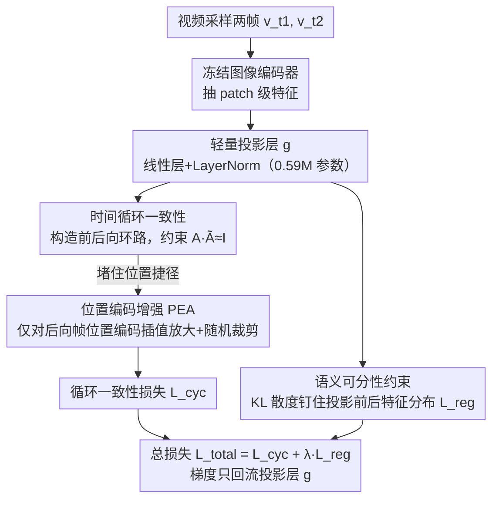

# From Static to Dynamic: Exploring Self-supervised Image-to-Video Representation Transfer Learning

**会议**: CVPR 2026  
**arXiv**: [2603.26597](https://arxiv.org/abs/2603.26597)  
**代码**: [https://github.com/yafeng19/Co-Settle](https://github.com/yafeng19/Co-Settle)  
**领域**: 视频生成  
**关键词**: 图像到视频迁移, 自监督学习, 时间一致性, 语义可分性, 轻量投影

## 一句话总结

本文提出 Co-Settle 框架，通过在冻结的图像预训练编码器上训练一个轻量线性投影层，利用时间循环一致性损失和语义可分性约束，仅需5个epoch的自监督训练即可在8个图像基础模型上一致性提升多粒度视频下游任务性能。

## 研究背景与动机

**领域现状**：将图像预训练模型迁移到视频任务已成为视频表征学习的主流范式。现有方法通常在预训练图像编码器上添加时间建模模块（如时间注意力、3D卷积、adapter），然后在视频数据上微调。

**现有痛点**：微调较重的时间模块会损害**视频间语义可分性**（inter-video semantic separability）——即区分不同视频中不同对象的能力，因为视频数据集类别多样性有限，容易催生灾难性遗忘。但如果限制可调参数以保持可分性，则**视频内时间一致性**（intra-video temporal consistency）——即同一视频中同一对象表征的稳定性——又会不足。

**核心矛盾**：图像到视频迁移中存在**时间一致性与语义可分性之间的trade-off**。现有方法要么过度微调丢失语义判别力，要么参数受限无法学到充分的时间对应关系。

**本文目标**：找到一种高效方法，在增强时间一致性的同时保持甚至改善语义可分性。

**切入角度**：作者观察到图像预训练模型已具备近似的时间一致性（因为pretraining中有几何增强），但缺乏对真实世界时间动态的建模。只需一个极轻量的投影层即可调整表征空间来平衡两个性质。

**核心 idea**：冻结图像编码器，仅训练一个线性投影层，用循环一致性目标增强时间对应，用KL散度约束保持语义可分性，实现高效的图像到视频表征迁移。

## 方法详解

### 整体框架

Co-Settle 想做的事很克制：不去改动图像基础模型本身，而是在它后面挂一个极轻的"翻译层"，把静态图像的表征空间稍微拧一下，让它同时具备视频任务需要的两个性质——同一视频里同一对象的表征要稳（时间一致性），不同视频里不同对象的表征要分得开（语义可分性）。

具体地，从一个视频里采样两帧 $\mathbf{v}_{t_1}$ 和 $\mathbf{v}_{t_2}$，先用**完全冻结**的图像编码器抽出 patch 级特征，再过一个可学习的投影层 $g$（一个线性层加 LayerNorm，只有 0.59M 参数）得到调整后的表征。训练时只在这个新空间里做两件事：用循环一致性损失逼出帧间的时间对应，用 KL 散度约束守住原编码器的语义结构。两个目标合成总损失 $\mathcal{L}_{total} = \mathcal{L}_{cyc} + \lambda \mathcal{L}_{reg}$，全部梯度只回流到那个线性层。

### 关键设计

**1. 时间循环一致性：用"绕一圈要回到原点"逼出帧间对应**

视频迁移真正缺的是对"同一个东西在帧间怎么移动"的建模，而图像模型从没见过这个。作者用循环一致性把这件事变成一个可直接优化的目标：构造前向—后向的环路 $\mathbf{v}_{t_1} \to \mathbf{v}_{t_2} \to \mathbf{v}_{t_1}$，算出前向相关矩阵 $\mathbf{A}_{t_1 t_2}$ 和后向相关矩阵 $\tilde{\mathbf{A}}_{t_2 t_1}$，要求乘积 $\mathbf{A}_{t_1 t_2}\tilde{\mathbf{A}}_{t_2 t_1}$ 逼近单位矩阵——也就是每个 patch 沿环路走一圈后应当落回自己原来的位置：

$$\mathcal{L}_{cyc} = -\sum_{i=1}^{N} \log P\big(X_d = \tilde{\mathbf{q}}_{t_1}^b(i) \mid X_s = \mathbf{q}_{t_1}^f(i)\big)$$

相比加时间注意力、3D 卷积这类间接的辅助任务，循环一致性给的是一个直接、显式的对应学习信号，不需要任何标注，因此能在极少的训练量下生效。

**2. 位置编码增强（PEA）：堵住让循环一致性作弊的"位置捷径"**

上面的循环目标有个致命漏洞：ViT 自带显式位置编码，patch 完全可以靠"绝对坐标"而不是"长得像不像"来配对，于是 $\mathbf{A}\tilde{\mathbf{A}}$ 不学语义也能轻松逼近单位矩阵。作者做了一组很干净的对照实验坐实这点——即使喂进**不相关的视频**、甚至把 patch **打乱顺序**，循环损失照样飞快收敛到零，说明模型学的是位置而非视觉对应。

PEA 的对策是只对后向那一帧的位置编码动手脚：先插值放大、再随机裁剪，得到一份被扰动的位置编码 $\tilde{\mathbf{E}}_{pos}$，破坏精确的绝对位置匹配，但保留局部的相对位置关系。这种"只扰后向、保留前向"的不对称设计受信息瓶颈思想启发——把"靠坐标对齐"这条捷径的信息量压掉，逼模型转去依赖真正的语义内容。消融里这一改动把 VIP mIoU 从 16.2 直接拉到 33.3，是整套方法能成立的前提。

**3. 语义可分性约束：用 KL 散度守住原编码器的判别力**

只在视频数据上优化一致性会有反作用：视频数据集的类别多样性本就有限，投影层很容易为了对齐而把不同对象的表征也揉到一起，发生灾难性遗忘。作者用一个 KL 散度项把投影前后的特征分布钉在一起：

$$\mathcal{L}_{reg} = \frac{1}{|\mathcal{S}|} \sum_{(\mathbf{p},\mathbf{z}) \in \mathcal{S}} \sum_{i=1}^{d} P(i)\,\log \frac{P(i)}{Z(i)},\quad P=\mathrm{softmax}(\mathbf{p}),\ Z=\mathrm{softmax}(\mathbf{z})$$

这里 $\mathbf{z}$ 是冻结编码器的原特征、$\mathbf{p}$ 是投影后的特征。约束的效果是逼投影层保持近似等距映射、避免维度坍塌，相当于在"允许它学时间对应"和"不许它丢掉语义结构"之间划了一条线。值得一提的是，作者还给了谱分析（Theorem 1-2）说明最优线性投影天然具有**软阈值**行为：时间方差大的维度被抑制、方差小的维度被放大，从而同时拉大视频间与视频内的距离 margin——这也解释了为什么一个线性层就够，不必上 MLP。

### 损失函数 / 训练策略

- 总损失 $\mathcal{L}_{total} = \mathcal{L}_{cyc} + \lambda \mathcal{L}_{reg}$，只更新投影层 $g$（0.59M 参数），编码器全程冻结。
- 在 Kinetics-400 上训练 5 个 epoch，batch size 512，4 块 RTX4090，AdamW，学习率 $1\times 10^{-4}$，cosine decay。整套训练约 1.2 RTX4090 GPU-days。

## 实验关键数据

### 主实验（Dense-level任务 ViT-B/16）

| 方法 | VIP mIoU | DAVIS J&F | JHMDB PCK@0.1 |
|------|----------|-----------|---------------|
| MAE (原始) | 29.3 | 52.4 | 41.6 |
| MAE + Co-Settle | **33.8** | **59.6** | **48.4** |
| CLIP (原始) | 38.1 | 54.9 | 36.9 |
| CLIP + Co-Settle | **39.2** | **58.3** | **40.6** |
| DINOv2 (原始) | 38.4 | 63.1 | 46.6 |
| DINOv2 + Co-Settle | **39.9** | **63.7** | **47.3** |

### 消融实验

| 配置 | VIP mIoU | DAVIS J&F | JHMDB PCK | 说明 |
|------|----------|-----------|-----------|------|
| 仅 $\mathcal{L}_{cyc}$（无PEA） | 16.2 | 26.2 | 38.5 | 位置捷径导致严重退化 |
| $\mathcal{L}_{cyc}$ + PEA | 33.3 | 59.3 | 48.1 | PEA有效抑制捷径 |
| $\mathcal{L}_{cyc}$ + $\mathcal{L}_{reg}$ + PEA | **33.8** | **59.6** | **48.4** | 完整模型 |
| Linear层（默认） | 33.8 | 59.6 | 47.9 | 简单线性层即足够 |
| MLP 2层 | 33.2 | 59.2 | 47.5 | 更复杂不一定更好 |
| MLP 3层 | 32.6 | 58.4 | 47.4 | 过深反而损害语义 |

### 关键发现

- **8个图像预训练模型全部获得一致性提升**，覆盖masked modeling、对比学习、自蒸馏三大范式
- 训练仅需5个epoch、0.59M参数、1.2 RTX4090 GPU-days，比传统方法快约13倍
- 线性层效果等于或优于MLP，与理论分析（线性和MLP具有相似的软阈值行为）一致
- 在DINO-Tracker pipeline中替换DINOv2特征后，BADJA追踪准确率从62.73提升至70.52

## 亮点与洞察

- **极致的简洁性**：冻结编码器 + 一个线性层 + 5个epoch = 在所有模型和所有任务粒度上的一致提升。这种"少即是多"的设计令人印象深刻
- **PEA策略的发现过程很有启发**：通过设计"不相关视频"和"打乱patch"的对照实验，严谨地验证了位置shortcut的存在，体现了优秀的实验设计思维
- **理论支撑完备**：不只是经验方法，还提供了谱分析证明，揭示了投影层的软阈值行为机制，使方法可解释

## 局限与展望

- 训练仅在Kinetics-400上进行，视频数据集的内容多样性对迁移效果的影响尚未充分探索
- 当前只使用了ViT架构，对CNN或混合架构的适用性未验证
- 投影层冻结后的特征在不同下游任务之间是否存在冲突值得进一步研究
- 可以考虑扩展到多帧设置（当前仅用2帧）以捕获更复杂的长程时间对应

## 相关工作与启发

- **vs AIM/ST-Adapter/ZeroI2V**: 这些CLIP-based方法需要11-14M参数和大量GPU时间做有监督适配，而Co-Settle仅需0.59M参数和无监督训练就能在dense任务上超越它们
- **vs SiamMAE/CropMAE**: 这些视频预训练方法需要400-1600个epoch的大规模训练，Co-Settle用极低成本就能达到可比性能
- 核心insight"trade-off的显式建模"可迁移到其他表征迁移场景，如跨模态迁移或跨分辨率迁移

## 评分

- 新颖性: ⭐⭐⭐⭐ 将trade-off显式建模并理论证明是亮点，但轻量投影层的思路不算全新
- 实验充分度: ⭐⭐⭐⭐⭐ 8个模型、多粒度任务、效率对比、理论验证，非常全面
- 写作质量: ⭐⭐⭐⭐⭐ 动机-方法-理论-实验的逻辑链非常清晰，理论部分自成一体
- 价值: ⭐⭐⭐⭐ 提供了图像到视频迁移的高效baseline和理论框架，但适用场景相对垂直

<!-- RELATED:START -->

## 相关论文

- [\[CVPR 2026\] VidPrism: Heterogeneous Mixture of Experts for Image-to-Video Transfer](vidprism_heterogeneous_mixture_of_experts_for_image-to-video_transfer.md)
- [\[CVPR 2026\] GT-SVJ: Generative-Transformer-Based Self-Supervised Video Judge For Efficient Video Reward Modeling](gt-svj_generative-transformer-based_self-supervised_video_judge.md)
- [\[CVPR 2026\] One-to-All Animation: Alignment-Free Character Animation and Image Pose Transfer](one-to-all_animation_alignment-free_character_animation_and_image_pose_transfer.md)
- [\[CVPR 2026\] Let Your Image Move with Your Motion! – Implicit Multi-Object Multi-Motion Transfer](let_your_image_move_with_your_motion_--_implicit_multi-object_multi-motion_trans.md)
- [\[CVPR 2026\] SMRABooth: Subject and Motion Representation Alignment for Customized Video Generation](smrabooth_subject_and_motion_representation_alignment_for_customized_video_gener.md)

<!-- RELATED:END -->
