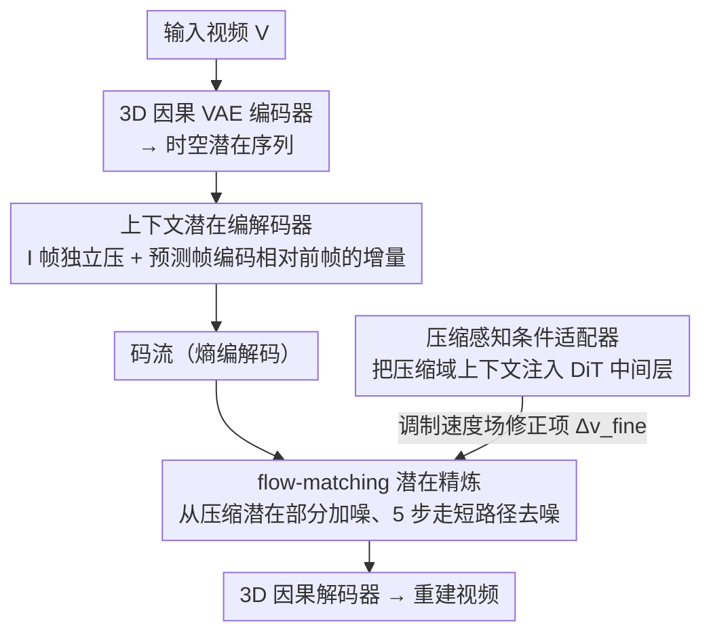

# Generative Neural Video Compression via Video Diffusion Prior

**会议**: CVPR 2026  
**arXiv**: [2512.05016](https://arxiv.org/abs/2512.05016)  
**代码**: 无  
**领域**: 视频生成  
**关键词**: 视频压缩, 视频扩散模型, flow matching, 感知质量, 时序一致性

## 一句话总结

本文提出 GNVC-VD，首个基于 DiT 的生成式神经视频压缩框架，通过将视频扩散变换器作为视频原生生成先验，在统一编解码器中实现时空潜在压缩和序列级生成精炼，在极低码率（<0.03 bpp）下大幅超越传统和学习型编解码器的感知质量，并显著减少先前生成方法中的闪烁伪影。

## 研究背景与动机

1. **领域现状**：神经视频压缩 (NVC) 近年发展迅速，DCVC 系列等学习型编解码器已在率失真优化上超越 HEVC 和 VVC 等传统标准。在图像领域，生成式压缩已通过预训练 GAN 或扩散模型成功恢复高频纹理，在极低码率下产生视觉上令人信服的重建结果。
2. **现有痛点**：当码率降至极低区域（<0.03 bpp），失真驱动的目标函数（如 MSE）会过度平滑纹理并擦除精细结构。更关键的是，现有感知视频编解码器（如 GLC-Video、DiffVC）整合的是图像域生成先验，这些先验本质上是静态的、无时序建模能力的。
3. **核心矛盾**：视频对时序一致性有严格要求。基于图像生成先验的编解码器即使用相邻帧条件化，其生成先验也无法捕获长程时序结构。结果是恢复的外观随时间漂移，产生明显的感知闪烁 (perceptual flickering)，在极低码率下尤为严重。
4. **本文目标** (a) 如何在神经视频压缩中引入视频原生的生成先验？(b) 如何在时空潜在空间进行序列级精炼而非逐帧增强？(c) 如何使扩散先验适应压缩引入的退化？
5. **切入角度**：视频扩散模型（特别是 DiT 架构）在大规模视频数据上学习了时空潜在表示，能捕获外观、运动和长程依赖。这使 VDM 成为视频压缩的理想生成先验，将解码重新定义为序列级条件去噪过程。
6. **核心 idea**：将预训练的 VideoDiT（Wan2.1）作为视频原生先验，不从纯高斯噪声去噪，而是从压缩后的时空潜在表示出发进行 flow-matching 精炼，学习一个修正项来适应压缩退化。

## 方法详解

### 整体框架

GNVC-VD 处理输入视频 $V \in \mathbb{R}^{(1+T) \times H \times W \times 3}$ 的流程如下：(1) 3D 因果 VAE 编码器 $\mathcal{E}$（来自 Wan2.1）将视频编码为时空潜在序列 $\boldsymbol{x}_1 = \{l_t\}_{t=1}^{1+T/4}$；(2) **上下文潜在编解码器**用时序条件编码把潜在序列压成运动感知的紧凑码流；(3) 基于 VideoDiT 的 **flow-matching 潜在精炼模块**从解码后（受压缩退化）的潜在出发，做序列级生成去噪，其中**压缩感知条件适配器**把压缩域上下文注入 DiT，引导它认得并修正压缩伪影；(4) 3D 因果解码器 $\mathcal{D}$ 重建视频。整个流水线将变换编码压缩与扩散生成精炼紧密耦合。

### 关键设计

**1. 上下文潜在编解码器：用时序条件编码把潜在序列压成运动感知的紧凑码流**

极低码率下要省比特，最直接的浪费就是相邻帧的潜在表示高度冗余。这个模块沿时间轴把潜在序列拆成两类来处理：锚点潜在 $l_1$（对应 I 帧）没有前文可参考，用一套独立的变换编码模块单独压；后续的预测潜在 $\{l_t\}_{t>1}$ 则每一帧都条件化于前一帧的解码结果 $\hat{l}_{t-1}$，只编码"相对于前文的增量"。具体是 $\hat{y}_t = \text{Quant}(g_a(l_t \mid f_{t-1}))$、$\hat{l}_t = g_s(\hat{y}_t, f_{t-1})$，其中 $f_{t-1}$ 是从 $\hat{l}_{t-1}$ 提取的时序上下文特征，量化后的 $\hat{y}_t$ 再交给学习到的概率模型做熵编码。这套条件编码沿用 DCVC-RT 的思路，好处是产出的潜在既紧凑又带运动感知，时序上是连续的，为后面的扩散精炼提供了一个"已经接近数据流形"的起点，而不是一堆各帧独立、彼此打架的潜在。

**2. Flow-Matching 潜在精炼：从压缩潜在出发走短路径去噪，而不是从纯噪声重画**

压缩会把潜在表示打脏，把 $\boldsymbol{x}_c$ 看成原始潜在 $\boldsymbol{x}_1$ 叠加了一个扰动 $\boldsymbol{e}$，即 $\boldsymbol{x}_c = \boldsymbol{x}_1 + \boldsymbol{e}$。既然 $\boldsymbol{x}_c$ 本来就离干净数据不远，从纯高斯噪声重新去噪一遍既慢又浪费。这里改成在 $\boldsymbol{x}_c$ 上只注入部分噪声 $\boldsymbol{x}_{t_N} = t_N \boldsymbol{x}_c + (1-t_N)\boldsymbol{x}_0$（取 $t_N=0.7$），只沿 $t_N$ 到 1 这一段概率流路径做精炼。关键是把目标速度场拆成两项：

$$\boldsymbol{v}_\tau = \underbrace{(\boldsymbol{x}_1 - \boldsymbol{x}_0)}_{\boldsymbol{v}_{\text{pre-train}}} - \underbrace{\frac{t_N}{1-t_N}(\boldsymbol{x}_c - \boldsymbol{x}_1)}_{\Delta \boldsymbol{v}_{\text{fine}}}$$

前一项 $\boldsymbol{v}_{\text{pre-train}}$ 就是预训练 VideoDiT 本身学到的速度场，负责把样本往视频数据流形上拉；后一项 $\Delta \boldsymbol{v}_{\text{fine}}$ 是专门针对压缩退化的修正项。整段精炼只用 $L=5$ 步确定性 flow 积分就能完成。这种分解的好处是把"预训练通用生成知识"和"压缩特定的适配"干净地解耦——前者直接复用大模型不动，后者只学一个小修正，既快又稳。而且因为 VideoDiT 是视频原生先验，精炼是对整个帧序列联合做的，天然带时序一致性，这正是逐帧图像先验做不到的。

**3. 压缩感知条件适配器：把压缩域的上下文注进 DiT 中间层，让它认得压缩伪影**

直接拿预训练 VideoDiT 去精炼压缩潜在效果并不好，因为压缩潜在的分布和自然视频潜在的分布之间有偏差，大模型没见过这种"被编解码器揉过"的输入。这个适配器在 VideoDiT 的变换器块里插入条件层，把上下文特征序列 $\{f_t\}_{t=1}^{1+T/4}$ 作为条件喂进去，调制中间的 DiT 表示，实际估计的就是上面那个修正项 $\Delta \boldsymbol{v}_{\text{fine}}$。相当于给扩散模型补了一份"压缩域的先验知识"，让它知道当前潜在是从哪种压缩里来的、哪里被抹平了、该往哪儿恢复，从而把生成先验和压缩潜在的分布对齐，而不是盲目按自然视频的统计去脑补细节。

### 损失函数 / 训练策略

采用两阶段训练策略：

- **Stage I 潜在级对齐**：$\mathcal{L}_{\text{latent}} = R(\hat{y}) + \lambda_r \|\tilde{\boldsymbol{x}}_1 - \boldsymbol{x}_1\|_2^2 + \mathcal{L}_{\text{CFM}}$，其中 $\mathcal{L}_{\text{CFM}}$ 是条件流匹配损失。确保精炼后的潜在与真实潜在在扩散流形上一致。
- **Stage II 像素级微调**：$\mathcal{L}_{\text{pixel}} = R(\hat{y}) + \lambda_r(\|V - \tilde{V}\|_2^2 + \lambda_{\text{lpips}}\mathcal{L}_{\text{LPIPS}}(V,\tilde{V}) + \|\boldsymbol{x}_c - \boldsymbol{x}_1\|_2^2 + \|\tilde{\boldsymbol{x}}_1 - \boldsymbol{x}_1\|_2^2)$，加入 LPIPS 感知损失进行端到端像素域优化。

这种渐进策略先弥合编解码器潜在空间与扩散流形的差距，再进行感知质量微调。

## 实验关键数据

### 主实验

**感知质量对比（BD-Rate %，锚定 VVC，负值越小越好）：**

| 方法 | HEVC-B LPIPS | MCL-JCV LPIPS | UVG LPIPS | UVG DISTS |
|------|-------------|--------------|----------|----------|
| GLC-Video | -79.1% | -74.8% | -60.0% | -10.3% |
| **GNVC-VD** | **-89.4%** | **-90.8%** | **-86.5%** | **-96.1%** |

GNVC-VD 在所有基准和指标上均取得最优感知质量，相较 GLC-Video 进一步减少 BD-Rate 10-26 个百分点。

**时序一致性对比（HEVC-B）：**

| 方法 | $E_{\text{warp}} \downarrow$ | CLIP-F $\uparrow$ |
|------|--------------------------|-------------------|
| GLC-Video | 86.5 | 0.979 |
| GNVC-VD | 66.6 | 0.982 |
| HEVC | 23.3 | 0.982 |

### 消融实验

| 配置 | HEVC-B BD-LPIPS | UVG BD-LPIPS | 说明 |
|------|----------------|-------------|------|
| Full model | 0 | 0 | 基准 |
| W/o Latent Refinement | +0.181 | +0.159 | 去掉扩散精炼，严重过平滑 |
| W/o Stage I Loss | +0.016 | +0.016 | 去掉潜在对齐，细节恢复变差 |
| W/o Stage II Loss | +0.252 | +0.242 | 去掉像素微调，退化最严重 |

### 关键发现

- **扩散精炼模块贡献最大**：去掉后 BD-LPIPS 退化 +0.181，结果严重过平滑，说明视频扩散先验对感知质量恢复是核心
- **Stage II 像素级微调不可或缺**：去掉后退化最严重（+0.252），说明仅在潜在空间对齐不足以实现最优感知重建
- **时序一致性的优势来源**：GNVC-VD 的 $E_{\text{warp}}$ 为 66.6，远低于 GLC-Video 的 86.5。GLC-Video 的帧间纹理漂移和闪烁在时空可视化中清晰可见
- 传统编解码器（HEVC/VVC）的 $E_{\text{warp}}$ 最低但这是因为过于平滑导致的"假稳定性"

## 亮点与洞察

- **首次将视频原生扩散先验引入 NVC**：跳过了"图像先验 → 视频压缩"的局限性路径，直接用视频扩散模型捕获时空依赖，从根本上解决了帧间闪烁问题。这种"用序列级先验解决序列级问题"的思路非常自然且有效
- **从压缩潜在出发的部分去噪策略**：不从纯噪声开始而是利用压缩潜在作为初始点，显著减少了去噪步数（仅需5步），同时保留了生成模型恢复细节的能力。速度场分解为预训练项和修正项的形式化也很优雅
- **两阶段训练策略的设计考量**：直接端到端训练不稳定，通过先潜在对齐再像素微调的渐进方案解决了扩散流形与压缩潜在分布不匹配的问题，这种思路可迁移到其他将预训练生成模型适应下游任务的场景

## 局限与展望

- **计算效率**：扩散精炼需要多步去噪（5步），相比传统编解码器解码速度慢数倍，实际部署困难
- **变换编码模块可进一步优化**：作者自己也指出当前的上下文变换编码模块效率可改进
- **训练数据和序列长度限制**：训练最长仅用 13 帧的 Vimeo 序列，对更长视频的泛化能力未验证
- **仅在极低码率（<0.03 bpp）场景验证**：在中等码率下是否仍有优势未讨论
- 加速扩散精炼（如蒸馏、一致性模型）是重要的未来方向

## 相关工作与启发

- **vs GLC-Video**：GLC-Video 使用图像扩散先验逐帧增强，导致纹理漂移和闪烁。GNVC-VD 使用视频扩散先验进行序列级精炼，从根本上解决了时序不一致问题。在 BD-Rate 上全面领先
- **vs DCVC-RT**：DCVC-RT 是当前最强的学习型编解码器之一，但在极低码率下过度平滑。GNVC-VD 在其上增加扩散精炼，在 UVG 上 BD-DISTS 改善达 98%
- 该工作展示了视频生成基础模型在压缩任务中的巨大价值，为"生成式编解码"开辟了新方向

## 评分

- 新颖性: ⭐⭐⭐⭐⭐ 首次将视频扩散先验引入NVC，从压缩潜在出发的flow-matching精炼设计巧妙
- 实验充分度: ⭐⭐⭐⭐ 多基准全面对比，消融完整，但缺少中等码率和复杂运动场景的分析
- 写作质量: ⭐⭐⭐⭐ 技术路线清晰，公式推导严谨，图表信息丰富
- 价值: ⭐⭐⭐⭐⭐ 为下一代感知视频压缩指明方向，视频扩散先验+编解码器的范式具有广泛影响力

<!-- RELATED:START -->

## 相关论文

- [\[CVPR 2026\] DreamShot: Personalized Storyboard Synthesis with Video Diffusion Prior](dreamshot_storyboard_synthesis.md)
- [\[CVPR 2026\] LightMover: Generative Light Movement with Color and Intensity Controls](lightmover_generative_light_movement_with_color_and_intensity_controls.md)
- [\[CVPR 2026\] Real-Time Generation of Streamable Talking Portrait Video with Reference-Guided Deep Compression VAEs](real-time_generation_of_streamable_talking_portrait_video_with_reference-guided_.md)
- [\[CVPR 2026\] PropFly: Learning to Propagate via On-the-Fly Supervision from Pre-trained Video Diffusion Models](propfly_learning_to_propagate_via_on-the-fly_supervision_from_pre-trained_video_.md)
- [\[CVPR 2026\] PhysVid: Physics Aware Local Conditioning for Generative Video](physvid_physics_aware_local_conditioning_for_generative_video_models.md)

<!-- RELATED:END -->
