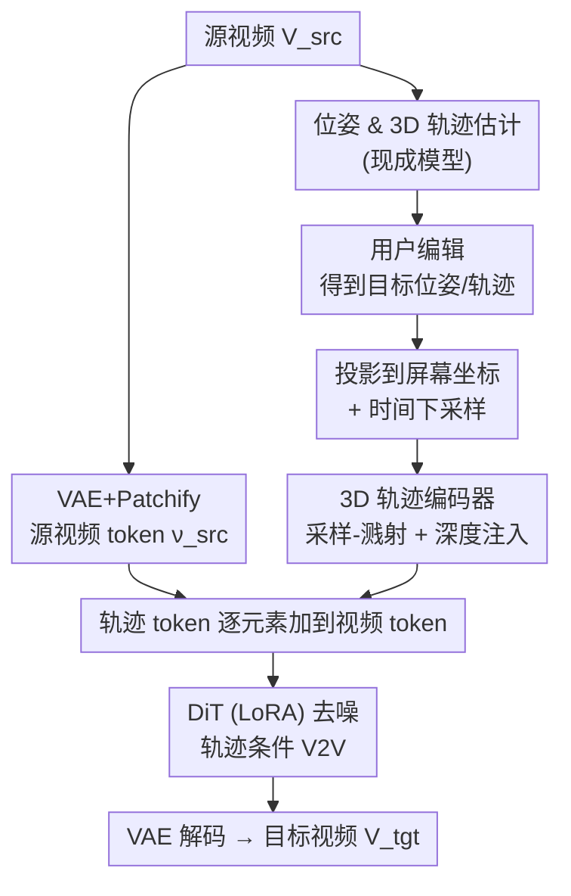

# Generative Video Motion Editing with 3D Point Tracks

**会议**: CVPR 2026  
**论文**: [CVF Open Access](https://openaccess.thecvf.com/content/CVPR2026/html/Lee_Generative_Video_Motion_Editing_with_3D_Point_Tracks_CVPR_2026_paper.html)  
**代码**: https://edit-by-track.github.io （项目页）  
**领域**: 视频生成 / 视频编辑  
**关键词**: 视频运动编辑, 3D点轨迹, 视频扩散, 视频到视频, 相机与物体运动

## 一句话总结
本文提出 **Edit-by-Track**：把"源视频 + 一对源/目标 3D 点轨迹"作为条件喂给一个 V2V 视频扩散模型，用 3D 轨迹建立源到目标的稀疏对应关系，从而同时编辑相机视角和物体运动（含遮挡、深度排序、非刚性形变），在 DyCheck 和野外视频上全面超过现有 I2V/inpaint 类方法。

## 研究背景与动机

**领域现状**：可控视频生成里，运动控制大致两条路线。一是相机可控的 V2V（如 ReCamMaster、GEN3C），把输入视频按目标相机位姿 warp 后再用扩散模型 inpaint 补洞；二是轨迹条件的 I2V（如 ATI、DaS），用点轨迹同时表示相机运动（背景点）和物体运动（前景点），从单帧出发生成视频。

**现有痛点**：这两条路各缺一半能力。相机可控 V2V 是在"同步多视角数据"上训练的，天生假设物体运动不变，一旦想改物体动作就会产生错误的次级效果（比如改了人的落点，水花/阴影却对不上，见原文 Fig. 2a）。而轨迹条件 I2V 只把输入视频的**第一帧**当参考，后续帧全部丢弃，导致整段动态场景的上下文丢失，产生明显的幻觉和物体扭曲（Fig. 2b）。

**核心矛盾**：要做精细的"相机 + 物体"联合编辑，既需要**完整的场景上下文**（这要求条件里包含整段输入视频，而不是一帧），又需要一种能**同时表达相机与物体运动、并感知深度**的运动表示（这样才能解析遮挡和前后遮挡关系）。现有方法各占一头，没人两头都占。

**本文目标**：构造一个 V2V 框架，输入是整段源视频 + 一对（源、目标）3D 点轨迹，输出是忠实保留原场景、同时按用户意图改了相机/物体运动的目标视频。

**切入角度**：作者观察到 3D 点轨迹是天然的统一运动表示——它把场景-物体运动和相机运动解耦（背景轨迹编码相机、前景轨迹编码物体），而且相比 2D 轨迹多了**显式的深度线索**，能让模型判断深度顺序、处理遮挡。把它做成"源轨迹→目标轨迹"的成对条件，就在源视频和目标视频之间建立了稀疏对应，可以把源视频的丰富外观上下文搬运到新运动上。

**核心 idea**：用一对 3D 点轨迹（而非单帧图像或纯相机位姿）去 condition 一个 V2V 扩散模型，并设计一个可学习的"采样-溅射（sampling-and-splatting）"3D 轨迹编码器，把稀疏 3D 轨迹自适应地编码成与视频 token 对齐的屏幕空间 token。

## 方法详解

### 整体框架
目标是从源视频 $V_{src}\in\mathbb{R}^{F\times H\times W\times3}$ 生成反映用户编辑意图的目标视频 $V_{tgt}$。整条管线是：先用现成模型估计源视频每帧相机参数 $P_{src}$ 和 $N$ 条 3D 点轨迹 $T_{src}\in\mathbb{R}^{F\times N\times3}$；用户编辑相机/物体运动得到目标参数 $(P_{tgt},T_{tgt})$；把源视频经 VAE+patchify 编码成源视频 token $\nu_{src}$，与含噪目标 token $\nu_{tgt}$ **拼接**（提供完整场景上下文）；同时把成对轨迹投影到屏幕坐标、时间下采样后，送入 **3D 轨迹编码器**生成轨迹 token $[\tau_{src},\tau_{tgt}]$，**逐元素加**到视频 token 上，再喂进 DiT 去噪生成 $V_{tgt}$。整个模型是在预训练 T2V 模型 Wan-2.1（1.3B、Rectified Flow、生成 81 帧）上用 LoRA 微调出来的。

### 关键设计

**1. 3D 轨迹编码器：用可学习的"采样-溅射"把稀疏 3D 轨迹编码成屏幕对齐 token**

这是全文的核心。痛点在于：把 3D 轨迹编码进模型有两种旧做法，一种是手工把轨迹画成 2D 屏幕空间表示（直观但轨迹一多、遮挡一频繁就难处理），另一种是直接把运动值编码成特征不做屏幕对齐（能处理大量轨迹但控制不精确、有尺度歧义）。作者想兼得两者优点：可学习、又屏幕对齐。

做法是两步交叉注意力。**第一步采样**：先把 3D 轨迹的 $xyz$ 经位置编码映射成嵌入 $\rho^{xyz}_{src}\in\mathbb{R}^{fN\times d}$；以源坐标嵌入为 query，去源视频 token $\nu_{src}$ 里**为每条轨迹采样**对应位置的视觉上下文，再用 Transformer 在每条轨迹内做时间聚合：

$$\tau^{sampled}_{src}=\mathrm{Transformer}\big(\mathrm{Attn}(\rho^{xyz}_{src},\,G,\,\nu_{src})\big)$$

其中 key $G\in\mathbb{R}^{fhw\times d}$ 是 $z=0$ 的 $xy$ 网格坐标位置编码。**第二步溅射**：把携带源视频外观的采样 token，分别用源/目标坐标嵌入"溅射"回源、目标帧空间，得到对齐视频 token 的 $[\tau_{src},\tau_{tgt}]\in\mathbb{R}^{2fhw\times d}$（这一步是采样的逆向，query 与 key 互换）：

$$\tau_{\{src,tgt\}}=\mathrm{Attn}\big(G,\,\rho^{xyz}_{\{src,tgt\}},\,\tau^{sampled}_{src}\big)$$

之所以用坐标交叉注意力而不是 TrajAttn 那种固定最近邻采样/溅射，是因为后者对噪声大、频繁遮挡的 3D 轨迹不鲁棒；交叉注意力是自适应的，还能处理可变数量的轨迹。作者也刻意**去掉**了 Tracktention 里的 attention bias 项，因为发现它对噪声轨迹敏感。另一个关键细节：溅射只把值赋到 $xy$ 位置，深度没被显式溅射，于是作者额外对轨迹的 $z$ 做位置编码 $\sigma^z_{\{src,tgt\}}$，在溅射前加到采样 token 上，补回 3D 感知能力（消融显示这步主要降低轨迹控制误差 EPE）。还有一点：模型**不使用** 3D 轨迹估计的可见性标签——因为 3D 编辑后轨迹可见性本身就变得模糊，所有源轨迹无论遮挡都送进去，让模型隐式推理可见性和遮挡。

**2. 轨迹条件的 V2V 架构：拼接整段源视频 token，保住完整场景上下文**

针对"I2V 只看第一帧、丢上下文"这个痛点。作者把源视频 $V_{src}$ 经 VAE 编码成 latent $z_{src}$、patchify 成源 token $\nu_{src}$，与含噪目标 token $\nu_{tgt}$ 拼成 $[\nu_{src},\nu_{tgt}]\in\mathbb{R}^{2fhw\times d}$ 一起作为 DiT 的视频条件。这样模型在去噪每一帧目标时，都能看到整段源视频的外观和动态，而不是只有一帧。结合上面的成对轨迹条件，源轨迹与目标轨迹建立了稀疏对应，模型据此把源视频里"什么东西长什么样"的上下文搬到目标运动的新位置上，既改了运动又保了场景一致性。这也是它能正确处理"改物体运动后的因果次级效果"（阴影、水花）而 inpaint 类方法做不到的根本原因——后者只 warp 像素再补洞，没有源视频的语义上下文可借。

**3. 两阶段训练：合成数据建立控制能力，真实单目视频补泛化**

最大的工程障碍是缺数据：理想训练数据是"同一物体+背景、但相机和物体运动不同的成对视频 + 精确 3D 轨迹对"，现实里几乎不存在。作者用两阶段微调绕过。**阶段一（合成 bootstrap）**：在 Blender 里用 Mixamo 人体 + Kubric 背景渲染同场景、不同动作/相机轨迹的视频对，从网格顶点直接抽 ground-truth 3D 轨迹，每次随机取两段 clip 组成训练对，先把"轨迹控制运动"这个核心能力学出来。**阶段二（真实微调）**：为弥合合成-真实域差，从单目视频里**采样两段不连续 clip**（时间间隔 1–5 秒）当作一对——视频本身的自然运动天然模拟了相机+物体的联合变化，可大规模扩展；用 3D 跟踪模型估 2K 条轨迹做对应。数据上以 24K 内部库存动态视频为主，掺一点 DL3DV（静态场景但相机大幅运动，补相机多样性）和少量物体移除视频对（增强物体级操作）。训练用 LoRA（rank=64）从 Wan2.1-T2V-1.3B 起，分辨率 $384\times672$，阶段一 4K 步、阶段二 8K 步，16 张 A100。消融证明：只用合成数据泛化弱，只用真实数据轨迹控制差，两阶段先合成后真实优于"合成+真实混合的单阶段"。

### 一个完整示例
以"把车做 3D 旋转"为例（原文 Fig. 9）：用户用 SAM2 分割出车的前景 mask，3D 跟踪模型估出相机参数、深度和全帧 3D 轨迹；用户在 3D 轨迹（以及深度反投影出的点云）上把车旋转，得到目标轨迹 $T_{tgt}$；源/目标轨迹投影到屏幕、时间下采样后进 3D 轨迹编码器，第一步从源视频 token 采样到"车身的外观上下文"，第二步把它溅射到目标帧里车旋转后的新位置，同时 $z$ 嵌入告诉模型旋转后哪一面朝前；这些轨迹 token 加到拼好的 $[\nu_{src},\nu_{tgt}]$ 上喂 DiT，去噪出旋转后的车，且原场景背景、光照保持一致。对比之下 I2V 方法因只看第一帧丢了车外的上下文，GEN3C 因纯 warp+inpaint 改不掉车在原位置留下的阴影。

## 实验关键数据

### 主实验

DyCheck iPhone 数据集（12 个场景，联合相机+物体运动），报全帧与 masked（仅共可见区）指标。Edit-by-Track 不需要任何特权 GT 信息，仍在所有指标上第一：

| 方法 | 类型 | 特权信息 | PSNR↑ | SSIM↑ | LPIPS↓ | mLPIPS↓ |
|------|------|---------|-------|-------|--------|---------|
| ATI | I2V+track | GT 首帧 | 13.67 | .371 | .468 | .312 |
| GEN3C* | V2V+inpaint | GT 首帧+光流 | 13.61 | .406 | .517 | .339 |
| TrajAttn+NVS* | IV2V+track+inpaint | GT 首帧+光流 | 13.94 | .416 | .549 | .351 |
| **Edit-by-Track (Ours)** | V2V+track | **无** | **14.80** | **.424** | **.406** | **.247** |

野外视频（MiraData 随机 100 段），额外报 FVD（画质）和 EPE（轨迹控制误差）：

| 方法 | 基座 | 参数量 | PSNR↑ | LPIPS↓ | FVD↓ | EPE↓ |
|------|------|-------|-------|--------|------|------|
| ATI | Wan | 14B | 19.07 | .244 | **268.80** | 11.44 |
| DaS | CogVX | 5B | 18.15 | .315 | 393.32 | 17.92 |
| **Ours** | Wan | **1.3B** | **19.55** | **.236** | 306.44 | **6.12** |

亮点是 **1.3B 的小模型在画质和轨迹控制上整体超过 14B 的 ATI**：ATI 靠 GT 首帧 + 巨大基座拿到最低 FVD，但既保不住完整上下文、也不遵循输入轨迹（EPE 11.44 vs 本文 6.12）。本文 EPE 几乎是所有 baseline 的一半到几分之一，说明"完整视频上下文 + 成对 3D 轨迹"对运动控制精度的增益很实。

### 消融实验

**3D 轨迹编码（Table 3，DyCheck / In-the-wild）**：

| 采样方式 | 2D/3D | 注入深度 | PSNR↑(DyCheck) | LPIPS↓ | EPE↓(wild) |
|----------|-------|---------|------|------|------|
| Naïve（固定高斯核） | 2D | | 13.42 | .489 | 16.18 |
| 交叉注意力 | 2D | | 13.88 | .415 | 7.03 |
| 交叉注意力 | 3D | | 14.82 | .395 | 7.44 |
| 交叉注意力 | 3D | ✓ | 14.80 | .406 | **6.12** |

**训练方案（Table 4）**：

| 合成 | 真实 | 两阶段 | PSNR↑(DyCheck) | LPIPS↓ | EPE↓(wild) |
|------|------|--------|------|------|------|
| ✓ | | | 9.61 | .706 | 24.64 |
| | ✓ | | 10.62 | .669 | 63.98 |
| ✓ | ✓ | （混合单阶段） | 13.34 | .483 | 6.93 |
| ✓ | ✓ | ✓ | **14.80** | **.406** | **6.12** |

### 关键发现
- **从 Naïve 固定高斯核换成自适应交叉注意力**是单点提升最大的一步：DyCheck PSNR 13.42→13.88、野外 EPE 16.18→7.03（误差砍半多），印证了"对噪声/遮挡轨迹做自适应采样"的必要性。
- **2D→3D 轨迹**主要在 DyCheck（大视角变化）上涨分（PSNR 13.88→14.82），因为深度线索帮模型解析遮挡和深度顺序；而**深度 $z$ 嵌入注入**主要降轨迹控制误差（野外 EPE 7.44→6.12），两者作用点不同、互补。
- **两阶段训练缺一不可**：只用合成数据 PSNR 仅 9.61（域差大、泛化崩）、只用真实数据 EPE 高达 63.98（轨迹控制学不好）；即便合成+真实混合单阶段（EPE 6.93）也不如先合成后真实（6.12），说明"先在干净 GT 轨迹上学控制、再到真实数据补外观"的顺序很重要。

## 亮点与洞察
- **"采样-溅射"作为运动条件注入范式很优雅**：把"从源视频取外观 → 按目标轨迹放到新位置"显式拆成两次交叉注意力，等价于在 latent 空间做了一次可学习、可微的稀疏 warp，比手工 2D 表示更鲁棒、比纯特征编码更精确，是可迁移到其他"按对应关系搬运内容"任务（如新视角合成、视频重定时）的通用 trick。
- **用单目视频的不连续 clip 自造训练对**是数据侧最巧的点：它把"找成对运动编辑视频"这个几乎无解的数据问题，转成"在海量单目视频里采两段"，可无限扩展，且天然带相机+物体联合变化——这思路对任何缺成对监督的视频编辑任务都有借鉴价值。
- **不用可见性标签、让模型隐式推理遮挡**：避开了"3D 编辑后可见性变模糊"的死结，是个反直觉但有效的设计选择。
- **小模型靠更好的条件打赢大模型**：1.3B 超 14B，再次说明在可控生成里，"条件信息的完整度与精确度"常比单纯堆参数更划算。

## 局限与展望
- 作者承认：当点轨迹**密集聚集**（尤其小物体）时，视觉上下文抽取和运动控制会变差；模型也难以合成编辑运动引发的**复杂物理现象**（次级效果），反映当前生成先验物理 grounding 有限。
- 自己观察：评测依赖"从单目视频取两段不连续 clip"构造的伪 GT 对，与真实成对编辑数据仍有差距，PSNR 绝对值偏低（野外 ~19.5）说明像素级保真还有空间；DyCheck 只有 12 场景，规模偏小。
- ⚠️ 论文/项目均未明确开源代码（仅项目页），可复现性待确认；公式细节以原文 Eq.(1)(2) 为准。
- 改进思路：引入物理先验或可微物理模块缓解次级效果失真；对密集小物体轨迹做层次化/分组编码；用更大规模真实成对数据进一步缩小域差。

## 相关工作与启发
- **vs ATI / DaS（轨迹条件 I2V）**：它们从单帧生成、丢后续帧上下文，本文用整段源视频 token 拼接保住完整场景，且基座小一个数量级仍在 EPE/LPIPS 上更好，区别在"条件是一帧还是整段视频"。
- **vs GEN3C / TrajCrafter（相机可控 V2V + inpaint）**：它们 warp 像素再补洞、只改视角且改不掉物体编辑的次级效果（阴影/水花），本文从非同步视频对学习，能联合编辑相机与物体运动。
- **vs ReVideo / GS-DiT（先出粗稿再 refine）**：它们对粗稿渲染质量敏感或仍丢全场景上下文，本文直接用未遮挡的整段输入视频 + 成对 3D 轨迹一步生成，更精简。
- **vs Tracktention / TrajAttn**：本文借鉴 Tracktention 的坐标交叉注意力但去掉对噪声敏感的 attention bias，并把它从 2D 推广到带深度注入的 3D 轨迹编码。

## 评分
- 新颖性: ⭐⭐⭐⭐⭐ 首个用成对 3D 点轨迹做相机+物体联合运动编辑的 V2V 框架，"采样-溅射"轨迹编码器设计新颖。
- 实验充分度: ⭐⭐⭐⭐ DyCheck+野外双基准 + 两组消融充分，但缺真实成对编辑 GT、场景规模偏小。
- 写作质量: ⭐⭐⭐⭐⭐ 动机递进清晰，Fig.2/3/4 把痛点与机制讲得很到位。
- 价值: ⭐⭐⭐⭐⭐ 解锁了现有方法做不到的多种联合运动编辑，小模型胜大模型，实用与方法价值兼具。

<!-- RELATED:START -->

## 相关论文

- [\[CVPR 2026\] 3D-Aware Implicit Motion Control for View-Adaptive Human Video Generation](3d-aware_implicit_motion_control_for_view-adaptive_human_video_generation.md)
- [\[CVPR 2026\] RecEdit-Drive: 3D Reconstruction-Guided Spatiotemporal Video Editing for Autonomous Driving Scenes](recedit-drive_3d_reconstruction-guided_spatiotemporal_video_editing_for_autonomo.md)
- [\[CVPR 2026\] Diverse Video Generation with Determinantal Point Process-Guided Policy Optimization](diverse_video_generation_with_determinantal_point_process-guided_policy_optimiza.md)
- [\[CVPR 2026\] V-RGBX: Video Editing with Accurate Controls over Intrinsic Properties](v-rgbx_video_editing_with_accurate_controls_over_intrinsic_properties.md)
- [\[CVPR 2026\] Towards Realistic and Consistent Orbital Video Generation via 3D Foundation Priors](orbital_video_3d_foundation_priors.md)

<!-- RELATED:END -->
