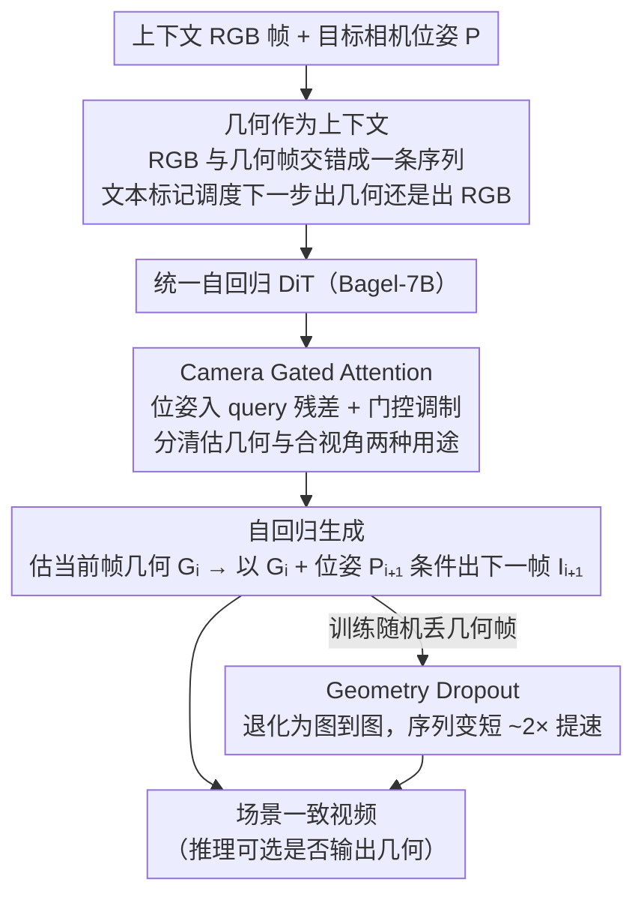

# Geometry-as-context: Modulating Explicit 3D in Scene-consistent Video Generation to Geometry Context

**会议**: CVPR 2026  
**arXiv**: [2602.21929](https://arxiv.org/abs/2602.21929)  
**代码**: 无  
**领域**: 视频生成  
**关键词**: 场景一致性视频生成, 几何上下文, 自回归生成, 相机控制, 3D重建

## 一句话总结

提出 Geometry-as-Context (GaC) 框架，将基于重建的场景视频生成中的不可微算子（3D重建+渲染）替换为统一的自回归视频生成模型，通过将几何信息（深度图）作为交错上下文嵌入生成序列，实现端到端训练并缓解累积误差。

## 研究背景与动机

场景一致性视频生成旨在沿相机轨迹探索 3D 场景，需保持高度的 3D 一致性。现有方法分为两类：
- **视频方法**（CameraCtrl、VMem 等）：仅靠视频模型维持一致性，记忆检索难以应对复杂场景和大相机运动
- **重建方法**（SceneScape、ViewCrafter、GEN3C 等）：迭代执行「几何估计→3D重建→渲染→补全」，但存在两个根本问题：
  1. **不可微算子**：逆渲染中的反投影和渲染操作不可微，梯度无法传播
  2. **非端到端训练**：几何预测和图像补全使用独立模型，累积误差无法通过学习缓解

与长程视频生成中可通过自回归训练缓解的累积误差不同，重建方法中的累积误差因不可微操作和模型分离而难以消除，这是本文要解决的核心问题。

## 方法详解

### 整体框架

GaC 将重建方法的迭代过程「展平」为一个自回归视频生成框架：单一 DiT 模型同时处理几何估计、视角变换模拟和图像补全。输入序列把 RGB 帧和几何帧交错排开 $\{I_i, \text{<Geometry>}, G_i, \text{<Image>}, I_{i+1}, \cdots\}$，中间插入的文本标记告诉模型下一步该吐几何还是该吐 RGB，于是「估几何—变视角—补图像」三件事被同一个 DiT 在一条序列上端到端串起来。

### 关键设计

**1. 几何作为上下文：把不可微的「重建—渲染」四步压成一次生成（Variant #1）**

重建方法最大的包袱是那条「几何估计→反投影→渲染→补全」的迭代链——反投影和渲染不可微，梯度传不过去，几何和补全又是两个分离模型，误差只能越滚越大。GaC 直接把这四步收成一次条件生成 $\{G_i, I_{i+1}\} = \varrho(\{I_i, G_i\}, P_{i+1})$：模型先估当前帧几何 $G_i$，再以 $G_i$ 和目标位姿 $P_{i+1}$ 为条件生成下一帧 RGB。把几何显式塞进上下文是一举三得——交错的几何帧切短了序列、提了效率，让模型获得 3D 感知、强化了场景一致性，而 RGB 与几何模态差异大，模型很容易分清当前该出哪一种。

**2. Camera Gated Attention：让同一组注意力分清「估几何」和「合视角」两种用途**

同一个相机位姿，在预测几何和在合成新视角时扮演的角色并不一样，直接喂进去模型容易混淆。CGA 把 Plücker 射线编码的位姿 $r_i$ 先加到 self-attention 的 query 上，再额外产出一个门控来调制输出：

$$\{Q_{res}, Gate\} = \text{Linear}_2(Q + r_i),\quad O = \text{SDPA}(Q + Q_{res}, K, V),\quad O = \text{Linear}_3(O * \sigma(Gate))$$

位姿通过残差进 query、作用强度由 $\sigma(Gate)$ 控制，模型就能按子任务自适应地决定相机信息该用多少，平移误差因此大幅下降。

**3. Geometry Dropout：训练随机丢几何，换来推理可选输出与近 2× 提速**

几何帧虽然有用，但每帧都生成会让序列变长、训练变慢，推理时也未必都需要几何输出。训练时以比率 $r$ 随机丢掉交错序列里的几何上下文，被丢的帧退化成纯图像到图像生成（Variant #3）。这样训练序列更短、更快，推理时可以只吐 RGB 而不必预测几何，且模型在有无几何上下文两种情形下都保持场景一致性。实测训练从 24 s/step 减半到 11 s/step、推理从 4.6 s/img 减半到 2.2 s/img，性能几乎不降。

### 损失函数 / 训练策略

- 基座模型：Bagel-7B（支持文本-图像交错建模）
- 训练数据：RealEstate10K（66033 视频片段）
- 8 帧序列训练，前 1-4 帧为上下文视图，后续为目标视图
- 每 4 个连续视图拼成一个 grid 帧增强一致性（$640 \times 352$ 分辨率）
- 图像用 FLUX-VAE 编码
- 8 张 H100 训练 40000 步，约 2 天
- 推理时用 context-as-memory 选择上下文视图，不使用 classifier-free guidance

## 实验关键数据

### 主实验

| 数据集 | 指标 | GaC(本文) | Voyager | GEN3C | ViewCrafter |
|--------|------|-----------|---------|-------|-------------|
| RE10K | PSNR↑ | **19.01** | 18.70 | 18.12 | 16.72 |
| RE10K | SSIM↑ | **0.656** | 0.616 | 0.624 | 0.585 |
| RE10K | LPIPS↓ | **0.354** | 0.395 | 0.402 | 0.417 |
| RE10K | FID↓ | **55.76** | 65.12 | 66.20 | 80.47 |
| RE10K | $R_{err}$↓ | **0.024** | 0.035 | 0.027 | 0.022 |
| RE10K | $T_{err}$↓ | **0.270** | 0.596 | 0.344 | 0.327 |
| T&T | PSNR↑ | **15.77** | 15.24 | 15.32 | 12.59 |
| RE10K(来回) | PSNR↑ | **16.34** | 15.80 | 15.28 | 15.77 |
| RE10K(来回) | FID↓ | **64.31** | 79.81 | 80.03 | 72.14 |

### 消融实验

| 配置 | PSNR↑ | SSIM↑ | LPIPS↓ | FID↓ | $T_{err}$↓ | 说明 |
|------|-------|-------|--------|------|-----------|------|
| None (Variant #3) | 16.34 | 0.551 | 0.412 | 89.03 | 0.351 | 无几何上下文 |
| Warped img (V#2) | 18.33 | 0.671 | 0.383 | 59.12 | 0.299 | 渲染图作上下文 |
| Geometry (V#1) | **19.01** | 0.656 | **0.354** | **55.76** | **0.270** | 几何作上下文 |
| w/o CGA | 18.57 | 0.581 | 0.461 | 68.42 | 0.469 | 去掉 CGA |
| w/ CGA | **19.01** | **0.656** | **0.354** | **55.76** | **0.270** | 完整方法 |
| w/o Geo Dropout | 19.23 | 0.660 | 0.342 | 57.18 | 0.248 | 不丢弃(略好但2x慢) |
| w/ Geo Dropout | 19.01 | 0.656 | 0.354 | 55.76 | 0.270 | ~2x 加速 |

### 关键发现

- 几何作为上下文 vs. 无上下文：PSNR 提升 2.67，FID 降低 33.27，证明显式 3D 信息的关键作用
- CGA 使平移误差 $T_{err}$ 从 0.469 降至 0.270（42% 降幅），大幅提升相机控制精度
- Geometry Dropout 将训练速度提升 ~2 倍，推理速度提升 ~2 倍，性能损失可忽略
- 深度图 vs. 点图作为几何：性能相近，但深度图略优（与自然图像模态差距更小，VAE 更容易编码）
- 来回轨迹测试中，GaC 能忠实恢复返回时的物体（如消失的电脑），体现长程 3D 记忆能力

## 亮点与洞察

- **统一框架优雅**：将四步迭代的重建方法展平为一个自回归 DiT 模型，从根本上解决不可微操作和非端到端训练的问题
- **Geometry Dropout 一举两得**：不仅减少计算成本，还让模型在推理时可灵活选择是否输出几何信息
- **CGA 设计精巧**：通过 query 调制 + 门控输出，让同一个模型能区分相机位姿在不同子任务中的角色
- **来回轨迹鲁棒性**：GaC 在前往-返回轨迹上显示出良好的场景记忆和一致性

## 局限与展望

- 所有方法在来回轨迹上性能显著下降，长程上下文记忆策略仍需改进
- 仅在 RealEstate10K 上训练，泛化到更多样化的场景（室外、野外）需更多数据
- 分辨率 $640 \times 352$ 较低，高分辨率场景生成待探索
- 来回轨迹中 Tanks-and-Temples 的 FID 指标不如 Voyager，说明在大运动场景中仍有改进空间
- 基座模型 Bagel-7B 较大，推理成本仍然不低（2.2 s/img）

## 相关工作与启发

- **ViewCrafter**：点云 + 视频扩散的迭代方法，本文的统一框架更优雅且误差更小
- **GEN3C/Voyager**：引入点云/3DGS 作为 3D 表示，但仍受不可微渲染限制
- **ReCamMaster**：帧维度拼接的相机控制方法，GaC 继承其思路但加入几何上下文
- **启发**：「将不可微操作内化为生成模型能力」的思路可推广到更多 3D 视觉任务；文本引导的多任务调度（几何 vs. RGB 生成）是交错多模态模型的有效设计范式

## 评分

- 新颖性: ⭐⭐⭐⭐ 将重建方法的迭代过程展平为自回归生成是一个优雅的创新
- 实验充分度: ⭐⭐⭐⭐ 多个基准、来回轨迹、充分消融，但训练数据较单一
- 写作质量: ⭐⭐⭐⭐ 动机分析透彻，Variant 分析清晰，算法描述完整
- 价值: ⭐⭐⭐⭐ 对场景视频生成领域提供了新范式，端到端思想有广泛价值
- 价值: 待评

<!-- RELATED:START -->

## 相关论文

- [\[CVPR 2026\] StereoWorld: Geometry-Aware Monocular-to-Stereo Video Generation](stereoworld_geometry-aware_monocular-to-stereo_video_generation.md)
- [\[CVPR 2026\] Rethinking Position Embedding as a Context Controller for Multi-Reference and Multi-Shot Video Generation](rethinking_position_embedding_as_a_context_controller_for_multi-reference_and_mu.md)
- [\[ICML 2026\] CamGeo: Sparse Camera-Conditioned Image-to-Video Generation with 3D Geometry Prior](../../ICML2026/video_generation/camgeo_sparse_camera-conditioned_image-to-video_generation_with_3d_geometry_prio.md)
- [\[CVPR 2026\] CineScene: Implicit 3D as Effective Scene Representation for Cinematic Video Generation](cinescene_implicit_3d_as_effective_scene_representation_for_cinematic_video_gene.md)
- [\[CVPR 2026\] Efficient Long-Context Modeling in Diffusion Language Models via Block Approximate Sparse Attention](efficient_long-context_modeling_in_diffusion_language_models_via_block_approxima.md)

<!-- RELATED:END -->
