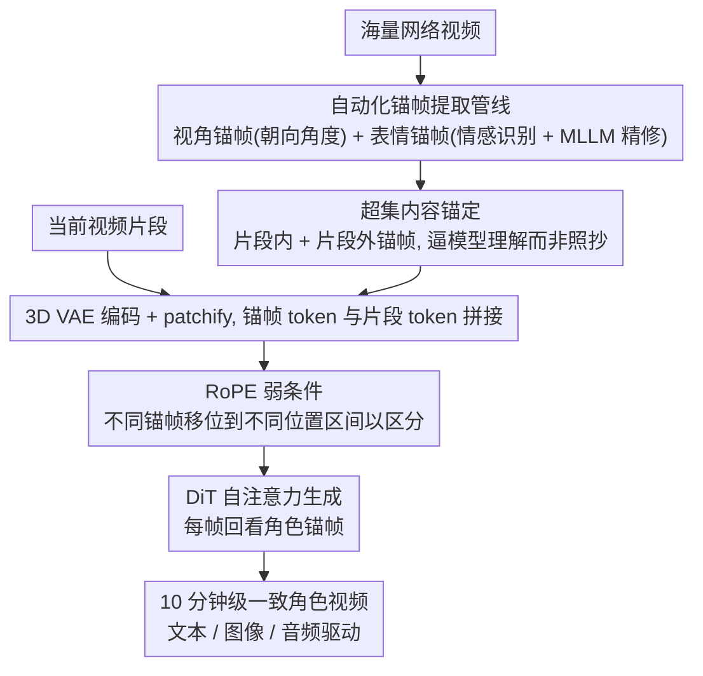

# Gloria: Consistent Character Video Generation via Content Anchors

**会议**: CVPR 2026  
**arXiv**: [2603.29931](https://arxiv.org/abs/2603.29931)  
**代码**: [https://yyvhang.github.io/Gloria_Page/](https://yyvhang.github.io/Gloria_Page/)  
**领域**: 视频理解 / 视频生成  
**关键词**: 角色视频生成, 一致性, 内容锚帧, 扩散模型, 长视频

## 一句话总结

Gloria 提出用一组紧凑的"内容锚帧"（Content Anchors）表征角色的多视角外观和表情身份，通过超集内容锚定（防止复制粘贴）和 RoPE 弱条件（区分多锚帧）两个机制，实现超过 10 分钟的长时一致角色视频生成。

## 研究背景与动机

数字角色视频生成面临长时、多视角外观一致和表情身份一致的三重挑战。现有方法使用单张参考图或文本 prompt，但这些输入包含的角色信息不足以维持长期一致性。部分方法引入预选帧或生成帧作为"记忆"，但这些帧通常不以角色为中心、缺乏语义基础。

**核心洞察**：角色视频生成本质上是一个"外观-看进去"的场景——角色的视觉属性可以用一组结构化的锚帧紧凑表示，而运动则从短视频片段中学习。

**技术挑战**：(1) 如何注入锚帧避免简单复制粘贴；(2) 如何同时使用多个锚帧避免冲突；(3) 如何高效地从大量视频中提取锚帧。

## 方法详解

### 整体框架

Gloria 要解决的是同一个数字角色在十分钟级别的长视频里始终"长得一样、表情对得上"。它的做法是先把角色拆成一小撮**内容锚帧**——几张覆盖整体场景、不同视角、不同表情的代表性图像，当作这个角色的"视觉身份证"，运动则交给视频扩散模型自己从短片段里学。整条链路分三段：先用一套**自动化锚帧提取管线**从海量视频中自动挑出视角锚帧和表情锚帧；训练时把这些锚帧和当前视频片段一起经 3D VAE 编码成 token、拼进同一条序列送进 DiT 的自注意力（self-attention），让模型在生成每一帧时都能"回看"角色应有的样子，并在这里用**超集内容锚定**和 **RoPE 弱条件**两个机制管住注入质量；推理时这套注入机制保持不变，输入端则可以换成文本、参考图或音频来驱动。难点不在于"注入信息"本身，而在于注入得既不能让模型偷懒照抄、又能在塞进多张锚帧时不打架。

### 关键设计

**1. 自动化锚帧提取管线：让"挑锚帧"能规模化**

后面两个机制都建立在"有一批好锚帧"的前提上，而手工从视频里挑视角和表情齐全的代表帧根本无法扩展到训练所需的数据量，所以这条离线管线是整条数据流的起点、也是把方法做实用的前提。它分两路自动产出锚帧：视角锚帧靠 GVHMR 估计角色相对相机的朝向、按夹角阈值归类出正面、背面、左侧、右侧等视角；表情锚帧先用情感识别（EmotiEffLib）在视频里检出不同表情的候选帧，再交给 MLLM（Gemini）做一遍精修、筛掉与目标表情不符的帧（仅情感识别准确率 66%，加上 MLLM 判别提到 82%）。此外还随机采若干捕捉整体场景的全局锚帧。整个流程不需要人介入，因此能直接铺到大规模视频上构建训练集。

**2. 超集内容锚定：逼模型理解锚帧而不是照抄**

有了锚帧后，最直接的注入方式是训练时给一张和当前片段高度对应的锚帧，但这会让模型走捷径——它发现"输出 ≈ 复制最像的那张锚帧"就能把损失压下去，于是退化成最近邻搜索加贴图，一旦视角或表情偏离锚帧就崩。Gloria 的对策是给一个**超集**：每个训练片段拿到的锚帧既有来自片段内部的帧（intra-clip，确实相关），也有回溯到原始长视频、从片段外部采来的同一角色不同时刻的帧（extra-clip，相关但不完全对应）。锚帧里混进了不能直接抄的冗余信息，模型若想用好它们就必须真正读懂"这是同一个角色的脸/衣服"这一语义，而不是停留在像素层面对齐。这一步是整套方法防复制粘贴的关键，消融里去掉它一致性立刻塌、复制痕迹变重。

**3. RoPE 弱条件：让同时塞进来的多张锚帧不打架**

锚帧经 3D VAE 编码、patchify 后与视频片段 token 拼成一条序列送进自注意力，新问题是它们拼在一起后模型分不清谁是谁，几张相互矛盾的外观信息糊在一起反而更乱。Gloria 不另加一套强约束（比如给每张锚帧单独的 cross-attention 头强制一一对应），而是借用模型已有的旋转位置编码（RoPE）：给不同类型的锚帧分配不同的时间偏移、把它们移位到 RoPE 位置坐标的不同区间，模型于是能靠位置线索可靠地把它们区分开。之所以叫"弱"条件，是因为它只提供"这几张是不同来源"的区分提示，并不规定哪张锚帧必须对应输出的哪一部分，留给模型自适应取用的余地。配合混合比例训练（每次随机给 0 到 N 张锚帧），模型既学会了用一张，也学会了协调多张。实验里这种弱区分比强约束效果更好，因为强制一一对应反而限死了灵活性。

### 损失函数 / 训练策略

训练沿用视频扩散模型标准的去噪损失，在预训练视频扩散底座上微调，不额外引入辅助目标。关键技巧是上面提到的混合比例训练：每个样本随机采 0 到 N 张锚帧作为条件，使同一个模型在"无锚帧纯文生视频"到"多锚帧强约束"之间平滑覆盖，推理时才能灵活适配不同输入。

## 实验关键数据

### 主实验

| 方法 | 最长时长 | 多视角一致性 | 表情一致性 | 身份保持 |
|------|---------|------------|-----------|---------|
| WanS2V/FramePack | ~1分钟 | 一般 | 一般 | 一般 |
| Gloria | **10+分钟** | **优秀** | **优秀** | **优秀** |

生成的角色视频超过 10 分钟，在多视角外观和表情身份一致性上超越现有方法。

### 消融实验

| 配置 | 一致性 | 复制粘贴问题 | 说明 |
|------|-------|-------------|------|
| 无超集锚定 | 差 | 严重 | 直接复制最相似锚帧 |
| 无 RoPE 弱条件 | 中等 | 中等 | 多锚帧混淆 |
| 完整 Gloria | 最优 | 无 | 两个机制协同 |

### 关键发现

- 超集锚定是防止复制粘贴的关键——没有它模型会退化为最近邻搜索+复制
- RoPE 弱条件的位置区分效果优于强条件（如不同的 cross-attention 头），后者限制了灵活性
- 自动化锚帧提取管线使得大规模训练数据构建成为可能

## 亮点与洞察

- **锚帧作为角色"身份证"**：用少量代表性帧捕获角色的全部视觉属性，比嵌入向量更直观、比全视频更紧凑
- **超集避免捷径学习**：通过提供冗余+不完全对应的条件，迫使模型学习语义级别的理解而非像素级复制
- **10分钟长视频**：在当前角色视频生成中是显著的时长突破

## 局限与展望

- 锚帧数量有限，对极度复杂的服装细节（如花纹变化）可能不够
- 当前主要面向单角色，多角色场景未充分探索
- 音频驱动的唇形同步质量受限于底层模型
- 未来可探索3D感知的锚帧表示

## 相关工作与启发

- **vs WanS2V (FramePack)**: WanS2V 聚合多帧但缺乏结构化的角色表示，Gloria 提出语义明确的锚帧概念
- **vs Animate Anyone/MagicAnimate**: 这些方法依赖单张参考图，信息量不足以维持长期一致性
- **vs ConsisID/UniAnimate**: 侧重短期一致性，Gloria 实现了10分钟级别的长期一致性

## 评分

- 新颖性: ⭐⭐⭐⭐ 内容锚帧概念和超集锚定机制有创意
- 实验充分度: ⭐⭐⭐⭐ 定性结果丰富，但定量评测可以更全面
- 写作质量: ⭐⭐⭐⭐ 概念阐述清晰
- 价值: ⭐⭐⭐⭐⭐ 对数字人/虚拟角色产业有直接应用价值

<!-- RELATED:START -->

## 相关论文

- [\[CVPR 2026\] First Frame Is the Place to Go for Video Content Customization](first_frame_is_the_place_to_go_for_video_content_customization.md)
- [\[CVPR 2026\] Content-Aware Dynamic Patchification for Efficient Video Diffusion](content-aware_dynamic_patchification_for_efficient_video_diffusion.md)
- [\[CVPR 2026\] MoCha: End-to-End Video Character Replacement without Structural Guidance](mocha_end-to-end_video_character_replacement_without_structural_guidance.md)
- [\[CVPR 2026\] Towards Realistic and Consistent Orbital Video Generation via 3D Foundation Priors](orbital_video_3d_foundation_priors.md)
- [\[CVPR 2026\] One-to-All Animation: Alignment-Free Character Animation and Image Pose Transfer](one-to-all_animation_alignment-free_character_animation_and_image_pose_transfer.md)

<!-- RELATED:END -->
