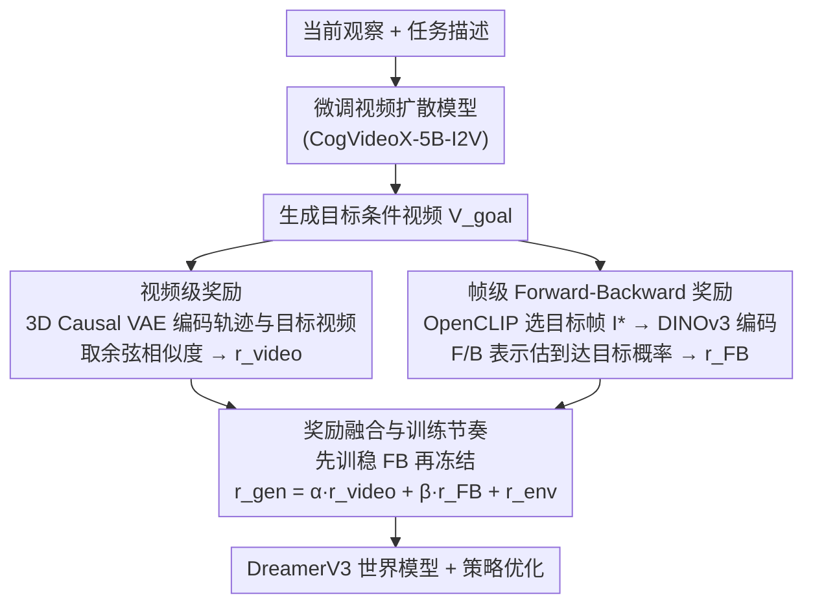

# Goal-Driven Reward by Video Diffusion Models for Reinforcement Learning

**会议**: CVPR 2026  
**arXiv**: [2512.00961](https://arxiv.org/abs/2512.00961)  
**代码**: [https://qiwang067.github.io/genreward](https://qiwang067.github.io/genreward)  
**领域**: 扩散模型 / 强化学习  
**关键词**: 视频扩散模型、目标驱动奖励、强化学习、前向后向表示、世界知识迁移

## 一句话总结
提出 GenReward 框架，利用预训练视频扩散模型生成目标条件视频，通过视频级和帧级两层目标驱动奖励信号引导强化学习智能体，无需手工设计奖励函数即可在 Meta-World 机器人操控任务上显著超越基线。

## 研究背景与动机

**领域现状**：强化学习依赖精心设计的奖励函数来引导策略学习，但设计合适的奖励函数需要领域专业知识，且不同任务间难以泛化。已有方法如 RoboCLIP 通过 VLM 计算文本/视频与观察的相似度作为奖励，Diffusion Reward 用条件扩散模型的熵作为奖励，TADPoLe 用冻结的文本条件扩散模型计算零样本奖励。

**现有痛点**：现有方法没有充分利用生成视频作为目标驱动奖励来迁移生成模型中的丰富世界知识。(1) RoboCLIP 等依赖专家演示视频；(2) Diffusion Reward 只用扩散模型的熵而非生成内容；(3) TADPoLe 不考虑动作信息，无法提供细粒度目标达成指导。这些方法在复杂任务中提供奖励信号的能力有限。

**核心矛盾**：视频扩散模型蕴含丰富的世界知识（如物体如何被操控），但现有工作未找到有效方式将这些知识转化为细粒度、可操作的奖励信号。

**本文目标** (1) 如何利用扩散模型生成的视频在轨迹层面(video-level)提供奖励？(2) 如何在帧层面(frame-level)引导智能体达到特定目标状态？(3) 如何融合动作信息实现更精细的目标达成？

**切入角度**：关键想法是将预训练视频扩散模型微调后用于生成目标条件视频，然后从两个层面利用生成视频：(1) 用视频编码器的潜空间表示衡量轨迹级对齐；(2) 用CLIP选出最相关帧作为目标状态，学习 forward-backward 表示衡量到达目标的概率。

**核心 idea**：用微调的视频扩散模型生成目标视频，通过其编码器计算视频级奖励 + 学习前向后向表示计算帧级奖励，实现无需手工设计的目标驱动强化学习。

## 方法详解

### 整体框架
GenReward 想解决的是「不手工设计奖励、也不依赖专家演示，就让 RL 智能体学会机器人操控」。它的做法是把一个预训练视频扩散模型当成「会脑补成功过程的虚拟专家」：给定当前画面和任务描述，模型生成一段「事情本该如何完成」的目标视频，再把这段视频翻译成两路奖励去引导策略。

整条 pipeline 分三步。先把通用视频扩散模型（CogVideoX-5B-I2V）在领域数据上微调，让它能稳定生成目标条件视频；运行时，智能体每走一段轨迹，就拿自己实际走出的画面序列和生成的目标视频比对，得到一路 **视频级奖励**（整体轨迹像不像）；同时从目标视频里挑出最关键的一帧当作具体目标状态，用一个能预估「当前状态-动作能否到达目标」的表示算出另一路 **帧级奖励**（这一步走得对不对）。两路奖励与环境原始奖励加权相加，

$$r^{\text{gen}} = \alpha \cdot r^{\text{video}} + \beta \cdot r^{\text{FB}} + r^{\text{env}}$$

最终喂给建立在 DreamerV3 世界模型之上的策略优化。

### 关键设计

**1. 视频级奖励：用扩散模型自己的编码器衡量「整段轨迹像不像范例」**

纯靠图像相似度（如 CLIP）做奖励的问题是它只看单帧、不懂动作的时间演化。GenReward 改用视频扩散模型自带的 3D Causal VAE：它把智能体的历史观察序列 $\mathbf{o}_{0:T}$ 和生成的目标视频 $\mathbf{V}^{\text{goal}}$ 各自编码成潜向量 $\mathbf{z}^v$ 和 $\mathbf{z}^{\text{goal}}$，两段长度不齐就都均匀采样 16 帧对齐，再取余弦相似度作奖励：

$$r^{\text{video}} = \cos(\mathbf{z}^v, \mathbf{z}^{\text{goal}})$$

这个编码器经过大规模视频预训练，潜空间天然带着「这串动作在语义上对不对」的理解，所以比图像模型更适合度量时间序列的对齐。为省算力，这路奖励每 128 步在线交互才重算一次。

**2. 帧级 Forward-Backward 奖励：把「能不能到达目标」量化成动作感知的信号**

视频级奖励只管整段轨迹像不像，给不出「这一步该往哪走」的精细指导。于是先用 OpenCLIP 把生成视频里每一帧和任务描述比相似度，挑出得分最高的帧 $I^*$ 当作明确的目标状态；再学一对前向/后向表示——前向 $F: S \times A \times Z \to Z$ 和后向 $B: S \to Z$——让内积 $F(s,a,z)^\top B(s')$ 近似从 $(s,a)$ 出发长期占用到 $s'$ 的概率。帧级奖励就是当前状态-动作对到达目标帧的这个概率：

$$r^{\text{FB}}(s,a,I^*) = F(s,a,\psi(I^*))^\top B(\psi(I^*))$$

其中 $\psi$ 是 DINOv3 编码器，负责把目标帧 $I^*$ 映进表示空间。$F$、$B$ 通过最小化 Bellman 残差、配一个慢速更新的目标网络来稳定训练。和「当前帧到目标帧的视觉距离」这类静态度量相比，FB 把动作纳进来，奖励的是「真能走到目标的动作」而非「看起来接近目标的画面」，这才是真正的目标驱动。

**3. 奖励融合与训练节奏：先把 FB 练稳，再冻结来发奖励**

两路生成奖励都依赖 FB 表示的质量，但 FB 自身在训练早期还在剧烈变化，此时拿它发奖励会让奖励分布漂移、反过来扰乱策略。GenReward 的做法是先用前 100K 步专门训 FB 网络，练稳后冻结，之后只用它推理算奖励。在线交互时每 $\Delta_t$ 步用一次生成奖励 $r^{\text{gen}}$ 顶替环境奖励，其余步仍走原始环境奖励，整个世界模型学习与策略优化都在 DreamerV3 框架内完成。这样既享受了扩散模型的世界知识，又避免奖励信号在训练中途变脸。

### 一个完整示例：Shelf Place 任务

以「把方块放上货架」为例走一遍。智能体先观察到当前桌面画面，微调后的扩散模型据此生成一段「机械臂抓起方块、抬高、推进货架格」的目标视频。智能体随后真实地走出一段轨迹：这段轨迹的 16 帧被 VAE 编成 $\mathbf{z}^v$，目标视频编成 $\mathbf{z}^{\text{goal}}$，余弦相似度告诉它「整体动作走向对不对」——若它把方块举高了但没往货架方向推，$r^{\text{video}}$ 就偏低。与此同时，OpenCLIP 从目标视频里挑出「方块刚好入格」那一帧当 $I^*$，FB 表示评估「我现在的状态-动作能不能最终走到这一帧」，于是「朝货架方向移动」的动作拿到高 $r^{\text{FB}}$、「原地举着不动」的动作拿到低 $r^{\text{FB}}$。两路奖励加上环境奖励引导 DreamerV3 调整策略，最终把该任务的回报从密集奖励基线的 154 推到 814。

### 损失函数 / 训练策略
视频扩散模型微调用标准去噪目标 $\|\hat{\epsilon}_\theta(\mathbf{x}_t, t, c_{\text{text}}, c_{\text{image}}) - \epsilon\|_2^2$；FB 表示靠最小化 Bellman 残差训练，配慢速移动平均的目标网络；策略与价值函数在 DreamerV3 框架下优化。

## 实验关键数据

### 主实验（Meta-World 密集奖励）

| 任务 | Dense Reward | RoboCLIP | Diffusion Reward | TADPoLe | **GenReward** |
|------|-------------|----------|-----------------|---------|---------------|
| Pick Out of Hole | 193 | ~250 | ~300 | ~100 | **582** |
| Bin Picking | 398 | ~500 | ~450 | ~200 | **822** |
| Shelf Place | 154 | ~300 | ~350 | ~100 | **814** |

### 消融实验

| 配置 | 效果（Pick Place） | 说明 |
|------|-------------------|------|
| Full GenReward | 最佳 | 完整模型 |
| w/o video-level reward | 明显下降 | 去掉视频级奖励后智能体无法模仿生成视频行为 |
| w/o FB reward | 中等下降 | 去掉帧级奖励后细粒度目标达成能力降低 |

### 关键发现
- GenReward 在 Pick Out of Hole、Bin Picking、Shelf Place 三个任务上大幅超越原始密集奖励（193→582, 398→822, 154→814）
- TADPoLe 在多数任务中表现最差，说明冻结的文本扩散模型直接做奖励效果有限
- 视频级奖励权重 $\alpha$ 过大或过小都会影响性能（过小无法模仿视频行为，过大阻碍探索）
- 使用不同来源数据集（RT-1、RLBench、Bridge）生成的视频都能带来一致提升，验证了世界知识迁移的鲁棒性
- 帧级目标的选择依赖 CLIP 对任务描述和视频帧的对齐质量

## 亮点与洞察
- 首次将视频扩散模型的生成结果（而非仅其内部表示）作为RL的目标驱动奖励，实现了从"用扩散模型理解世界"到"用扩散模型指导行动"的跨越。这个思路可以迁移到任何需要从演示学习的RL场景
- Forward-Backward 表示的引入让奖励具有动作感知能力，弥补了纯视觉相似度奖励不考虑动力学的缺陷。这种"能到达目标的概率"作为奖励的思路比简单的距离度量更有指导性
- 无需专家演示即可工作（通过扩散模型生成"虚拟专家"），大幅降低了数据需求

## 局限与展望
- 计算开销：需要额外计算视频级和帧级奖励（视频编码 + FB推理），增加了训练成本
- 目标帧选择依赖 CLIP 在特定领域的泛化能力，对于CLIP未见过的场景可能不准确
- 仅在 Meta-World 和 DCS 上验证，这些是相对受控的环境，向真实机器人场景的迁移性未知
- 视频扩散模型需要领域相关的微调数据，对于全新领域可能需要额外收集

## 相关工作与启发
- **vs Diffusion Reward**: Diffusion Reward 用条件扩散模型的熵作为奖励，本文用生成视频的编码器潜空间特征+FB表示，信号更丰富、更有方向性
- **vs RoboCLIP**: RoboCLIP 依赖专家视频/文本的CLIP嵌入作为稀疏奖励，本文提供密集的目标驱动奖励且不需要专家演示
- **vs TADPoLe**: TADPoLe 用冻结文本扩散模型做零样本奖励但效果差，说明仅靠去噪梯度不足以提供有效奖励信号
- **vs UniPi**: UniPi 用文本生成视频再训练逆动力学模型预测动作，本文直接用生成视频提供奖励信号，更直接

## 评分
- 新颖性: ⭐⭐⭐⭐ 视频级+帧级双层奖励设计较新，但各组件理论基础（FB 表示、VAE 编码器相似度）来自已有工作
- 实验充分度: ⭐⭐⭐⭐ 有完整的消融和敏感性分析，但测试环境较简单，缺少真实机器人实验
- 写作质量: ⭐⭐⭐⭐ 方法描述清晰，算法伪代码完整
- 价值: ⭐⭐⭐⭐ 为RL中利用生成模型先验提供了新范式，但实际应用价值取决于向复杂环境的推广

<!-- RELATED:START -->

## 相关论文

- [\[CVPR 2026\] NS-Diff: Fluid Navier-Stokes Guided Video Diffusion via Reinforcement Learning](ns-diff_fluid_navier-stokes_guided_video_diffusion_via_reinforcement_learning.md)
- [\[CVPR 2026\] PropFly: Learning to Propagate via On-the-Fly Supervision from Pre-trained Video Diffusion Models](propfly_learning_to_propagate_via_on-the-fly_supervision_from_pre-trained_video_.md)
- [\[CVPR 2026\] SoliReward: Mitigating Susceptibility to Reward Hacking and Annotation Noise in Video Generation Reward Models](solireward_mitigating_susceptibility_to_reward_hacking_and_annotation_noise_in_v.md)
- [\[NeurIPS 2025\] RLGF: Reinforcement Learning with Geometric Feedback for Autonomous Driving Video Generation](../../NeurIPS2025/video_generation/rlgf_reinforcement_learning_with_geometric_feedback_for_autonomous_driving_video.md)
- [\[CVPR 2026\] Identity-Preserving Image-to-Video Generation via Reward-Guided Optimization](identity-preserving_image-to-video_generation_via_reward-guided_optimization.md)

<!-- RELATED:END -->
