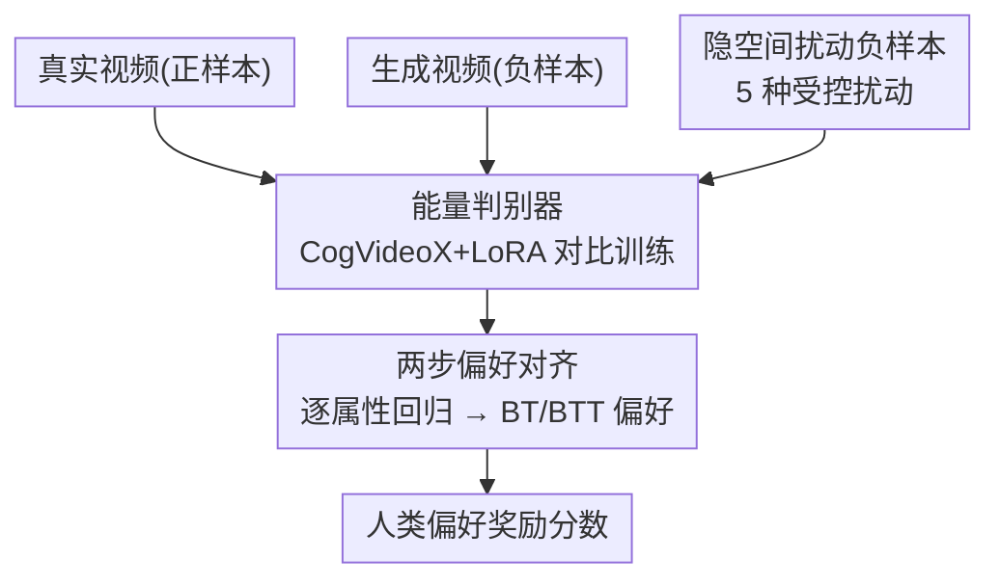

# GT-SVJ: Generative-Transformer-Based Self-Supervised Video Judge For Efficient Video Reward Modeling

**会议**: CVPR 2026  
**论文**: [CVF OpenAccess](https://openaccess.thecvf.com/content/CVPR2026/html/Shekhar_GT-SVJ_Generative-Transformer-Based_Self-Supervised_Video_Judge_For_Efficient_Video_Reward_Modeling_CVPR_2026_paper.html)  
**代码**: https://huggingface.co/sasuke-ss1/GT-SVJ (有)  
**领域**: 视频生成 / 奖励建模 / 自监督  
**关键词**: 视频奖励模型, 能量模型, 对比学习, 时序对齐, RLHF

## 一句话总结
这篇论文把一个现成的视频生成模型（CogVideoX）改造成视频奖励模型——通过能量模型 + 对比学习先训出一个能区分"真实/退化"视频的判别器，再两步对齐人类偏好，仅用 30K 人工标注就在 GenAI-Bench、MonteBench 上超过用几十万到两百万标注的 VLM 奖励模型。

## 研究背景与动机

**领域现状**：要让视频生成模型对齐人类偏好（RLHF / DPO），核心是有一个可靠的奖励模型来给视频打分。当前主流做法是拿一个 Video-Language Model（VLM，如 VideoScore、VisionReward、VideoReward）去微调，让它从一对视频里预测哪个更被偏好。

**现有痛点**：VLM 本质上是为"视频理解"训练的，它把视频当成一堆独立帧的集合，靠注意力机制去*隐式*地拼凑时序结构。这种以帧为中心的偏置导致它对"运动质量、时序平滑度、跨帧一致性"这些微妙的时间线索极不敏感——而这恰恰是区分真实视频和生成视频的关键。更糟的是，VLM 路线要喂大量人工偏好标注（VisionReward 用了 200 万条），既贵又难规模化。

**核心矛盾**：评估视频质量需要的是"对时序动态的细粒度感知"，但被拿来当评估器的 VLM 天生就缺这个能力；而真正擅长建模时序依赖的，其实是视频*生成*模型本身（它们用因果自注意力显式建模 latent token 间的时间依赖）。判别能力被放在了不擅长时序的模型上，时序能力却闲置在了生成模型里。

**本文目标**：(1) 找一个天生懂时序的 backbone 来做奖励模型；(2) 在标注极少的情况下也能训稳、不过拟合到表面线索。

**切入角度**：作者的关键观察是——生成模型可以被重新表述成能量模型（EBM）：给高质量视频赋低能量、给退化视频赋高能量，配合对比目标就能让它变成一个高精度的质量判别器。视频生成模型的表征里本就编码了运动、时序因果和细粒度动态，是比 VLM 更"时序忠实"的骨架。

**核心 idea**：用视频生成模型代替 VLM 当奖励骨架——先用自监督对比学习把它转成能量判别器，再两步对齐人类偏好，用一个数量级更少的标注拿到更好的偏好对齐精度。

## 方法详解

### 整体框架
GT-SVJ 的输入是视频（latent 表示），输出是一个反映人类偏好的标量奖励分。整个框架分两个阶段串行：**第一阶段**把视频生成 backbone（CogVideoX）通过能量对比目标训成一个判别模型（DM），让它学会给真实视频低能量、给"生成视频 + 人为扰动视频"高能量；**第二阶段**复用判别模型的 LoRA 适配器，换上新的预测头，先用 21 个画质维度做逐属性回归对齐人类评分，再用 Bradley-Terry 偏好损失训出最终的标量奖励。难点在于：判别阶段如果只拿"真实 vs 生成"做对比，模型会偷懒去抓真实/合成之间的表面域差，因此第一阶段最关键的设计是用受控隐空间扰动造"看起来真但时序坏掉"的困难负样本。

### 关键设计

**1. 把视频生成模型重构成能量判别器：用对比 EBM 唤醒骨架里的时序判别力**

痛点是 VLM 缺时序感、且要海量标注。作者不另起炉灶，而是把 CogVideoX 这个生成模型直接当判别器骨架：取它的部分 transformer 层 + 一个轻量 MLP 头，把每个 latent 时间步的时空特征聚合成一个标量"能量"。形式上，EBM 通过未归一化的能量函数 $E_\theta(x)$ 定义概率 $P_\theta(x) = \exp(-E_\theta(x))/Z_\theta$，能量越低越"像真实/高质量"。由于配分函数 $Z_\theta$ 不可解，训练改用对比目标：

$$\mathcal{L}_{\text{EBM}} = \mathbb{E}_{x^+ \sim p_{\text{data}}}[E_\theta(x^+)] - \mathbb{E}_{x^- \sim p_{\text{neg}}}[E_\theta(x^-)]$$

即压低真实样本 $x^+$ 的能量、抬高负样本 $x^-$ 的能量；再加一个二次正则 $\mathcal{L}_2 = \mathbb{E}[E_\theta(x^+)^2] + \mathbb{E}[E_\theta(x^-)^2]$ 稳住训练，合成 $\mathcal{L}_{\text{contrast}} = \mathcal{L}_{\text{EBM}} + \beta\mathcal{L}_2$（实验取 $\beta=0.2$）。效率上只在 CogVideoX 最后三分之一的层加 LoRA 适配器（rank $r=8$，$\alpha=8$）做低秩微调。这样做有效，是因为 CogVideoX 的 VAE 是因果的，每个时间步的 latent 都依赖之前所有 latent，于是能量序列天然可解读为一种"时序困惑度"——真实视频能量曲线平滑低方差，生成/退化视频则剧烈波动（论文 Fig. 3），判别信号直接来自骨架本身的时序建模能力，而非外挂的注意力拼凑。

**2. 受控隐空间扰动造困难负样本：逼判别器学时空一致性而非表面域差**

如果第一阶段只用"真实 vs 模型生成"做对比，任务太简单——模型会去抓真实视频和合成视频之间那道明显的域差（光照、纹理等表面线索），而不是真正理解时空一致性，结果就是早期就饱和、梯度迅速归零。作者的解法是对真实视频的 latent 表示 $z=\{z_t\}_{t=1}^T$ 施加五种受控扰动，造出"外观还像真实、但时序/空间被悄悄破坏"的额外负样本，每个视频随机选一种：
- **Frame Shuffle（帧乱序）**：对子集索引 $I$ 做随机置换 $\Pi$，$\tilde{z}_t = z_{\Pi(t)}$，破坏时序顺序但保留逐帧外观，逼模型察觉运动连续性/因果进程被违反。
- **Frame Drop（丢帧）**：把若干非连续时间步替换成前一帧 $\tilde{z}_t = z_{t-1}$，模拟低帧率/损坏视频里的丢帧重复。
- **Noisy Segment Injection（噪声段注入）**：往随机时间片 $[s,e]$ 注高斯噪声 $\tilde{z}_t = z_t + \epsilon_t,\ \epsilon_t \sim \mathcal{N}(0,\sigma^2 I)$，模拟传感器噪声/压缩 artifact，要求模型在局部损坏下仍保持全局时序连贯。
- **Patch Swap（块交换）**：在两个不重叠时间片之间交换一块随机空间区域 $\Omega$，扰动物体轨迹和运动一致性，需要空间+时序联合推理。
- **Temporal Slice Swap（时间片交换）**：交换两个不重叠时间片 $[t_1,t_1+\tau]$ 与 $[t_2,t_2+\tau]$，破坏中-大尺度时序流动但保留帧内容，逼模型识别不合理的长程动态。

此外还以概率 $p$ 随机把视频对截成不同长度，防止过拟合到固定时长。这些扰动之所以有效，是因为它们让负样本和正样本的"表面外观"几乎一致，模型再也没法靠域差偷懒，只能去学细粒度的时空特征——消融显示加了扰动后梯度范数更高更稳、损失下降更平缓，而不加就会早早撞到正则下界、梯度消失（Fig. 6）。

**3. 从判别模型到奖励模型的两步偏好对齐：先逐属性回归，再 Bradley-Terry 偏好排序**

判别器只会区分"真/退化"，还不等于人类偏好。作者复用判别阶段训好的 LoRA 适配器（仍在最后三分之一层），去掉判别头，换上偏好预测头，分两步对齐（沿用 VideoReward 思路）。**第一步逐属性预测（aspect-wise）**：输出 $q \in \mathbb{R}^Q$，对应 $Q=21$ 个画质维度（真实感、平滑度、时序一致性、色彩一致性等，取自 VisionReward 的 21 个标注属性），用 1–5 的 Likert 分数做监督，端到端 MSE 回归到人类评分。**第二步相对偏好预测**：再加一个轻量线性头把 21 维属性分聚合成一个标量奖励，在成对人类偏好上用 Bradley-Terry 损失训练。BT 把"$x^+$ 优于 $x^-$"建模为 $P(x^+ \succ x^-) = \exp(r_\phi(x^+)) / [\exp(r_\phi(x^+)) + \exp(r_\phi(x^-))]$；考虑到人类常有"难分高下"的中立判断，进一步用带平局的 BTT（Bradley-Terry with Ties），引入温度参数 $\gamma$ 和"+1"项把平局概率显式建模进去。这种"先解释性维度回归、再偏好排序"的两步法，既给出可解释的逐属性分，又得到稳定的标量奖励，适合下游 RL/评估；而用判别模型初始化奖励模型本身就提供了更强的归纳偏置——消融里去掉判别模型（No DM）会掉约 5% 对齐精度。

### 损失函数 / 训练策略
- 判别阶段：$\mathcal{L}_{\text{contrast}} = \mathcal{L}_{\text{EBM}} + \beta\mathcal{L}_2$，$\beta=0.2$；正样本约 20K 条 6 秒真实视频片段，负样本约 30K 条多模型生成视频（Gen3、Luma、CogVideoX、OpenSora、VideoCrafter2）+ 扰动负样本；这 50K 视频**无需人工标注**。
- 变长训练：以 $p=0.25$ 随机把片段切成 2–6 秒，学到"时长不变"的表征，缓解固定时长偏置。
- 奖励阶段：在 VisionReward 训练集上用 MSE 回归 21 个属性，再在 regression split 上做偏好微调；同样用 LoRA（$r=8,\alpha=8$）；成对训练时以 $p=0.2$ 截断视频（假设截断后偏好不变）。仅此阶段用到人工标注（30.4K）。

## 实验关键数据

### 主实验
在三个视频偏好 benchmark 上对比（评估方案沿用 Deutsch et al.，数值越高越好）：

| 方法 | 人工标注量 | Backbone | GenAI-Bench (w/ties) | GenAI-Bench (w/o ties) | MonteBench (w/ties) | MonteBench (w/o ties) | VideoReward-Bench (w/ties) | VideoReward-Bench (w/o ties) |
|------|-----------|----------|------|------|------|------|------|------|
| VideoScore | 37.6K | 8B | 49.03 | 71.69 | 49.10 | 54.90 | 41.80 | 50.22 |
| VisionReward | 2000K | 19B | 51.56 | 72.41 | 64.00 | 72.10 | 56.77 | 67.59 |
| VideoReward | 182K | 2B | 49.41 | 72.89 | 54.20 | 62.25 | **61.26** | **73.59** |
| **GT-SVJ** | **30.4K** | 2B | **64.26** | **75.15** | **66.36** | **77.76** | 57.01 | 68.57 |

GT-SVJ 在 GenAI-Bench 上比之前最佳分别高约 24.63%（含平局）/ 3.1%（不含平局），MonteBench 高约 3.68% / 7.85%；VideoReward-Bench 排第二，落后 VideoReward 约 5%（作者归因于该 benchmark 与训练分布存在偏移、且无公开训练数据）。标注量仅 30.4K——比 VideoReward 少约 6×、比 VisionReward 少约 65×。

### 消融实验
| 配置 | 关键现象 | 说明 |
|------|---------|------|
| GT-SVJ (Full) | GenAI 64.26 / MonteBench 66.36 (w/ties) | 完整模型 |
| GT-SVJ (No DM) | GenAI 47.62 / MonteBench 61.82 | 去掉判别模型预训练，掉约 5% |
| GT-SVJ (p=0) | GenAI 49.36 / MonteBench 62.79 | 只用固定时长训练，掉 1–15% |
| 仅真实 vs 生成负样本 | 早期饱和、梯度→0 | 不加扰动负样本，学到平凡解 |
| LoRA 中间三分之一层 | 验证损失最低、精度最高 | 最佳表征适配位置 |
| LoRA 最后三分之一层 | 约 1.5× 更快、精度略降 | 本文实际采用（效率权衡） |

### 关键发现
- **扰动负样本是判别器学到东西的关键**：只用"真实 vs 生成"会让模型几秒钟就撞到正则下界、梯度消失（学到表面域差）；加扰动后梯度范数持续更高、损失平缓下降，证明对比目标变得更难也更有信息量。
- **判别模型预训练带来约 5% 增益**：用判别特征初始化奖励模型提供更强归纳偏置，与"判别式学习能把生成表征转成更适合下游判别的特征"的结论一致。
- **变长训练很重要**：$p=0$（只见 6 秒片段）泛化不到 2 秒等异质时长，掉 1–15%。
- **LoRA 放哪有反直觉之处**：常识认为放最后几层最好，但中间三分之一层验证损失最低、精度最高；本文最终为了 1.5× 训练提速、只牺牲微小精度，仍选最后三分之一层。

## 亮点与洞察
- **"用对的骨架"而非"堆标注"**：把奖励建模的瓶颈从"标注规模"转移到"骨架是否懂时序"，直接复用视频生成模型本身的时序因果建模能力，30K 标注就打过 200 万标注的对手——这是最让人"啊哈"的地方。
- **能量曲线即时序困惑度**：因果 VAE 让每个时间步能量依赖历史 latent，于是能量序列可视化就能直接看出"真实视频平滑、生成视频抖动"，判别信号有了物理解读，不再是黑箱打分。
- **困难负样本的造法可迁移**：五种隐空间扰动（乱序/丢帧/噪声段/块交换/片交换）是"保外观、坏时序"的通用配方，可直接搬到任何需要时序敏感判别的自监督任务（视频异常检测、时序一致性评估等）。
- **判别预训练→奖励微调的两段式**，把"会区分好坏"和"对齐人类偏好"解耦，前者纯自监督不耗标注，后者才用少量标注，是数据高效的范式样板。

## 局限与展望
- 作者承认：与 VLM 评估器不同，GT-SVJ 不提供对话式接口，无法给出自然语言解释/理由，在需要交互式评估的场景受限。
- VideoReward-Bench 上落后 SOTA 约 5%，作者归因于分布偏移 + 无公开训练数据，说明跨 benchmark 泛化仍依赖训练分布是否覆盖目标域。
- 自己发现的：判别阶段依赖 CogVideoX 这一特定 backbone，能量可解读性、扰动有效性是否在其他生成 backbone 上同样成立未充分验证；五种扰动的相对贡献、扰动强度（$\sigma$、$\tau$、截断概率）的敏感性也未细化分析。
- 展望：作者计划扩展到多模态奖励对齐，并探索把生成提示（prompt）引入判别和奖励模型。

## 相关工作与启发
- **vs VLM 奖励模型（VideoScore / VisionReward / VideoReward）**：它们把视频当独立帧集合、靠注意力隐式抓时序，需海量标注；GT-SVJ 用显式建模时序的生成模型当骨架 + 自监督困难负样本，标注少一个数量级且时序更忠实。劣势是没有对话/解释能力。
- **vs 传统视频质量指标（FVD / VBench / FVMD）**：这些是分布级或基于关键点轨迹的统计指标，与人类偏好相关但非可学习的偏好奖励；GT-SVJ 直接输出可用于 RLHF/DPO 的标量偏好奖励。
- **vs DPO 及其扩散变体**：DPO 无需显式奖励函数直接在偏好对上微调生成模型，但主要在图像域；GT-SVJ 提供的是一个独立、时序感知的显式奖励函数，可服务于视频域的偏好优化。

## 评分
- 新颖性: ⭐⭐⭐⭐⭐ 把视频生成模型重构成 EBM 判别器当奖励骨架，角度新颖且自洽。
- 实验充分度: ⭐⭐⭐⭐ 三 benchmark + 多组消融（判别模型/扰动/变长/LoRA 位置）扎实，但扰动强度敏感性、跨 backbone 验证略缺。
- 写作质量: ⭐⭐⭐⭐⭐ 动机推导清晰，能量曲线与梯度消失的可视化把"为什么有效"讲透。
- 价值: ⭐⭐⭐⭐⭐ 标注效率 6×–65× 提升，为视频 RLHF 提供了数据高效的奖励建模范式。

<!-- RELATED:START -->

## 相关论文

- [\[CVPR 2026\] From Static to Dynamic: Exploring Self-supervised Image-to-Video Representation Transfer Learning](from_static_to_dynamic_exploring_self-supervised_image-to-video_representation_t.md)
- [\[CVPR 2026\] SoliReward: Mitigating Susceptibility to Reward Hacking and Annotation Noise in Video Generation Reward Models](solireward_mitigating_susceptibility_to_reward_hacking_and_annotation_noise_in_v.md)
- [\[CVPR 2026\] A Frame is Worth One Token: Efficient Generative World Modeling with Delta Tokens](a_frame_is_worth_one_token_efficient_generative_world_modeling_with_delta_tokens.md)
- [\[CVPR 2026\] Thinking with Frames: Generative Video Distortion Evaluation via Frame Reward Model](thinking_with_frames_generative_video_distortion_evaluation_via_frame_reward_mod.md)
- [\[CVPR 2026\] STARFlow-V: End-to-End Video Generative Modeling with Autoregressive Normalizing Flows](starflow-v_end-to-end_video_generative_modeling_with_autoregressive_normalizing_.md)

<!-- RELATED:END -->
