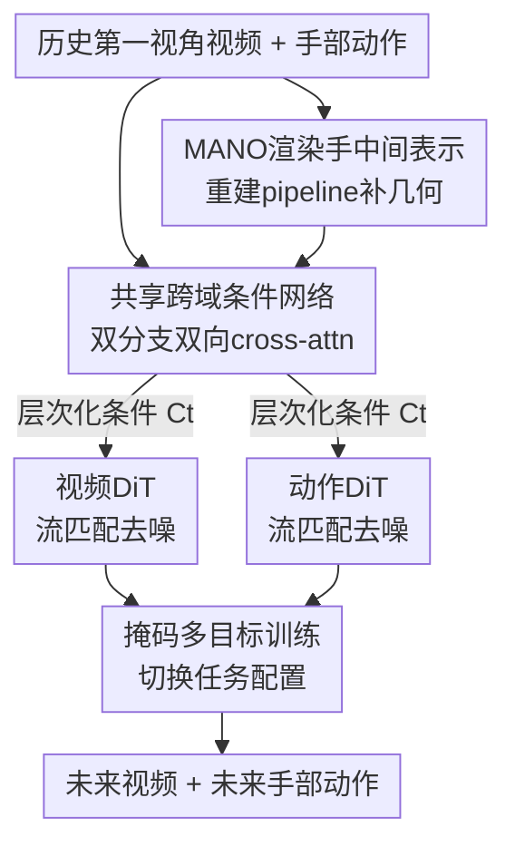

# HandWorld: Hand-Centric Unified Video Action Generation

**会议**: CVPR 2026  
**论文**: [CVF Open Access](https://openaccess.thecvf.com/content/CVPR2026/html/Sun_HandWorld_Hand-Centric_Unified_Video_Action_Generation_CVPR_2026_paper.html)  
**代码**: https://sunzhihao18.github.io/HandWorld （项目页，代码未明确开源）  
**领域**: 视频生成 / 扩散模型  
**关键词**: 手物交互、第一视角视频、动作-视频联合生成、跨域条件、流匹配  

## 一句话总结
HandWorld 用一个共享的跨域条件网络把"手部动作"和"第一视角视频"两个域绑在一起，再各自接一个解耦的扩散 Transformer，配合 MANO 渲染手作为中间桥梁和灵活的多任务训练，从而能在同一个框架里同时做动作条件视频生成和未来手部动作预测，两项都超过现有专用基线。

## 研究背景与动机
**领域现状**：手物交互（HOI）是人和世界打交道的基础——人根据看到的（第一视角视频）决定手怎么动，手一动又改变下一帧看到的。当前研究要么做"手部动作预测"（从过去观测预测未来手部轨迹/姿态），要么做"动作条件视频生成"（用 mask、轨迹、骨架、高层动作标签去控制视频合成），两条线各做各的。

**现有痛点**：这些方法都是**单向条件**——要么把视频当成已知去预测动作，要么把动作当成已知去生成视频，没人把两者放进一个生成过程里联合建模。少数尝试统一架构的工作（VLA 类、统一 latent 类）又主要为"动作策略学习"服务，把视频生成当成附属目标，结果视觉保真度很差；PEVA 虽然探索了全身动作和未来第一视角观测的关系，但聚焦的是导航/移动这种大尺度空间运动，不是精细的手物操作。

**核心矛盾**：动作和观测之间的关系是**高度非线性**的。手部动作是结构化的、只描述运动学动态（手腕姿态 + 关节坐标），而视频是像素级的、编码整个场景（环境、物体、交互）。同一个动作，因操纵物体和周围场景不同，可以对应完全不同的观测。直接让两个异构域互相条件化，模型学不好这种映射。

**本文目标**：构建一个能在手部动作和第一视角视频之间**双向学习与预测**的统一生成框架，且两个域的生成质量都要高。

**切入角度**：作者把"动作定义为连续的手部运动"（而非粗糙的 mask 或离散动作原语），并假设两个域之所以难耦合，是因为缺了一个**既属于视觉域、又只含手部几何**的中间表示来牵线。

**核心 idea**：让两个域**共享同一套跨域条件**（由双分支网络学出），再用两个**解耦**的扩散 Transformer 各自生成——共享条件保证跨域一致性，解耦保证灵活性和推理效率；并引入 MANO 渲染手作为视觉域里的几何桥梁来稳定对齐。

## 方法详解

### 整体框架
HandWorld 的输入是一段历史第一视角视频帧 $O_{0:t}$ 和对应的手部动作序列 $A_{0:t}$，输出是未来的视频帧 $O_{t+1:T}$ 和未来的手部动作 $A_{t+1:T}$。每个动作 $A_t \in \mathbb{R}^{138}$ 编码了相机外参里的 9D 旋转 + 3D 平移，以及双手各 21 个关节的 3D 坐标；视频帧先用预训练 VAE 编码成 latent $Z_t$。

整体在做一件事：把动作和视频的联合分布分解成"先共享一套条件、再各自去噪"。具体三块协同——一个**共享跨域条件网络**从历史的视频+动作里学出层次化条件 $C_t$；一个**视频 DiT** 和一个**动作 DiT** 在 $C_t$ 引导下分别在各自域里做流匹配生成；中间额外塞一个 **MANO 渲染手**作为视觉域里的几何对齐信号。训练时用掩码控制"哪些 token 已知、哪些要预测"，从而一个框架支持多种任务配置。

### 关键设计

**1. 双分支共享跨域条件网络：用一套条件牵住两个异构域**

针对"动作-观测关系高度非线性、直接互相条件化学不好"这个核心矛盾，作者不让视频和动作直接互喂，而是先学一个共享表示 $C_t$ 当中介。条件块里开两条分支：视频分支处理预训练 video VAE 抽出的视觉 latent，动作分支编码手部动作序列；两条分支在**每一层**通过**双向 cross-attention** 互相对齐时序和结构特征，产出层次化条件，再各自过 domain-specific 的 adapter 去精炼并匹配生成端需要的特征尺度。消融里把这个网络换成直接用 ControlNet 注入 MANO 信号（Setup 5），FVD 从 133.9 暴涨到 497.0、IoU 从 0.829 掉到 0.697，说明"共享条件网络"这个中介结构本身就是跨域一致性的来源，而不只是把信号塞进去那么简单。

**2. MANO 渲染手中间表示：在视觉域里造一个只含手几何的对齐锚点**

视频是带环境的整张图、动作是抽象关节坐标，两者太异构。作者引入 MANO 渲染手作为辅助中间表示——它**属于视觉域**（条件网络能直接吃），但**只含手部几何、与环境无关**，因此天然和动作域几何对齐，给条件网络一个"结构化、环境无关"的稳定锚点。问题是现有第一视角数据集都没有高保真 MANO 网格，作者自己设计了一条重建 pipeline：先用多手检测+跟踪拿到每只手的 2D 关键点和 bbox 序列，再用 HaMeR 从每个 bbox 逐帧恢复 3D 手网格，最后剔除离群点并做时序平滑。消融里把 MANO 换成骨架条件（Setup 3 vs 4），FVD 从 245.0 进一步降到 133.9、PSNR 从 25.18 升到 26.27，印证了"骨架太粗、抓不住手指的细微形变，而 MANO 提供物理上更可信的控制信号"。

**3. 两个解耦扩散 Transformer + 层次化共享条件：既同步又各管各的**

把联合转移 $P(A_{t+1:t+n}, Z_{t+1:t+n}\mid C_t)$ 拆成动作和视频两个分量，分别用一个 DiT 在各自域里做流匹配（Rectified Flow）。流匹配把中间 latent 定义为噪声和目标的线性插值 $x_\tau = (1-\tau)x_0 + \tau x_1$，模型 $v_\theta$ 学的是速度场，目标速度就是

$$v_\tau = \frac{dx_\tau}{d\tau} = x_1 - x_0,$$

训练损失是预测速度和真速度的 MSE：

$$L = \mathbb{E}_{x_0, x_1, C_t, \tau}\left[\,\|v_\theta(x_\tau, C_t, \tau) - v_\tau\|^2\,\right].$$

两个 DiT 共享同一套**层次化**条件 $C_t$——在每一层 Transformer，对应层级的条件通过**残差相加**融进 hidden states，实现细粒度控制。解耦的好处在推理时很实在：单域生成（只出视频或只出动作）时只激活对应的那个 DiT，跨域信息仍能从共享条件网络里取到，所以几乎不增加额外开销——49 帧视频生成 33.8s，和 AnimateAnything 的 34.4s 相当，比两阶段的 HANDI（37.5s）还快。

**4. 掩码多目标灵活训练：一套损失覆盖多种任务配置**

要让一个框架同时做"动作条件视频生成"和"动作预测"，作者把每种任务都统一写成"在部分条件下预测未知状态"，对应 Equation 5 同一个损失、只是换 $C_t$ 和目标 $x_1$。条件序列 $C_t$ 里没用到的 token 用对应域的**可学习 mask token**替换：给全部视频帧+历史动作时模型学预测未来动作（动作域监督），给全部动作+历史帧时学预测未来帧（视觉域监督）。动作 DiT 和视频 DiT 按当前任务**选择性更新**，而共享条件网络在所有目标上都被优化，从而把两个域的耦合越练越紧。消融去掉多任务训练（Setup 7），视觉和动作一致性双双变弱，证明跨任务优化确实在强化两域的耦合。

### 损失函数 / 训练策略
核心损失就是上面流匹配的速度 MSE（Equation 5），动作域和视觉域共用同一形式。训练数据用 EgoDex（约 314K 训练 / 3K 评测，194 种桌面操作场景），视频统一缩放到 832×480、最多 49 帧（满足 VAE 的 $T = 1 + 4t$ 约束），动作序列与视频逐帧对齐。视频侧组件（video VAE / text encoder / video DiT）从预训练 Wan2.2-TI2V-5B 初始化，条件网络里视频输入分支的权重也从预训练扩散模型拷过来、adapter 用零初始化以平滑微调；动作 DiT 和动作分支随机初始化。在 2×8 张 H100 上训练。

## 实验关键数据

### 主实验：手部中心的第一视角视频生成
在 EgoDex 上和文本到视频模型、手部感知基线对比，HandWorld（MANO 条件）在视觉质量和手部动作两类指标上全面领先。

| 方法 | 条件 | CLIP↑ | PSNR↑ | SSIM↑ | LPIPS↓ | FVD↓ | CLIPhand↑ | IoU↑ |
|------|------|-------|-------|-------|--------|------|-----------|------|
| AnimateAnything | Text | 0.9152 | 23.97 | 0.867 | 0.210 | 913.9 | 0.8844 | 0.4073 |
| CogVideoX-I2V-5B | Text | 0.8825 | 19.58 | 0.814 | 0.324 | 568.0 | 0.8638 | 0.2770 |
| Wan2.2-TI2V-5B | Text | 0.9306 | 22.86 | 0.842 | 0.223 | 482.3 | 0.9132 | 0.5005 |
| HANDI | Mask | 0.8898 | 23.55 | 0.866 | 0.226 | 1303.9 | 0.8466 | 0.1825 |
| Wang et al. | Skeleton | 0.9031 | 20.73 | 0.804 | 0.297 | 516.1 | 0.8750 | 0.5752 |
| **HandWorld** | **MANO** | **0.9568** | **26.27** | **0.874** | **0.132** | **133.9** | **0.9461** | **0.8291** |

FVD 从次优的 482.3 直接降到 133.9（时序连贯性大幅提升），手部区域 IoU 从 0.575 提到 0.829（手定位精度跳变），说明 MANO 跨域条件带来的是结构性而非边际的改进。

### 手部动作预测
和 X-IL 框架下的模仿学习策略（BC / DDPM / FM × Dec / EncDec）对比 best-of-K 误差，HandWorld + 流匹配在 K=1、K=5 的平均/最终距离上都最低，且单预测和多预测的差距更小（预测更稳定）。

| 模型 | 策略 | Avg Dist (K=1) | Avg (K=5) | Final (K=1) | Final (K=5) |
|------|------|----------------|-----------|-------------|-------------|
| X-IL | EncDec-FM | 0.051 | 0.041 | 0.070 | 0.047 |
| **Ours** | **FM** | **0.044** | **0.039** | **0.051** | **0.045** |

### 消融实验
| 配置 | 条件 | FVD↓ | CLIPhand↑ | IoU↑ | 说明 |
|------|------|------|-----------|------|------|
| [2] Wan2.2 微调 | Text | 482.3 | 0.9132 | 0.5005 | 纯文本基线 |
| [3] HandWorld | Skeleton | 245.0 | 0.9380 | 0.7904 | 联合学习已大幅提升 |
| [4] HandWorld（Full） | MANO | 133.9 | 0.9461 | 0.8291 | 完整模型 |
| [5] w/o 共享条件网络 | MANO | 497.0 | 0.9162 | 0.6966 | 换成 ControlNet 注入，崩盘 |
| [6] w/o 视频 DiT 微调 | MANO | 174.8 | 0.9398 | 0.8077 | 冻结 DiT，时序质量明显变差 |
| [7] w/o 多任务训练 | MANO | 139.2 | 0.9384 | 0.7996 | 去掉跨任务优化，两域一致性变弱 |

### 关键发现
- **共享条件网络贡献最大**：去掉它（Setup 5）FVD 直接从 133.9 飙到 497.0，比纯文本基线还差，说明跨域一致性靠的是这个中介结构而非单纯的条件信号。
- **MANO 比骨架强**：Setup 3→4，骨架条件已经把 FVD 压到 245，但 MANO 进一步压到 133.9，差距来自骨架抓不住手指细微形变。
- **解耦设计几乎零延迟代价**：单域生成只激活一个 DiT，49 帧视频 33.8s，和单分支基线相当，跨域信息仍可从共享网络取到。

## 亮点与洞察
- **"共享条件 + 解耦生成"的组合拳很巧**：既要跨域一致（共享条件强制），又要灵活+高效（解耦让单域推理只跑一个 DiT），两个看似矛盾的目标被这个设计同时拿下，可迁移到任何"两个异构模态要联合生成"的场景。
- **MANO 渲染手作为"视觉域里的几何锚"**这个 trick 最让人啊哈：与其让动作和视频硬对齐，不如造一个既能被视觉网络吃、又只含纯手几何的中间物，把对齐难度卸到一个干净的代理表示上。
- **统一为掩码预测**：把"视频生成""动作预测"全写成"在部分条件下预测未知 token"，用 mask token 切换任务，这种 formulation 让一个模型天然支持多任务，思路可直接搬到其他多模态联合预测任务。

## 局限与展望
- **作者承认的局限**：缺乏物体级监督，模型对小物体可能产生不合理交互（闪烁、消失），物体级时序一致性仍是难点；EgoDex 这类大规模数据集不提供物体标注，难以学物体动态。未来可探索轨迹/接触图监督或鼓励物体一致性的目标。
- **自己发现的局限**：⚠️ 项目页未明确提供开源代码/权重，复现成本未知；对比方法 Wang et al. 是作者根据论文描述自行复现的（无官方代码），公平性需打个问号。评测只在 EgoDex 单一数据集上，跨数据集泛化未验证。
- **改进思路**：把 MANO 重建 pipeline 的思路推广到物体——同样造一个"环境无关的物体几何代理"作为中间表示，或许能缓解物体闪烁问题。

## 相关工作与启发
- **vs 单向条件方法（手部预测 / 动作条件视频生成）**：它们只能从视频预测动作或从动作生成视频，本文把两者放进同一个共享条件的生成过程里双向联合建模，优势是跨域一致、一个框架多任务。
- **vs 统一 VLA / 统一 latent 架构**：那些工作以动作策略学习为主、视频生成是附属目标导致视觉保真度低；HandWorld 用解耦 DiT 让视频和动作都得到充分优化，视觉质量明显更高。
- **vs PEVA**：PEVA 做全身动作到未来观测、聚焦导航/移动等大尺度运动；本文聚焦精细手物交互，动作用连续手部运动表示，控制粒度更细。

## 评分
- 新颖性: ⭐⭐⭐⭐ 共享条件+解耦生成+MANO 几何锚的组合在手物交互联合生成上是新的，但各部件（流匹配、DiT、双向 cross-attn）均为成熟组件。
- 实验充分度: ⭐⭐⭐⭐ 视频生成+动作预测双任务对比 + 7 组消融较完整，但只在 EgoDex 单数据集，且一个基线靠复现。
- 写作质量: ⭐⭐⭐⭐ 问题陈述和方法逻辑清晰，公式和消融对得上；部分手部指标细节甩到附录。
- 价值: ⭐⭐⭐⭐ 为第一视角手物交互的世界模型/动作-视频联合建模提供了一个可用的统一框架，对具身智能仿真有参考价值。

<!-- RELATED:START -->

## 相关论文

- [\[CVPR 2026\] Open-world Hand-Object Interaction Video Generation Based on Structure and Contact-aware Representation](open-world_hand-object_interaction_video_generation_based_on_structure_and_conta.md)
- [\[CVPR 2026\] PerpetualWonder: Long-horizon Action-conditioned 4D Scene Generation](perpetualwonder_long-horizon_action-conditioned_4d_scene_generation.md)
- [\[CVPR 2026\] Chain of Event-Centric Causal Thought for Physically Plausible Video Generation](chain_of_event-centric_causal_thought_for_physically_plausible_video_generation.md)
- [\[CVPR 2026\] Infinity-RoPE: Action-Controllable Infinite Video Generation Emerges From Autoregressive Self-Rollout](infinity-rope_action-controllable_infinite_video_generation_emerges_from_autoreg.md)
- [\[CVPR 2026\] TV2TV: A Unified Framework for Interleaved Language and Video Generation](tv2tv_a_unified_framework_for_interleaved_language_and_video_generation.md)

<!-- RELATED:END -->
