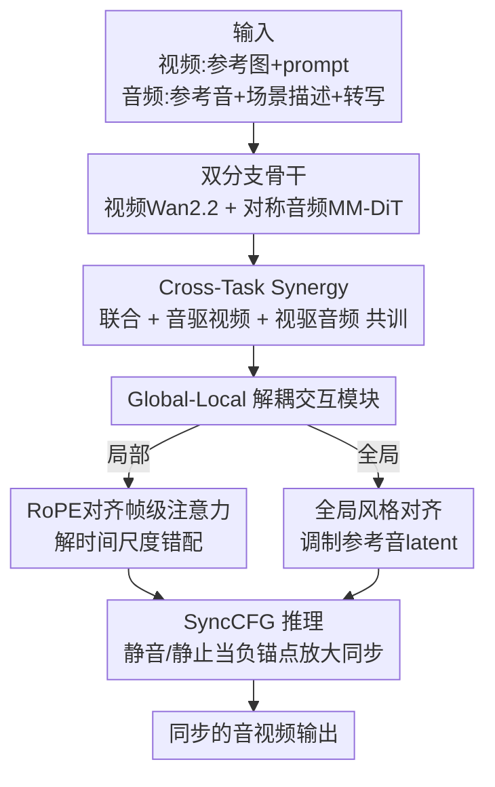

# Harmony: Harmonizing Audio and Video Generation through Cross-Task Synergy

**会议**: CVPR 2026  
**论文**: [CVF Open Access](https://openaccess.thecvf.com/content/CVPR2026/html/Hu_Harmony_Harmonizing_Audio_and_Video_Generation_through_Cross-Task_Synergy_CVPR_2026_paper.html)  
**代码**: [项目页](https://sjtuplayer.github.io/projects/Harmony)（暂未见开源代码）  
**领域**: 扩散模型 / 视频生成 / 音视频联合生成  
**关键词**: 音视频联合生成, 跨任务协同, 音画同步, 解耦注意力, Classifier-Free Guidance  

## 一句话总结
Harmony 把"音频驱动视频 / 视频驱动音频"这两个**单向干净信号**的辅助任务和联合生成主任务一起训练，再配上一个把"时序对齐"和"全局风格"拆开处理的解耦交互模块、以及一个用"静音/静止"作负锚点专门放大同步信号的 SyncCFG，让开源音视频联合生成第一次在精细唇形/动作同步上稳定打过 Ovi、UniVerse-1。

## 研究背景与动机
**领域现状**：联合生成音频和视频是生成式 AI 的前沿。闭源的 Veo 3、Sora 2 已经能产出高保真且音画对齐的内容，但开源社区（MM-Diffusion、JavisDiT、Ovi、UniVerse-1 等）普遍卡在一个点上——**鲁棒的音画对齐**。

**现有痛点**：开源方法要么只能生成环境音、生不出自然人声（MM-Diffusion、JavisDiT），要么只做语音、生不了环境音（JAM-Flow）；即便是更通用的 Ovi、UniVerse-1，也在精细同步（唇形、动作-声音对应）上明显不足。更关键的是，**几乎没人从方法论层面去追问音画为什么对不齐**，大家都在堆架构。

**核心矛盾**：作者把对不齐的根因拆成三条，全都出在"联合扩散过程"本身而非架构容量：
1. **Correspondence Drift（对应漂移）**：联合生成时音频和视频都从纯噪声逐步去噪，早期两路 latent 都极度随机，想在两个**同时演化的噪声信号**之间学一个对应关系，最优映射一直在飘，学习目标不稳、收敛慢。
2. **局部时序 vs 全局风格的架构张力**：精细的帧级时序对齐（唇动）和整体风格一致（情绪、氛围）是两个目标，现有方法用单一的全局 cross-attention 一锅烩，被迫在两者间取折中，哪个都做不好。
3. **CFG 的模态内偏置**：标准 Classifier-Free Guidance 只放大"每个模态各自对条件（文本）的服从度"，**完全不管两个模态之间的对应关系**，对跨模态同步毫无帮助。

**本文目标 / 切入角度**：与其继续加大模型，不如针对这三条根因各开一刀。作者的核心观察是：**音频驱动视频任务（音频是干净无噪的）收敛又快又准，而联合生成慢得多**（Fig. 3 实测同步分），说明"把一个模态锚定成确定性干净信号"能给跨模态交互模块一个稳定梯度。

**核心 idea**：用 audio-driven / video-driven 这两个**带干净监督信号**的单向任务来"灌"对齐先验，对冲联合生成的漂移；再把时序对齐和全局风格在架构上解耦；最后在推理时用"静音/静止"负锚点把同步信号显式放大。

## 方法详解

### 整体框架
Harmony 是一个双分支（dual-branch）的隐扩散框架：视频分支基于预训练的 Wan2.2-5B，音频分支是作者新搭的对称结构。输入侧，视频流以参考图像 + 文本 prompt 为条件，音频流以参考音频 $A_r$（音色/timbre）、声学场景描述 $T_a$、语音转写 $T_s$（音素内容）为条件；输出是一段同步好的音视频。两条分支在每一层通过双向的"全局-局部解耦交互模块"耦合。

整个方法围绕三个创新点展开，分别对冲前面三条根因——**训练范式上**用 Cross-Task Synergy 灌对齐先验；**架构上**用 Global-Local Decoupled Interaction Module 把时序和风格拆开；**推理上**用 SyncCFG 放大同步方向。三者在同一套双分支骨干上叠加。

### 关键设计

**1. Cross-Task Synergy：用干净的单向任务给联合生成灌对齐先验**

直接对冲 Correspondence Drift。联合生成的麻烦在于两路 latent 都是噪声，对应关系学不稳；而如果把其中一路换成**干净（无噪）的 latent**，交互模块就有了稳定的学习梯度。作者据此设计混合训练：在标准联合任务之外，并行训练两个确定性的单向任务——**音频驱动视频**（把音频时间步 $t_a$ 置 0，即音频干净）和**视频驱动音频**（把视频时间步 $t_v$ 置 0）。总损失是三者加权和：

$$\mathcal{L} = \mathcal{L}_{\text{joint}} + \lambda_v \mathcal{L}_{\text{driven}}^{\text{audio}} + \lambda_a \mathcal{L}_{\text{driven}}^{\text{video}}$$

其中联合项同时回归两路噪声 $\|\epsilon_v - \hat\epsilon_v(z_{v,t}, z_{a,t}, c, t)\|^2 + \|\epsilon_a - \hat\epsilon_a(z_{a,t}, z_{v,t}, c, t)\|^2$；音驱项 $\|\epsilon_v - \hat\epsilon_v(z_{v,t}, z_{a,0}, c, t)\|^2$ 用干净音频 $z_{a,0}$；视驱项对称地用干净视频 $z_{v,0}$。两个单向任务学到的对齐知识会作为催化剂，加速并提升联合任务的最终对齐质量。Fig. 3 的实测证实了"干净一侧 → 收敛又快又高"的动机。这里还有个工程细节：音频分支为了保住音素精度，**对转写 $T_s$ 用专门的语音编码器、对场景描述 $T_a$ 用 T5 编码器分开处理**（不同于以往把两者混在一起），参考音 latent $z_r$ 会被前置拼到噪声目标 latent $z_{a,t}$ 上再送进 MM-DiT。

**2. Global-Local Decoupled Interaction Module：把"帧级时序对齐"和"全局风格一致"拆成两个专职模块**

针对第二条根因——单一全局注意力把时序和风格一锅烩导致折中。作者把交互拆成两件互不干扰的事：

*RoPE 对齐的帧级注意力（管局部时序）*：帧级局部注意力比全局 cross-attention 更省也更适合精细对齐，但视频和音频的采样率不同（$T_v \neq T_a$），某模态的一个事件可能落在另一模态两帧之间，强行对齐到最近帧会引入时序抖动。解法是在注意力之前**动态缩放 RoPE 位置索引**统一两个模态的时间坐标系：以 A2V 为例，音频第 $j$ 帧映射到虚拟位置 $j' = j \cdot (T_v / T_a)$ 再算旋转位置编码，使两边位置编码可直接比较。对齐后做对称双向的帧级 cross-attention——每个视频帧 $i$ 只在对面音频里取一个局部上下文窗 $C_{a,i}$ 做注意力 $\Delta z'_v[:,i,:,:] = \text{CrossAttn}(Q_{v,i}, K_{a,i}, V_{a,i})$，再残差并回 $z_v^{\text{updated}} = z_v + \Delta z'_v$，V2A 方向对称。

*全局风格对齐（管整体风格）*：帧级注意力天生看不到全局风格（情绪、氛围）。作者的巧思是**不去直接改目标音频 $z_a$**（怕扰乱它的精细去噪），而是拿参考音 latent $z_r$（本就承载说话人身份/音色）当全局风格的载体，用整段视频 $z_v$ 去调制它——以 $z_r$ 为 query、$z_v$ 为 key/value 做残差 cross-attention：$z_r^{\text{updated}} = z_r + \text{CrossAttn}(Q_r, K_v, V_v)$。这个"看过视频的"参考音再前置拼进 $z_{a,t}$，让音频生成条件在一个视觉接地的全局风格上。把全局风格注入限制在参考 latent 里，正好和帧级时序对齐互不打架。

**3. SyncCFG：用"静音/静止"负锚点把同步方向从 CFG 里单独拎出来放大**

针对第三条根因——标准 CFG 只放大文本服从度，对音画同步无感。标准式 $\tilde\epsilon = \hat\epsilon_\theta(z_{v,t}, z_{a,t}, \emptyset_c) + s(\hat\epsilon_\theta(z_{v,t}, z_{a,t}, c) - \hat\epsilon_\theta(z_{v,t}, z_{a,t}, \emptyset_c))$ 的引导向量只对比"有文本 vs 无文本"，对音视频内部一致性视而不见。作者的关键洞察是设计一个**有意义的负锚点**：表示"声音不存在时视频该长什么样"的静态基线（比如说话人闭嘴的静止脸）。具体借用 cross-task 训出来的 driven 通路，用"静音"音频 $z_{a,0}^{\text{null}}$ 预测视频噪声作为负锚点，引导式变成

$$\tilde\epsilon_v = \hat\epsilon_\theta^{\text{driven}}(z_{v,t}, z_{a,0}^{\text{null}}) + s_v\left(\hat\epsilon_\theta^{\text{joint}}(z_{v,t}, z_{a,t}) - \hat\epsilon_\theta^{\text{driven}}(z_{v,t}, z_{a,0}^{\text{null}})\right)$$

减法项恰好**隔离出由音频引起的视觉变化**（嘴动、物体撞击），放大它就是放大声-动同步。音频侧对称：用"静止视频" $z_{v,0}^{\text{null}}$ 预测出一个静止场景的环境音基线作负锚点，隔离并放大由运动驱动的声音。这样 CFG 从"通用条件放大器"变成了"专打跨模态对应"的定向机制，而且复用的正是 Cross-Task Synergy 训练顺手得到的 driven 能力——三个设计在此闭环。

### 损失函数 / 训练策略
三阶段课程训练：①在全部音频数据上做基础音频预训练；②用多句语音数据做音色解耦微调；③最终的 cross-task 联合音视频训练。视频分支从 Wan2.2 初始化，最终联合阶段训 10,000 步，batch size 128，学习率 1e-5。训练语料超过 400 万音视频片段（OpenHumanVid、AudioCaps、WavCaps + 自采），统一用 Gemini 标注。

## 实验关键数据

### 主实验
在自建 Harmony-Bench（150 例，分 Ambient Sound-Video / Speech-Video / Complex Scene 三档各 50）上对比，三档平均结果：

| 指标类别 | 指标 | Harmony | Ovi | UniVerse-1 | JavisDiT |
|----------|------|---------|-----|------------|----------|
| 视频质量 | AQ ↑ | **0.59** | 0.57 | 0.52 | 0.34 |
| 视频质量 | ID ↑ | **0.91** | 0.90 | 0.89 | 0.38 |
| 音频保真 | PQ ↑ | **6.39** | 6.19 | 5.52 | 5.46 |
| 音频保真 | WER ↓ | **0.15** | 0.49 | 0.24 | 1.00 |
| 音画同步 | Sync-C ↑ | **5.61** | 4.04 | 0.07 | 0.89 |
| 音画同步 | Sync-D ↓ | **7.53** | 9.62 | 10.71 | 11.62 |
| 音画同步 | DeSync ↓ | **0.92** | 1.14 | 1.10 | 1.13 |

最突出的是同步：Sync-C 5.61 远超 Ovi 的 4.04，Sync-D 也是最低（最好）的 7.53，验证了 cross-task synergy 对跨模态一致性的提升。视频质量和音频保真同样拿到 SOTA 或并列最优。

### 消融实验
在人声数据集上逐步叠加各组件（注意：此表与主表用不同数据，同步分不可直接跨表比）：

| GLDI | RoPE | CTS | SyncCFG | Sync-C ↑ | Sync-D ↓ | IB ↑ |
|------|------|-----|---------|----------|----------|------|
| ✗ | ✗ | ✗ | ✗ | 4.20 | 10.93 | 0.13 |
| ✓ | ✗ | ✗ | ✗ | 4.29 | 10.67 | 0.14 |
| ✓ | ✓ | ✗ | ✗ | 4.80 | 10.30 | 0.14 |
| ✓ | ✓ | ✓ | ✗ | 5.09 | 10.16 | 0.15 |
| ✓ | ✓ | ✓ | ✓ | **6.51** | **8.63** | **0.18** |

### 关键发现
- **SyncCFG 贡献最大**：单这一步推理技巧就把 Sync-C 从 5.09 直接拉到 6.51（+1.42），Sync-D 从 10.16 降到 8.63，是单项增益最猛的组件——说明"放大同步方向"这个推理侧操作性价比极高，几乎不增训练成本。
- **RoPE 对齐解时间尺度错配确有用**：Sync-C 从 4.29 提到 4.80，证明音视频采样率不一致带来的时序抖动是个真问题。
- **每个组件都正向**：GLDI → RoPE → CTS → SyncCFG 单调提升，作者据此论证"靠方法论而非单纯堆模型规模"取胜。
- 定性上（Fig. 5），唇形例子里 Ovi、UniVerse-1 都对不上口型；音乐例子里 UniVerse-1 生成无关噪声、Ovi 音乐对但动态弱，Harmony 的曼陀林演奏动作与丰富旋律动态同步。

## 亮点与洞察
- **"用干净信号锚定一侧"是治漂移的关键直觉**：把对不齐归因为训练动力学（两路噪声同时演化）而非架构容量，再用 audio/video-driven 这两个本就存在、且天然带干净监督的任务来灌先验——这个迁移思路（拿一个简单确定性任务给难任务做脚手架）可推广到任何"两个随机变量互相对齐"的联合生成场景。
- **负锚点工程化 CFG**：把 CFG 的负条件从"空文本"换成"静音/静止"这种语义上的零基线，让减法项恰好等于"被对面模态激发出来的那部分动态"，本质上是用 CFG 做了一次跨模态的因果隔离——很巧，且只在推理用、零训练开销。
- **参考音 latent 当全局风格载体**：不动目标音频、只调制参考音，把全局风格注入和精细去噪解耦开，是个可复用的"别污染主信号"技巧。
- 三个设计还彼此咬合：SyncCFG 直接复用 Cross-Task Synergy 训出来的 driven 通路，省掉了为做引导单独训一套网络。

## 局限与展望
- **依赖大规模数据和强骨干**：400 万片段 + Wan2.2-5B 初始化，复现门槛高；论文未给消融"数据规模 / 骨干强度"对最终对齐的影响。
- **评测基准自建**：Harmony-Bench 是作者自己提的 150 例基准，虽然分了三档复杂度，但与其它工作横向比时存在自家基准的潜在偏好（⚠️ 各方法的 Sync-C 绝对值依赖 SyncNet 类检测器，跨论文绝对数值需谨慎对待）。
- **超参 $\lambda_v, \lambda_a, s_v, s_a$ 敏感性未充分展开**：cross-task 三任务的权重平衡和 SyncCFG 的引导强度都是关键超参，正文未给敏感性分析。
- **未开源**：截至笔记仅见项目页，暂无可运行代码。

## 相关工作与启发
- **vs Ovi**：Ovi 同样能联合生成人声+环境音，但用单一全局 cross-attention，时序同步弱（Sync-C 4.04）。Harmony 把时序/风格解耦 + cross-task 灌先验 + SyncCFG，同步显著更强（5.61）。
- **vs UniVerse-1**：UniVerse-1 集成了更强的音频合成组件，但音画同步差（主表 Sync-C 仅 0.07）。Harmony 直击"对齐"这一根因。
- **vs JAM-Flow**：JAM-Flow 只做语音、生不了环境音；Harmony 覆盖语音+环境音+音乐全谱，且保持同步。
- **vs JavisDiT / MM-Diffusion**：早期联合方法只能生成粗粒度环境音、生不出自然人声，且同步差；Harmony 用分离文本编码器保住音素精度，能稳定生人声。

## 评分
- 新颖性: ⭐⭐⭐⭐⭐ 把音画对不齐归因到训练动力学三条根因，并各开一刀（cross-task 灌先验 / 解耦交互 / 负锚点 CFG），方法论清晰且互相咬合。
- 实验充分度: ⭐⭐⭐⭐ 主表+逐组件消融充分，但基准自建、关键超参敏感性和数据规模消融偏少。
- 写作质量: ⭐⭐⭐⭐⭐ 根因分析—动机实证（Fig. 3）—三设计对应三根因，逻辑闭环、可读性强。
- 价值: ⭐⭐⭐⭐⭐ 开源音视频联合生成在精细同步上首次稳定超过 Ovi/UniVerse-1，SyncCFG 这类零训练开销技巧实用性高。

<!-- RELATED:START -->

## 相关论文

- [\[CVPR 2026\] UniAVGen: Unified Audio and Video Generation with Asymmetric Cross-Modal Interactions](uniavgen_unified_audio_and_video_generation_with_asymmetric_cross-modal_interact.md)
- [\[CVPR 2026\] VABench: A Comprehensive Benchmark for Audio-Video Generation](vabench_a_comprehensive_benchmark_for_audio-video_generation.md)
- [\[CVPR 2026\] UnityVideo: Unified Multi-Modal Multi-Task Learning for Enhancing World-Aware Video Generation](unityvideo_unified_multi-modal_multi-task_learning_for_enhancing_world-aware_vid.md)
- [\[CVPR 2026\] UniTalking: A Unified Audio-Video Framework for Talking Portrait Generation](unitalking_a_unified_audio-video_framework_for_talking_portrait_generation.md)
- [\[CVPR 2026\] InfinityHuman: Towards Long-Term Audio-Driven Human Animation](infinityhuman_towards_long-term_audio-driven_human_animation.md)

<!-- RELATED:END -->
