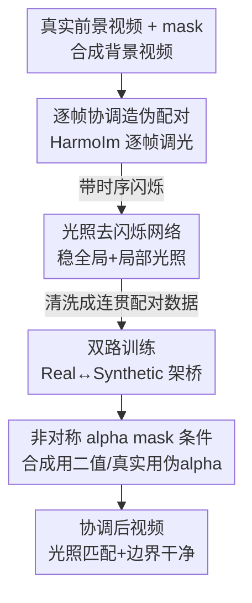

# HarmoVid: Relightful Video Portrait Harmonization

**会议**: CVPR 2026  
**arXiv**: [2605.28811](https://arxiv.org/abs/2605.28811)  
**代码**: https://chedgekorea.github.io/HarmoVid (项目主页)  
**领域**: 视频生成 / 扩散模型 / 视频协调(Harmonization)  
**关键词**: 视频协调, 重光照, 时序一致性, 去闪烁, 视频扩散

## 一句话总结
HarmoVid 用「逐帧协调 → 去闪烁 → 双路训练」的两阶段数据 + 模型方案，在没有真实配对数据的前提下，把前景人像视频的光照、阴影、色调协调到目标背景，做到时序稳定、边界干净、重光照表现力强。

## 研究背景与动机

**领域现状**：图像协调(image harmonization)已经比较成熟——把合成/插入的前景区域调整到与背景一致的光照、色调。但视频协调因为多了时间维度，一直是难题。最直接的做法是把图像协调模型逐帧套到视频上。

**现有痛点**：逐帧处理会引入严重的**时序闪烁**(temporal jitter)——同一段表演在相邻帧上被独立地调光，导致全局色调跳变和局部阴影/高光抖动，视觉上非常刺眼。而要训练一个真正的视频协调模型又卡在**配对数据稀缺**：你没法让一个人在不同光照/背景下把完全相同的动作、表情、姿态重演一遍，所以「同一段视频在不同光照下」的标注配对在现实中几乎无法采集、不可扩展。

**核心矛盾**：合成数据可以规模化、覆盖丰富的光照，但缺乏真实感和真实的时序行为；真实视频有自然光照和阴影、能提供时序监督，却缺乏多样的、富表现力的重光照效果。两个域各有所长又各有短板，单靠任一域都训不出「既真实又有表现力」的模型。此外现有生成式方法常出现 **identity shift**(无意中改掉前景/背景内容)，且对输入 mask 质量极度敏感，mask 不完美时边界就出现伪影。

**本文目标**：在**不需要真实配对数据**的前提下，造出一个视频协调模型，同时满足四个性质——(a) 保前景/背景的身份与纹理，(b) 时序一致，(c) 对不完美 mask 鲁棒，(d) 跨场景的高保真重光照表现力。

**核心 idea**：先用「逐帧协调」造出带闪烁的伪配对数据，再用一个**专门的光照去闪烁网络**把它清洗成时序连贯的高质量数据，最后让视频协调模型在「真实视频 + 精炼后的合成视频」上做**双向(双路)训练**，把真实域的物理合理性和合成域的光照表现力合二为一。

## 方法详解

### 整体框架

HarmoVid 的核心不是某个新网络结构，而是一套「先造数据再训模型」的三步流水线。输入是一段前景人像视频 + 其 mask + 一段目标背景视频，输出是协调后的视频(前景光照/阴影/色调匹配背景，且内容、身份、时序都保住)。

整条管线分三步：**第一步**把真实前景合成到合成背景上，逐帧套用现成图像协调模型 HarmoIm，得到一批「伪配对」但带闪烁的中间合成数据；**第二步**训练一个光照去闪烁网络，把上一步的闪烁视频清洗成时序连贯的高质量配对数据;**第三步**训练最终的视频协调模型 HarmoVid，它和去闪烁网络共用同一套 3D 扩散 Transformer 架构(基于 CogVideoX 的 DiT)，通过 Real→Synthetic / Synthetic→Real 两条训练路径在真实域与合成域之间架桥。前景 mask 在两条路径上采用**非对称**条件方式(合成路用二值 mask、真实路用伪 alpha mask)。

### 关键设计

**1. 富表现力伪配对数据生成：用逐帧协调把"没有配对"变成"有伪配对"**

视频协调最大的拦路虎是拿不到真实配对数据。作者绕过这一点：把真实前景视频 $V_F^R$ 合成到由视频生成器造出的、含多样光照的合成背景 $V_B^S$ 上(前景 mask 用 Grounded-SAM-2 以提示词 "the main character (human)" 提取)，再对合成结果**逐帧**套用预训练图像协调模型 HarmoIm：

$$V^S = \text{HarmoIm}(V_F^R, V_B^S, V^M)$$

这样就批量造出了大规模伪配对集合 $\{(V^S, V^R)\}$——合成侧 $V^S$ 提供丰富的、表现力强的光照效果，真实侧 $V^R$ 提供自然光照和时序真值。它解决的是"没数据"的根本问题，但逐帧独立处理必然带来时序不一致，这正是下一个设计要清理的烂摊子。

**2. 光照去闪烁网络：专治逐帧协调留下的全局+局部光照抖动**

逐帧造出来的数据有闪烁——既有全局色调跳变，也有局部阴影/高光的快速抖动。直接套通用视频去闪烁模型(如 BVD)只能稳住全局帧间闪烁，搞不定局部光照变化。作者为此训了一个**专门**的光照去闪烁网络，基于 CogVideoX 的 3D 隐空间扩散 Transformer，把 DiT 扩展到联合建模空间与时间，从而同时压住全局色调和局部阴影的抖动。它学的是给定闪烁视频和前景 mask 去预测噪声：

$$\mathcal{L}_{\text{deflicker}} = \mathbb{E}_{t,\epsilon}\big[\|\epsilon - \epsilon_\theta(z^I, z^T_t, V^M, t)\|_2^2\big]$$

其中 $z^I = \mathcal{E}(V_{\text{comp}}^S)$ 是合成 composite 的隐表示、$z^T = \mathcal{E}(V^R)$ 是真实目标的隐表示(均由 3D-VAE 编码)，向 $z^T$ 按时间步 $t$ 加高斯噪声。训练好后，把第一步逐帧协调得到的 $V^S$ 和 mask 喂进去，输出时序连贯、闪烁显著减少的 $\hat V^S$，从而把"脏"的伪配对升级成"干净"的高质量配对数据。3D 联合建模时空、而非逐帧滤波，是它能压住局部光照抖动的关键

**3. 双路训练：让模型在真实域与合成域之间双向架桥**

数据有了，但真实域和合成域之间存在分布鸿沟。HarmoVid(与去闪烁网络同架构)在隐空间预测噪声重建协调视频：

$$\mathcal{L}_{\text{harm}} = \mathbb{E}_{t,\epsilon}\big[\|\epsilon - \epsilon_\theta(z^I, z^B, z^T_t, V^M, t)\|_2^2\big]$$

它根据数据组织方式走两条互补路径：**Real→Synthetic** 路把真实前景 $V_F^R$ 合成到合成背景上去生成合成协调视频，目的是保住图像协调模型原本捕获的、表现力强的重光照与阴影能力；**Synthetic→Real** 路则把合成视频的前景(背景先用 inpainting 去掉)合成到真实背景 $V_B^R$ 上去重建真实协调视频，从而把真实视频里的时序连贯性、物理上合理的阴影/光照调整学进来。两条路径合在一起，模型既继承了合成域的光照表现力，又继承了真实域的物理合理性和时序稳定性,这是它"既真实又有表现力"的来源

**4. 非对称 alpha mask 条件：用伪 alpha mask 学出干净的边界**

实际工作流里 mask 往往不完美，二值 mask 会在边界(尤其头发这种细碎区域)留下生硬伪影。作者的做法是在两条训练路径上**非对称**地用 mask：合成路径用二值 mask $V^M$，真实路径用**伪 alpha mask** $V^{\tilde\alpha}$——它对前景边界做平滑衰减。因为真实视频天然提供完美的边界融合真值，在 Synthetic→Real 路径上用伪 alpha mask 学习，就能让模型学会平滑的前景-背景过渡，对合成与协调过程中不完美的分割保持鲁棒。这一招让 HarmoVid 在头发等复杂边界上仍保持干净的融合，是它边界质量明显优于对手的直接原因

### 损失函数 / 训练策略

去闪烁网络与协调网络都用标准 L2 扩散损失(预测噪声)，分别为上面的 $\mathcal{L}_{\text{deflicker}}$ 与 $\mathcal{L}_{\text{harm}}$。训练在 8 张 A100 上跑 8 小时、共 1,200 次迭代。数据来自 10,000 段人像视频(每段采 100 帧，留 200 段作测试)，前景与 mask 由 Grounded-SAM-2 提取。推理时对长于 85 帧的视频采用时序 MultiDiffusion，支持长序列的高质量协调。

## 实验关键数据

### 主实验

在由真实人像数据集 + LUT 构造的合成测试集上，对比图像/视频协调 SOTA(指标含协调质量、时序一致性、用户研究)：

| 方法 | PSNR ↑ | SSIM ↑ | LPIPS ↓ | RMSE ↓ | CLIP Score ↑ | Motion Pres. ↓ | 用户·时序 ↑ | 用户·ID ↑ | 用户·协调 ↑ |
|------|--------|--------|---------|--------|--------------|----------------|-------------|-----------|-------------|
| IC-Light | 14.77 | 0.8889 | 0.0828 | 0.1881 | 0.9895 | 1.2928 | 56% | 57% | 27% |
| Relightful Harmonization | 15.89 | 0.9301 | 0.0581 | 0.1643 | 0.9907 | 1.0021 | 36% | 50% | 36% |
| RelightVid | 15.70 | 0.9214 | 0.0707 | 0.1711 | 0.9946 | 0.7096 | 35% | 51% | 27% |
| Light-A-Video | 15.64 | 0.8900 | 0.0791 | 0.1716 | 0.9955 | 0.5775 | 56% | 58% | 51% |
| **Ours (HarmoVid)** | **17.91** | **0.9306** | **0.0554** | **0.1325** | **0.9963** | **0.5264** | **82%** | **78%** | **72%** |

HarmoVid 在所有客观指标上领先：PSNR 17.91(次优 15.89，+2.02)，RMSE 0.1325(次优 0.1643)，Motion Preservation 0.5264(越低越好)。用户研究(33 名参与者)三项偏好率 82% / 78% / 72%，远超对手。

### 去闪烁对比与消融

**去闪烁(vs 通用基线 BVD)**——在两类闪烁数据上评测：

| 设置 | 方法 | CLIP Score ↑ | Motion Pres. ↓ |
|------|------|--------------|----------------|
| 逐帧 LUT 色彩抖动 | BVD | 0.9950 | 0.5114 |
| 逐帧 LUT 色彩抖动 | **HarmoVid** | **0.9967** | **0.3630** |
| 逐帧协调输出 | BVD | 0.9920 | 1.3439 |
| 逐帧协调输出 | **HarmoVid** | **0.9936** | **0.5395** |

**两阶段(Stage 2 去闪烁 / Stage 3 双路训练)消融**：

| Stage 2 | Stage 3 | SSIM ↑ | LPIPS ↓ | CLIP Score ↑ | Motion Pres. ↓ |
|---------|---------|--------|---------|--------------|----------------|
| – | ✓ | 0.9187 | 0.0613 | 0.9911 | 0.9376 |
| ✓ | – | 0.9217 | 0.0594 | 0.9937 | 0.5490 |
| **✓** | **✓** | **0.9306** | **0.0554** | **0.9963** | **0.5264** |

**伪 alpha mask 消融**(无真值时用免参考、聚焦边界的指标)：

| pseudo-α | Laplacian Var ↑ | Tenengrad ↑ |
|----------|-----------------|-------------|
| – | 66.106 | 2611.501 |
| ✓ | **79.098** | **3324.573** |

### 关键发现
- **Stage 2 不可省**：去掉去闪烁(只留 Stage 3)时，训练配对中一侧闪烁会让联合建模时空的 DiT 学不到稳定时序表示，协调质量"几乎完全缺失"(表 3 第 1 行 Motion Pres. 高达 0.9376)。
- **Stage 3 不可省**：只用去闪烁网络做协调(绕过双路训练)能压住短时闪烁，但出现长时不一致(光照/色调缓慢漂移)，且缺少真实视频联合训练时输出不够自然；推理时 Stage 2 也无法独立使用,因为它依赖 Stage 1 先做逐帧处理。两阶段互补。
- **伪 alpha mask 提升边界质量**：边界聚焦的 Laplacian Variance 从 66.1→79.1、Tenengrad 从 2611.5→3324.6,在头发等复杂区域细节保留更好。
- **泛化性**：只在人像前景上训练，却能直接迁移到非人像前景物体。

## 亮点与洞察
- **"造数据"比"造模型"更关键**：本文真正的创新是把无配对问题转化成"逐帧造伪配对 → 专门去闪烁清洗"的数据炼制流程，模型本身复用 CogVideoX 架构。这个思路可迁移到任何缺配对数据的视频到视频任务。
- **专用去闪烁 vs 通用去闪烁**：用 3D DiT 联合建模时空、专门针对光照闪烁训练，能压住通用方法搞不定的局部阴影/高光抖动——把"通用工具不够用"做成一个独立可训练模块，是很实用的工程洞察。
- **非对称 mask 条件很巧**：让真实路用平滑伪 alpha、合成路用二值 mask,利用"真实视频自带完美边界真值"这一事实学出干净边界,几乎零额外成本却显著改善头发等难点区域。
- **双路训练把两个域的长处缝在一起**：Real→Synthetic 保表现力、Synthetic→Real 保物理合理与时序——这种"双向映射桥接域差"的范式对 sim-to-real 类问题有借鉴意义。

## 局限与展望
- **依赖现成图像协调模型 HarmoIm**：伪配对数据的光照表现力上限被 HarmoIm 决定,若它在某些光照下出错,会被去闪烁和后续训练继承。
- **合成背景由视频生成器造**：背景多样性与真实感受限于所用生成器,极端/罕见光照场景可能覆盖不足。
- **训练规模有限**：1,200 迭代、8 小时,数据集聚焦人像(虽展示了非人像泛化,但未系统量化非人像、强反光材质等场景)。
- **改进思路**：可探索把图像协调先验换成更强/可控的重光照模型,或引入显式 HDR/光照估计条件,进一步提升物理可控性。

## 相关工作与启发
- **vs Relightful Harmonization (HarmoIm)**：它是逐帧图像协调,本文把它当作伪配对数据的"原料"并叠加去闪烁 + 视频训练,解决其逐帧带来的反射闪烁和时序不一致(PSNR 15.89→17.91)。
- **vs RelightVid**：两者都显式以背景为条件,但 RelightVid 用前景增强(而非配对)来适配真实世界,难以充分捕获真实光照交互;本文用真实视频提供监督,ID 保持与时序稳定性更好(用户·ID 51%→78%)。
- **vs Light-A-Video**：它把图像协调模型转成无训练的视频协调,本文是有训练的专用模型,在边界干净度和协调自然度上明显占优(用户·协调 51%→72%)。
- **vs 通用去闪烁 BVD**：BVD 只稳全局帧闪烁、会丢空间细节/光照效果,本文的光照去闪烁网络稳全局+局部且少丢细节(Motion Pres. 在逐帧协调设置 1.3439→0.5395)。

## 评分
- 新颖性: ⭐⭐⭐⭐ "逐帧造伪配对 → 专用去闪烁 → 双路训练"的数据炼制范式解决无配对难题,角度新颖实用。
- 实验充分度: ⭐⭐⭐⭐ 主对比 + 去闪烁对比 + 两组消融 + 用户研究 + 泛化,覆盖全面;但训练规模和非人像量化偏少。
- 写作质量: ⭐⭐⭐⭐ 动机和四性质(a-d)梳理清晰,流水线和双路训练讲得明白。
- 价值: ⭐⭐⭐⭐ 影视/视频编辑/AR 的实用刚需,数据稀缺破解思路对相关视频任务有迁移价值。

<!-- RELATED:START -->

## 相关论文

- [\[CVPR 2026\] PersonaLive! Expressive Portrait Image Animation for Live Streaming](personalive_expressive_portrait_image_animation_for_live_streaming.md)
- [\[CVPR 2026\] PerformRecast: Expression and Head Pose Disentanglement for Portrait Video Editing](performrecast_expression_and_head_pose_disentanglement_for_portrait_video_editin.md)
- [\[CVPR 2026\] FaceCam: Portrait Video Camera Control via Scale-Aware Conditioning](facecam_portrait_video_camera_control_via_scale-aware_conditioning.md)
- [\[CVPR 2026\] FlashPortrait: 6× Faster Infinite Portrait Animation with Adaptive Latent Prediction](flashportrait_6x_faster_infinite_portrait_animation_with_adaptive_latent_predict.md)
- [\[CVPR 2026\] UniTalking: A Unified Audio-Video Framework for Talking Portrait Generation](unitalking_a_unified_audio-video_framework_for_talking_portrait_generation.md)

<!-- RELATED:END -->
