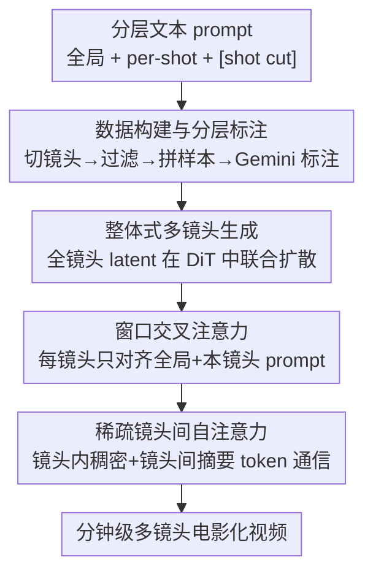

# HoloCine: Holistic Generation of Cinematic Multi-Shot Long Video Narratives

**会议**: CVPR 2026  
**论文**: [CVF Open Access](https://openaccess.thecvf.com/content/CVPR2026/html/Meng_HoloCine_Holistic_Generation_of_Cinematic_Multi-Shot_Long_Video_Narratives_CVPR_2026_paper.html)  
**代码**: 项目页 holo-cine.github.io  
**领域**: 视频生成 / 多镜头长视频叙事  
**关键词**: 多镜头视频生成、整体式生成、窗口交叉注意力、稀疏镜头间自注意力、分钟级长视频

## 一句话总结
HoloCine 在 Wan2.2 这类 DiT 视频扩散模型上，用「窗口交叉注意力」把每个镜头对齐到自己的分镜文本、用「稀疏镜头间自注意力」把全序列自注意力的二次复杂度降到近线性，从而**一次性整体生成**一整场分钟级、角色一致、可精确控制转场的多镜头电影化叙事。

## 研究背景与动机
**领域现状**：文本到视频（T2V）在扩散模型和 DiT 的推动下已能生成高保真单镜头短片（5 秒级），但电影、剧集、纪录片都不是单一长镜头，而是由一系列分镜剪辑成的连贯叙事。从单片生成迈向"场景级、多镜头"合成，是下一个主要挑战，作者称之为弥合"叙事鸿沟"。

**现有痛点**：现有多镜头方案大多是**解耦生成**——要么一块一块（chunk-by-chunk）自回归生成，要么先做关键帧再独立补成镜头。即便用角色/场景信息做条件，单镜头的生成仍基本相互独立，导致长程一致性差、误差累积、一致性漂移（角色身份、背景细节随时间退化）。新兴的**整体式（holistic）**路线（如 LCT）把整段多镜头联合建模、天然保全局一致，却带来两个硬约束：一是**精控难**——每个镜头的指令会被整段 prompt"稀释"；二是**算力爆炸**——自注意力随序列长度二次增长，使分钟级长视频几乎不可行。

**核心矛盾**：整体式建模的"全局一致"和"精确分镜控制 + 可负担的算力"之间存在张力——联合建模越彻底，单镜头指令越被稀释、序列越长、注意力越贵。

**本文目标**：在保留整体式一致性的前提下，解决两件事：(1) 让每个镜头精确听从自己的分镜指令并执行干脆的转场；(2) 把注意力成本压到能做分钟级生成。

**切入角度**：作者观察到"镜头内一致"和"镜头间一致"需要的信息不一样——镜头内要稠密的逐帧时序建模保运动连续，镜头间只需保住角色/环境/风格的持续，不必每帧对每帧。据此可以设计一种结构化稀疏。

**核心 idea**：用「窗口交叉注意力把文本控制局部化 + 稀疏镜头间自注意力把全局通信压成摘要 token」两个专用机制，让整体式生成既精确可控又能扩展到分钟级。

## 方法详解

### 整体框架
HoloCine 的输入是一个**分层文本 prompt**（一个全局 prompt 描述整场的人物/环境/剧情，加一串 per-shot prompt 描述每个镜头的动作/运镜/出场角色，用特殊的 `[shot cut]` 标签分隔镜头边界），输出是一整段多镜头视频。它建在 14B 的 Wan2.2 DiT 视频扩散模型上，**所有镜头的 latent 在扩散过程中被同时联合处理**（整体式），靠共享自注意力天然维持角色身份、背景、风格的长程一致。在这个整体式骨架上插入两个专用机制：**窗口交叉注意力**负责把每个镜头的视觉 token 只对齐到"全局 prompt + 该镜头自己的 prompt"，提供精确分镜控制与干脆转场；**稀疏镜头间自注意力**则把镜头内做稠密全注意力、镜头间只通过少量摘要 token 通信，把复杂度从二次降到近线性。训练前先有一条数据管线把电影/剧集切成镜头、过滤、按目标时长拼成多镜头样本、再用 Gemini 2.5 Flash 做分层标注。

### 关键设计

**1. 数据构建与分层标注：把电影切成有结构的多镜头样本**

多镜头生成最大的障碍是缺数据——公开视频数据集多是孤立短片。作者搭了一条管线：先收集大量整片视频，用镜头边界检测算法切成单镜头并记录起止时间戳；再做严格过滤（用 OCR 去字幕、丢掉过短/过暗/美学分低的片段）；然后把时间上连续的镜头**按目标总时长（如 5s / 15s / 60s）顺序聚合**成多镜头样本，直到达到阈值（带容差），从而得到镜头数分布可控、可拼成均匀 batch 的样本；最终数据集含 **400k 样本**，镜头数在各时长档可控分布。每个样本用 Gemini 2.5 Flash 做**分层标注**：一个全局 prompt 描述整场，一串 per-shot prompt 描述每镜的动作/运镜/角色，并在 per-shot prompt 之间插入 `[shot cut]` 标签标边界。这种两层结构同时给模型全局上下文和细粒度、时序局部化的指导，是后面两个注意力机制能work的前提。

**2. 窗口交叉注意力：把每个镜头对齐到它自己的分镜文本**

针对"per-shot 指令被整段 prompt 稀释"的痛点，作者不让所有视频 token 都去注意整段文本，而是按 prompt 的层级**把交叉注意力的视野局部化**。设第 $i$ 个镜头的 query 为 $Q_i$，限制它只能注意到全局 prompt 的键值 $KV^{txt}_{global}$ 和它对应的第 $i$ 个 per-shot prompt 的键值 $KV^{txt}_i$：

$$\text{Attn}(Q_i, KV^{txt}) = \text{Attn}\big(Q_i,\,[KV^{txt}_{global},\,KV^{txt}_i]\big)$$

这种局部对齐给了模型一个清晰信号去执行干脆、时序对齐的转场，相当于让文本 prompt 直接"导演"每一次切镜，既决定每镜**生成什么**、又决定**何时转场**。因为文本序列短、算力低，实现上直接用一个注意力 mask 即可，开销可忽略。

**3. 稀疏镜头间自注意力：镜头内稠密、镜头间靠摘要 token**

针对"全序列自注意力二次复杂度爆炸"，作者按"镜头内/镜头间所需信息不同"做结构化稀疏。**镜头内**：每个镜头 $i$ 内部做完整双向自注意力，$Q_i$ 注意同镜头的所有键值 $KV_i$，保运动与动作连续。**镜头间**：为每个镜头 $j$ 选一小撮代表性键值 token $KV_{summary,j}$（实践中就用该镜头**第一帧**的 token），把所有镜头的摘要拼成一个全局 bank $KV_{global}=[KV_{summary,1},\dots,KV_{summary,N_{shots}}]$，每个镜头的 $Q_i$ 额外注意这个 bank：

$$\text{Attn}(Q_i, KV) = \text{Attn}\big(Q_i,\,[KV_{global},\,KV_i]\big)$$

若视频有 $N_s$ 个镜头、每镜长 $L_{shot}$、每镜用 $S$ 个摘要 token，全注意力复杂度是 $O((N_s L_{shot})^2)$，而本方法降到约 $O\!\big(N_s\times(L_{shot}^2 + L_{shot}\cdot N_s\cdot S)\big)$；由于 $S\ll L_{shot}$，复杂度显著降低且随镜头数近线性增长，使分钟级整体生成可行。实现上用 FlashAttention-3 的 `flash_attn_varlen_func`：把各镜头 query 打包成连续张量、把局部 token 与共享全局摘要拼成 $[KV_1, KV_{global}, KV_2, KV_{global},\dots]$，配合 `cu_seqlens` 序列边界索引，一次 kernel 启动就算出这种 block-sparse 注意力，无 padding 开销。

### 损失函数 / 训练策略
框架基于 14B 的 Wan2.2，在自建 400k 多镜头样本上训练；数据含 5s/15s/60s 多个时长档、每视频最多 13 个镜头、分辨率 480×832。训练 10k 步，lr $1\times10^{-5}$，线性 warmup，跑在 128 张 H800 上。为应对长序列显存压力，用混合并行：FSDP 切分模型参数 + Context Parallelism（CP）并行化长 token 序列。消融为效率起见在 Wan2.2 5B 模型上做、所有变体同步数训练。

## 实验关键数据

### 主实验
作者用 Gemini 2.5 Pro 生成 100 条带明确转场指令的多样分层 prompt 作为新基准，对比三类范式的强 baseline：预训练 Wan2.2 14B（直接喂整段分层 prompt）、两阶段关键帧到视频（StoryDiffusion / IC-LoRA，均用 Wan2.2 14B 当 I2V）、以及整体式的 CineTrans。指标覆盖转场控制、镜头间一致性、镜头内一致性（VBench 的 Subject/Background）、美学质量、语义一致性（Global/Shot）；其中转场控制用作者自提的 **Shot Cut Accuracy（SCA）**——同时量化切镜数量是否正确与切镜时间位置是否精准；镜头间一致性用对标注为同一角色的镜头对算 ViCLIP 相似度。

| 方法 | 转场控制↑ | 镜头间一致↑ | 镜头内-主体↑ | 镜头内-背景↑ | 美学↑ | 语义-全局↑ | 语义-镜头↑ |
|------|---------|-----------|------------|------------|------|----------|----------|
| Wan2.2 | 0.4843 | 0.6772 | 0.9054 | 0.9014 | 0.5568 | 0.1652 | 0.1364 |
| StoryDiffusion+Wan2.2 | - | 0.7364 | 0.8487 | 0.8927 | **0.5773** | 0.1453 | 0.1644 |
| IC-LoRA+Wan2.2 | - | 0.7096 | 0.9421 | 0.9303 | 0.5246 | 0.1808 | 0.1692 |
| CineTrans | 0.5370 | 0.6152 | 0.8990 | 0.8998 | 0.4789 | 0.1568 | 0.1159 |
| **HoloCine** | **0.9837** | **0.7509** | **0.9448** | **0.9352** | 0.5598 | **0.1856** | **0.1837** |

HoloCine 在多镜头任务最核心的转场控制、镜头间一致、镜头内一致、语义一致上全部最优；仅美学质量略低于 StoryDiffusion+Wan2.2。两阶段方法常出现 prompt 失真与长程一致性崩坏（第 4、5 镜角色特征明显漂移），Wan2.2 直接无法理解多镜头指令、只产出单一静态镜头，CineTrans 在复杂长 prompt 下画质退化、无法正确转场。

### 消融实验
在 Wan2.2 5B 上做组件消融（Tab. 2）：

| 配置 | 转场控制↑ | 镜头间一致↑ | 美学↑ | 语义一致↑ | 说明 |
|------|---------|-----------|------|---------|------|
| w/o window | 0.6266 | 0.7009 | 0.5755 | 0.1562 | 去窗口交叉注意力，切镜控制崩、忽略新 prompt |
| full self-attn | 0.8923 | 0.7231 | 0.5700 | 0.1738 | 全注意力质量好但算力不可负担 |
| sparse, w/o global | 0.9675 | 0.6761 | 0.5669 | 0.1642 | 去镜头间摘要 token，角色一致性灾难性崩塌 |
| sparse, with global（完整） | **0.9736** | **0.7225** | 0.5693 | **0.1739** | 完整模型，质量逼近全注意力 |

### 关键发现
- **窗口交叉注意力对分镜控制至关重要**：去掉后 SCA 与语义一致性大幅下降，模型无法执行切镜、被锁在初始场景，忽略后续镜头的新 prompt。
- **摘要 token 是镜头间一致性的命门**：把自注意力严格限制在每个镜头内（去掉全局摘要）会导致角色身份剧烈变化，一致性灾难性崩塌——证明少量摘要 token 就承载了跨镜头的叙事连续。
- **稀疏 ≈ 全注意力质量**：sparse-with-global 的各项指标都逼近 full self-attn（转场控制 0.9736 vs 0.8923 甚至更高，镜头间一致 0.7225 vs 0.7231），却换来根本性的效率与可扩展性。
- **涌现记忆能力**：模型表现出跨视角的角色/物体恒存、A-B-A 长程重现（被无关镜头打断后仍能准确重生角色）、甚至非显著细节持久（如背景里一块蓝色磁铁在间隔多镜后仍被还原到原位），暗示它学到了隐式、持久的场景世界表征。

## 亮点与洞察
- **"分而治之"用在注意力上**：把"镜头内一致需要稠密时序、镜头间一致只需角色/风格持续"这个朴素观察转成结构化稀疏，是把领域先验直接写进注意力 pattern 的漂亮例子——比一刀切的稀疏 mask 更有针对性。
- **用第一帧 token 当摘要**：极简却有效，少量 token 就能维系跨镜头一致性，且能用 FlashAttention-3 的 varlen 接口一次 kernel 算完 block-sparse，工程上很落地。
- **窗口交叉注意力解耦"生成什么/何时切"**：把文本控制局部化，让 prompt 真正能"导演"切镜，这个对齐思路可迁移到任何需要把分段指令绑到分段输出的可控生成任务。
- **涌现记忆指向世界模型**：跨镜头的细粒度细节持久暗示整体式建模能学到隐式持久世界表征，对生成式世界模型有启发。

## 局限与展望
- 训练成本极高：14B 模型 + 128 张 H800，普通团队难复现；消融只能退到 5B 做。
- 稀疏注意力靠"每镜第一帧当摘要"这一启发式选择，论文未充分探讨更复杂场景（剧烈运镜、镜头内大幅变化）下单帧摘要是否仍足够代表整镜 ⚠️。
- 美学质量略逊于两阶段的 StoryDiffusion+Wan2.2，说明整体式在单帧画质上仍有取舍空间。
- 与最相关的 LCT 无法定量对比（未开源），只能在附录做官网结果的定性比较，横向结论需谨慎。
- 数据集每视频最多 13 镜、分辨率 480×832，更长更高清的"分钟级以上"叙事仍待验证。

## 相关工作与启发
- **vs 解耦/两阶段（StoryDiffusion、IC-LoRA + I2V）**：它们先关键帧再独立补镜，一致性只在锚点层面强制、单镜头生成仍相互独立，长程角色漂移严重；本文整体式联合建模，长程一致与转场控制全面领先。
- **vs 整体式 LCT**：LCT 用 MMDiT 内交错位置嵌入联合建模所有镜头、开了整体式先河，但精控与算力两难未解；本文补上窗口交叉注意力（精控）和稀疏镜头间自注意力（效率）两块拼图。
- **vs 整体式 CineTrans**：同为最新的整体式多镜头方法，但在复杂长 prompt 下 CineTrans 画质退化、转场失败；HoloCine 在转场控制（0.9837 vs 0.5370）等指标上大幅领先。
- **vs 长视频高效注意力（STA / LinGen / Radial Attention / MoC）**：本文受这条高效 Transformer 路线启发，但稀疏 pattern 专门针对多镜头结构定制（镜头内稠密 + 镜头间摘要），而非通用窗口/线性近似。

## 评分
- 新颖性: ⭐⭐⭐⭐ 把领域先验（镜头内/间一致需求不同）转成结构化稀疏 + 窗口交叉注意力两个干净机制，整体式多镜头方向上有清晰贡献
- 实验充分度: ⭐⭐⭐⭐ 三类范式 baseline + 自建基准 + SCA 指标 + 组件消融较完整，但缺与 LCT 的定量对比、自动指标外靠人评补充
- 写作质量: ⭐⭐⭐⭐⭐ 动机—矛盾—两机制—复杂度推导的逻辑链非常清楚，公式与图配合到位
- 价值: ⭐⭐⭐⭐⭐ 把整体式多镜头推到分钟级且精确可控，向自动化端到端"导演整场戏"迈了关键一步

<!-- RELATED:START -->

## 相关论文

- [\[CVPR 2026\] STAGE: Storyboard-Anchored Generation for Cinematic Multi-shot Narrative](stage_storyboard-anchored_generation_for_cinematic_multi-shot_narrative.md)
- [\[CVPR 2026\] StoryTailor: A Zero-Shot Pipeline for Action-Rich Multi-Subject Visual Narratives](storytailora_zero-shot_pipeline_for_action-rich_multi-subject_visual_narratives.md)
- [\[CVPR 2026\] MultiShotMaster: A Controllable Multi-Shot Video Generation Framework](multishotmaster_a_controllable_multi-shot_video_generation_framework.md)
- [\[CVPR 2026\] OneStory: Coherent Multi-Shot Video Generation with Adaptive Memory](onestory_coherent_multi-shot_video_generation_with_adaptive_memory.md)
- [\[CVPR 2026\] ShotDirector: Directorially Controllable Multi-Shot Video Generation with Cinematographic Transitions](shotdirector_directorially_controllable_multi-shot_video_generation_with_cinemat.md)

<!-- RELATED:END -->
