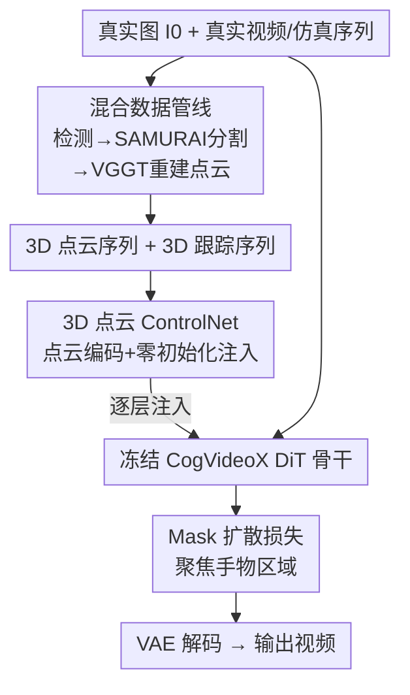

# HVG-3D: Bridging Real and Simulation Domains for 3D-Conditional Hand-Object Interaction Video Synthesis

**会议**: CVPR 2026  
**论文**: [CVF Open Access](https://openaccess.thecvf.com/content/CVPR2026/html/Chen_HVG-3D_Bridging_Real_and_Simulation_Domains_for_3D-Conditional_Hand-Object_Interaction_CVPR_2026_paper.html)  
**领域**: 视频生成 / 扩散模型 / 手物交互  
**关键词**: 手物交互视频生成、3D ControlNet、点云条件、CogVideoX、Sim-to-Real

## 一句话总结
HVG-3D 给图生视频扩散模型（CogVideoX-5B-I2V）接上一个吃 3D 点云序列与 3D 跟踪信号的 ControlNet，再配一条能同时从真实视频和仿真器构造条件的混合数据管线，让模型只用一张真实图 + 一段 3D 条件就能生成几何正确、时序连贯、可被仿真数据驱动的手物交互视频，在 TASTE-Rob 上取得 SOTA。

## 研究背景与动机

**领域现状**：基于扩散的视频生成（Sora、CogVideoX、Hunyuan Video 等）已经能产出高质量、时序一致的视频，因此一批工作把它用到「手物交互（Hand-Object Interaction, HOI）视频生成」上——这类视频对机器人抓取策略学习很有价值，相当于用生成模型批量造训练数据。

**现有痛点**：这些 HOI 生成方法几乎都靠 **2D 控制信号**来引导——点轨迹、光流、bounding box、mask。2D 信号天生缺乏空间表达力：它只给出部分的运动与几何线索，导致生成时常出现不真实的形变和物理上不成立的接触（手穿模、物体被捏扁）。更要命的是这些 2D 条件大多得从真实视频里抽，难以利用仿真器高效生成的合成数据，数据采集和标注成本居高不下。

**核心矛盾**：视觉真实感和精确物理控制之间存在张力。即使是较新的工作（如 Diffusion as Shader, DaS）已经开始引入 3D 跟踪视频做更丰富的运动引导，但它最终还是把 3D 线索**投影回 2D 视频序列**喂给模型，这一步投影丢掉了 3D 空间结构和深度关系——尤其遮挡严重、需要垂直于桌面运动（折叠、抬起）时，2D 表征根本撑不住深度推理。

**本文目标**：让视频扩散模型**原生**地吃 3D 条件，从而（1）提升手物交互的真实性与物理合理性；（2）打通仿真器，让合成的 3D 序列也能直接驱动生成，实现可扩展的数据生产。

**核心 idea**：用**显式 3D 表征**（点云序列 + 3D 跟踪）作为条件，通过一个专门的 3D ControlNet 把几何与运动线索注入冻结的图生视频骨干，并用一条混合管线让「真实 image + 来自真实或仿真的 3D 条件」可以自由配对——以此在「真实域」和「仿真域」之间架桥。

## 方法详解

### 整体框架

HVG-3D 解决的是「3D 条件下的手物交互图生视频（I2V）」任务：给一张真实输入图 $I_0 \in \mathbb{R}^{H\times W\times 3}$、一段表示 $T$ 帧手物几何的 3D 点云序列 $P=\{P_t\}_{t=1}^{T}$（$P_t\in\mathbb{R}^{N\times 3}$）、以及一段可选的 3D 跟踪序列 $\mathcal{T}=\{T_t\}_{t=1}^{T}$，目标是生成视频 $V_{out}=\{I_t\}_{t=1}^{T}$，既视觉真实、时序连贯，又忠实遵守 3D 空间约束。

整套系统由两大块拼成：**右半边是 3D-aware 扩散生成架构**——以冻结的 CogVideoX-5B-I2V 为骨干，外挂一个可训练的 3D 点云 ControlNet，把点云与跟踪信号编码后通过零初始化层注入每一个 DiT block；**左半边是混合数据管线**——负责从真实视频或仿真器里恢复/构造出配对的「输入图 + mask + 点云 + 跟踪」，让训练和推理阶段都能灵活换条件源。最后再用一个聚焦手物区域的 mask 扩散损失把训练拉到关键区域上。

### 关键设计

**1. 3D 点云 ControlNet：把显式 3D 几何注入冻结的视频骨干，而不是先投影回 2D**

这一设计直击「2D 条件丢深度」的痛点。骨干用 CogVideoX-5B-I2V：输入图 $I_0$ 与训练时的真值视频 $V_{gt}$ 经 VAE 编码为隐变量 $Z_{I_0}, Z_{gt}\in\mathbb{R}^{T\times \frac{H}{8}\times\frac{W}{8}\times 16}$，图隐变量在时间维零填充到长度 $T$ 后与加噪的 $Z_{gt}$ 拼接，交给 Diffusion Transformer 迭代去噪，再由 3D VAE 解码出 $V_{out}$。条件侧，给定点云序列 $P\in\mathbb{R}^{T\times N\times 3}$，用一个点云编码器得到隐特征 $Z_{pc}\in\mathbb{R}^{T\times L\times 768}$（$N$ 是点数、$L$ 是 latent token 数），同时把 3D 跟踪信息编码为 $Z_{tracking}\in\mathbb{R}^{T\times\frac{H}{8}\times\frac{W}{8}\times 16}$。为了让异构条件能对齐，$Z_{pc}$ 先过一个可学习线性层并重采样到与 $Z_{tracking}$、$Z_{gt}$ 相同的维度，再拼接送进 ControlNet。

ControlNet 的结构是把骨干所有预训练 DiT block **复制一份**专门学条件，每层输出经一个**零初始化卷积**后注入对应的主干 DiT block。零初始化保证训练初期注入项为 0、不破坏预训练能力，再逐渐学会把 3D 线索灌进去。和 DaS 那种「把 3D 投成 2D 图再当条件」不同，这里点云全程保持 3D 结构，扩散模型相当于被当成一个**神经渲染器**直接读 3D，因此在严重遮挡、复杂关节运动下的空间一致性和物理合理性明显更好。

**2. 混合数据管线：在真实域与仿真域之间架桥，让一张真实图配上任意来源的 3D 条件**

痛点是「2D 条件得从真实视频抽、用不上仿真数据」。HVG-3D 设计了一条三阶段管线（训练数据构造 → 训练 → 推理）来打通两域。训练阶段，TASTE-Rob 本身缺 mask 和点云标注，作者就从单目第一视角 RGB 视频里恢复这些信号：用「帧间差分图（应对静态背景）+ YOLOv8-X 检测（应对动态手部）」抽手和物体的 bounding box，用 SAMURAI 以 box 初始化并双向细化得到时序一致的实例 mask，融合成逐帧手物分割；再用 VGGT 在视频帧 + mask 上重建出逐帧点云 $P\in\mathbb{R}^{T\times N\times 3}$，3D 跟踪序列则由 SpatialTracker 估计。

真正的价值在推理阶段的**条件源可换**：模型只需一张真实图 + 一段 3D 条件，这段条件既可以（1）用训练同款管线从真实视频里抽，也可以（2）来自仿真——在 Blender 里编辑/生成 3D 手物网格序列、或直接采样 ARCTIC、HOT3D 这类现成 3D HOI 数据集。所有 3D 网格序列都会被处理成兼容的点云（必要时含跟踪序列），无缝接进同一个条件接口。这意味着可以在 Blender 里编出训练集里根本没有的新手物动作，再让模型「渲染」成真实视频——这正是「桥接真实与仿真」、低成本扩数据的关键。

**3. Mask 扩散损失：把学习重心压到手物交互区域，抗背景干扰并加速收敛**

显式 3D 条件给了强几何控制，但在杂乱场景里压不住背景干扰。作者借鉴 StableAnimator，在标准扩散损失上加了一个 mask 加权的重建项：

$$\mathcal{L}=\sum_{i=1}^{n}\mathbb{E}_{\varepsilon}\big\|(Z_{gt}-Z_{\varepsilon})\odot(1+M^{i})\big\|^{2}$$

其中 $Z_{gt}$、$Z_{\varepsilon}$ 是真值与预测的视频隐变量，$M^{i}\in\{0,1\}^{1\times H\times W}$ 是第 $i$ 帧的手物 mask。$(1+M^i)$ 让落在手物区域的误差权重翻倍、背景仍保持权重 1，于是模型被逼着先把交互关键区域学准，而不是把注意力均摊到整张场景上。消融显示这一项不光提质，还能在相同 epoch 下更快收敛、对复杂场景里的其它物体更鲁棒。

### 损失函数 / 训练策略
训练时**只微调复制出来的条件 DiT block**，原去噪 DiT 骨干全程冻结以保住预训练的视频生成能力。每段视频中心裁剪并 resize 到 $720\times 480$、定长 49 帧；每个训练样本含输入图 $I_0$、真值视频 $V_{gt}$、手物 mask 序列、点云序列 $P$、跟踪序列。优化器 AdamW，学习率 $1\times10^{-4}$，训 20 epoch，用梯度累积达到有效 batch size 4，全程 8 张 H20 GPU。

## 实验关键数据

数据集为 TASTE-Rob（第一视角手物交互），取 Single Hand 子集中 office/dining/bedroom/kitchen/dressing table 场景，从每场景采 2% 候选再随机抽 100 段构成测试集。评测分两类：图像质量（L1、PSNR、SSIM、LPIPS、CLIP、FID、C-FID）和时空相似度（FVD、ST-SSIM、GMSD-T）。

### 主实验

全帧（Full Frame）评测下，HVG-3D 取得最低 FVD（13.8）、最低 FID（58.2）、最高 CLIP（0.96）和最好 GMSD-T（0.40）；部分逐像素指标略逊于 DaS，但下表的手物 mask 区域评测里全面领先——这块才是真正的交互关键区。

| 评测范围 | 方法 | PSNR↑ | SSIM↑ | LPIPS↓ | ST-SSIM↑ | FID↓ | C-FID↓ |
|---|---|---|---|---|---|---|---|
| 全帧 | DaS | **24.83** | **0.84** | **0.191** | 0.96 | 75.5 | **14.6** |
| 全帧 | InterDyn | 24.13 | 0.82 | 0.205 | 0.95 | 73.3 | 17.8 |
| 全帧 | **HVG-3D** | 24.15 | 0.81 | 0.193 | **0.97** | **58.2** | **14.6** |
| 手物区域 | DaS | 17.41 | 0.96 | 0.039 | 0.88 | 128.0 | 16.0 |
| 手物区域 | InterDyn | 19.03 | 0.96 | 0.034 | 0.92 | 104.5 | 14.5 |
| 手物区域 | **HVG-3D** | **19.08** | **0.97** | **0.032** | **0.93** | **88.5** | **13.1** |

定性上，只有 HVG-3D 能在保持手和物体形状不变的前提下完成指定操作；DaS 对桌面内平移尚可，一旦涉及折叠或垂直桌面的运动就出现明显形变，InterDyn 更不稳定，而 CogVideoX/Wan2.2/Kling/Sora2 这类通用大模型则难以可靠完成操作。

### 消融实验

| 配置 | PSNR↑ | SSIM↑ | LPIPS↓ | ST-SSIM↑ | 说明 |
|---|---|---|---|---|---|
| full model | **24.15** | **0.81** | **0.193** | **0.97** | 完整模型 |
| w/o 3D 点云 | 18.44 | 0.37 | 0.5957 | 0.91 | 去掉点云条件，崩得最狠 |
| w/o 3D 跟踪 | 22.76 | 0.75 | 0.2054 | 0.95 | 接触/轨迹对齐变差 |
| w/o mask 损失 | 22.09 | 0.80 | 0.199 | 0.96 | 收敛变慢、抗干扰下降 |

### 关键发现
- **3D 点云条件贡献最大**：去掉后 SSIM 从 0.81 暴跌到 0.37、LPIPS 从 0.193 飙到 0.5957，深度感知一旦缺失，需要折叠/垂直运动的场景里手物形状会严重扭曲——这正印证了 2D 条件做不了深度推理的论断。
- **3D 跟踪是互补的视角信息**：去掉后物体形状还算合理，但接触位置和运动轨迹的空间对齐变差；由于模型本是带点云训练的，跟踪的缺失说明它编码了帮助点云表征学得更好的相机视角线索。
- **mask 损失主要加速收敛、提升抗干扰**：相同 epoch 下去掉它各项指标一致变差，因为模型会把注意力摊到整个场景而非聚焦交互区。
- **mask 区域 FVD 进一步降到 9.6**（全帧为 13.8），而其它方法在 mask 区域反而普遍退化，说明 HVG-3D 的优势恰在交互最关键的局部。

## 亮点与洞察
- **把「3D 投 2D 再生成」翻转成「让扩散模型当神经渲染器直接读 3D」**：这是相对 DaS 的核心区别——保住点云全程的 3D 结构，遮挡和垂直运动场景因此受益最大，是很可迁移的思路。
- **真实/仿真同接口**：同一条件接口既吃真实视频重建的点云，又吃 Blender 编辑或 ARCTIC/HOT3D 采样的合成序列，意味着可以在仿真里编出训练集没有的新动作来「渲染」真实视频，给机器人数据生产提供了低成本扩展路径。
- **全冻结骨干 + 零初始化注入**：只训复制出的条件 DiT block，既保住大模型预训练能力又稳住训练，是 ControlNet 范式在视频 I2V 上的干净落地。
- **mask 加权损失的 $(1+M)$ 写法**很轻量却同时换来「提质 + 加速收敛 + 抗背景干扰」三重收益，可直接迁移到其它区域敏感的生成任务。

## 局限与展望
- **强依赖 3D 条件质量**：训练点云由 VGGT 从单目视频重建、跟踪由 SpatialTracker 估计，这些上游若在重遮挡/快速运动下出错，会直接传导到生成；论文未量化 3D 条件噪声的鲁棒性。
- **仅在 TASTE-Rob 单数据集、单手、定长 49 帧上验证**，场景类别有限（5 类），跨数据集泛化与长序列生成未充分检验（作者也把长序列、更多交互场景列为未来工作）。
- **全帧逐像素指标略逊于 DaS**：作者把领先点集中在 mask 区域，但若下游关心整帧质量（如背景一致性），这一权衡需注意。
- **未闭环到机器人策略**：论文定位是为抓取策略造数据，但没给出「生成视频实际提升下游策略学习」的端到端证据，作者将闭环集成列为未来方向。
- 改进方向：引入对 3D 条件噪声的鲁棒训练、跨数据集联合训练、以及把生成数据真正接进机器人模仿学习做闭环验证。

## 相关工作与启发
- **vs DaS（Diffusion as Shader）**：DaS 也用 3D 跟踪做运动引导，但把 3D 线索投影回 2D 视频喂模型，丢失空间结构；HVG-3D 直接以 3D 点云为条件、保住深度关系，故在折叠/垂直运动等需深度推理的场景显著更稳。
- **vs InterDyn / TASTE-Rob 等 2D HOI 生成**：它们靠 mask/2D 条件合成 HOI 视频，视觉质量与物理一致性受限；本文用显式 3D 条件改善了几何保真与物理合理性。
- **vs 通用视频大模型（CogVideoX/Wan2.2/Kling/Sora2）**：这些模型视觉质量强但缺乏精确空间控制，难以可靠完成指定手物操作；HVG-3D 在它们之上外挂 3D ControlNet 补齐可控性。
- **vs 3D HOI 重建方法（ARCTIC/HOLD/HOIDiffusion 等）**：它们聚焦孤立物体的 3D 位姿重建/生成、缺少完整场景上下文；本文反向利用这些数据集作为可换的 3D 条件源来驱动真实场景视频生成。

## 评分
- 新颖性: ⭐⭐⭐⭐ 把显式 3D 点云条件原生注入视频扩散、并用混合管线桥接真实与仿真，思路清晰且针对性强
- 实验充分度: ⭐⭐⭐ 主实验+三项消融到位且自洽，但仅单数据集、未验证跨域泛化与下游闭环
- 写作质量: ⭐⭐⭐⭐ 动机—方法—实验逻辑顺畅，图表清楚（个别 typo 不影响理解）
- 价值: ⭐⭐⭐⭐ 为机器人抓取数据生产提供了可被仿真驱动的可控视频生成路径，应用前景明确

<!-- RELATED:START -->

## 相关论文

- [\[CVPR 2026\] Open-world Hand-Object Interaction Video Generation Based on Structure and Contact-aware Representation](open-world_hand-object_interaction_video_generation_based_on_structure_and_conta.md)
- [\[CVPR 2026\] Endless World: Real-Time 3D-Aware Long Video Generation](endless_world_real-time_3d-aware_long_video_generation.md)
- [\[CVPR 2026\] U-Mind: A Unified Framework for Real-Time Multimodal Interaction with Audiovisual Generation](u-mind_a_unified_framework_for_real-time_multimodal_interaction_with_audiovisual.md)
- [\[CVPR 2026\] Generative Video Motion Editing with 3D Point Tracks](generative_video_motion_editing_with_3d_point_tracks.md)
- [\[CVPR 2026\] Towards Realistic and Consistent Orbital Video Generation via 3D Foundation Priors](orbital_video_3d_foundation_priors.md)

<!-- RELATED:END -->
