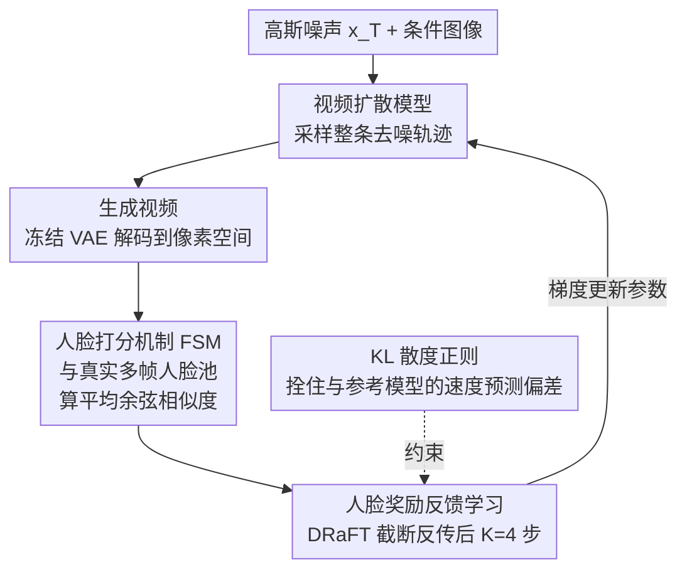

# Identity-Preserving Image-to-Video Generation via Reward-Guided Optimization

**会议**: CVPR 2026  
**arXiv**: [2510.14255](https://arxiv.org/abs/2510.14255)  
**代码**: [https://ipro-alimama.github.io/](https://ipro-alimama.github.io/) (项目页)  
**领域**: 扩散模型 / 视频生成  
**关键词**: 图像到视频, 身份保持, 强化学习, 人脸奖励, 扩散模型微调

## 一句话总结

本文提出 IPRO，通过强化学习和可微分人脸身份评分器直接优化视频扩散模型，在不修改模型架构的情况下显著提升图像到视频生成中的人脸身份一致性，在 Wan 2.2 上实现了 20%-45% 的 FaceSim 提升。

## 研究背景与动机

**领域现状**：图像到视频（I2V）生成已经取得了很大进展，CogVideoX、HunyuanVideo、Wan 等 Diffusion Transformer 模型能够从静态图像合成时间连贯的高质量视频。人物视频生成是 I2V 的重要应用场景。

**现有痛点**：现有 I2V 模型在生成视频时难以保持输入人像的身份一致性，尤其当人物表情变化大、动作幅度大时问题更严重。当人脸在图像中占比很小时，这个问题更加突出。随着帧数增加，误差在帧间传播导致身份逐渐退化，使生成的人物外观偏离初始帧。

**核心矛盾**：一方面，身份信息已经完全编码在第一帧中，不缺信息；另一方面，现有方法（如在模型中注入额外身份模块）存在"曝光偏差"问题——训练时基于真实中间状态，推理时却基于自己生成的状态，导致误差累积和身份漂移。而且这些架构入侵式方法本质上是单人设计，难以扩展到多人场景。

**本文目标** 能否增强通用基础 I2V 模型的身份保持能力，同时不改变架构也不损害原始能力？

**切入角度**：从强化学习的视角出发，将人脸身份评分器（ArcFace）作为奖励模型，直接通过梯度反向传播优化扩散模型参数，使其生成身份一致性更好的视频。

**核心 idea**：用 ArcFace 人脸嵌入的余弦相似度作为可微奖励信号，通过截断梯度反传微调视频扩散模型以提升身份保持。

## 方法详解

### 整体框架

IPRO 不往扩散模型里塞任何身份模块，而是把"身份保持"重新表述成一个可微的奖励优化问题。一次完整的训练迭代是这样转的：从纯高斯噪声 $x_T$ 和条件图像出发，让视频扩散模型跑完整条采样轨迹得到生成视频，用冻结的 VAE 解码器还原到像素空间，再交给一个冻结的人脸识别网络（ArcFace）打分；这个分数就是奖励，沿着采样轨迹反传，直接更新扩散模型的参数。围绕这条主干，论文给出三件让它真正可用的设计：定义奖励怎么算的人脸奖励反馈学习、决定和谁比对的人脸打分机制（Facial Scoring Mechanism, FSM），以及防止模型钻奖励空子的 KL 散度正则。

### 关键设计

**1. 人脸奖励反馈学习：把身份一致性变成可反传的训练目标**

现有架构入侵式方法最致命的是曝光偏差——训练时喂的是真实中间帧，推理时却要基于自己生成的帧继续，误差一帧帧累积，人脸就慢慢漂走了。IPRO 干脆让训练和推理走同一条路：目标函数 $J(\theta) = \mathbb{E}_{x_T \sim N(0,I)}[R_{face}(\text{sample}(\theta, x_T))]$ 直接最大化"从随机噪声采样出来的视频"的人脸奖励，训练分布与推理分布天然对齐，曝光偏差从源头消失。和逐帧 L2 的监督微调相比，它优化的是整段视频的全局奖励，因此能感知到 SFT 损失根本看不见的那种缓慢累积的小幅漂移。直接对整条采样链反传显存吃不消，于是借用 DRaFT 的截断策略，只对最后 $K=4$ 步去噪反传梯度：

$$\nabla_\theta R_{face}^K = \sum_{t=0}^{K} \frac{\partial R_{face}}{\partial x_t} \cdot \frac{\partial x_t}{\partial \theta}$$

之所以选后期低噪声步而不是前期，是因为这几步决定了人脸外观的精细细节——实验里后期梯度比前期梯度高出 0.694 vs 0.646 的 FaceSim，印证了这个直觉。

**2. 人脸打分机制（FSM）：用多角度人脸池打分，既要像又不能僵**

身份保持有个内在矛盾：希望人脸始终像参考人物，又不希望它被锁死成第一帧那张脸。奖励该和谁比对，直接决定模型学到的是"保持身份"还是"复制粘贴"。FSM 的做法是把真实视频里**所有帧**的人脸收成一个特征池，对每个生成帧 $i$ 计算它和池中全部真实帧人脸嵌入的平均余弦相似度：

$$s_i = \frac{1}{F}\sum_{j=1}^{F} \cos\big(\phi(\hat{x}_i), \phi(x_j)\big)$$

最终奖励取所有生成帧 $s_i$ 的平均。关键在"和所有帧比、而不是只和参考图比"：只比参考图，模型会偷懒把每帧人脸都钉死成第一帧表情，丢掉自然的表情和角度变化；只比时间对齐的同序号 GT 帧，信号又太弱带不动优化。用整段视频的人脸做参考池，等于告诉模型"在任意角度、任意表情下都得是这个人",既给了丰富监督又留出了表情自由度。

**3. KL 散度正则：给优化套上缰绳，防止 reward hacking**

只盯着人脸奖励猛优化，模型很快会发现一条捷径：生成几乎不动、表情僵硬的视频最容易拿高分——这就是 reward hacking，FaceSim 飙到 0.754 但画面已经废了。为此 IPRO 在反向采样轨迹的每一步都加一项 KL 约束，惩罚优化后模型与原始参考模型在速度预测上的偏差：

$$D_{KL}\big(p_\theta(x_{0:T}) \,\|\, p_{\theta_{ref}}(x_{0:T})\big) = \sum_{t=1}^{K} \omega_t' \,\big\|v_\theta(x_t, t) - v_{\theta_{ref}}(x_t, t)\big\|^2$$

它把优化模型牢牢拴在原始模型附近，让人脸奖励只能在"不破坏原有视频生成能力"的前提下起作用。消融里去掉 KL 会让 hacking 率从 10% 暴涨到 58%，是这套方案能落地的安全阀。

### 损失函数 / 训练策略

使用 Adam 优化器，学习率 2e-5，训练 100 步，batch size 64。截断梯度步数 $K=4$，人脸奖励权重 0.1，KL 损失权重 1。对于 Wan2.2 27B-A14B，仅训练 low-noise expert 部分。使用 Wan2.2-Lightning 蒸馏版本（8 步无需 CFG）提高训练效率。训练数据从互联网收集 960p 视频，保留人脸较小的场景（最大人脸框不超 100×100 像素）。

## 实验关键数据

### 主实验

| 方法 | FaceSim↑ | SC↑ | BC↑ | AQ↑ | IQ↑ | DD↑ |
|------|----------|-----|-----|-----|-----|-----|
| In-house I2V (15B) | 0.477 | 0.977 | 0.978 | 0.664 | 0.729 | 8.93 |
| + IPRO | **0.696** (+45.9%) | 0.981 | 0.981 | 0.664 | 0.726 | 8.31 |
| Wan 2.2 5B | 0.379 | 0.942 | 0.955 | 0.648 | 0.727 | 27.79 |
| + IPRO | **0.546** (+44.1%) | 0.946 | 0.956 | 0.649 | 0.724 | 27.26 |
| Wan 2.2 A14B | 0.578 | 0.951 | 0.971 | 0.659 | 0.727 | 19.45 |
| + IPRO | **0.694** (+20.1%) | 0.954 | 0.972 | 0.661 | 0.725 | 19.17 |

**与其他方法对比（基于 Wan 2.2 A14B）**:

| 方法 | FaceSim↑ |
|------|----------|
| Wan 2.2 | 0.578 |
| MoCA† (T2V 适配) | 0.582 |
| Concat-ID† (T2V 适配) | 0.606 |
| DPO | 0.628 |
| GRPO | 0.633 |
| **IPRO (Ours)** | **0.694** |

### 消融实验

| 配置 | FaceSim↑ | Hacking↓ | 说明 |
|------|----------|----------|------|
| Wan 2.2 原始 | 0.578 | 7% | 基线 |
| w/o KL 正则 | 0.754 | **58%** | FaceSim 高但严重 hacking |
| w/o FSM | 0.739 | **52%** | 同样严重 hacking |
| **Full IPRO** | **0.694** | **10%** | 平衡了身份保持与自然运动 |

| 训练框架 | FaceSim↑ |
|----------|----------|
| SFT† | 0.639 |
| CLIP 奖励† | 0.610 |
| **IPRO (ArcFace 奖励)** | **0.694** |

### 关键发现

- KL 正则化和 FSM 是防止 reward hacking 的关键：去掉任一个都会导致 50%+ 的 hacking 率
- ArcFace 作为奖励模型明显优于 CLIP（0.694 vs 0.610），因为 ArcFace 对细粒度人脸特征的判别力更强
- 使用后期（低噪声）梯度步优于前期（高噪声）步：FaceSim 0.694 vs 0.646
- IPRO 在提升身份保持的同时基本不损害原始模型的视频质量指标

## 亮点与洞察

- **不改架构的通用性**：IPRO 是纯策略优化方法，不需要额外模块，可以直接应用到任何 I2V 基础模型上。这种"奖励驱动微调"思路通用性极强，100 步就够
- **FSM 的多视角池设计**：将 GT 视频所有帧的人脸作为参考池而非单帧/对齐帧，既避免了 copy-paste 又提供了更丰富的监督信号，是处理"保持一致但允许变化"这类矛盾需求的巧妙方案
- **KL 正则与 reward hacking 的量化分析**：用 Gemini 2.5 Pro VLM 量化评估 hacking 率是很有说服力的评估方式

## 局限与展望

- 目前仅关注面部身份保持，非面部属性（如珠宝、配饰、服装）的一致性未涉及
- 训练依赖小脸场景数据集，对大脸场景的改进可能有限
- ArcFace 本身的偏差（如对某些种族或极端角度的识别不足）可能传递到生成结果
- 未来可以设计统一的"全身身份"奖励模型，覆盖面部和非面部特征

## 相关工作与启发

- **vs MoCA / Concat-ID（T2V 身份方法适配到 I2V）**: 这些方法需要额外的身份模块，改变了模型架构。IPRO 不修改架构但效果更好，说明"正确的优化目标"比"增加模块"更重要
- **vs DPO**: DPO 只优化相对偏好排序，缺乏绝对校准；面部身份是可绝对量化的指标，因此 IPRO 的直接奖励优化更适合
- **vs GRPO**: GRPO 依赖组内响应多样性，但同一 prompt 生成的视频高度相似，导致优势估计失效

## 评分

- 新颖性: ⭐⭐⭐⭐ 首个将人脸奖励反馈学习应用到 I2V 身份保持的工作，FSM 和 KL 正则设计精巧
- 实验充分度: ⭐⭐⭐⭐⭐ 三个基础模型验证、多种对比方法、详细消融、用户研究
- 写作质量: ⭐⭐⭐⭐ 动机清晰，消融实验逻辑性强
- 价值: ⭐⭐⭐⭐ 解决了 I2V 中重要的实用问题，方法通用可迁移

<!-- RELATED:START -->

## 相关论文

- [\[CVPR 2026\] ConsID-Gen: View-Consistent and Identity-Preserving Image-to-Video Generation](consid-gen_view-consistent_and_identity-preserving_image-to-video_generation.md)
- [\[CVPR 2026\] EvoID: Reinforced Evolution for Identity-Preserving Video Generation](evoid_reinforced_evolution_for_identity-preserving_video_generation.md)
- [\[CVPR 2026\] VIVA: VLM-Guided Instruction-Based Video Editing with Reward Optimization](viva_vlm-guided_instruction-based_video_editing_with_reward_optimization.md)
- [\[CVPR 2026\] PLACID: Identity-Preserving Multi-Object Compositing via Video Diffusion with Synthetic Trajectories](placid_identity-preserving_multi-object_compositing_via_video_diffusion_with_syn.md)
- [\[CVPR 2026\] Diverse Video Generation with Determinantal Point Process-Guided Policy Optimization](diverse_video_generation_with_determinantal_point_process-guided_policy_optimiza.md)

<!-- RELATED:END -->
