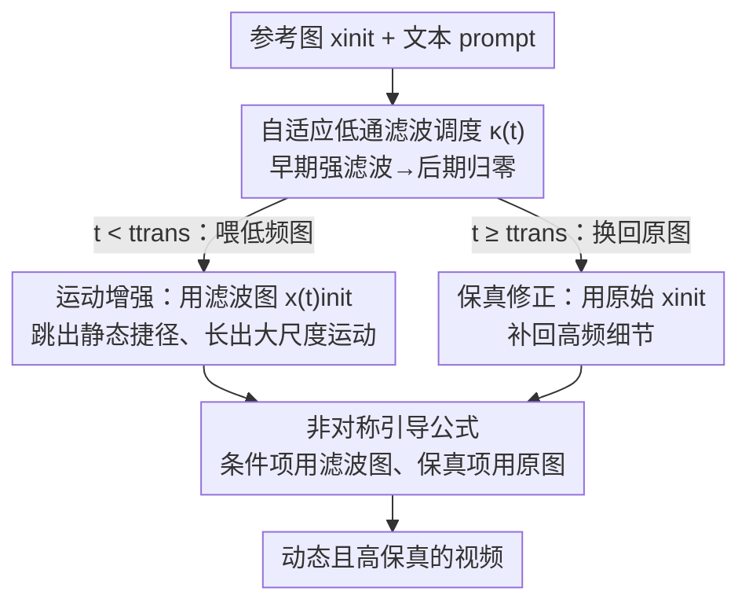

# Improving Motion in Image-to-Video Models via Adaptive Low-Pass Guidance

**会议**: CVPR 2026  
**论文**: [CVF Open Access](https://openaccess.thecvf.com/content/CVPR2026/html/Choi_Improving_Motion_in_Image-to-Video_Models_via_Adaptive_Low-Pass_Guidance_CVPR_2026_paper.html)  
**代码**: 项目页有源码（论文称见 project page），具体仓库待确认  
**领域**: 视频生成 / 图生视频 / 扩散采样引导  
**关键词**: 图生视频、运动抑制、低通滤波、无训练引导、扩散采样

## 一句话总结
作者发现 I2V 模型生成的视频比同源 T2V 更"僵"，根因是参考图的高频细节在去噪极早期就把生成轨迹"锁死"成静态捷径；于是提出无需训练的自适应低通引导（ALG）——只在采样早期对条件图做低通滤波、后期换回原图，在 VBench 上把动态度平均提升 33% 而几乎不损画质。

## 研究背景与动机
**领域现状**：当下主流的图生视频（I2V）模型，几乎都是在大规模文生视频（T2V）模型上微调得到的——把参考图作为额外条件喂进去（通道拼接初始帧、加 CLIP 语义特征、或带噪初始帧做 in-context 条件），让模型生成"以这张图为首帧的自然延续"。这条路在画质、一致性上表现很好。

**现有痛点**：同一套架构、同样的训练设置下，I2V 生成的视频明显比 T2V 更静态——哪怕给的是动态 prompt，物体也几乎不动。作者用 Wan 2.1（同时有 T2V 和 I2V 两个 checkpoint）做了一个干净的对照：先用 T2V 生成视频，再把它的首帧喂给 I2V 重新生成。结果 I2V 的动态度（Dynamic Degree）相对 T2V 掉了 **18.6%**，而其它画质指标几乎不变。说明"变僵"这件事就是条件机制本身引入的。

**核心矛盾**：作者假设运动被压制源于**早期对高频信号的过早暴露**。他们抽取 Wan 2.1 去噪骨干的中间特征图、用 PCA 转成 RGB 可视化，发现 I2V 在仅仅一步去噪（t=0.02，共 50 步）后，特征图就已经牢牢锁定了输入图的精细细节——这把后续轨迹的自由度提前封死，粗粒度的大尺度运动再也长不出来，最终变成静态视频。这是一种"捷径"（shortcut）：模型抄近路直接还原外观，跳过了应有的 coarse-to-fine 演化。

**诊断与权衡**：既然是高频细节作祟，那把条件图做低通滤波（如下采样）去掉高频，运动是不是就回来了？作者做了诊断实验，发现动态度确实随滤波强度单调上升——直接验证了假设。但天真地全程低通会带来代价：模型收到的是模糊图，重建不出原图的精细细节，画质和保真度下降。这就是关键 trade-off——**要运动就得去高频，要保真就得留高频**。

**核心 idea**：捷径只发生在生成的最开始。那就只在早期去高频、后期再把原图换回来——用"分时段的频率调度"同时拿到运动和保真，且完全无需训练。

## 方法详解

### 整体框架
ALG（Adaptive Low-Pass Guidance）是一个加在 I2V 采样过程上的、无训练的推理技巧。它不改模型权重、不加额外网络，只改"每一步把什么样的条件图喂给模型"。

核心机制是**沿时间步自适应地调制条件图的频率含量**：在去噪早期（$t\approx 0$）对参考图施加强低通滤波，让模型只看到低频轮廓、避免锁进静态捷径；随着去噪推进逐渐减弱滤波强度，到后期（$t\approx 1$）换回完整的原始高频参考图，让模型从"动起来但缺细节"的中间状态出发，重建出清晰的精细细节。整套流程图文对照如下：

### 关键设计

**1. 自适应低通滤波调度：只在早期去高频，把"运动"和"保真"分时段拿全**

直接把条件图全程低通能换来运动，却赔上保真——这是上一节诊断出的死结。ALG 的破法是认清"捷径只在极早期发生"这个时间结构，于是让滤波强度随时间步衰减。形式化地，令 $x^{(t)}_{\text{init}} = F_{\text{LP}}(x_{\text{init}}, \kappa(t))$ 是用预设低通滤波器 $F_{\text{LP}}$（高斯模糊或双线性缩放）滤过的条件图，强度因子 $\kappa(t):[0,1]\to\mathbb{R}$ 是时间步 $t$ 的递减函数，且 $F_{\text{LP}}(x_{\text{init}}, 0)=x_{\text{init}}$（强度为 0 即原图）。早期喂低频图阻止轨迹塌进捷径，后期暴露原图让模型补回细节。它有效是因为生成本就是 coarse-to-fine：早期本该确定的是大结构和运动趋势、不该被高频细节绑架，ALG 恰好把"该模糊的时候模糊、该清晰的时候清晰"对齐到了去噪的时间轴上。

**2. 非对称引导公式：无条件项保留原图，专门腾一项做保真修正**

光有调度还不够——条件图要塞进 CFG 的哪几项里，直接决定运动和保真能不能兼得。ALG 的关键选择是：在 I2V 的 CFG 公式（$v_{\text{CFG-I2V}} = v_\theta(x_t, x_{\text{init}}, t, \varnothing) + w[v_\theta(x_t, x_{\text{init}}, t, c) - v_\theta(x_t, x_{\text{init}}, t, \varnothing)]$）里，只把后两项的条件图换成滤波图 $x^{(t)}_{\text{init}}$，而**第一个无条件项仍用原始 $x_{\text{init}}$**：

$$v_{\text{ALG}}(x_t, t) = v_\theta(x_t, x_{\text{init}}, t, \varnothing) + w\left[v_\theta(x_t, x^{(t)}_{\text{init}}, t, c) - v_\theta(x_t, x^{(t)}_{\text{init}}, t, \varnothing)\right]$$

这个看似随意的选择其实暗藏玄机。把上式代数重排，可以等价拆成两项：

$$v_{\text{ALG}} = \underbrace{v_\theta(x_t, x^{(t)}_{\text{init}}, t, \varnothing) + (w-1)\left[v_\theta(x_t, x^{(t)}_{\text{init}}, t, c) - v_\theta(x_t, x^{(t)}_{\text{init}}, t, \varnothing)\right]}_{\text{(a) 运动增强 CFG}} + \underbrace{\left[v_\theta(x_t, x_{\text{init}}, t, \varnothing) - v_\theta(x_t, x^{(t)}_{\text{init}}, t, \varnothing)\right]}_{\text{(b) 保真修正}}$$

(a) 项是标准 CFG，但条件全用滤波图，专门负责催生动态运动；(b) 项是原图无条件预测与滤波图无条件预测之差，把仅靠 (a) 会丢掉的高频视觉信息重新引导回来。作者实验发现，如果三项全用滤波图，生成会变得不稳定——画面扭曲、空间相干性下降、甚至出现突兀的场景切换。正是这种"条件项促运动、保真项补细节"的非对称拆分，让 ALG 在拉高运动的同时守住了保真。

**3. κ(t) 调度的具体形式与两个免费的工程技巧**

$\kappa(t)$ 只要满足"早期强、后期弱"即可，作者用最简单的阶跃函数：$\kappa(t)=\kappa^*$ 当 $t<t_{\text{trans}}$，否则为 0，含两个超参——转折点 $t_{\text{trans}}\in(0,1)$ 和初始强度 $\kappa^*>0$。默认 $t_{\text{trans}}=0.1$（前 10% 去噪步施加滤波）、$\kappa^*=2.5$（双线性下采样因子，等于先下采样到 1/2.5 再上采样回原分辨率）。作者强调任意满足"早期高强度"的 $\kappa(t)$ 都能提升运动，但 $t_{\text{trans}}$ 过大（低频图暴露太久）会损保真。

此外两个零开销的小技巧明显提升画质：其一，在切到滤波图之前先用**干净 latent 去噪 1–2 步**，略微推迟滤波图的暴露，以微小动态度代价换画质；其二，在**解码时把首帧 latent 覆盖回干净版本**，进一步保证参考帧本身的清晰度。两者都不引入额外计算开销。

## 实验关键数据

### 主实验
ALG 套在三个开源 I2V 模型（Wan 2.2、Wan 2.1、LTX-Video）上，对照是各自官方 checkpoint 的默认 CFG 生成。指标里 Dynamic Degree 衡量动态度（越高越好），其余 VBench-QS、VBench-I2V、DOVER、VisionReward 衡量画质/保真（应尽量持平）。

| 模型 | 方法 | Dynamic Degree | VBench-Avg. | VBench-QS | VBench-I2V | DOVER | VisionReward |
|------|------|----------------|-------------|-----------|-----------|-------|--------------|
| Wan 2.2 | CFG | 31.7 | 79.6 | 85.4 | 98.5 | 0.635 | 0.183 |
| Wan 2.2 | **ALG** | **39.0** | **80.5** | 85.2 | 98.5 | 0.637 | 0.182 |
| Wan 2.1 | CFG | 28.9 | 79.1 | 85.3 | 98.3 | 0.618 | 0.179 |
| Wan 2.1 | **ALG** | **39.4** | **80.0** | 84.5 | 98.0 | 0.614 | 0.176 |
| LTX-Video | CFG | 15.5 | 77.8 | 85.9 | 99.1 | 0.625 | 0.175 |
| LTX-Video | **ALG** | **21.5** | **78.2** | 85.4 | 98.9 | 0.626 | 0.175 |

动态度在三个模型上分别 +23%、+36%、+39%（平均约 33%），而 VBench-Avg. 全线上升，质量类指标几乎不动——说明运动提升不是靠牺牲画质换来的。在三个不同数据集（VBench、PVD、VidProM）上用 Wan 2.2 的结果同样一致：

| 数据集 | 方法 | Dynamic Degree | VBench-Avg. | VBench-I2V |
|--------|------|----------------|-------------|-----------|
| VBench | CFG / ALG | 31.7 / **39.0** | 79.6 / **80.5** | 98.5 / 98.5 |
| PVD | CFG / ALG | 65.0 / **69.0** | 79.4 / **80.3** | 94.2 / **95.0** |
| VidProM | CFG / ALG | 27.3 / **30.5** | 79.1 / **79.5** | 98.2 / 98.0 |

### 消融实验
| 配置 | Dynamic Degree | 说明 |
|------|----------------|------|
| 转折点 $t_{\text{trans}}=0.06$ | 动态度 +32% | 仅前 6% 步做低通已足够催动运动，VBench-QS/Avg. 基本不掉 |
| 初始强度 $\kappa^*=1.6$ | 动态度 +29% | 提升运动而 VBench-QS 仅降 0.5%，整体分上升 |
| 高斯模糊替代下采样 | 动态度提升但小于下采样 | 下采样+上采样比高斯模糊去高频更狠（信号被抽取） |
| ALG + 运动增强 prompt（Gemini 2.5） | 31.7→39.0（CFG+Aug 38.6→ALG+Aug 43.5） | ALG 与"改 prompt 强调运动"正交，可叠加；且 ALG 不靠改 prompt 就已超 CFG |

### 关键发现
- **早期才是关键时间窗**：$t_{\text{trans}}$ 从 0 稍微增大，动态度就迅速爬升，而质量指标稳住不掉——直接坐实了"高频信号在早期阻碍运动成形"的核心假设。
- **运动提升几乎免费**：增大滤波强度 $\kappa^*$ 带来递减但持续的动态度增益，画质代价极小（$\kappa^*=1.6$ 时 +29% 动态度仅 -0.5% QS），所以综合分反而上升。
- **滤波器选型有讲究**：下采样比高斯模糊去高频更彻底，因此动态度增益更大——印证"去掉的高频越多、运动越强"这条因果链。
- **与已有技巧正交**：改 prompt 强调运动对 CFG 和 ALG 都有帮助，但 ALG 不改 prompt 就已经比 CFG 动态，二者还能叠加。

## 亮点与洞察
- **把"为什么变僵"诊断到了机理层**：不是泛泛说"I2V 运动差"，而是用特征图 PCA 可视化抓到"t=0.02 一步就锁死细节"的捷径现象，再用单调的滤波强度-动态度曲线交叉验证——观察、假设、诊断三步闭环，动机扎实得罕见。
- **无训练、零开销、即插即用**：只改采样时喂哪张条件图，不动权重、不加网络、不加推理成本，却能在 Wan/LTX 等任意 I2V 模型上稳定 +33% 动态度，落地门槛极低。
- **非对称 CFG 拆分很巧**：把无条件项留给原图、专门腾出"保真修正项"补高频，这种代数重排把"运动 vs 保真"的 trade-off 拆成两个可解释的引导分量，是可以迁移到其它条件生成任务的设计模式。
- **"频率调度对齐去噪时间轴"的思路可复用**：coarse-to-fine 的生成里，什么时候该模糊、什么时候该清晰，本身就该随时间步变化——这个视角对其它"过度条件化"问题（如过强的 layout/depth 条件）可能同样适用。

## 局限与展望
- **依赖手调超参且需逐模型适配**：$\kappa^*$、$t_{\text{trans}}$ 要按模型分辨率调整，阶跃调度虽简单但最优转折点因模型而异，缺一个自适应/自动确定调度的机制。
- **滤波器仍是启发式选择**：下采样优于高斯模糊只有经验解释（去高频更狠），没有给出"在给定模型上该用哪种滤波/多强"的原则性准则。
- **评测以自动指标为主**：动态度等都来自 VBench/DOVER/VisionReward 等自动评估，缺大规模人类主观对比；动态度高也不等于运动"合理/物理正确"，可能存在动得多但动得乱的隐患（论文未深入）。
- **机理验证集中在 Wan 2.1**：捷径特征图可视化主要在 Wan 2.1 上做，跨架构（尤其是非 flow-matching、非 DiT 的 I2V）是否同样存在该捷径、ALG 是否同样有效，验证相对有限。

## 相关工作与启发
- **vs Zhao et al.（训练运动模块 + 早时间步起噪）**：他们要训练专门的运动模块、并改噪声初始化从更早时间步开始去噪；ALG 完全无训练，只调条件图频率，更轻量。
- **vs Tian et al.（模型合并/外推控运动）/ Ge et al.（latent-shifting + Fourier guidance 微调）**：都瞄准 I2V 的图像过度条件化问题，但前者靠权重操作、后者靠微调；ALG 从"自适应去掉输入图高频"这个采样侧角度切入，不碰权重。
- **vs Song et al.（history guidance，用部分加噪帧续生成）**：history guidance 只适用于 diffusion forcing 训练的模型；ALG 对任意 I2V 模型都适用，普适性更强。
- **启发**：当一个条件信号"过强"导致生成塌缩时，与其加约束/加模块，不如思考"这个条件在去噪的哪个阶段该以什么粒度暴露"——把条件的频率/强度沿时间步调度，可能是比"训练新模块"更便宜的解法。

## 评分
- 新颖性: ⭐⭐⭐⭐ "捷径=早期高频锁死"的诊断与"分时段频率调度+非对称 CFG"的解法都新颖且自洽，但单点技巧、概念不算颠覆。
- 实验充分度: ⭐⭐⭐⭐ 跨 3 模型 3 数据集 + 转折点/强度/滤波类型/prompt 增强多维消融充分，略欠人类主观评测与跨架构机理验证。
- 写作质量: ⭐⭐⭐⭐⭐ 观察→假设→诊断→方法的逻辑链极清晰，特征图可视化和公式拆分把"为什么有效"讲得透。
- 价值: ⭐⭐⭐⭐⭐ 无训练、零开销、即插即用就能给主流 I2V 模型 +33% 动态度，实用价值和复现门槛都极友好。

<!-- RELATED:START -->

## 相关论文

- [\[CVPR 2026\] TempoControl: Temporal Attention Guidance for Text-to-Video Models](tempocontrol_temporal_attention_guidance_for_text-to-video_models.md)
- [\[CVPR 2026\] Are Image-to-Video Models Good Zero-Shot Image Editors?](are_image-to-video_models_good_zero-shot_image_editors.md)
- [\[CVPR 2026\] 3D-Aware Implicit Motion Control for View-Adaptive Human Video Generation](3d-aware_implicit_motion_control_for_view-adaptive_human_video_generation.md)
- [\[ICLR 2026\] Frame Guidance: Training-Free Guidance for Frame-Level Control in Video Diffusion Models](../../ICLR2026/video_generation/frame_guidance_training-free_guidance_for_frame-level_control_in_video_diffusion.md)
- [\[CVPR 2025\] VideoGuide: Improving Video Diffusion Models without Training Through a Teacher's Guide](../../CVPR2025/video_generation/videoguide_improving_video_diffusion_models_without_training_through_a_teachers_.md)

<!-- RELATED:END -->
