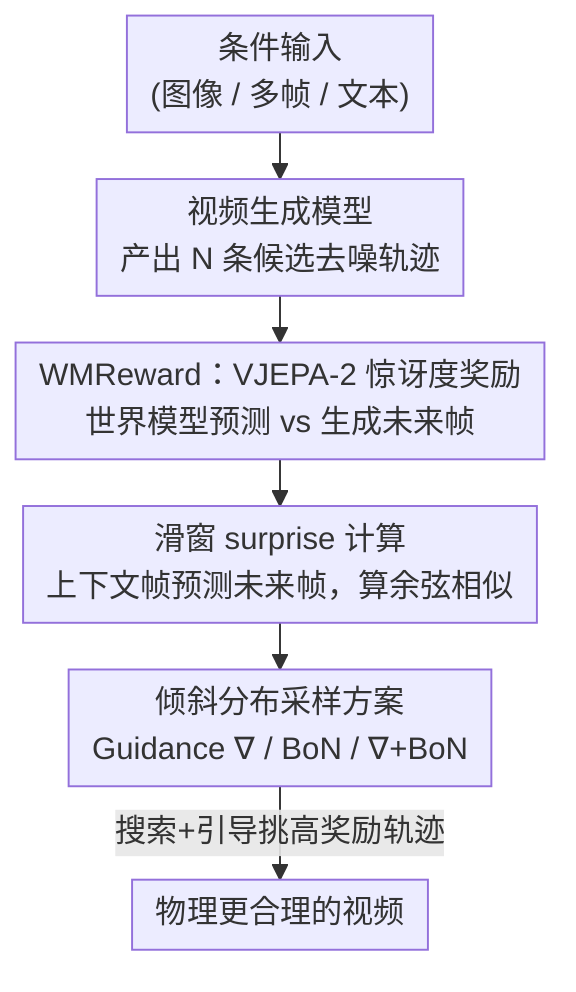

# Inference-time Physics Alignment of Video Generative Models with Latent World Models

**会议**: CVPR 2026  
**论文**: [CVF Open Access](https://openaccess.thecvf.com/content/CVPR2026/html/Yuan_Inference-time_Physics_Alignment_of_Video_Generative_Models_with_Latent_World_CVPR_2026_paper.html)  
**代码**: https://github.com/facebookresearch/WMReward  
**领域**: 视频生成 / 扩散模型 / 推理时对齐  
**关键词**: 视频生成, 物理合理性, 隐式世界模型, 推理时对齐, 奖励引导采样

## 一句话总结
用一个预训练的隐式世界模型（VJEPA-2）的"惊讶度"当奖励，在推理时对视频扩散模型的去噪轨迹做搜索与引导，让生成视频更符合真实物理，在 PhysicsIQ 挑战赛上拿到 62.64% 的第一名、比此前 SOTA 高 7.42%。

## 研究背景与动机
**领域现状**：当前 SOTA 视频生成模型（MAGI-1、Sora2、各类 vLDM）在画面观感上已经很强，但生成的视频经常违反基本物理规律——固体穿模、流体反常、时序不连贯。这对机器人、自动驾驶等把视频生成当世界模拟器用的下游应用是硬伤。

**现有痛点**：主流的修法是在**预训练/后训练阶段**往模型里注入物理信息（改数据、加物理 loss、做物理后训练）。这条路代价大、且把"物理"和"生成能力"耦合在一起。另一条推理时的路线很少有人走，仅有的几个工作依赖 VLM 改写 prompt 或规划运动，且要求底座是可控运动的生成模型。

**核心矛盾**：作者的关键观察是——物理不合理**不只**来自预训练时物理知识不足，也来自**推理采样策略本身就不是最优的**。也就是说，物理上合理的视频很可能就藏在生成模型已经学到的流形里，只是普通采样没把它们挑出来。

**本文目标**：把"提升物理合理性"重新表述为一个**推理时对齐**问题——不动生成模型权重，只在采样阶段用一个外部奖励把分布往"物理合理"的方向倾斜。这就要回答两件事：(1) 用什么当物理合理性的奖励；(2) 怎么用这个奖励真正采样出更合理的视频。

**切入角度**：隐式世界模型（latent world model）在压缩的隐空间里学习状态转移，天然聚焦运动、物体动力学、轨迹连续性这些"可预测的物理量"，而忽略外观细节，最近被证明物理理解能力很强。既然它能预测"接下来物理上该发生什么"，那它就能反过来当裁判：生成视频越偏离它的预测，越可能不合物理。

**核心 idea**：把 VJEPA-2 的"惊讶度（surprise score）"重新包装成一个可微的物理合理性奖励 WMReward，在推理时用它对去噪轨迹做搜索（Best-of-N）和梯度引导，从而从一个被奖励"倾斜"过的分布里采样。

## 方法详解

### 整体框架
方法叫 **WMReward**，核心是把一个隐式世界模型 VJEPA-2 的预测惊讶度变成物理合理性奖励，再用这个奖励在推理时把视频扩散模型的去噪过程往物理合理的方向引导。

整条 pipeline：视频生成模型产出若干条候选去噪轨迹（视频）→ 对每条生成视频，用滑动窗口把帧分成"上下文帧 + 未来帧"，让 VJEPA-2 的预测器只看上下文去预测未来帧的隐表示，再和生成视频真实未来帧的隐表示算余弦相似度，得到惊讶度奖励 → 把这个奖励 $r(x)$ 当作权重，定义一个倾斜分布 $p^*(x)\propto w(x)\,p(x)$，并用三种采样方案（梯度引导 / Best-of-N / 两者结合）把样本往高奖励区域推。整个过程不更新生成模型，纯推理时操作，本质是"花更多推理算力换更好物理"。

### 关键设计

**1. WMReward：把 VJEPA-2 的惊讶度重新当作物理合理性奖励**

针对"用什么当物理裁判"这个痛点。作者没有重新训练一个奖励模型，而是直接复用自监督训练好的隐式世界模型 VJEPA-2。VJEPA-2 的训练目标是从被遮挡的视频区域预测未被遮挡区域的隐表示：$\mathcal{L}=\|P_\phi(\Delta_m, E_\theta(x_{\text{masked}}))-\text{sg}(\bar{E}_\theta(x))\|_1$，其中 $E_\theta$ 是上下文编码器、$P_\phi$ 是预测器、$\bar{E}_\theta$ 是 EMA 目标编码器、$\text{sg}$ 是停止梯度。因为预测在特征空间而非像素空间进行，模型被迫学习运动、物体动力学这类"可预测的高层时空特征"，而不是外观细节。作者的直觉很简单：一个好的世界模型对**物理合理**的视频应该能准确预测未来；预测越偏离生成内容，说明视频越不合物理。所以惊讶度（预测与真实生成之间的偏离）就是天然的负向物理奖励。论文同时验证：这种隐空间预测式惊讶，比基于像素重建的 VideoMAE、基于 VLM 打分的 Qwen-VL 都更能代理物理合理性——后两者在搜索下甚至接近随机水平。

**2. 滑窗惊讶度计算：上下文预测未来帧，逐窗算余弦相似**

针对"如何把世界模型变成一个逐视频可比的标量奖励"。作者在生成视频上滑动一个长度为 $C+M$ 的窗口（$C$ 个上下文帧、$M$ 个待预测的未来帧）。在每个窗口位置 $k$，世界模型**只看上下文**预测未来表示 $\hat{z}_k=P_\phi(\Delta_m, E_\theta(x^{k-C+1:k}))$（未来 $M$ 个位置被 mask 掉），再把**完整窗口**编码得到真实表示 $z_k=E_\theta(x^{k-C+1:k+M})$。只取未来段的两组表示 $\hat{z}_k^{\text{fut}}, z_k^{\text{fut}}$ 算余弦相似，把所有有效窗口平均：

$$r(x)=\frac{1}{|\mathcal{K}|}\sum_{k\in\mathcal{K}}\left(1-\cos(\hat{z}_k^{\text{fut}}, z_k^{\text{fut}})\right)$$

这里 $r(x)$ 越小代表预测与生成越一致、物理越合理（即"惊讶"越低）。滑窗设计让奖励覆盖整段视频的时序，而非只看某一帧；并且这个奖励对视频 $x$ **可微**，为后面的梯度引导铺路。⚠️ 原文式 (6) 写成 $1-\cos(\cdot)$ 求和，但正文又说"未来越贴近预测奖励越高"，符号方向以原文为准。

**3. 三种倾斜分布采样方案：Guidance、Best-of-N、∇+BoN**

针对"有了奖励怎么真正采样出合理视频"。目标是从倾斜分布 $p^*(x)\propto w(x)\,p(x)$ 采样，作者给了三套互补的方案：

- **梯度引导（∇，gradient-based）**：取权重 $w(x)=\exp(\lambda r(x))$，$\lambda>0$ 是温度。可证明倾斜分布的 score 为原 score 加一项 $\nabla_{x_t}\log\mathbb{E}[e^{\lambda r(x_0)}\mid x_t]$。用 Tweedie 公式把 $\mathbb{E}[x_0\mid x_t]$ 近似出来后，得到可直接插进 SDE/ODE 采样器的近似 score：$\nabla_{x_t}\log p_t^*(x_t)\approx \nabla_{x_t}\log p_t(x_t)+\lambda\nabla_{x_t} r(x_{0|t}(x_t))$。
- **Best-of-N 搜索（BoN，gradient-free）**：从底座模型独立采 $N$ 个粒子，选奖励最高的 $x^*=\arg\max_{x} r(x)$，等价于对 $w(x)=[F(r(x))]^{N-1}$ 倾斜（$F$ 是奖励的 CDF）。
- **∇+BoN（组合）**：先用引导采 $N$ 个样本、再 BoN 选最优，权重 $w(x)=\exp(\lambda r(x))\cdot[F_\lambda(r(x))]^{N-1}$。好处是不必把 $\lambda$ 调很大（大 $\lambda$ 会让 score 近似失真），就能得到更强的倾斜；BoN 还能把引导近似不准的样本过滤掉，二者互补。实验中 ∇+BoN 的 scaling 行为最好。

### 损失函数 / 训练策略
本方法**不训练任何参数**，是纯推理时方法：生成模型和 VJEPA-2 都直接取现成权重。唯一需要配置的是搜索预算（粒子数 $N$）、引导温度 $\lambda$、滑窗的上下文/预测长度 $C,M$。代价是推理算力——见下方计算成本表。

## 实验关键数据

### 主实验
在 PhysicsIQ 基准上评测 I2V 与 V2V 生成（PhysicsIQ Score 由空间 IoU、时空 IoU、加权空间 IoU、像素 MSE 四项聚合），所有搜索方法用 16 个粒子。

| 设置 | 底座 + 方案 | PhysicsIQ Score ↑ | 相对底座 |
|------|------------|-------------------|----------|
| V2V | MAGI-1（前 SOTA） | 55.22 | — |
| V2V | MAGI-1 + WMReward(BoN) | 60.34 | +5.12 |
| V2V | MAGI-1 + WMReward(∇+BoN) | **62.00** | **+6.78** |
| I2V | Sora2（前 SOTA） | 42.30 | — |
| I2V | Sora2 + WMReward(BoN) | **46.43** | +4.13 |
| I2V | vLDM + WMReward(∇+BoN) | 33.44 | +5.68 |

> ICCV'25 PhysicsIQ 挑战赛官方结果：MAGI-1 I2V 37.39（+7.62）、V2V 62.64（+7.42），夺冠并超过此前 SOTA 7.42%。

### 消融实验
不同奖励信号在 BoN 搜索下的对比（以 vLDM/MAGI-1 为底座，PhysicsIQ Score）：

| 奖励信号 | vLDM (I2V) | MAGI-1 (I2V) | 说明 |
|----------|-----------|--------------|------|
| 无（vanilla） | 27.76 | 29.77 | 底座基线 |
| VideoMAE(BoN) | 29.42 (+1.66) | 29.95 (+0.18) | 像素重建惊讶 |
| Qwen2.5-VL(BoN) | 26.21 (−1.55) | 24.99 (−4.78) | VLM 打分，反而掉点 |
| Qwen3-VL(BoN) | 28.51 (+0.75) | 30.21 (+0.44) | VLM 打分，提升微弱 |
| **WMReward(BoN)** | **32.90 (+5.14)** | **36.56 (+6.79)** | 隐空间惊讶，最优 |

### 关键发现
- **隐空间惊讶 > 像素重建 > VLM 打分**：WMReward 大幅领先，VLM 类奖励（Qwen2.5-VL）甚至常常把分数拉低、接近随机水平，说明"会描述物理"不等于"能判断物理"。
- **可扩展性强**：增大粒子数 $N$，PhysicsIQ 稳步上升，$N\le 4$ 时提升最猛、之后方差变小趋于稳定；加引导（∇+BoN）会把分数分布的高分尾部进一步收紧，scaling 行为优于纯 BoN。
- **人类研究佐证**：在 PhysicsIQ/VideoPhy 上做 side-by-side 人评，WMReward(∇+BoN) 在物理合理性、视觉质量上均显著胜出，物理合理性的胜率提升最明显（如 MAGI-1 在 VideoPhy 物理合理性准确率 30.4→69.6）。
- **已知 trade-off**：在 T2V（VideoPhy）上物理一致性 PC 提升明显（MAGI-1 +8.1%、vLDM +6.9%），但语义贴合 SA 略降——因为 VJEPA 惊讶不含文本语义信息。
- **算力代价**：BoN 的时间约为 $\times N$、显存几乎不变；引导（∇）单粒子时间约 $\times 5$、显存约 $\times 2{\sim}4$。物理换算力是这类推理时对齐方法的固有代价。

## 亮点与洞察
- **"惊讶度即物理奖励"是核心 aha**：把一个自监督世界模型的预测误差直接当裁判，零额外训练就拿到一个比 VLM 更靠谱的物理合理性奖励，思路干净且可迁移到任何有强物理先验的隐式世界模型。
- **奖励可微 → 引导与搜索通吃**：因为 $r(x)$ 对视频可微，既能做 gradient-free 的 BoN，又能做 gradient-based 的 score 引导，还能组合，三套方案覆盖了不同算力/质量权衡点。
- **把物理修复从训练侧搬到推理侧**：不动生成模型权重就能涨点，意味着任何现成视频模型（包括只有 API 的 Sora2）都能即插即用地"加物理"，这对工程落地非常友好。
- **可迁移 trick**：用"预测式自监督模型的 surprise"当奖励的范式，不止于物理，凡是"某种性质能被一个预测模型捕捉"的场景（如时序连贯、动作可行性）都可照搬。

## 局限与展望
- **语义贴合下降**：VJEPA 惊讶不感知文本，T2V 下语义贴合 SA 会掉，作者建议未来做组合式或文本条件化的物理奖励。
- **推理算力昂贵**：引导单粒子约 $\times 5$ 时间、显存翻倍，BoN 线性放大时间，部署成本不可忽视。
- **依赖世界模型的物理上限**：奖励质量被 VJEPA-2 的物理理解能力封顶，世界模型判不准的物理（如复杂多体交互）也修不好。
- **指标本身的局限**：PhysicsIQ/VLM 评测器都是代理指标，"物理合理"的定义仍偏窄；人评虽佐证但样本量有限（约 198 条/组）。

## 相关工作与启发
- **vs 预训练/后训练注入物理（如改数据、加物理 loss）**：他们改模型权重、代价大且耦合生成能力；本文不动权重、纯推理时对齐，任何现成模型即插即用，但代价是推理算力。
- **vs VLM 改写 prompt / 规划运动（VLIPP 等）**：他们靠 VLM 在文本侧或运动侧干预、且常要求可控运动底座；本文直接在去噪轨迹上用世界模型奖励搜索/引导，且实验证明 VLM 打分当奖励效果很差。
- **vs 图像生成里的奖励引导采样（BoN 选种子 / score 引导）**：本文把这套推理时对齐范式首次系统迁移到**视频物理合理性**，并指出隐式世界模型才是这里更合适的奖励来源。

## 评分
- 新颖性: ⭐⭐⭐⭐⭐ 把世界模型惊讶度当物理奖励、推理时对齐视频生成，角度新且打通了搜索与引导。
- 实验充分度: ⭐⭐⭐⭐⭐ 覆盖 I2V/V2V/T2V 三设置、多底座、多奖励对比、scaling 曲线与人评，还拿了挑战赛冠军。
- 写作质量: ⭐⭐⭐⭐ 动机与方法推导清晰，但奖励符号方向、部分公式排版略有歧义。
- 价值: ⭐⭐⭐⭐⭐ 即插即用给任意视频模型"加物理"，对机器人/自动驾驶世界模拟有直接价值。

<!-- RELATED:START -->

## 相关论文

- [\[CVPR 2026\] Latent-Compressed Variational Autoencoder for Video Diffusion Models](latent-compressed_variational_autoencoder_for_video_diffusion_models.md)
- [\[CVPR 2026\] PhysVid: Physics Aware Local Conditioning for Generative Video](physvid_physics_aware_local_conditioning_for_generative_video_models.md)
- [\[CVPR 2026\] ProPhy: Progressive Physical Alignment for Dynamic World Simulation](prophy_progressive_physical_alignment_for_dynamic_world_simulation.md)
- [\[CVPR 2026\] Ref4D-VideoBench: Four-Dimensional Reference-Based Evaluation of Text-to-Video Generative Models](ref4d-videobench_four-dimensional_reference-based_evaluation_of_text-to-video_ge.md)
- [\[ICLR 2026\] DrivingGen: A Comprehensive Benchmark for Generative Video World Models in Autonomous Driving](../../ICLR2026/video_generation/drivinggen_a_comprehensive_benchmark_for_generative_video_world_models_in_autono.md)

<!-- RELATED:END -->
