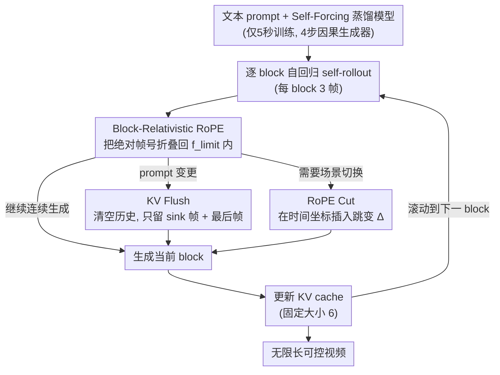

# Infinity-RoPE: Action-Controllable Infinite Video Generation Emerges From Autoregressive Self-Rollout

**会议**: CVPR 2026  
**arXiv**: [2511.20649](https://arxiv.org/abs/2511.20649)  
**代码**: [Project Page](https://infinity-rope.github.io)  
**领域**: 视频生成 / 扩散模型  
**关键词**: 自回归视频生成, 位置编码, 无限长视频, 动作控制, 推理时方法

## 一句话总结

提出 ∞-RoPE，一个训练免调的推理时框架，通过 Block-Relativistic RoPE、KV Flush 和 RoPE Cut 三个组件，将仅在5秒视频上训练的自回归视频扩散模型扩展为支持无限时长生成、精细动作控制和电影级场景切换的系统。

## 研究背景与动机

当前自回归视频扩散模型面临三大核心瓶颈：

**有限时间范围**：3D-RoPE 位置编码将生成限制在固定的 1024 帧内，超出后注意力质量急剧退化

**动作响应迟钝**：在长序列 rollout 中，prompt 变更无法立即生效，KV cache 中的旧语义持续影响生成

**缺乏场景跳转能力**：无法在单一生成流中实现电影式的不连续场景切换

**关键洞察**：在 Self-Forcing 范式下仅训练5秒片段的模型，实际上已经具备高动态的无限时长生成能力——瓶颈不在模型容量，而在位置编码的绝对索引机制。作者提出通过相对性的位置编码重参数化和 KV cache 管理来突破，无需任何额外训练。

## 方法详解

### 整体框架

∞-RoPE 想解决的问题很具体：一个只在5秒片段上蒸馏出来的自回归视频扩散模型（这里是 Self-Forcing 蒸馏的 Wan2.1-T2V-1.3B，4步因果生成器），凭什么能被"骗"去生成无限长、还能随时换动作、甚至切镜头的视频？作者的答案是——不碰模型权重，只在推理时改写它读取时间位置的方式。整条 pipeline 仍然是逐 block（3帧一组）自回归往后滚，但每滚一步都对 RoPE 的时间坐标和 KV cache 做一次"手术"：Block-Relativistic RoPE 负责把无限延伸的绝对帧号折叠回模型见过的范围，让长度不再是天花板；KV Flush 负责在 prompt 变更时清掉旧语义，让新动作立刻生效；RoPE Cut 负责在时间轴上制造受控断点，让画面能像电影一样硬切到另一个场景。三者共享同一套相对化的坐标系，因此可以叠加使用。

### 关键设计

**1. Block-Relativistic RoPE：把绝对帧号折叠成"移动的局部参考系"，让长度不再受 RoPE 训练范围限制**

瓶颈不在模型容量，而在 3D-RoPE 的绝对索引：自回归每 3 帧推进一个 block $\mathbf{B}_f = \{f-2, f-1, f\}$，一旦 $f$ 越过训练时见过的上限 $f_{\text{limit}}$，注意力就落进从未训练过的位置区域，质量急剧崩塌。Block-Relativistic RoPE 的做法是不再让新帧拿到越来越大的绝对编号，而是把当前 block 的时间坐标始终旋转回 $f_{\text{limit}}$ 以内，并把更早 block 的相位反向旋转，使得任意两个 block 之间的*相对*时间几何保持不变。形式上，超过 onset index $f_0$ 之后的 block 坐标都被钉在同一个参考点上：

$$\tilde{\mathbf{B}}_i = \begin{cases} \mathbf{B}_i, & \text{if } i \leq f_0 \\ \mathbf{B}_{f_0} = \{f_0-2, f_0-1, f_0\}, & \text{otherwise} \end{cases}$$

这样无论生成到第几帧，模型看到的局部时间结构都和训练时一致。作者用一个认知科学的类比来解释为什么"丢掉绝对时间"反而没坏处：人脑的远期记忆会经历"语义化"（semanticization），精确的时间戳被抹掉、只剩语义内容——这里最早缓存帧的时间坐标干脆坍缩成共享的最小索引 $\mathbf{B}_{\bar 1} = \{1,1,1\}$，它们仍提供语义上下文，但不再争夺精确的时间定位。

**2. KV Flush：换 prompt 时清空缓存只留两个锚点，把"动作响应"从滞后变成零延迟**

长 rollout 里 prompt 改了却不生效，根因是 KV cache 里塞满了旧动作的语义，新指令被它们压着、要好几帧才能"挣脱"。KV Flush 的应对很直接：prompt 一变就把中间历史全部清掉，只保留两个最小锚点——一个全局 **sink 帧**（稳住注意力的归一化，避免数值塌陷），一个**最后生成帧**（接住局部的运动连续性）。新动作直接在这两帧上重新条件化，于是"切换"几乎瞬时发生。和三种朴素做法相比它都更好：no-cache 会让画面突兀跳变，full-cache 会让语义迟迟跟不上，KV re-cache 则要重算缓存、延迟很高。

**3. RoPE Cut：在时间坐标里制造一个受控断点，实现电影级的硬场景切换**

前两个设计保证了"连续"，但电影常常需要"不连续"——直接切到另一个镜头。RoPE Cut 利用相对化坐标系里没有绝对位置这一点，对当前 block 的时间坐标人为插入一个跳变 $\Delta$：

$$\mathbf{B}_{f \to f+\Delta} = \{f-2,\; f+\Delta-1,\; f+\Delta\}$$

跳变之后的帧被当作"刚刚发生的过去上下文"，生成则从一个全新的原始时间位置重新起步。因为坐标系是相对的、会随每次 cut 自行平移，即便跨度很大的时间或语义跳转，主体身份依然能保持一致，不会因为"换了个场景"就把人物画崩。

### 损失函数 / 训练策略

∞-RoPE 是**纯推理时方法**，不引入任何额外训练。底层 Self-Forcing 模型按 Rectified Flow 训练，前向插值为 $\mathbf{x}_t = (1-t)\mathbf{x}_0 + t\boldsymbol{\epsilon}$，逆过程由神经速度场 $v_\theta$ 参数化的 ODE 求解。推理时的关键设置：KV cache 大小固定为 6，onset index $f_0 = 21$，CFG scale 3.0，timestep shift 5.0。

## 实验关键数据

### 主实验

VBench 评测，5秒和60秒视频生成（表格为60秒数据）：

| 模型 | Background Consistency | Dynamic Degree | Subject Consistency | Overall |
|------|----------------------|---------------|-------------------|---------|
| NOVA | 0.8806 | 0.12 | 0.7750 | 0.6901 |
| SkyReels-V2 | 0.8995 | 0.44 | 0.8499 | 0.7768 |
| CausVid | 0.8985 | 0.52 | 0.8675 | 0.7940 |
| Self-Forcing | 0.8784 | 0.32 | 0.8360 | 0.7715 |
| Rolling-Forcing | 0.9447 | 0.36 | 0.9409 | 0.8146 |
| **∞-RoPE** | **0.9490** | **0.52** | **0.9444** | **0.8298** |

120秒和240秒超长视频（240秒数据）：

| 模型 | Background Consistency | Dynamic Degree | Subject Consistency | Overall |
|------|----------------------|---------------|-------------------|---------|
| Rolling-Forcing | 0.9248 | 0.40 | 0.9080 | 0.8017 |
| **∞-RoPE** | **0.9361** | **0.64** | **0.9256** | **0.8309** |

### 消融实验

| 配置 | 关键指标 | 说明 |
|------|---------|------|
| Block-Relativistic RoPE 开启 vs 关闭 | Self-Forcing 单独无法维持动态长视频 | 仅5秒训练模型+BRRoPE 即可生成高质量30s+ |
| KV cache 大小扫描 | Overall/Aesthetic/Dynamic 随 cache 变化 | 固定 cache 6 在各时长上达到最佳平衡 |
| KV Flush 对比 no-cache/full-cache/re-cache | 即时语义响应+平滑运动连续 | KV Flush 在效率和可控性上全面领先 |

### 关键发现

- ∞-RoPE 在所有时长（5s/60s/120s/240s）上的 Overall 分数均为最高或并列最高
- 关键优势在 **Subject Consistency** 和 **Background Consistency**，在超长视频中优势更加显著
- Dynamic Degree 在 240s 达到 **0.64**，远超其他方法（大多 0.24-0.40），说明长期生成不会退化为静止

## 亮点与洞察

- **认知科学启发的设计**：将远期帧的时间坐标坍缩为"语义记忆"，类比人类记忆中的 semanticization 过程
- **注意力图的可解释性**：通过 attention map 可视化清晰展示了 BRRoPE（对角带+sink列）、KV Flush（切断中间历史）、RoPE Cut（分裂为两个独立对角块）的不同结构
- **零训练开销**：作为纯推理时方法，可即插即用于任何 Self-Forcing 变体

## 局限与展望

- 依赖 Self-Forcing 蒸馏的基础模型，模型本身的生成质量上限不变
- 场景切换的语义连贯性依赖 sink 帧的全局信息，复杂场景下可能不足
- 仅在 1.3B 参数模型上验证，14B 级模型的效果未知

## 相关工作与启发

- **Self-Forcing / Self-Forcing++**：提供了自回归 rollout 训练范式，∞-RoPE 在其基础上实现推理时突破
- **Rolling Forcing**：渐进噪声窗口方法是主要竞争者，但仍受限于 RoPE 范围
- **FLEX**：后续工作引入频率感知 RoPE 调制，与本文互补

## 评分

- **新颖性**: ★★★★☆ — 位置编码的相对性重参数化思路巧妙，认知科学类比有启发
- **技术深度**: ★★★★☆ — 三个组件设计完整、互相配合，机理分析充分
- **实验充分度**: ★★★★☆ — VBench 多时长全面评测，但缺少用户研究
- **实用性**: ★★★★★ — 训练免调、即插即用，实际部署潜力大

<!-- RELATED:START -->

## 相关论文

- [\[CVPR 2026\] FlashPortrait: 6× Faster Infinite Portrait Animation with Adaptive Latent Prediction](flashportrait_6x_faster_infinite_portrait_animation_with_adaptive_latent_predict.md)
- [\[CVPR 2026\] HandWorld: Hand-Centric Unified Video Action Generation](handworld_hand-centric_unified_video_action_generation.md)
- [\[CVPR 2026\] PerpetualWonder: Long-horizon Action-conditioned 4D Scene Generation](perpetualwonder_long-horizon_action-conditioned_4d_scene_generation.md)
- [\[CVPR 2026\] VISTA: A Test-Time Self-Improving Video Generation Agent](vista_a_test-time_self-improving_video_generation_agent.md)
- [\[NeurIPS 2025\] Self Forcing: Bridging the Train-Test Gap in Autoregressive Video Diffusion](../../NeurIPS2025/video_generation/self_forcing_bridging_the_train-test_gap_in_autoregressive_video_diffusion.md)

<!-- RELATED:END -->
