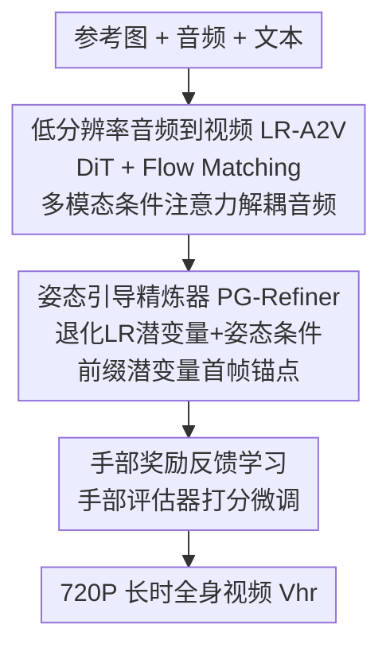

# InfinityHuman: Towards Long-Term Audio-Driven Human Animation

**会议**: CVPR 2026  
**论文**: [CVF Open Access](https://openaccess.thecvf.com/content/CVPR2026/html/Li_InfinityHuman_Towards_Long-Term_Audio-Driven_Human_Animation_CVPR_2026_paper.html)  
**代码**: https://infinityhuman.github.io/ (项目页)  
**领域**: 视频生成（音频驱动人体动画）  
**关键词**: 音频驱动动画、长视频生成、姿态引导精炼、手部奖励学习、扩散模型

## 一句话总结
InfinityHuman 提出"先低分辨率出动作、再姿态引导精炼"的 coarse-to-fine 框架，用与外观解耦、抗时间退化的姿态序列 + 首帧视觉锚点来对抗长视频中的身份漂移和色偏，并引入手部专属奖励反馈学习修正手部畸变，在 EMTD/HDTF 上把长时音频驱动全身动画的画质、身份保持、手部准确度和唇音同步全面刷到 SOTA。

## 研究背景与动机
**领域现状**：音频驱动人体动画从单张图+音频生成会说话的人物视频，已从驱动面部/头部进化到全身动画，应用于广告、vlog、影视。主流做法基于潜空间扩散模型，靠**重叠运动帧（overlapping motion frames）**把短视频自回归地续成长视频。

**现有痛点**：长视频生成有两大顽疾。一是**长时视觉一致性差**——随序列变长，自回归续帧的误差不断累积，表现为身份漂移（脸型/服装变样）、全局色偏（色调忽明忽暗）、场景不稳（背景物体漂移或消失），论文 Figure 2 直观展示了这种"渐进式退化"。二是**手部运动不自然**——以往工作主要盯着面部和粗略躯干，忽略了手这种"幅度小但速度快"的部位，导致大幅手势频繁畸变、手指数目错乱，且手动作与音频不同步。

**核心矛盾**：自回归续帧机制本身就是误差累积之源——每段都以上一段的输出为条件，外观相关的特征（颜色、身份）会沿时间一路漂移；而手部因为运动剧烈、人眼又对手部畸变极其敏感，成了最难啃的细节。

**本文目标**：拆成两个子问题——(1) 如何在超长（数十秒）续生成中遏制外观漂移、保住身份和唇同步；(2) 如何专门提升手部的结构正确性和真实感。

**切入角度**：作者抓住一个关键观察——**姿态序列与外观结构上解耦，因此天然抗时间退化**：颜色/身份会漂，但骨架关键点在长序列里高度稳定，还保留唇动等细粒度运动。于是用姿态当"可靠的导航信号"，再配首帧当视觉锚点。手部则借鉴偏好微调思路，用奖励模型直接对齐手部真实感。

**核心 idea**：coarse-to-fine——先生成与音频同步的低分辨率动作，再用**姿态引导精炼器**把它修成高分辨率长视频；姿态抗退化负责"稳"，首帧锚点负责"像"，手部奖励负责"对"。

## 方法详解

### 整体框架
InfinityHuman 从单张参考图 $I_{ref}$、音频 $c_{audio}$ 和可选文本 $c_{text}$ 出发，分三段产出高分辨率长时全身说话视频 $V_{hr}$。第一段**低分辨率音频到视频（LR-A2V）**用 DiT + Flow Matching 生成与音频同步的粗动作 $V_{lr}$（360P）；第二段**姿态引导精炼器（PG-Refiner）**以 $V_{lr}$ 和 $I_{ref}$ 为条件，借姿态序列和首帧锚点把粗视频修成 720P 高清并纠正累积误差；贯穿训练的第三段**手部奖励反馈学习**专门修手部畸变。

### 关键设计

**1. 低分辨率音频到视频 + 多模态条件注意力：先把动作和唇同步做对，再谈高清**

coarse 阶段不追求画质，只求动作和音频对齐。骨干是 DiT $f_\theta$，用 **Flow Matching** 训练：对每帧潜变量 $z^{lr}_i$ 按 $z^{lr}_{i,t}=(1-t)\epsilon_i + t\,z^{lr}_{i,1}$ 加噪，让模型预测速度场 $v_{i,t}=z^{lr}_{i,1}-\epsilon_i$，目标即最小化全帧速度预测误差（式 3）。关键设计是**多模态条件注意力**——作者发现把音频和文本/图像混在一起喂注意力会互相干扰，于是**给音频单开一条 cross-attention 分支**：$CA^{mm}(x^{lr},c_{text},c_{audio})=CA(x^{lr},c_{text})+CA(x^{lr},c_{audio})$。解耦后音频线索能更精准地驱动嘴型和身体动态，唇同步质量明显提升。

**2. 姿态引导精炼器：用抗退化的姿态 + 首帧锚点修掉长视频漂移**

这是对抗身份漂移的核心。痛点是低分辨率长视频 $V_{lr}$ 时间上累积误差、外观偏离参考图。PG-Refiner 用三个条件协同解决：(a) **退化 LR 潜变量条件**——故意用低通滤波 + 加噪模拟时间退化 $z_{deglr}=\text{LPF}(z^{lr})+\alpha_{deg}\cdot\epsilon$，逼模型学会恢复细节、纠正结构错误；(b) **姿态引导条件**——从 $V_{lr}$ 抽人体+背景关键点编成 8 通道像素级姿态张量 $P$（前 7 通道编人体、最后 1 通道编最多 20 个背景关键点），patch 化后投影并与高分潜变量相加 $z'_{hr}=z_{hr}+\text{Proj}(P')$；姿态结构性强、保留唇动等细粒度运动、且长序列里几乎不累积误差，比扩散超分中直接用音频更稳，能减少手指重叠、运动畸变；(c) **前缀潜变量首帧锚点**——把参考图编码成前缀潜变量 $z^{hr}_0=E(I_{ref})$，前向扩散时**只给未来帧加噪**（式 6：$0\le i\le m$ 保持无噪、$m<i\le f$ 才加噪），无噪前缀帧不计入损失（mask $w_i$，式 7-8），靠 DiT 的 3D 全局注意力直接从前缀帧抽身份特征。这套"prefix-latent 参考策略"不需要额外的结构对齐参考网络，且推理时新 chunk 的前 $m$ 个潜变量取自上一 chunk 的后 $m$ 个，保证段间动作平滑衔接。

**3. 手部专属奖励反馈学习：用偏好微调直击手部畸变**

人眼对手部畸变（手指数目错、关节不自然、纹理断裂）极其敏感，但以往模型几乎不专门建模手。作者先人工构建 1 万对手部结构配对数据（10 名专业标注者从 4 万候选图里标注筛选），在开源 MPS 模型上微调出一个**手部专属评估器** $r_{hand}$。训练时把低分潜变量序列解码成 RGB 帧、随机抽一帧 $X^{lr}_i$ 送评估器打分，目标为 $L_{hand}(\theta)=\mathbb{E}\,[\,T - r_{hand}(X^{lr}_i, c)\,]$（式 9，$T$ 为手部质量阈值）。这是一种**无需额外标注**的细粒度偏好微调——直接用评估器奖励把扩散模型往"手更真"的方向推，显著减少手指畸变、提升手势的时间一致性。

### 损失函数 / 训练策略
LR-A2V 和 PG-Refiner 都从预训练 Goku-I2V 起步。数据上用 SceneDetect 切段、YOLO 跟单人做时空裁剪，按画质/美学/运动幅度/手清晰度等过滤得 7700 小时单人片段训精炼器，再用 SyncNet 筛唇音同步得 1800 小时（每段 4 秒）训 LR-A2V。训练用多条件 dropout（文本/音频各 10%、参考图/首帧各 20%）增鲁棒；PG-Refiner 借 HumanDiT 多分辨率训练策略、姿态与 LR 潜变量各 20% dropout。两模型均用 128 张 NVIDIA GPU、学习率 5e-5。推理时 LR-A2V 用音频/文本 CFG 6.5、30 步；PG-Refiner 用姿态 CFG 1.5、20 步，并把 PG-Refiner 蒸馏成 1 步模型以加速。

## 实验关键数据

### 主实验（EMTD 全身 + HDTF 说话头，对比 SOTA）
EMTD 含 110 段 720P 上半身+手视频（最长 74 秒）；HDTF 取 100 段 512×512 说话脸。`*` 标记仅支持说话头的方法。

| 数据集/方法 | FID↓ | FVD↓ | IQA↑ | SYNC-C↑ | FSIM↑ | HKC↑ |
|------|------|------|------|---------|-------|------|
| HDTF · Hallo3 | 74.10 | 250.12 | 1.95 | 7.31 | 0.91 | - |
| HDTF · MultiTalk | 85.01 | 404.45 | 1.78 | 8.76 | 0.84 | - |
| HDTF · **Ours** | **69.28** | **239.05** | **2.11** | 8.59 | 0.89 | - |
| EMTD · Hallo3 | 104.51 | 1256.10 | 2.31 | 4.26 | 0.73 | 0.77 |
| EMTD · OmniAvatar | 82.54 | 1104.99 | 2.16 | 5.40 | 0.72 | 0.86 |
| EMTD · **Ours** | **60.71** | **979.88** | **2.48** | **6.56** | **0.84** | **0.90** |

> **FSIM**=FaceSIM 身份一致性；**HKC**（Hand Keypoint Confidence）=手部关键点平均置信度，越高表示手结构越可信；**HKV**（Hand Keypoint Variance）=手部关键点方差，反映手部运动幅度/抖动（非越大越好，需结合 HKC 看）。全身场景下 InfinityHuman 的 FaceSIM 0.84（vs Hallo3 0.73）、HKC 0.90 均为最佳。

### 消融实验（验证各模块）
| 配置 | FID↓ | FVD↓ | FSIM↑ | HKC↑ | 说明 |
|------|------|------|-------|------|------|
| w/o refiner | 109.54 | 876.49 | 0.79 | 0.85 | 去掉姿态引导精炼器，FID/FSIM 大幅恶化 |
| w/o lr cond | 91.92 | 1001.00 | 0.86 | 0.85 | 去掉退化 LR 潜变量条件，FVD 升高 |
| w/o pose cond | 156.74 | 1163.75 | 0.83 | 0.83 | 去掉姿态条件，FID 飙到 156.74（掉点最狠）|
| w/o hand refl | 86.32 | 844.57 | 0.86 | 0.85 | 去掉手部奖励，HKC 降到 0.85 |
| **ours（完整）** | 91.74 | **758.98** | **0.88** | **0.87** | 完整模型 FVD/FSIM/HKC 最佳 |

### 关键发现
- **姿态条件贡献最大**：去掉 pose cond 后 FID 从 91.74 暴涨到 156.74、FVD 也最差，印证"姿态是抗退化导航信号"这一核心假设。
- **精炼器决定身份与画质**：去掉 refiner 后 FSIM 从 0.88 跌到 0.79，长时身份一致性显著恶化。
- **手部奖励专修手**：去掉 hand refl 后 HKC 由 0.87 降到 0.85，手部置信度下滑，说明该模块确实在改善手结构。⚠️ 各消融项对应指标存在轻微非单调（如 w/o lr cond 的 FID 反低于完整模型），作者以综合指标论证有效性。

## 亮点与洞察
- **"姿态抗退化"这个观察是全文支点**：把"颜色/身份会漂、骨架不会漂"这一物理直觉转成可用的条件信号，比硬塞更多参考网络优雅，可迁移到任何长视频续生成任务。
- **prefix-latent 首帧锚点+只给未来帧加噪**：无噪前缀帧靠 DiT 的 3D 全局注意力直接供身份特征、还不计入损失，是个干净的长序列身份保持技巧，省掉了独立的参考网络分支。
- **退化模拟训练（LPF+加噪）很巧**：主动制造"时间退化"让精炼器学纠错，等于把推理时会遇到的退化提前喂进训练，思路可复用到其他"修复累积误差"的场景。
- **手部当成独立奖励对象**：把人眼最敏感的手单拎出来做偏好微调、无需额外标注，是对"全身一把抓"范式的有效补丁。

## 局限与展望
- **数据与算力门槛极高**：7700 小时精炼数据 + 1800 小时 A2V 数据 + 1 万手部标注（从 4 万候选筛），128 张 GPU 训练，复现成本巨大。
- **手部奖励依赖单帧随机采样**：$L_{hand}$ 每次只解码一帧打分，可能漏掉跨帧的手部时序不连贯；视频级手部奖励或是改进方向。
- **姿态质量决定上限**：方法重度依赖姿态估计器（Sapiens）抽取的关键点，遮挡/极端姿态下若姿态估计失败，精炼器的"导航"也会失准。
- **仍是分段自回归**：虽缓解但未根除误差累积，超长序列（远超 74 秒）下是否仍稳，论文未充分验证。⚠️ HKV 作为手部度量解释性偏弱，论文未给阈值/方向性结论。

## 相关工作与启发
- **vs 重叠运动帧续帧法（MultiTalk / OmniAvatar / Hallo3）**：他们直接以上段运动帧为条件自回归续帧、误差累积导致身份漂移；本文用 coarse-to-fine + 姿态引导精炼，把"续得长"和"修得稳"解耦，FID/FSIM 全面更优。
- **vs 训练无关长视频扩展（Gen-L-Video / FreeNoise）**：滑窗注意力/噪声重排虽高效但时序建模弱、过渡不连贯；本文用专门训练的精炼器换取更强一致性。
- **vs 说话头/面部驱动法（SadTalker / V-Express / EchoMimic）**：它们只驱动面部、不做全身和手；InfinityHuman 覆盖全身长时动画且专攻手部真实感，应用面更广。

## 评分
- 新颖性: ⭐⭐⭐⭐ "姿态抗退化"+前缀潜变量锚点+手部奖励三招组合解决长时漂移，思路新但单招多有渊源。
- 实验充分度: ⭐⭐⭐⭐⭐ EMTD/HDTF 双数据集、对比 8 个 SOTA、完整消融 + 用户测试，覆盖画质/唇同步/身份/手部多维度。
- 写作质量: ⭐⭐⭐⭐ pipeline 与公式清晰，但部分消融指标非单调、HKV 解释偏弱。
- 价值: ⭐⭐⭐⭐ 长时音频驱动全身动画的强基线，对数字人/虚拟主播落地有实用价值；门槛高限制了可复现性。

<!-- RELATED:START -->

## 相关论文

- [\[CVPR 2026\] Soul: Breathe Life into Digital Human for High-fidelity Long-term Multimodal Animation](soul_breathe_life_into_digital_human_for_high-fidelity_long-term_multimodal_anim.md)
- [\[CVPR 2026\] One-to-All Animation: Alignment-Free Character Animation and Image Pose Transfer](one-to-all_animation_alignment-free_character_animation_and_image_pose_transfer.md)
- [\[CVPR 2026\] Vanast: Virtual Try-On with Human Image Animation via Synthetic Triplet Supervision](vanast_virtual_try-on_with_human_image_animation_via_synthetic_triplet_supervisi.md)
- [\[CVPR 2026\] UniAVGen: Unified Audio and Video Generation with Asymmetric Cross-Modal Interactions](uniavgen_unified_audio_and_video_generation_with_asymmetric_cross-modal_interact.md)
- [\[CVPR 2026\] Free-Lunch Long Video Generation via Layer-Adaptive O.O.D Correction](free-lunch_long_video_generation_via_layer-adaptive_ood_correction.md)

<!-- RELATED:END -->
