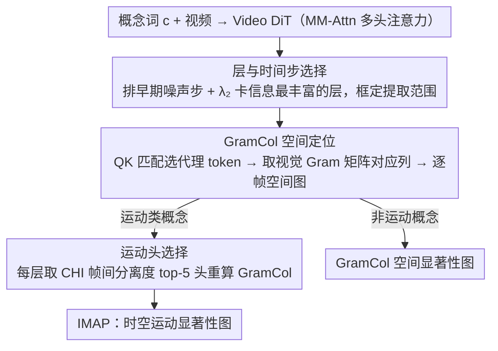

# I'm a Map! Interpretable Motion-Attentive Maps: Spatio-Temporally Localizing Concepts in Video Diffusion Transformers

**会议**: CVPR 2026  
**arXiv**: [2603.02919](https://arxiv.org/abs/2603.02919)  
**代码**: [https://github.com/youngjun-jun/IMAP](https://github.com/youngjun-jun/IMAP)  
**领域**: 视频生成  
**关键词**: 视频扩散模型, 可解释性, 运动定位, 注意力分析, 显著性图

## 一句话总结
提出IMAP(可解释运动注意力图)，通过GramCol空间定位和运动头选择时序定位两个无训练模块，从Video DiT中提取运动概念的时空显著性图，在运动定位和零样本视频语义分割上超越现有方法。

## 研究背景与动机
1. **领域现状**: Video Diffusion Transformers(如CogVideoX/HunyuanVideo)已能生成高质量视频，但对其内部机制的理解仍不充分。现有可解释性工作主要集中在图像DiT上。
2. **现有痛点**: 已有方法ConceptAttention仅提供空间分离，不处理运动/时序；DiTFlow/DiffTrack关注帧间视觉token的动态对应，但不分析文本如何转化为运动。核心问题未解答：Video DiT真的理解并创造运动了吗？
3. **核心矛盾**: 视频的核心区别于图像的是时序运动信息，但现有显著性图方法只做空间定位，无法回答"何时、哪个物体在运动"这一关键问题。
4. **本文目标**: 为视频DiT中的运动概念构建时空定位的可解释显著性图。
5. **切入角度**: 分析Video DiT的多头注意力发现：QK匹配有强空间定位能力，帧嵌入分离度与运动可定位性相关。不同注意力头有不同角色——某些头专注时序运动特征。
6. **核心 idea**: 用GramCol做空间定位（文本代理token+Gram矩阵），用帧分离度评分选择运动头做时序定位。

## 方法详解

### 整体框架
这篇论文想回答一个被现有可解释性工作绕开的问题：Video DiT 到底"何时、在哪里"处理了一个运动概念？答案是从模型已有的多头注意力里直接读出来，不训练、不求梯度。整条 pipeline 挂在 Video DiT 的 MM-Attn 模块上，按"先框范围、再定空间、后定时序"三步推进。第一步先把"在哪读"框定下来：$L$ 层 × $T$ 个时间步是个巨大搜索空间，全平均会稀释信号，于是先排掉早期接近纯噪声的时间步、再用第二大特征值 $\lambda_2$ 挑出语义最丰富的层，把后续计算限定在这个范围内。第二步做空间定位：给定一个概念词（如"奔跑"），用 QK 匹配在每一帧里找出最能代表这个文本概念的视觉 token，把跨模态定位问题转成同模态相似度问题，再用 GramCol 取视觉 Gram 矩阵对应列得到逐帧的空间显著性图。第三步对"运动"类概念额外做一步运动头选择——只留下帧间差异最大的那几个注意力头来重算图，把空间噪声滤掉，得到既定空间又定时序的 IMAP。全程只是对已有特征做读取和挑选，所以额外开销相对 DiT 推理本身可以忽略。

### 关键设计

**1. 层与时间步选择：用 $\lambda_2$ 自动框定"信息最丰富"的提取范围，避免全聚合稀释信号**

这是 pipeline 的第一步，决定后面 GramCol 到底从哪些时间步、哪些层去读特征。$L$ 层 × $T$ 个时间步是个很大的空间，若一股脑全平均，有用的信号会被淹掉。时间步上先排除早期那些接近纯噪声、语义不可读、还容易蹦出水印这类记忆伪影的步。层的选择则借用 TokenRank 的 DTMC 视角——把注意力矩阵看成转移矩阵，用它的第二大特征值 $\lambda_2$ 衡量该层是否 informative，$\lambda_2$ 越大越值得用。具体阈值按 backbone 定：CogVideoX 取 $\lambda_2 > 0.7$ 的层，HunyuanVideo 取 $> 0.75$。这样就用一个特征值自动卡掉了低信息层，省去逐层手调。

**2. GramCol 空间定位：用同模态 Gram 矩阵替掉跨模态相乘，保证"正向高亮"**

范围框定后，第二步在选定范围内逐帧定空间。ConceptAttention 这类方法直接拿文本特征和视觉特征跨模态相乘来高亮区域，问题是不同注意力头里跨模态相似度的行为很不一致，结果不稳定。GramCol 的做法是先绕开跨模态：对每帧 $f_i$，用 QK 匹配 $s_{f_i}^c = \arg\max_p \text{row}_p(q_{f_i})k_c^\top$ 选出与概念 $c$ 最匹配的那个视觉 token，把它当作文本概念的"代理"。空间图就取视觉 Gram 矩阵 $G = h_x h_x^\top \in \mathbb{R}^{P\times P}$ 的第 $s_{f_i}^c$ 列——也就是所有视觉 token 与这个代理 token 在同一模态空间里的相似度向量，再对选定的时间步、层、头取平均。因为是同模态相似度，与代理相似的区域天然拿到正的大值，"高亮"这件事是有保证的；而且它不像 softmax 那样要把整个概念列表放在一起竞争，单独给一个概念也能算。对非运动概念，GramCol 本身就已给出空间显著性图。

**3. 运动头选择：用帧间分离度把"管运动"的头挑出来，实现时序定位**

光有 GramCol 只能逐帧定空间，回答不了"何时在动"，所以第三步专门针对"运动"类概念再筛一次头。这里的关键观察很朴素：运动就是帧间的变化，那么真正处理运动的注意力头，它的视觉 token 按帧聚类后帧与帧之间应该分得很开。于是对每个头，把视觉 token 按帧分成 $F$ 个簇，用 Calinski-Harabasz 指数（CHI，本质是帧间方差与帧内方差之比）量化这种分离度——CHI 越高，帧间差异越大，说明这个头携带的时序运动信息越多。每层只保留 CHI 最高的 top-5 头去重算 GramCol，得到的就是 IMAP。这一步把以空间外观为主的头滤掉，运动定位明显更干净；CHI 与运动定位得分之间 Pearson 相关达 0.60，而随机选头则性能大跌，反过来印证了"高 CHI 头 = 运动头"这个假设。

### 损失函数 / 训练策略
全程无训练、无梯度：不更新任何参数，对真实视频则先走一遍加噪-去噪把特征提出来。计算上 GramCol 只取 Gram 矩阵的一列，是 $O(Pd)$ 的矩阵乘加 $O(P)$ 的索引；CHI 也只是帧间/帧内方差比的轻量统计，所以处理一段 49 帧视频的全套分析几秒就能跑完。几个固定实现选择：CogVideoX 用 $\lambda_2 > 0.7$、HunyuanVideo 用 $\lambda_2 > 0.75$ 的层，运动头固定取 top-5，且只在双流 MM-DiT 块上做（HunyuanVideo 的单流块不参与）。

## 实验关键数据

### 主实验 (运动定位)

| 方法 | Backbone | SL | TL | PR | SS | OBJ | Avg |
|------|----------|-----|-----|-----|-----|-----|------|
| ViCLIP | ViT-H | 0.33 | 0.17 | 0.35 | 0.29 | 0.28 | 0.28 |
| DAAM | VideoCrafter2 | 0.36 | 0.17 | 0.38 | 0.32 | 0.35 | 0.32 |
| ConceptAttn | CogVideoX-5B | 0.50 | 0.32 | 0.51 | 0.47 | 0.47 | 0.45 |
| **IMAP** | CogVideoX-5B | **0.58** | **0.65** | **0.64** | **0.52** | **0.59** | **0.60** |
| ConceptAttn | HunyuanVideo | 0.42 | 0.26 | 0.44 | 0.35 | 0.34 | 0.36 |
| **IMAP** | HunyuanVideo | **0.60** | **0.41** | **0.62** | **0.50** | **0.62** | **0.55** |

### 消融实验

| 配置 | Avg Score | 说明 |
|------|-----------|------|
| Cross-Attention Map | 0.34 | 基础注意力图 |
| GramCol (全部头) | ~0.45 | 空间定位有效但时序不精确 |
| GramCol + 层选择 | ~0.50 | 排除低info层后提升 |
| IMAP (GramCol + 运动头) | 0.54-0.60 | 运动头选择带来时序定位突破 |

### 关键发现
- 时序定位(TL)是IMAP最大优势：在CogVideoX-2B上TL从0.56(Cross-Attn)提升到0.62，在HunyuanVideo上从0.26提升到0.41。
- GramCol比ConceptAttention更为稳定：ConceptAttention在不同头之间行为异质导致不稳定，GramCol使用同模态相似度避免了这一问题。
- 运动头选择的有效性通过CHI-MLS的正相关(r=0.60)得到验证,随机选头性能显著下降。
- IMAP在零样本视频语义分割任务上同样有效。

## 亮点与洞察
- **文本代理token的巧妙设计**：不直接用跨模态的文本token计算相似度，而是用QK匹配找到"最能代表文本概念"的视觉token，将跨模态问题转化为同模态问题。这个思路可以推广到任何需要跨模态定位的场景。
- **运动=帧间差异的简单假设**：用聚类分离度衡量运动信息含量，计算开销极低(CHI是轻量操作)，却非常有效。证明了有时候简单的统计指标比复杂的学习方法更适合做特征选择。
- **对Video DiT内部机制的洞察**：发现不同注意力头确实分工明确(空间vs运动)，$\lambda_2$大的层更语义化——这为未来Video DiT的设计和优化提供了指导。

## 局限与展望
- **评估依赖LLM评分**：使用OpenAI o3-pro进行MLS评估，虽然使用了详细的rubric，但LLM评估的可复现性和一致性仍有顾虑。缺少人类评估的对比验证。
- 对非常**微妙的运动**（如微表情变化、缓慢渐变）的定位能力未验证——CHI分离度可能无法捕捉这类细粒度帧间差异。
- 目前只在CogVideoX (2B/5B) 和HunyuanVideo上验证，对其他架构（单流DiT、跨注意力架构）的适用性需要更多实验。
- 运动头选择的top-k=5是全局固定的，不同视频/运动类型可能需要不同数量的头。自适应k值选择是自然的改进方向。
- $\lambda_2$层选择阈值（CogVideoX 0.7, HunyuanVideo 0.75）也是手动设定的，缺乏自动化的选择策略。
- IMAP是分析工具而非生成控制工具，如何将运动头发现反向用于运动生成/编辑控制是值得探索的方向。
- 目前的benchmark（504视频，150种运动类型）规模有限，大规模评估有待构建。
- 对多个物体同时运动的场景（如两人互动），各物体的运动分离能力需要进一步验证。

## 相关工作与启发
- **vs ConceptAttention**: ConceptAttention只做空间分离，且跨模态$h_x h_c^\top$的相似度在不同头之间行为异质；GramCol用同模态Gram矩阵避免了这些问题，并扩展到时序定位。ConceptAttention的softmax操作导致多概念竞争，GramCol不需要。
- **vs DAAM**: DAAM使用U-Net的交叉注意力图，适用于旧架构，不能直接用于联合注意力的DiT架构；IMAP专为DiT架构设计，利用MM-Attn的QK匹配和头级分析。
- **vs DiTFlow/DiffTrack**: 它们关注帧间视觉token对应（光流/跟踪），而IMAP关注——“特定运动文本概念对应哪些视觉区域”。角度互补，潜在可组合使用。
- **与注意力头剪枝研究的关联**: 运动头vs空间头的发现与Video DiT的推理加速研究（稀疏化不同头）相互印证，提示我们可以更智能地剪枝/稀疏化而不丢失运动信息。
- **与TokenRank的关联**: 本文借用了TokenRank的DTMC视角和$\lambda_2$的重要性指标，但将其从per-state加权扩展到per-layer选择，是一个新的应用。
- **对视频编辑/控制的启发**: IMAP发现的运动头可以反向用于运动编辑——通过操控运动头的特征来控制生成视频中的运动，而不影响空间外观。
- **对视频理解的洞察**: 本文首次展示了Video DiT内部确实存在专门处理运动的注意力头，这对理解视频生成模型的内部机制有重要意义。
- **零样本视频语义分割的潜力**: GramCol在零样本视频语义分割上也表现优异，说明Video DiT的内部表示对感知任务同样有价值，可以作为轻量级视频理解工具。
- **504视频/150种运动类型的benchmark**: 本文构建的运动定位评估基准本身也是贡献，填补了该方向的评估空白。使用Qwen3-VL标注并过滤无运动视频，保证了评估质量。

## 评分
- 新颖性: ⭐⭐⭐⭐ GramCol+运动头选择的设计新颖且优雅，首次系统研究Video DiT中的运动可解释性
- 实验充分度: ⭐⭐⭐⭐ 三个Video DiT模型验证，含消融和零样本分割，benchmark构建规范
- 写作质量: ⭐⭐⭐⭐⭐ 分析层次清晰，从时间步→层→头逐步缩小范围，每步都有理论依据和实验验证
- 价值: ⭐⭐⭐⭐ 为Video DiT可解释性研究开辟了运动维度，GramCol和IMAP都有实用价值

<!-- RELATED:START -->

## 相关论文

- [\[CVPR 2026\] STCDiT: Spatio-Temporally Consistent Diffusion Transformer for High-Quality Video Super-Resolution](stcdit_spatio-temporally_consistent_diffusion_transformer_for_high-quality_video.md)
- [\[CVPR 2026\] VMonarch: Efficient Video Diffusion Transformers with Structured Attention](vmonarch_efficient_video_diffusion_transformers_with_structured_attention.md)
- [\[CVPR 2026\] ActivityForensics: A Comprehensive Benchmark for Localizing Manipulated Activity in Videos](activityforensics_a_comprehensive_benchmark_for_localizing_manipulated_activity_.md)
- [\[CVPR 2026\] Composing Concepts from Images and Videos via Concept-prompt Binding](composing_concepts_from_images_and_videos_via_concept-prompt_binding.md)
- [\[CVPR 2026\] MotionEnhancer: Leveraging Video Diffusion for Motion-Enhanced Vision-Language Models](motionenhancer_leveraging_video_diffusion_for_motion-enhanced_vision-language_mo.md)

<!-- RELATED:END -->
