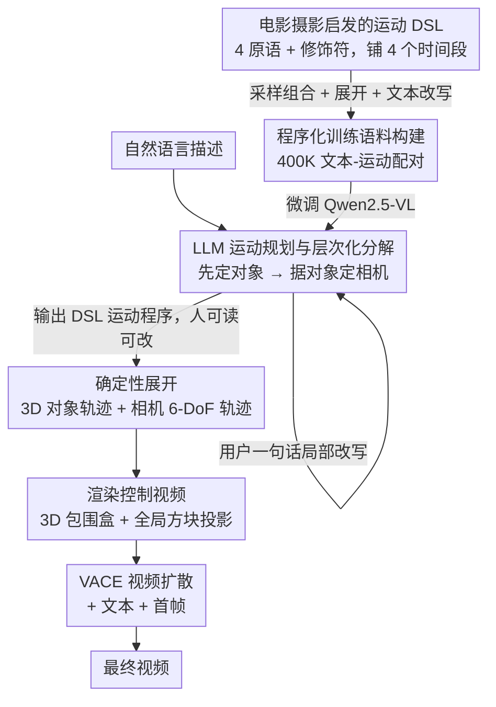

# LAMP: Language-Assisted Motion Planning for Controllable Video Generation

**会议**: CVPR 2026  
**arXiv**: [2512.03619](https://arxiv.org/abs/2512.03619)  
**代码**: [项目主页](https://cyberiada.github.io/LAMP/)  
**领域**: 视频生成  
**关键词**: 视频生成, 运动控制, LLM规划, 领域特定语言, 电影摄影

## 一句话总结

提出LAMP框架，将运动控制建模为语言到程序合成问题：设计电影摄影启发的运动DSL，训练LLM将自然语言描述转化为结构化运动程序，再确定性映射为3D对象和相机轨迹来条件化视频生成，首次实现从自然语言同时生成对象和相机运动。

## 研究背景与动机

视频生成已取得显著进展，但运动控制——指定对象动态和相机轨迹——仍受限于有限的用户交互方式。现有方法大多依赖文本、从视频提取的标注、或简单的2D绘制界面，难以表达复杂的电影化运动。

核心痛点：对象运动和相机轨迹本质上是耦合的（相机通常相对运动对象定义），同时指定两者需要高级空间规划和心理想象能力。例如，编排追逐场景需要同时协调跑者路径和追踪相机。

现有方法的局限：
- 直接从文本回归3D坐标困难：语言到运动的映射是多模态的、结构受限的
- 先前方法仅关注布局生成或相机轨迹合成，不统一对象和相机运动
- 缺乏可迭代编辑的界面

LAMP的核心idea：利用LLM的程序合成能力，将运动控制转化为**语言条件化的程序合成**问题——LLM生成符号化运动程序而非连续坐标，然后确定性地映射为3D轨迹。

## 方法详解

### 整体框架

LAMP 想解决的是：用户用一句自然语言（"一个人在街上奔跑，相机从侧面追踪"）就能同时指定对象怎么动、相机怎么拍，而不必手画 2D 轨迹或在 3D 里逐帧摆位。它的关键转念是不让模型从文本直接回归连续 3D 坐标——那是个多模态、约束极强的难映射——而是先让 LLM 写出一段**符号化的运动程序**，再用确定性规则把程序翻译成真实轨迹。

整条流水线是：自然语言进来后，微调过的 LLM 运动规划器先输出一段 DSL 运动程序；这段程序被确定性地展开成 3D 的对象轨迹和相机轨迹；轨迹再渲染成"控制视频"（把 3D 包围盒和全局方块投影到画面上）；最后这段控制视频连同文本和首帧一起喂给预训练的视频扩散模型（VACE），生成最终成片。中间的 DSL 程序是人能读懂、能改的，所以用户可以在烧钱合成视频之前先把运动调满意。

### 关键设计

**1. 电影摄影启发的运动 DSL：把连续轨迹换成可组合的符号原语**

直接从文本回归坐标之所以难，是因为同一句描述对应无数条具体轨迹，监督信号既稀疏又不稳。LAMP 的做法是先把"运动"这件事离散成一套受电影运镜启发的词汇：基于 CameraBench 分类体系定义四种基础原语——free-form（无约束 6-DoF 运动）、orbit track（绕目标环绕）、tail track（跟随目标运动）、rotation track（原地旋转跟踪）。每种原语再用一组修饰符细化，分别管平移（`lat`/`vert`/`depth`）、旋转（`yaw`/`pitch`/`roll`）和时间风格（`speed_fast`/`ease_in`/`jitter_low`），全部写成 key-value 对。一个完整的运动序列最多由 4 个运动标签组成、铺在 4 个时间段上，于是"先平推再绕到正面"这类复杂运镜就从几个简单原语的拼接里涌现出来。符号化带来的好处是直接的：表示可解释、可组合，且因为词汇有限、监督明确，学起来比连续回归省数据得多。

**2. 程序化训练语料构建：靠确定性映射自动造 400K 文本-运动配对**

要让 LLM 学会写这套 DSL，得有大量"自然语言 ↔ 运动程序"的配对，但人工标注 3D 运动昂贵且不可控。LAMP 反过来利用 DSL→3D 是确定性的这一点，把数据生成自动化：先采样并组合运动原语得到 DSL 程序，确定性展开成 3D 轨迹，套模板生成文本描述，再让一个 LLM 把模板文本改写得更口语、更多样。最终得到 400K 样本（100K 自由运动 + 100K 物体相对运动，各自配原始模板文本与 LLM 改写文本），覆盖 27 个粗类（3 种运动类型 × 3 个方向）和 343 个细类，旋转角度在 $[-180°, 180°]$ 上密集采样。因为分布由采样过程控制，常见电影运镜可以给高频、复杂组合运镜给低频，既避免了人工标注，又让数据分布贴近真实使用。

**3. LLM 运动规划与层次化分解：先定对象、再据对象定相机**

对象运动和相机轨迹本质是耦合的——相机往往是相对对象来定义的（追逐戏里相机是跟着跑者走的），硬让模型一次性吐出两者会互相纠缠。LAMP 把联合分布按电影制作的层次顺序拆开：

$$p(s_{cam}, s_{obj} \mid t) = p(s_{obj} \mid t_{obj}) \cdot p(s_{cam} \mid s_{obj}, t_{cam})$$

也就是先根据对象相关的文本生成对象运动 $s_{obj}$，再以对象运动为条件生成相机运动 $s_{cam}$。规划器本身是在 400K 语料上微调的 Qwen2.5-VL，学习输出 DSL 程序。这种分解既符合"对象定义场景动态、相机据此调整构图"的拍摄直觉，又天然支持迭代精修——程序是符号化的，用户一句"把相机放低一点"就能让 LLM 局部改写程序，无需重跑昂贵的视频合成。

### 一个完整示例

以"一个人在街上奔跑，相机从侧面追踪并逐渐拉近"为输入：规划器先按 $t_{obj}$ 生成对象程序（一个沿街道向前的 run 轨迹），再以该对象运动为条件生成相机程序——选 `tail track` 原语跟随跑者，配上 `speed_fast` 表现追逐感、`depth` 修饰符在后两个时间段逐步缩短距离实现拉近。这段 DSL 被确定性展开成跑者的 3D 包围盒序列和相机的 6-DoF 轨迹，投影成控制视频后，连同原文本和首帧送入 VACE，得到一段相机贴着跑者侧面、由远及近的成片。若用户觉得追得太紧，只需补一句"相机离远一点"，LLM 把 `depth` 改小即可，前面的轨迹展开和渲染全部复用。

### 损失函数 / 训练策略

LLM 规划器用标准自回归目标训练，无额外结构损失。推理时 DSL 程序确定性映射为 3D 轨迹，渲染成控制视频（2D 包围盒投影 + 全局方块投影），与文本、首帧一起输入 VACE 视频生成器生成最终视频。

## 实验关键数据

### 主实验 — DataDoP相机轨迹评估

| 模型 | 修正F1 | CLaTr Score | CLaTr FID |
|------|--------|-------------|-----------|
| CCD (预训练) | — | 5.29 | 357.8 |
| ET (预训练) | — | 2.46 | 609.9 |
| GenDoP (DataDoP训练) | 0.400 | 36.18 | 22.7 |
| **LAMP (预训练)** | **0.763** | **36.29** | 66.9 |
| **LAMP (ft DataDoP)** | **0.776** | **36.52** | 67.2 |

### ET数据集评估

LAMP在简单(pure)和复杂(mixed)分割上一致超越所有基线的F1分数

### 消融实验

| 配置 | 说明 |
|------|------|
| 无DSL (直接回归) | 性能显著下降 |
| 无微调 (零样本) | 基础能力可用但精度低 |
| 完整LAMP | 最优性能 |

### 关键发现

- LAMP在未经DataDoP训练的情况下，修正F1就超过了在该数据集上训练的GenDoP（0.763 vs 0.400），证明DSL表示的强泛化性
- 符号化程序比直接坐标回归更高效，需要的数据更少
- 迭代精修能力（如"稍微缩小""相机再低一点"）是独特优势——用户无需昂贵的视频合成即可调整运动

## 亮点与洞察

- 将运动生成重新定义为程序合成而非坐标回归，是架构层面的思路转变
- DSL设计与电影摄影惯例对齐，使生成的运动具有专业电影感
- 解耦设计允许在视频合成前迭代修改运动，大幅降低创作成本
- 首次统一了对象和相机运动的自然语言控制

## 局限与展望

- 目前仅支持单对象场景（3D bounding box），多对象交互场景未处理
- 运动序列限制为4个时间段，更长的复杂运动需要扩展
- 最终视频质量仍受限于底层视频生成模型（VACE）
- CLaTr FID相对GenDoP较高（66.9 vs 22.7），说明轨迹的真实感仍有提升空间

## 相关工作与启发

- **vs GenDoP**: GenDoP用GPT生成详细导演描述来指导自回归相机路径生成，但LLM角色仅限于辅助描述；LAMP让LLM直接输出可执行的运动程序
- **vs ET**: ET使用LLM生成的电影描述来指导扩散模型预测轨迹；LAMP跳过扩散直接用DSL确定性映射
- **vs CameraCtrl/EPiC**: 这些方法仅控制相机，假设对象静态；LAMP统一控制两者

## 评分

- 新颖性: ⭐⭐⭐⭐⭐ 将运动控制重新定义为程序合成，DSL设计与电影学结合的创新性强
- 实验充分度: ⭐⭐⭐⭐ 在多个基准上定量对比，包含消融和用户研究
- 写作质量: ⭐⭐⭐⭐ 动机清晰，方法层次分明，图示直观
- 价值: ⭐⭐⭐⭐⭐ 对视频生成的可控性研究有重大推动，框架设计优雅且可扩展

<!-- RELATED:START -->

## 相关论文

- [\[CVPR 2026\] MotionEnhancer: Leveraging Video Diffusion for Motion-Enhanced Vision-Language Models](motionenhancer_leveraging_video_diffusion_for_motion-enhanced_vision-language_mo.md)
- [\[CVPR 2026\] DriveLaW: Unifying Planning and Video Generation in a Latent Driving World](drivelaw_unifying_planning_and_video_generation_in_a_latent_driving_world.md)
- [\[CVPR 2026\] TV2TV: A Unified Framework for Interleaved Language and Video Generation](tv2tv_a_unified_framework_for_interleaved_language_and_video_generation.md)
- [\[AAAI 2026\] MotionCharacter: Fine-Grained Motion Controllable Human Video Generation](../../AAAI2026/video_generation/motioncharacter_fine-grained_motion_controllable_human_video_generation.md)
- [\[CVPR 2026\] MultiShotMaster: A Controllable Multi-Shot Video Generation Framework](multishotmaster_a_controllable_multi-shot_video_generation_framework.md)

<!-- RELATED:END -->
