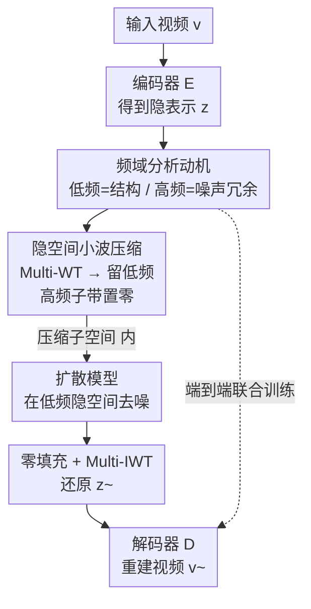

# Latent-Compressed Variational Autoencoder for Video Diffusion Models

**会议**: CVPR 2026  
**arXiv**: [2604.16479](https://arxiv.org/abs/2604.16479)  
**代码**: https://1mather.github.io/LC-VAE/ (项目主页)  
**领域**: 视频生成 / 扩散模型 / VAE  
**关键词**: 视频VAE, 隐空间压缩, 3D小波变换, 频域分析, 隐扩散模型

## 一句话总结
针对视频 VAE「隐空间通道一多就拖慢扩散收敛、又不能直接砍通道（会掉重建质量）」的两难，LC-VAE 在隐空间做多级 3D 小波变换、只保留低频子带、把高频子带直接置零，在同等压缩比下重建质量超过强基线 WF-VAE（WebVid-10M 上 PSNR 提升 0.81~1.82 dB），且让下游扩散模型生成更好。

## 研究背景与动机
**领域现状**：隐扩散模型（LDM）的成功范式是先用一个自编码器（VAE）把图像/视频压进紧凑的隐空间，扩散过程在隐空间里跑以降低计算量。视频生成（Sora、CogVideoX、Open-Sora、MovieGen 等）沿用这一范式，隐空间的设计因此成了核心研究点。

**现有痛点**：视频 VAE 通常需要「足够多」的隐通道才能保证高质量重建。但近期研究发现，隐通道一多会带来两个坏处——一是扩散模型的隐搜索空间变大、训练更难收敛、生成质量反而下降（即便重建质量还很高）；二是高通道的隐表示里塞了大量**杂乱无章的高频成分**，这与扩散「由粗到细」的合成本性相冲突。作者还观察到（Fig. 2）：把 WF-VAE 的通道数从 4 加到 32，重建 PSNR 的增益越来越小，说明隐表示里有大量冗余可以再压。

**核心矛盾**：「想压缩隐空间降低扩散难度」与「直接砍隐通道会显著掉重建保真度」之间存在 trade-off。直接减通道是最朴素的压缩手段，但它一刀切地损失信息。

**本文目标**：在**不减少隐通道数**的前提下进一步压缩视频隐表示，既降维去冗余、又不牺牲重建质量，还能让下游扩散训练更稳。

**切入角度**：作者不去改 VAE 架构或拆 content/motion，而是**直接分析 VAE 自己学出来的隐表示的频率结构**。对 WF-VAE 隐表示做 3D Haar 小波分解后（Fig. 3）发现：低频子带能量高、帧间时序自相关强（承载视频的结构信息），高频子带则能量低、杂乱无序（主要是纹理/噪声）。更关键的是，从隐空间里去掉高频会让重建严重恶化（Fig. 8），说明基线隐表示对高频「过度敏感」、不够鲁棒——这本身就是隐表示没学好的信号。

**核心 idea**：用「在隐空间里做小波分解、只留低频子带、把高频子带置零」来代替「直接砍通道」实现隐压缩，强迫编码器只专注于扩散友好、压缩高效的低频结构信息，把高频细节的恢复甩给解码器。

## 方法详解

### 整体框架
LC-VAE（Latent-Compressed VAE）的骨架完全沿用主基线 WF-VAE（同样的 3D 因果卷积编解码器），只在隐空间里插入一对「压缩—重建」算子。输入视频 $v \in \mathbb{R}^{C\times T\times H\times W}$ 先经编码器得到隐表示 $z=E(v)$；接着对 $z$ 做**多级 3D Haar 小波变换（Multi-WT）**，把隐表示分解成不同频率的子带；只保留低频子带 $\{LLL, LLH, LHL, HLL\}$、把其余高频子带**直接置零**——这样只需存非零子带，得到约「原尺寸 50%、却保留约 85% 能量」的压缩隐表示，扩散过程就在这个压缩子空间里跑。生成（或重建）时，把采样到的低频隐表示用零填充补齐高频位置，经**多级逆小波变换（Multi-IWT）**还原回 $\tilde z$，再送进解码器 $\tilde v=D(\tilde z)$ 重建视频。整个压缩—重建是**和 VAE 一起端到端训练**的，这点是它区别于「事后压缩」的关键。

### 关键设计

**1. 频域分析：先证明「低频承载结构、高频是冗余噪声」**

这是全文的立论根基，回答「凭什么能扔掉高频」。作者对 WF-VAE 编码出的视频隐表示 $z=E_\theta(v)$ 做一级 3D Haar 小波变换，得到 8 个频率子带，再用两把尺子量它们：能量分布、以及帧间 lag-1 时序自相关（衡量相邻帧间信号的线性依赖、即时序连续程度）。结果（Fig. 3）很干脆——低频子带（$B_{LLL}, B_{LLH}, B_{LHL}$）能量显著更高、时序自相关也明显更强，说明它们装的是随时间平滑演化的视频**结构信息**；高频子带则能量低、跨通道分布杂乱无序，装的是纹理和噪声这类细节。由此作者提出假设：结构信息可以高效压进隐表示，而细节纹理的恢复可以「外包」给解码器（以低频内容为条件去补）。这一假设直接决定了后面「只留低频」的合法性。

**2. 隐空间小波压缩：在 latent 上做小波、置零高频，而不是砍通道**

针对「直接减通道会掉保真度」的痛点，LC-VAE 改为对隐表示 $z$ 施加多级 3D Haar 小波变换 $B^{(\ell)}_{abc}=B^{(\ell-1)}\circledast(\xi_a\otimes\xi_b\otimes\xi_c)$（$\xi\in\{\phi,\psi\}$ 为低/高通滤波器，$B^{(0)}=z$），然后做一个固定的硬置零：

$$\tilde B^{(\ell)}_{abc}=\begin{cases}B^{(\ell)}_{abc}, & abc\in\{LLL,LLH,LHL,HLL\}\\ 0, & \text{其余（高频）}\end{cases}$$

只留 4 个低频子带、其余高频全置零。解码前再零填充高频位置、逆变换回 $\tilde z=W^{-1}(\{\tilde B^{(\ell)}_{abc}\})$ 给解码器。这个「固定置零」是经典压缩思想（类似 JPEG 丢高频系数）的直接搬用，作者在附录里验证它已逼近数据驱动的自适应选择策略，所以不需要额外可学习参数或超参。它和「砍通道」的本质区别在于：砍通道是在所有频率上一刀切地损失信息，而这里是**有选择地只丢掉「能量低、对重建贡献小、且对扩散有害」的高频**，从而在同等压缩比下保住重建质量、同时给扩散一个更干净的低频隐空间——因为扩散本性偏好低频数据。

**3. 联合训练：让压缩在训练时就发生，逼编码器学鲁棒低频表示**

光有压缩算子还不够——如果把压缩硬套到一个**已训练好**的 VAE 上，效果会很差。作者用 PTLC（post-training latent compression）做对照实验证实了这一点：对预训练 WF-VAE 的隐表示同样做三级小波、置零高频，重建质量大幅崩坏（Fig. 8 出现明显伪影）。原因是预训练隐表示里高频是杂乱非结构化的、解码器也从没被训练去补这些细节。LC-VAE 因此把小波压缩—重建**嵌进 VAE 的训练全程**：编码器在训练时就被强迫「只能把信息塞进低频子带」，解码器则学会以低频为条件去恢复高频纹理。这样编码器学到的低频表示更鲁棒、泛化更好（论文观察到 zero-shot 跨数据集 PSNR 掉得更少）。损失函数完全沿用 WF-VAE，无需为此新增项。

### 损失函数 / 训练策略
损失沿用现有工作与 WF-VAE 的设置：$L=L_{recon}+\lambda_{adv}L_{adv}+\lambda_{KL}L_{KL}$，分别为 L1 重建损失、对抗损失、KL 正则。训练上比 WF-VAE 更简单：WF-VAE 用三阶段训练，LC-VAE 只用**单阶段**、固定损失与超参；AdamW（$\beta_1=0.9,\beta_2=0.999$）、固定学习率 $1\times10^{-5}$，在 Kinetics-400 上训 200,000 步，8 张 H200 约 5 天。去噪模型用 Latte-L 训 100,000 步。

## 实验关键数据

### 主实验：重建质量（Table 1，节选 WebVid-10M / Panda-70M）
所有方法 token 压缩率（TCPR）同为 256（4×8×8），对比同通道数下 LC-VAE 与 WF-VAE。

| 数据集 | 通道 | 方法 | PSNR↑ | SSIM↑ | LPIPS↓ | rFVD↓ |
|--------|------|------|-------|-------|--------|-------|
| WebVid-10M | 4 | WF-VAE | 30.68 | 0.9071 | 0.0344 | 179.13 |
| WebVid-10M | 4 | **LC-VAE** | **31.49** | **0.9207** | **0.0249** | **165.88** |
| WebVid-10M | 8 | WF-VAE | 31.96 | 0.9281 | 0.0242 | 101.06 |
| WebVid-10M | 8 | **LC-VAE** | **33.78** | 0.9208 | **0.0211** | 135.99 |
| WebVid-10M | 16 | WF-VAE | 34.62 | 0.9301 | 0.0193 | **68.72** |
| WebVid-10M | 16 | **LC-VAE** | **35.59** | **0.9439** | **0.0152** | 73.66 |
| Panda-70M | 8 | WF-VAE | 32.41 | 0.8982 | 0.0348 | 156.95 |
| Panda-70M | 8 | **LC-VAE** | **33.64** | **0.9447** | **0.0165** | **93.89** |

LC-VAE 在 PSNR 上一致领先：WebVid-10M 上对 4/8/16 通道分别高出 **0.81 / 1.82 / 0.97 dB**。少数指标（如 16 通道的 rFVD）略逊，但主线 PSNR/LPIPS 普遍更优。

### 零样本泛化（Table 2，节选 OpenVid-1M）
在训练时没见过的数据集上做 zero-shot 重建，验证「低频表示更鲁棒」的假设。

| 数据集 | 通道 | 方法 | PSNR↑ | SSIM↑ | LPIPS↓ |
|--------|------|------|-------|-------|--------|
| OpenVid-1M | 8 | WF-VAE | 34.20 | 0.9066 | 0.0311 |
| OpenVid-1M | 8 | **LC-VAE** | **35.27** | **0.9253** | **0.0172** |
| OpenVid-1M | 16 | WF-VAE | 36.28 | 0.9332 | 0.0167 |
| OpenVid-1M | 16 | **LC-VAE** | **37.06** | **0.9463** | **0.0123** |

论文指出 WF-VAE 在未见数据集上 PSNR 会掉 0.5–1.5 dB，而 LC-VAE 掉得更少、跨数据集更稳。

### 消融：联合训练 vs 事后压缩（Table 4，WebVid-10M）
PTLC = 对预训练 WF-VAE 做事后小波压缩（16/8 通道压成等效 8/4 通道）。

| 方法 | 通道 | PSNR↑ | SSIM↑ | LPIPS↓ |
|------|------|-------|-------|--------|
| WF-VAE (PTLC) | 8 | 29.24 | 0.8393 | 0.0675 |
| **LC-VAE** | 8 | **31.49** | **0.9207** | **0.0249** |
| WF-VAE (PTLC) | 16 | 30.49 | 0.8725 | 0.0545 |
| **LC-VAE** | 16 | **33.78** | **0.9208** | **0.0211** |

事后压缩 PSNR 比联合训练低 2~3 dB 以上，证明「压缩必须在训练时就纳入」是质量关键。

### 视频生成（Table 3，Latte 去噪，FVD16↓ / IS↑）
| 方法 | 通道 | SkyTimelapse FVD16↓ | UCF-101 FVD16↓ | UCF-101 IS↑ |
|------|------|----------------------|-----------------|-------------|
| WF-VAE | 4 | **198.87** | 565.80 | 61.19 |
| **LC-VAE** | 4 | 240.56 | **509.76** | **70.71** |
| WF-VAE | 8 | 213.23 | 687.60 | 60.57 |
| **LC-VAE** | 8 | **201.24** | **654.96** | **66.72** |
| WF-VAE | 16 | 195.94 | 721.43 | 52.66 |
| **LC-VAE** | 16 | **187.68** | 735.04 | **54.89** |

### 关键发现
- **8 通道是甜点**：WebVid-10M 上 8 通道 PSNR 提升最大（+1.82 dB），说明 LC-VAE 在中等通道数下「去高频冗余」的收益最显著。
- **联合训练不可省**：PTLC 消融显示，同样的小波置零操作，事后套到预训练模型上会掉 2~3 dB，必须端到端一起训。
- **SkyTimelapse 4 通道反例**：该数据集多为静态视频、本身高频就少，基线用更紧凑隐空间已够用，LC-VAE 在此场景无优势（FVD 反而更高）——一个诚实的失败案例。

## 亮点与洞察
- **「压缩不等于砍通道」这一视角很巧**：把隐压缩从「减维度」重新表述成「减频率」，绕开了砍通道掉保真度的死结，是可复用的思路——任何「通道冗余」问题都可考虑先做频域分解再选择性丢弃。
- **频域分析做立论非常扎实**：用能量 + 时序自相关两把尺子证明「低频=结构、高频=噪声」，再用「从隐空间去高频会崩、从像素去高频不崩」的对照实验反证「基线隐表示对高频过度敏感」，论证链条干净。
- **方法极简、无新增超参**：固定置零 + 沿用 WF-VAE 损失，单阶段训练就超过三阶段训练的基线，工程上极易复现和迁移（论文还验证可套到 WanVAE-2.1 + 2.1B 扩散模型）。
- **诚实标注反例**：主动指出 SkyTimelapse 4 通道上输给基线并给出解释（静态视频高频少），比一味报喜更可信。

## 局限与展望
- **固定置零、不调压缩比**（作者承认）：作为首个压视频隐空间的尝试，只是一刀切地把高频子带置零，没有针对不同视频内容/数据集自适应调整保留哪些频率、保留多少；静态视频上的反例正暴露了这点。
- **不追生成 SOTA**：刻意不优化下游扩散架构，FVD 提升幅度有限、个别设置还略逊，无法直接说明对大规模文生视频的增益。
- **小波是固定 Haar 基**：用的是最简单的 Haar 小波，是否换更高阶小波或可学习滤波器能进一步提升，未探索。
- **改进方向**：把「保留哪些子带 / 保留比例」做成数据驱动可学习的自适应选择（附录已验证固定置零逼近自适应，但可更进一步）；在大模型大数据上验证对生成质量的端到端收益。

## 相关工作与启发
- **vs WF-VAE**：WF-VAE 把小波能量流融进 VAE 深层、在**像素/原始视频域**做小波以降空间时序分辨率；LC-VAE 则把小波搬到**隐空间**、并主动**置零高频子带**做压缩。两者架构同源，但 LC-VAE 多了「隐域选频压缩 + 联合训练」，在同等压缩比下重建更优。
- **vs 直接砍隐通道**：砍通道在所有频率上一刀切损失信息、掉保真度严重；LC-VAE 只丢低能量高频，保住结构信息。
- **vs content/motion 分解类方法**：那类工作（如把隐空间拆成内容/运动分量、或用专门因果卷积）从「时序冗余」角度入手；LC-VAE 取正交视角，直接分析并整形 VAE 学到的频率分布，与具体扩散架构和训练目标无关，可叠加。
- **vs 事后压缩（PTLC）**：揭示一个一般性教训——表示层面的压缩往往需要在训练时纳入，事后硬套会因编码器/解码器没为之训练而崩。

## 评分
- 新颖性: ⭐⭐⭐⭐ 「在隐空间选频压缩代替砍通道」视角新颖，但小波 + 置零的技术组件本身较经典
- 实验充分度: ⭐⭐⭐⭐ 多数据集、多通道、重建/泛化/生成/消融齐全，且诚实报告反例；但生成实验规模偏小
- 写作质量: ⭐⭐⭐⭐⭐ 频域分析立论扎实、动机到方法链条清晰、figure 解释到位
- 价值: ⭐⭐⭐⭐ 简单即插即用、可迁移到其他视频 VAE，对「隐空间该如何为扩散设计」有启发

<!-- RELATED:START -->

## 相关论文

- [\[CVPR 2026\] Inference-time Physics Alignment of Video Generative Models with Latent World Models](inference-time_physics_alignment_of_video_generative_models_with_latent_world_mo.md)
- [\[CVPR 2026\] Compressed-Domain-Aware Online Video Super-Resolution](compressed-domain-aware_online_video_super-resolution.md)
- [\[CVPR 2026\] FlashLips: 100-FPS Mask-Free Latent Lip-Sync using Reconstruction Instead of Diffusion or GANs](flashlips_100-fps_mask-free_latent_lip-sync_using_reconstruction_instead_of_diff.md)
- [\[CVPR 2026\] RFDM: Residual Flow Diffusion Models for Video Editing](rfdm_residual_flow_diffusion_models_for_video_editing.md)
- [\[CVPR 2026\] DriveLaW: Unifying Planning and Video Generation in a Latent Driving World](drivelaw_unifying_planning_and_video_generation_in_a_latent_driving_world.md)

<!-- RELATED:END -->
