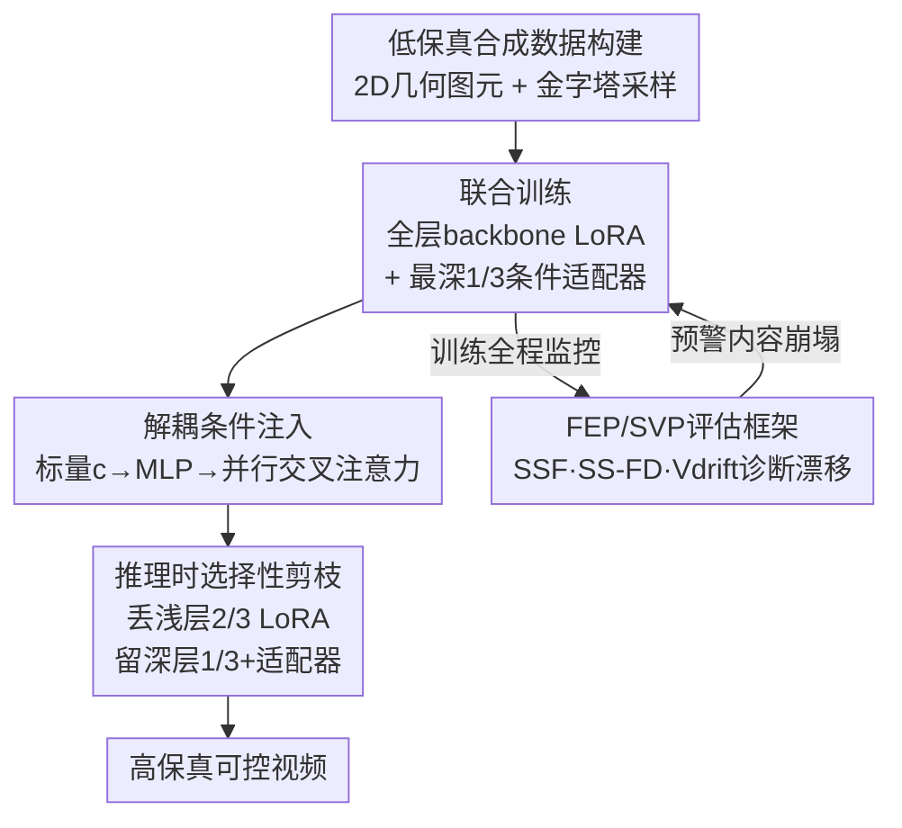

# Less is More: Data-Efficient Adaptation for Controllable Text-to-Video Generation

**会议**: CVPR 2026  
**论文**: [CVF Open Access](https://openaccess.thecvf.com/content/CVPR2026/html/Cheng_Less_is_More_Data-Efficient_Adaptation_for_Controllable_Text-to-Video_Generation_CVPR_2026_paper.html)  
**代码**: https://github.com/csh-apprentice/Less_Is_More  
**领域**: 视频生成 / 可控文生视频  
**关键词**: 文生视频, 可控生成, 数据高效微调, 灾难性遗忘, LoRA

## 一句话总结
给预训练文生视频模型（WAN 2.1）加上对快门速度、光圈、色温这类物理相机参数的连续控制时，本文发现用稀疏、低保真的合成数据微调，反而比用照片级真实数据效果更好——因为照片级数据会破坏 backbone 的预训练先验导致"内容崩塌"，而简单合成数据只让模型"挖出"已有先验，配合"解耦交叉注意力 + 联合 LoRA 训练 + 推理时剪枝"的设计实现高保真可控生成。

## 研究背景与动机

**领域现状**：文生视频（T2V）扩散大模型（如 Wan、Hunyuan Video、Sora）已经能生成高质量视频，但纯文本控制粒度太粗。为了加上图像、深度、相机轨迹等额外控制信号，主流做法是拿一个大 foundation model，再用一个精心制作的任务特定小数据集去微调，把模型"聚焦"到某种身份、风格或特效上。

**现有痛点**：要给模型加上对**低维物理/光学属性**（快门速度→运动模糊、光圈→景深虚化、色温→色调）的控制，需要海量、高保真、带精确物理参数标注的真实视频数据集——这种数据极难采集。而且本文是**第一个**尝试在预训练视频生成模型里加入相机效果（快门、焦距等）条件化控制的工作，没有现成数据可用。

**核心矛盾**：直觉上大家都认为"微调数据越接近真实输出域越好"，所以会去做照片级渲染。但本文发现一个反直觉现象：**照片级合成数据虽然看起来保真度高，却会污染 backbone 的预训练先验，引发"灾难性遗忘"和"内容崩塌"**——微调把模型推离了它原本擅长的分布。真实数据带来的语义复杂度本身就是毒药。

**本文目标**：(1) 用极少、极简单的合成数据，给 T2V 模型学到精确的连续物理控制；(2) 给出一套框架，定量解释"为什么简单数据反而更好"，并能在训练时诊断、预防 backbone 被腐蚀。

**切入角度**：作者的假设是——foundation model 的潜空间已经隐含了关于真实感的极强先验，微调的角色应该是"哄出（coax out）"这些已有属性，而不是去扩展、外推到新域。因此数据**不需要真实，只需要在控制轴上有干净、可观测的变化**即可。

**核心 idea**：与其追求"尽可能真实"的微调数据集，不如构造一个"尽可能解耦（disentangled）"的数据集，彻底放弃真实感——用 2D 几何图元的简单合成场景隔离物理效果，配合解耦的条件注入和可剪枝的 LoRA，达到数据高效的可控生成。

## 方法详解

### 整体框架

整个系统要解决的是：在冻结的 T2V backbone 上插入一个标量物理控制（如 $c \in [-1, 1]$ 表示从短快门到长快门），既要让控制生效，又不能毁掉 backbone 原有的生成能力。流程分四块串起来：**先**用程序化生成的简单合成数据（2D 几何图元 + 金字塔式标量采样）作为监督；**训练时**给 DiT 的每一层都注入 backbone LoRA 吸收"合成域偏移"，同时只在最深 1/3 的 transformer block 里插入一个**与文本交叉注意力并行**的条件交叉注意力适配器去学物理效果；**推理时**把浅层 2/3 block 的 LoRA 权重丢弃，只保留最深 1/3 的 LoRA 和条件适配器，从而恢复大部分网络的原始先验；**全程**用 FEP/SVP 两阶段评估框架监控 backbone 漂移、诊断是否发生灾难性遗忘。

### 关键设计

**1. 解耦条件注入模块：用一条并行交叉注意力把标量物理控制和文本语义分开**

痛点是：如果直接把物理控制信号和文本搅在一起（比如靠 prompt 写"extreme motion blur"），模型会发生**语义纠缠**——把快门速度误解成别的东西，甚至把"暖色温"理解成"加雪的天气"。本文的做法是把标量条件 $c \in [-1, 1]$ 先归一化，再过一个小 MLP 投影成高维嵌入 $e_{cond} = \text{MLP}_{cond}(c)$，然后**用一条与文本交叉注意力并行、独立的条件交叉注意力**注入。对视频潜变量的某个 query $q$，交叉注意力块的输出是文本条件 $y_{text}$ 和属性条件 $y_{cond}$ 的线性组合。关键是这个条件适配器只插入到原模型最深 1/3 的 transformer block——深层 block 编码的是更抽象、更高层的语义，在这里注入控制能影响全局效果而不破坏浅层的内容生成。这样物理控制和文本走两条独立通路，天然解耦，避免了 prompt 纠缠。

**2. 联合 LoRA 训练 + 推理时选择性剪枝：让 LoRA 背"合成域偏移"的锅，再在推理时甩掉它**

痛点是：用 out-of-domain 的简单合成数据微调，不可避免会引入"内容漂移"——模型生成的东西开始往合成图元那种简单画风靠。本文不去费力 curating 真实视频，而是采用一个"关注点分离（separation of concerns）"的联合训练策略：在**所有** DiT block 里都注入 backbone LoRA，和条件适配器一起优化。backbone LoRA 专门吸收合成数据带来的域偏移，让条件适配器可以**只专注于解耦物理控制信号**，不被内容漂移污染。最妙的是推理时的"反悔"操作：把那些**没有装条件适配器的 block（浅层 2/3）的 backbone LoRA 权重全部丢弃**，只保留最深 1/3 block 的 LoRA 和适配器。这相当于在大部分网络上恢复了原始预训练先验，同时保住了学到的控制机制。论文用 SVD 的"intruder dimension"分析证明：真实数据训练会在 $W_{lora} = W_{pre} + \Delta W_{lora}$ 里产生大量高排名的"入侵维度"（灾难性遗忘的数学 signature），而合成数据训练几乎不产生入侵维度。

**3. 低保真合成数据 + 金字塔式标量采样：用 2D 图元隔离物理效果、用分层采样保证连续响应**

这是"Less is More"的核心。痛点是：照片级数据语义复杂度太高，会带来"混淆性复杂度"腐蚀 backbone。本文反其道而行，设计一套**几何图元**的合成数据——每个训练场景由随机组合的运动形状程序化生成，既保证物理控制所需的条件可见（如不同轨迹产生运动模糊、重叠深度面产生景深），又**剔除一切不必要的语义细节**。在控制标量的采样上，不用固定离散值，而是用**多层分层采样的"金字塔"策略**：把归一化范围 $[-1, 1]$ 分成 $N$ 个等宽 bin，在每个 bin 内均匀采样，并在多个层级上叠加，让采样密度向控制空间中心聚集。这样稀疏数据集也能提供丰富、连续的控制信号，避免过拟合到特定离散值。论文进一步用"有效秩"分析证明：联合训练后条件信号 $y_{cond}$ 的奇异值谱呈现明显"肘部"曲线、**有效秩为 1**（学到了物理效果的本质表示）；而只训练适配器（无 backbone LoRA）时 $y_{cond}$ 是高秩的、慢衰减、镜像了内容信号 $y_{text}$——说明适配器**记住了训练数据内容而非隔离出效果**。作者把这种失败模式叫"Bulldozer Effect（推土机效应）"：孤立训练的适配器信号高秩、幅值更大、且正交于 backbone 内容空间，推理时直接"推平"并替换掉文本信号，让输出被训练场景特征主导。

**4. FEP/SVP 两阶段评估框架：把"数据复杂度"变成可监控的漂移速率指标**

痛点是：现有指标（FVD、CLIP Score、VBench）都无法**量化微调数据的内在复杂度以及它对 backbone 漂移的影响**——这是个方法论空白。本文提出两阶段框架。**第一阶段 FEP（Fast Evaluation Protocol，快速评估协议）**：用单步去噪从固定潜变量种子生成最小的 4 帧输出，在一大批语义多样的 prompt 上重复，在 CLIP 嵌入空间里算两个指标——SSF（Single-Step Fidelity，单步保真度）= 适配后模型与原 backbone 嵌入的平均逐 prompt 余弦相似度，接近 1.0 表示语义几乎没变；SS-FD（Single-Step Fréchet Distance）= 两者完整嵌入分布间的 Fréchet 距离，越高表示分布偏移越大。再定义**分布漂移速率** $V_{drift} = \delta(\text{SS-FD}) / \delta(\text{steps})$ 作为数据复杂度的量化代理：低复杂度数据（2D 图元）$V_{drift}$ 低，高复杂度数据（照片级）$V_{drift}$ 高。**第二阶段 SVP（Slow Validation Protocol，慢速验证协议）**：用完整多步去噪，算语义保真度（X-CLIP Score、VQA Score）和 VBench 的 6 个视频质量指标。两阶段互补——FEP 低成本高频地在训练时早期预警过拟合，SVP 评估最终质量。关键诊断逻辑是：**高漂移速率本身不一定坏，要交叉看最终分数**——如果 SVP 分数高就是成功适配（良性漂移），如果分数崩了就是灾难性遗忘（恶性漂移）。

### 损失函数 / 训练策略

实验全部以 WAN 2.1 作为 T2V backbone。Group 1（数据复杂度对比）用单场景 one-shot：每个相机参数训两个模型，一个用单个合成场景、一个用单个照片级场景，每个场景采 7 个标量条件构成训练数据，在 800-prompt 的 VBench 上用 FEP 评估。Group 2（推理策略对比）用完整金字塔合成数据集训的完整模型，在 96-prompt 高运动套件上做 50 步去噪生成 49 帧，用 SVP 评估。框架只依赖标准 LoRA 层和解耦交叉注意力路径，因此架构上兼容标准 DiT 视频扩散 backbone（在其他 backbone 上的验证留作未来工作）。

## 实验关键数据

### 主实验

**Group 1：合成数据 vs 真实数据（one-shot，越接近 Baseline 越好）**。Baseline 是原 backbone 的语义保真度参考。Real（照片级）数据的语义分数全面崩塌，尤其光圈的 VQA 几乎归零；Syn（简单合成）数据则稳稳贴近 baseline。

| 控制 | 指标 | Baseline | Syn（合成） | Real（照片级） |
|------|------|----------|-------------|----------------|
| 快门 | X-CLIP | 25.390 | 24.777 | 23.278 |
| 快门 | VQA | 0.522 | 0.352 | 0.096 |
| 光圈 | X-CLIP | 25.390 | 25.105 | 19.824 |
| 光圈 | VQA | 0.522 | 0.343 | **0.021**（崩塌） |
| 色温 | X-CLIP | 25.390 | 25.015 | 24.456 |
| 色温 | VQA | 0.522 | 0.431 | 0.281 |

**Group 2：解耦推理 vs Full-LoRA 推理（SVP，越接近 Baseline 越好）**。解耦推理（剪掉浅层 LoRA）几乎不动 backbone，语义保真度和视频质量都更贴近原始模型。

| 指标 | Baseline | 快门-Full | 快门-Dec | 光圈-Full | 光圈-Dec | 色温-Full | 色温-Dec |
|------|----------|-----------|----------|-----------|----------|-----------|----------|
| X-CLIP | 25.390 | 25.295 | 25.587 | 25.181 | 25.595 | 25.487 | 25.595 |
| VQA | 0.522 | 0.453 | 0.521 | 0.427 | 0.513 | 0.550 | 0.532 |
| 主体一致性 | 0.951 | 0.939 | 0.946 | 0.968 | 0.951 | 0.960 | 0.950 |
| 运动平滑度 | 0.988 | 0.983 | 0.987 | 0.994 | 0.987 | 0.990 | 0.989 |
| 动态程度 | 0.427 | 0.688 | 0.469 | 0.219 | 0.438 | 0.406 | 0.417 |
| 成像质量 | 0.618 | 0.531 | 0.596 | 0.596 | 0.633 | 0.664 | 0.623 |

### 消融实验

| 配置 | 关键现象 | 说明 |
|------|---------|------|
| 合成数据训练 | $V_{drift}$ 低、SSF≈baseline、入侵维度极少 | 不破坏 backbone，良性适配 |
| 照片级数据训练 | $V_{drift}$ 高、X-CLIP/VQA 崩塌、入侵维度激增 | 灾难性遗忘 / 内容崩塌 |
| 联合训练（LoRA+适配器） | $y_{cond}$ 有效秩 = 1，奇异值谱"肘部" | 适配器学到效果本质 |
| 仅适配器训练（无 backbone LoRA） | $y_{cond}$ 高秩、镜像 $y_{text}$ | Bulldozer 效应，记住内容而非效果 |
| 解耦推理 | SVP 分数变化 <2% | 几乎不腐蚀 backbone |
| Full-LoRA 推理 | 分数略降但可接受 | 训练鲁棒，不会灾难性退化 |

### 关键发现
- **数据复杂度比真实感更关键**：照片级数据的"恶性漂移"让光圈 VQA 从 0.522 跌到 0.021，而合成数据始终贴近 baseline——证明微调数据应该追求"解耦"而非"真实"。
- **backbone LoRA 是适配器能解耦的前提**：去掉 backbone LoRA 后适配器从"有效秩 1"退化成"高秩记内容"，触发 Bulldozer 效应——说明"关注点分离"不是锦上添花，而是成功的必要条件。
- **解耦推理近乎免费午餐**：推理时丢弃浅层 LoRA，X-CLIP/VQA 普遍比 Full-LoRA 更接近 baseline，且 VBench 视频质量几乎不变，说明剪枝恢复先验没有牺牲控制能力。
- **数据高效到极致**：Group 1 的对比是单场景、每场景仅 7 个标量条件的 one-shot，依然能学出连续可控的物理效果，且质量可比肩 Bokeh Diffusion、Generative Photography 这类数据密集型专用方法。

## 亮点与洞察
- **"Less is More"反直觉但有理有据**：作者没有停在"简单数据也能用"，而是给出了 intruder dimension（SVD 入侵维度）和有效秩两套**数据无关**的几何分析，从权重和功能输出两个角度证明了为什么照片级数据有害——这种把经验现象上升为可诊断指标的做法很扎实。
- **"Bulldozer Effect"是个漂亮的失败诊断**：把"仅训适配器会失败"解释成"高秩 + 大幅值 + 正交于内容空间 → 推理时推平文本信号"，既形象又给出了机制级解释，比单纯说"效果不好"信息量大得多。
- **FEP 单步去噪做训练监控**：用一次单步去噪 + CLIP 嵌入就当作 backbone 漂移的早期预警，成本极低却能预测下游 SVP 退化，这个"轻量代理指标"的思路可迁移到任何微调场景做 overfitting 监控。
- **推理时剪枝的"反悔"机制**：训练时让 LoRA 充分吸收域偏移、推理时再选择性丢弃，这种"先污染后净化"的设计巧妙绕开了"微调必然损伤 backbone"的两难，可迁移到其他需要 adapter 但怕遗忘的任务。

## 局限与展望
- **只验证了三种标量控制**：快门、光圈、色温都是低维标量，对更高维或空间结构化的控制（如逐像素深度、姿态）是否仍然"Less is More"未知，作者也把这列为未来工作。
- **单一 backbone**：所有实验都在 WAN 2.1 上做，虽然声称架构兼容标准 DiT，但跨 backbone 的实证验证缺失。
- **每控制轴独立训练**：目前一个模型只控一个参数，作者展望了从单个联合控制向量里解耦多参数（如光圈+色温同时控）的统一模型，但尚未实现。
- **核心指标的精确公式部分依赖补充材料**：金字塔采样的层级细节、SS-FD 的具体计算、intruder dimension 的阈值 $\epsilon$ 都放在 supplementary，正文只给了直觉（⚠️ 细节以原文补充材料为准）。
- **one-shot 对比的统计稳健性**：Group 1 用单场景对比，虽然隔离了变量，但样本极少，结论的方差未充分讨论。

## 相关工作与启发
- **vs ControlNet / T2I-Adapter**: 它们通过深度、mask、sketch 等空间条件做控制，本文针对的是**低维标量物理参数**（相机内参），且专门处理视频的时序一致性，注入方式是解耦交叉注意力而非额外编码分支。
- **vs Bokeh Diffusion / Generative Photography**: 这两个是图像域的相机感知合成，数据密集（Generative Photography 用到 12k/2k 量级），本文用 one-shot 合成数据在视频域达到可比的景深质量。
- **vs CSaT（token-based conditioning）**: 提供隐式控制但 data-heavy；本文用解耦适配器 + 稀疏合成数据，数据高效得多。
- **vs Shuttleworth et al. 的 LoRA 谱分析**: 本文借用其"intruder dimension"工具来诊断灾难性遗忘，但把它从"分析现象"推进到"指导数据策略选择"，并补上了一个量化数据复杂度的 $V_{drift}$ 指标，填补了"没有指标衡量微调数据复杂度"的方法论空白。
- **启发**：foundation model 微调的本质可能是"哄出已有先验"而非"扩展新域"——这个观点若成立，意味着很多任务的微调数据集应该追求"解耦/简单"而非"真实/丰富"，对低成本定制化生成模型有普遍指导意义。

## 评分
- 新颖性: ⭐⭐⭐⭐⭐ 首个在 T2V 上做相机物理参数条件化，且"简单数据优于真实数据"的反直觉结论配合两套几何分析，很有原创性
- 实验充分度: ⭐⭐⭐⭐ 三种控制 × 数据/推理两组消融 + 谱分析很完整，但单 backbone、one-shot 样本少、关键细节在补充材料
- 写作质量: ⭐⭐⭐⭐⭐ 从现象到诊断指标再到机制解释层层递进，"Bulldozer Effect"等概念表达清晰
- 价值: ⭐⭐⭐⭐ 数据高效的可控生成范式 + 可复用的 backbone 漂移诊断框架，对定制化生成模型实践价值高

<!-- RELATED:START -->

## 相关论文

- [\[CVPR 2026\] M4V: Multimodal Mamba for Efficient Text-to-Video Generation](m4v_multimodal_mamba_for_efficient_text-to-video_generation.md)
- [\[CVPR 2026\] RAPID: Reusing Attention Sparsity with Inter-step Adaptation for Efficient Video Diffusion](rapid_reusing_attention_sparsity_with_inter-step_adaptation_for_efficient_video_.md)
- [\[ICCV 2025\] EfficientMT: Efficient Temporal Adaptation for Motion Transfer in Text-to-Video Diffusion Models](../../ICCV2025/video_generation/efficientmt_efficient_temporal_adaptation_for_motion_transfer_in_text-to-video_d.md)
- [\[CVPR 2026\] SynMotion: Semantic-Visual Adaptation for Motion Customized Video Generation](synmotion_semantic-visual_adaptation_for_motion_customized_video_generation.md)
- [\[CVPR 2026\] Tea-Adapter: Teacher Adapter for Efficient Conditional Generation](tea-adapter_teacher_adapter_for_efficient_conditional_generation.md)

<!-- RELATED:END -->
