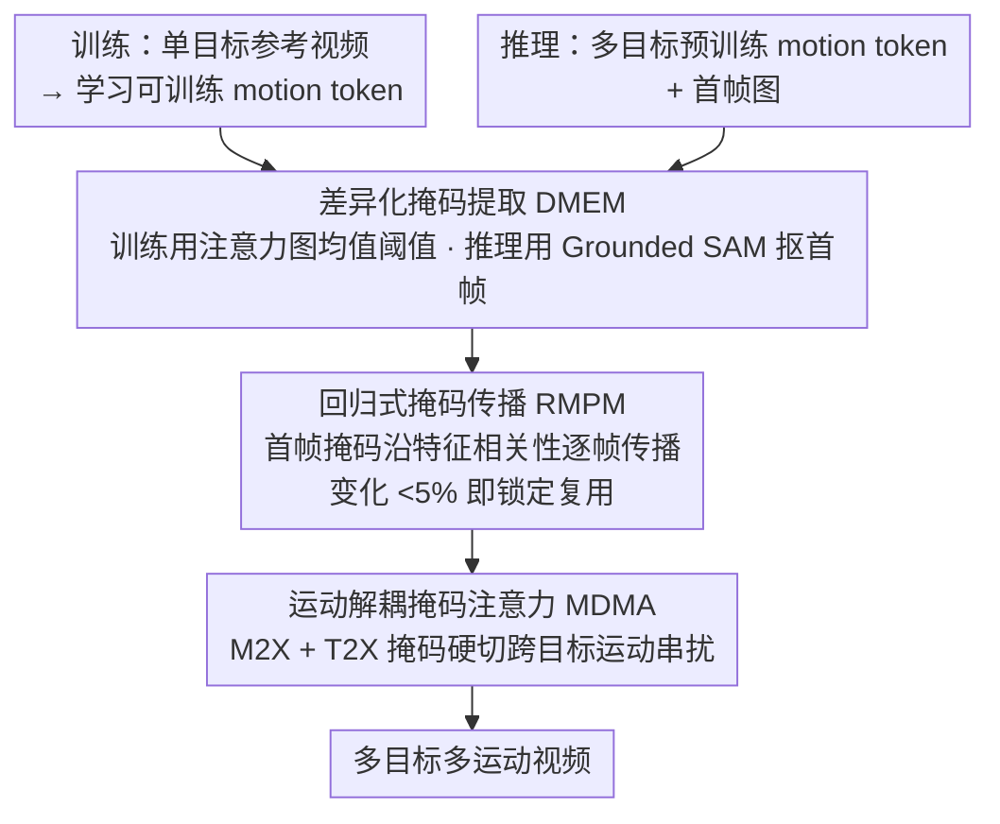

# Let Your Image Move with Your Motion! – Implicit Multi-Object Multi-Motion Transfer

**会议**: CVPR 2026  
**arXiv**: [2603.01000](https://arxiv.org/abs/2603.01000)  
**代码**: [项目页](https://ethan-li123.github.io/FlexiMMT_page/)  
**领域**: 视频生成  
**关键词**: 运动迁移、多目标多运动、注意力掩码、视频扩散模型、I2V生成

## 一句话总结

本文提出 FlexiMMT，首个支持隐式多目标多运动迁移的 I2V 框架，通过运动解耦掩码注意力机制（MDMA）约束 motion/text token 仅影响对应目标区域、差异化掩码提取机制（DMEM）从扩散注意力中推导目标掩码并渐进传播，实现了精确的组合式多目标运动迁移。

## 研究背景与动机

1. **领域现状**：运动迁移是可控视频生成的重要方向，旨在从参考视频中捕获运动动态并应用到目标主体。现有方法分为显式（pose/光流/轨迹）和隐式（从参考视频编码运动嵌入）两类。隐式方法通过可训练的 motion token 从参考视频中学习运动表示。

2. **现有痛点**：几乎所有现有隐式运动迁移方法都只能处理单目标单运动场景。当场景中存在多个目标且需要不同运动模式时，现有方法无法将不同运动独立分配给不同目标。

3. **核心矛盾**：直接将多组 motion token 注入 3D 全注意力层时，所有 token 之间的交互是全局纠缠的——一个目标的 motion token 会影响其他目标的视频 token，导致运动混淆和错误传递。

4. **本文目标**：如何在 I2V 生成中实现多目标独立运动迁移，让每个目标按照其指定的参考视频运动。

5. **切入角度**：在注意力层面做运动解耦——通过目标特定的掩码约束 motion 和 text token 仅与对应目标的 video token 交互。

6. **核心 idea**：用掩码注意力实现运动解耦，让每个目标只"看到"属于自己的运动信号和文本描述。

## 方法详解

### 整体框架

FlexiMMT 要解决的事很具体：一张图里有多个目标，想让每个目标各自照着一段参考视频的运动动起来，而现有隐式运动迁移只会伺候单目标单运动，多组运动信号一进来就互相串戏。它基于 CogVideoX-5B-I2V 搭建，整条链路分训练和推理两段。训练时只喂单目标参考视频，学一组可训练的 motion token 把这段运动编码进去，同时靠差异化掩码提取（DMEM）从注意力图里抠出目标掩码、在注意力层挂上去，逼着 motion token 只和该目标的 video token 交互；推理时把多个目标各自预训练好的 motion token 拼进文本和视频 token 序列，先由 DMEM 用 Grounded SAM 抠出首帧的各目标掩码、再靠回归式掩码传播（RMPM）把掩码一帧帧推到整段视频，最后由运动解耦掩码注意力（MDMA）把每组运动信号锁在自己的目标区域里、彼此不串戏。

### 关键设计

**1. 运动解耦掩码注意力（MDMA）：在 attention 里硬切跨目标的运动串扰**

痛点出在原始 MM-DiT 的 3D 全注意力——所有 token 全局交互，多组 motion token 一注进去就彼此纠缠，一个目标的运动会渗到别的目标上。MDMA 的做法是给注意力 logits 加一张掩码矩阵 $\mathcal{M}$，把不该发生的交互直接屏蔽掉：

$$ \text{Attn}(Q,K,V) = \text{softmax}\!\left(\frac{QK^\top}{\sqrt{d}} + \mathcal{M}\right)V $$

$\mathcal{M}$ 分成 Motion-to-X（M2X）和 Text-to-X（T2X）两类子掩码。M2X 让每组 motion token 只能看到对应目标的 video token（$\mathcal{M}_{m \to v}$ 放行、其余置 $-\infty$），并令 $\mathcal{M}_{m \to m} = \mathbf{0}$ 切断不同 motion token 之间的串扰；T2X 则让描述各目标运动的文本 token 也只关注自己那块区域。相比在 loss 上加软约束去"劝"模型解耦，这种在注意力得分上直接屏蔽的硬隔离更可靠，而且对原模型几乎零改动。

**2. 差异化掩码提取机制（DMEM）：训练和推理各用一套办法拿目标掩码**

MDMA 要用目标掩码，可掩码从哪来？DMEM 的答案是分场景。训练阶段是单目标，直接拿文本 query $Q_y^k$ 和视频 key $K_v$ 的注意力图、用均值阈值二值化，就能自动把目标区域抠出来——既省掉外部分割模型的开销，又保证训练和推理用同一套信号、不产生训推不一致。推理阶段换成多目标，这时注意力图会因为多个目标特征纠缠而分不清谁是谁，于是改用语义分割模型（Grounded SAM）抠出首帧掩码，再交给 RMPM 往后传。一句话：训练图省成本且自洽，推理图必须先解决"多目标归属"这个歧义，简单注意力法在这步反而失灵。

**3. 回归式掩码传播（RMPM）：把首帧的目标掩码准确推到每一帧**

首帧掩码有了，后面那 48 帧怎么办？RMPM 维护一个滑动窗口的锚点集（首帧加上近邻帧，窗口 $W=2$），通过特征相关性矩阵 $\mathcal{C}_l^k$ 把锚点掩码迁移到当前帧。动态版进一步省算力：当连续去噪步之间的掩码变化低于阈值 $\alpha = 5\%$ 时就停止更新、复用上一版稳定掩码。这背后的观察是，扩散模型的运动迁移主要在早期去噪步完成，后期掩码几乎不再变动，动态终止因此能大幅压低推理时间而几乎不掉性能。

### 一个完整示例

设输入图里有一只猫和一只狗，想让猫照参考视频 A（跳跃）动、狗照参考视频 B（摇尾巴）动。先各自加载预训练好的 motion token $m_\text{cat}$、$m_\text{dog}$，拼进 token 序列；Grounded SAM 在首帧分别抠出猫区域和狗区域的掩码。进入 MDMA 时，$m_\text{cat}$ 只能与猫区域的 video token 算注意力、完全看不到狗，$m_\text{dog}$ 反之，而两组 motion token 之间被 $\mathcal{M}_{m \to m} = \mathbf{0}$ 彻底隔开、互不污染。随去噪推进，RMPM 把首帧的猫/狗掩码沿特征相关性传到第 2、3、…帧，前几步掩码还在微调，到某一步变化已低于 5% 便锁定复用、不再重算。最终输出里猫在跳、狗在摇尾，两段运动各归各位、谁也没串到谁身上。

### 损失函数 / 训练策略

训练沿用 CogVideoX-5B-I2V 的标准噪声预测损失，只优化新增的 motion token。每组 motion token 训练 2000 步，AdamW 优化器，学习率 3e-3，batch size 为 1；视频分辨率 $720 \times 480$、每段 49 帧，RMPM 滑动窗口 $W=2$，全部实验在 6 块 NVIDIA A800 上完成。

## 实验关键数据

### 主实验

| 数据集 | 指标 | 本文(FlexiMMT) | 最佳baseline | 提升 |
|--------|------|------|----------|------|
| 200对 | Trajectory Fidelity (TF) | 0.577 | 0.488 (Go-with-Flow) | +0.089 |
| 200对 | Flow Fidelity (FF) | 0.723 | 0.648 (Go-with-Flow) | +0.075 |
| 200对 | Appearance Consistency | 0.904 | 0.939 (FlexiAct) | 略低但运动更准 |
| 200对 | 人工评估-运动保真度 | 89.475% | 6.500% (FlexiAct) | 压倒性领先 |
| 200对 | 人工评估-时间一致性 | 83.875% | 11.550% (FlexiAct) | 压倒性领先 |

### 消融实验

| 配置 | TF↑ | FF↑ | 说明 |
|------|---------|---------|------|
| 完整FlexiMMT | 0.577 | 0.723 | 基线 |
| w/o M2X掩码 | 0.381 | 0.618 | TF下降34%，M2X是运动解耦核心 |
| w/o T2X掩码 | 0.461 | 0.665 | TF下降20%，T2X也很重要 |
| w/o 训练阶段掩码 | 0.440 | 0.656 | 无法准确学习参考运动 |
| w/o 推理阶段掩码(DMEM) | 0.373 | 0.602 | 多运动完全纠缠 |
| w/o RMPM | 0.377 | 0.607 | 效果类似w/o推理掩码 |

### 关键发现

- 人工评估中FlexiMMT在运动保真度上获得89.475%的选票，远超所有baselines（第二名FlexiAct仅6.5%）
- AC和TC等CLIP-based指标对静态/弱运动视频有偏好——运动失败的方法反而可能获得高AC/TC分数
- 论文提出的Flow Fidelity (FF)指标比Trajectory Fidelity更全面地衡量运动相似性
- 动态RMPM相比全量RMPM大幅降低推理时间，且性能无损

## 亮点与洞察

- 首个解决隐式多目标多运动迁移问题的框架，填补了重要空白
- MDMA机制思路简洁有效：通过掩码矩阵在attention层面硬性切断跨目标信号，比软约束更可靠
- 训练/推理阶段使用不同的掩码提取策略是一个务实的工程选择——训练时用轻量注意力方法，推理时用分割+传播
- 运动token可以任意重组和交换，实现了真正的组合式运动迁移

## 局限与展望

- 训练阶段每个视频只含单个目标，依赖大量单目标参考视频
- 首帧分割依赖外部语义分割模型（Grounded SAM），引入额外依赖
- RMPM基于特征相关性传播，在遮挡或快速运动导致目标外观剧变时可能失败
- AC和TC指标偏低可能表明生成的运动引入了一定程度的外观漂移

## 相关工作与启发

- **vs FlexiAct**: FlexiAct通过时空注意力特征提取运动，但在多目标场景下运动信号纠缠严重；FlexiMMT通过MDMA在注意力层面显式隔离
- **vs Go-with-the-Flow**: 使用显式光流进行运动控制，需要光流估计器且对目标几何有约束；FlexiMMT是隐式方法，更灵活
- **vs MotionDirector**: T2V场景下的LoRA-based运动解耦，无法处理I2V的外观保持需求
- **启发**: 在注意力层面进行结构化约束（而非纯粹的损失函数约束）是实现解耦控制的有效范式

## 评分

- 新颖性: ⭐⭐⭐⭐⭐ 首个隐式多目标多运动I2V框架，问题定义和解决方案均有创新
- 实验充分度: ⭐⭐⭐⭐ 200对评估、自动+人工指标、详细消融，但数据集规模偏小
- 写作质量: ⭐⭐⭐⭐ 公式化表述严谨，整体结构清晰
- 价值: ⭐⭐⭐⭐ 对可控视频生成领域有显著推进，开启多运动迁移新方向

<!-- RELATED:START -->

## 相关论文

- [\[CVPR 2026\] Anti-I2V: Safeguarding your photos from malicious image-to-video generation](anti-i2v_safeguarding_your_photos_from_malicious_image-to-video_generation.md)
- [\[CVPR 2026\] Attention Surgery: An Efficient Recipe to Linearize Your Video Diffusion Transformer](attention_surgery_an_efficient_recipe_to_linearize_your_video_diffusion_transfor.md)
- [\[CVPR 2026\] SymphoMotion: Joint Control of Camera Motion and Object Dynamics for Coherent Video Generation](symphomotion_joint_control_of_camera_motion_and_object_dynamics_for_coherent_vid.md)
- [\[CVPR 2026\] VideoWeaver: Multimodal Multi-View Video-to-Video Transfer for Embodied Agents](videoweaver_multimodal_multi-view_video-to-video_transfer_for_embodied_agents.md)
- [\[CVPR 2026\] 3D-Aware Implicit Motion Control for View-Adaptive Human Video Generation](3d-aware_implicit_motion_control_for_view-adaptive_human_video_generation.md)

<!-- RELATED:END -->
