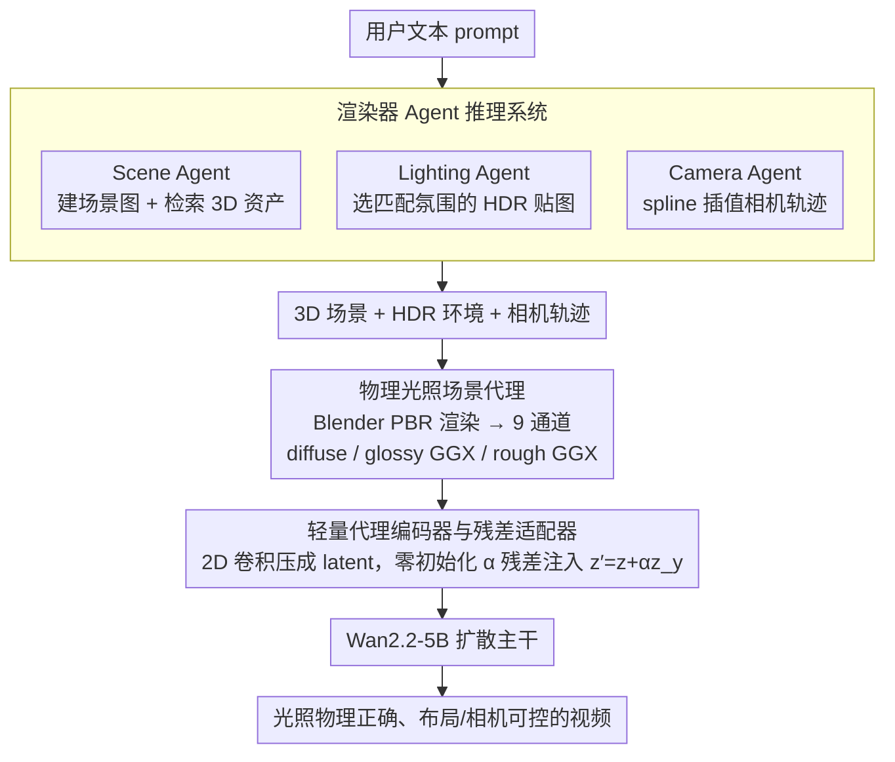

# Lighting-grounded Video Generation with Renderer-based Agent Reasoning

**会议**: CVPR 2026  
**arXiv**: [2604.07966](https://arxiv.org/abs/2604.07966)  
**代码**: 无  
**领域**: 3D视觉 / 视频生成  
**关键词**: 光照可控视频生成, 3D场景代理, 物理渲染, 扩散模型, 场景Agent

## 一句话总结

LiVER 提出了一种光照驱动的视频生成框架，通过渲染器Agent将文本描述转化为显式3D场景代理（包含布局、光照、相机轨迹），再利用物理渲染生成diffuse/glossy/rough GGX的场景proxy，注入视频扩散模型实现物理准确的光照效果与精确场景控制。

## 研究背景与动机

扩散模型在视频生成领域取得了显著进步，但可控性仍是核心瓶颈。现有方法主要通过数据驱动的方式提升视觉质量，但在显式建模场景因素（如布局、光照、相机轨迹）方面存在明显不足。虽然已有工作尝试引入3D感知条件（如相机控制 CameraCtrl、物体轨迹 MotionCtrl），但这些方法几乎完全忽略了物理准确的光照建模——阴影、反射、环境光遮蔽等效果在真实材质（皮肤、金属、玻璃）上仍然不真实。

核心矛盾在于：现有方法要么只关注几何/运动控制而忽略光照，要么将光照与其他属性纠缠在一起无法解耦控制。本文的切入角度是将场景的光照属性通过物理渲染器显式解耦为可控的2D渲染通道（diffuse、glossy GGX、rough GGX），保留3D场景的光照物理信息同时以图像序列形式注入视频扩散模型。

核心idea：**用渲染器Agent自动将文本转化为3D场景 → 通过PBR渲染获得光照感知的场景代理 → 轻量级编码器+三阶段训练将物理光照信号注入视频扩散模型**。

## 方法详解

### 整体框架

LiVER 想解决的是「文本生成视频里光照不可控、也不物理」这件事：用户只写一句话，模型却得自己脑补阴影、反射、环境光遮蔽，结果在皮肤、金属、玻璃这些材质上经常假得离谱。它的破题办法是先把这句话翻译成一个真正的 3D 场景，让物理渲染器把光照算准，再把算好的光照"画"成图像序列喂给视频扩散模型。

整条链路是这样转的：先由一组渲染器 Agent 读懂用户文本，拆出物体、空间关系、光照氛围和相机运动，拼成结构化场景图并从资产库检索 3D 模型；接着把这个 3D 场景连同 HDR 环境贴图、相机轨迹一起交给 Blender 渲染，得到一份带光照物理信息的「场景代理」 $y \in \mathbb{R}^{F \times 9 \times H \times W}$（三组 RGB 渲染通道堆在一起）；最后一个轻量编码器把这份代理压进视频 latent 空间，以残差形式注入 Wan2.2-5B 扩散主干，引导它生成光照物理正确、布局/相机都可控的视频。关键在于：3D 场景只用来"算光照"，真正喂给扩散模型的是 2D 渲染通道——既保住了物理意义，又绕开了让扩散模型直接吃完整 3D 表示的难题。

### 关键设计

**1. 渲染器 Agent 推理系统：把一句话拆成可渲染的 3D 控制信号**

普通用户不会手搓 3D 场景，但视频扩散模型又需要明确的几何、光照、相机信息才能受控。LiVER 让三个分工明确的 Agent 接力把文本翻译成这些信号：Scene Agent 解析物体类别和空间关系，构建场景图 $\mathcal{G}=(V,E)$ 并从 Objaverse-XL 检索对应资产；Lighting Agent 抓文本里的光照线索（如 "warm mood"），从 Poly Haven 库挑一张匹配氛围的 HDR 环境贴图；Camera Agent 把运动语义（如 "orbit"、"dolly zoom"）翻译成关键位姿，再用 spline 插值出一条平滑相机轨迹。这一步全自动，降低了使用门槛；同时每个中间产物都是显式可读的（场景图、贴图、轨迹），专业用户可以手动改某个物体的位置或换一张环境贴图，满足影视级的精修需求。

**2. 物理光照场景代理：用三组 PBR 渲染通道把光照"摊平"成 2D**

直接把完整 3D 场景塞给视频扩散模型太复杂，但若只给一张普通渲染图又会把光照和材质纠缠死、没法解耦控制。LiVER 的做法是让 PBR 渲染器按反射频率把光照拆成三层：diffuse 通道管低频环境光与软阴影，rough GGX 通道管中频的宽反射，glossy GGX 通道管高频的镜面高光。三层各自是一段 RGB 序列，堆成 9 通道图像序列

$$y = [x^{\text{DIFF}},\, x^{\text{GGX1}},\, x^{\text{GGX2}}] = R(s^i, l^i, c^i)$$

其中 $R$ 是渲染器，$s^i / l^i / c^i$ 分别是第 $i$ 帧的场景、光照、相机。这样既保留了物理渲染算出的真实光照（阴影、反射的位置和强度都是物理正确的），又把它表达成扩散模型熟悉的图像形式，可以走标准的 2D 编码注入流程。

**3. 轻量级代理编码器与残差适配器：把光照信号温和地"渗"进生成主干**

光照信号要起作用，就得对齐到视频扩散模型的 latent 空间，但又不能一上来就把预训练主干的生成能力冲垮。LiVER 用一个 2D 卷积编码器把 9 通道场景代理下采样到和 VAE latent 同分辨率的特征 $z^y \in \mathbb{R}^{F \times C \times H' \times W'}$，再通过一个零初始化的可学习标量 $\alpha$ 做残差注入：

$$z' = z + \alpha \cdot z^y$$

零初始化是这里的巧思：训练初期 $\alpha \approx 0$，注入项几乎不存在，模型先稳住原有的视频生成质量；随着训练推进 $\alpha$ 慢慢长大，光照代理才逐步接管 latent，把控制信号"渗"进去，避免了硬注入导致的崩坏。

### 一个完整示例

以一句 prompt "a ceramic vase on a wooden table, warm afternoon light, camera slowly orbits around it" 走一遍：Scene Agent 认出 vase 和 table 两个物体及"on"关系，建出两节点场景图，从 Objaverse-XL 各检索一个 3D 模型并按关系摆好；Lighting Agent 抓到 "warm afternoon"，从 Poly Haven 选一张暖色调的 HDR 贴图当全局光；Camera Agent 识别 "orbit"，生成一圈绕物体的相机轨迹并 spline 平滑。Blender 拿这套 3D 场景逐帧渲染，输出每帧的 diffuse / rough GGX / glossy GGX 三层——陶瓷釉面的高光落在 glossy 通道、木桌的漫反射落在 diffuse 通道、暖光的色调贯穿三层。三层堆成 9 通道序列后经编码器压成 latent 特征，以 $z' = z + \alpha z^y$ 注入 Wan2.2-5B，最终生成的视频里花瓶高光随相机转动而移动、阴影方向与暖光一致——这些都是物理渲染算出来的，而不是扩散模型猜的。

### 损失函数 / 训练策略

采用三阶段训练方案：
- **Stage 1 - 条件通路训练**：冻结视频扩散主干，仅训练proxy编码器和适配器（10 epoch），学习将场景代理转化为粗略控制信号
- **Stage 2 - 联合LoRA微调**：解冻主干中的LoRA层，与编码器/适配器联合训练（10 epoch），精细化语义对齐
- **Stage 3 - 光照多样性扩展**：继续联合训练，以1:1混合真实与合成数据，增强模型对多样光照现象的泛化能力

训练损失采用标准flow matching目标：$\mathcal{L} = \mathbb{E}_{z,\epsilon,t}[|u_\theta(z_t, y, c^{\text{txt}}, t) - v_t|^2]$

## 实验关键数据

### 主实验

| 方法 | FVD ↓ | FID ↓ | CLIP ↑ | ATE ↓ | LE ↓ | mIoU ↑ |
|------|-------|-------|--------|-------|------|--------|
| CameraCtrl | 48.03 | 98.29 | 28.75 | 2.15 | 0.06 | 0.68 |
| MotionCtrl | 63.13 | 97.21 | 26.67 | 3.42 | 0.07 | 0.66 |
| VideoFrom3D | 36.94 | 157.89 | 24.51 | 17.55 | 0.05 | 0.74 |
| **LiVER** | **32.56** | **129.56** | **30.97** | **2.48** | **0.04** | **0.87** |

16帧对比（vs CameraCtrl/MotionCtrl）中，LiVER FVD=32.45, FID=42.32, CLIP=29.62，全面领先。

### 消融实验

| 配置 | 关键效果 | 说明 |
|------|---------|------|
| 无合成数据 | 光照均匀、错误 | 缺乏动态光照多样性，过拟合真实数据的有限光照模式 |
| 无分阶段训练 | 输出几乎静止 | 同时学习控制信号和适配预训练模型优化困难 |
| 完整模型 | 最佳效果 | 三阶段方案确保稳定收敛和高质量生成 |

### 关键发现

- 合成数据对光照多样性至关重要：仅用真实数据训练导致光照均匀平淡
- 分阶段训练是模型稳定收敛的关键：端到端训练导致生成结果几乎静态
- 用户研究（25人×20组）显示LiVER在视频质量(83.4%)、场景控制(83.3%)、相机控制(72.1%)、光照控制(59.3%)四个维度全面优于竞争方法

## 亮点与洞察

- 将物理渲染的光照分解（diffuse/glossy/rough）作为视频生成的条件控制信号，是一个非常优雅的设计——既保留了物理意义又兼容2D处理流程
- 渲染器Agent的设计使系统既可自动化使用又支持手动编辑，满足从普通用户到专业影视制作的不同需求
- 零初始化残差注入策略是一个成熟的工程选择，确保预训练模型能力不被破坏

## 局限与展望

- 初始3D重建较粗糙，几何细节和材质效果依赖文本描述的精确度，对prompt敏感
- 3D资产检索的质量和覆盖度受限于现有资产库
- 仅支持HDR环境贴图作为全局光照，不支持局部光源的精细控制
- 场景代理的渲染需要Blender等引擎，增加了推理pipeline的复杂度

## 相关工作与启发

- **vs CameraCtrl**: CameraCtrl仅控制相机运动，LiVER额外实现了光照和布局的解耦控制
- **vs VideoFrom3D**: VideoFrom3D需要为每个测试样本训练style LoRA（~40分钟），且忽略光照，LiVER端到端且光照感知
- **vs Light-A-Video/LumiSculpt**: 这些方法聚焦于视频重光照，但将光照与其他物理属性纠缠；LiVER从3D场景代理出发实现解耦
- **启发**: 将PBR渲染的中间结果作为生成模型的条件信号是一个可推广的范式

## 评分

- 新颖性: ⭐⭐⭐⭐ 将PBR渲染通道作为视频生成条件的思路新颖，Agent+渲染器+扩散模型的组合设计完整
- 实验充分度: ⭐⭐⭐⭐ 定量/定性/用户研究/消融实验完备，但数据集规模偏小(11K视频)
- 写作质量: ⭐⭐⭐⭐ 论文结构清晰，方法描述详细，图示质量高
- 价值: ⭐⭐⭐⭐ 对影视制作和虚拟内容生产有实际应用价值，推动了可控视频生成的发展

<!-- RELATED:START -->

## 相关论文

- [\[ICML 2026\] MotiMotion: Motion-Controlled Video Generation with Visual Reasoning](../../ICML2026/video_generation/motimotion_motion-controlled_video_generation_with_visual_reasoning.md)
- [\[ICCV 2025\] MotionAgent: Fine-grained Controllable Video Generation via Motion Field Agent](../../ICCV2025/video_generation/motionagent_fine-grained_controllable_video_generation_via_motion_field_agent.md)
- [\[NeurIPS 2025\] PhysCtrl: Generative Physics for Controllable and Physics-Grounded Video Generation](../../NeurIPS2025/video_generation/physctrl_generative_physics_for_controllable_and_physicsgrou.md)
- [\[CVPR 2025\] PhyT2V: LLM-Guided Iterative Self-Refinement for Physics-Grounded Text-to-Video Generation](../../CVPR2025/video_generation/phyt2v_llm-guided_iterative_self-refinement_for_physics-grounded_text-to-video_g.md)
- [\[CVPR 2026\] Gloria: Consistent Character Video Generation via Content Anchors](gloria_consistent_character_video_generation_via_content_anchors.md)

<!-- RELATED:END -->
