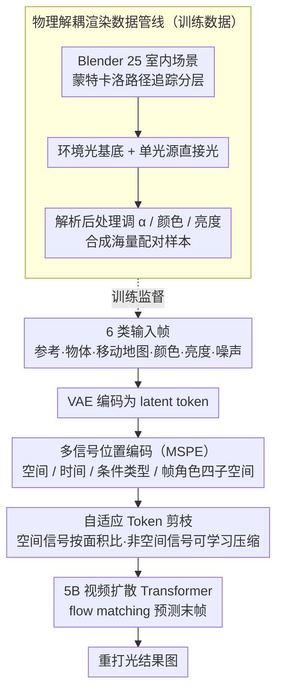

# LightMover: Generative Light Movement with Color and Intensity Controls

**会议**: CVPR 2026  
**arXiv**: [2603.27209](https://arxiv.org/abs/2603.27209)  
**代码**: [项目页面](https://gengzezhou.github.io/LightMover/)  
**领域**: 视频生成  
**关键词**: 光源操控, 视频扩散模型, 光照编辑, 自适应token剪枝, 物理渲染数据

## 一句话总结

LightMover 利用视频扩散先验，将光源编辑建模为序列到序列预测问题，通过统一的控制token表示实现光源位置、颜色和亮度的精确操控，并提出自适应token剪枝机制将控制序列长度减少41%，在光源移动和物体移动任务上均超越现有方法。

## 研究背景与动机

从单张图像精确编辑光照是一个极具挑战性的任务，因为光照与几何、材质、遮挡之间存在复杂的全局交互。现有方法分为两类：(1) 逆渲染方法（如重建几何、材质、光照后重新渲染），从单张图像求解是高度病态的且计算昂贵；(2) 扩散模型编辑方法（如LightLab）可以调节色调和环境光，但无法建模光源的空间移动。通用图像编辑模型（SDEdit、InstructPix2Pix、Gemini等）缺乏显式的光照参数化表示，无法实现物理合理的光照控制。

核心矛盾在于：现有方法要么缺乏对光源空间位置的建模能力，要么将光照隐式地融入物体移动框架中，无法正确传播阴影、反射和光照衰减。本文的核心idea是将ObjectMover的token序列框架扩展到光照编辑领域，为颜色和亮度设计专门的控制token，并通过"2.5D"学习范式（用视频扩散模型在2D图像上近似3D光传输）实现物理一致的光源操控。

## 方法详解

### 整体框架

LightMover 把"编辑一张图的光照"重新表述成"预测视频里下一帧"——既然视频扩散模型天然懂得帧与帧之间光影该怎么连续变化，那就借这份先验来近似 3D 光传输，而不必真去重建几何与材质。具体做法是把所有输入拼成一段伪视频喂给一个 5B 参数的视频扩散 Transformer，让它在最后一帧生成出重打光后的结果。输入序列包含六类帧：(1) 参考图像 $I_{\text{ref}}$；(2) 目标物体裁剪 $I_{\text{obj}}$；(3) 移动地图 $I_{\text{move}}$（R 通道编码源区域、GB 通道编码目标区域）；(4) 颜色控制帧 $I_{\text{color}}$；(5) 亮度控制帧 $I_{\text{intensity}}$；(6) 待生成的噪声帧 $X^t$。所有帧经 VAE 编码成 latent token 后，先用**多信号位置编码（MSPE）**让模型分清每帧的语义角色，再用**自适应 Token 剪枝**把控制信号压短，最后由扩散 Transformer 联合处理，一次性推理出光源位置、颜色、亮度的协同变化。而支撑整套学习的是一条**物理解耦渲染数据管线**，在后处理里合成海量"同场景不同光照"的配对样本。

### 关键设计

**1. 多信号位置编码（MSPE）：让模型分清每一帧到底是「参考」还是「指令」**

把六类输入（参考、物体、移动、颜色、亮度、输出噪声）一股脑拼成伪视频序列后，标准位置编码只会按"第几帧"来排序，根本看不出它们语义角色完全不同——参考图是底图、移动地图是空间指令、颜色帧是属性指令，混在一起就会乱套。MSPE 的做法是把位置信息拆成四个正交子空间分别编码：空间编码 $(W,H)$ 保留帧内的二维结构、时间编码 $T$ 记录序列顺序、条件类型编码 $C$ 标出这一帧属于哪种模态、帧角色编码 $R$ 进一步区分它是条件输入还是待预测输出。四者各自投影后加性组合，再以类 RoPE 的方式调制进注意力。这样一来模型在做注意力时既知道"这两个像素在空间上对不对齐"，也知道"这一帧是该被遵守的指令还是该被生成的目标"，空间对齐和条件依赖被放在同一套坐标里联合推理。

**2. 自适应 Token 剪枝：别让颜色、亮度这些控制信号把序列撑爆**

颜色和亮度本来可以直接当成额外的全分辨率帧塞进序列，但这么做 token 数会线性膨胀，挤占算力也压低了能支持的输出分辨率上限。LightMover 区别对待两类控制信号：对带空间结构的信号（如移动地图），按目标 bounding box 占整图的面积比来决定保留全分辨率还是成比例下采样——框越小、需要的空间细节越少，就压得越狠；对颜色、亮度这类与像素位置无关的非空间信号，干脆用一个可学习的下采样率把 token 压到很短。两者合起来把控制序列总长度削减了 41%，而精度几乎无损（消融里启用剪枝后 PSNR 20.39，与不剪枝的 20.38 持平）。

**3. 物理解耦渲染数据管线：在后处理里"无中生有"造出海量配对光照样本**

要让模型学会光怎么移、阴影怎么跟着变，必须有成对的"同一场景不同光照"数据，而真实世界几乎不可能采集。作者在 Blender 里用 25 个室内场景配 100 个光源资产，靠蒙特卡洛路径追踪把每一帧拆成两层——只有环境光的基底 $I_{\text{amb}}$ 和某个光源单独的直接光贡献 $I_{\text{light}}$。有了这两层，重打光就变成一个解析后处理：

$$I_{\text{relit}}(\alpha, G_{\text{illum}}, \mathbf{c}_t) = \alpha\, I_{\text{amb}} + G_{\text{illum}}\, I_{\text{light}} \odot \mathbf{c}_t$$

其中 $\alpha$ 调环境光强度、$\mathbf{c}_t$ 给光源上色、亮度增益 $G_{\text{illum}} = 2^{S_{\text{EV}}}$ 以摄影曝光值（EV）为单位。换言之渲染一次就能在后处理里调出无穷多组颜色与亮度变体，省掉重复路径追踪的巨大开销。更关键的是，这种物理解耦让训练样本里阴影的移动、反射的变亮、间接光的传播都是物理因果的结果，模型学到的是光照的因果效应而非表面像素的统计相关。

### 损失函数 / 训练策略

使用flow matching目标训练：$\mathcal{L} = \mathbb{E}_{t,X^0,X^1}[\|v(S^t, t; \theta)_{[6]} - V^t\|^2]$

训练采用多任务混合策略，合成与真实数据比例10:1，七类任务（光源移动:物体移动:颜色变化:亮度变化:联合变化:光源移除:光源插入）比例为6:3:3:3:1:1。训练分辨率混合512×512和1024×1024（1:1比例）。

## 实验关键数据

### 主实验

**光源移动 (LightMove-A)**:

| 方法 | PSNR ↑ | DINO ↑ | CLIP ↑ |
|------|--------|--------|--------|
| Qwen-Image | 19.01 | 69.94 | 87.27 |
| Gemini-2.5-Flash | 19.59 | 72.46 | 89.72 |
| ObjectMover | 19.49 | 78.12 | 90.48 |
| **LightMover** | **20.38** | **81.27** | **91.85** |

**光源颜色/亮度变化 (LightMove-B)**:

| 方法 | 颜色PSNR | 亮度PSNR | 组合PSNR |
|------|----------|----------|----------|
| Gemini-2.5-Flash | 22.14 | 25.09 | 18.42 |
| **LightMover** | **24.06** | **27.12** | **19.97** |

**通用物体移动 (ObjMove-A)**:

| 方法 | PSNR ↑ | DINO ↑ | CLIP ↑ |
|------|--------|--------|--------|
| ObjectMover | 25.27 | 85.07 | 93.16 |
| **LightMover** | **25.73** | **88.59** | **91.86** |

### 消融实验

| 配置 | PSNR | DINO | CLIP | 说明 |
|------|------|------|------|------|
| 无Light Aug/Color/Intensity | 19.88 | 79.93 | 91.06 | 基线，无辅助任务 |
| +Light Aug | 20.07 | 79.73 | 91.62 | 光照增强提升质量 |
| +All（完整模型） | 20.38 | 81.27 | 91.85 | 多任务联合训练最佳 |
| 无frame-as-condition | 19.53 | 77.32 | 90.01 | 帧编码优于嵌入编码 |
| 无adaptive downsample | 19.38 | 75.62 | 89.81 | 自适应剪枝不可或缺 |

### 关键发现

- 多任务联合训练产生强互增强效应：位置、颜色、亮度信号相互正则化，提升所有光照任务的准确性
- 自适应token剪枝减少41%控制序列长度，性能几乎无损（启用剪枝后PSNR 20.39 vs 20.38）
- LightMover不仅在光源操控上领先，在通用物体移动任务上也超越ObjectMover，说明统一框架的泛化能力

## 亮点与洞察

- "2.5D"范式非常巧妙——用视频扩散模型在2D空间近似3D光传输，避免了完整3D重建的计算代价
- 将光照编辑统一到物体移动框架中的思路很自然，控制token的设计使一个模型同时支持物体和光源编辑
- 物理解耦渲染管线是数据工程的典范：通过分离ambient和direct light，在后处理中生成无穷变体

## 局限与展望

- 当前仅支持可见光源的操控，对于不可见光源（如来自窗外的自然光）的控制能力有限
- 合成数据仅使用25个室内场景，场景多样性可进一步提升
- 光源移动时对远距离光传输效应（如焦散、次表面散射）的建模可能不够准确
- 仅支持单张图像输入，尚未扩展到视频序列的光源操控

## 相关工作与启发

- **vs ObjectMover**: LightMover扩展了ObjectMover的token框架，增加了光照特定的控制信号，在物体移动任务上也更优
- **vs LightLab**: LightLab支持光照色调和开关控制但不支持空间移动，LightMover首次实现光源位置的精确控制
- **vs Gemini-2.5-Flash-Image**: 通用LLM编辑器缺乏光照参数化，在光照传播的物理一致性上明显不如LightMover
- **启发**: 将非空间属性（颜色、亮度）也编码为帧token的思路值得在其他控制生成任务中借鉴

## 评分

- 新颖性: ⭐⭐⭐⭐ 首次将光源空间移动与颜色/亮度控制统一在视频扩散框架中，自适应token剪枝设计精巧
- 实验充分度: ⭐⭐⭐⭐⭐ 覆盖光源移动/颜色/亮度/联合控制/物体移动/插入/移除，消融全面
- 写作质量: ⭐⭐⭐⭐ 方法描述清晰，物理建模公式严谨，pipeline可视化质量高
- 价值: ⭐⭐⭐⭐ 对照片后期编辑和虚拟场景制作有直接应用价值，推进了精细光照控制的研究

<!-- RELATED:START -->

## 相关论文

- [\[CVPR 2026\] FastLightGen: Fast and Light Video Generation with Fewer Steps and Parameters](fastlightgen_fast_and_light_video_generation_with_fewer_steps_and_parameters.md)
- [\[CVPR 2026\] V-RGBX: Video Editing with Accurate Controls over Intrinsic Properties](v-rgbx_video_editing_with_accurate_controls_over_intrinsic_properties.md)
- [\[CVPR 2026\] Generative Neural Video Compression via Video Diffusion Prior](generative_neural_video_compression_via_video_diffusion_prior.md)
- [\[CVPR 2026\] SwitchCraft: Training-Free Multi-Event Video Generation with Attention Controls](switchcraft_training-free_multi-event_video_generation_with_attention_controls.md)
- [\[CVPR 2025\] ReCapture: Generative Video Camera Controls for User-Provided Videos Using Masked Video Fine-Tuning](../../CVPR2025/video_generation/recapture_generative_video_camera_controls_for_user-provided_videos_using_masked.md)

<!-- RELATED:END -->
