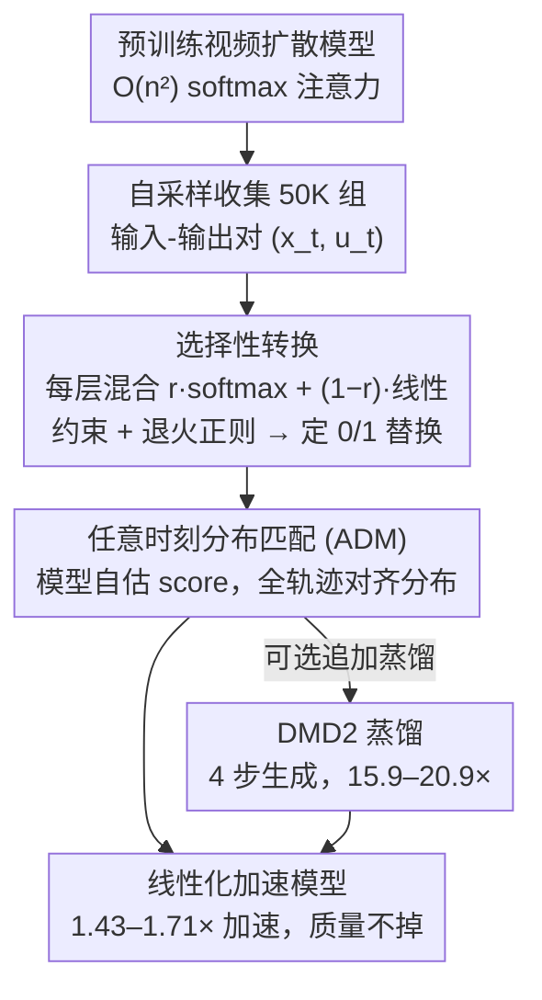

# LinVideo: A Post-Training Framework towards O(n) Attention in Efficient Video Generation

**会议**: CVPR2026  
**arXiv**: [2510.08318](https://arxiv.org/abs/2510.08318)  
**代码**: 无  
**领域**: 视频生成  
**关键词**: linear attention, video diffusion, post-training, efficient inference, distribution matching

## 一句话总结

提出 LinVideo，一种无需训练数据的后训练框架，通过选择性地将视频扩散模型中的二次注意力替换为线性注意力，实现 1.43–1.71× 加速，结合蒸馏可达 15.9–20.9× 加速，同时保持生成质量。

## 研究背景与动机

视频扩散模型（如 Wan、CogVideoX、Sora）在生成质量上取得突破，但其 self-attention 的计算复杂度为 $\mathcal{O}(n^2)$，当视频序列长度 $n$ 很大时（10s 视频常超过 50K tokens），推理成本成为部署瓶颈。

现有加速方案有两类：

**注意力稀疏化**（SVG、XAttention 等）：跳过冗余计算，但在中等序列长度下难以达到高稀疏度，实际仍保留 >50% 的密集注意力计算量

**线性注意力**（SANA-Video、LinGen 等）：将复杂度降至 $\mathcal{O}(n)$，但全部替换需要从头预训练，代价极高

核心矛盾在于：线性注意力的表达能力与 softmax 注意力存在显著差距（representation gap），加上视频生成的时空建模复杂性，使得廉价的后训练（post-training）难以奏效。本文的核心问题是：**能否通过高效的后训练，将尽可能多的二次注意力层替换为线性注意力，在不损失质量的前提下实现显著加速？**

## 方法详解

### 整体框架

LinVideo 是一个**无数据（data-free）后训练框架**，目标是在不重训整个模型、不损失质量的前提下，把视频扩散模型里尽可能多的二次注意力换成线性注意力。它分三步走：先从预训练模型自身采样、收集 50K 组输入-输出对 $(x_t, u_t)$ 当训练数据，省掉外部视频集；再用可学习参数自动选出哪些层适合替换（**选择性转换**）；最后用**任意时刻分布匹配（ADM）**把线性化模型在整条采样轨迹上的分布拉回原模型。其中自采样与输出模型是脚手架，选择性转换和 ADM 是两个核心贡献。

### 关键设计

**1. 选择性转换：自动挑出「换了也不掉点」的层做线性化**

作者先观察到一个关键现象：不同层的可替换性天差地别——浅层（如 2–11 层）换掉后精度容易恢复，可能因为后续层能补偿误差，而某些层（如第 1 层）一换就不可逆地崩。于是把「哪些层替换」建成一个二分类问题：每层引入可学习标量 $r \in [0,1]$，跑混合注意力

$$o_i = r \cdot \text{SoftmaxAttn}(q_i, K, V) + (1-r) \cdot \text{LinearAttn}(q_i, K, V)$$

$r=1$ 保留 softmax、$r=0$ 用线性，训练完四舍五入定下最终选择。为了让替换数量可控，加约束损失 $\mathcal{L}_{\text{con}} = \left(\sum_{l=1}^{N} \lceil r^{(l)} \rfloor - \text{target}\right)^2$；为了避免 $r$ 卡在 0.5 附近导致四舍五入抖动，再加正则损失

$$\mathcal{L}_{\text{reg}} = \sum_{l=1}^{N} (1 - |2r^{(l)} - 1|^\alpha)$$

其中 $\alpha$ 从大到小退火，前期放手探索、后期逼 $r$ 趋近 0 或 1——消融显示去掉 $\mathcal{L}_{\text{reg}}$ 后 Imaging Quality 会从 66.07 暴跌到 18.62。线性注意力的核函数用 Hedgehog 设计 $\phi(q) = \text{softmax}(q\widetilde{W}_q) \oplus \text{softmax}(-q\widetilde{W}_q)$，靠 softmax 变换保证非负性。

**2. 任意时刻分布匹配（ADM）：用模型自己当 score 估计器，全轨迹对齐分布**

朴素 MSE 损失 $\mathcal{L}_{\text{mse}} = \|u_t - \hat{u}_\theta(x_t, t)\|^2$ 不保持帧间联合分布，会带来闪烁、抖动等时间伪影；而 DMD 这类少步蒸馏的分布匹配只对齐最终 $t=0$ 的 $p_0$、忽略中间时刻，还得额外训一个模型估 score，代价是 5–10× 训练开销。ADM 改成在采样轨迹的**任意时刻** $t$ 匹配分布，最小化

$$\mathcal{L}_{\text{ADM}} = \mathbb{E}_{\hat{x}_t \sim q_t}\left[\log \frac{q_t(\hat{x}_t)}{p_t(\hat{x}_t)}\right]$$

关键巧思是：由于 LinVideo 是从 softmax 渐进过渡到线性注意力，$\hat{u}_\theta$ 始终能看成一个 flow model，于是可以拿它自己来估 score，不必另训模型——score 差化简成

$$s_t(\hat{x}_t) - \hat{s}_t(\hat{x}_t) = -\frac{1-t}{t}(u_\theta(\hat{x}_t) - \hat{u}_\theta(\hat{x}_t))$$

这样既省掉额外模型（训练快 ~4.4×），又比只匹配终点的 DMD 更稳。

### 损失函数 / 训练策略

总损失：$\mathcal{L}_{\text{total}} = \mathcal{L}_{\text{ADM}} + \lambda(\mathcal{L}_{\text{con}} + \mathcal{L}_{\text{reg}})$，$\lambda = 0.01$

- Wan 1.3B：替换 16/30 层，8×H100 训练 3K 步
- Wan 14B：替换 22/40 层，32×H100 训练 3K 步
- 可选：追加 DMD2 蒸馏 2K 步，实现 4 步生成

## 实验关键数据

### 主实验：VBench 8 维度性能对比（Wan 1.3B, 480p）

| 方法 | 延迟(s) | 加速比 | Imaging Quality | Aesthetic Quality | Motion Smooth. | Dynamic Degree | BG Consist. | Subject Consist. |
|------|---------|--------|-----------------|-------------------|----------------|----------------|-------------|-----------------|
| FlashAttention2 | 97.32 | 1.00× | 66.25 | 59.49 | 98.42 | 59.72 | 96.57 | 95.28 |
| SVG | 74.52 | 1.31× | 65.78 | 59.16 | 97.32 | 58.87 | 95.79 | 93.94 |
| SVG2 | 84.91 | 1.15× | 66.03 | 59.31 | 98.07 | 59.44 | 96.61 | 94.95 |
| **LinVideo** | **68.26** | **1.43×** | **66.07** | **59.41** | **98.19** | **59.67** | **96.72** | **95.12** |
| LinVideo+DMD2 | 6.11 | **15.9×** | 65.62 | 57.74 | 97.32 | 61.26 | 95.47 | 93.74 |

Wan 14B (720p) 上 LinVideo 达 **1.71×** 加速（1127s vs 1931s），结合 DMD2 达 **20.9×** 加速。VBench-2.0 总分：LinVideo (56.74) = FA2 (56.74) > SVG2 (55.81)。

### 消融实验汇总

| 消融维度 | 关键发现 |
|---------|---------|
| target 数量 | target=10→20 加速递增但质量递降；target≤18 时性能稳定，≥20 显著下降 |
| 选择策略 | LinVideo（自动选择）>> Manual（同层手动赋予）>> Heuristic（网格搜索） |
| $\mathcal{L}_{\text{reg}}$ | 去掉后 Imaging Quality 从 66.07 暴跌到 18.62，证明 $r$ 的正则不可或缺 |
| ADM vs MSE | ADM (66.07) >> MSE (61.56) >> DMD (57.44)，MSE 引入时间伪影 |
| ADM 自估 score | 用自身估计 $\hat{s}_t$ (66.07) 优于训练额外模型 (65.61)，且快 ~4.4× |
| $\lambda$ 敏感性 | $\lambda \in \{0.001, 0.01, 0.1\}$ 性能波动 ~1%，不敏感 |

### 层选择结果

自动选择的被替换层：$\{2\text{–}8, 10\text{–}13, 15\text{–}16, 23, 25, 30\}$，集中在浅层，符合"浅层更易替换"的观察。

## 亮点与洞察

1. **无数据后训练范式**：完全不需要外部视频数据，仅用模型自身的采样输入输出对进行训练，规避了数据隐私和版权问题
2. **自动化层选择**：将层选择建模为可学习的二分类问题，相比手动或启发式方法有本质优势（Imaging Quality: 66.07 vs 62.97 vs 60.74）
3. **ADM 训练效率**：利用模型自身估计 score function，省去额外模型训练，训练效率提升 ~4.4×
4. **正交性设计**：LinVideo 仅替换注意力类型（dense linear vs dense quadratic），与稀疏注意力方法正交，未来可以组合使用
5. **极端加速潜力**：4 步蒸馏版本在仅 ~1% 质量损失下实现 15.9–20.9× 加速，展现出实用部署价值

## 局限与展望

1. **未使用专用 kernel**：当前线性注意力未使用自定义 CUDA kernel，加速比有进一步提升空间
2. **替换上限**：target 过大（>18/30）时质量显著下降，说明某些层的 softmax attention 不可替代
3. **仅验证 Wan 系列**：未在 CogVideoX、HunyuanVideo 等其他架构上验证泛化性
4. **训练资源仍可观**：1.3B 模型需 8×H100 训练 3K 步，14B 模型需 32×H100，对小团队仍有门槛
5. **可与稀疏方法结合**：作者指出 LinVideo 和 SVG 等方法正交，组合方案值得探索但尚未实现

## 相关工作与启发

- **线性注意力预训练**：SANA-Video、LinGen、Matten 等需要从图像模型开始昂贵预训练，LinVideo 提供了后训练替代方案
- **SLA**（concurrent work）：intra-layer 混合注意力（层内混合），LinVideo 是 inter-layer 混合（层间替换），两者可组合
- **少步蒸馏**：DMD/DMD2 用于最终加速，但直接在线性注意力模型上蒸馏会灾难性失败，需要先做 LinVideo 再蒸馏
- **Hedgehog kernel**：选用的核函数设计，通过 softmax 变换保证非负性
- 启发：在其他模态（如音频、3D）的扩散模型中，类似的渐进线性化+分布匹配策略可能同样有效

## 评分

- 新颖性: ⭐⭐⭐⭐ — 选择性转换 + ADM 两个核心设计均有新意，自动化层选择建模为二分类问题角度新颖
- 实验充分度: ⭐⭐⭐⭐⭐ — 两种模型规模、两个 benchmark、详尽消融（目标数/选择策略/损失函数/正则/训练效率）
- 写作质量: ⭐⭐⭐⭐ — 结构清晰，动机-方法-实验逻辑链完整
- 价值: ⭐⭐⭐⭐ — 提供了实用的视频生成加速方案，将线性注意力以后训练方式引入视频扩散模型是有意义的方向

<!-- RELATED:START -->

## 相关论文

- [\[CVPR 2026\] FrameDiT: Diffusion Transformer with Matrix Attention for Efficient Video Generation](framedit_diffusion_transformer_with_matrix_attention_for_efficient_video_generat.md)
- [\[CVPR 2026\] SwitchCraft: Training-Free Multi-Event Video Generation with Attention Controls](switchcraft_training-free_multi-event_video_generation_with_attention_controls.md)
- [\[CVPR 2026\] Efficient Long-Context Modeling in Diffusion Language Models via Block Approximate Sparse Attention](efficient_long-context_modeling_in_diffusion_language_models_via_block_approxima.md)
- [\[CVPR 2026\] VMonarch: Efficient Video Diffusion Transformers with Structured Attention](vmonarch_efficient_video_diffusion_transformers_with_structured_attention.md)
- [\[CVPR 2026\] When to Lock Attention: Training-Free KV Control in Video Diffusion](when_to_lock_attention_training-free_kv_control_in_video_diffusion.md)

<!-- RELATED:END -->
