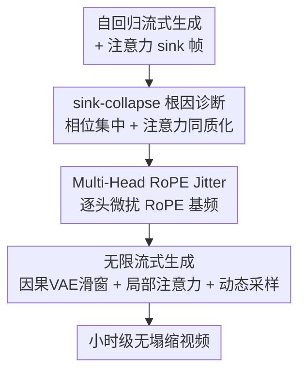

# LoL: Longer than Longer, Scaling Video Generation to Hour

**会议**: CVPR 2026  
**论文**: [CVF Open Access](https://openaccess.thecvf.com/content/CVPR2026/html/Cui_LoL_Longer_than_Longer_Scaling_Video_Generation_to_Hour_CVPR_2026_paper.html)  
**代码**: 待确认  
**领域**: 视频生成 / 扩散模型  
**关键词**: 自回归长视频、注意力 sink、RoPE、sink-collapse、流式生成

## 一句话总结
针对自回归超长视频生成中"画面突然倒退回开头几帧"的 sink-collapse 现象，本文先把它的根因定位到 RoPE 周期性导致的"多维相位同步 + 多头注意力同质化"，再用一个**免训练**的 Multi-Head RoPE Jitter（逐头微扰 RoPE 基频）打散这种同步，配合因果 VAE 滑窗解码，首次实现实时、流式、近乎无质量衰减的**无限长**视频生成（演示出 12 小时连续视频）。

## 研究背景与动机

**领域现状**：长视频生成正从双向（bidirectional）扩散模型转向自回归模型——后者逐帧地基于已生成内容预测下一帧，能支持远更长的时间建模。为了在长序列上保持稳定，LongLive、Self-Forcing++、Rolling-Forcing 等 SOTA 方法借鉴了 LLM 里的 **attention sink** 思路（源自 StreamingLLM）：把开头几帧（sink frames）永久保留在 KV cache 里不被滚动淘汰，用来锚定全局对齐与稳定性。

**现有痛点**：作者发现这些用了 attention sink 的方法存在一个共性致命缺陷，称为 **sink-collapse**——生成内容会**周期性地、突然地倒退回 sink 帧**，造成场景突变重置、画面循环往复。更诡异的是，LongLive 和 Self-Forcing++ 都在**完全相同的隐空间帧索引（132、201）**处塌缩，与输入噪声、prompt 都无关，而且越往后塌缩点越多。

**核心矛盾**：双向模型里也有重复现象，RIFLEx 把它归因于"某一个特定的时间维度"并通过改那一维的频率来解决；但作者证明这套办法在自回归设定下完全失效——sink-collapse 不是单一维度造成的。根本原因在 RoPE 的**周期性三角函数**：短上下文里旋转能保住相对相位差，但长程下周期性会让相位重新对齐（phase aliasing），多个相隔很远的帧因此共享几乎相同的位置嵌入，注意力机制就会过度强调这些 sink 位置。

**切入角度**：作者从两个互补的观察切入。其一，把所有时间维度的相位对齐情况加起来看，塌缩点恰好落在**相位集中度的局部极大值**上——说明是"所有维度合力"而非单一维度；其二，把多头注意力的热力图拆开看，塌缩发生时**几乎所有注意力头同时**给 sink 帧分配了极高权重，即多头的"表征多样性"瞬间退化、各子空间齐刷刷去拷贝 sink 帧。

**核心 idea**：既然塌缩源于所有头的相位"齐步走"，那就**故意让不同注意力头的 RoPE 基频各自错开一点**，打散这种全局同步——一个无需重训、几行代码的扰动，就能从根上抑制 sink-collapse。

## 方法详解

### 整体框架
LoL 的逻辑是"先诊断、再下药、最后撑长度"：在已有的自回归流式生成 + attention sink 框架之上，先把 sink-collapse 的根因（相位集中 + 注意力同质化）分析清楚，据此提出 Multi-Head RoPE Jitter 这一免训练修正，最后利用现有架构的因果 VAE 与局部注意力两个固有性质，把生成长度从分钟级推到无限。整套方法不动模型权重、不改训练，纯推理期介入。

### 关键设计

**1. sink-collapse 根因诊断：相位集中 + 注意力同质化**

这是全文的立论基石，也是"为什么 RIFLEx 那套不管用"的答案。RIFLEx 在双向模型里认为重复由某一个内禀频率维度主导，于是去改那一维；但在自回归设定下，作者用两组证据证明这是错的。第一组是**相位集中（intra-head phase concentration）**：给定 RoPE 频率 $\omega_i = \theta_0^{-2i/d}$（$i=1,\dots,K$，$K=d/2$），定义相位相干核 $C(\Delta) = \left|\frac{1}{K}\sum_{i=1}^{K} e^{j\omega_i \Delta}\right|$，再把生成帧 $g$ 对 sink 帧 $s$ 的相位集中度写成 $R_{\text{sink}}(g)=C(g-s)$。$R_{\text{sink}}$ 大意味着多个 RoPE 频率分量同时与 sink 帧相位对齐（phase synchronization），实验显示 sink-collapse 几乎精确地发生在 $R_{\text{sink}}$ 取局部极大值处——是所有维度合力，不是单一维度。作者还反向验证：单独改 RIFLEx 选出的那一维（它预测重复帧 132 对应的最近频率分量周期是 118，与实际偏差很大），甚至单独扰动任意一维，都救不了塌缩。

第二组是**注意力同质化（inter-head attention homogenization）**：现代 Transformer 靠多头注意力在不同子空间捕捉多样表征。正常帧里，模型主要把自注意力权重给"正在生成的最近几帧"，其余均匀分散；但塌缩帧里，**同一层里几乎所有注意力头同时**给 sink 帧和当前帧都压上极大权重，等于在所有子空间里一起把 sink 帧"复制"过来，于是画面猛地切回开头。两条发现合起来给出一个清晰的攻击面：塌缩 = 多维相位同步触发 + 多头集体同质化，那就破坏"多头一起对齐"这件事。

**2. Multi-Head RoPE Jitter：逐头微扰基频打散同步**

既然塌缩需要"所有头的相位齐步走"，LoL 就让每个注意力头用**略微不同的 RoPE 基频**。具体见 Algorithm 1：标准 RoPE 基频是 $\theta_0$（通常 10000），对第 $h$ 个头采样扰动 $\epsilon_h \sim \mathcal{U}[-1,1]$，得到该头的基频 $\hat\theta_h = \theta_0(1+\sigma_\theta \epsilon_h)$，再据此算出该头自己的频率向量 $\omega_h = [\hat\theta_h^{\nu_0}, \dots, \hat\theta_h^{\nu_{D/2-1}}]$（$\nu_i=-2i/d_{\text{time}}$）并完成旋转。$\sigma_\theta$ 是唯一的抖动强度超参。

它有效，是因为 RoPE 的周期性意味着相位对齐高度依赖基频：每个头基频被错开一点，它们的相位极大值就不再落在同一帧上，"多头同时高度集中于 sink 帧"这一塌缩触发条件就被打破了。这和改全局基频 $\theta$ 有本质区别——后者只是把塌缩点沿时间轴平移（见消融），而逐头错频是直接消除"同步"本身。整个操作免训练、零额外参数、几乎零开销，却能把根因端掉。消融显示 $\sigma_\theta=0.1$ 太小仍塌缩、$0.5$ 在约 750 帧处仍现塌缩、$0.8$ 时帧间平滑过渡无明显跌落，是质量与抑制塌缩的最佳平衡点；抖动的头越多抑制越好，抖动全部头效果最佳——这也反过来印证"塌缩不源于单个头"。

**3. 无限流式生成：因果 VAE 滑窗 + 局部注意力 + 动态采样**

抑制了塌缩还不够：超长生成还受限于 RoPE 序列长度和 VAE 解码显存——LongLive、Self-Forcing++ 的上限就是 4 分 15 秒（1024 隐空间帧）。LoL 指出现有架构其实自带两条"可无限延展"的性质即可解套。其一，底座 Wan-2.1 用的是 **3D 因果 VAE**，保证时间因果性，因此可以滑动窗口解码，显存与计算大幅下降；其二，这些模型本就对最近 $N$ 个隐空间帧做**局部注意力**，而由式 $\langle q'_m, k'_n\rangle = \langle q_m, R(n-m)k_n\rangle$ 可知注意力分数只依赖相对位置差。于是在塌缩被消除后，初始噪声与 RoPE 都可以**动态流式采样**（streaming RoPE generation + noise sampling），相比预先生成全部位置嵌入只增加极小开销，模型便能在固定显存下持续吐帧，理论上无限长——演示中跑出了 12 小时连续视频，仅用 1.3B 模型 + KV cache、单张 H100 上 20 fps。

### 损失函数 / 训练策略
LoL 本身**不引入任何训练或损失**，是纯推理期、免训练（training-free）的即插即用修正。底座模型（LongLive / Self-Forcing++）沿用其原有的扩展版分布匹配蒸馏（extended DMD，对自生成长序列计算反向 KL，见原文式 (1)），LoL 只在注意力的 RoPE 旋转环节插入逐头基频抖动。推理配置：局部注意力窗口 12、sink 帧 3、标准 RoPE 基频 10000、$\sigma_\theta=0.8$、抖动全部头。

## 实验关键数据

### 主实验
评测把 LoL 作用于 LongLive 与 Self-Forcing++ 两个底座，对比一众位置嵌入扩展法：PE（直接外推）、PI（插值）、NTK、YaRN、RIFLEx。塌缩用 No-Repeat 改造的 **Sink-Collapse Max/Avg**（对 sink 帧的归一化 L2 距离跌幅，越低越好，分别取最坏 prompt 与全 prompt 平均），质量用 VBench（Dynamic Degree 等，越高越好）。100 秒视频结果（节选 LongLive 与 Self-Forcing++ 两组关键列）：

| 底座 | 方法 | SC-Max ↓ | SC-Avg ↓ | Dynamic Degree ↑ | Imaging Quality ↑ |
|------|------|---------|---------|------------------|-------------------|
| LongLive | PE（外推基线） | 73.06 | 30.54 | 34.62 | 69.59 |
| LongLive | PI（插值） | **4.97** | **2.27** | 0.35（运动几乎静止） | 56.47 |
| LongLive | NTK | 41.11 | 11.64 | 28.72 | 69.83 |
| LongLive | YaRN | 11.17 | 5.08 | 2.67（运动塌） | 68.89 |
| LongLive | RIFLEx | 70.95 | 29.93 | 35.11 | 69.47 |
| LongLive | **Ours (LoL)** | 16.67 | 3.93 | **35.27** | 69.45 |
| Self-Forcing++ | PE | 68.07 | 34.11 | 83.32 | 63.06 |
| Self-Forcing++ | PI | 17.07 | 2.62 | 1.95（运动塌） | 69.80 |
| Self-Forcing++ | **Ours (LoL)** | 22.70 | 6.12 | **81.20** | 62.92 |

核心结论：PI/YaRN 能压住塌缩（SC 很低）但代价是**运动几乎冻结**（Dynamic 掉到 0.35/2.67/1.95）；NTK/RIFLEx 保住了运动但**几乎压不住塌缩**（SC 仍 41~71）。只有 LoL 同时拿到两边的好处——把 SC 压到接近 PI 的水平，又把 Dynamic 保到接近甚至略超 PE 的水平。

与其它自回归模型在 75s/100s 上的横向对比（Dynamic Degree，越高越好）：

| 模型 | 75s Dynamic ↑ | 100s Dynamic ↑ | 100s Temporal Quality ↑ |
|------|---------------|----------------|--------------------------|
| Self-Forcing++ | 55.62 | 54.12 | 90.87 |
| LongLive | 35.14 | 34.62 | 88.56 |
| **Self-Forcing++ (LoL)** | **81.30** | **81.20** | **92.91** |
| **LongLive (LoL)** | 35.77 | 35.27 | 88.69 |

加上 LoL 后 Self-Forcing++ 的运动度从 ~54 跃到 81、时间质量也升到 92.91，且文本对齐、帧级质量基本持平——印证 LoL 在解决塌缩的同时几乎不牺牲生成质量。

### 消融实验
| 配置 | 结论 | 说明 |
|------|------|------|
| 只改 RIFLEx 选中的维度 / 任意单维 | 无效 | 证明塌缩非单一 RoPE 维度造成（§4.3.1） |
| 改全局 RoPE 基频 θ（6000~20000） | 仅平移塌缩点 | 塌缩索引前后挪动但不消失（§4.3.2） |
| 抖动强度 σ=0.1 / 0.5 / 0.8 | σ=0.8 最佳 | 0.1 仍严重塌缩，0.5 到 ~750 帧仍塌缩，0.8 平滑无跌落（§4.3.3） |
| 抖动头数（按比例随机，3 seed） | 越多越好，全抖最佳 | 头数越多塌缩越轻，再证非单头来源（§4.3.4） |

### 关键发现
- **运动度 vs 塌缩抑制是一对真实 trade-off**：现有 PE 扩展法只能二选一（PI 压塌缩但冻运动、NTK 保运动但不压塌缩），LoL 是少数同时占两头的方法。
- **塌缩点可复现且与 prompt 无关**（LongLive/Self-Forcing++ 都在隐索引 132、201 塌缩），强烈暗示根因是位置嵌入的结构性问题而非内容问题——这正是作者敢从 RoPE 周期性下手的依据。
- **σ 与抖动头数都是"越强越能压塌缩、但过强伤运动/质量"**，0.8 + 全头是经验甜点；隐索引 132 ≈ 528 视频帧 ≈ 33 秒（16 fps），可据此换算塌缩的物理时刻。

## 亮点与洞察
- **诊断比药方更出彩**：把一个看似玄学的"画面倒退"现象，量化成相位相干核 $C(\Delta)$ 的局部极大 + 多头注意力同质化两条可测证据，是典型的"先把病因说透、药自然就简单"。这种"周期性位置嵌入 → 长程相位 aliasing → 注意力退化"的因果链，对任何用 RoPE 的长程自回归生成都有借鉴价值。
- **修法极简且免训练**：逐头给 RoPE 基频加一个 $\mathcal{U}[-1,1]$ 抖动，几行代码、零额外参数、零重训，却直击"多头同步"这个塌缩的充要触发条件——是"打破对称性/同质化"这一思路在位置嵌入上的漂亮落地，可迁移到其它多头注意力的退化问题。
- **把"无限长"拆成可执行的工程组合**：因果 VAE 滑窗解码 + 局部注意力 + 动态流式 RoPE/噪声采样，说明只要塌缩被解决，现有架构本身就具备无限延展的潜力，12 小时演示很有冲击力。

## 局限与展望
- **作者承认**：方法免训练，但微调/重训可能进一步提升；生成质量受底座模型上限制约（依赖局部注意力 + sink 帧来保对齐稳定）；**长期记忆仍是硬伤**——多小时视频的全局一致性（人物/场景跨小时不漂移）尚未解决，是未来重点。
- **自己观察**：抖动是随机采样（$\epsilon_h\sim\mathcal{U}[-1,1]$）且 σ 需要手调（0.8 是经验值），不同底座/分辨率是否需重新搜 σ 没充分讨论；评测主要在 75~100 秒的定量表上，12 小时只是定性展示，超长时段的累积质量衰减缺乏量化曲线；Dynamic Degree 这类 VBench 指标高不完全等于"内容连贯"，长程语义漂移可能被现有指标低估。
- **改进思路**：把逐头基频从随机抖动改成可学习/可调度（按层或按时间自适应），或结合长期记忆模块（显式 KV 检索 / 世界模型状态）来补足跨小时一致性；作者也提到可探索替代位置嵌入、更强控制信号、稀疏/线性注意力以提升可控性与可扩展性。

## 相关工作与启发
- **vs RIFLEx**：两者都治"重复"，但 RIFLEx 面向**双向**模型、把重复归因于**单一**内禀时间维度并改那一维频率；LoL 证明这在**自回归**设定下失效（塌缩是全维相位合力 + 多头同质化），改为逐头错频。本文优势是真正命中自回归塌缩根因，劣势是机制更依赖经验超参 σ。
- **vs PI / NTK / YaRN（RoPE 外推/插值族）**：这些方法为延长上下文调整 RoPE 频率，但在抑制塌缩与保留运动之间只能取其一（PI/YaRN 冻运动、NTK 不压塌缩）；LoL 不做插值/外推，而是打散多头同步，兼顾两端。
- **vs LongLive / Self-Forcing++（底座）**：它们用 attention sink + 扩展 DMD 蒸馏把生成推到分钟级，但正是 sink 帧引入了塌缩、且受 RoPE 长度与 VAE 显存限制只能到 4 分多钟；LoL 作为即插即用补丁去掉塌缩并解锁无限流式，是对这一路线的关键补全。
- **vs StreamingLLM**：attention sink 的源头来自 LLM；本文揭示同一机制搬到视频自回归生成时会触发新失败模式（sink-collapse），提醒"跨模态照搬 LLM 技巧"需重新审视位置嵌入的周期性副作用。

## 评分
- 新颖性: ⭐⭐⭐⭐⭐ 首次定义并系统归因 sink-collapse，相位相干核 + 多头同质化的诊断角度新颖且有解释力。
- 实验充分度: ⭐⭐⭐⭐ 两个底座 × 五种 PE 基线 + 四组消融充分，但 12 小时超长时段只有定性展示、缺累积衰减量化曲线。
- 写作质量: ⭐⭐⭐⭐ 诊断—下药—撑长度的逻辑清晰，公式与图表支撑到位；部分符号（如 $R_{\text{sink}}$ 与图 2 的换算）需对照原文。
- 价值: ⭐⭐⭐⭐⭐ 免训练、即插即用、解锁无限流式实时长视频生成，对世界模型/实时生成方向实用价值高。

<!-- RELATED:START -->

## 相关论文

- [\[CVPR 2026\] FFP-300K: Scaling First-Frame Propagation for Generalizable Video Editing](ffp-300k_scaling_first-frame_propagation_for_generalizable_video_editing.md)
- [\[NeurIPS 2025\] Scaling RL to Long Videos](../../NeurIPS2025/video_generation/scaling_rl_to_long_videos.md)
- [\[CVPR 2025\] Towards Precise Scaling Laws for Video Diffusion Transformers](../../CVPR2025/video_generation/towards_precise_scaling_laws_for_video_diffusion_transformers.md)
- [\[CVPR 2026\] Dual-Granularity Memory for Efficient Video Generation](dual-granularity_memory_for_efficient_video_generation.md)
- [\[CVPR 2026\] MultiShotMaster: A Controllable Multi-Shot Video Generation Framework](multishotmaster_a_controllable_multi-shot_video_generation_framework.md)

<!-- RELATED:END -->
