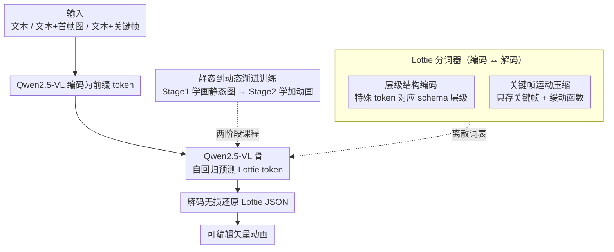

# LottieGPT: Tokenizing Vector Animation for Autoregressive Generation

**会议**: CVPR 2026  
**arXiv**: [2604.11792](https://arxiv.org/abs/2604.11792)  
**代码**: [https://lottiegpt.github.io/](https://lottiegpt.github.io/)  
**领域**: 视频生成  
**关键词**: 矢量动画, Lottie, 自回归生成, 分词器, 多模态

## 一句话总结

提出首个矢量动画自回归生成框架 LottieGPT，设计了 Lottie 分词器将层级几何体、变换和关键帧运动编码为紧凑 token 序列，构建 660K 动画数据集，基于 Qwen-VL 微调实现从文本/图像直接生成可编辑矢量动画。

## 研究背景与动机

**领域现状**：视频生成领域（Sora、Kling 等）已能生成高质量光栅视频，但所有现有生成模型均在像素空间操作，无法生成矢量动画——一种分辨率无关、可编辑、紧凑的多媒体主流形式。

**现有痛点**：矢量动画（如 UI 动效、品牌动画、After Effects 动态图形）具有像素视频无法提供的关键属性：无限分辨率、语义可操作性、参数化运动和小文件体积。现有 SVG 生成方法仅限于静态输出，缺乏时间建模能力。

**核心矛盾**：矢量动画既包含层级结构又包含时间依赖的变换逻辑，如何将其编码为适合自回归建模的 token 序列是核心挑战。此外，大规模矢量动画数据集的缺失也是主要瓶颈。

**本文目标**：(1) 设计能统一编码层级几何和时间运动的分词器；(2) 构建大规模矢量动画数据集；(3) 训练首个矢量动画生成的多模态模型。

**切入角度**：采用 Lottie 格式（广泛部署的 JSON 动画标准），利用其关键帧+缓动函数的参数化表示实现紧凑编码。

**核心 idea**：用关键帧和插值函数替代逐帧数据来 token 化矢量动画，大幅减少序列长度同时保留结构保真度。

## 方法详解

### 整体框架

LottieGPT 想解决的是「让自回归模型直接生成可编辑矢量动画」这件以前没人做成的事。难点在于矢量动画不像光栅视频那样是一串像素，而是一份带层级结构（资产→层→形状→属性）又带时间逻辑（关键帧+缓动）的 JSON。整套系统的核心是把这份 JSON 翻译成一串离散 token：先用一个 Lottie 分词器把动画编码成紧凑序列，交给 Qwen2.5-VL 骨干在文本/图像条件下自回归预测，生成的 token 再被解码器无损还原回 Lottie JSON。训练上则走「先学画静态图、再学加动画」的两阶段课程。输入端可以是纯文本、文本+首帧图、或文本+若干关键帧，输出端始终是一份可无限缩放、可在 After Effects 里继续改的矢量动画。

### 关键设计

**1. Lottie 分词器的层级结构编码：让序列保留 schema 而不是退化成纯文本**

矢量动画最怕被当成一段任意字符串硬塞给语言模型——那样模型学到的只是文本统计，丢掉了「这是一个层、层里有形状、形状有填充」的结构语义。分词器的做法是给 Lottie schema 里的每种结构边界配一个特殊 token，比如 `<|LAYER|>` 标记一层的开始、`<|ty|>` 标记类型字段，让 token 序列和 JSON 的嵌套层级一一对应。和需要把图形拆成原子绘制命令的 OmniSVG 不同，它直接把椭圆、填充、渐变、描边这些形状原语整体编码成一个语义单元。这样模型预测的不是「下一个字符」，而是「下一个结构合法的动画部件」，既好学到可复用的结构模式，也让生成结果更容易通过 JSON 合法性校验。

**2. 关键帧运动压缩：用关键帧+缓动函数替代逐帧数据**

时间维度是序列长度爆炸的根源——一个 300 帧的动画若逐帧记录每个属性，token 数会长到塞不进上下文窗口。这里抓住矢量动画的本质：运动本来就是「几个关键帧 + 它们之间的插值曲线」，没必要存中间帧。于是分词器只编码关键帧时间点 `<|t|>`、该时刻的属性值、以及连接相邻关键帧的贝塞尔缓动函数 `<|ease|>`。一个 100 帧的位移动画往往只要 6 个关键帧的 token 就够，300 帧时压缩率可达 98%。关键是缓动函数被当作一等原语显式编码，而不是隐式抹平——同样两个关键帧，配弹跳缓动和配匀速缓动会得到截然不同的运动观感，模型必须学会预测它。这一步把「动画建模」从难以承受的逐帧序列，变成了 VLM 能吃下的短序列。

**3. 静态到动态的渐进训练：先把图画对，再学让它动起来**

如果一开始就把静态图形和动画样本混在一起训练，收敛会很不稳定——动画样本的 token 数远多于静态图形，梯度会被长序列样本主导。课程策略把训练拆成两阶段：Stage 1 只学静态矢量图形（50% 文本→Lottie、50% 图像→Lottie），让模型先掌握「画出结构正确的图」这件基础能力；Stage 2 才引入时间动态，按 34% 纯文本、33% 文本+首帧、33% 文本+视频关键帧三种条件混合训练，让模型在已有的静态基础上叠加运动建模。实验也印证：先静态后动态比直接混训更稳，且静态阶段打下的结构基础反过来让动画质量更高。

### 损失函数 / 训练策略

训练目标就是标准的因果语言模型交叉熵，在多模态条件 $\mathbf{c}$ 下逐 token 预测：

$$\mathcal{L} = -\sum_{i=1}^{N} \log P(t_i \mid t_{<i}, \mathbf{c})$$

分词器本身支持无损往返——解码出来的动画与原始 Lottie 渲染完全一致，所以这套交叉熵学到的就是真实可执行的动画结构，不存在编码侧的信息损耗。

## 实验关键数据

### 主实验

| 方法 | 输入 | CLIP↑ | SSIM↑ | LPIPS↓ | DINOv2↑ | JSON↑ | 有效率 |
|------|------|-------|-------|--------|---------|-------|-------|
| OmniSVG-7B | 文本 | 0.832 | 0.563 | 0.512 | 0.727 | N/A | N/A |
| LottieGPT-7B | 文本 | **0.933** | **0.810** | **0.176** | **0.857** | 0.824 | 98.3% |
| StarVector-8B | 图像 | 0.766 | 0.385 | 0.465 | 0.529 | N/A | N/A |
| OmniSVG-7B | 图像 | 0.900 | 0.705 | 0.251 | 0.848 | N/A | N/A |
| LottieGPT-7B | 图像 | **0.945** | **0.835** | **0.154** | **0.876** | 0.843 | 98.8% |

### 消融实验

| 配置 | CLIP↑ | SSIM↑ | 有效率 |
|------|-------|-------|-------|
| 完整模型 (Stage1+2) | 0.933 | 0.810 | 98.3% |
| 仅 Stage 1 (无动画) | 0.928 | 0.805 | 97.5% |
| 无层级编码 | 0.891 | 0.752 | 92.1% |
| 逐帧编码替代关键帧 | 0.875 | 0.701 | 85.6% |

### 关键发现

- 关键帧编码对有效率的提升至关重要：逐帧编码导致序列过长，有效率从 98.3% 降至 85.6%
- 时间建模增强了静态矢量理解：LottieGPT 在 SVG 生成上也达到新 SOTA
- JSON 结构分数证明生成的 Lottie 文件具有高结构保真度

## 亮点与洞察

- 关键帧+缓动函数编码是一个优雅的设计：它既保留了动画的完整语义（运动曲线是一等原语），又实现了极高的压缩率，这个思路可推广到其他参数化表示的生成任务
- 数据集贡献巨大：660K 矢量动画 + 15M 静态矢量图形，是该领域首个大规模资源
- 将 2D 动画生成类比为 3D 动画的生产范式（先生成结构再添加动画），是一个有启发性的视角

## 局限与展望

- 仅支持 Lottie 格式，未涵盖 SVG SMIL 动画或 CSS 动画
- 复杂动画的 token 序列仍然较长，受限于 VLM 的上下文窗口
- 未评估生成动画的时间一致性和运动自然度的人类评价
- 可扩展到交互式动画编辑和条件生成

## 相关工作与启发

- **vs OmniSVG/StarVector**: 这些方法仅能生成静态 SVG，LottieGPT 首次支持时间建模和动画生成
- **vs 像素视频生成**: 像素方法生成固定分辨率、不可编辑的输出，LottieGPT 输出可无限缩放且完全可编辑

## 评分

- 新颖性: ⭐⭐⭐⭐⭐ 首个矢量动画自回归生成框架，开辟新方向
- 实验充分度: ⭐⭐⭐⭐ 提出 LottieBench，多维度评估
- 写作质量: ⭐⭐⭐⭐⭐ 动机清晰，贡献明确
- 价值: ⭐⭐⭐⭐⭐ 数据集+基准+方法的完整贡献

<!-- RELATED:START -->

## 相关论文

- [\[CVPR 2026\] OmniLottie: Generating Vector Animations via Parameterized Lottie Tokens](omnilottie_generating_vector_animations_via_parameterized_lottie_tokens.md)
- [\[CVPR 2026\] Vector Prism: Animating Vector Graphics by Stratifying Semantic Structure](vector_prism_animating_vector_graphics_by_stratifying_semantic_structure.md)
- [\[ICML 2026\] VAnim: Rendering-Aware Sparse State Modeling for Structure-Preserving Vector Animation](../../ICML2026/video_generation/vanim_rendering-aware_sparse_state_modeling_for_structure-preserving_vector_anim.md)
- [\[CVPR 2026\] STARFlow-V: End-to-End Video Generative Modeling with Autoregressive Normalizing Flows](starflow-v_end-to-end_video_generative_modeling_with_autoregressive_normalizing_.md)
- [\[CVPR 2026\] One-to-All Animation: Alignment-Free Character Animation and Image Pose Transfer](one-to-all_animation_alignment-free_character_animation_and_image_pose_transfer.md)

<!-- RELATED:END -->
