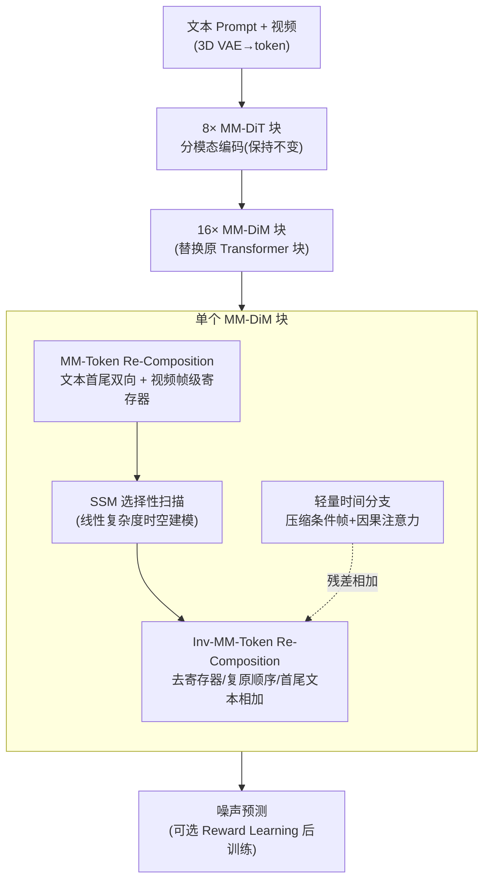

# M4V: Multimodal Mamba for Efficient Text-to-Video Generation

**会议**: CVPR 2026  
**论文**: [CVF Open Access](https://openaccess.thecvf.com/content/CVPR2026/html/Huang_M4V_Multimodal_Mamba_for_Efficient_Text-to-Video_Generation_CVPR_2026_paper.html)  
**代码**: 项目页 https://huangjch526.github.io/M4V_project/（代码待确认）  
**领域**: 视频生成 / 扩散模型 / 高效架构（Mamba）  
**关键词**: 文生视频, Mamba/状态空间模型, 多模态融合, 线性复杂度, 扩散模型

## 一句话总结
M4V 把文生视频扩散模型里二次复杂度的注意力块换成线性复杂度的 Mamba 块（MM-DiM），靠一套「多模态 token 重排」让单向扫描的 SSM 也能做文本条件融合和时空建模，在 768×1280 长视频上把混合层 FLOPs 砍掉约 45%，质量与基线 PyramidFlow 持平、迁移到 Wan2.1 后还反超原模型。

## 研究背景与动机

**领域现状**：文生视频（T2V）这两年随 Sora 爆火，主流高质量模型（Sora、Kling、HunyuanVideo、Wan2.1）几乎都建立在 Transformer 扩散架构（DiT）之上，靠堆 3D 全注意力来建模视频的时空联合分布。

**现有痛点**：注意力对序列长度是二次复杂度。视频的 token 数 = 帧数 × 每帧空间 token，本来就巨大，3D 全注意力的代价是 $O((TM)^2)$（$T$ 帧、$M$ 个空间 token）。这让训练和部署都极其昂贵，尤其在高分辨率长视频场景下几乎不可承受。

**核心矛盾**：要高质量就得建模庞大的时空空间，而能把时空联合建模做好的注意力又恰恰是复杂度爆炸的来源——画质与算力天然对立。线性复杂度的 Mamba（选择性状态空间模型）本来是天然的替代品，但它有两个硬伤：(1) 它是为**单向 1D 序列**设计的，而视频要做复杂的 2D 空间 + 时间建模；(2) 它**没有多模态交互机制**，靠隐状态串行传播信息，不像注意力有显式的 QKV，很难把文本条件喂进去。所以此前 Mamba 在文本条件视觉生成上几乎是空白，少数工作也只敢用 Mamba 处理单模态、再外挂 cross-attention 做文本控制。

**本文目标**：设计一个统一的 Mamba 块，既能做文本-视觉的多模态融合，又能把 3D 视频 latent 重排成 SSM 能顺畅处理的 1D 序列，从而在不牺牲质量的前提下用线性复杂度替换掉注意力。

**核心 idea**：不改 Mamba 本身，而是**在 SSM 前后做 token 重排**——把文本 token 放到序列首尾形成双向条件通路、给视频序列插入帧级寄存器并用 zigzag 扫描保留时空结构，再配一条轻量时间分支补长程时序，组成 MM-DiM 块整体替换 Transformer 块。

## 方法详解

### 整体框架

M4V 沿用 PyramidFlow（基于 FLUX 的多级压缩、自回归 flow-matching 视频生成）的宏观结构：文本经文本编码器、视频经 3D VAE + patchify 编成 token；前 8 个 MM-DiT 块用独立参数分别编码文本与视觉（保持不变），后续 16 个**统一 Transformer 块全部替换成本文的 MM-DiM 块**，用共享参数同时处理文本和视觉 token，最终预测噪声。整篇论文的核心就是这个 MM-DiM 块怎么设计。

一个 MM-DiM 块有两条并行支路：**主支路**先对输入 token 做 MM-Token Re-Composition（多模态 token 重排），过 SSM（含 Conv），再做 Inv-MM-Token Re-Composition 还原；**时间分支**轻量地用因果注意力补长程时序，结果残差加回主支路。时空被解耦成「2D 空间扫描（SSM 主支）+ 1D 时间处理（时间分支）」，正好契合视频沿时间维天然单向自回归的特性，不增加架构复杂度。

### 关键设计

**1. MM-Token Re-Composition：用「序列重排」让单向 SSM 同时吃下文本条件和 3D 时空结构**

这是全文的发动机，针对的就是 Mamba 两大硬伤——没有显式跨模态交互、不会处理 3D 视频。它不动 SSM 内部，而是在扫描前把序列拆成三步重排。

第一步 **文本 token 重排**：输入序列 $X=[Z, X_v]$（$Z$ 文本、$X_v$ 视觉）。把文本放到最前面、左侧补零得 $Z_l=[\varnothing, Z]$——因为隐状态 $h$ 零初始化，左侧补零保证 SSM 在真正读到文本前 $h$ 一直是零，文本作为最干净的条件先注入；再把视觉接在文本之后、从左到右扫描，实现文本对视觉的条件控制。但单向扫描只能「文本→视觉」单向传播，为了让视觉信息也能回流到文本、促成双向对齐，又把文本**复制到序列末尾**、右侧补零得 $Z_r=[Z, \varnothing]$。于是序列变成 $\hat{X}=[Z_l, \hat{X}_v, Z_r]$，仅靠 token 排布就在单向 SSM 里造出了双向多模态通路。

第二步 **视频 token 重排**：3D 张量拍平成 1D 会丢时空结构，所以空间上用 zigzag 扫描（八种扫描路径在不同层交替，让各层隐状态足够多样以捕捉丰富空间关系）；又因为 PyramidFlow 各金字塔层的条件帧数和分辨率是动态变化的，作者在帧之间插入 **Per-Frame Registers（帧级寄存器）**——三种对应不同分辨率阶段的可学习 token，用来标记「下一帧开始」和「分辨率切换」。视觉序列 $X_v=[x_0,\dots,x_i]$ 被重排为 $\hat{X}_v=[r_0, x_0, \dots, r_1, x_{i-1}, r_2]$，寄存器几乎不增算力却显著增强模型的时序感知与对齐。

第三步 **Inv-MM-Token Re-Composition**：SSM 输出 $\hat{X}'=[Z_l', \hat{X}_v', Z_r']$ 后再逆操作还原——移除帧级寄存器、复原视觉 token 原始顺序、把首尾两份文本序列对齐相加 $Z'=Z_l'+Z_r'$，恢复成下一层能用的标准结构。整套重排的巧妙在于：**它把 Mamba「缺多模态交互、缺时空感知」两个先天缺陷，全部转化成对输入序列的纯排布工程**，零额外注意力开销。

**2. 轻量时间分支：用一条便宜的因果注意力补 Mamba 的长程时序短板**

纯 Mamba 在超长上下文上仍逊于 Transformer，业界共识是「Mamba+Transformer 混合」效果最好，但已有混合多是块级重型设计（整块换注意力，很贵）。本文反其道，挂一条**与主支并行的轻量时间分支**专补长程时序。做法是把条件 latent $X_C=[x_0,\dots,x_{i-1}]$ 全部下采样到最小空间分辨率 $x_s\in\mathbb{R}^{\frac{H}{K_s}\times\frac{W}{K_s}\times c\times i}$，再把空间维压进通道维形成很短的序列 $x_s\in\mathbb{R}^{i\times S}$（$S=c\cdot\frac{H}{K_s}\cdot\frac{W}{K_s}$）；噪声 latent $x_i$ 切成 $K_s$ 个 token，与压缩条件拼接后沿时间维做因果注意力，结果 reshape 回原尺寸残差加回主支。因为只在被极度压缩的「短时间序列」上做注意力，$O(T^2)$ 的代价很小，却拿回了注意力擅长的长程时序建模——是「主支 Mamba 管效率、副支注意力管长时序」的分工。

**3. Reward Learning 后训练：在公开数据天花板下用奖励模型救质量**

公开视频数据集（WebVid-10M 等）质量有限，别人靠扩数据到上亿样本，本文改走后训练。设模型用 flow-matching 训练，在随机时间步 $t$（噪声尺度 $\sigma_t$）拿到末帧预测速度 $\hat{v}_i$，假设它近似真速度，做一步去噪得到预测干净 latent：

$$\hat{x}_1^i=\frac{1}{\sigma_e}\Big[x_t^i+\frac{\sigma_e-\sigma_t}{\sigma_e-\sigma_s}\hat{v}_i-(1-\sigma_e)x_0^i\Big]$$

解码后用奖励模型 HPSv2（$r_1$）和 CLIP（$r_2$）打分，反向回传奖励损失：

$$L_{\text{reward}}=-r_1(D(\hat{x}_1^i))-r_2(D(\hat{x}_1^i))$$

其中 $D$ 是 3D VAE 解码器。这个损失逐帧矫正不良运动、提升与 prompt 的语义贴合，在不扩数据的前提下涨语义分。

### 损失函数 / 训练策略
主损失为 flow-matching 目标；可选叠加上面的 $L_{\text{reward}}$ 做后训练。训练用渐进策略：先 384p 文生图（T2I），再从 384p 升到 768p，视频长度从 57→121→241 帧逐步拉长，图像与视频数据混训，稳定适应更长序列。Mamba 块的部分参数用预训练注意力权重初始化以加速收敛；条件帧加线性递增的噪声以稳早期训练。迁移到 Wan2.1 时，因其非自回归、无金字塔，直接把所有 self-attention 换成 MM-DiM、整段视频 latent 上算 flow-matching 和奖励损失。

## 实验关键数据

### 主实验
VBench 评测，1000 prompts、121 帧 768p、每 prompt 五个随机种子。下表对比公开数据训练的模型（粗体为公开数据组最优）：

| 模型 | 训练数据 | Total | Semantic | Aesthetic | Dynamic Degree |
|------|---------|-------|----------|-----------|----------------|
| PyramidFlow† | Public | 81.61 | 73.90 | 63.96 | 66.66 |
| **M4V (PyramidFlow)** | Public | 81.55 | 74.47 | 64.08 | 60.55 |
| Wan2.1 | Proprietary | 84.70 | 80.95 | 61.53 | 94.35 |
| **M4V\* (Wan2.1)** | Public | **86.14** | 80.45 | **67.52** | 96.70 |
| HunyuanVideo | Proprietary | 83.24 | 75.82 | 60.36 | 70.83 |

关键看点：以 PyramidFlow 为基线，M4V 的 Total Score 几乎持平（81.55 vs 81.61），但算力大降；而当 MM-DiM 块迁移到 Wan2.1 并在公开数据上微调后，M4V*(Wan2.1) 反而**超过原版 Wan2.1**（86.14 vs 84.70），且推理更快——说明 Mamba 块不只是省算力的妥协，换得好还能涨点。

效率对比（生成速度，越低越好）：

| 模型 | 视频尺寸 | 时间(s) |
|------|---------|--------|
| PyramidFlow | 768×1280×241 | 812 |
| M4V (PyramidFlow) | 768×1280×241 | 613 |
| Wan2.1 | 720×1280×81 | 1700 |
| M4V (Wan2.1) | 720×1280×81 | 1210 |

复杂度上，全注意力 $O((TM)^2)$，SSM 仅 $O(TM)$、时间分支 $O(T^2)$，因 $T\ll M$ 总体 $O(TM+T^2)$；生成 241 帧时混合层 FLOPs 从 55.44 降到 29.52 TFLOPs（约 −45%）。

### 消融实验

组件消融（Fast Evaluation Protocol，50 prompts）：

| Text | Vis | Temp | Overall-Cons | Aes-Qual | Img-Qual | Avg. |
|:---:|:---:|:---:|:---:|:---:|:---:|:---:|
| | | | 19.77 | 46.60 | 63.16 | 55.70 |
| ✓ | | | 21.23 | 45.39 | 54.83 | 53.41 |
| | ✓ | | 18.86 | 48.69 | 64.18 | 56.79 |
| ✓ | ✓ | | 21.26 | 49.82 | 63.79 | 57.10 |
| ✓ | ✓ | ✓ | **21.68** | **51.25** | **66.38** | **58.75** |

架构选型与算力（241 帧，A100）：

| 结构 | TFLOPs | 推理(s) | Avg. Score |
|------|:------:|:------:|:----------:|
| Full Attn | 55.44 | 812 | 59.84 |
| Parallel | 82.03 | 858 | 59.97 |
| Full (全 Mamba) | 26.64 | 570 | 57.10 |
| Full+Temp-Branch | 29.52 | 613 | **58.75** |

### 关键发现
- **Text 重排专提文本对齐、却小掉画质**：单加 Text，Overall-Cons 从 19.77 升到 21.23（文-视对齐增强），但 Img-Qual 从 63.16 掉到 54.83——文本侧设计会轻微挤压视觉质量，需配 Vis 补回。
- **Per-Frame Registers 全面提画质**：单加 Vis，几乎所有视频质量指标上升（Img-Qual 64.18），印证帧级寄存器帮 Mamba 抓住了时空依赖；Text+Vis 合用各项稳定超基线。
- **全 Mamba 省算力但掉点，加时间分支扳回**：Full（全 Mamba）TFLOPs 仅 26.64、远低于 Full Attn 的 55.44，但 Avg. 掉到 57.10；补上轻量时间分支后涨到 58.75，且算力（29.52）仍远低于注意力——这是全文「效率-质量」最佳点。Parallel 虽分最高（59.97）但算力最贵（82.03）、仅比全注意力高 0.09%，不划算。
- **Reward Learning + 合成数据涨语义**：单加 Reward Learning，VBench Total 从 81.55 升到 81.71、Semantic 74.47→75.27；再叠加约 8 万条 HunyuanVideo 合成运动视频，Total 进一步到 81.91、Semantic 76.10。

## 亮点与洞察
- **把架构难题降维成「排序问题」**：Mamba 不能多模态、不懂 3D，本文不去改 SSM 内核，而是用文本首尾双向放置 + 帧级寄存器 + zigzag，把这些能力全部用 token 排布「拼」出来——几乎零额外算力，思路非常省力且可迁移。
- **左侧补零 + 零初始化隐状态的小技巧**：利用 SSM「读到文本前 $h$ 恒为零」的特性保证文本条件干净注入，是对状态空间模型工作机理理解很到位的设计。
- **轻量时间分支的「压缩再注意力」**：先把条件帧空间维压进通道、变成极短时间序列再做因果注意力，用很小的 $O(T^2)$ 代价拿回注意力的长程时序优势，是混合架构里更经济的做法，可迁移到任何 SSM 视频骨干。
- **Fast Evaluation Protocol 值得借鉴**：架构消融全做满训练上千 GPU 小时不现实，作者用「20k 步 + 50 prompts + 子集指标」做相对趋势评测来指导设计选型，是大规模生成研究里务实的工程实践。
- **即插即用证明泛化**：同一 MM-DiM 块在自回归金字塔 PyramidFlow 和非自回归 Wan2.1 上都成立，后者还反超原模型，说明设计不依赖特定骨干。

## 局限性 / 可改进方向
- **绝对质量未碾压顶级闭源模型**：M4V(PyramidFlow) 只是与基线持平，人类评测里运动平滑度/语义连贯仍落后 HunyuanVideo（仅美学占优），主要瓶颈仍是公开训练数据质量。
- **前 8 个 MM-DiT 块没动**：作者明说移除其分模态参数化超出本文范围，意味着整网并非纯 Mamba，仍保留了注意力编码段，效率上限未完全释放。
- **Reward Learning 收益偏小**：VBench 仅 +0.16%，且依赖 HPSv2/CLIP 奖励模型本身的偏好与天花板；一步去噪近似真速度的假设在大噪声步是否稳健存疑。
- **效率对比不完全公平**：各模型分辨率/帧数不同，作者也承认严格公平的效率比较不可行，速度数字只能作参考。
- **可改进方向**：把前 8 个块也 Mamba 化、探索更强奖励信号或视频专用奖励模型、在更高质量数据上验证 Mamba 路线的质量上限。

## 相关工作与启发
- **vs DiT / Sora / HunyuanVideo（注意力扩散）**: 它们靠 3D 全注意力拿高保真，复杂度 $O((TM)^2)$ 难扩展；M4V 用线性 SSM 替换，长视频 FLOPs 砍约 45%，质量持平甚至迁移后反超，核心差异是「线性时序建模 + token 重排做多模态」。
- **vs PyramidFlow**: 直接基线，M4V 复用其金字塔压缩与自回归范式，只把 16 个统一 Transformer 块换成 MM-DiM；同质量下显著省算力（241 帧 812s→613s）。
- **vs 既有 Mamba 视觉生成工作（单模态 + 外挂 cross-attention）**: 之前把 Mamba 限在单模态、靠额外注意力控文本，且只在小数据集做类条件生成；M4V 用 MM-Token Re-Composition 把文本条件直接编进 SSM 序列，首次把 Mamba 推到高分辨率自由文本驱动的 T2V。
- **vs 块级混合架构（Post/Pre-half、Interleaved、Parallel）**: 这些把整块换注意力，本文证明「全 Mamba + 轻量时间分支」在效率-质量曲线上更优（Parallel 分最高但算力贵且仅 +0.09%）。

## 评分
- 新颖性: ⭐⭐⭐⭐ 首个把 Mamba 系统性推向高分辨率文本驱动 T2V，token 重排做多模态的思路新颖且优雅。
- 实验充分度: ⭐⭐⭐⭐ VBench 主结果 + 组件/架构/训练三类消融 + 人类评测 + 双骨干验证，较完整；但绝对质量未碾压、效率比较承认不完全公平。
- 写作质量: ⭐⭐⭐⭐ 动机与三步重排讲得清楚，图文配合好；部分公式排版（缓存里）需对照原文。
- 价值: ⭐⭐⭐⭐ 线性复杂度 T2V 的可行路线，对降低长视频生成成本有实际意义，MM-DiM 块即插即用可复用。

<!-- RELATED:START -->

## 相关论文

- [\[CVPR 2026\] Less is More: Data-Efficient Adaptation for Controllable Text-to-Video Generation](less_is_more_data-efficient_adaptation_for_controllable_text-to-video_generation.md)
- [\[CVPR 2026\] Thinking with Video: Video Generation as a Promising Multimodal Reasoning Paradigm](thinking_with_video_video_generation_as_a_promising_multimodal_reasoning_paradig.md)
- [\[CVPR 2026\] Archon: A Unified Multimodal Model for Holistic Digital Human Generation](archon_a_unified_multimodal_model_for_holistic_digital_human_generation.md)
- [\[CVPR 2026\] U-Mind: A Unified Framework for Real-Time Multimodal Interaction with Audiovisual Generation](u-mind_a_unified_framework_for_real-time_multimodal_interaction_with_audiovisual.md)
- [\[CVPR 2026\] AutoCut: End-to-end Advertisement Video Editing Based on Multimodal Discretization and Controllable Generation](autocut_end-to-end_advertisement_video_editing_based_on_multimodal_discretizatio.md)

<!-- RELATED:END -->
