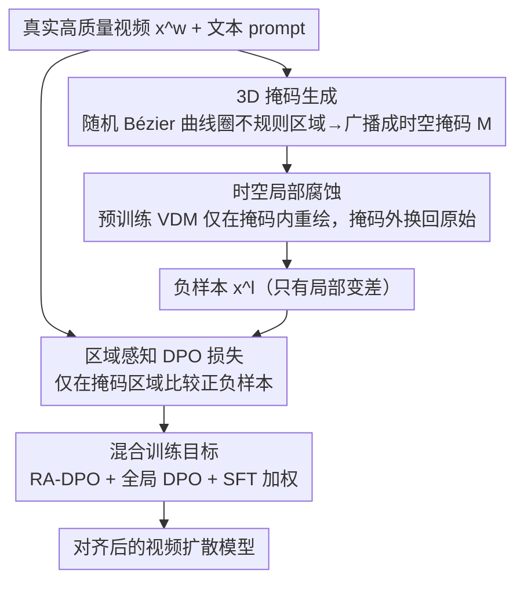

# LocalDPO: Direct Localized Detail Preference Optimization for Video Diffusion Models

**会议**: CVPR 2026  
**arXiv**: [2601.04068](https://arxiv.org/abs/2601.04068)  
**代码**: 有  
**领域**: 视频生成  
**关键词**: 视频扩散模型, DPO偏好优化, 局部腐蚀, 区域感知损失, 时空掩码

## 一句话总结
提出LocalDPO，通过对真实高质量视频进行随机时空Bézier掩码的局部腐蚀生成负样本（单次推理、无需外部排序），配合区域感知DPO损失在局部细节级别进行偏好对齐，在Wan2.1和CogVideoX上一致超越传统DPO和SFT的视频质量。

## 研究背景与动机

**领域现状**：文本到视频扩散模型(VDM)已能生成高质量视频，但常出现闪烁、运动不一致、局部伪影等问题。DPO被引入作为后训练偏好对齐策略。

**现有DPO方法的三大缺陷**：
   - **(1) 高成本低效**：需要每个prompt生成多个视频 + 人工或critic模型排序——推理和标注成本高
   - **(2) 全局评分模糊**：整体分高的视频可能在局部维度差（如整体流畅但某区域闪烁），导致监督信号模糊甚至矛盾
   - **(3) 忽略区域级偏好**：评分在全局视频级别进行，忽略了对人类感知至关重要的局部伪影和细节丰富度

**核心矛盾**：DPO需要高质量的正负样本对，但现有方法的样本对在全局级别构造→无法捕捉局部的质量差异→模型无法学会修正精细缺陷。

**切入角度**：用真实视频作正样本（质量天然高于模型生成），对其局部腐蚀作负样本（单次推理、质量保证低于正样本且仅在特定区域）。

**核心idea**：(1) 随机Bézier曲线生成时空掩码选择腐蚀区域；(2) 预训练VDM自身在掩码区域重绘（生成负样本）；(3) 区域感知DPO损失仅在掩码区域计算偏好差异。

## 方法详解

### 整体框架
LocalDPO 想解决的核心问题是：传统视频 DPO 在「整段视频」级别打分构造正负样本对，既贵又抓不住局部缺陷。它的破题点是把正样本固定为真实高质量视频 $\mathbf{x}^w$，再让模型自己在视频的某个局部区域「画坏一点」得到负样本 $\mathbf{x}^l$，最后只在那块被画坏的区域上算偏好损失。整条流水线是：给定真实视频和文本 prompt，先用随机 Bézier 曲线画出一个不规则的时空掩码 $\mathbf{M}$ 圈定要腐蚀的区域；再让预训练 VDM 只在掩码内重绘、掩码外原样保留，得到一个「只有局部变差」的负样本；训练时用区域感知 DPO 损失只在掩码区域比较正负样本，配合全局 DPO 和 SFT 做正则。整个过程对每条视频只需一次推理，不用任何外部排序模型。

### 关键设计

**1. 3D 掩码生成：用不规则形状圈出要腐蚀的局部区域**

负样本的关键是「只坏一块、坏得自然」，所以第一步要先决定坏在哪、坏成什么形状。LocalDPO 不用规整的矩形框，而是在首帧里随机采 $P$ 条三次 Bézier 曲线，首尾相连围成一个封闭轮廓，再随机旋转、平移，然后把这个 2D 轮廓沿时间轴广播成 3D 时空掩码，最后经 VAE 下采样对齐到 latent 分辨率得到最终的 $\mathbf{M}$。之所以选 Bézier 而不是矩形，是因为真实世界里的局部伪影（某个物体闪烁、某块纹理糊掉）边界本来就是不规则的，Bézier 曲线圈出的自然轮廓更接近这种形态，避免矩形留下人工痕迹——消融里 Bézier 掩码确实比矩形掩码训出的质量更好。

**2. 时空局部腐蚀：让模型在掩码内自己「画坏」生成负样本**

圈好区域后，怎么把它腐蚀成可信的负样本？做法是让预训练 VDM 自己在掩码内重绘。先把原始视频 latent $\mathbf{z}_0^{orig}$ 加噪到时间步 $k = \lceil T \times \alpha \rceil$（$\alpha$ 控制腐蚀强度），然后逐步去噪，每一步都做一次 latent fusion：

$$\mathbf{z}_{t-1} = \mathbf{M} \odot \hat{\mathbf{z}}_{t-1} + (1-\mathbf{M}) \odot \mathbf{z}_{t-1}^{orig}$$

掩码内取模型自己去噪的结果（质量必然低于真实视频），掩码外则精确换回原始内容。这里有个容易翻车的细节：每一步要把掩码外区域重新加噪到对应时间步，让掩码内外保持一致的噪声级别，否则模型看到「一半干净一半带噪」的输入会因分布不匹配而去噪失败。这样生成负样本的好处是，缺陷正好是模型当前能力的边界——它现在画不好的地方就是负样本变差的地方，训练信号天然最相关；而且随训练推进模型变强、负样本也跟着变好，形成自然的课程式难度递增。

**3. 区域感知 DPO 损失：只在掩码区域比较正负样本**

既然正负样本只在掩码内有差异、掩码外完全相同，那损失也只该在掩码内算，否则掩码外的零差异区域会稀释梯度、拖慢收敛。区域感知 DPO 损失写成：

$$\mathcal{L}_{RA\text{-}DPO} = -\mathbb{E}\left[\log\sigma\left(-\beta \cdot (1+\eta(\alpha)) \cdot \mathbb{E}_t[\Delta'_w - \Delta'_l]\right)\right]$$

其中每个样本的偏好量被掩码裁剪并按掩码面积归一化：

$$\Delta'_* = \frac{N_M}{\|\mathbf{M}\|_1}\left(\|\mathbf{M} \odot (\mathbf{y}^* - f_\theta)\|^2 - \|\mathbf{M} \odot (\mathbf{y}^* - f_{\tilde{\theta}})\|^2\right)$$

$\mathbf{M} \odot$ 把误差限制在掩码内，$\frac{N_M}{\|\mathbf{M}\|_1}$ 按掩码大小做归一化使不同面积的掩码可比。系数 $\eta(\alpha) = \frac{\alpha - \alpha_l}{\alpha_h - \alpha_l}$ 则根据腐蚀强度 $\alpha$ 动态调惩罚力度：腐蚀越重、正负差异越明显，惩罚越强。整体效果是把监督信号精准压在真正有质量差异的局部上。

**4. 混合训练目标：用全局 DPO 和 SFT 兜住整体质量**

只盯局部有个风险——模型可能过拟合掩码区域的局部模式，反而破坏全局结构。所以最终目标是三项加权：

$$\mathcal{L}_{total} = \lambda_{RA\text{-}DPO}\mathcal{L}_{RA\text{-}DPO} + \lambda_{DPO}\mathcal{L}_{DPO} + \lambda_{SFT}\mathcal{L}_{SFT}$$

区域感知 DPO 负责精准修局部细节，全局 DPO 和 SFT 当正则项保住模型的整体生成能力和全局一致性。消融里只用 RA-DPO 会「提升但不稳定」，加上全局 DPO 更好，再叠 SFT 三项互补时最稳。

### 训练策略
数据用 63K 条高质量 Pexels 视频做正样本，配 Qwen2.5-VL 生成文本标注；每条视频只跑一次推理就能产出对应负样本，不依赖任何 critic 模型或人工排序，整体 GPU 开销约为传统 DPO 的 1/4。三个损失权重 $\lambda$ 需要手工调，是当前方案里偏经验的一环。

## 实验关键数据

### 主实验（VBench评测）

| 方法 | Aesthetic Quality | Imaging Quality | HPS-v2 | PickScore | VQ | TA |
|------|:---:|:---:|:---:|:---:|:---:|:---:|
| CogVideoX-2B (基线) | 基准 | 基准 | 基准 | 基准 | 基准 | 基准 |
| + SFT | +微提升 | +微提升 | +微提升 | +微提升 | +提升 | +提升 |
| + Vanilla DPO | +提升 | +提升 | +提升 | +提升 | +提升 | +提升 |
| **+ LocalDPO** | **最优** | **最优** | **最优** | **最优** | **最优** | **最优** |

在Wan2.1上同样一致超越所有后训练方法。

### 偏好对构建效率（图1c）

| 方法 | GPU时间/对 | 外部评估需求 |
|------|-----------|-------------|
| Vanilla DPO | ~4x | 需要critic模型/人工 |
| **LocalDPO** | **~1x** | **无需** |

### 消融实验

| 配置 | 美学分 | 成像质量 | 说明 |
|------|-------|---------|------|
| 全局DPO only | 基线 | 基线 | 传统方法 |
| RA-DPO only | +但不稳定 | +但不稳定 | 缺乏正则化 |
| RA-DPO + 全局DPO | +更好 | +更好 | 互补 |
| **RA-DPO + DPO + SFT** | **最优** | **最优** | 三项互补最稳定 |
| 矩形掩码 vs Bézier掩码 | Bézier更好 | Bézier更好 | 自然边界更有效 |

### 关键发现
- LocalDPO的定性分析显示修复后的视频在**局部细节**上显著更丰富——物体纹理、面部表情、动态物体边缘更清晰
- 正负样本的质量差异是明确且一致的（真实视频>模型腐蚀版本），消除了传统DPO中排序歧义
- $\alpha$（腐蚀噪声级别）的选择影响训练信号强度——过大导致纯噪声无学习价值，过小导致差异不明显
- 混合训练目标中SFT的正则化对维持全局质量至关重要

## 亮点与洞察
- **自产负样本的创新思路**：用模型自身在局部区域的"重绘能力不足"作为负信号来源——负样本质量与模型当前能力完美匹配，信号强度自动校准。随着训练进行，模型变强→负样本质量也提高→形成自然的课程学习
- **区域级vs全局级偏好粒度的突破**：首次在视频DPO中实现区域级偏好对齐。人类对视频质量的感知确实是局部的（注意到某物体闪烁而非整体变差）
- **Bézier时空掩码的工程巧妙**：随机Bézier曲线生成的不规则封闭区域模拟了真实局部伪影的自然形态——比矩形掩码更有效
- **效率优势质变**：单次推理+无需外部评估→GPU时间降至传统DPO的1/4，使偏好对齐在资源受限环境下也可行

## 局限与展望
- Bézier掩码的位置和大小是随机的——能否基于模型当前的弱点"智能选择"最有价值的腐蚀区域？
- latent space corruption可能不精确对应像素空间的感知退化——VAE的解码误差可能引入假阳性
- 当前仅在text-to-video验证，image-to-video和video-to-video的适用性待探索
- 混合损失的三个 $\lambda$ 权重需要手工调参

## 相关工作与启发
- **vs Vanilla Video DPO**: 需多次采样+全局评分→成本高+信号模糊。LocalDPO单次推理+局部信号→高效+精准
- **vs Diffusion DPO (image)**: 图像DPO也存在全局评分问题，LocalDPO的区域感知思想可直接迁移
- **vs SFT**: SFT平等对待所有训练样本，无法学习相对质量差异。DPO通过正负对显式学习偏好方向
- **vs InstructPix2Pix等编辑方法**: 它们修改内容语义，LocalDPO仅优化生成质量——互补的优化维度

## 评分
- 新颖性: ⭐⭐⭐⭐⭐ 局部腐蚀生成高置信负样本+区域感知DPO损失的思路优雅且有效
- 实验充分度: ⭐⭐⭐⭐ Wan2.1和CogVideoX双验证+充分消融
- 写作质量: ⭐⭐⭐⭐⭐ 动机分析(三大缺陷)清晰有力，方法pipeline直观
- 价值: ⭐⭐⭐⭐⭐ 通用的视频质量偏好对齐方案，效率和效果双优

<!-- RELATED:START -->

## 相关论文

- [\[CVPR 2026\] DynamicsBoost: Dynamic Plausible Video Generation via Annotation-Free Continuation Preference Optimization](dynamicsboost_dynamic_plausible_video_generation_via_annotation-free_continuatio.md)
- [\[NeurIPS 2025\] DenseDPO: Fine-Grained Temporal Preference Optimization for Video Diffusion Models](../../NeurIPS2025/video_generation/densedpo_finegrained_temporal_preference_optimization_for_vi.md)
- [\[CVPR 2026\] Goal-Driven Reward by Video Diffusion Models for Reinforcement Learning](goal-driven_reward_by_video_diffusion_models_for_reinforcement_learning.md)
- [\[CVPR 2026\] Diff4Splat: Repurposing Video Diffusion Models for Dynamic Scene Generation](diff4splat_controllable_4d_scene_generation_with_latent_dynamic_reconstruction_m.md)
- [\[CVPR 2026\] MotionEnhancer: Leveraging Video Diffusion for Motion-Enhanced Vision-Language Models](motionenhancer_leveraging_video_diffusion_for_motion-enhanced_vision-language_mo.md)

<!-- RELATED:END -->
