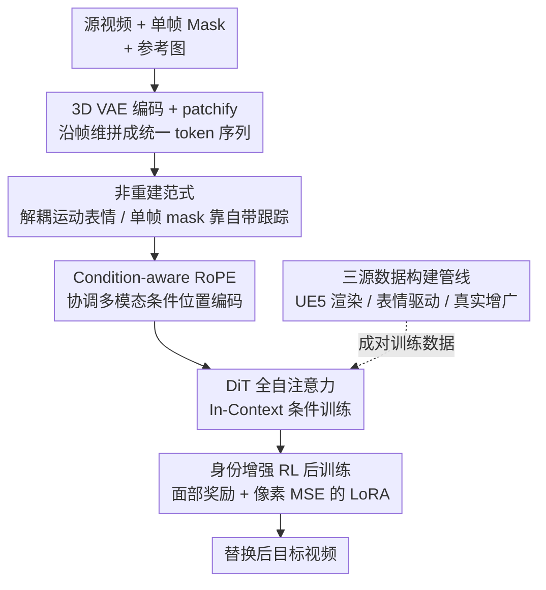

# MoCha: End-to-End Video Character Replacement without Structural Guidance

**会议**: CVPR 2026  
**论文**: [CVF Open Access](https://openaccess.thecvf.com/content/CVPR2026/html/Xu_MoCha_End-to-End_Video_Character_Replacement_without_Structural_Guidance_CVPR_2026_paper.html)  
**领域**: 视频生成 / 视频编辑  
**关键词**: 视频角色替换、视频扩散模型、in-context 条件训练、condition-aware RoPE、RL 后训练

## 一句话总结
MoCha 把视频角色替换从"逐帧 mask + 骨架/深度结构引导的重建范式"换成端到端的非重建范式：只给一张任意单帧 mask、不给任何结构引导，靠视频扩散模型自带的跟踪能力把源角色的运动与表情迁移到参考身份上，再用 condition-aware RoPE 融合多模态条件、RL 后训练强化面部一致性，在合成与真实 benchmark 上全面超过 VACE / HunyuanCustom / Wan-Animate。

## 研究背景与动机
**领域现状**：视频角色替换（在保留原背景、场景动态和角色运动的前提下，把视频里的人换成用户给定的新身份）有很强的商业价值——影视后期、个性化广告、虚拟试穿、数字人。目前主流做法是**重建范式（reconstruction-based）**：先对源视频做**逐帧分割 mask** 标注角色位置并抹掉原 ID，再抽出**骨架 / 深度图**这类显式结构引导，连同参考图一起喂给扩散模型，把视频"重建"出来。代表工作有 HunyuanCustom、VACE、Wan-Animate。

**现有痛点**：这套范式在简单场景效果不错，但在复杂场景里崩得很厉害。遮挡、罕见姿态（如杂技）、多角色物理接触这些情况下，逐帧 mask 和结构信息本身就容易抽错，错误又会在生成过程中被**逐帧传播和放大**，最终产生明显的视觉伪影、运动不连续和时序闪烁。而且重建范式严重依赖原视频被抹掉的信息，导致它**学不到精确的光照和阴影**——因为重建时原视频的光影信息已经丢了一大半。此外，逐帧密集引导本身计算开销也大。

**核心矛盾**：重建范式为了"控制角色运动"而依赖密集显式引导，但这种引导既脆弱（抽错就传播）又有损（丢失原视频光影信息）。引导越密集，越受制于引导的质量上限。

**本文目标**：能不能不要逐帧 mask、不要任何结构引导，只用**一张任意单帧 mask** 就完成角色替换，同时保住运动、表情、背景动态和光照？

**切入角度**：作者注意到，最近研究发现视频扩散模型本身就具备**时序感知和隐式推理能力**，尤其是**视频跟踪**——给一帧目标位置，模型能在整段视频里自己追踪这个主体。既然模型自带跟踪能力，那逐帧 mask 就是冗余的。

**核心 idea**：把角色的"运动 + 表情"和"背景场景"**解耦**，通过 in-context 条件训练，让模型把这套动态迁移到新参考身份上；用模型自带的跟踪能力替代逐帧 mask，只需单帧 mask、零结构引导。

## 方法详解

### 整体框架
MoCha 基于一个预训练的文生视频潜空间扩散模型（Wan-2.1-T2V-14B），用 Rectified Flow 框架训练。输入是源视频 $V_s$、一张指定帧的 mask $M$、一组参考角色图 $\{I_i\}$；输出是把角色换成参考身份、但保留原运动/背景/光照的目标视频 $V_t$。整条管线分两个训练阶段：**(a) In-Context 条件训练**——把所有条件 token 沿帧维度拼成一条统一序列喂进 DiT，用 condition-aware RoPE 协调各条件的位置编码；**(b) 身份增强 RL 后训练**——用一个可微的面部奖励 + 像素 MSE 的 LoRA 后训练，专门把面部身份一致性拉上去。背后还有一条三源数据构建管线，专门解决"成对训练数据几乎不存在"的问题。

### 关键设计

**1. 非重建范式：靠扩散模型自带跟踪甩掉逐帧 mask 和结构引导**

这一条直接针对重建范式"密集引导脆弱又有损"的痛点。重建范式要逐帧 mask + 骨架/深度，MoCha 反过来只要**一张任意单帧 mask、零结构引导**。它的底气来自一个观察：视频扩散模型在做时序建模时，会在 mask latent 和源视频 latent 之间自发形成跨帧的注意力对应——也就是模型自己会"追踪"被 mask 标注的那个角色。论文用注意力可视化验证了这点：给定单帧 mask，对应角色的区域在不同帧上始终保持高注意力分数，相当于免费得到了一条跟踪轨迹。于是它把任务重新表述为：解耦源角色的运动与面部表情、再把这套动态迁移到新身份上，整个过程通过把视频内容、帧 mask、参考身份一起做 in-context 训练来隐式学习，而不是显式重建。好处是既绕开了 mask/结构抽错被放大的问题，也保留了源视频的完整光影信息（重建范式恰恰会丢这部分）。

**2. In-Context 条件训练 + Condition-aware RoPE：让多模态条件在一条序列里和谐共存**

MoCha 把目标、源、mask、参考都先用 3D VAE 编码做时空压缩，再 patchify 成 visual token，然后沿帧维度拼成一条统一序列 $x = [x_t, x_s, x_m, x_{I_1}, x_{I_2}, ...]$，序列长度为 $b\times(2f+1+j)\times c\times h\times w$（$j$ 是参考图数量），整条序列丢进 DiT 做**全自注意力**联合处理。这种 in-context 做法的好处是不用改 DiT 结构就能接多模态条件。但有个坑：如果朴素地给每个条件分配一个不同的时间索引，会导致生成被**绑死成固定输出长度**等不灵活的行为。为此作者提出 **condition-aware RoPE**——对 3D RoPE 的扩展：源视频 token $x_s$ 和目标视频 token $x_t$ 因为有逐帧对应关系，被赋予**相同的帧索引** $0$ 到 $f-1$；参考图 token 被赋予固定帧索引 $-1$，不同参考图之间用 height/width 维度的偏移区分；mask token 的帧索引则是**可变的**，按指定帧号 $F$ 计算：

$$f_M = (F - 1)\,//\,4 + 1$$

正是这个可变 $f_M$ 让 MoCha 支持**任意帧 mask 选择**（而不是只能用第一帧），同时整套设计还解锁了可变生成长度和灵活的多参考图输入。

**3. 身份增强 RL 后训练：用可微面部奖励 + 防作弊 MSE 把脸做像**

In-context 训练后，生成视频的面部和参考身份还是会有不一致。作者借鉴扩散模型用 RL 对齐人类偏好的思路，加一个 RL 后训练阶段专攻面部一致性。核心是一个**面部奖励** $R_{face}$：用 Arcface 提取生成视频和参考图的人脸嵌入，取两者余弦相似度。但单用面部奖励有 reward hacking 风险——模型可能直接把参考图"贴"到生成视频里。为此再加一项生成视频和 GT 视频之间的**逐像素 MSE** 提供密集监督，约束模型不能靠复制粘贴刷分。总损失为：

$$L_{RL} = (1 - R_{face}) + \|V_t - \hat{V}_t\|^2$$

由于细粒度细节主要在采样过程的**后期 timestep** 才合成，论文只对最后 $K$ 个采样步反传梯度，省显存也加速。后训练用 LoRA（rank 64，加在 DiT 所有线性层）而非全量微调，避免奖励破坏基模型的生成能力。

**4. 三源成对数据构建管线：造出几乎不存在的"同动作不同身份"成对视频**

训练 MoCha 需要严格对齐的成对视频——同一段运动/表情/背景下，角色被换掉、其余全保持。现实里几乎拿不到这种数据，所以作者自己造，聚合三个来源。(I) **UE5 渲染数据**：用虚幻引擎 5 随机组合 3D 场景/角色/动作/表情批量渲染，对每段视频换角色、其余参数全锁死，得到天然成对的视频 + 角色 mask + 多姿态多光照的参考图，还自动生成自然的相机轨迹。(II) **表情驱动人脸动画数据**：收集大量影视图像，用 Flux inpainting 换前景角色，再用 LivePortrait 让原图和换脸图被**同一段面部驱动视频**驱动，得到成对动画；关键是为防 copy-paste，参考图不直接用驱动视频的原帧，而是用 Flux Kontext 增广其姿态，**逼模型把身份和空间位置解耦**。(III) **真实视频-mask 增广数据**：引入 VIVID-10M、VPData 两个公开 video-mask 数据集，用 YOLOv12 过滤掉非人类视频，参考图同样做姿态增广——这部分专门补"合成数据缺真实感"的短板。最终各取 70K / 20K / 10K，共 100K 样本。

### 损失函数 / 训练策略
基模型 Wan-2.1-T2V-14B。In-context 阶段微调全部自注意力层，8×H20 训 30K 步，lr=2e-5，batch=8；后训练用 rank 64 LoRA 训 500 步，同样 batch=8、lr=2e-5。训练用 50% 概率加一张 face-centric 参考图的 stochastic reference-dropout（提升参考线索稀缺时的鲁棒性 + 学细粒度面部细节）；并采用 short→long 课程：先用 21 帧短片段训稳，再加长到 81 帧。分辨率统一 480×832。

## 实验关键数据

### 主实验
合成 benchmark（UE5 构建、完美成对、训练数据中未出现的场景/角色/动作/表情），用 SSIM / LPIPS / PSNR 评估。Kling 因不支持批量自动化测试被排除在定量对比外。

| 方法 | SSIM↑ | LPIPS↓ | PSNR↑ |
|------|-------|--------|-------|
| VACE | 0.572 | 0.253 | 17.10 |
| HunyuanCustom | 0.644 | 0.257 | 17.70 |
| Wan-Animate | 0.692 | 0.213 | 19.20 |
| **MoCha** | **0.746** | **0.152** | **23.09** |

真实 benchmark（100 个含多人交互、快速运动、复杂光照的视频，用 SAM2 生成随机单帧 mask），用 VBench 六个维度评估：

| 方法 | 主体一致性↑ | 背景一致性↑ | 美学质量↑ | 成像质量↑ | 时序闪烁↑ | 运动平滑↑ |
|------|------------|------------|----------|----------|----------|----------|
| VACE | 71.19 | 77.89 | 56.76 | 60.88 | 97.04 | 97.87 |
| HunyuanCustom | 90.03 | 93.68 | 56.77 | 58.92 | 97.98 | 98.62 |
| Wan-Animate | 91.25 | 93.42 | 54.60 | 58.48 | 97.27 | 98.25 |
| **MoCha** | **92.25** | **94.40** | **60.24** | 59.58 | **97.98** | **98.79** |

MoCha 在合成 benchmark 三项指标全面领先（PSNR 比次优 Wan-Animate 高近 4 dB，LPIPS 几乎砍半）；真实 benchmark 六项里五项第一，仅成像质量略低于 VACE。

### 消融实验
论文主要做了两组定性消融（图示对比，无独立数值表）：

| 配置 | 关键观察 | 说明 |
|------|---------|------|
| Full model | 真实感 + 面部保真最佳 | 完整模型 |
| w/o 真实人类数据 | 出现过度平滑/油光的合成伪影、面部贴合度下降 | 去掉表情驱动 + 真实增广数据，仅留 UE5 渲染数据 |
| w/o RL 后训练（LoRA） | 面部身份一致性明显变差 | 去掉身份增强后训练 |

### 关键发现
- **真实人类数据是去合成感的关键**：UE5 渲染数据虽对齐严格、是训练基石，但单靠它会带来"过度平滑、油光"的合成质感；加入表情驱动数据和真实增广数据后，面部表情更贴合源角色、整体真实度显著提升。
- **RL 后训练专治面部不一致**：in-context 训练后面部 ID 仍有偏差，挂上 reward LoRA 后面部身份保持明显改善，且不损伤基模型的生成质量。
- **跟踪能力可验证**：mask latent 与源视频 latent 的注意力可视化显示，被选角色区域跨帧始终高注意力——证明"单帧 mask 够用"不是玄学，而是模型确实在自追踪。
- **零样本外溢能力**：虽然为角色替换设计，MoCha 还能替换非人类主体，配合图像编辑模型可直接做换脸、虚拟试穿。

## 亮点与洞察
- **把"逐帧 mask"重新定性为冗余**：核心洞察是视频扩散模型已经内含跟踪能力，于是密集 mask 从"必需品"变成"可省的拐杖"——这个视角转换是整篇论文的支点，且用注意力可视化坐实了，不是空喊。
- **condition-aware RoPE 用一个 $f_M$ 公式解锁"任意帧 mask"**：让 mask 帧索引随指定帧号可变，而源/目标共享帧索引、参考图固定 $-1$，一套位置编码同时搞定可变长度、多参考图、任意帧选择，工程上很干净。
- **防 reward hacking 的双保险很务实**：面部奖励容易诱导"贴图作弊"，配一项像素 MSE 做密集监督正好堵住；同时只在后期 K 步反传，兼顾显存和"细节在后期才生成"的扩散先验。
- **造数据的解耦 trick 可迁移**：用 Flux Kontext 增广参考图姿态、逼模型把身份从空间位置解耦，这招对任何"参考图来自视频帧、易 copy-paste"的任务都通用。

## 局限与展望
- **强依赖自造合成数据**：100K 训练样本里 70K 是 UE5 渲染，合成-真实域差距靠 30K 真实数据弥补，渲染资产库的覆盖面直接决定泛化边界；真实极端场景（如剧烈遮挡 + 复杂光照叠加）是否够还存疑。
- **消融偏定性**：真实数据和 RL 后训练的消融只给了图示对比，缺独立的定量消融表，难以量化各部分到底贡献多少点。
- **跟踪能力的失效边界没探**：单帧 mask 靠自追踪在多角色、外观相近、长时遮挡下是否会跟丢，论文未系统给出失败案例分析。
- **后训练只攻面部**：奖励只针对面部一致性，身体/服饰一致性、手部等仍靠 in-context 阶段，未单独强化。

## 相关工作与启发
- **vs 重建范式（HunyuanCustom / VACE / Wan-Animate）**：他们靠逐帧 mask + 骨架/深度结构引导在 masked 区域重建角色，MoCha 用单帧 mask + 零结构引导的非重建范式。区别在于前者依赖密集显式引导（脆弱、丢光影信息），MoCha 用模型自带跟踪 + in-context 迁移，因此在遮挡/罕见姿态/复杂光照下更鲁棒、能保住原光影，但代价是需要自造大规模成对数据。
- **vs Kling（商业产品）**：Kling 支持在线角色替换且能保参考身份，但难保原运动、难自然融入源场景；MoCha 在身份与运动一致性上都更强（不过 Kling 不支持批量测试，未进定量表）。
- **vs in-context 条件训练系工作（Recammaster / FullDiT）**：它们把相机轨迹/深度等条件沿时间维拼接做可控生成，MoCha 沿用这一范式但针对角色替换设计了 condition-aware RoPE 来协调"源-目标-mask-多参考"的异构位置关系。

## 评分
- 新颖性: ⭐⭐⭐⭐⭐ 把角色替换从重建范式翻转到非重建范式、用扩散模型自带跟踪甩掉逐帧 mask 和结构引导，视角转换干净且被注意力可视化验证。
- 实验充分度: ⭐⭐⭐⭐ 合成 + 真实双 benchmark、多指标全面领先，但消融偏定性、缺数值消融表与失败案例分析。
- 写作质量: ⭐⭐⭐⭐ 动机—方法—数据—实验逻辑清晰，公式和 pipeline 交代到位；个别核心指标（$f_M$ 推导直觉）可再展开。
- 价值: ⭐⭐⭐⭐⭐ 影视后期/虚拟试穿/数字人需求明确，端到端简化流程 + 承诺开源数据集，落地与复现价值高。

<!-- RELATED:START -->

## 相关论文

- [\[CVPR 2026\] STARFlow-V: End-to-End Video Generative Modeling with Autoregressive Normalizing Flows](starflow-v_end-to-end_video_generative_modeling_with_autoregressive_normalizing_.md)
- [\[CVPR 2026\] AutoCut: End-to-end Advertisement Video Editing Based on Multimodal Discretization and Controllable Generation](autocut_end-to-end_advertisement_video_editing_based_on_multimodal_discretizatio.md)
- [\[CVPR 2026\] Gloria: Consistent Character Video Generation via Content Anchors](gloria_consistent_character_video_generation_via_content_anchors.md)
- [\[CVPR 2026\] FlowPortal: Residual-Corrected Flow for Training-Free Video Relighting and Background Replacement](flowportal_residual-corrected_flow_for_training-free_video_relighting_and_backgr.md)
- [\[CVPR 2026\] One-to-All Animation: Alignment-Free Character Animation and Image Pose Transfer](one-to-all_animation_alignment-free_character_animation_and_image_pose_transfer.md)

<!-- RELATED:END -->
