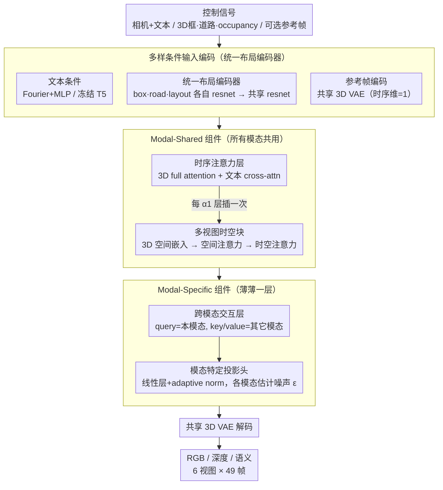

# MoVieDrive: Urban Scene Synthesis with Multi-Modal Multi-View Video Diffusion Transformer

**会议**: CVPR 2026  
**arXiv**: [2508.14327](https://arxiv.org/abs/2508.14327)  
**代码**: 无  
**领域**: 视频生成  
**关键词**: 多模态视频生成, 多视图一致性, 扩散Transformer, 城市场景合成, 自动驾驶数据增强

## 一句话总结

MoVieDrive 提出统一的多模态多视图视频扩散 Transformer，通过 modal-shared + modal-specific 的双层架构设计，在单一模型中同时生成 RGB 视频、深度图和语义图，配合多样的条件输入（文本、布局、上下文参考），在 nuScenes 上取得 FVD 46.8（SOTA），同时实现跨模态一致的高质量驾驶场景合成。

## 研究背景与动机

**领域现状**：视频生成模型（SVD、CogVideoX）在通用视频生成上表现优异，但直接用于自动驾驶场景需要多视图时空一致性和高可控性。DriveDreamer、MagicDrive 等方法已探索多视图城市场景生成，但仅支持 RGB 单模态。

**核心痛点**：自动驾驶不仅需要 RGB 视频，还需要深度图和语义图来全面理解场景。现有方案用**多个独立模型**分别生成不同模态，导致：(a) 部署复杂度高；(b) 无法利用跨模态互补信息提升生成质量；(c) 模态间一致性无法保证。

**UniScene 的局限**：UniScene 尝试同时生成 RGB 和 LiDAR，但仍然使用多个独立模型，未构建真正统一的多模态生成框架。

**核心假设**：不同模态（RGB、深度、语义）经过共享的 3D VAE 编码后共享公共隐空间，仅需少量模态特定组件区分它们——因此可以用一个统一模型完成多模态生成。

## 方法详解

### 整体框架

MoVieDrive 要解决的是一件以往得靠"拼模型"才能做到的事：在自动驾驶场景里，用**一个**扩散模型同时吐出 RGB 视频、深度图和语义图，而且 6 个相机视图之间、相邻帧之间都要对得上。整条管线先把各类控制信号（相机参数与文本描述、3D 框/道路/occupancy 投影出来的布局图、可选的初始参考帧）编码成条件特征，再送进一个统一的扩散 Transformer 去噪，最后由一个所有模态共享的 3D VAE 把去噪后的 latent 解码成多模态多视图视频。

这个统一 Transformer 的内部按"哪些东西所有模态都该一样、哪些东西每个模态该不一样"切成两层：**modal-shared 层**负责所有模态都需要的时序一致性和多视图时空一致性，**modal-specific 层**负责模态之间的互补交流和最终各自的噪声估计。整篇方法的核心赌注就是——RGB、深度、语义经过同一个 3D VAE 编码后落在足够接近的隐空间，绝大部分计算可以共享，只在很薄的一层上区分模态即可。

### 关键设计

**1. 多样条件输入编码：用三种不同粒度的信号把"画什么"讲清楚，并用一个统一布局编码器收拢条件分支**

驾驶场景的可控性来自不同层次的约束，硬塞进一个编码器会互相打架。MoVieDrive 把条件拆成三档粒度：最粗的是**文本条件**，相机内外参先经 Fourier embedding + MLP、场景描述经冻结的 T5 编码器，拼成 $f^{text}$ 后用 cross-attention 注入，管的是全局风格（白天/雨天这种）；中间一档是**布局条件**，把 3D 框投成 box map $c^b$、道路结构投成 road map $c^r$、稀疏 occupancy 投成 layout map $c^o$，管的是细粒度的物体和道路结构；最细的一档是可选的**上下文参考帧**，用共享 3D VAE 在时序维度=1 下编码，给未来场景预测提供起点。布局这一支是工程上最讲究的地方——它没有给三种图各配一个独立 VAE，而是用一个**统一布局编码器**：每种条件先过各自的 causal resnet block，再过一个共享的 causal resnet block 融合，即

$$f^{layout} = E_s^l\big(E_b^l(c^b) \otimes E_r^l(c^r) \otimes E_o^l(c^o)\big)$$

这样三种布局信号被显式对齐到同一个嵌入空间再交给扩散模型，消融里这一步比"各自独立编码"更稳。

**2. Modal-Shared 组件：所有模态共用同一套时序层和多视图时空块，把"动得连贯、跨视图对得上"一次性学好**

时序一致性和多视图一致性是每个模态都要满足的硬约束，没必要为 RGB、深度、语义各学一遍，于是这部分完全共享。基座是**时序注意力层 $D^{tem}$**，沿用 CogVideoX 的 3D full attention 学帧间连贯，文本条件在这里通过 cross-attention 进来。每隔 $\alpha_1$ 个时序层插一个**多视图时空块 $D^{st}$** 专治跨相机一致性，它内部依次做四件事：先用多分辨率 Hash grid 把 3D occupancy 位置 $c^{occ}$ 编码进来（3D 空间嵌入层），给后续注意力一个明确的空间锚点；再把 latent 重排成 $\mathcal{R}^{K \times (VHW) \times C}$ 做 3D 空间注意力，让同一时刻各相机视图共享同一套 3D 结构；接着重排成 $\mathcal{R}^{(VKHW) \times C}$ 做时空注意力，把多视图和时间一起打通；最后一个前馈层收尾。两者串起来就是

$$h = D^{st}\big(D^{tem}(z', f^{text}, t),\, c^{occ}, t\big)$$

消融数据直接说明它的分量：只留时序层时 FVD 高达 153.7，补上这个时空块后才降到 46.8。

**3. Modal-Specific 组件：用很薄的一层做跨模态交流 + 各自出噪声，既让模态互补又保住各自特性**

共享层学的是模态间的共性，但深度该有的几何细节、语义该有的类别边界终究不一样，且让它们互通有无能彼此提质。这一职责压在两个轻量组件上。一是**跨模态交互层 $D_m^{cm}$**，每隔 $\alpha_2$ 个 modal-shared 层插一次，结构是 self-attention + cross-attention + FFN；关键在 cross-attention 的 query 是当前模态的 latent，而 key/value 取自**其它模态** latent 的拼接 $h_m^{modal}$，于是 RGB 在去噪时能"看一眼"深度和语义、反之亦然：

$$h'_m = D_m^{cm}(h,\, h_m^{modal}, t)$$

二是**模态特定投影头**，用线性层 + adaptive normalization 为每个模态各自估计噪声 $\epsilon$。整个模型里只有这薄薄一层是按模态分开的，其余全共享——这正是"共享隐空间"假设落到架构上的样子。举个具体的流转：一段 latent 先在共享层里把 6 视图、49 帧的时空结构对齐好，到跨模态层时 RGB 借深度补上远处物体的相对距离、借语义校正物体边界，最后三个投影头各自报出自己那一路的噪声，由共享 3D VAE 一并解码成对齐的三模态视频。

### 损失函数 / 训练策略

- **训练目标**：DDPM 噪声估计损失，对每个模态加权求和：$\mathcal{L} = \sum_m^M \lambda_m \mathbb{E}_{x_{0,m}, t_m, \epsilon_m, C} \|\epsilon_m - \epsilon_{\theta,m}(x_{t,m}, t_m, C)\|^2$
- **条件 dropout**：随机丢弃部分条件，增强泛化性和输出多样性
- **推理**：DDIM 采样器加速去噪 + classifier-free guidance 平衡多样性与条件一致性
- **预训练策略**：时序层和投影头用 CogVideoX 预训练权重初始化，其他层随机初始化。3D VAE 和 T5 编码器冻结
- **默认设置**：6 个相机，49 帧，分辨率 512×256

## 实验关键数据

### 主实验（nuScenes）

| 方法 | FVD↓ | mAP↑ | mIoU↑ | AbsRel↓ | Sem-mIoU↑ |
|------|------|------|-------|---------|-----------|
| DriveDreamer | 340.8 | - | - | - | - |
| MagicDrive | 236.2 | 9.7 | 15.6 | 0.255 | 23.5 |
| MagicDrive-V2 | 112.7 | 11.5 | 17.4 | 0.280 | 22.4 |
| CogVideoX+SyntheOcc | 60.4 | 15.9 | 28.2 | 0.124 | 32.4 |
| **MoVieDrive** | **46.8** | **22.7** | **35.8** | **0.110** | **37.5** |

- FVD 较最强基线（CogVideoX+SyntheOcc）提升 ~22%
- 在可控性（mAP、mIoU）和多模态质量（AbsRel、Sem-mIoU）上全面领先

### 消融实验

| 配置 | FVD↓ | AbsRel↓ | Sem-mIoU↑ | 说明 |
|------|------|---------|-----------|------|
| RGB only + 外部模型做深度/语义 | 42.0 | 0.121 | 36.4 | 单模态生成 + 后处理 |
| RGB+Depth 统一 + 外部语义 | 43.4 | 0.111 | 36.0 | 两模态统一有助深度 |
| RGB+Depth+Semantic 全统一 | 46.8 | **0.110** | **37.5** | 三模态互补最优 |

| Transformer 组件 | FVD↓ | 说明 |
|-----------------|------|------|
| 仅时序层 (L1) | 153.7 | 缺乏空间一致性 |
| L1 + modal-specific (L3) | 78.8 | 多模态区分有帮助 |
| L1 + 多视图时空块 (L2) + L3 | **46.8** | 完整模型最优 |

### 关键发现

- **统一模型优于多模型管线**：三模态统一生成的深度和语义质量均优于先生成 RGB 再用独立模型估计的两阶段方案
- **多视图时空块至关重要**：移除后 FVD 从 46.8 暴涨到 78.8，跨视图一致性严重下降
- **统一布局编码器优于独立 VAE 编码**：隐式条件嵌入空间对齐带来性能提升
- **Waymo 泛化**：在 Waymo 上也取得 FVD 61.6，优于 CogVideoX+SyntheOcc（82.3）
- **长视频生成**：无需参考帧即可生成长视频，保持场景布局和内容一致性

## 亮点与洞察

- **统一多模态生成的开创性工作**：首次在自动驾驶领域构建单一模型同时生成 RGB/深度/语义三模态多视图视频，填补了重要空白
- **"共享隐空间"假设验证成功**：不同模态确实可以通过共享 3D VAE + 少量 modal-specific 层有效建模，这对多模态生成的架构设计有启示意义
- **条件设计的工程质量高**：三种层次的条件输入（全局文本、中粒度布局、初始帧参考）+ 统一布局编码器，使生成既可控又灵活
- **支持场景风格编辑**：通过修改文本 prompt 可生成不同时间/天气条件下的驾驶场景

## 局限与展望

- **深度和语义伪标签质量有限**：训练用的深度图来自 Depth-Anything-V2，语义图来自 Mask2Former，并非 GT。如有真实多模态标注，性能应更好
- **远距离区域生成质量差**：长视频生成时远距离区域出现噪声区域，可能因 3D VAE 的时序压缩丢失细节
- **计算成本高**：多模态统一意味着 modal-specific 层带来的额外参数和计算开销，论文未报告训练时间和推理速度
- **LiDAR 模态未涉及**：仅支持 RGB/深度/语义三种视觉模态，未扩展到点云等 3D 传感数据
- **改进方向**：(a) 更高效的跨模态信息融合；(b) 扩展到更多模态（光流、法线图）；(c) 与下游任务（3D 检测、规划）联合优化

## 相关工作与启发

- **vs MagicDrive/MagicDrive-V2**：MagicDrive 系列用 box 坐标编码 + 独立条件处理；MoVieDrive 改用 2D box map 投影 + 统一布局编码器，更简洁且性能更好
- **vs UniScene**：UniScene 用多个模型分别生成 RGB 和 LiDAR；MoVieDrive 真正实现单一模型多模态生成
- **vs CogVideoX+SyntheOcc**：直接基线竞争者，MoVieDrive 在其基础上加入多视图时空块和跨模态交互层，FVD 提升 22%
- **启发**：modal-shared + modal-specific 的框架设计思想可推广到其他多模态生成任务；统一布局编码器的条件融合思路值得借鉴

## 评分

- 新颖性: ⭐⭐⭐⭐ 首个统一多模态多视图驾驶场景生成框架，架构设计合理
- 实验充分度: ⭐⭐⭐⭐ nuScenes + Waymo 双数据集，充分的消融和可视化分析
- 写作质量: ⭐⭐⭐⭐ 结构清晰，方法图信息量大，符号系统完整
- 价值: ⭐⭐⭐⭐ 对自动驾驶数据合成有重要价值，统一多模态生成降低部署复杂度

<!-- RELATED:START -->

## 相关论文

- [\[CVPR 2026\] Rethinking Position Embedding as a Context Controller for Multi-Reference and Multi-Shot Video Generation](rethinking_position_embedding_as_a_context_controller_for_multi-reference_and_mu.md)
- [\[CVPR 2026\] Let Your Image Move with Your Motion! – Implicit Multi-Object Multi-Motion Transfer](let_your_image_move_with_your_motion_--_implicit_multi-object_multi-motion_trans.md)
- [\[ECCV 2024\] SV3D: Novel Multi-view Synthesis and 3D Generation from a Single Image using Latent Video Diffusion](../../ECCV2024/video_generation/sv3d_novel_multi-view_synthesis_and_3d_generation_from_a_single_image_using_late.md)
- [\[CVPR 2025\] Geometry-guided Online 3D Video Synthesis with Multi-View Temporal Consistency](../../CVPR2025/video_generation/geometry-guided_online_3d_video_synthesis_with_multi-view_temporal_consistency.md)
- [\[CVPR 2026\] Diff4Splat: Repurposing Video Diffusion Models for Dynamic Scene Generation](diff4splat_controllable_4d_scene_generation_with_latent_dynamic_reconstruction_m.md)

<!-- RELATED:END -->
