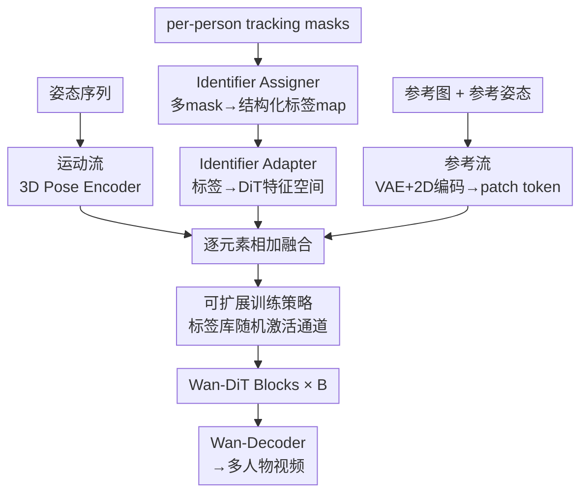

# MultiAnimate: Pose-Guided Image Animation Made Extensible

**会议**: CVPR 2026  
**论文**: [CVF Open Access](https://openaccess.thecvf.com/content/CVPR2026/html/Hu_MultiAnimate_Pose-Guided_Image_Animation_Made_Extensible_CVPR_2026_paper.html)  
**代码**: 项目页 https://hyc001.github.io/MultiAnimate/（代码待确认）  
**领域**: 视频生成  
**关键词**: 姿态引导动画, 多人物动画, 身份一致性, 扩散 Transformer, 可扩展训练

## 一句话总结
MultiAnimate 在 Wan2.1 DiT 视频生成框架上引入「Identifier Assigner + Identifier Adapter」一对模块，把每个人物的 tracking mask 编成结构化标签注入 DiT，再配合「从可学习标签库随机采样身份」的训练策略，让仅在双人数据上训练的模型也能稳定生成 3~7 人、身份不串、遮挡合理的舞蹈动画。

## 研究背景与动机
**领域现状**：姿态引导的人物图像动画（pose-guided human image animation）给一张参考图 + 一段骨架姿态序列，合成一段该人物按姿态运动的视频。近两年随着扩散模型、尤其是 DiT（Diffusion Transformer）视频骨干（Hunyuan-Video、Wan-Video）的成熟，单人物动画在身份保持和动作对齐上已经做得相当好。

**现有痛点**：绝大多数方法只服务**单人物**场景。把它们「自然地」推广到多人物时会塌：作者观察到两类失败——(1) **身份混淆**（identity confusion），两个人在交互后被换脸/换身份；(2) **不合理遮挡**（implausible occlusions），人物穿插时空间关系错乱（见论文 Fig.2a，UniAnimate-DiT 直接扩到双人就崩）。更糟的是，即便专门在双人数据上 fine-tune，模型也**绑死了人数**：训练时是两人，推理给三人就身份丢失（Fig.2b），想支持更多人就得重新采集对应人数的数据再训，成本极高甚至不可行。

**核心矛盾**：多人物动画里，**姿态与身份之间的关联是欠定的**。论文用一个很形象的例子说明（Fig.3）：两个人顺时针转 180° 交换位置后，"继续顺时针转 180° 回到原位"和"逆时针转 180° 回到原位"会产生几乎**完全相同的姿态序列**，但对应**两条不同的运动轨迹**。光有姿态序列定不下来谁是谁、该往哪走——必须额外提供 per-person 的空间线索（tracking mask）来把"人 ↔ 轨迹"的对应锁死。同时还存在**可扩展性**矛盾：固定人数训练 vs. 希望泛化到任意人数。

**本文目标**：设计一个既**鲁棒**（多人交互下保持各自身份与视觉保真）又**可泛化**（推理人数能超过训练人数）的人物动画框架。

**切入角度**：既然姿态本身欠定，就给每个人**显式分配一个唯一标识符（identifier）**，贯穿所有帧、嵌入 DiT 特征空间，让模型始终知道"哪个 token 属于哪个人"；再用一个"随机采样身份"的训练把标识符训练成彼此可区分，从而推理时凭空多出的身份也能被自然区分开。

**核心 idea**：用 **mask 驱动的标识符编码**（Identifier Assigner 把多张 mask 合成结构化标签 → Identifier Adapter 把标签注入 DiT）取代"逐人提特征再相加"的做法，配合**从大小为 n 的标签库随机激活通道**的可扩展训练，做到「双人训练、多人泛化」。

## 方法详解

### 整体框架
给定参考图 $I_{ref}\in\mathbb{R}^{3\times H\times W}$、驱动姿态序列 $P\in\mathbb{R}^{T\times3\times H\times W}$、以及一组 per-person tracking mask $\{M_i\}_{i=1}^{n}$（$M_i\in\mathbb{R}^{T\times1\times H\times W}$），目标是生成视频 $V_{tar}\in\mathbb{R}^{T\times3\times H\times W}$，要同时满足三点：保住 $I_{ref}$ 里每个人的身份、与姿态 $P$ 的运动对齐、与各 mask 的空间关系对齐。

整个 pipeline 建在 Wan2.1 I2V 架构上，由**两条流**组成、最后在 latent token 上**逐元素相加**融合：

- **参考流（Reference Stream）**：参考图 $I_{ref}$ 过 VAE Encoder 得 latent；从 $I_{ref}$ 抽出的参考姿态过一个 2D 卷积堆叠的 Image Encoder；二者相加后拼接随机噪声、patchify 成输入 token——负责"长什么样"（外观/身份）。
- **运动流（Motion Stream）**：姿态序列 $P$ 过 3D 卷积 Pose Encoder 捕捉时序动作；tracking mask $\{M_i\}$ 先过 **Identifier Assigner** 合成结构化标签，再过 **Identifier Adapter** 建模每人位置特征与人际空间关系；编码后的姿态与 mask 特征相加，再与参考流的 token 逐元素相加——负责"怎么动、谁在哪"。

融合后的 token 过 $B$ 个 Wan-DiT Block（self-attention + cross-attention），最后 Wan-Decoder 解码出目标视频。两个新模块 Identifier Assigner / Adapter 是全部创新所在，其余（VAE、Pose Encoder、DiT 骨干）沿用 Wan/UniAnimate-DiT。

### 关键设计

**1. Identifier Assigner：把一堆 per-person mask 压成一张带身份编号的结构化标签图**

痛点直击"逐人相加"方案的两个毛病：并发工作的做法是给每个人单独抽姿态+mask 特征、绑定后**求和聚合**，这既要为每个人额外抽一套姿态序列（数据处理麻烦），求和又会把不同人的空间关系糊掉。Identifier Assigner 反其道而行：它不分头处理，而是把所有 mask **统一进一张标签图** $L\in\mathbb{R}^{H\times W}$——背景像素记 0，人物 A、B 的 mask 中所有大于 0 的像素分别赋两个来自 **Identity Label Bank** 的、互不相同的非零标识符 $a,b$，得到取值在 $\{0,a,b\}$ 的标签图。再对 $L$ 做 one-hot 编码，得到二值张量 $\hat{L}\in\{0,1\}^{3\times H\times W}$，三个通道分别对应背景与两个人物、各自编码其空间占位。这样一张图就把"谁占哪块区域、人和人怎么挨着/遮挡"显式地保留下来，给后续生成提供了清晰的空间先验——这是它比"求和糊一起"更能保住人际空间关系的根本原因。

**2. Identifier Adapter：把结构化标签注入 DiT 特征空间，建模人际交互**

Assigner 产出的 $\hat{L}$ 还停留在像素标签层面，跟 DiT 的 latent 特征对不上。Identifier Adapter 由堆叠的 **3D 卷积**层构成，吃进 $\hat{L}$，把这份"谁在哪"的标签转换到 DiT 骨干的特征空间，同时建模每人的位置特征和彼此的邻近/遮挡等交互关系。它输出的身份线索随后与姿态特征相加、再融进 latent token，于是 DiT 在去噪每一帧时都"看得见"每个 token 归属哪个人。正是这种**显式身份编码贯穿所有帧**，让模型能在复杂多人交互中持续追踪各自身份，从源头上缓解了身份混淆。Adapter 的第一层 Conv3D 还内嵌了下面要讲的 Identifier Weight Bank，是可扩展训练的承载体。

**3. 可扩展训练策略：标签库随机采样 + 权重库通道激活，破解对称性、解锁人数泛化**

这是让"双人训练→多人泛化"成立的关键，也是为修两个具体毛病而生。第一个毛病是**对称性问题（symmetry issue）**：早期训练效果不错，但一旦推理时给人物分配的标签与训练时不同，结果就崩（Fig.5）。原因是模型偷懒——它把"某个人的位置"绑死到了 Adapter 的**某个固定通道**上，而不是绑到这个人的 tracking mask 上，这与"让模型认 mask、不认通道"的设计目标相悖。第二个毛病是**人数固定**：双人数据训出来的模型扩不到更多人。

解法统一在一个机制里：设推理最多支持 $n$ 人，就在 Identifier Adapter 的第一层 Conv3D 里放一个存有 $n$ 个标识符通道的 **Identifier Weight Bank**。双人训练时，每次迭代只**随机**从大小为 $n$ 的 Identity Label Bank 里给两个人各抽一个标签（含背景共激活 3 个通道），并用这两个标签去**激活 Weight Bank 中对应的权重**。训练收敛时，尽管数据自始至终只有双人视频，但 $n$ 个通道都被见过、都被训练成**彼此可区分**；推理时哪怕引入比训练更多的人和标识符，模型也能自然区分、维持各自身份。同时，因为标签是**随机分配**的，网络被逼着把人物与其**空间 mask**而非固定通道关联，对称性问题随之缓解。一举两得。

**4. 用现代视频模型合成高质量训练数据（Gen-dataset）**

真实多人舞蹈数据在帧质量上有局限，作者用 Wan 2.2 视频生成器合成了 2079 段五秒、含两到三人、场景多样的视频作为补充（Gen-dataset）。它既可单纯用作评测模型对不同场景的适应性，也可选择性地并入训练进一步增强鲁棒性。实验显示并入它能显著改善时序一致性（如手持武器不消失）和动态背景（背景随人物运动自然变化），让镜头过渡更真实。

### 损失函数 / 训练策略
两阶段 + 扩展版：以 Wan2.1 I2V 为底，Image/Pose Encoder 与 LoRA 用 UniAnimate-DiT 预训练权重初始化。**Stage 1** 在 Swing Dance 训练集上训 40 epoch / 7000 步，支持最多 3 人；**Stage 2** 在 Gen-dataset 上再训 3 epoch / 2400 步。另有 **Extended 模型**：在 Swing Dance 上训 24 epoch（4200 步），支持最多 7 人。训练用 2×A100 80GB，每卡 batch=1，学习率 $1\times10^{-4}$。姿态用 DWPose 抽、tracking mask 用 Sa2VA 抽。

## 实验关键数据

### 主实验
在 Swing Dance 测试集、Gen-dataset、以及未见过的网络舞蹈视频（3~7 人）上与 SOTA 对比，指标含 PSNR/SSIM/L1/LPIPS（帧级质量）与 FVD/FID-VID（视频级质量）。

| 数据集 | 方法 | PSNR↑ | SSIM↑ | LPIPS↓ | FVD↓ | FID-VID↓ |
|--------|------|-------|-------|--------|------|----------|
| Swing Dance | UniAnimate-DiT | 16.15 | 0.619 | 0.427 | 891.89 | 27.71 |
| Swing Dance | VACE | 11.15 | 0.311 | 0.563 | 763.75 | 29.88 |
| Swing Dance | **Ours (Stage 1)** | **19.40** | **0.687** | **0.335** | **648.84** | **22.50** |
| Unseen videos | UniAnimate-DiT | 17.94 | 0.751 | 0.286 | 624.45 | 71.24 |
| Unseen videos | VACE | 17.24 | 0.714 | 0.279 | 922.66 | 78.93 |
| Unseen videos | **Ours (Extended)** | **23.24** | **0.857** | **0.185** | **358.74** | **43.12** |

在以双人复杂交互为主的 Swing Dance 上，本文在全部指标上领先；在场景多样但动作简单的 Gen-dataset 上**不额外训练**也保持强势（仅 LPIPS/FID-VID 略逊，作者归因于对高多样性环境适应稍弱）；在交互更频繁、场景更难的 Unseen 视频上优势最明显——Extended 模型 FVD 从次优的 624.45 降到 358.74，证明从双人训练数据外推到复杂多人场景的泛化力。

### 消融实验
| 配置 | 结论 | 说明 |
|------|------|------|
| Addition-driven（逐人特征求和） | 双人 OK、多人崩 | 充分训练后能处理双人，但扩不到更多人 |
| Mask-driven（本文 Assigner+Adapter） | 双人多人都稳 | 保住 per-person 空间组织，多人可扩展性强 |
| w/o mask-driven design | 时序一致性差、难分三人 | 高亮人物维持不住一致性 |
| w/ mask-driven design | 一致 + 可外推三人 | 仅双人训练即可在生成视频中区分三人 |

单人兼容性（TikTok 数据集，模型未在其上训练）：

| 方法 | PSNR↑ | SSIM↑ | LPIPS↓ | FVD↓ | FID-VID↓ |
|------|-------|-------|--------|------|----------|
| DisPose | 17.17 | 0.691 | 0.261 | 615.27 | 64.74 |
| UniAnimate-DiT | 17.76 | 0.781 | 0.337 | 649.30 | 50.16 |
| **Ours** | **23.68** | **0.867** | 0.250 | **342.48** | **41.85** |

### 关键发现
- **mask 驱动 vs. 加法驱动**是全文最核心的对照：加法驱动「largely 避开」了对称性问题，但代价是**扩不出训练人数**；mask 驱动靠结构化标签保住空间组织，换来真正的可扩展性——这正是"双人训练、多人泛化"能成立的根。
- **随机标签采样**同时治两病：既让 $n$ 个身份通道都被训练成可区分（解锁人数泛化），又逼模型认 mask 不认固定通道（缓解对称性）。这是一个机制解两个问题的漂亮设计。
- **Gen-dataset 的价值在动态细节**：去掉它时手持武器会在运动中消失、背景近乎静止；加上后这些动态细节得以保持，说明合成数据主要补的是 motion-scene 交互的时序一致性。
- **单人不退化反提升**：引入 mask 驱动增加了训练复杂度，但单人任务上反而显著超过专做单人的基线（TikTok 上 PSNR 23.68 vs UniAnimate-DiT 17.76），说明显式身份建模对单人也有正迁移。

## 亮点与洞察
- **"姿态-身份欠定"这个问题提得漂亮**：用顺/逆时针转 180° 产生几乎相同姿态序列的例子，把"为什么多人动画必须要 tracking mask"讲得一针见血——这是全文动机的灵魂，也解释了为什么单人方法天然扩不动。
- **随机标签采样训练是可复用的 trick**：用一个比训练实例数更大的"身份库"+ 随机激活通道，让模型学到"区分任意多个实体"的能力而非"记住固定 K 个"，这种思路可迁移到任何"训练实例数 < 推理实例数"的可扩展生成/分割任务（如可变数量目标的布局生成、多实例编辑）。
- **结构化标签图 + one-hot 通道**把"多 mask 融合"从特征求和升级成空间显式编码，避免了求和把人际关系糊掉的根本缺陷，是"少即是多"的设计——一张标签图替掉一堆逐人特征分支。

## 局限与展望
- **训练数据偏窄**：核心训练集 Swing Dance 是双人舞蹈，场景/服饰/交互模式相对单一；Gen-dataset 又是 Wan 2.2 合成的，可能带合成偏置。论文也承认在高多样性的 Gen-dataset 上 LPIPS/FID-VID 略逊，说明对开放场景适应仍有限。
- **泛化人数虽宣称可达 7 人，但 7 人级别缺定量评测**：Extended 模型的定量表只到 Unseen videos 的综合指标，3~7 人不同人数下的逐级退化曲线没有给出，难判断人数增多时质量掉多少。
- **依赖外部 mask/姿态提取器**：tracking mask 来自 Sa2VA、姿态来自 DWPose，多人重度遮挡下这些上游若出错，错误会直接传导进生成。论文未分析上游噪声的鲁棒性。
- **可改进方向**：把"随机标签库"思路与身份外观 embedding（如人脸/服饰特征）结合，或许能从"区分谁是谁"进一步到"指定谁是谁"，支持更可控的多人编辑。

## 相关工作与启发
- **vs UniAnimate-DiT**：本文以它为底座（Encoder/LoRA 都用其权重初始化），区别在 UniAnimate-DiT 面向单人、直接扩双人就身份混淆；本文加 Identifier Assigner/Adapter + 随机标签训练，做到多人可扩展，并在单人任务上反超它。
- **vs DanceTogether**：同样联合用 mask 与 pose 特征建模多人空间关系，但（按本文 Fig.4/消融语境）那类并发工作走"逐人抽特征再求和"的加法路线，扩不出训练人数；本文用 mask 驱动的结构化标签换来真正的人数泛化。
- **vs Follow-Your-Pose v2 / StableAnimator / Champ**：这些靠光流、深度、SMPL 3D 先验或专用人脸编码器增强单人可控性与身份；本文不堆额外模态先验，而是聚焦"多人身份消歧 + 可扩展"这个被忽视的维度。

## 评分
- 新颖性: ⭐⭐⭐⭐ 首个建在现代 DiT 视频骨干上、可扩展到训练人数之外的多人物动画框架；"随机标签库"训练破解对称性与人数泛化的设计巧妙。
- 实验充分度: ⭐⭐⭐⭐ 三数据集主对比 + mask vs 加法 + 模块消融 + 单人兼容齐全；但 3~7 人逐级定量、上游噪声鲁棒性缺位。
- 写作质量: ⭐⭐⭐⭐ 用转 180° 的例子把欠定问题讲得极清楚，pipeline 与两病-一策的逻辑顺畅；个别图注/拼写有小瑕疵。
- 价值: ⭐⭐⭐⭐ "双人训练、多人泛化"显著降低多人数据采集成本，对影视/数字人多角色生成有直接实用价值。

<!-- RELATED:START -->

## 相关论文

- [\[CVPR 2026\] One-to-All Animation: Alignment-Free Character Animation and Image Pose Transfer](one-to-all_animation_alignment-free_character_animation_and_image_pose_transfer.md)
- [\[CVPR 2026\] PoseAnything: General Pose-guided Video Generation with Part-aware Temporal Coherence](poseanything_general_pose-guided_video_generation_with_part-aware_temporal_coher.md)
- [\[CVPR 2026\] PersonaLive! Expressive Portrait Image Animation for Live Streaming](personalive_expressive_portrait_image_animation_for_live_streaming.md)
- [\[CVPR 2026\] Identity-Preserving Image-to-Video Generation via Reward-Guided Optimization](identity-preserving_image-to-video_generation_via_reward-guided_optimization.md)
- [\[CVPR 2026\] Vanast: Virtual Try-On with Human Image Animation via Synthetic Triplet Supervision](vanast_virtual_try-on_with_human_image_animation_via_synthetic_triplet_supervisi.md)

<!-- RELATED:END -->
